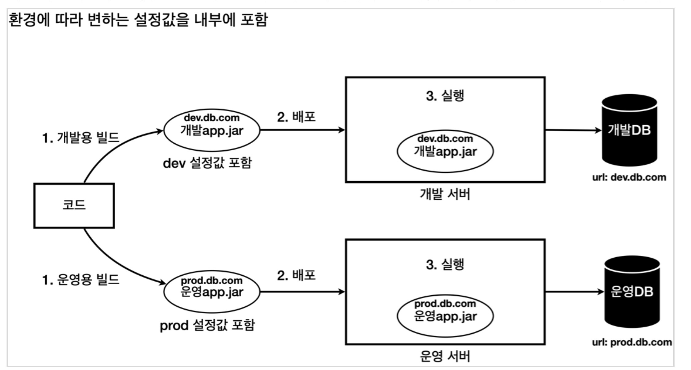
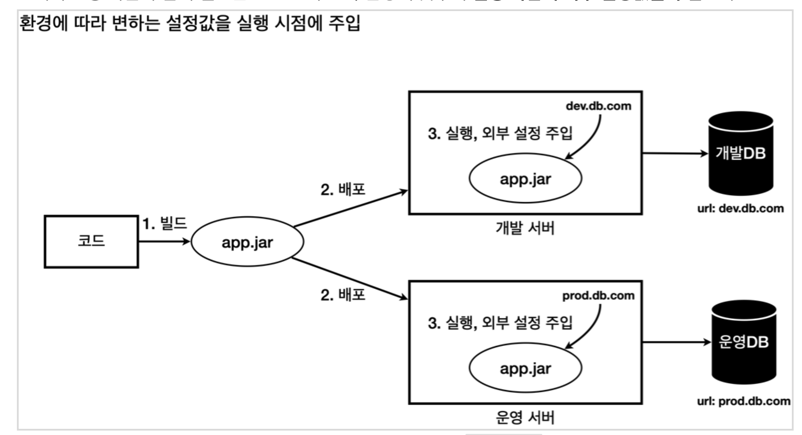
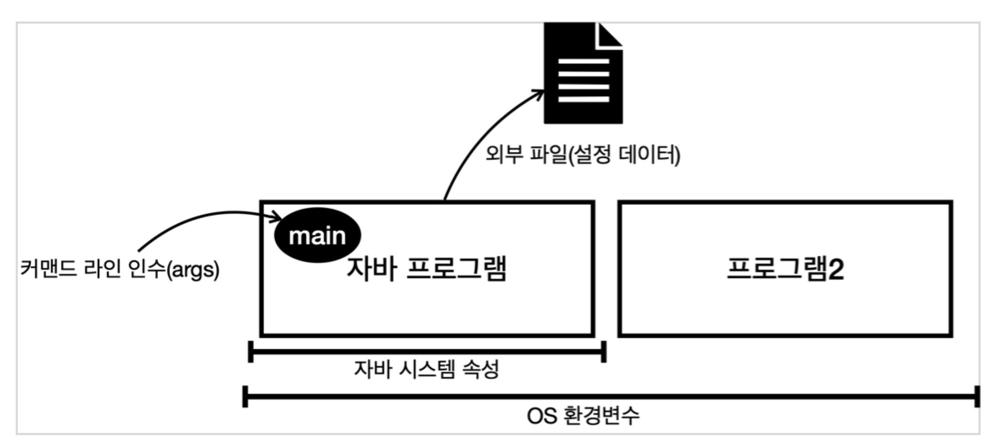
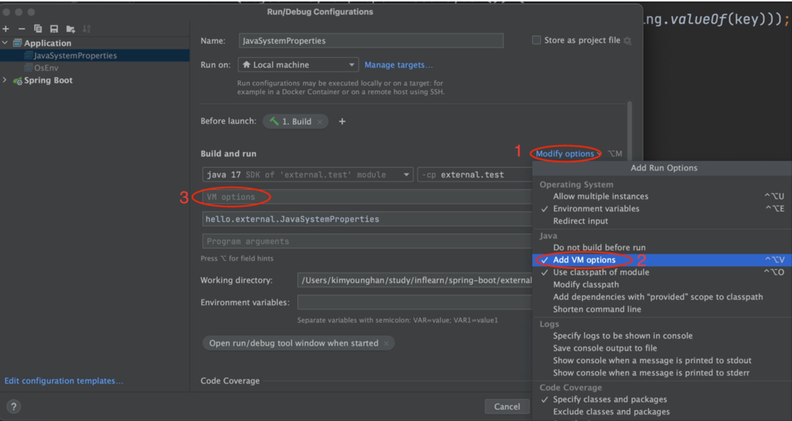
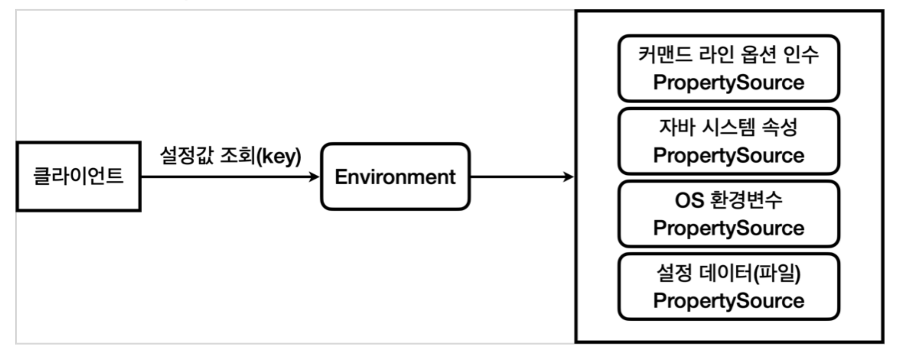

# 외부설정과 프로필


## 외부 설정이란?

* 개발 환경: 개발 서버, 개발 DB 사용
* 운영 환경: 운영 서버, 운영 DB 사용




각각의 환경에 맞는 개발app.jar , 운영app.jar 가 만들어지므로 해당 파일들을 각 환경별로 배포한다.

하지만 이것은 다음과 이유로 좋은 방법이 아니다.

* 환경에 따라서 빌드를 여러번 해야 한다.
* 개발 버전과 운영 버전의 빌드 결과물이 다르다. 따라서 개발 환경에서 검증이 되더라도 운영 환경에서 다른
  빌드 결과를 사용하기 때문에 예상치 못한 문제가 발생할 수 있다. 개발용 빌드가 끝나고 검증한 다음에
  운영용 빌드를 해야 하는데 그 사이에 누군가 다른 코드를 변경할 수도 있다. 한마디로 진짜 같은
  소스코드에서 나온 결과물인지 검증하기가 어렵다.
* 각 환경에 맞추어 최종 빌드가 되어 나온 빌드 결과물은 다른 환경에서 사용할 수 없어서 유연성이 떨어진다.
  향후 다른 환경이 필요하면 그곳에 맞도록 또 빌드를 해야 한다.

그래서 보통 다음과 같이 빌드는 한번만 하고 각 환경에 맞추어 `실행 시점`에 외부 설정값을 주입한다



**유지보수하기 좋은 애플리케이션 개발의 가장 기본 원칙은 변하는 것과 변하지 않는 것을 분리하는 것이다.**

 환경에 따라 변하는 외부 설정값은 분리하고, 변하지 않는 코드와 빌드 결과물은유지했다. 

덕분에 빌드 과정을 줄이고, 환경에 따른 유연성을 확보하게 되었다.


# 외부 설정 방법



* OS 환경 변수: OS에서 지원하는 외부 설정, 해당 OS를 사용하는 모든 프로세스에서 사용
* 자바 시스템 속성: 자바에서 지원하는 외부 설정, 해당 JVM안에서 사용
* 자바 커맨드 라인 인수: 커맨드 라인에서 전달하는 외부 설정, 실행시 main(args) 메서드에서 사용
* 외부 파일(설정 데이터): 프로그램에서 외부 파일을 직접 읽어서 사용
  * 애플리케이션에서 특정 위치의 파일을 읽도록 해둔다. 예) data/hello.txt
  * 그리고 각 서버마다 해당 파일안에 다른 설정 정보를 남겨둔다.
    * 개발 서버 hello.txt : url=dev.db.com
    * 운영 서버 hello.txt : url=prod.db.com

## 외부 설정 - OS 환경 변수

S 환경 변수(OS environment variables)는 해당 OS를 사용하는 모든 프로그램에서 읽을 수 있는 설정값이다. 

다른 외부 설정과 비교해서 사용 범위가 가장 넓다.

**조회 방법** - 명령어
윈도우 OS: set
MAC, 리눅스 OS: printenv

```sh
> printenv
```

출력

```
HOME=/Users/ysk
....
USER=ysk
XPC_SERVICE_NAME=0
LOGNAME=ysk
....
MVN=/Library/apache-maven-3.8.4
GOPATH=/Users/ysk/study/study_repo/...
SDKMAN_DIR=/Users/ysk/.sdkman
SDKMAN_VERSION=5.16.0
...
_=/usr/bin/printenv
....
```

## 자바 애플리케이션에서 OS 환경 변수를 읽는 방법

```java
@Slf4j
public class OsEnv {

	public static void main(String[] args) {
		Map<String, String> envMap = System.getenv();
		for (String key : envMap.keySet()) {
			log.info("env {}={}", key, System.getenv(key));
		}
	}
}
```

* System.getenv() 를 사용하면 전체 OS 환경 변수를 Map 으로 조회할 수 있다.
* System.getenv(key) 를 사용하면 특정 OS 환경 변수의 값을 String 으로 조회할 수 있다

출력

```
13:06:56.957 [main] INFO hello.external.OsEnv - env SDKMAN_CANDIDATES_API=https://api.sdkman.io/2
13:06:56.957 [main] INFO hello.external.OsEnv - env OLDPWD=/Users/ysk/study/study_repo/inf-spring-boot/project-v1
13:06:56.957 [main] INFO hello.external.OsEnv - env GOPATH=/Users/ysk/study/...
13:06:56.957 [main] INFO hello.external.OsEnv - env USER=ysk
13:06:56.957 [main] INFO hello.external.OsEnv - env ZSH=/Users/ysk/.oh-my-zsh
13:06:56.957 [main] INFO hello.external.OsEnv - env JAVA_MAIN_CLASS_13084=hello.external.OsEnv
13:06:56.957 [main] INFO hello.external.OsEnv - env HOME=/Users/ysk
... 생략
```

하지만 OS 환경 변수는 전역적이라서 이 프로그램 뿐만 아니라 다른 프로그램에서도 사용할 수 있다

사용할 때 주의해야 한다.


## 외부 설정 - 자바 시스템 속성 (Java System properties)

자바 시스템 속성(Java System properties)은 실행한 JVM 안에서 접근 가능한 외부 설정이다. 

* 추가로 자바가 내부에서 미리 설정해두고 사용하는 속성들도 있다


자바 시스템 속성은 다음과 같이 자바 프로그램을 실행할 때 사용한다.

* 예) `java -Durl=dev -jar app.jar`
* `-D` VM 옵션을 통해서 key=value 형식을 주면 된다. 이 예제는 url=dev 속성이 추가된다.
* 순서에 주의해야 한다. `-D 옵션이 - jar 보다 앞`에 있다


### JavaSystemProperties

```java
@Slf4j
public class JavaSystemProperties {
	
	public static void main(String[] args) {
		Properties properties = System.getProperties();
		for (Object key : properties.keySet()) {
			log.info("prop {}={}", key,
				System.getProperty(String.valueOf(key)));
		}
	}
	
}
```

* System.getProperties() 를 사용하면 Map 과 유사한( Map 의 자식 타입) key=value 형식의 Properties 를 받을 수 있다. 이것을 통해서 모든 자바 시스템 속성을 조회할 수 있다.
* System.getProperty(key) 를 사용하면 속성값을 조회할 수 있다.

출력

```
#JAVA 기본 설정 속성
prop java.specification.version=17
prop java.class.version=61.0
prop file.encoding=UTF-8
prop os.name=Mac OS X
prop sun.java.command=hello.external.JavaSystemProperties
```

사용자가 직접 정의하는 자바 시스템 속성을 추가해보자.

* url , username , password 를 조회하는 코드를 추가하자

IDE에서 실행시 VM 옵션 추가



1. Modify options를 선택한다.
2. Add VM options를 선택한다.
3. VM options에 다음을 추가한다.
-Durl=devdb -Dusername=dev_user -Dpassword=dev_pw

### Jar 실행
jar 로 빌드되어 있다면 실행시 다음과 같이 자바 시스템 속성을 추가할 수 있다

```
java -Durl=devdb -Dusername=dev_user -Dpassword=dev_pw -jar app.jar
```


## 자바 시스템 속성을 자바 코드로 설정하기

자바 시스템 속성은 앞서 본 것 처럼 -D 옵션을 통해 실행 시점에 전달하는 것도 가능하고, 다음과 같이
자바 코드 내부에서 추가하는 것도 가능하다. 코드에서 추가하면 이후에 조회시에 값을 조회할 수 있다.

* 설정: System.setProperty(propertyName, "propertyValue")
* 조회: System.getProperty(propertyName)


## 외부 설정 - 커맨드 라인 인수

커맨드 라인 인수(Command line arguments)는 애플리케이션 실행 시점에 외부 설정값을
main(args) 메서드의 args 파라미터로 전달하는 방법이다.

* 예) `java -jar app.jar dataA dataB`
* 필요한 데이터를 마지막 위치에 스페이스로 구분해서 전달하면 된다. 이 경우 dataA , dataB 2개의
  문자가 args 에 전달된다

## 외부 설정 - 커맨드 라인 옵션 인수와 스프링 부트 - ApplicationArguments

스프링 부트는 커맨드 라인을 포함해서 커맨드 라인 옵션 인수를 활용할 수 있는 ApplicationArguments
를 스프링 빈으로 등록해둔다. 그리고 그 안에 입력한 커맨드 라인을 저장해둔다

```java
@Slf4j
@Component
public class CommandLineBean {
	private final ApplicationArguments arguments;

	public CommandLineBean(ApplicationArguments arguments) {
		this.arguments = arguments;
	}

	@PostConstruct
	public void init() {
		log.info("source {}", List.of(arguments.getSourceArgs()));
		log.info("optionNames {}", arguments.getOptionNames());
		Set<String> optionNames = arguments.getOptionNames();
		for (String optionName : optionNames) {
			log.info("option args {}={}", optionName,
				arguments.getOptionValues(optionName));
		}
	}
}
```

실행 및 인수 입력

```
java -jar build/libs/external-0.0.1-SNAPSHOT.jar --url=devdb --username=dev_user --password=dev_pw mode=on
```

결과

```java
CommandLineBean: source [--url=devdb, --username=dev_user, --password=dev_pw,
mode=on]
CommandLineBean: optionNames [password, url, username]
CommandLineBean: option args password=[dev_pw]
CommandLineBean: option args url=[devdb]
CommandLineBean: option args username=[dev_user]
```


# 외부 설정 - 스프링 통합 -  Environment 와 PropertySource 

외부 설정값이 어디에 위치하든 상관없이 일관성 있고, 편리하게 key=value 형식의 외부 설정값을 읽을수 있도록

Environment 와 PropertySource라는 추상화를 통해서 해결한다. 



**PropertySource**
`org.springframework.core.env.PropertySource`

* 스프링은 PropertySource 라는 추상 클래스를 제공하고, 각각의 외부 설정를 조회하는
  XxxPropertySource 구현체를 만들어두었다.
  * 예)CommandLinePropertySource
  * SystemEnvironmentPropertySource
* 스프링은 로딩 시점에 필요한 PropertySource 들을 생성하고, Environment 에서 사용할 수 있게 연결해둔다.

**Environment**

`org.springframework.core.env.Environment`

* Environment 를 통해서 특정 외부 설정에 종속되지 않고, 일관성 있게 key=value 형식의 외부 설정에
  접근할 수 있다.
  * environment.getProperty(key) 를 통해서 값을 조회할 수 있다.
  * Environment 는 내부에서 여러 과정을 거쳐서 PropertySource 들에 접근한다.
  * 같은 값이 있을 경우를 대비해서 스프링은 미리 우선순위를 정해두었다.
* 모든 외부 설정은 이제 Environment 를 통해서 조회하면 된다.

> application.properties , application.yml 도 PropertySource 에 추가된다. 
>
> 따라서 Environment 를 통해서 접근할 수 있다.


### 우선순위

예를 들어서 커맨드 라인 옵션 인수와 자바 시스템 속성을 다음과 같이 중복해서 설정하면 어떻게 될까?

* 커맨드 라인 옵션 인수 실행

`--url=proddb --username=prod_user --password=prod_pw`

* 자바 시스템 속성 실행

`-Durl=devdb -Dusername=dev_user -Dpassword=dev_pw`

우선순위는 상식 선에서 딱 2가지만 기억하면 된다.더 유연한 것이 우선권을 가진다.

 (변경하기 어려운 파일 보다 실행시 원하는 값을 줄 수 있는 자바 시스템 속성이 더 우선권을 가진다.)

`범위가 넒은 것 보다 좁은 것이 우선권을 가진다`. (자바 시스템 속성은 해당 JVM 안에서 모두 접근할 수 있다. 

반면에 커맨드 라인 옵션 인수는 main 의 arg를 통해서 들어오기 때문에 접근 범위가 더 좁다.)

자바 시스템 속성과 커맨드 라인 옵션 인수의 경우 커맨드 라인 옵션 인수의 범위가 더 좁기 때문에 **커맨드 라인 옵션 인수**가 우선권을 가진다.


# 설정 데이터1 - 외부 파일

## 스프링과 설정 데이터

 application.properties 라는 이름의 파일을  스프링이 해당 파일을 읽어서 사용할 수 있는 PropertySource 의
구현체를 제공한다. 

스프링에서는 이러한 application.properties 파일을 설정 데이터(Config data) 라 한다

* 설정 데이터도 Environment 를 통해서 조회할 수 있다