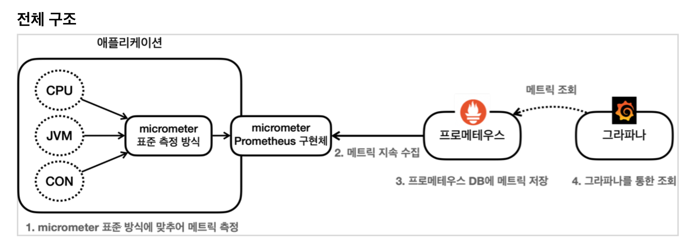

# 마이크로미터, 프로메테우스, 그라파나


## 모니터링 툴에 지표 전달


예를 들어서 CPU, JVM, 커넥션 정보 등을 JMX 툴에 전달한다고 가정해보자. 

그러면 각각의 정보를 JMX 모니터링 툴이 정한 포멧에 맞추어 측정하고 전달해야 한다


## 모니터링 툴 변경


중간에 사용하는 모니터링 툴을 변경하면 어떻게 될까?
기존에 측정했던 코드를 모두 변경한 툴에 맞도록 다시 변경해야 한다. 

개발자 입장에서는 단순히 툴 하나를 변경했을 뿐인데, 측정하는 코드까지 모두 변경해야 하는 문제가 발생한다.
이런 문제를 해결하는 것이 바로 `마이크로미터(Micrometer)라는 라이브러리이다`


# 마이크로미터 추상화


* 마이크로미터는 애플리케이션 메트릭 파사드라고 불리는데, 애플리케이션의 메트릭(측정 지표)을
  마이크로미터가 정한 표준 방법으로 모아서 제공해준다. (추상화)
* 보통은 스프링이 이런 추상화를 직접 만들어서 제공하지만, 마이크로미터라는 이미 잘 만들어진 추상화가있기 때문에 스프링은 이것을 활용한다. 스프링 부트 액츄에이터는 마이크로미터를 기본으로 내장해서 사용한다.
* 로그를 추상화 하는 SLF4J 를 떠올려보면 쉽게 이해가 될 것이다.
* 개발자는 마이크로미터가 정한 표준 방법으로 메트릭(측정 지표)를 전달하면 된다. 그리고 사용하는
  모니터링 툴에 맞는 구현체를 선택하면 된다. 이후에 모니터링 툴이 변경되어도 해당 구현체만 변경하면
  된다. 애플리케이션 코드는 모니터링 툴이 변경되어도 그대로 유지할 수 있다

### 마이크로미터가 지원하는 모니터링 툴

https://micrometer.io/docs

> AppOptics  
> AtlasCloudWatch  
> Datadog  
> Dynatrace  
> Elastic  
> Ganglia  
> Graphite  
> Humio  
> Influx  
> Instana  
> JMX  
> KairosDB  
> New Relic  
> Prometheus  
> SignalFx  
> Stackdriver  
> StatsD  
> Wavefront  

# 메트릭 확인하기

CPU, JVM, 커넥션 사용 등등 수 많은 지표들을 어떻게 수집해야 할까?   

개발자가 각각의 지표를 직접 수집해서 그것을 마이크로미터가 제공하는 표준 방법에 따라 등록하면 된다.  

* 마이크로미터는 다양한 지표 수집 기능을 이미 만들어서 제공한다

액츄에이터는 마이크로미터가 제공하는 지표 수집을 @AutoConfiguration 을 통해 자동으로 등록해준다.


## metrics 엔드포인트

http://localhost:8080/actuator/metrics

* 액추에이터가 마이크로미터를 통해서 등록한 기본 메트릭들을 확인할 수 있다.

metrics 엔드포인트는 다음과 같은 패턴을 사용해서 더 자세히 확인할 수 있다.

```
http://localhost:8080/actuator/metrics/{name}
```

JVM 메모리 사용량을 확인해보자.

http://localhost:8080/actuator/metrics/jvm.memory.used

```json

// http://localhost:8080/actuator/metrics/jvm.memory.used

{
  "name": "jvm.memory.used",
  "description": "The amount of used memory",
  "baseUnit": "bytes",
  "measurements": [
    {
      "statistic": "VALUE",
      "value": 144999792
    }
  ],
  "availableTags": [
    {
      "tag": "area",
      "values": [
        "heap",
        "nonheap"
      ]
    },
    {
      "tag": "id",
      "values": [
        "G1 Survivor Space",
        "Compressed Class Space",
        "Metaspace",
        "CodeCache",
        "G1 Old Gen",
        "G1 Eden Space"
      ]
    }
  ]
}
```

### Tag 필터

availableTags 를 보면 다음과 같은 항목을 확인할 수 있다.

```json
"availableTags": [
    {
      "tag": "area",
      "values": [
        "heap",
        "nonheap"
      ]
    },
    {
      "tag": "id",
      "values": [
        "G1 Survivor Space",
        "Compressed Class Space",
        "Metaspace",
        "CodeCache",
        "G1 Old Gen",
        "G1 Eden Space"
      ]
    }
  ]
```

* tag:area , values[heap, nonheap]
* tag:id , values[G1 Survivor Space, ...]

해당 Tag를 기반으로 정보를 필터링해서 확인할 수 있다.
`tag=KEY:VALUE` 과 같은 형식을 사용해야 한다

다음과 같이 실행해보자

http://localhost:8080/actuator/metrics/jvm.memory.used?tag=area:heap
http://localhost:8080/actuator/metrics/jvm.memory.used?tag=area:nonheap

`tag` 를 사용해서 힙 메모리, 힙이 아닌 메모리로 분류해서 데이터를 확인할 수 있다

```json
// http://localhost:8080/actuator/metrics/jvm.memory.used?tag=area:heap

{
  "name": "jvm.memory.used",
  "description": "The amount of used memory",
  "baseUnit": "bytes",
  "measurements": [
    {
      "statistic": "VALUE",
      "value": 30594208
    }
  ],
  "availableTags": [
    {
      "tag": "id",
      "values": [
        "G1 Survivor Space",
        "G1 Old Gen",
        "G1 Eden Space"
      ]
    }
  ]
}
```


## HTTP 요청수를 확인

http://localhost:8080/actuator/metrics/http.server.requests

```json
{
  "name": "http.server.requests",
  "baseUnit": "seconds",
  "measurements": [
    {
      "statistic": "COUNT",
      "value": 8.0
    },
    {
      "statistic": "TOTAL_TIME",
      "value": 0.17391787400000003
    },
    {
      "statistic": "MAX",
      "value": 0.009105791
    }
  ],
  "availableTags": [
    {
      "tag": "exception",
      "values": [
        "none"
      ]
    },
    {
      "tag": "method",
      "values": [
        "GET"
      ]
    },
    {
      "tag": "error",
      "values": [
        "none"
      ]
    },
    {
      "tag": "uri",
      "values": [
        "/actuator/httpexchanges",
        "/actuator/metrics/{requiredMetricName}",
        "/log",
        "/actuator",
        "/actuator/metrics"
      ]
    },
    {
      "tag": "outcome",
      "values": [
        "SUCCESS"
      ]
    },
    {
      "tag": "status",
      "values": [
        "200"
      ]
    }
  ]
}
```

HTTP 요청수에서 일부 내용을 필터링 해서 확인해보자.
/log 요청만 필터 (사전에 /log 요청을 해야 확인할 수 있음)

* http://localhost:8080/actuator/metrics/http.server.requests?tag=uri:/log

/log 요청 & HTTP Status = 200

* http://localhost:8080/actuator/metrics/http.server.requests?tag=uri:/log&tag=status:200


# 다양한 메트릭

마이크로미터와 액츄에이터가 기본으로 제공하는 다양한 메트릭을 확인해보자.

* JVM 메트릭
* 시스템 메트릭
* 애플리케이션 시작 메트릭
* 스프링 MVC 메트릭
* 톰캣 메트릭
* 데이터 소스 메트릭
* 로그 메트릭
* 사용자가 메트릭을 직접 정의하는 것도 가능하다. 


## JVM 메트릭

JVM 관련 메트릭을 제공한다.` jvm.` 으로 시작한다.

* 메모리 및 버퍼 풀 세부 정보
* 가비지 수집 관련 통계
* 스레드 활용
* 로드 및 언로드된 클래스 수
* JVM 버전 정보
* JIT 컴파일 시간


## 시스템 메트릭

시스템 메트릭을 제공한다. system. , process. , disk. 으로 시작한다

* CPU 지표
* 파일 디스크립터 메트릭
* 가동 시간 메트릭
* 사용 가능한 디스크 공간


## 애플리케이션 시작 메트릭

애플리케이션 시작 시간 메트릭을 제공한다.

* `application.started.time` : 애플리케이션을 시작하는데 걸리는 시간 ( ApplicationStartedEvent로 측정)
* `application.ready.time` : 애플리케이션이 요청을 처리할 준비가 되는데 걸리는 시간
  ( ApplicationReadyEvent 로 측정)
* 스프링은 내부에 여러 초기화 단계가 있고 각 단계별로 내부에서 애플리케이션 이벤트를 발행한다.
* `ApplicationStartedEvent` : 스프링 컨테이너가 완전히 실행된 상태이다. 이후에 커맨드 라인 러너가 호출된다.
* `ApplicationReadyEvent` : 커맨드 라인 러너가 실행된 이후에 호출된다

## 스프링 MVC 메트릭

스프링 MVC 컨트롤러가 처리하는 모든 요청을 다룬다.

메트릭 이름:` http.server.requests`


TAG 를 사용해서 다음 정보를 분류해서 확인할 수 있다.

* uri : 요청 URI
* method : GET , POST 같은 HTTP 메서드
* status : 200 , 400 , 500 같은 HTTP Status 코드
* exception : 예외
* outcome : 상태코드를 그룹으로 모아서 확인 
  * 1xx:INFORMATIONAL ,
  * 2xx:SUCCESS ,
  * 3xx:REDIRECTION , 
  * 4xx:CLIENT_ERROR , 
  * 5xx:SERVER_ERROR


## 데이터소스 메트릭 (DataSource )

DataSource , 커넥션 풀에 관한 메트릭을 확인할 수 있다.
jdbc.connections. 으로 시작한다.

최대 커넥션, 최소 커넥션, 활성 커넥션, 대기 커넥션 수 등을 확인할 수 있다.

히카리 커넥션 풀을 사용하면 hikaricp. 를 통해 히카리 커넥션 풀의 자세한 메트릭을 확인할 수 있다


## 로그 메트릭 (Log)

`logback.events `: logback 로그에 대한 메트릭을 확인할 수 있다.

trace , debug , info , warn , error 각각의 로그 레벨에 따른 로그 수를 확인할 수 있다.

예를 들어서 error 로그 수가 급격히 높아진다면 위험한 신호로 받아드릴 수 있다


## 톰캣 메트릭

톰캣 메트릭은 tomcat. 으로 시작한다.

톰캣 메트릭을 모두 사용하려면 다음 옵션을 켜야한다. 

* (옵션을 켜지 않으면 tomcat.session. 관련정보만 노출된다.)

```yml
server:
	tomcat:
		mbeanregistry:
			enabled: true
```

* 톰캣의 최대 쓰레드, 사용 쓰레드 수를 포함한 다양한 메트릭을 확인할 수 있다

```json
{
  "names": [
    ...
    "tomcat.cache.access",
    "tomcat.cache.hit",
    "tomcat.connections.config.max",
    "tomcat.connections.current",
    "tomcat.connections.keepalive.current",
    "tomcat.global.error",
    "tomcat.global.received",
    "tomcat.global.request",
    "tomcat.global.request.max",
    "tomcat.global.sent",
    "tomcat.servlet.error",
    "tomcat.servlet.request",
    "tomcat.servlet.request.max",
    "tomcat.sessions.active.current",
    "tomcat.sessions.active.max",
    "tomcat.sessions.alive.max",
    "tomcat.sessions.created",
    "tomcat.sessions.expired",
    "tomcat.sessions.rejected",
    "tomcat.threads.busy",
    "tomcat.threads.config.max",
    "tomcat.threads.current"
  ]
}
```


## 기타

* HTTP 클라이언트 메트릭( RestTemplate , WebClient )
* 캐시 메트릭
* 작업 실행과 스케줄 메트릭
* 스프링 데이터 리포지토리 메트릭
* 몽고DB 메트릭

* 레디스 메트릭

https://docs.spring.io/spring-boot/docs/current/reference/html/ actuator.html#actuator.metrics.supported


## 메트릭 보관

이러한 메트릭들을 어딘가에 지속해서 보관해야 과거의 데이터들도 확인할 수 있을 것이다.

 따라서 메트릭을 지속적으로 수집하고 보관할 데이터베이스가 필요하다.

 그리고 이러한 메트릭들을 그래프를 통해서 한눈에 쉽게 확인할 수 있는 대시보드도 필요하다


# 프로메테우스와 그라파나 소개


**프로메테우스**

애플리케이션에서 발생한 메트릭을 그 순간만 확인하는 것이 아니라 과거 이력까지 함께 확인하려면
메트릭을 보관하는 DB가 필요하다. 

이렇게 하려면 어디선가 메트릭을 지속해서 수집하고 DB에 저장해야한다. 프로메테우스가 바로 이런 역할을 담당한다


**그라파나**

프로메테우스가 DB라고 하면, 이 DB에 있는 데이터를 불러서 사용자가 보기 편하게 보여주는 대시보드가 필요하다. 

그라파나는 매우 유연하고, 데이터를 그래프로 보여주는 툴이다. 

수 많은 그래프를 제공하고, 프로메테우스를 포함한 다양한 데이터소스를 지원한다.


## 구조



1. 스프링 부트 액츄에이터와 마이크로미터를 사용하면 수 많은 메트릭을 자동으로 생성한다.
  * 마이크로미터 프로메테우스 구현체는 프로메테우스가 읽을 수 있는 포멧으로 메트릭을 생성한다.
2. 프로메테우스는 이렇게 만들어진 메트릭을 지속해서 수집한다.
3. 프로메테우스는 수집한 메트릭을 내부 DB에 저장한다.
4. 사용자는 그라파나 대시보드 툴을 통해 그래프로 편리하게 메트릭을 조회한다. 이때 필요한 데이터는
  프로메테우스를 통해서 조회한다.


## 프로메테우스 아키텍처

https://prometheus.io/docs/introduction/overview/


# 프로메테우스 - 설치

https://prometheus.io/download/

* MAC 사용자 - darwin-amd64 를 선택하면 된다

* docker도 지원한다.


프로메테우스 설치 디렉토리로 이동하여 다음 명령어를 입력한다

```
./prometheus
```

* 보안 설정도 진행해주면 좋다.

## 프로메테우스 - 애플리케이션 설정

프로메테우스는 메트릭을 수집하고 보관하는 DB이다. 프로메테우스가 우리 애플리케이션의 메트릭을
수집하도록 연동해보자. 

여기에는 2가지 작업이 필요하다.

1. 애플리케이션 설정: 프로메테우스가 애플리케이션의 메트릭을 가져갈 수 있도록 애플리케이션에서
프로메테우스 포멧에 맞추어 메트릭 만들기
2. 프로메테우스 설정: 프로메테우스가 우리 애플리케이션의 메트릭을 주기적으로 수집하도록 설정

프로메테우스가 애플리케이션의 메트릭을 가져가려면 프로메테우스가 사용하는 포멧에 맞추어 `메트릭을 만들어야 한다`.

* 프로메테우스는 /actuator/metrics 에서 보았던 포멧(JSON)은 이해하지 못한다.

* 하지만 프로메테우스 포멧에 대한 부분은 걱정할 것이 없다. 마이크로미터가 이런 부분은 모두 해결해준다


**build.gradle 추가**

```groovy
implementation 'io.micrometer:micrometer-registry-prometheus' //추가
```

* 마이크로미터 프로메테우스 구현 라이브러리를 추가한다.
* 이렇게 하면 스프링 부트와 액츄에이터가 자동으로 마이크로미터 프로메테우스 구현체를 등록해서
  동작하도록 설정해준다.
* 액츄에이터에 프로메테우스 메트릭 수집 엔드포인트가 자동으로 추가된다.
* /actuator/prometheus

실행
http://localhost:8080/actuator/prometheus

### 포멧 차이 (json - 프로메테우스)

* `jvm.info` -> ` jvm_info` : 프로메테우스는 . 대신에 _ 포멧을 사용한다.  대신에 _ 포멧으로 변환된 것을 확인할 수 있다.
* `logback.events` ->  `logback_events_total` : 로그수 처럼 지속해서 숫자가 증가하는 메트릭을
  카운터라 한다. 프로메테우스는 `카운터 메트릭`의 마지막에는 관례상 `_total` 을 붙인다.
* http.server.requests 이 메트릭은 내부에 요청수, 시간 합, 최대 시간 정보를 가지고 있었다.
  프로메테우스에서는 다음 3가지로 분리된다.
  * http_server_requests_seconds_count : 요청 수
  * http_server_requests_seconds_sum : 시간 합(요청수의 시간을 합함)
  * http_server_requests_seconds_max : 최대 시간(가장 오래걸린 요청 수)
* 대략 이렇게 포멧들이 변경된다고 보면 된다. 포멧 변경에 대한 부분은 진행하면서 자연스럽게 알아보자.


## 프로메테우스 - 수집 설정

프로메테우스가 애플리케이션의 /actuator/prometheus 를 호출해서 메트릭을 주기적으로 수집하도록 설정해보자.

프로메테우스 폴더에 있는 prometheus.yml 파일을 수정하자

prometheus.yml

```yml
# my global config
global:
  scrape_interval: 15s 
  evaluation_interval: 15s 
  
# Alertmanager configuration
alerting:
  alertmanagers:
    - static_configs:
        - targets:
          # - alertmanager:9093

# Load rules once and periodically evaluate them according to the global 'evaluation_interval'.
rule_files:
  # - "first_rules.yml"
  # - "second_rules.yml"

# A scrape configuration containing exactly one endpoint to scrape:
# Here it's Prometheus itself.
scrape_configs:
  # The job name is added as a label `job=<job_name>` to any timeseries scraped from this config.
  - job_name: "prometheus"

    static_configs:
      - targets: ["localhost:9090"]
  
  # 여기를 추가! 
  - job_name: "spring-actuator"
    metrics_path: '/actuator/prometheus'
    scrape_interval: 1s
    static_configs:
      - targets: ['localhost:8080']
```

추가한 부분은 다음과 같다.

```yml
#추가
- job_name: "spring-actuator"
  metrics_path: '/actuator/prometheus'
  scrape_interval: 1s
  static_configs:
    - targets: ['localhost:8080']
```

* 앞의 띄어쓰기 2칸에 유의하자
* job_name : 수집하는 이름이다. 임의의 이름을 사용하면 된다.
* metrics_path : 수집할 경로를 지정한다.
* scrape_interval : 수집할 주기를 설정한다.
* targets : 수집할 서버의 IP, PORT를 지정한다.

이렇게 설정하면 프로메테우스는 다음 경로를 1초에 한번씩 호출해서 애플리케이션의 메트릭들을 수집한다.

http://localhost:8080/actuator/prometheus

> 수집 주기의 기본 값은 1m 이다. 
>
> 수집 주기가 너무 짧으면 애플리케이션 성능에 영향을 줄 수 있으므로 운영에서는 10s ~ 1m 정도를 권장한다. (물론 시스템 상황에 따라서 다르다.)


설정후에 프로메테우스 서버를 재시작 한다.

프로메테우스 접속

http://localhost:9090/config

프로메테우스 메뉴 ->  Status Configuration 에 들어가서 prometheus.yml 에 입력한 부분이 추가되어 있는지 확인해보자.
http://localhost:9090/config


프로메테우스 메뉴 Status Targets 에 들어가서 연동이 잘 되었는지 확인하자.
http://localhost:9090/targets


* prometheus : 프로메테우스 자체에서 제공하는 메트릭 정보이다. (프로메테우스가 프로메테우스 자신의
  메트릭을 확인하는 것이다.)
* spring-actuator : 우리가 연동한 애플리케이션의 메트릭 정보이다.
* State 가 UP 으로 되어 있으면 정상이고, DOWN 으로 되어 있으면 연동이 안된 것이다.

# 프로메테우스를 통한 데이터 조회

localhost:9090/graph 에서 검색창에 검색을 하면 된다.


jvm_info를 검색창에 넣고 실행해보면 수집한 메트릭을 조회할 수 있다.


## 프로메테우스 - 기본 기능

기본기능: https://prometheus.io/docs/prometheus/latest/querying/basics/

연산자: https://prometheus.io/docs/prometheus/latest/querying/operators/

함수: https://prometheus.io/docs/prometheus/latest/querying/functions/

검색창에 http_server_requests_seconds_count 를 입력하고 실행해보자


* 태그, 레이블: error , exception , instance , job , method , outcome , status , uri 는 각각의
  * 메트릭 정보를 구분해서 사용하기 위한 태그이다. 
  * 마이크로미터에서는 이것을 태그(Tag)라 하고, 프로메테우스에서는 레이블(Label)이라 한다. 
* 숫자: 끝에 마지막에 보면 132 , 4 와 같은 숫자가 보인다. 이 숫자가 바로 해당 메트릭의 값이다

### 기본 기능

* Table -> Evaluation time 을 수정해서 과거 시간 조회 가능
* Graph 메트릭을 그래프로 조회 가능


### 필터

레이블을 기준으로 필터를 사용할 수 있다. 필터는 중괄호( {} ) 문법을 사용한다.

* 레이블 : 메트릭 정보를 구분해서 사용하기 위한 태그와 같은 의미

**레이블 일치 연산자**

* `=` 제공된 문자열과 정확히 동일한 레이블 선택
* `!=` 제공된 문자열과 같지 않은 레이블 선택
* `=~` 제공된 문자열과 정규식 일치하는 레이블 선택
* `!~` 제공된 문자열과 정규식 일치하지 않는 레이블 선택

만약 /actuator/prometeus 라는 uri를 제외하고 보고 싶다면?

```
http_server_requests_seconds_count{uri != "/actuator/prometheus"}
```

GET 또는 POST만 조회하고 싶다?

```
http_server_requests_seconds_count{method =~ "GET|POST" }
```

* 정규식을 넣을수도 있다.

* uri=/log , method=GET 조건으로 필터
  * http_server_requests_seconds_count{uri="/log", method="GET"}
* /actuator/prometheus 는 제외한 조건으로 필터
  * http_server_requests_seconds_count{uri!="/actuator/prometheus"}
* method 가 GET , POST 인 경우를 포함해서 필터
  * http_server_requests_seconds_count{method=~"GET|POST"}
* /actuator 로 시작하는 uri 는 제외한 조건으로 필터
  * http_server_requests_seconds_count{uri!~"/actuator.*"}

### 연산자 쿼리와 함수

다음과 같은 연산자를 지원한다.
+ `+`(덧셈)
- `-`(빼기)
* `*`(곱셈)
* `/` (분할)
* `%` (모듈로)
* `^` (승수/지수)

**sum**
값의 합계를 구한다.

```
sum(http_server_requests_seconds_count)
```

결과

```
{} 1959(개수는 바뀜)
```

**sum by**

```
sum by(method, status)(http_server_requests_seconds_count)
```

* SQL의 group by 기능과 유사하다.

결과

```
{method="GET", status="200"} 1995
```

**count**

```
count(http_server_requests_seconds_count)
```

* 메트릭 자체의 수 카운트

**topk**

```
topk(3, http_server_requests_seconds_count)
```

* 3이므로 상위 3개 메트릭 조회

**오프셋 수정자 (offset modifier)**

```
http_server_requests_seconds_count offset 10m
```

* `offset 10m` 과 같이 나타낸다. 
* 현재를 기준으로 특정 과거 시점의 데이터를 반환한다.

**범위 벡터 선택기**

```
http_server_requests_seconds_count[1m]
```

* 마지막에 [1m] , [60s] 와 같이 표현한다. 지난 1분간의 모든 기록값을 선택한다.
* 참고로 범위 벡터 선택기는 차트에 바로 표현할 수 없다. 데이터로는 확인할 수 있다.
*  범위 벡터 선택의 결과를 차트에 표현하기 위해서는 약간의 가공이 필요하다


# 프로메테우스 - 게이지와 카운터

메트릭은 크게 보면 게이지와 카운터라는 2가지로 분류할 수 있다.

**게이지(Gauge)**

* 임의로 오르내일 수 있는 값
* 예) CPU 사용량(system_cpu_usage ), 메모리 사용량, 사용중인 커넥션

**카운터(Counter)**

* 단순하게 증가하는 단일 누적 값
* 예) HTTP 요청 수, 로그 발생 수

게이지는 오르락 내리락 하는 값이고, 카운터는 특정 이벤트가 발생할 때 마다 그 수를 계속 누적하는 값이다


**카운터 예** 

예) http_server_requests_seconds_count{uri="/log"}

HTTP 요청 메트릭을 그래프를 볼때 카운터는 계속 누적해서 증가하는 값이다.

이렇게 증가만 하는 그래프는 특정 시간에 얼마나 고객의 요청이 들어왔는지 확인하기 어렵다.

이런 문제를 해결하기 위해 increase(), rate() 같은 함수를 지원한다

**increase()**
increase() 를 사용하면 이런 문제를 해결할 수 있다. 지정한 시간 단위별로 증가를 확인할 수 있다.

마지막에 [시간] 을 사용해서 범위 벡터를 선택해야 한다.

```
increase(http_server_requests_seconds_count{uri="/log"}[1m])
```

**rate()**

범위 백터에서 초당 평균 증가율을 계산한다.

increase() 가 숫자를 직접 카운트 한다면, rate() 는 여기에 초당 평균을 나누어서 계산한다.

`rate(data[1m])` 에서 [1m] 이라고 하면 60초가 기준이 되므로 60을 나눈 수이다.

`rate(data[2m])` 에서 [2m] 이라고 하면 120초가 기준이 되므로 120을 나눈 수이다

```
rate(http_server_requests_seconds_count{uri="/log"}[1m])
```

**irate()**

rate 와 유사한데, 범위 벡터에서 초당 순간 증가율을 계산한다. 급격하게 증가한 내용을 확인하기 좋다.

```
irate(http_server_requests_seconds_count{uri="/log")[1m])
```


# 그라파나

설치 : https://grafana.com/grafana/download

실행 - 그라파나 설치 디렉토리의 bin 으로 이동 

```
./grafana-server
```

* http://localhost:3000
* email or username: admin
* Password: admin


그라파나는 프로메테우스를 통해서 데이터를 조회하고 보여주는 역할을 한다. 그라파나는 대시보드의 껍데기 역할을 한다.

**그라파나 데이터소스 추가 화면**

* http://localhost:3000/datasources 로 이동


* 왼쪽 하단에 있는 설정(Configuration) 버튼에서 Data sources를 선택한다.
* Add data source 를 선택한다.
* Prometheus를 선택한다.

**Prometheus 데이터 소스 설정**

* 설정한 url을 입력한다. 현재 설정은 http://localhost:9090
* 나머지는 특별히 고칠 부분이 없다면 그대로 두고 Save & test 를 선택한다

* Data source is working 이라는 문구가 나오면 성공한것.

## 그라파나 - 대시보드 만들기

먼저 다음 3가지를 꼭 수행해두어야 한다.

* 애플리케이션 실행
* 프로메테우스 실행
* 그라파나 실행

### 대시보드 저장

1. 왼쪽 Dashboards 메뉴 선택
2. New 버튼 선택 New Dashboard 선택
3. 오른쪽 상단의 Save dashboard 저장 버튼(disk 모양) 선택
4. Dashboard name: hello dashboard를 입력하고 저장

### 대시보드 확인

1. 왼쪽 Dashboards 메뉴 선택
2. 앞서 만든 hello dashboard 선택

## 패널 만들기

### 대시보드에 패널 만들기

대시보드가 큰 틀이라면 패널은 그 안에 모듈처럼 들어가는 실제 그래프를 보여주는 컴포넌트이다.
1. 오른쪽 상단의 Add panel 버튼(차트 모양) 또는 add visualization 선택
   * 
2. 패널의 정보를 입력할 수 있는 화면이 나타난다.
3. 아래에 보면 Run queries 버튼 오른쪽에 Builder , Code 라는 버튼이 보이는데, Code 를 선택하자.
4. Enter a PromQL query... 이라는 부분에 메트릭을 입력하면 된다

### CPU 메트릭 만들기

다음 메트릭을 패널에 추가해보자.

* system_cpu_usage : 시스템의 CPU 사용량
* process_cpu_usage : JVM 프로세스 CPU 사용량

메트릭을 추가하려면 화면 하단의 `+ Query` 버튼을 선택해야 한다

**그래프의 데이터 이름 변경**

패널 그래프 하단을 보면 범례(Legend)라고 하는 차트에 제공하는 데이터 종류를 구분하는 텍스트가 JSON으로 표시되어 있다

이부분을 수정할 수 있다.

1. system_cpu_usage 를 입력한 곳에 가서 하단의 Options 를 선택한다.
2. Legend 를 선택하고 Custom을 선택한다. system cpu 를 입력한다.

**패널 이름 설정**

오른쪽에 보면 Panel options 라는 부분을 확인할 수 있다. 다음과 같이 수정하자

* Title : CPU 사용량

**패널 저장하기**

화면 오른쪽 상단의 Save 또는 Apply 버튼을 선택한다.

** 디스크 사용량을 PromQL로 나타내기**

사용 디스크 용량을 알고 싶다.

* 사용 디스크 용량 = 전체 디스크 용량 - 남은 디스크 용량

query에 다음과 같이 사용할 수 있다

```
disk_total_bytes - disk_free_bytes
```


**그래프 데이터 사이즈 변경**

 데이터 사이즈가 byte에서 옵션에서 GB, TB 단위로 바꿀 수 있다. 

오른쪽 옵션 창을 확인하자

* Standard options -> Unit ->  Data -> bytes(SI) 를 선택하자.
* GB, TB 단위로 읽기 편하게 변한 것을 확인할 수 있다

**최소값 변경**

그래프는 현재 상태에 최적화가 된다. 하지만 디스크 사용량은 0부터 시작하는 것도 좋겠다.

* 오른쪽 옵션 창을 확인하자

* Standard options -> Min 0 을 선택하자.
* 그래프가 0부터 시작하는 것을 확인할 수 있다


이제 앞서 학습한 다음과 같은 메트릭을 하나하나 추가하면 된다.

* JVM 메트릭
* 시스템 메트릭
* 애플리케이션 시작 메트릭
* 스프링 MVC
* 톰캣 메트릭
* 데이터 소스 메트릭
* 로그 메트릭
* 기타 메트릭

그런데 이렇게 하나하나 직접 대시보드를 입력하는 것도 참으로 힘든 일이다. 

그라파나는 이미 만들어둔 대시보드를 가져다가 사용할 수 있는 기능을 제공한다.

# 그라파나 - 공유 대시보드 활용

* https://grafana.com/grafana/dashboards

이미 누군가 만들어둔 수 많은 대시보드가 공개되어 있다.

우리는 스프링 부트와 마이크로미터를 사용해서 만든 대시보드를 가져다가 사용해보자

검색창에 spring이라고 검색해보면 다양한 대시보드를 확인할 수 있다


## 스프링 부트 시스템 모니터 대시보드 불러오기

https://grafana.com/grafana/dashboards/11378-justai-system-monitor/

사이트에 접속한 다음에 Copy Id to clipboard 를 선택하자. 

또는 ID: 11378 이라고 되어 있는 부분의 숫자를 저장하자

* id값을 저장한다

### 대시보드 불러오기

그라파나에 접속하자
1. 왼쪽 Dashboards 메뉴 선택
2. New 버튼 선택 Import 선택
3. 불러올 대시보드 숫자( 11378 )를 입력하고 Load 버튼 선택
4. Prometheus 데이터소스를 선택하고 Import 버튼 선택


대시보드를 확인해보면 거의 대부분의 메트릭을 대시보드에 표현한 것을 확인할 수 있다. 각각의 항목들을
보고 대시보드를 어떻게 구성해야 하는지도 학습할 수 있다. 

참고로 일부 데이터의 경우 스프링 부트나 기타 라이브러리의 버전이 변함에 따라서 동작하지 않는 기능들도 있다. 

이런 부분들은 수정해서 사용하자.


### 불러온 대시보드 수정하기

* 대시보드를 수정하려면 먼저 수정모드로 변경해야 한다.
* 오른쪽 상단의 설정 버튼(톱니바퀴, Dashboard settings)을 선택
*  `Make editable` 선택

또는

* 대시보드 화면에서 특정 패널에 마우스를 올리면 패널 오른쪽 상단에 ...이 생긴다. edit을 클릭한다


### Jetty 통계 Tomcat 통계

이 대시보드는 톰캣이 아니라 Jetty라는 웹 서버를 기준으로 통계를 수집한다. 이 부분을 수정하자.

Jetty Statistics 부분으로 이동한 다음 설정 버튼을 통해 Title을 Tomcat Statistics로 변경한다

**Thread Config Max 패널 설정 변경**

jetty_threads_config_max 를 -> tomcat_threads_config_max_threads 로 변경


**Thread 패널 설정 변경**

* jetty_threads_current -> tomcat_threads_current_threads

* jetty_threads_busy -> tomcat_threads_busy_threads

* jetty_threads_idle 제거

* jetty_threads_jobs 제거


## 마이크로미터 대시보드 불러오기

다음 대시보드도 유용한 많은 정보를 제공한다. 이 대시보드도 추가해서 사용하자.

* https://grafana.com/grafana/dashboards/4701-jvm-micrometer/


# 그라파나 - 메트릭을 통한 문제 확인

애플리케이션에 문제가 발생했을 때 그라파나를 통해서 어떻게 모니터링 하는지 확인해보자.
실제 우리가 작성한 애플리케이션에 직접 문제를 발생시킨 다음에 그라파나를 통해서 문제를 어떻게
모니터링 할 수 있는지 확인해보자.

실무에서 주로 많이 발생하는 다음 4가지 대표적인 예시를 확인해보자.

* CPU 사용량 초과
* JVM 메모리 사용량 초과
* 커넥션 풀 고갈
* 에러 로그 급증


## CPU 사용량 초과

CPU에 간단히 부하를 주는 코드

```java
@Slf4j
@RestController
public class TrafficController {
	
  @GetMapping("/cpu")
	public String cpu() {
		log.info("cpu");
		long value =0;
		for (long i = 0; i < 100000000000L; i++) {
			value++;}
		return "ok value=" + value;
	
  }
}
```

 -> hello dashboard 에서 확인 

## JVM 메모리 사용량 초과

메모리 사용을 누적하는 코드

```java
private List<String> list = new ArrayList<>();

@GetMapping("/jvm")
public String jvm() {
	log.info("jvm");
	for (int i = 0; i < 1000000; i++) {
		list.add("hello jvm!" + i);
	}
	return "ok";
}
```


## 커넥션 풀 고갈 (connection pool)

```java
@Autowired DataSource dataSource;
@GetMapping("/jdbc")
public String jdbc() throws SQLException {
	log.info("jdbc");
	Connection conn = dataSource.getConnection();
	log.info("connection info={}", conn);
	//conn.close(); //커넥션을 닫지 않는다.
	return "ok";
}
```

Active 커넥션이 커넥션 풀의 최대 숫자인 10개를 넘어가게 되면, 커넥션을 획득하기 위해 대기(Pending)
하게 된다. 

그래서 커넥션 획득 부분에서 쓰레드가 대기하게 되고 결과적으로 HTTP 요청을 응답하지 못한다

DB 커넥션을 획득하기 위해 대기하던 톰캣 쓰레드가 30초 이상 DB 커넥션을 획득하지 못하면 다음과 같은 예외가 발생하면서 커넥션 획득을 포기한다.

```
Connection is not available, request timed out after 30004ms.
```

## 에러 로그 급증

애플리케이션에서 ERROR 레벨의 로그가 급증한다면 심각한 문제가 발생한 것으로 이해할 수 있다

```java
@GetMapping("/error-log")
public String errorLog() {
	log.error("error log");
	return "error";
}
```

ERROR Logs , logback_events_total 메트릭에서 ERROR 로그가 급증하는 것을 확인할 수 있다