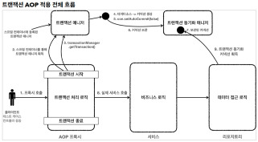

# 인프런 Spring DB 1편 - 데이터 접근 핵심 원리 - 김영한 님

전체 목차
1. JDBC 이해
2. 커넥션풀과 데이터소스 이해
3. 트랜잭션 이해
4. 스프링과 문제 해결 - 트랜잭션
5. 자바 예외 이해
6. 스프링과 문제 해결 - 예외 처리, 반복
&. 다음으로


## H2 DB 설정

* h2 버전 : https://www.h2database.com/html/download-archive.html
* MAC, 리눅스 사용자
  * 권한 : chmod 777 h2.sh
  * 실행 : ./h2.sh

### Database "/Users/ysk/test" not found, either pre-create it or allow remote database creation (not recommended in secure environments) [90149-200]  오류가 난다면? 
* /Users/ysk/test 경로에 빈 텍스트 파일을 생성하고 파일명을 확장자 포함하여 'test.mv.db'로 바꾸고 재시도
  * 참고 : https://bit.ly/3fX6ygx


* 데이터베이스 파일 생성 방법
  * 사용자명은 sa 입력
  * JDBC URL에 다음 입력,
  * jdbc:h2:~/test (최초 한번) 이 경우 연결 시험 을 호출하면 오류가 발생한다. 연결 을 직접
  * 눌러주어야 한다.
  * ~/test.mv.db 파일 생성 확인
  * 이후부터는 jdbc:h2:tcp://localhost/~/test 이렇게 접속


# JDBC 이해

* 애플리케이션 서버와 DB - 일반적인 사용법
1. 커넥션 연결: 주로 TCP/IP를 사용해서 커넥션을 연결한다.
2. SQL 전달: 애플리케이션 서버는 DB가 이해할 수 있는 SQL을 연결된 커넥션을 통해 DB에 전달한다.
3. 결과 응답: DB는 전달된 SQL을 수행하고 그 결과를 응답한다. 애플리케이션 서버는 응답 결과를 활용한다

## JDBC 표준 인터페이스
* 자바에서 데이터베이스에 접속할 수 있도록 하는 자바 API
* 다음 3가지 기능을 표준 `인터페이스`로 정의해서 제공 - 인터페이스로 제공하므로 각 데이터베이스마다 구현 가능.
  * java.sql.Connection : 연결
  * java.sql.Statement : SQL을 담은 내용
  * java.sql.ResultSet : SQL 요청 응답

* JDBC 드라이버 : 각 DB에 맞도록 구현해서 라이브로 제공하는 것
  * MYSQL JDBC 드라이버
  * Oracle JDBC 드라이버 등

DBC의 등장으로 다음 2가지 문제가 해결되었다.
1. 데이터베이스를 다른 종류의 데이터베이스로 변경하면 애플리케이션 서버의 데이터베이스 사용 코드도
   함께 변경해야하는 문제
   * 애플리케이션 로직은 이제 JDBC 표준 인터페이스에만 의존한다. 
   * 따라서 데이터베이스를 다른 종류의 데이터베이스로 변경하고 싶으면 JDBC 구현 라이브러리만 변경하면 된다. 
   * 따라서 다른 종류의 데이터베이스로 변경해도 애플리케이션 서버의 사용 코드를 그대로 유지할 수 있다.

2. 개발자가 각각의 데이터베이스마다 커넥션 연결, SQL 전달, 그리고 그 결과를 응답 받는 방법을 새로
   학습해야하는 문제
   * 개발자는 JDBC 표준 인터페이스 사용법만 학습하면 된다. 한번 배워두면 수십개의 데이터베이스에
   모두 동일하게 적용할 수 있다

## SQL Mapperd와 ORM 기술

* SQL Mapper
  * 장점 
    * JDBC 편리하게 사용 가능
    * SQL 응답 결과를 객체로 편리하게 변환
    * JDBC 반복 코드 제거
  * 단점
    * 개발자가 직접 SQL 작성
  * 대표 기술 : Spring JdbcTemplate, MyBatis

* ORM - Object Relational Mapping (객체 - 관계 - 매핑)
  * 
  * 객체를 관계형 데이터베이스 테이블과 매핑 해주는 기술.
  * 반복적인 SQL을 직접 작성하지 않고, ORM 기술이 개발자 대신에 SQL을 동적으로 만들어 실행.
    * 각각의 DB 마다 다른 SQL 사용하는 문제도 해결. 
  * 대표 기술 : JPA, 하이버네이트, 이클립스 링크
  * JPA는 자바 진영의 ORM 표준 인터페이스이고, 이것을 구현한 것이 하이버네이트와 이클립스 링크.

## JDBC DriverManager 연결 이해

* JDBC 는 java.sql.Connection 표준 커넥션 인터페이스를 정의한다.
* 각 DB Drvier는 JDBC Connection dㅣㄴ터페이스를 구현한 구현체를 제공한다.

* DriverManager 커넥션 요청 흐름
* 
    1. 애플리케이션 로직에서 커넥션이 필요하면 DriverManager.getConnection()을 호출
    2. DriverManager는 라이브러리에 등록된 드라이버 목록을 자동으로 인식.
       * 각 드라이버는 URL 정보를 체크해서 본인이 처리할 수 있는 요청인지 확인.
       * URL이 jdbc:h2로 시작했는데 MySQL 드라이버가 먼저 실행되면 이 경우 본인이 처리 불가하다는 결과 반환.
       * 다음 드라이버에게 순서가 넘어감.

```java
public Member save(Member member) throws SQLException {
        String sql = "insert into member(member_id, money) vales(?, ?)";

        Connection con = null;
        PreparedStatement pstmt = null;

        try {
            con = getConnection();
            pstmt = con.prepareStatement(sql);
            pstmt.setString(1, member.getMemberId());
            pstmt.setInt(2, member.getMoney());
            pstmt.executeUpdate();
            return member;
        } catch (SQLException e) {
            log.error("db error", e);
            throw e;
        } finally {
            close(con, pstmt, null);
        }

    }
```

* PreparedStatement.executeUpdate() : Statement 를 통해 준비된 SQL을 커넥션을 통해 실제 데이터베이스에
  전달한다. 
  * executeUpdate() 은 int 를 반환하는데 영향받은 DB row 수를 반환한다. 

* `리소스 정리`
> 리소스를 정리할 때는 항상 역순으로 해야한다.   
> Connection 을 먼저 획득하고 Connection 을 통해 PreparedStatement 를 만들었기 때문에,  
> 리소스를 반환할 때는 PreparedStatement 를 먼저 종료하고, 그 다음에 Connection 을 종료하면 된다.  
> 참고로 여기서 사용하지 않은 ResultSet 은 결과를 조회할 때 사용한다

* PreparedStatement.executeQuery() : 데이터를 조회할 때 사용. 결과를 ResultSet에 담아서 반환.

### ResultSet
* ResultSet은 Select 쿼리의 결과가 들어있는 객체.
* 순서대로 들어간다
  * 조회한 컬럼 순서대로 데이터가 저장
  * select * 을 사용하면 테이블의 모든 컬럼을 다 지정
* 커서(cursor)를 이동해서 다음 데이터를 조회할 수 있다.
* resultSet.next() : 호출 시 커서가 다음으로 이동.
  * 최초 커서는 데이터를 가리키고 있지 않음. 최초 한 번은 호출해야 데이터 조회 가능
  * 리턴값이 true : 이동 결과 데이터가 있음.
  * 리턴값이 false : 더 이상 커서가 가리키는 데이터가 없음 

* ResultSet 조회 결과가 List라면 While문으로 꺼내면 된다.

# 커넥션 풀과 데이터소스

* 데이터베이스와 연동해서 데이터를 저장 및 조회 하려면 커넥션을 얻어야 한다

* 
* 하지만 데이터 베이스 커넥션을 획득할 떄는 다음과 같은 복잡한 과정을 거친다
1. 애플리케이션 로직은 DB 드라이버를 통해 커넥션을 조회한다.
2. DB 드라이버는 DB와 TCP/IP 커넥션을 연결한다. 물론 이 과정에서 3 way handshake 같은 TCP/IP
   연결을 위한 네트워크 동작이 발생한다.
3. DB 드라이버는 TCP/IP 커넥션이 연결되면 ID, PW와 기타 부가정보를 DB에 전달한다.
4. DB는 ID, PW를 통해 내부 인증을 완료하고, 내부에 DB 세션을 생성한다.
5. DB는 커넥션 생성이 완료되었다는 응답을 보낸다.
6. DB 드라이버는 커넥션 객체를 생성해서 클라이언트에 반환한다

* 커넥션을 새로 만드는 것은 과정도 복잡하고 시간도 많이 소모되는 일이다.
  * DB는 물론이고 Application Server에서도 TCP/IP 커넥션을 새로 생성하기 위한 리소스를 매번 사용해야 한다
  * 응답속도가 느려질 수 있다.

* 커넥션 문제를 해결하기 위해 커넥션을 미리 생성해두고 사용하는 `커넥션 풀` 방법이다.
* 커넥션 풀은 커넥션들을 미리 생성해놓고 관리하는것이다
* 애플리케이션을 시작하는 시점에 커넥션 풀은 필요한 만큼 커넥션을 미리 확보해서 풀에 보관한다.
  * 얼마나 보관할지는 서비스의 특징과 서버 스펙에 따라 다르지만 기본값은 보통 10개
* 

* 커넥션 풀에 들어있는 커넥션은 TCP/IP로 DB와 커넥션이 연결되어 있는 상태이기 때문에 언제든지 즉시 SQL을 DB에 전달할 수 있다.

* 애플리케이션은 커넥션 풀을 통해 이미 생성되어 있는 커넥션을 `객체 참조`로 그냥 가져다 쓰면 된다.
* 커넥션 풀에 커넥션을 요청하면 커넥션 풀은 자신이 가지고 있는 커넥션중에 하나를 반환한다.
* 애플리케이션 로직은 커넥션풀에서 받은 커넥션을 사용해서 SQL을 데이터베이스에 전달하고 그 결과를 받아서 처리한다.
* 커넥션을 모두 사용하고 나면 커넥션을 종료하는 것이 아니라 다음에 다시 사용할 수 있도록 해당 커넥션을 그대로 커넥션 풀이 반환하면 된다.
  * 커넥션을 종료하는 것이 아니라 커넥션이 살아있는 상태로 풀에 반환.

### 정리
* 적절한 커넥션 풀 숫자는 서비스의 특징과 애플리케이션 서버 스펙, DB 서버 스펙에 따라 다르기 때문에
성능 테스트를 통해서 정해야 한다.
* 커넥션 풀은 서버당 최대 커넥션 수를 제한할 수 있다. 따라서 DB에 무한정 연결이 생성되는 것을
막아주어서 DB를 보호하는 효과도 있다.
* 이런 커넥션 풀은 얻는 이점이 매우 크기 때문에 실무에서는 항상 기본으로 사용한다.
* 커넥션 풀은 개념적으로 단순해서 직접 구현할 수도 있지만, 사용도 편리하고 성능도 뛰어난 오픈소스커넥션 풀이 많기 때문에 오픈소스를 사용하는 것이 좋다.
* 대표적인 커넥션 풀 오픈소스는 commons-dbcp2 , tomcat-jdbc pool , HikariCP 등이 있다.
* 성능과 사용의 편리함 측면에서 최근에는 hikariCP 를 주로 사용한다. 스프링 부트 2.0 부터는 기본
커넥션 풀로 hikariCP 를 제공한다. 성능, 사용의 편리함, 안전성 측면에서 이미 검증이 되었기 때문에
커넥션 풀을 사용할 때는 고민할 것 없이 hikariCP 를 사용하면 된다. 실무에서도 레거시 프로젝트가 아닌
이상 대부분 hikariCP 를 사용한다.


## DataSource 이해 
* 
* 예를 들어 애플리케이션 로직에서 DriverManager를 사용해서 커넥션을 획득하다가 HikariCP 같은 커넥션 풀을 사용하도록 변경하면 커넥션을 획득하는 애플리케이션 코드도 함께 변경해야 한다.
* 의존관계가 `DriverManager`에서 `HikariCP` 등으로 변경되기 때문

* 커넥션을 획득하는 방법을 추상화 하면 된다.
* 
* javax.sql.DataSource 인터페이스.

### 정리
* 대부분의 커넥션 풀은 DataSource 인터페이스를 이미 구현해두었다. 따라서 개발자는 DBCP2 커넥션 풀 ,
HikariCP 커넥션 풀 의 코드를 직접 의존하는 것이 아니라 DataSource 인터페이스에만 의존하도록
애플리케이션 로직을 작성하면 된다.
* 커넥션 풀 구현 기술을 변경하고 싶으면 해당 구현체로 갈아끼우기만 하면 된다.
* DriverManager 는 DataSource 인터페이스를 사용하지 않는다. 따라서 DriverManager 는 직접
사용해야 한다. 따라서 DriverManager 를 사용하다가 DataSource 기반의 커넥션 풀을 사용하도록
변경하면 관련 코드를 다 고쳐야 한다. 이런 문제를 해결하기 위해 스프링은 DriverManager 도
DataSource 를 통해서 사용할 수 있도록 DriverManagerDataSource 라는 DataSource 를 구현한
클래스를 제공한다.
* 자바는 DataSource 를 통해 커넥션을 획득하는 방법을 추상화했다. 이제 애플리케이션 로직은
DataSource 인터페이스에만 의존하면 된다. 덕분에 DriverManagerDataSource 를 통해서
DriverManager 를 사용하다가 커넥션 풀을 사용하도록 코드를 변경해도 애플리케이션 로직은 변경하지
않아도 된다

```java
public class ConnectionTest {

    @Test
    void driverManager() throws SQLException {
        Connection con1 = DriverManager.getConnection(URL, USERNAME, PASSWORD);
        Connection con2 = DriverManager.getConnection(URL, USERNAME, PASSWORD);

        log.info("connection = {}, class = {}", con1, con1.getClass());
        log.info("connection = {}, class = {}", con2, con2.getClass());
    }

    @Test
    void dataSourceDriverManager() throws SQLException {
        DriverManagerDataSource dataSource = new DriverManagerDataSource(URL, USERNAME, PASSWORD);

        useDataSource(dataSource);
    }

    private void useDataSource(DataSource dataSource) throws SQLException {
        Connection con1 = dataSource.getConnection();
        Connection con2 = dataSource.getConnection();

        log.info("connection = {}, class = {}", con1, con1.getClass());
        log.info("connection = {}, class = {}", con2, con2.getClass());
    }
}
```

* `DriverManager` 는 커넥션을 획득할 때 마다 URL , USERNAME , PASSWORD 같은 파라미터를 계속
전달해야 한다. 
* 반면에 `DataSource` 를 사용하는 방식은 처음 객체를 생성할 때만 필요한 파리미터를
넘겨두고, 커넥션을 획득할 때는 단순히 dataSource.getConnection() 만 호출하면 된다.

#### 설정과 사용의 분리
* 설정: `DataSource` 를 만들고 필요한 속성들을 사용해서 URL , USERNAME , PASSWORD 같은 부분을
입력하는 것을 말한다. 이렇게 설정과 관련된 속성들은 한 곳에 있는 것이 `향후 변경에 더 유연하게 대처할
수 있다.`
* 사용: 설정은 신경쓰지 않고, DataSource 의 `getConnection()` 만 호출해서 사용하면 된다.

#### 설정과 사용의 분리 설명
* 이 부분이 작아보이지만 큰 차이를 만들어내는데, 필요한 데이터를 DataSource 가 만들어지는 시점에
미리 다 넣어두게 되면, DataSource 를 사용하는 곳에서는 dataSource.getConnection() 만 호출하면
되므로, URL , USERNAME , PASSWORD 같은 속성들에 의존하지 않아도 된다. 그냥 DataSource 만
주입받아서 getConnection() 만 호출하면 된다.
* `쉽게 이야기해서 리포지토리(Repository)는 DataSource 만 의존하고, 이런 속성을 몰라도 된다.`
* 애플리케이션을 개발해보면 보통 설정은 한 곳에서 하지만, 사용은 수 많은 곳에서 하게 된다.
* 덕분에 객체를 설정하는 부분과, 사용하는 부분을 좀 더 명확하게 분리할 수 있다

### 커넥션 풀 사용
```java
public class ConnectionTest {
    @Test
    void dataSourceConnectionPool() throws SQLException, InterruptedException {
        // 커넥션 풀링 : HikariProxyConnection(Proxy) -> JdbcConnection(Target)
        HikariDataSource dataSource = new HikariDataSource();

        dataSource.setJdbcUrl(URL);
        dataSource.setUsername(USERNAME);
        dataSource.setPassword(PASSWORD);
        dataSource.setMaximumPoolSize(10);
        dataSource.setPoolName("MyPool");

        useDataSource(dataSource);
        Thread.sleep(1000);
    }
}
```

* HikariCP 커넥션 풀을 사용한다. HikariDataSource 는 DataSource 인터페이스를 구현하고 있다.
* 커넥션 풀 최대 사이즈를 10으로 지정하고, 풀의 이름을 MyPool 이라고 지정했다.
* 커넥션 풀에서 커넥션을 생성하는 작업은 애플리케이션 실행 속도에 영향을 주지 않기 위해 `별도의
쓰레드`에서 작동한다. 별도의 쓰레드에서 동작하기 때문에 테스트가 먼저 종료되어 버린다. 예제처럼
Thread.sleep 을 통해 대기 시간을 주어야 쓰레드 풀에 커넥션이 생성되는 로그를 확인할 수 있다

* 로그
```
#커넥션 풀 초기화 정보 출력
HikariConfig - MyPool - configuration:
HikariConfig - maximumPoolSize................................10
HikariConfig - poolName................................"MyPool"
#커넥션 풀 전용 쓰레드가 커넥션 풀에 커넥션을 10개 채움
[MyPool connection adder] MyPool - Added connection conn0: url=jdbc:h2:..
user=SA
[MyPool connection adder] MyPool - Added connection conn1: url=jdbc:h2:..user=SA
[MyPool connection adder] MyPool - Added connection conn2: url=jdbc:h2:..
user=SA
[MyPool connection adder] MyPool - Added connection conn3: url=jdbc:h2:..
user=SA
[MyPool connection adder] MyPool - Added connection conn4: url=jdbc:h2:..
user=SA
...
[MyPool connection adder] MyPool - Added connection conn9: url=jdbc:h2:..
user=SA

#커넥션 풀에서 커넥션 획득1
ConnectionTest - connection=HikariProxyConnection@446445803 wrapping conn0:
url=jdbc:h2:tcp://localhost/~/test user=SA, class=class
com.zaxxer.hikari.pool.HikariProxyConnection

#커넥션 풀에서 커넥션 획득2
ConnectionTest - connection=HikariProxyConnection@832292933 wrapping conn1:
url=jdbc:h2:tcp://localhost/~/test user=SA, class=class
com.zaxxer.hikari.pool.HikariProxyConnection
MyPool - After adding stats (total=10, active=2, idle=8, waiting=0)
```
#### HikariConfig
* HikariCP 관련 설정을 확인할 수 있다. 풀의 이름( MyPool )과 최대 풀 수( 10 )을 확인할 수 있다.

#### MyPool connection adder
* 별도의 쓰레드 사용해서 커넥션 풀에 커넥션을 채우고 있는 것을 확인할 수 있다. 이 쓰레드는 커넥션 풀에
커넥션을 최대 풀 수( 10 )까지 채운다.
그렇다면 왜 별도의 쓰레드를 사용해서 커넥션 풀에 커넥션을 채우는 것일까?
커넥션 풀에 커넥션을 채우는 것은 상대적으로 오래 걸리는 일이다. 애플리케이션을 실행할 때 커넥션 풀을
채울 때 까지 마냥 대기하고 있다면 애플리케이션 실행 시간이 늦어진다. 따라서 이렇게 별도의 쓰레드를
사용해서 커넥션 풀을 채워야 애플리케이션 실행 시간에 영향을 주지 않는다.
#### 커넥션 풀에서 커넥션 획득
* 커넥션 풀에서 커넥션을 획득하고 그 결과를 출력했다. 여기서는 커넥션 풀에서 커넥션을 2개 획득하고
반환하지는 않았다. 따라서 풀에 있는 10개의 커넥션 중에 2개를 가지고 있는 상태이다. 그래서 마지막로그를 보면 사용중인 커넥션 active=2 , 풀에서 대기 상태인 커넥션 idle=8 을 확인할 수 있다.

* MyPool - After adding stats (total=10, active=2, idle=8, waiting=0)

* > https://github.com/brettwooldridge/HikariCP

* JdbcUtils 편의 메서드
* 스프링은 JDBC를 편리하게 다룰 수 있는 JdbcUtils 라는 편의 메서드를 제공한다.
* JdbcUtils 을 사용하면 커넥션을 좀 더 편리하게 닫을 수 있다.
```java
private void close(Connection con, Statement stmt, ResultSet rs) {
        JdbcUtils.closeResultSet(rs);
        JdbcUtils.closeConnection(con);
        JdbcUtils.closeStatement(stmt);
}
```

# 트랜잭션
* 트랜잭션을 이름 그대로 번역하면 거래라는 뜻이다. 이것을 쉽게 풀어서 이야기하면, 데이터베이스에서
  트랜잭션은 하나의 거래를 안전하게 처리하도록 보장해주는 것을 뜻한다.

* 모든 작업이 성공해서 데이터베이스에 정상 반영하는 것을 커밋( Commit )이라 하고, 작업 중 하나라도
  실패해서 거래 이전으로 되돌리는 것을 롤백( Rollback )이라 한다.

## 트랜잭션 ACID
트랜잭션은 ACID(http://en.wikipedia.org/wiki/ACID)라 하는 원자성(Atomicity), 일관성
(Consistency), 격리성(Isolation), 지속성(Durability)을 보장해야 한다.
* 원자성: 트랜잭션 내에서 실행한 작업들은 마치 하나의 작업인 것처럼 모두 성공 하거나 모두 실패해야
한다.
* 일관성: 모든 트랜잭션은 일관성 있는 데이터베이스 상태를 유지해야 한다. 예를 들어 데이터베이스에서
정한 무결성 제약 조건을 항상 만족해야 한다.
* 격리성: 동시에 실행되는 트랜잭션들이 서로에게 영향을 미치지 않도록 격리한다. 예를 들어 동시에 같은
데이터를 수정하지 못하도록 해야 한다. 격리성은 동시성과 관련된 성능 이슈로 인해 트랜잭션 격리 수준
(Isolation level)을 선택할 수 있다.
* 지속성: 트랜잭션을 성공적으로 끝내면 그 결과가 항상 기록되어야 한다. 중간에 시스템에 문제가 발생해도
데이터베이스 로그 등을 사용해서 성공한 트랜잭션 내용을 복구해야 한다


트랜잭션은 원자성, 일관성, 지속성을 보장한다. 문제는 격리성인데 트랜잭션 간에 격리성을 완벽히
보장하려면 트랜잭션을 거의 순서대로 실행해야 한다. 이렇게 하면 동시 처리 성능이 매우 나빠진다. 이런
문제로 인해 ANSI 표준은 트랜잭션의 격리 수준을 4단계로 나누어 정의했다.

### 트랜잭션 격리 수준 - Isolation level
* READ UNCOMMITED(커밋되지 않은 읽기)
* READ COMMITTED(커밋된 읽기)
* REPEATABLE READ(반복 가능한 읽기)
* SERIALIZABLE(직렬화 가능)

## 데이터베이스 연결 구조와 DB 세션

* 데이터베이스 연결 구조 1
  * 
  * 사용자는 웹 애플리케이션 서버(WAS)나 DB 접근 툴 같은 클라이언트를 사용해서 데이터베이스 서버에
    접근할 수 있다. 클라이언트는 데이터베이스 서버에 연결을 요청하고 커넥션을 맺게 된다. 이때
    데이터베이스 서버는 내부에 세션이라는 것을 만든다. 그리고 앞으로 해당 커넥션을 통한 모든 요청은 이
    세션을 통해서 실행하게 된다.
  * 쉽게 이야기해서 개발자가 클라이언트를 통해 SQL을 전달하면 현재 커넥션에 연결된 세션이 SQL을
    실행한다.
  * 세션은 트랜잭션을 시작하고, 커밋 또는 롤백을 통해 트랜잭션을 종료한다. 그리고 이후에 새로운
    트랜잭션을 다시 시작할 수 있다.
  * 사용자가 커넥션을 닫거나, 또는 DBA(DB 관리자)가 세션을 강제로 종료하면 세션은 종료된다

* 데이터베이스 연결 구조 2
  * 
  * 커넥션 풀이 10개의 커넥션을 생성하면, 세션도 10개 만들어진다.

## 트랜잭션 - DB예제1

### 트랜잭션 사용법
* 데이터 변경 쿼리를 실행하고 데이터베이스에 그 결과를 반영하려면 커밋 명령어인 commit 을 호출하고,
결과를 반영하고 싶지 않으면 롤백 명령어인 rollback 을 호출하면 된다.
* `커밋을 호출하기 전까지는 임시로 데이터를 저장하는 것이다.` 따라서 해당 트랜잭션을 시작한 세션(사용자)
에게만 변경 데이터가 보이고 다른 세션(사용자)에게는 변경 데이터가 보이지 않는다.

* 등록, 수정, 삭제 모두 같은 원리로 동작한다. 앞으로는 등록, 수정, 삭제를 간단히 변경이라는 단어로
표현하겠다

* 여러 세션 예제
* 
  * 세션1은 트랜잭션을 시작하고 신규 회원1, 신규 회원2를 DB에 추가. 아직 커밋은 하지 않은 상태.
    새로운 데이터는 임시 상태로 저장된다.
  * 세션1은 select 쿼리를 실행해서 본인이 입력한 신규 회원1, 신규 회원2를 조회할 수 있다.
  * 세션2는 select 쿼리를 실행해도 신규 회원들을 조회할 수 없다. 
    * 세션1이 아직 커밋을 하지 않았기 때문.
  * 커밋하지 않은 데이터를 다른 곳에서 조회할 수 있으면 어떤 문제가 발생할까?
    * 예를 들어서 커밋하지 않는 데이터가 보인다면, 세션2는 데이터를 조회했을 때 신규 회원1, 2가 보일
        것이다. 따라서 신규 회원1, 신규 회원2가 있다고 가정하고 어떤 로직을 수행할 수 있다. 그런데 세션1이
        롤백을 수행하면 신규 회원1, 신규 회원2의 데이터가 사라지게 된다. 따라서 데이터 정합성에 큰 문제가
        발생한다.
    * 세션2에서 세션1이 아직 커밋하지 않은 변경 데이터가 보이다면, 세션1이 롤백 했을 때 심각한 문제가
        발생할 수 있다. 따라서 커밋 전의 데이터는 다른 세션에서 보이지 않는다
  * `신규 데이터 추가 후 commit을 해야 다른 세션에서도 신규 데이터를 조회 가능`
  * 신규 데이터 추가 후 rollback
    * commit 대신 rollback을 호출하면, 데이터베이스에 반영한 모든 데이터가 처음상태로 복구
    * 수정하거나 삭제한 데이터도 rollback 호출하면 트랜잭션을 시작하기 직전의 상태로 복구


## 트랜잭션 - 예제 2

### 자동 커밋, 수동 커밋 

#### 자동 커밋
* 자동 커밋으로 설정하면 각각의 쿼리 실행 직후에 자동으로 커밋을 호출한다. 
* 따라서 커밋이나 롤백을 직접 호출하지 않아도 되는 편리함이 있다. 하지만 쿼리를 하나하나 실행할 때 마다 자동으로 커밋이 되어버리기 때문에 우리가 원하는 트랜잭션 기능을 제대로 사용할 수 없다

* 자동 커밋 설정
  * > set autocommit true;  
      insert into member(member_id, money) values ('data', 10000);

* 수동 커밋 설정
  * > set autocommit false;  
      insert into member(member_id, money) values ('data', 10000);  
      commit;

* 보통 자동 커밋 모드가 기본으로 설정된 경우가 많기 때문에, `수동 커밋 모드로 설정하는 것을 트랜잭션을
시작`한다고 표현할 수 있다.  
* 수동 커밋 설정을 하면 이후에 꼭 commit , rollback 을 호출해야 한다.
* 참고로 수동 커밋 모드나 자동 커밋 모드는 한번 설정하면 `해당 세션`에서는 계속 유지된다. 중간에 변경하는
것은 가능하다

### 트랜잭션 계좌이체 예제.
3가지 상황

1. 계좌이체 정상
2. 계좌이제 문제 상황 - 커밋
3. 계좌이제 문제 상황 - 롤백

* 기본 데이터 셋팅
```sql
set autocommit true;
delete from member;
insert into member(member_id, money) values ('memberA',10000);
insert into member(member_id, money) values ('memberB',10000);
```
#### 계좌이체 - 정상
* memberA 의 돈을 memberB 에게 2000원 계좌이체하는 트랜잭션을 실행해보자. 다음과 같은 2번의
  update 쿼리가 수행되어야 한다.
* set autocommit false 로 설정한다.
  
* 아직 커밋하지 않았으므로 다른 세션에는 기존 데이터가 조회된다.
```sql
set autocommit false;
update member set money=10000 - 2000 where member_id = 'memberA';
update member set money=10000 + 2000 where member_id = 'memberB';
```

* commit 명령어를 실행하면 데이터베이스에 결과가 반영된다.
* 다른 세션에서도 memberA 의 금액이 8000원으로 줄어들고, memberB 의 금액이 12000원으로 증가한
  것을 확인할 수 있다.

* 

#### 계좌이체 - 문제 상황 발생
문제상황 예제

* 계좌이체를 실행하는 도중에 SQL에 문제가 발생한다. 그래서 memberA 의 돈을 2000원 줄이는 것에는
  성공했지만, memberB 의 돈을 2000원 증가시키는 것에 실패한다.
* 두 번째 SQL은 member_iddd 라는 필드에 오타가 있다. 두 번째 update 쿼리를 실행하면 SQL 오류가
  발생하는 것을 확인할 수 있다.

* SQL 오류
```sql
set autocommit false;
update member set money=10000 - 2000 where member_id = 'memberA'; //성공
update member set money=10000 + 2000 where member_iddd = 'memberB'; //쿼리 예외
발생
```

* 여기서 문제는 memberA 의 돈은 2000원 줄어들었지만, memberB 의 돈은 2000원 증가하지 않았다는
  점이다. 결과적으로 계좌이체는 실패하고 memberA 의 돈만 2000원 줄어든 상황이다
* 

* 강제로 commit을 호출한다면 `memberA`의 돈만 2000원 줄어드는 문제 발생.

* 이렇게 중간에 문제가 발생했을 때는 커밋을 호출하면 안된다. 
* `롤백을 호출해서 데이터를 트랜잭션 시작 시점으로 원복해야 한다.`
```sql
rollback;
```

#### 정리
* 원자성: 트랜잭션 내에서 실행한 작업들은 마치 하나의 작업인 것처럼 모두 성공 하거나 모두 실패해야
한다.
트랜잭션의 원자성 덕분에 여러 SQL 명령어를 마치 하나의 작업인 것 처럼 처리할 수 있었다. 성공하면
한번에 반영하고, 중간에 실패해도 마치 하나의 작업을 되돌리는 것 처럼 간단히 되돌릴 수 있다.
* 오토 커밋
만약 오토 커밋 모드로 동작하는데, 계좌이체 중간에 실패하면 어떻게 될까? 쿼리를 하나 실행할 때 마다
바로바로 커밋이 되어버리기 때문에 memberA 의 돈만 2000원 줄어드는 심각한 문제가 발생한다.
* 트랜잭션 시작
따라서 이런 종류의 작업은 꼭 수동 커밋 모드를 사용해서 수동으로 커밋, 롤백 할 수 있도록 해야 한다. 보통이렇게 자동 커밋 모드에서 수동 커밋 모드로 전환 하는 것을 트랜잭션을 시작한다고 표현한다

## DB Lock (DB 락)

* 세션1이 트랜잭션을 시작하고 데이터를 수정하는 동안 아직 커밋을 수행하지 않았는데, 세션2에서 동시에
같은 데이터를 수정하게 되면 여러가지 문제가 발생한다. 
* 바로 트랜잭션의 원자성이 깨지는 것이다. 
* 여기에 더해서 세션1이 중간에 롤백을 하게 되면 세션2는 잘못된 데이터를 수정하는 문제가 발생한다.
* 이런 문제를 방지하려면, 세션이 트랜잭션을 시작하고 데이터를 수정하는 동안에는 커밋이나 롤백 전까지
다른 세션에서 해당 데이터를 수정할 수 없게 막아야 한다

* 락을 먼저 획득한 세션은 쿼리를 수행하고, 다른 세션은 동시에 수정할 수 없이 락이 풀릴때까지 기다린다.
* 락을 무한정 대기하진 않는다. 락 대기 시간을 넘어가면 락 타임아웃 오류가 발생한다.
  * 락 대기시간은 설정할 수 있다.
  * `SET LOCK_TIMEOUT <milliseconds>` : 락 타임아웃 시간을 설정한다.
    * `SET LOCK_TIMEOUT 60000;` : 락 대기시간 60초로 설정. 

### DB Lock 조회
* 일반적인 조회는 락을 사용하지 않는다.
  * 데이터베이스마다 다르지만, 보통 데이터를 조회할 때는 락을 획득하지 않고 바로 데이터를 조회할 수 있다

* 데이터를 조회할 때도 락을 획득하고 싶으면? (조회 락)
  * `select for update 구문`을 사용하면 된다
  * ###`select * from member where member_id='memberA' for update;`
  * 이렇게 하면 세션1이 조회 시점에 락을 가져가버리기 때문에 다른 세션에서 해당 데이터를 변경할 수 없다.
  * 물론 이 경우도 트랜잭션을 커밋하면 락을 반납한다.

* 조회 락이 필요한 경우는?
* 트랜잭션 종료 시점까지 해당 데이터를 다른 곳에서 변경하지 못하도록 강제로 막아야 할 때 사용한다.
  * 예를 들어서 애플리케이션 로직에서 memberA 의 금액을 조회한 다음에 이 금액 정보로 애플리케이션에서
    어떤 계산을 수행한다. 
  * 그런데 이 계산이 돈과 관련된 매우 중요한 계산이어서 계산을 완료할 때 까지
    memberA 의 금액을 다른곳에서 변경하면 안된다. 이럴 때 조회 시점에 락을 획득하면 된다

## 트랜잭션 적용2 
* 애플리케이션에서 트랜잭션을 거는 위치는?
  * 어디서 시작하고 어디서 커밋해야 하는가?

## 비즈니스 로직과 트랜잭션 

* 
* 트랜잭션은 비즈니스 로직이 있는 서비스 계층에서 시작해야 한다. 비즈니스 로직이 잘못되면 해당
  비즈니스 로직으로 인해 문제가 되는 부분을 함께 롤백해야 하기 때문이다.
* 그런데 트랜잭션을 시작하려면 커넥션이 필요하다. 결국 서비스 계층에서 커넥션을 만들고, 트랜잭션 커밋
  이후에 커넥션을 종료해야 한다.
* 애플리케이션에서 DB 트랜잭션을 사용하려면 `트랜잭션을 사용하는 동안 같은 커넥션을 유지해야한다.`
  그래야 같은 세션을 사용할 수 있다

### 커넥션과 세션

* 
* 트랜잭션을 사용하려면 트랜잭션을 사용하는 동안 같은 커넥션을 유지해야 한다고 한다.  
* 그러면 애플리케이션에서 같은 커넥션을 유지하려면 ?  
  * 가장 단순한 방법은 커넥션을 파라미터로 전달해서 같은 커넥션이 사용되도록 유지.
  1. 커넥션 유지가 필요한 두 메서드는 파라미터로 넘어온 커넥션을 사용해야 한다. 따라서 con =
     getConnection() 코드가 있으면 안된다.
```java
public void update(Connection con, String memberId, int money) throws SQLException {
    String sql = "update member set money = ? where member_id = ?";
    PreparedStatement pstmt = null;
    try {
        pstmt = con.prepareStatement(sql);
        pstmt.setInt(1, money);
        pstmt.setString(2, memberId);
        pstmt.executeUpdate();
    } catch (SQLException e) {
        log.error("db error", e);
        throw e;
    } finally {
        JdbcUtils.closeStatement(pstmt);
    }
}
```
  2. 커넥션 유지가 필요한 두 메서드는 리포지토리에서 커넥션을 닫으면 안된다. 커넥션을 전달 받은
     리포지토리 뿐만 아니라 이후에도 커넥션을 계속 이어서 사용하기 때문이다. 이후 서비스 로직이 끝날 때
     트랜잭션을 종료하고 닫아야 한다

# 스프링과 문제 해결 - 트랜잭션

## 애플리케이션 구조
* 여러가지 애플리케이션 구조가 있지만, 가장 단순하면서 많이 사용하는 방법은 역할에 따라 3가지 계층으로
  나누는 것
* 

* 프레젠테이션 계층
  * UI와 관련된 처리 담당
  * 웹 요청과 응답
  * 사용자 요청을 검증
  * 주 사용 기술: 서블릿과 HTTP 같은 웹 기술, 스프링 MVC
* 서비스 계층
  * 비즈니스 로직을 담당
  * 주 사용 기술: 가급적 특정 기술에 의존하지 않고, 순수 자바 코드로 작성

* 데이터 접근 계층
  * 실제 데이터베이스에 접근하는 코드
  * 주 사용 기술: JDBC, JPA, File, Redis, Mongo ...

#### 순수한 서비스 계층
* 시간이 흘러서 UI(웹)와 관련된 부분이 변하고, 데이터 저장 기술을 다른 기술로 변경해도, 비즈니스 로직은 최대한
변경없이 유지되어야 한다.
  * 이렇게 하려면 서비스 계층을 특정 기술에 종속적이지 않게 개발해야 한다.
  
  * 이렇게 계층을 나눈 이유도 서비스 계층을 최대한 순수하게 유지하기 위한 목적이 크다. 기술에
  종속적인 부분은 프레젠테이션 계층, 데이터 접근 계층에서 가지고 간다.
  
  * 프레젠테이션 계층은 클라이언트가 접근하는 UI와 관련된 기술인 웹, 서블릿, HTTP와 관련된 부분을
  담당해준다. 그래서 서비스 계층을 이런 UI와 관련된 기술로부터 보호해준다. 예를 들어서 HTTP API
  를 사용하다가 GRPC 같은 기술로 변경해도 프레젠테이션 계층의 코드만 변경하고, 서비스 계층은
  변경하지 않아도 된다.
  
  * 데이터 접근 계층은 데이터를 저장하고 관리하는 기술을 담당해준다. 그래서 JDBC, JPA와 같은
  구체적인 데이터 접근 기술로부터 서비스 계층을 보호해준다. 예를 들어서 JDBC를 사용하다가 JPA
  로 변경해도 서비스 계층은 변경하지 않아도 된다. 물론 서비스 계층에서 데이터 접근 계층을 직접
  접근하는 것이 아니라, 인터페이스를 제공하고 서비스 계층은 이 인터페이스에 의존하는 것이 좋다.
  그래야 서비스 코드의 변경 없이 JdbcRepository 를 JpaRepository 로 변경할 수 있다.
* 서비스 계층이 특정 기술에 종속되지 않기 때문에 비즈니스 로직을 유지보수 하기도 쉽고, 테스트 하기도
쉽다.

* 정리하자면 서비스 계층은 가급적 비즈니스 로직만 구현하고 특정 구현 기술에 직접 의존해서는 안된다.
이렇게 하면 향후 구현 기술이 변경될 때 변경의 영향 범위를 최소화 할 수 있다

### 문제 정리
지금까지 우리가 학습하면서  개발한 애플리케이션의 문제점은 크게 3가지이다.
1. 트랜잭션 문제
2. 예외 누수 문제
3. JDBC 반복 문제

#### 1. 트랜잭션 문제
* JDBC 구현 기술이 서비스 계층에 누수되는 문제
  * 트랜잭션을 적용하기 위해 JDBC 구현 기술이 서비스 계층에 누수되었다.
  * 서비스 계층은 순수해야 한다. 구현 기술을 변경해도 서비스 계층 코드는 최대한 유지할 수 있어야 한다. (변화에 대응)
    * 그래서 데이터 접근 계층에 JDBC 코드를 다 몰아두는 것이다.
    * `물론 데이터 접근 계층의 구현 기술이 변경될 수도 있으니 데이터 접근 계층은 인터페이스를 제공하는 것이 좋다.`

  * 서비스 계층은 특정 기술에 종속되지 않아야 한다. 지금까지 그렇게 노력해서 데이터 접근 계층으로 JDBC 관련 코드를 모았 데, 트랜잭션을 적용하면서 결국 서비스 계층에 JDBC 구현 기술의 누수가 발생했다.
* 트랜잭션 동기화 문제
  * 같은 트랜잭션을 유지하기 위해 커넥션을 파라미터로 넘겨야 한다.
  * 이때 파생되는 문제들도 있다. 똑같은 기능도 트랜잭션용 기능과 트랜잭션을 유지하지 않아도 되는 기능으로 분리해야 한다.

* 트랜잭션 적용 반복 문제
  * 트랜잭션 적용 코드를 보면 반복이 많다. try , catch , finally

#### 2. 예외 누수

* 데이터 접근 계층의 JDBC 구현 기술 예외가 `서비스 계층으로 전파된다. -> throws SQLException`
* `SQLException 은 체크 예외이기 때문에 데이터 접근 계층을 호출한 서비스 계층에서 해당 예외를 잡아서
처리하거나 명시적으로 throws 를 통해서 다시 밖으로 던져야한다.`
* SQLException 은 JDBC 전용 기술이다. 향후 JPA나 다른 데이터 접근 기술을 사용하면, 그에 맞는 다른
예외로 변경해야 하고, 결국 서비스 코드도 수정해야 한다

#### 3. JDBC 반복 문제

* 커넥션을 열고, PreparedStatement 를 사용하고, 결과를 매핑하고... 실행하고, 커넥션과 리소스를
  정리한다
* 코드의 반복 문제 .

## 트랜잭션 추상

* 구현 기술에 따른 트랜잭션 사용법
* 트랜잭션은 원자적 단위의 비즈니스 로직을 처리하기 위해 사용한다.
* 구현 기술마다 트랜잭션을 사용하는 방법이 다르다.
  * JDBC : con.setAutoCommit(false)
  * JPA : transaction.begin()

#### JDBC 트랜잭션 코드 예시
```java
public void accountTransfer(String fromId, String toId, int money) throws SQLException {
    Connection con = dataSource.getConnection();
    try {
        con.setAutoCommit(false); //트랜잭션 시작
        //비즈니스 로직
        bizLogic(con, fromId, toId, money);
        con.commit(); //성공시 커밋
    } catch (Exception e) {
        con.rollback(); //실패시 롤백
        throw new IllegalStateException(e);
    } finally {
        release(con);
    }
}
```

#### JPA 트랜잭션 코드 예시

```java
public static void main(String[] args) {
//엔티티 매니저 팩토리 생성
    EntityManagerFactory emf = Persistence.createEntityManagerFactory("jpabook");
    EntityManager em = emf.createEntityManager(); //엔티티 매니저 생성
    EntityTransaction tx = em.getTransaction(); //트랜잭션 기능 획득
    try {
        tx.begin(); //트랜잭션 시작
        logic(em); //비즈니스 로직
        tx.commit();//트랜잭션 커밋
    } catch (Exception e) {
        tx.rollback(); //트랜잭션 롤백
    } finally {
        em.close(); //엔티티 매니저 종료
    }

    emf.close(); //엔티티 매니저 팩토리 종료
}
```

* JDBC 기술을 사용하다가 JPA 기술로 변경하게 되면 서비스 계층의 코드도 JPA 기술을
  사용하도록 함께 수정해야 하는 문제 발생

#### `트랜잭션 추상화`
이 문제를 해결하려면 트랜잭션 기능을 추상화하면 된다.  
아주 단순하게 생각하면 다음과 같은 인터페이스를 만들어서 사용하면 된다.
* 트랜잭션 추상화 인터페이스

```java
public interface TxManager {
    begin();
    commit();
    rollback();
}
```

트랜잭션은 사실 단순하다. 트랜잭션을 시작하고, 비즈니스 로직의 수행이 끝나면 커밋하거나 롤백하면
된다.

그리고 다음과 같이 TxManager 인터페이스를 기반으로 각각의 기술에 맞는 구현체를 만들면 된다.
* JdbcTxManager : JDBC 트랜잭션 기능을 제공하는 구현체
* JpaTxManager : JPA 트랜잭션 기능을 제공하는 구현체

* 서비스는 특정 트랜잭션 기술에 직접 의존하는 것이 아니라, TxManager 라는 추상화된 인터페이스에
의존한다. 이제 원하는 구현체를 DI를 통해서 주입하면 된다. 예를 들어서 JDBC 트랜잭션 기능이 필요하면
* JdbcTxManager 를 서비스에 주입하고, JPA 트랜잭션 기능으로 변경해야 하면 JpaTxManager 를
주입하면 된다.
* 클라이언트인 서비스는 인터페이스에 의존하고 DI를 사용한 덕분에 OCP 원칙을 지키게 되었다. 이제
트랜잭션을 사용하는 서비스 코드를 전혀 변경하지 않고, 트랜잭션 기술을 마음껏 변경할 수 있다

* 스프링은 이런 기능을 제공한다. `트랜잭션 추상화 기술`

* 

스프링 트랜잭션 추상화의 핵심은 PlatformTransactionManager 인터페이스이다.
* org.springframework.transaction.PlatformTransactionManager

#### PlatformTransactionManager 인터페이스
```java
package org.springframework.transaction;
public interface PlatformTransactionManager extends TransactionManager {
    TransactionStatus getTransaction(@Nullable TransactionDefinition definition) throws TransactionException;
    
    void commit(TransactionStatus status) throws TransactionException;
    void rollback(TransactionStatus status) throws TransactionException;
}
```

* getTransaction() : 트랜잭션을 시작한다.
  * 이름이 getTransaction() 인 이유는 기존에 이미 진행중인 트랜잭션이 있는 경우 해당 트랜잭션에 참여할 수 있기 때문이다.
  * 참고로 트랜잭션 참여, 전파에 대한 부분은 뒤에서 설명한다. 지금은 단순히 트랜잭션을 시작하는 것으로 이해하면 된다.
* commit() : 트랜잭션을 커밋한다.
* rollback() : 트랜잭션을 롤백한다

### 트랜잭션 동기화

스프링이 제공하는 트랜잭션 매니저는 크게 2가지 역할을 한다.
* 트랜잭션 추상화
* 리소스 동기화

#### 리소스 동기화
* 트랜잭션을 유지하려면 트랜잭션의 시작부터 끝까지 같은 데이터베이스 커넥션을 유지해아한다. 결국 같은
커넥션을 동기화(맞추어 사용)하기 위해서 이전에는 파라미터로 커넥션을 전달하는 방법을 사용했다.
* 파라미터로 커넥션을 전달하는 방법은 코드가 지저분해지는 것은 물론이고, 커넥션을 넘기는 메서드와
넘기지 않는 메서드를 중복해서 만들어야 하는 등 여러가지 단점들이 많다

* 
* 스프링은 트랜잭션 동기화 매니저를 제공한다. 이것은 쓰레드 로컬( ThreadLocal )을 사용해서 커넥션을
  동기화해준다. 트랜잭션 매니저는 내부에서 이 트랜잭션 동기화 매니저를 사용한다.

* 트랜잭션 동기화 매니저는 쓰레드 로컬을 사용하기 때문에 멀티쓰레드 상황에 안전하게 커넥션을 동기화 할
  수 있다. 따라서 커넥션이 필요하면 트랜잭션 동기화 매니저를 통해 커넥션을 획득하면 된다. 따라서
  이전처럼 파라미터로 커넥션을 전달하지 않아도 된다.

동작 방식을 간단하게 설명하면 다음과 같다.

1. 트랜잭션을 시작하려면 커넥션이 필요하다. 트랜잭션 매니저는 데이터소스를 통해 커넥션을 만들고
   트랜잭션을 시작한다.
2. 트랜잭션 매니저는 트랜잭션이 시작된 커넥션을 트랜잭션 동기화 매니저에 보관한다.
3. 리포지토리는 트랜잭션 동기화 매니저에 보관된 커넥션을 꺼내서 사용한다. 따라서 파라미터로 커넥션을
   전달하지 않아도 된다.
4. 트랜잭션이 종료되면 트랜잭션 매니저는 트랜잭션 동기화 매니저에 보관된 커넥션을 통해 트랜잭션을
   종료하고, 커넥션도 닫는다.

트랜잭션 동기화 매니저  

다음 트랜잭션 동기화 매니저 클래스를 열어보면 쓰레드 로컬을 사용하는 것을 확인할 수 있다.

* org.springframework.transaction.support.TransactionSynchronizationManager
> 참고  
> 쓰레드 로컬을 사용하면 각각의 쓰레드마다 별도의 저장소가 부여된다. 따라서 해당 쓰레드만 해당
데이터에 접근할 수 있다

### 트랜잭션 문제 해결 - 트랜잭션 매니저 1

#### DataSourceUtils.getConnection()
* getConnection() 에서 DataSourceUtils.getConnection() 를 사용하도록 변경된 부분을 특히
주의해야 한다.
* DataSourceUtils.getConnection() 는 다음과 같이 동작한다.
  * 트랜잭션 동기화 매니저가 관리하는 커넥션이 있으면 해당 커넥션을 반환한다.
  * 트랜잭션 동기화 매니저가 관리하는 커넥션이 없는 경우 새로운 커넥션을 생성해서 반환한다.

#### DataSourceUtils.releaseConnection()
* close() 에서 DataSourceUtils.releaseConnection() 를 사용하도록 변경된 부분을 특히 주의해야
한다. 커넥션을 con.close() 를 사용해서 직접 닫아버리면 커넥션이 유지되지 않는 문제가 발생한다. 이
커넥션은 이후 로직은 물론이고, 트랜잭션을 종료(커밋, 롤백)할 때 까지 살아있어야 한다.
* DataSourceUtils.releaseConnection() 을 사용하면 커넥션을 바로 닫는 것이 아니다. 
  * 트랜잭션을 사용하기 위해 동기화된 커넥션은 커넥션을 닫지 않고 그대로 유지해준다.
  * 트랜잭션 동기화 매니저가 관리하는 커넥션이 없는 경우 해당 커넥션을 닫는다

### PlatformTransactionManager

* DataSourceTransactionManager 구현체를 주입 받아야 한다.
  * 물론 JPA 같은 기술로 변경되면 JpaTransactionManager 를 주입 받으면 된다.

* transactionManager.getTransaction()
  * 트랜잭션을 시작한다.TransactionStatus status 를 반환한다. 현재 트랜잭션의 상태 정보가 포함되어 있다. 이후
  트랜잭션을 커밋, 롤백할 때 필요하다.

* new DefaultTransactionDefinition()
  * 트랜잭션과 관련된 옵션을 지정할 수 있다. 자세한 내용은 뒤에서 설명한다.
* transactionManager.commit(status)
  * 트랜잭션이 성공하면 이 로직을 호출해서 커밋하면 된다.
* transactionManager.rollback(status)
  * 문제가 발생하면 이 로직을 호출해서 트랜잭션을 롤백하면 된다
  
## 트랜잭션 문제 해결 - 트랜잭션 매니저 2

* 트랜잭션 매니저의 전체 동작 흐름
* 

* 클라이언트의 요청으로 서비스 로직을 실행한다. - 1
1. 서비스 계층에서 transactionManager.getTransaction() 을 호출해서 트랜잭션을 시작한다.
2. 트랜잭션을 시작하려면 먼저 데이터베이스 커넥션이 필요하다. 트랜잭션 매니저는 내부에서 데이터소스를 사용해서 커넥션을 생성한다.
3. 커넥션을 수동 커밋 모드로 변경해서 실제 데이터베이스 트랜잭션을 시작한다.
4. 커넥션을 트랜잭션 동기화 매니저에 보관한다.
5. 트랜잭션 동기화 매니저는 쓰레드 로컬에 커넥션을 보관한다. 따라서 멀티 쓰레드 환경에 안전하게 커넥션을 보관할 수 있다

* 트랜잭션 매니저 로직 실행 - 2

* 

6. 서비스는 비즈니스 로직을 실행하면서 리포지토리의 메서드들을 호출한다. 이때 커넥션을 파라미터로 전달하지 않는다.
7. 리포지토리 메서드들은 트랜잭션이 시작된 커넥션이 필요하다. 리포지토리는
   DataSourceUtils.getConnection() 을 사용해서 트랜잭션 동기화 매니저에 보관된 커넥션을 꺼내서
   사용한다. 이 과정을 통해서 자연스럽게 같은 커넥션을 사용하고, 트랜잭션도 유지된다.

8. 획득한 커넥션을 사용해서 SQL을 데이터베이스에 전달해서 실행한다.

* 트랜잭션 매니저 - 트랜잭션 종료 - 3

* 

9. 비즈니스 로직이 끝나고 트랜잭션을 종료한다. 트랜잭션은 커밋하거나 롤백하면 종료된다.
10. 트랜잭션을 종료하려면 동기화된 커넥션이 필요하다. 트랜잭션 동기화 매니저를 통해 동기화된 커넥션을
    획득한다.
11. 획득한 커넥션을 통해 데이터베이스에 트랜잭션을 커밋하거나 롤백한다.
12. 전체 리소스를 정리한다.
    트랜잭션 동기화 매니저를 정리한다. 쓰레드 로컬은 사용후 꼭 정리해야 한다.
    con.setAutoCommit(true) 로 되돌린다. 커넥션 풀을 고려해야 한다.
    con.close() 를 호출해셔 커넥션을 종료한다. 커넥션 풀을 사용하는 경우 con.close() 를
    호출하면 커넥션 풀에 반환된다.
* 정리
* 트랜잭션 추상화 덕분에 서비스 코드는 이제 JDBC 기술에 의존하지 않는다.
  * 이후 JDBC에서 JPA로 변경해도 서비스 코드를 그대로 유지할 수 있다.
  * 기술 변경시 의존관계 주입만 DataSourceTransactionManager 에서 JpaTransactionManager
    로 변경해주면 된다.
  * java.sql.SQLException 이 아직 남아있지만 이 부분은 뒤에 예외 문제에서 해결하자.
    트랜잭션 동기화 매니저 덕분에 커넥션을 파라미터로 넘기지 않아도 된다.
> 참고
> 여기서는 DataSourceTransactionManager 의 동작 방식을 위주로 설명했다. 다른 트랜잭션 매니저는
해당 기술에 맞도록 변형되어서 동작한다.

### 트랜잭션 템플릿

* 템플릿 콜백 패턴
* 스프링은 TransactionTemplate 이라는 템플릿 클래스 제공
```java
public class TransactionTemplate {
    private PlatformTransactionManager transactionManager;
    
    public <T> T execute(TransactionCallback<T> action){..}
    
    void executeWithoutResult(Consumer<TransactionStatus> action){..}
}
```
* execute() : 응답 값이 있을 때 사용한다.
* executeWithoutResult() : 응답 값이 없을 때 사용한다.


* 트랜잭션 템플릿의 기본 동작은 다음과 같다.
* 비즈니스 로직이 정상 수행되면 커밋한다.
  * 언체크 예외가 발생하면 롤백한다. 그 외의 경우 커밋한다. (체크 예외의 경우에는 커밋하는데, 이 부분은 뒤에서 설명한다.)
  * 코드에서 예외를 처리하기 위해 try~catch 가 들어갔는데, bizLogic() 메서드를 호출하면
* SQLException 체크 예외를 넘겨준다. 해당 람다에서 체크 예외를 밖으로 던질 수 없기 때문에 언체크
예외로 바꾸어 던지도록 예외를 전환했다.

## 트랜잭션 문제 해결 - 트랜잭션 AOP

* 트랜잭션 템플릿 덕분에 트랜잭션을 처리하는 반복 코드는 해결할 수 있었다. 하지만 서비스 계층에 순수한
비즈니스 로직만 남긴다는 목표는 아직 달성하지 못했다.
* 이럴 때 스프링 AOP를 통해 프록시를 도입하면 문제를 깔끔하게 해결할 수 있다.
> 참고
> 스프링 AOP와 프록시에 대해서 지금은 자세히 이해하지 못해도 괜찮다. 지금은 @Transactional 을
사용하면 스프링이 AOP를 사용해서 트랜잭션을 편리하게 처리해준다 정도로 이해해도 된다. 스프링 AOP
와 프록시에 대한 자세한 내용은 스프링 핵심 원리 - 고급편을 참고하자
* 프록시를 사용하면 트랜잭션을 처리하는 객체와 비즈니스 로직을 처리하는 서비스 객체를 명확하게 분리할
  수 있다.

## 스프링이 제공하는 트랜잭션 AOP

* 스프링이 제공하는 AOP 기능을 사용하면 프록시를 매우 편리하게 적용할 수 있다. 스프링 핵심 원리 -
고급편을 통해 AOP를 열심히 공부하신 분이라면 아마도 @Aspect , @Advice , @Pointcut 를 사용해서
* 트랜잭션 처리용 AOP를 어떻게 만들지 머리속으로 그림이 그려질 것이다.
물론 스프링 AOP를 직접 사용해서 트랜잭션을 처리해도 되지만, 트랜잭션은 매우 중요한 기능이고, 전세계
누구나 다 사용하는 기능이다. 스프링은 트랜잭션 AOP를 처리하기 위한 모든 기능을 제공한다. 스프링
부트를 사용하면 트랜잭션 AOP를 처리하기 위해 필요한 스프링 빈들도 자동으로 등록해준다.

* 개발자는 트랜잭션 처리가 필요한 곳에 @Transactional 애노테이션만 붙여주면 된다. 스프링의
트랜잭션 AOP는 이 애노테이션을 인식해서 트랜잭션 프록시를 적용해준다


참고
> 스프링 AOP를 적용하려면 어드바이저, 포인트컷, 어드바이스가 필요하다. 스프링은 트랜잭션 AOP 처리를
위해 다음 클래스를 제공한다. 스프링 부트를 사용하면 해당 빈들은 스프링 컨테이너에 자동으로 등록된다.  
> 어드바이저: BeanFactoryTransactionAttributeSourceAdvisor  
> 포인트컷: TransactionAttributeSourcePointcut  
> 어드바이스: TransactionInterceptor

* @Transactional 애노테이션은 메서드에 붙여도 되고, 클래스에 붙여도 된다. 클래스에 붙이면 외부에서
  호출 가능한 public 메서드가 AOP 적용 대상이 된다.

* @SpringBootTest : 스프링 AOP를 적용하려면 스프링 컨테이너가 필요하다. 이 애노테이션이 있으면
테스트시 스프링 부트를 통해 스프링 컨테이너를 생성한다. 그리고 테스트에서 @Autowired 등을 통해
스프링 컨테이너가 관리하는 빈들을 사용할 수 있다.
* @TestConfiguration : 테스트 안에서 내부 설정 클래스를 만들어서 사용하면서 이 에노테이션을 붙이면,
스프링 부트가 자동으로 만들어주는 빈들에 추가로 필요한 스프링 빈들을 등록하고 테스트를 수행할 수
있다.
* TestConfig
  * DataSource 스프링에서 기본으로 사용할 데이터소스를 스프링 빈으로 등록한다. 추가로 트랜잭션 매니저에서도 사용한다.
  * DataSourceTransactionManager 트랜잭션 매니저를 스프링 빈으로 등록한다.
    * 스프링이 제공하는 트랜잭션 AOP는 스프링 빈에 등록된 트랜잭션 매니저를 찾아서 사용하기 때문에 트랜잭션 매니저를 스프링 빈으로 등록해두어야 한다

## 트랜잭션 AOP 정리

* 트랜잭션 AOP가 사용된 전체 흐름
* 

### 선언적 트랜잭션 관리 vs 프로그래밍 방식 트랜잭션 관리

* 선언적 트랜잭션 관리(Declarative Transaction Management)
  * `@Transactional 애노테이션 하나만 선언해서 매우 편리하게 트랜잭션을 적용하는 것을 선언적 트랜잭션 관리라 한다.`
  * 선언적 트랜잭션 관리는 과거 XML에 설정하기도 했다. 이름 그대로 해당 로직에 트랜잭션을 적용하겠다 라고 어딘가에 선언하기만 하면 트랜잭션이 적용되는 방식이다.
* 프로그래밍 방식의 트랜잭션 관리(programmatic transaction management)
  * `트랜잭션 매니저 또는 트랜잭션 템플릿 등을 사용해서 트랜잭션 관련 코드를 직접 작성하는 것을 프로그래밍 방식의 트랜잭션 관리라 한다.`

* 선언적 트랜잭션 관리가 프로그래밍 방식에 비해서 훨씬 간편하고 실용적이기 때문에 실무에서는 대부분
선언적 트랜잭션 관리를 사용한다.

* 프로그래밍 방식의 트랜잭션 관리는 스프링 컨테이너나 스프링 AOP 기술 없이 간단히 사용할 수 있지만
실무에서는 대부분 스프링 컨테이너와 스프링 AOP를 사용하기 때문에 거의 사용되지 않는다.
프로그래밍 방식 트랜잭션 관리는 테스트 시에 가끔 사용될 때는 있다.

### 정리
* 스프링이 제공하는 선언적 트랜잭션 관리 덕분에 드디어 트랜잭션 관련 코드를 순수한 비즈니스 로직에서
제거할 수 있었다.
* 개발자는 트랜잭션이 필요한 곳에 @Transactional 애노테이션 하나만 추가하면 된다. 나머지는 스프링
트랜잭션 AOP가 자동으로 처리해준다.
* `@Transactional` 애노테이션의 자세한 사용법은 뒤에서 설명한다. 지금은 전체 구조를 이해하는데
초점을 맞추자.

### 데이터소스(DataSource) - 자동 등록

* 스프링 부트는 데이터소스( DataSource )를 스프링 빈에 자동으로 등록한다.
* 자동으로 등록되는 스프링 빈 이름: dataSource
* 개발자가 직접 데이터소스를 빈으로 등록하면 스프링 부트는 데이터소스를 자동으로 등록하지 않는다.

이때 스프링 부트는 다음과 같이 application.properties 에 있는 속성을 사용해서 DataSource 를
생성한다. 그리고 스프링 빈에 등록한다.
```yaml
spring.datasource.url=jdbc:h2:tcp://localhost/~/test
spring.datasource.username=sa
spring.datasource.password=
```
* 스프링 부트가 기본으로 생성하는 데이터소스는 커넥션풀을 제공하는 HikariDataSource 이다.
커넥션풀과 관련된 설정도 application.properties 를 통해서 지정할 수 있다.
* spring.datasource.url 속성이 없으면 내장 데이터베이스(메모리 DB)를 생성하려고 시도한다

### 트랜잭션 매니저 - 자동 등록

* 스프링 부트는 적절한 트랜잭션 매니저( PlatformTransactionManager )를 자동으로 스프링 빈에 등록한다.
* 자동으로 등록되는 스프링 빈 이름: transactionManager
* 개발자가 직접 트랜잭션 매니저를 빈으로 등록하면 스프링 부트는 트랜잭션 매니저를 자동으로 등록하지 않는다.

어떤 트랜잭션 매니저를 선택할지는 현재 등록된 라이브러리를 보고 판단하는데, 
* JDBC를 기술을 사용하면 DataSourceTransactionManager 를 빈으로 등록
* JPA를 사용하면 JpaTransactionManager 를 빈으로 등록한다. 
* 둘다 사용하는 경우 JpaTransactionManager 를 등록한다. 참고로 JpaTransactionManager 는 DataSourceTransactionManager 가 제공하는 기능도 대부분 지원한다


스프링 부트의 데이터소스 자동 등록에 대한 더 자세한 내용은 다음 스프링 부트 공식 메뉴얼을 참고하자.
> https://docs.spring.io/spring-boot/docs/current/reference/html/
data.html#data.sql.datasource.production
> #### 자세한 설정 속성은 다음을 참고하자.
> https://docs.spring.io/spring-boot/docs/current/reference/html/applicationproperties.html

# 자바 예외 이해

## 예외 계층

* 

* Object : 예외도 객체이다. 모든 객체의 최상위 부모는 Object 이므로 예외의 최상위 부모도 Object 이다.
* Throwable : 최상위 예외이다. 하위에 Exception 과 Error 가 있다.
* Error : 메모리 부족이나 심각한 시스템 오류와 같이 애플리케이션에서 복구 불가능한 시스템 예외이다. 애플리케이션 개발자는 이 예외를 잡으려고 해서는 안된다.
  * 상위 예외를 catch 로 잡으면 그 하위 예외까지 함께 잡는다. 
  * 따라서 애플리케이션 로직에서는 Throwable 예외도 잡으면 안되는데, 앞서 이야기한 Error 예외도 함께 잡을 수 있기 때문에다.
  * 애플리케이션 로직은 이런 이유로 Exception 부터 필요한 예외로 생각하고 잡으면 된다.
  * 참고로 Error 도 언체크 예외이다.

* Exception : 체크 예외
  * 애플리케이션 로직에서 사용할 수 있는 실질적인 최상위 예외이다.
  * Exception 과 그 하위 예외는 모두 컴파일러가 체크하는 체크 예외이다. 단 RuntimeException 은 예외로 한다.

* RuntimeException : 언체크 예외, 런타임 예외
  * 컴파일러가 체크 하지 않는 언체크 예외이다.
  * RuntimeException 과 그 자식 예외는 모두 언체크 예외이다.
  * RuntimeException 의 이름을 따라서 RuntimeException 과 그 하위 언체크 예외를 런타임 예외라고 많이 부른다. 

## 예외 기본 규칙

* 예외는 폭탄돌리기와 같다. 처리할 수 없으면 밖으로 던져야 한다
* 

### 예외에 대해서는 2가지 기본 규칙을 기억하자.

1. 예외는 잡아서 처리하거나 던져야 한다.
2. 예외를 잡거나 던질 때 지정한 예외뿐만 아니라 그 예외의 자식들도 함께 처리된다.
   * 예를 들어서 Exception 을 catch 로 잡으면 그 하위 예외들도 모두 잡을 수 있다.
   * 예를 들어서 Exception 을 throws 로 던지면 그 하위 예외들도 모두 던질 수 있다.
#### 참고: 예외를 처리하지 못하고 계속 던지면 어떻게 될까?
* 자바 main() 쓰레드의 경우 예외 로그를 출력하면서 시스템이 종료된다.
* 웹 애플리케이션의 경우 여러 사용자의 요청을 처리하기 때문에 하나의 예외 때문에 시스템이 종료되면
   안된다. 
* WAS가 해당 예외를 받아서 처리하는데, 주로 사용자에게 개발자가 지정한, 오류 페이지를 보여준다.


## 체크 예외(Checked Exception) 기본 이해

* Exception 과 그 하위 예외는 모두 컴파일러가 체크하는 체크 예외이다. 단 RuntimeException 은 예외로 한다.
* 체크 예외는 잡아서 처리하거나, 또는 밖으로 던지도록 선언해야한다. 그렇지 않으면 컴파일 오류가 발생한다.

* Exception 을 상속받으면 체크 예외가 된다.
* 참고로 RuntimeException 을 상속받으면 언체크 예외가 된다. 이런 규칙은 자바 언어에서 문법으로 정한 것이다.
* 예외가 제공하는 여러가지 기본 기능이 있는데, 그 중에 오류 메시지를 보관하는 기능도 있다. 생성자를 통해서 해당 기능을 그대로 사용하면 편리하다

* 체크 예외를 밖으로 던지지 않으면 컴파일 오류 발생
  * throws 를 지정하지 않으면 컴파일 오류가 발생한다.
    Unhandled exception: hello.jdbc.exception.basic.CheckedTestMyCheckedException
  * 체크 예외의 경우 예외를 잡아서 처리하거나 또는 throws 를 지정해서 예외를 밖으로 던진다는 선언을 필수로 해주어야 한다

* 체크 예외의 장단점
  * 체크 예외는 예외를 잡아서 처리할 수 없을 때, 예외를 밖으로 던지는 throws 예외 를 필수로 선언해야 한다. 
  * 그렇지 않으면 컴파일 오류가 발생한다. 이것 때문에 장점과 단점이 동시에 존재한다.
  * 장점: 개발자가 실수로 예외를 누락하지 않도록 컴파일러를 통해 문제를 잡아주는 훌륭한 안전 장치이다.
  * 단점: 하지만 실제로는 개발자가 모든 체크 예외를 반드시 잡거나 던지도록 처리해야 하기 때문에, 너무 번거로운 일이 된다. 크게 신경쓰고 싶지 않은 예외까지 모두 챙겨야 한다. 추가로 의존관계에 따른 단점도 있는데 이 부분은 뒤에서 설명하겠다.

## 언체크 예외 (UnChecked Exception) 기본 이해 

* RuntimeException 과 그 하위 예외는 언체크 예외로 분류된다.
* 언체크 예외는 말 그대로 컴파일러가 예외를 체크하지 않는다는 뜻이다.
* 언체크 예외는 체크 예외와 기본적으로 동일하다. 
* 차이가 있다면 예외를 던지는 throws 를 선언하지 않고, 생략할 수 있다. 이 경우 자동으로 예외를 던진다.

### 체크 예외 VS 언체크 예외
* 체크 예외: 예외를 잡아서 처리하지 않으면 항상 throws 에 던지는 예외를 선언해야 한다.
* 언체크 예외: 예외를 잡아서 처리하지 않아도 throws 를 생략할 수 있다.

* 언체크 예외는 체크 예외와 다르게 throws 예외 를 선언하지 않아도 된다.
* 말 그대로 컴파일러가 이런 부분을 체크하지 않기 때문에 언체크 예외이다

#### 언체크 예외의 장단점
* 언체크 예외는 예외를 잡아서 처리할 수 없을 때, 예외를 밖으로 던지는 throws 예외 를 생략할 수 있다. 이것 때문에 장점과 단점이 동시에 존재한다.
* 장점: 신경쓰고 싶지 않은 언체크 예외를 무시할 수 있다. 체크 예외의 경우 처리할 수 없는 예외를 밖으로 던지려면 항상 throws 예외 를 선언해야 하지만, 언체크 예외는 이 부분을 생략할 수 있다. 이후에 설명하겠지만, 신경쓰고 싶지 않은 예외의 의존관계를 참조하지 않아도 되는 장점이 있다.

* 단점: 언체크 예외는 개발자가 실수로 예외를 누락할 수 있다. 반면에 체크 예외는 컴파일러를 통해 예외 누락을 잡아준다.

* 정리
체크 예외와 언체크 예외의 차이는 사실 예외를 처리할 수 없을 때 예외를 밖으로 던지는 부분에 있다. 이 부분을 필수로 선언해야 하는가 생략할 수 있는가의 차이다.

## 체크 예외 활용

### 기본 원칙은 다음 2가지를 기억하자.
* 기본적으로 언체크(런타임) 예외를 사용하자.
* 체크 예외는 비즈니스 로직상 의도적으로 던지는 예외에만 사용하자.
  * 이 경우 해당 예외를 잡아서 반드시 처리해야 하는 문제일 때만 체크 예외를 사용해야 한다. 예를 들어서 다음과 같은 경우가 있다.
  * `체크 예외 예)`
    * 계좌 이체 실패 예외
    * 결제시 포인트 부족 예외
    * 로그인 ID, PW 불일치 예외
* 물론 이 경우에도 100% 체크 예외로 만들어야 하는 것은 아니다. 다만 계좌 이체 실패처럼 매우심각한 문제는 개발자가 실수로 예외를 놓치면 안된다고 판단할 수 있다. 이 경우 체크 예외로 만들어 두면 컴파일러를 통해 놓친 예외를 인지할 수 있다.