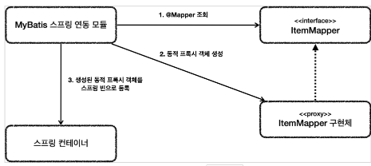
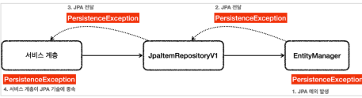
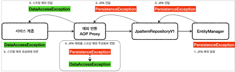
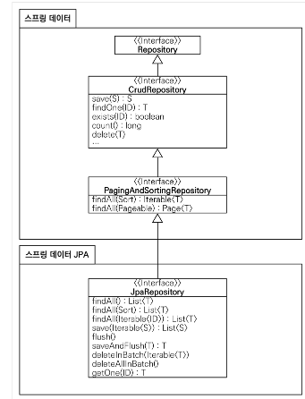
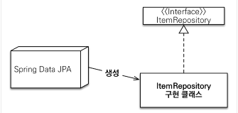
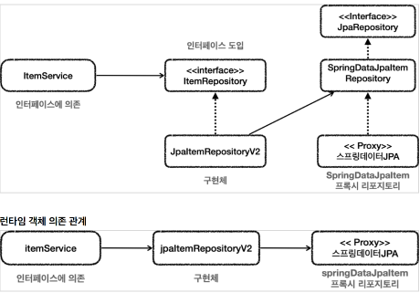

# 인프런 Spring DB 2편 - 데이터 접근 기술 - 김영한 님

# 전체 목차

1. 데이터 접근 기술 - 시작
2. 데이터 접근 기술 - 스프링 JdbcTemplate
3. 데이터 접근 기술 - 테스트
4. 데이터 접근 기술 - MyBatis
5. 데이터 접근 기술 - JPA
6. 데이터 접근 기술 - 스프링 데이터 JPA
7. 데이터 접근 기술 - Querydsl
8. 데이터 접근 기술 - 활용 방안
9. 스프링 트랜잭션 이해
10. 스프링 트랜잭션 전파1 - 기본
11. 스프링 트랜잭션 전파2 - 활용
12. 다음으로

## 적용 데이터 접근 기술

* JdbcTemplate
* MyBatis
* JPA, Hibernate
* 스프링 데이터 JPA
* Querydsl

## SQL Mapper 주요기능

* 개발자는 SQL만 작성하면 해당 SQL의 결과를 객체로 편리하게 매핑해준다.
* JDBC를 직접 사용할 때 발생하는 여러가지 중복을 제거해주고, 기타 개발자에게 여러가지 편리한 기능을제공한다.

## ORM 주요 기능

* JdbcTemplate이나 MyBatis 같은 SQL 매퍼 기술은 SQL을 개발자가 직접 작성해야 하지만, JPA를 사용하면 기본적인 SQL은 JPA가 대신 작성하고 처리해준다.
* 개발자는 저장하고 싶은 객체를 마치 자바 컬렉션에 저장하고 조회하듯이 사용하면 ORM 기술이 데이터베이스에 해당 객체를 저장하고 조회해준다.
* JPA는 자바 진영의 ORM 표준이고, Hibernate(하이버네이트)는 JPA에서 가장 많이 사용하는 구현체이다.
* 자바에서 ORM을 사용할 때는 JPA 인터페이스를 사용하고, 그 구현체로 하이버네이트를 사용한다고 생각하면 된다.
* 스프링 데이터 JPA, Querydsl은 JPA를 더 편리하게 사용할 수 있게 도와주는 프로젝트


# JdbcTemplate 소개와 설정
* SQL을 직접 사용하는 경우에 스프링이 제공하는 JdbcTemplate은 아주 좋은 선택지다.
* JdbcTemplate은 JDBC를 매우 편리하게 사용할 수 있게 도와준다


### 장점
* 설정의 편리함
  * JdbcTemplate은 spring-jdbc 라이브러리에 포함되어 있는데, 이 라이브러리는 스프링으로 JDBC를 사용할 때 기본으로 사용되는 라이브러리이다. 그리고 별도의 복잡한 설정 없이 바로 사용할
수 있다.

* 반복 문제 해결
  * JdbcTemplate은 템플릿 콜백 패턴을 사용해서, JDBC를 직접 사용할 때 발생하는 대부분의 반복 작업을 대신 처리해준다.
  * 개발자는 SQL을 작성하고, 전달할 파리미터를 정의하고, 응답 값을 매핑하기만 하면 된다.
  * 우리가 생각할 수 있는 대부분의 반복 작업을 대신 처리해준다.
    * 커넥션 획득
    * statement 를 준비하고 실행
    * 결과를 반복하도록 루프를 실행
    * 커넥션 종료, statement , resultset 종료
    * 트랜잭션 다루기 위한 커넥션 동기화
    * 예외 발생시 스프링 예외 변환기 실행

* 단점
  * 동적 SQL을 해결하기 어렵다.

* 라이브러리 추가
```groovy
//JdbcTemplate 추가
implementation 'org.springframework.boot:spring-boot-starter-jdbc'
```

* 기본
* dataSource 를 의존 관계 주입 받고 생성자 내부에서 JdbcTemplate 을 생성한다. 
* 스프링에서는 JdbcTemplate 을 사용할 때 관례상 이 방법을 많이 사용한다.
  * JdbcTemplate 을 스프링 빈으로 직접 등록하고 주입받아도 된다.
* `save() `
* template.update() : 데이터를 변경할 때는 update() 를 사용하면 된다.
  * INSERT , UPDATE , DELETE SQL에 사용한다.
  * template.update() 의 반환 값은 int 인데, 영향 받은 로우 수를 반환한다.
  * 데이터를 저장할 때 PK 생성에 identity (auto increment) 방식을 사용하기 때문에, PK인 ID 값을
  개발자가 직접 지정하는 것이 아니라 비워두고 저장해야 한다. 
    * 그러면 데이터베이스가 PK인 ID를 대신 생성해준다.
  * 문제는 이렇게 데이터베이스가 대신 생성해주는 PK ID 값은 데이터베이스가 생성하기 때문에, 데이터베이스에 INSERT가 완료 되어야 생성된 PK ID 값을 확인할 수 있다.
  * KeyHolder 와 connection.prepareStatement(sql, new String[]{"id"}) 를 사용해서 id 를 지정해주면 INSERT 쿼리 실행 이후에 데이터베이스에서 생성된 ID 값을 조회할 수 있다.
  * 물론 데이터베이스에서 생성된 ID 값을 조회하는 것은 순수 JDBC로도 가능하지만, 코드가 훨씬 더 복잡하다.
  * JdbcTemplate이 제공하는 SimpleJdbcInsert 라는 훨씬 편리한 기능이 있다.

* `update()`
* template.update() : 데이터를 변경할 때는 update() 를 사용하면 된다.
  * ? 에 바인딩할 파라미터를 순서대로 전달하면 된다.
  * 반환 값은 해당 쿼리의 영향을 받은 로우 수 이다. 

* `findById()`
* template.queryForObject()
  * 결과 로우가 하나일 때 사용한다.
* RowMapper 는 데이터베이스의 반환 결과인 ResultSet 을 객체로 변환한다.
  * 결과가 없으면 EmptyResultDataAccessException 예외가 발생한다.
  * 결과가 둘 이상이면 IncorrectResultSizeDataAccessException 예외가 발생한다.

* ### queryForObject() 인터페이스 정의
```java
<T> T queryForObject(String sql, RowMapper<T> rowMapper, Object... args) throws DataAccessException;
```

* `findAll()`
  * 데이터를 리스트로 조회한다. 그리고 검색 조건으로 적절한 데이터를 찾는다.
* template.query()
  * 결과가 하나 이상일 때 사용한다.
* RowMapper 는 데이터베이스의 반환 결과인 ResultSet 을 객체로 변환한다.
* 결과가 없으면 빈 컬렉션을 반환한다.

* `itemRowMapper()`
* 데이터베이스의 조회 결과를 객체로 변환할 때 사용한다.
* JDBC를 직접 사용할 때 ResultSet 를 사용했던 부분을 떠올리면 된다.
* 차이가 있다면 다음과 같이 JdbcTemplate이 다음과 같은 루프를 돌려주고, 개발자는 RowMapper 를 구현해서 그 내부 코드만 채운다고 이해하면 된다

```java
while(resultSet 이 끝날 때 까지) {
        rowMapper(rs, rowNum)
}
// ----------------------
private RowMapper<Item> itemRowMapper() {
    return (rs, rowNum) -> {
        Item item = new Item();
        item.setId(rs.getLong("id"));
        item.setItemName(rs.getString("item_name"));
        item.setPrice(rs.getInt("price"));
        item.setQuantity(rs.getInt("quantity"));
        return item;
    };
}
```


### jdbc 로그 추가(sql)
```properties
## jdbcTemplate sql log
logging.level.org.springframework.jdbc=debug
```

## JdbcTemplate - 이름 지정 파라미터 1

1. 순서대로 바인딩. 
* JdbcTemplate을 기본으로 사용하면 파라미터를 순서대로 바인딩 한다
```java
String sql = "update item set item_name=?, price=?, quantity=? where id=?";
template.update(sql,
        itemName,
        price,
        quantity,
        itemId);
```

* 여기서는 itemName , price , quantity 가 SQL에 있는 ? 에 순서대로 바인딩 된다.

* 파라미터를 순서대로 바인딩 하는 것은 편리하기는 하지만, 순서가 맞지 않아서 버그가 발생할 수도 있으므로 주의해서 사용해야 한다.

2. 이름 지정 바인딩
* NamedParameterJdbcTemplate 라는 이름을 지정해서
  파라미터를 바인딩 하는 기능 제공

* this.template = new NamedParameterJdbcTemplate(dataSource)
  * NamedParameterJdbcTemplate 도 내부에 dataSource 가 필요하다.
  * JdbcTemplateItemRepositoryV2 생성자를 보면 의존관계 주입은 dataSource 를 받고 내부에서 NamedParameterJdbcTemplate 을 생성해서 가지고 있다. 스프링에서는 JdbcTemplate 관련 기능을 사용할 때 관례상 이 방법을 많이 사용한다.
  * NamedParameterJdbcTemplate 을 스프링 빈으로 직접 등록하고 주입받아도 된다

* NamedParameterJdbcTemplate 은 데이터베이스가 생성해주는 키를 매우 쉽게 조회하는 기능도
  제공해준다.
```java
template.update(sql, param, keyHolder); 
Long key = keyHolder.getKey().longValue();
```

* `insert into item (item_name, price, quantity) values (:itemName, :price, :quantity)"`
  * ':파라미터 명' 를 이용해서 파라마티를 받는다.  

* 파라미터를 전달하려면 Map 처럼 key , value 데이터 구조를 만들어서 전달해야 한다.
* 여기서 key 는 `:파리이터이름` 으로 지정한, 파라미터의 이름이고 , value 는 해당 파라미터의값이 된다.

* 이름 지정 바인딩에서 자주 사용하는 파라미터의 종류
1. Map
2. SqlParameterSource
   1. MapSqlParameterSource
   2. BeanPropertySqlParameterSource

### 1. Map
* 단순히 Map 사용
```java
Map<String, Object> param = Map.of("id", id);
Item item = template.queryForObject(sql, param, itemRowMapper());
```

### 2. MapSqlParameterSource
* Map과 유사하지만 SQL 타입을 지정할 수 있는 특화된 기능 제공
* SqlParameterSource의 구현체
* MapSqlParameterSource는 메서드 체인을 통해 편리한 사용법 제공

```java
SqlParameterSource param = new MapSqlParameterSource()
    .addValue("itemName", updateParam.getItemName())
    .addValue("price", updateParam.getPrice())
    .addValue("quantity", updateParam.getQuantity())
    .addValue("id", itemId); //이 부분이 별도로 필요하다.
template.update(sql, param);
```

### 3. BeanPropertySqlParameterSource
* 자바 빈 프로퍼티 규약을 통해서 자동으로 파라미터 객체 생성
* SqlParameterSource 인터페이스의 구현체이다.
  * 예) getXxx() -> xxx, getItemName() -> itemName
  * 예를 들어서 getItemName() , getPrice() 가 있으면 다음과 같은 데이터를 자동으로 만들어낸다.
    * key=itemName, value=상품명 값
    * key=price, value=가격 값

* BeanPropertySqlParameterSource 가 많은 것을 자동화 해주기 때문에 가장 좋아보이지만,
BeanPropertySqlParameterSource 를 항상 사용할 수 있는 것은 아니다.
* 예를 들어서 update() 에서는 SQL에 :id 를 바인딩 해야 하는데, update() 에서 사용하는
ItemUpdateDto 에는 itemId 가 없다. 따라서 BeanPropertySqlParameterSource 를 사용할 수 없고, 대신에 MapSqlParameterSource 를 사용.

### BeanPropertyRowMapper

```java
// 기존 RowMapper
private RowMapper<Item> itemRowMapper() {
        return (rs, rowNum) -> {
        Item item = new Item();
        item.setId(rs.getLong("id"));
        item.setItemName(rs.getString("item_name"));
        item.setPrice(rs.getInt("price"));
        item.setQuantity(rs.getInt("quantity"));
        return item;
        };
}

// BeanPropertyRowMapper
private RowMapper<Item> itemRowMapper() {
        return BeanPropertyRowMapper.newInstance(Item.class); 
        //camel 변환 지원
}
```

* BeanPropertyRowMapper 는 ResultSet 의 결과를 받아서 자바빈 규약에 맞추어 데이터를 변환한다.
* 리플렉션 같은 기능을 사용하여 변환. 

### 별칭

* select item_name 의 경우 setItem_name() 이라는 메서드가 없기 때문에 골치가 아프다.
* 이런 경우 개발자가 조회 SQL을 다음과 같이 고치면 된다.
  * `String sql = "select item_name as itemName"`

### 자바 언어의 네이밍 관례와 데이터베이스의 네이밍 관례

* 자바 객체는 카멜( camelCase ) 표기법을 사용한다. 
* 반면에 관계형 데이터베이스에서는 주로 언더스코어를 사용하는 snake_case 표기법을 사용한다.
* BeanPropertyRowMapper 는 언더스코어 표기법을 카멜로 자동 변환해준다.
* 따라서 select item_name 으로 조회해도 setItemName() 에 문제 없이 값이 들어간다.
* 정리하면 snake_case 는 자동으로 해결되니 그냥 두면 되고, 컬럼 이름과 객체 이름이 완전히 다른
경우에는 조회 SQL에서 별칭을 사용하면 된다


## SimpleJdbcInsert

* JdbcTemplate은 `INSERT SQL를 직접 작성하지 않아도 되도록 SimpleJdbcInsert 라는 편리한
  기능을 제공한다.`

```java
public class JdbcTemplateItemRepositoryV3 implements ItemRepository {

  private final NamedParameterJdbcTemplate template;
  private final SimpleJdbcInsert jdbcInsert;

  public JdbcTemplateItemRepositoryV3(DataSource dataSource) {
    this.template = new NamedParameterJdbcTemplate(dataSource);
    // 이부분 
    this.jdbcInsert = new SimpleJdbcInsert(dataSource)
            .withTableName("item")
            .usingGeneratedKeyColumns("id");
  }
}
```

* withTableName : 데이터를 저장할 테이블 명을 지정한다.
* usingGeneratedKeyColumns : key 를 생성하는 PK 컬럼 명을 지정한다.
* usingColumns : INSERT SQL에 사용할 컬럼을 지정한다. 특정 값만 저장하고 싶을 때 사용한다. 생략할 수 있다.
* SimpleJdbcInsert 는 생성 시점에 데이터베이스 테이블의 메타 데이터를 조회한다. 
* 따라서 어떤 컬럼이 있는지 확인 할 수 있으므로 usingColumns 을 생략할 수 있다. 
* 만약 특정 컬럼만 지정해서 저장하고 싶다면 usingColumns 를 사용하면 된다.

## JdbcTemplate 기능 정리

* 주요 기능
  * JdbcTemplate : 순서 기반 파라미터 바인딩을 지원한다.
  * NamedParameterJdbcTemplate : 이름 기반 파라미터 바인딩을 지원한다. (권장)
  * SimpleJdbcInsert : INSERT SQL을 편리하게 사용할 수 있다.
  * SimpleJdbcCall 스토어드 프로시저를 편리하게 호출할 수 있다.
> 참고
> 스토어드 프로시저를 사용하기 위한 SimpleJdbcCall 에 대한 자세한 내용은 다음 스프링 공식 메뉴얼을
참고하자.
>
> https://docs.spring.io/spring-framework/docs/current/reference/html/dataaccess.html#jdbc-simple-jdbc-call-1


참고
> 스프링 JdbcTemplate 사용 방법 공식 메뉴얼  
> https://docs.spring.io/spring-framework/docs/current/reference/html/dataaccess.html#jdbc-JdbcTemplate

### 단건 조회 - 숫자 조회
```java
int countOfActorsNamedJoe = jdbcTemplate.queryForObject(
"select count(*) from t_actor where first_name = ?", Integer.class, "Joe");
```

### 단건 조회 - 객체 조회

```java
Actor actor = jdbcTemplate.queryForObject(
    "select first_name, last_name from t_actor where id = ?",
    (resultSet, rowNum) -> {
        Actor newActor = new Actor();
    newActor.setFirstName(resultSet.getString("first_name"));
    newActor.setLastName(resultSet.getString("last_name"));
    return newActor;
    },
1212L);
```


### 변경(INSERT, UPDATE, DELETE)
* 데이터를 변경할 때는 jdbcTemplate.update() 를 사용하면 된다. 참고로 int 반환값을 반환하는데, SQL 실행 결과에 영향받은 로우 수를 반환한다.

### 스토어드 프로시저 호출
```java
jdbcTemplate.update(
        "call SUPPORT.REFRESH_ACTORS_SUMMARY(?)",
        Long.valueOf(unionId));
```

참고
> JOOQ라는 기술도 동적쿼리 문제를 편리하게 해결해주지만 사용자가 많지 않아서 강의에서 다루지는 않는다


# JDBC 테스트

* 테스트에서 매우 중요한 원칙은 다음과 같다.
* `테스트는 다른 테스트와 격리해야 한다.`
* `테스트는 반복해서 실행할 수 있어야 한다.`


## 테스트 - 데이터 롤백

* 트랜잭션과 롤백 전략  

  * 테스트가 끝나고 나서 트랜잭션을 강제로 롤백해버리면 데이터가 깔끔하게 제거된다.  
  * 테스트를 하면서 데이터를 이미 저장했는데, 중간에 테스트가 실패해서 롤백을 호출하지 못해도 괜찮다.  
  * 트랜잭션을 커밋하지 않았기 때문에 데이터베이스에 해당 데이터가 반영되지 않는다.  
  * 이렇게 트랜잭션을 활용하면 테스트가 끝나고 나서 데이터를 깔끔하게 원래 상태로 되돌릴 수 있다
  
### 1. 테스트에 직접 트랜잭션 추가

```java
@SpringBootTest
class ItemRepositoryTest {

  @Autowired
  ItemRepository itemRepository;

  @Autowired
  PlatformTransactionManager transactionManager;

  TransactionStatus status;

  @BeforeEach
  void beforeEach() {
    //트랜잭션 시작
    status = transactionManager.getTransaction(new DefaultTransactionDefinition());
  }

  @AfterEach
  void afterEach() {
    //MemoryItemRepository 의 경우 제한적으로 사용
    if (itemRepository instanceof MemoryItemRepository) {
      ((MemoryItemRepository) itemRepository).clearStore();
    }

    transactionManager.rollback(status); // 트랜잭션 종료 
  }
}
```
* PlatformTransactionManager transactionManager

* TransactionStatus status

* 트랜잭션 시작 : transactionManager.getTransaction(new DefaultTransactionDefinition())
* 트랜잭션 종료 : transactionManager.rollback(status)


* 트랜잭션 관리자는 PlatformTransactionManager 를 주입 받아서 사용하면 된다. 
  * 참고로 스프링 부트는 자동으로 적절한 트랜잭션 매니저를 스프링 빈으로 등록해준다. (앞서 학습한 스프링 부트의 자동 리소스
  등록 장을 떠올려보자.)

* @BeforeEach : 각각의 테스트 케이스를 실행하기 직전에 호출된다. 따라서 여기서 트랜잭션을 시작하면
  된다. 그러면 각각의 테스트를 트랜잭션 범위 안에서 실행할 수 있다.
  * transactionManager.getTransaction(new DefaultTransactionDefinition()) 로 트랜잭션을 시작한다.

* @AfterEach : 각각의 테스트 케이스가 완료된 직후에 호출된다. 따라서 여기서 트랜잭션을 롤백하면 된다.
  그러면 데이터를 트랜잭션 실행 전 상태로 복구할 수 있다.
  * transactionManager.rollback(status) 로 트랜잭션을 롤백한다

### 2. @Transactional 어노테이션 

* 스프링은 테스트 데이터 초기화를 위해 트랜잭션을 적용하고 롤백하는 방식을 `@Transactional`
  애노테이션 하나로 깔끔하게 해결해준다.

```java
@Transactional
@SpringBootTest
class ItemRepositoryTest {
  ...
}
```

## `@Transactional 원리`

* 스프링이 제공하는 @Transactional 애노테이션은 로직이 성공적으로 수행되면 커밋하도록 동작한다
* @Transactional 이 테스트에 있으면 스프링은 테스트를 트랜잭션 안에서 실행하고, 테스트가 끝나면 트랜잭션을 자동으로 롤백시켜 버린다!


참고
* 테스트 케이스의 메서드나 클래스에 @Transactional 을 직접 붙여서 사용할 때 만 이렇게 동작한다.
* 그리고 트랜잭션을 테스트에서 시작하기 때문에 서비스, 리포지토리에 있는 @Transactional 도 테스트에서 시작한 트랜잭션에 참여한다. 
* 테스트에서 트랜잭션을 실행하면 테스트 실행이 종료될 때 까지 테스트가 실행하는 모든 코드가 같은 트랜잭션 범위에 들어간다고 이해하면 된다. 
* 같은 범위라는 뜻은 쉽게 이야기해서 같은 트랜잭션을 사용한다는 뜻이다. 그리고 같은 트랜잭션을 사용한다는 것은 같은 커넥션을 사용한다는 뜻이기도 하다.)


* @Transactional 덕분에 아주 편리하게 다음 원칙을 지킬수 있게 되었다.
  * 테스트는 다른 테스트와 격리해야 한다.
  * 테스트는 반복해서 실행할 수 있어야 한다

### @Commit - 강제로커밋하기 
* @Transactional 을 테스트에서 사용하면 테스트가 끝나면 바로 롤백되기 때문에 테스트 과정에서 저장한 모든 데이터가 사라진다. 
* 가끔은 데이터베이스에 데이터가 잘 보관되었는지 최종 결과를 눈으로 확인하고 싶을 때는 @Commit 을 클래스 또는 메서드에 붙이면 테스트 종료후 롤백 대신 커밋이 호출된다. 
* 참고로 @Rollback(value = false) 를 사용해도 된다


## 테스트용 임베디드 모드 DB

테스트 케이스를 실행하기 위해서 별도의 데이터베이스를 설치하고, 운영하는 것은 상당히 번잡한
작업이다.   
단순히 테스트를 검증할 용도로만 사용하기 때문에 테스트가 끝나면 데이터베이스의 데이터를
모두 삭제해도 된다. 더 나아가서 테스트가 끝나면 데이터베이스 자체를 제거해도 된다.  

* 임베디드 모드
  * H2 데이터베이스는 자바로 개발되어 있고, JVM안에서 메모리 모드로 동작하는 특별한 기능을 제공한다.
    그래서 애플리케이션을 실행할 때 H2 데이터베이스도 해당 JVM 메모리에 포함해서 함께 실행할 수 있다.
    DB를 애플리케이션에 내장해서 함께 실행한다고 해서 임베디드 모드(Embedded mode)라 한다. 물론
    애플리케이션이 종료되면 임베디드 모드로 동작하는 H2 데이터베이스도 함께 종료되고, 데이터도 모두
    사라진다. 쉽게 이야기해서 애플리케이션에서 자바 메모리를 함께 사용하는 라이브러리처럼 동작하는
    것이다.
  
### 설정 빈 등록

```java
@Slf4j
@Import(JdbcTemplateV3Config.class)
@SpringBootApplication(scanBasePackages = "hello.itemservice.web")
public class ItemServiceApplication {

    public static void main(String[] args) {
        SpringApplication.run(ItemServiceApplication.class, args);
    }

    @Bean
    @Profile("test") // 테스트 프로필에서만 실행 
    public DataSource dataSource() {
        log.info("메모리 데이터베이스 초기화");
        DriverManagerDataSource dataSource = new DriverManagerDataSource();
        dataSource.setDriverClassName("org.h2.Driver");
        dataSource.setUrl("jdbc:h2:mem:db;DB_CLOSE_DELAY=-1");
        dataSource.setUsername("sa");
        dataSource.setPassword("");
        return dataSource;
    }
}
```

* @Profile("test")
  * 프로필이 test 인 경우에만 데이터소스를 스프링 빈으로 등록한다.
  * 테스트 케이스에서만 이 데이터소스를 스프링 빈으로 등록해서 사용하겠다는 뜻이다.
* dataSource()
  * jdbc:h2:mem:db : 이 부분이 중요하다. 데이터소스를 만들때 이렇게만 적으면 임베디드 모드(메모리 모드)로 동작하는 H2 데이터베이스를 사용할 수 있다.
  * DB_CLOSE_DELAY=-1 : 임베디드 모드에서는 데이터베이스 커넥션 연결이 모두 끊어지면 데이터베이스도 종료되는데, 그것을 방지하는 설정이다.
* 이 데이터소스를 사용하면 메모리 DB를 사용할 수 있다.

## 스프링 부트 - 기본 SQL 스크립트를 사용해서 데이터베이스를 초기화하는 기능

* 스프링 부트는 SQL 스크립트를 실행해서 애플리케이션 로딩 시점에 데이터베이스를 초기화하는 기능을 제공한다.

* src/test/resources/schema.sql 에 초기화용 스크립트 작성 

참고
> SQL 스크립트를 사용해서 데이터베이스를 초기화하는 자세한 방법은 다음 스프링 부트 공식 메뉴얼을 참고하자.  
> https://docs.spring.io/spring-boot/docs/current/reference/html/howto.html#howto.datainitialization.using-basic-sql-scripts

* `스프링 부트는 임베디드 데이터베이스에 대한 설정도 기본으로 제공한다.`
  * 위에서 작성한 테스트 프로필용 DataSource Bean을 작성 안해도 된다. 
* 스프링 부트는 데이터베이스에 대한 별다른 설정이 없으면 임베디드 데이터베이스를 사용한다.

* `src/test/resources 에 작성한 데이터베이스 접근 설정정보가 없어야 한다. `
* 렇게 별다른 정보가 없으면 스프링 부트는 임베디드 모드로 접근하는 데이터소스( DataSource )를
  만들어서 제공한다. 바로 앞서 우리가 직접 만든 데이터소스와 비슷하다 생각하면 된다

> 로그를 보면 다음 부분을 확인할 수 있는데 jdbc:h2:mem 뒤에 임의의 데이터베이스 이름이 들어가
있다. 이것은 혹시라도 여러 데이터소스가 사용될 때 같은 데이터베이스를 사용하면서 발생하는 충돌을
방지하기 위해 스프링 부트가 임의의 이름을 부여한 것이다.  
`conn0: url=jdbc:h2:mem:d8fb3a29-caf7-4b37-9b6c-b0eed9985454`

* 임베디드 데이터베이스 이름을 스프링 부트가 기본으로 제공하는 jdbc:h2:mem:testdb 로 고정하고
  싶으면 application.properties 에 다음 설정을 추가하면 된다
  
  * spring.datasource.generate-unique-name=false

* 참고
> 임베디드 데이터베이스에 대한 스프링 부트의 더 자세한 설정은 다음 공식 메뉴얼을 참고하자.  
> https://docs.spring.io/spring-boot/docs/current/reference/html/
data.html#data.sql.datasource.embedded

# MyBatis

* MyBatis는 앞서 설명한 JdbcTemplate보다 더 많은 기능을 제공하는 SQL Mapper 이다.
* 기본적으로 JdbcTemplate이 제공하는 대부분의 기능을 제공한다.
* JdbcTemplate과 비교해서 MyBatis의 가장 매력적인 점은 SQL을 XML에 편리하게 작성할 수 있고 또 동적 쿼리를 매우 편리하게 작성할 수 있다는 점이다.


* 공식 사이트
> https://mybatis.org/mybatis-3/ko/index.html

## MyBatis 설정

* gradle
  * > implementation 'org.mybatis.spring.boot:mybatis-spring-boot-starter:2.2.0'
  * 뒤에 버전 정보가 붙는 이유는 스프링 부트가 버전을 관리해주는 공식 라이브러리가 아니기 때문이다


* 다음과 같은 라이브러리가 추가된다.
  * mybatis-spring-boot-starter : MyBatis를 스프링 부트에서 편리하게 사용할 수 있게 시작하는 라이브러리
  * mybatis-spring-boot-autoconfigure : MyBatis와 스프링 부트 설정 라이브러리
  * mybatis-spring : MyBatis와 스프링을 연동하는 라이브러리
  * mybatis : MyBatis 라이브러리

* ### mybatis properties or yaml
```properties
#MyBatis
mybatis.type-aliases-package=hello.itemservice.domain
mybatis.configuration.map-underscore-to-camel-case=true
logging.level.hello.itemservice.repository.mybatis=trace
```

* mybatis.type-aliases-package
  * 마이바티스에서 타입 정보를 사용할 때는 패키지 이름을 적어주어야 하는데, 여기에 명시하면 패키지이름을 생략할 수 있다.
  * 지정한 패키지와 그 하위 패키지가 자동으로 인식된다.
  * 여러 위치를 지정하려면 , , ; 로 구분하면 된다.
* mybatis.configuration.map-underscore-to-camel-case
  * JdbcTemplate의 BeanPropertyRowMapper 에서 처럼 언더바를 카멜로 자동 변경해주는 기능을 활성화 한다. 
* logging.level.hello.itemservice.repository.mybatis=trace
  * MyBatis에서 실행되는 쿼리 로그를 확인할 수 있다.

## Mybatis 인터페이스

```java
@Mapper
public interface ItemMapper {

    void save(Item item);

    void update(@Param("id") Long id, @Param("updateParam") ItemUpdateDto updateParam);

    Optional<Item> findById(Long id);

    List<Item> findAll(ItemSearchCond itemSearch);
}
```

* 인터페이스로 매퍼를 만들면 XML에서 지정해서 연동할 수 있다.
* 이 인터페이스에는 @Mapper 애노테이션을 붙여주어야 한다. 그래야 MyBatis에서 인식할 수 있다.
* 이 인터페이스의 메서드를 호출하면 다음에 보이는 xml 의 해당 SQL을 실행하고 결과를 돌려준다.

> 이제 같은 위치에 실행할 SQL이 있는 XML 매핑 파일을 만들어주면 된다.
참고로 자바 코드가 아니기 때문에 src/main/resources 하위에 만들되, 패키지 위치는 맞추어 주어야 한다

* Mapper Interface 위치
  * src/main/java/hello.itemservice.repository.mybatis
* Mapper XML 위치
  * src/main/resources/hello/itemservice/repository/mybatis/ItemMapper.xml

```xml
<?xml version="1.0" encoding="UTF-8"?>
<!DOCTYPE mapper PUBLIC "-//mybatis.org//DTD Mapper 3.0//EN"
"http://mybatis.org/dtd/mybatis-3-mapper.dtd">

<mapper namespace="hello.itemservice.repository.mybatis.ItemMapper">
  <insert id="save" useGeneratedKeys="true" keyProperty="id">
    insert into item (item_name, price, quantity)
    values (#{itemName}, #{price}, #{quantity})
  </insert>

  <update id="update">
    update item

    set item_name=#{updateParam.itemName},
    price=#{updateParam.price},
    quantity=#{updateParam.quantity}
    where id = #{id}
  </update>

  <select id="findById" resultType="Item">
    select id, item_name, price, quantity
    from item
    where id = #{id}
  </select>

  <select id="findAll" resultType="Item">
    select id, item_name, price, quantity
    from item
    <where>

      <if test="itemName != null and itemName != ''">
        and item_name like concat('%',#{itemName},'%')
      </if>

      <if test="maxPrice != null">
        and price &lt;= #{maxPrice}
      </if>
    </where>
  </select>
</mapper>
```

## !! XML 파일 경로를 꼭 interface의 경로와 안맞추어도 된다! 
### 경로 수정하기 
* XML 파일을 원하는 위치에 두고 싶으면 application.properties 에 다음과 같이 설정하면 된다.
  * `mybatis.mapper-locations=classpath:mapper/**/*.xml`
  * resource/mapper 하위 폴더 인식
  * 이렇게 하면 resources/mapper 를 포함한 그 하위 폴더에 있는 XML을 XML 매핑 파일로 인식한다. 이 경우 파일 이름은 자유롭게 설정해도 된다.

* 테스트의 application.properties 파일도 함께 수정해야 테스트를 실행할 때 인식할 수 있다.

## Mybatis Insert, Update, Select


### Insert
```java
void save(Item item);

<insert id="save" useGeneratedKeys="true" keyProperty="id">
  insert into item (item_name, price, quantity)
  values (#{itemName}, #{price}, #{quantity})
</insert>
```

* Insert SQL은 <insert> 를 사용하면 된다.
* id 에는 매퍼 인터페이스에 설정한 메서드 이름을 지정하면 된다. 
  * 여기서는 메서드 이름이 save() 이므로 save 로 지정하면 된다.
* 파라미터는 `#{} 문법`을 사용하면 된다. 그리고 매퍼에서 넘긴 객체의 프로퍼티 이름을 적어주면 된다.
  * `#{} 문법`을 사용하면 PreparedStatement 를 사용한다. JDBC의 `?` 를 치환한다 생각하면 된다.
* useGeneratedKeys 는 데이터베이스가 키를 생성해 주는 IDENTITY 전략일 때 사용한다. keyProperty
는 생성되는 키의 속성 이름을 지정한다. Insert가 끝나면 item 객체의 id 속성에 생성된 값이 입력된다

### Update

```java
import org.apache.ibatis.annotations.Param;

void update(@Param("id") Long id, @Param("updateParam") ItemUpdateDto updateParam);

<update id="update">
    update item
    set item_name=#{updateParam.itemName},
    price=#{updateParam.price},quantity=#{updateParam.quantity}
    where id = #{id}
</update>
```
* Update SQL은 <update> 를 사용하면 된다.
* 여기서는 파라미터가 Long id , ItemUpdateDto updateParam 으로 2개이다. 
* 파라미터가 1개만 있으면 @Param 을 지정하지 않아도 되지만, 파라미터가 2개 이상이면 @Param 으로 이름을 지정해서 파라미터를 구분해야 한다.
* Parameter.propertyName 으로 멤버 필드에 접근한다.

### Select - findOne, findAll

```java
Optional<Item> findById(Long id);

<select id="findById" resultType="Item">
    select id, item_name, price, quantity
    from item
    where id = #{id}
</select>
```
* Select SQL은 <select> 를 사용하면 된다.
* resultType 은 반환 타입을 명시하면 된다. 여기서는 결과를 Item 객체에 매핑한다.
* 앞서 application.properties 에 mybatis.type-aliasespackage=hello.itemservice.domain 속성을 지정한 덕분에 모든 패키지 명을 다 적지는 않아도
된다. 그렇지 않으면 모든 패키지 명을 다 적어야 한다.
* JdbcTemplate의 BeanPropertyRowMapper 처럼 SELECT SQL의 결과를 편리하게 객체로 바로 변환해준다.
* mybatis.configuration.map-underscore-to-camel-case=true 속성을 지정한 덕분에
언더스코어를 카멜 표기법으로 자동으로 처리해준다. ( item_name itemName )
* 자바 코드에서 반환 객체가 하나이면 Item , Optional<Item> 과 같이 사용하면 되고, 반환 객체가 하나
이상이면 컬렉션을 사용하면 된다. 주로 List 를 사용한다.

```java
List<Item> findAll(ItemSearchCond itemSearch);

<select id="findAll" resultType="Item">
        select id, item_name, price, quantity
        from item
    <where>
        <if test="itemName != null and itemName != ''">
            and item_name like concat('%',#{itemName},'%')
        </if>
        <if test="maxPrice != null">
            and price &lt;= #{maxPrice}
        </if>
    </where>
</select>
```

* Mybatis는 <where> , <if> 같은 동적 쿼리 문법을 통해 편리한 동적 쿼리를 지원한다.
* <if> 는 해당 조건이 만족하면 구문을 추가한다.
* <where> 은 적절하게 where 문장을 만들어준다.
  * 예제에서 <if> 가 모두 실패하게 되면 SQL where 를 만들지 않는다.
  * 예제에서 <if> 가 하나라도 성공하면 처음 나타나는 and 를 where 로 변환해준다

### XML 특수문자 인식 이슈?

* and price &lt;= #{maxPrice}
* 여기에 보면 `<=` 를 사용하지 않고 `&lt;=` 를 사용한 것을 확인할 수 있다. 그 이유는 XML에서는 데이터
영역에 `< , >` 같은 특수 문자를 사용할 수 없기 때문이다. 
* 이유는 간단한데, XML에서 TAG가 시작하거나 종료할 때 `< , >` 와 같은 특수문자를 사용하기 때문이다.
```
< : &lt;
> : &gt;
& : &amp;
```

* 방식으로 변경해서 넣거나, `CDATA` 구문을 사용한다. 
* 대신 이 구문 안에서는 XML TAG가 단순 문자로 인식되기 때문에 <if> ,<where> 등이 적용되지 않는다

```xml
<where>
  <if test="itemName != null and itemName != ''">
    and item_name like concat('%',#{itemName},'%')
  </if>
  <if test="maxPrice != null">
    <![CDATA[
    and price <= #{maxPrice}
    ]]>
  </if>
</where>
```

## MyBatis의 ItemMapper 인터페이스의 구현체가 없는데 어떻게 동작하는가?

* 

1. 애플리케이션 로딩 시점에 MyBatis 스프링 연동 모듈은 @Mapper 가 붙어있는 인터페이스를 조사한다.
2. 해당 인터페이스가 발견되면 동적 프록시 기술을 사용해서 ItemMapper 인터페이스의 구현체를 만든다.
3. 생성된 구현체를 스프링 빈으로 등록한다

## 매퍼 구현체(Mapper)

* 매퍼 구현체는 예외 변환까지 처리해준다. MyBatis에서 발생한 예외를 스프링 예외 추상화인
DataAccessException 에 맞게 변환해서 반환해준다. 


* 마이바티스 스프링 연동 모듈이 자동으로 등록해주는 부분은 MybatisAutoConfiguration 클래스를 참고


## Mybatis 동적 쿼리 

* MyBatis 공식 메뉴얼: https://mybatis.org/mybatis-3/ko/index.html
* MyBatis 스프링 공식 메뉴얼: https://mybatis.org/spring/ko/index.html

* if
* choose (when, otherwise)
* trim (where, set)
* foreach

* -- https://2ham-s.tistory.com/273
### if

```xml
<select id="findActiveBlogWithTitleLike" resultType="Blog">
    SELECT * FROM BLOG
    WHERE state = ‘ACTIVE’
    <if test="title != null">
        AND title like #{title}
    </if>
</select>
```
* 해당 조건에 따라 값을 추가할지 말지 판단한다.
* 내부의 문법은 `OGNL`을 사용한다. 자세한 내용은 `OGNL`을 검색해보자
  * Object Graph Navigation Language 표현식 

### trim (where, set)
```xml
<select id="findActiveBlogLike" resultType="Blog">
SELECT * FROM BLOG
    <where>
    <if test="state != null">
        state = #{state}
    </if>
    <if test="title != null">
        AND title like #{title}
    </if>
    <if test="author != null and author.name != null">
        AND author_name like #{author.name}
    </if>
    </where>
</select>
```

* `<where>` 는 문장이 없으면 where 를 추가하지 않는다. 문장이 있으면 where 를 추가한다. 만약 and가 먼저 시작된다면 and 를 지운다.
* 참고로 다음과 같이 trim 이라는 기능으로 사용해도 된다. 이렇게 정의하면 <where> 와 같은 기능을 수행한다

```xml
<trim prefix="WHERE" prefixOverrides="AND |OR ">
...
</trim>
```

### foreach

```xml
<select id="selectPostIn" resultType="domain.blog.Post">
    SELECT *
    FROM POST P
    <where>
        <foreach item="item" index="index" collection="list" open="ID in (" separator="," close=")" nullable="true">
            #{item}
        </foreach>
    </where>
</select>
```
* 컬렉션을 반복 처리할 때 사용한다. where in (1,2,3,4,5,6) 와 같은 문장을 쉽게 완성할 수 있다.
* 파라미터로 List 를 전달하면 된다.

동적 쿼리에 대한 자세한 내용은 다음을 참고하자.
> https://mybatis.org/mybatis-3/ko/dynamic-sql.html

### 어노테이션으로 SQL 작성

```java
@Select("select id, item_name, price, quantity from item where id=#{id}")
Optional<Item> findById(Long id);
```

* @Insert , @Update , @Delete , @Select 기능이 제공된다.
* 이 경우 XML에는 <select id="findById"> ~ </select> 는 제거해야 한다.
* 동적 SQL이 해결되지 않으므로 간단한 경우에만 사용한다.
* 애노테이션으로 SQL 작성에 대한 더 자세한 내용은 다음을 참고하자.
  * https://mybatis.org/mybatis-3/ko/java-api.html
  
### 문자열 대체(String Substitution)
* `#{}` 문법은 ?를 넣고 파라미터를 바인딩하는 PreparedStatement 를 사용한다.
* 때로는 파라미터 바인딩이 아니라 문자 그대로를 처리하고 싶은 경우도 있다. 이때는 ${} 를 사용하면 된다.

* `ORDER BY ${columnName}`
```java
@Select("select * from user where ${column} = #{value}")
User findByColumn(@Param("column") String column, @Param("value") Stringvalue);
```
* 주의
* ${} 를 사용하면 SQL 인젝션 공격을 당할 수 있다. 따라서 가급적 사용하면 안된다. 사용하더라도 매우 주의깊게 사용해야 한다.

### 재사용 가능한 SQL 조각

* `<sql>` 을 사용하면 SQL 코드를 재사용 할 수 있다.
```xml
<sql id="userColumns"> ${alias}.id,${alias}.username,${alias}.password </sql>

<select id="selectUsers" resultType="map">
    select
      <include refid="userColumns"><property name="alias" value="t1"/></include>,
      <include refid="userColumns"><property name="alias" value="t2"/></include>
    from some_table t1
    cross join some_table t2
</select>
```

* `<include>` 를 통해서 `<sql>` 조각을 찾아서 사용할 수 있다.

## Result Maps : 결과값 매핑

* 별칭( as )을 사용
```xml
<select id="selectUsers" resultType="User">
    select
        user_id as "id",
        user_name as "userName",
        hashed_password as "hashedPassword"
    from some_table
    where id = #{id}
</select>
```

* `resultMap` 사용
```xml
<resultMap id="userResultMap" type="User">
    <id property="id" column="user_id" />
    <result property="username" column="username"/>
    <result property="password" column="password"/>
</resultMap>

<select id="selectUsers" resultMap="userResultMap">
    select user_id, user_name, hashed_password
    from some_table
    where id = #{id}
</select>
```
* MyBatis도 매우 복잡한 결과에 객체 연관관계를 고려해서 데이터를 조회하는 것이 가능하다.
* 이때는 `<association>` , `<collection>` 등을 사용한다.
* 이 부분은 성능과 실효성에서 측면에서 많은 고민이 필요하다
* 결과 매핑에 대한 자세한 내용은 다음을 참고하자.
> https://mybatis.org/mybatis-3/ko/sqlmap-xml.html#Result_Maps


# 데이터 접근 기술 - JPA

* 설정
```groovy
//JPA, 스프링 데이터 JPA 추가
implementation 'org.springframework.boot:spring-boot-starter-data-jpa'
```
* spring-boot-starter-data-jpa 는 spring-boot-starter-jdbc 도 함께 포함(의존)한다. 
  * 따라서 spring-boot-starter-jdbc 의존관계를 제거해도 된다. 
  * 참고로 mybatis-spring-boot-starter 도 spring-bootstarter-jdbc 를 포함하기 때문에 제거해도 된다
  
* hibernate-core : JPA 구현체인 하이버네이트 라이브러리
* jakarta.persistence-api : JPA 인터페이스
* spring-data-jpa : 스프링 데이터 JPA 라이브러리

```properties
#JPA log
logging.level.org.hibernate.SQL=DEBUG
logging.level.org.hibernate.type.descriptor.sql.BasicBinder=TRACE
```

* org.hibernate.SQL=DEBUG : 하이버네이트가 생성하고 실행하는 SQL을 확인할 수 있다.
* org.hibernate.type.descriptor.sql.BasicBinder=TRACE : SQL에 바인딩 되는 파라미터를 확인할 수 있다


## JPA 예외 변환 

* JPA의 경우 예외가 발생하면 JPA 예외가 발생하게 된다

* EntityManager 는 순수한 JPA 기술이고, 스프링과는 관계가 없다. 
* 따라서 엔티티 매니저는 예외가 발생하면 JPA 관련 예외를 발생시킨다.
* JPA는 `PersistenceException` 과 그 하위 예외를 발생시킨다.
* 추가로 JPA는 IllegalStateException , IllegalArgumentException 을 발생시킬 수 있다.
* 그렇다면 JPA 예외를 스프링 예외 추상화( DataAccessException )로 어떻게 변환할 수 있을까?
* `비밀은 바로 @Repository 에 있다`

* 예외 변환 전 
  * 


### @Repository의 기능
* @Repository 가 붙은 클래스는 컴포넌트 스캔의 대상이 된다.
* @Repository 가 붙은 클래스는 예외 변환 AOP의 적용 대상이 된다.
  * 스프링과 JPA를 함께 사용하는 경우 스프링은 JPA 예외 변환기( PersistenceExceptionTranslator )를 등록한다.
* 예외 변환 AOP 프록시는 JPA 관련 예외가 발생하면 JPA 예외 변환기를 통해 발생한 예외를 스프링데이터 접근 예외로 변환한다

* 예외 변환 후 
  * 

* 결과적으로 리포지토리에 @Repository 애노테이션만 있으면 스프링이 예외 변환을 처리하는 AOP를 만들어준다.
* 참고
  * 스프링 부트는 PersistenceExceptionTranslationPostProcessor 를 자동으로 등록하는데, 여기에서 @Repository 를 AOP 프록시로 만드는 어드바이저가 등록된다.
* 참고
  * 복잡한 과정을 거쳐서 실제 예외를 변환하는데, 실제 JPA 예외를 변환하는 코드는 
  * `EntityManagerFactoryUtils.convertJpaAccessExceptionIfPossible()` 이다.


# Spring Data JPA 

* 스프링 데이터 JPA는 JPA를 편리하게 사용할 수 있도록 도와주는 라이브러리이다.
* 수많은 편리한 기능을 제공하지만 가장 대표적인 기능은 다음과 같다.
* 공통 인터페이스 기능
* 쿼리 메서드 기능

## 공통 인터페이스 기능

* 

* JpaRepository 인터페이스를 통해서 기본적인 CRUD 기능 제공환다.
* 공통화 가능한 기능이 거의 모두 포함되어 있다.
* CrudRepository 에서 fineOne() findById() 로 변경되었다.

* 스프링 데이터 JPA가 구현 클래스를 대신 생성
* 

* JpaRepository 인터페이스만 상속받으면 스프링 데이터 JPA가 프록시 기술을 사용해서 구현 클래스를
만들어준다. 그리고 만든 구현 클래스의 인스턴스를 만들어서 스프링 빈으로 등록한다.
* 따라서 개발자는 구현 클래스 없이 인터페이스만 만들면 기본 CRUD 기능을 사용할 수 있다.


## 쿼리 메소드

* 스프링 데이터 JPA는 메서드 이름을 분석해서 필요한 JPQL을 만들고 실행해준다. 
JPQL은 JPA가 SQL로 번역해서 실행한다.
* 다음과 같은 규칙을 따라야 한다.
* 스프링 데이터 JPA가 제공하는 쿼리 메소드 기능
* 조회: find…By , read…By , query…By , get…By
  * 예:) findHelloBy 처럼 ...에 식별하기 위한 내용(설명)이 들어가도 된다.
* COUNT: count…By 반환타입 long
* EXISTS: exists…By 반환타입 boolean
* 삭제: delete…By , remove…By 반환타입 long
* DISTINCT: findDistinct , findMemberDistinctBy
* LIMIT: findFirst3 , findFirst , findTop , findTop

* 쿼리 메소드 필터 조건
> 스프링 데이터 JPA 공식 문서 참고  
> https://docs.spring.io/spring-data/jpa/docs/current/reference/html/#jpa.querymethods.query-creation  
> https://docs.spring.io/spring-data/jpa/docs/current/reference/html/#repositories.limitquery-result

* 동적 쿼리를 사용하면 좋겠지만, 스프링 데이터 JPA는 동적 쿼리에 약하다. 

* 스프링 데이터 JPA도 Example 이라는 기능으로 약간의 동적 쿼리를 지원하지만, 실무에서 사용하기는
기능이 빈약하다. 
* 실무에서 JPQL 동적 쿼리는 Querydsl을 사용하는 것이 좋다


# QueryDsl

* query를 java로 type-safe하게 개발할 수 있께 지원하는 프레임워크 
* 주로 JQPL 작성에 사된다

* QueryDsl gradle 설정
```groovy

//Querydsl 추가
implementation 'com.querydsl:querydsl-jpa'
annotationProcessor "com.querydsl:querydsl-apt:${dependencyManagement.importedProperties['querydsl.version']}:jpa"
annotationProcessor "jakarta.annotation:jakarta.annotation-api"
annotationProcessor "jakarta.persistence:jakarta.persistence-api"

tasks.named('test') {useJUnitPlatform()
}
//Querydsl 추가, 자동 생성된 Q클래스 gradle clean으로 제거
clean {
    delete file('src/main/generated')
}
```
* 검증 - Q 타입 생성 확인 방법
* Preferences ->  Build, Execution, Deployment -> Build Tools Gradle
  * 여기에 가면 크게 2가지 옵션을 선택할 수 있다. 참고로 옵션은 둘다 같게 맞추어 두자.
  1. Gradle: Gradle을 통해서 빌드한다.
  2. IntelliJ IDEA: IntelliJ가 직접 자바를 실행해서 빌드한다
  
## 옵션 선택1 - Gradle - Q타입 생성 확인 방법
### Gradle IntelliJ 사용법
* Gradle -> Tasks -> build -> clean
* Gradle -> Tasks -> other -> compileJava

### Gradle 콘솔 사용법
* ./gradlew clean compileJava
### Q 타입 생성 확인
* build -> generated -> sources -> annotationProcessor -> java/main 하위에
  * hello.itemservice.domain.QItem 이 생성되어 있어야 한다
  
> Q타입은 컴파일 시점에 자동 생성되므로 버전관리(GIT)에 포함하지 않는 것이 좋다.  
> gradle 옵션을 선택하면 Q타입은 gradle build 폴더 아래에 생성되기 때문에 여기를 포함하지 않아야
한다. 대부분 gradle build 폴더를 git에 포함하지 않기 때문에 이 부분은 자연스럽게 해결된다

## 옵션 선택2 - IntelliJ IDEA - Q타입 생성 확인 방법
Build -> Build Project 또는  
Build -> Rebuild 또는  
main() , 또는 테스트를 실행하면 된다.  

* src/main/generated 하위에
  * hello.itemservice.domain.QItem 이 생성되어 있어야 한다

## 공통
* Querydsl을 사용하려면 JPAQueryFactory 가 필요하다. JPAQueryFactory 는 JPA 쿼리인 JPQL을
만들기 때문에 EntityManager 가 필요하다.
* 설정 방식은 JdbcTemplate 을 설정하는 것과 유사하다.
* 참고로 JPAQueryFactory 를 스프링 빈으로 등록해서 사용해도 된다.

# 스프링 데이터 JPA예제와 트레이드 오프


* 


* 중간에서 JpaItemRepositoryV2 가 어댑터 역할을 해준 덕분에 MemberService 가 사용하는
MemberRepository 인터페이스를 그대로 유지할 수 있고 클라이언트인 MemberService 의 코드를
변경하지 않아도 되는 `장점`이 있다.
### 고민
* 구조를 맞추기 위해서, 중간에 어댑터가 들어가면서 전체 구조가 너무 복잡해지고 사용하는 클래스도 많아지는 단점이 생겼다.
* 실제 이 코드를 구현해야하는 개발자 입장에서 보면 중간에 어댑터도 만들고, 실제 코드까지 만들어야 하는
불편함이 생긴다.
* 유지보수 관점에서 ItemService 를 변경하지 않고, ItemRepository 의 구현체를 변경할 수 있는 장점이
있다. 
* 그러니까 DI, OCP 원칙을 지킬 수 있다는 좋은 점이 분명히 있다. 하지만 반대로 구조가
복잡해지면서 어댑터 코드와 실제 코드까지 함께 유지보수 해야 하는 어려움도 발생한다

* `어떻게 구조를 간단히?`
* ItemService 코드를 일부 고쳐서 직접 스프링 데이터 JPA를 사용하는 방법이다.
* DI, OCP 원칙을 포기하는 대신에, 복잡한 어댑터를 제거하고, 구조를 단순하게 가져갈 수 있는 장점이 있다

## 트레이드 오프
1. DI, OCP를 지키기 위해 어댑터를 도입하고, 더 많은 코드를 유지한다?
2. 어댑터를 제거하고 구조를 단순하게 가져가지만, DI, OCP를 포기하고, ItemService 코드를 직접
변경한다? 
* 결국 여기서 발생하는 트레이드 오프는 구조의 안정성 vs 단순한 구조와 개발의 편리성 사이의 선택이다.
* 이 둘 중에 하나의 정답만 있을까? 그렇지 않다. 어떤 상황에서는 구조의 안정성이 매우 중요하고, 어떤
상황에서는 단순한 것이 더 나은 선택일 수 있다


## 트랜잭션 매니저 선택
* JPA, 스프링 데이터 JPA, Querydsl은 모두 JPA 기술을 사용하는 것이기 때문에 트랜잭션 매니저로
JpaTransactionManager 를 선택하면 된다. 해당 기술을 사용하면 스프링 부트는 자동으로
JpaTransactionManager 를 스프링 빈에 등록한다.

* 그런데 JdbcTemplate , MyBatis 와 같은 기술들은 내부에서 JDBC를 직접 사용하기 때문에
DataSourceTransactionManager 를 사용한다.
* 따라서 JPA와 JdbcTemplate 두 기술을 함께 사용하면 트랜잭션 매니저가 달라진다. 
* 결국 트랜잭션을 하나로 묶을 수 없는 문제가 발생할 수 있다. 
* `그런데 이 부분은 걱정하지 않아도 된다.`
### JpaTransactionManager의 다양한 지원
* JpaTransactionManager 는 놀랍게도 DataSourceTransactionManager 가 제공하는 기능도 대부분 제공한다. 
* JPA라는 기술도 결국 내부에서는 DataSource와 JDBC 커넥션을 사용하기 때문이다. 따라서
JdbcTemplate , MyBatis 와 함께 사용할 수 있다.

* 결과적으로 JpaTransactionManager 를 하나만 스프링 빈에 등록하면, JPA, JdbcTemplate, MyBatis
모두를 하나의 트랜잭션으로 묶어서 사용할 수 있다. 물론 함께 롤백도 할 수 있다.

### 주의점
* 이렇게 JPA와 JdbcTemplate을 함께 사용할 경우 JPA의 플러시 타이밍에 주의해야 한다. 
* JPA는 데이터를 변경하면 변경 사항을 즉시 데이터베이스에 반영하지 않는다. 기본적으로 트랜잭션이 커밋되는
시점에 변경 사항을 데이터베이스에 반영한다. 
* 그래서 하나의 트랜잭션 안에서 JPA를 통해 데이터를 변경한 다음에 JdbcTemplate을 호출하는 경우 JdbcTemplate에서는 JPA가 변경한 데이터를 읽기 못하는 문제가 발생한다.
* 이 문제를 해결하려면 JPA 호출이 끝난 시점에 JPA가 제공하는 플러시라는 기능을 사용해서 JPA의 변경
내역을 데이터베이스에 반영해주어야 한다. 
* 그래야 그 다음에 호출되는 JdbcTemplate에서 JPA가 반영한 데이터를 사용할 수 있다.
* JpaTransactionManager 를 사용해서 여러 데이터 접근 기술들을 함께 사용할 수 있다는 점만 기억하자


