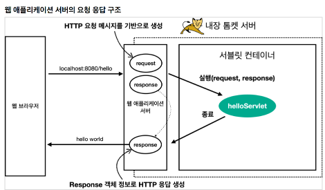
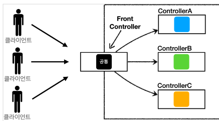
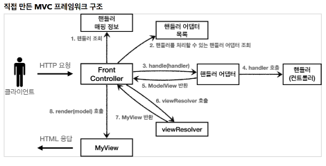
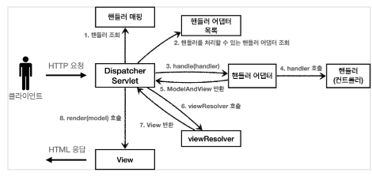
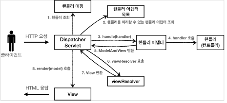
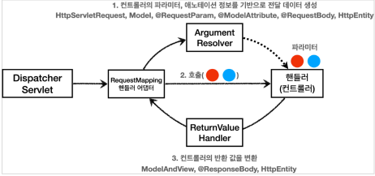
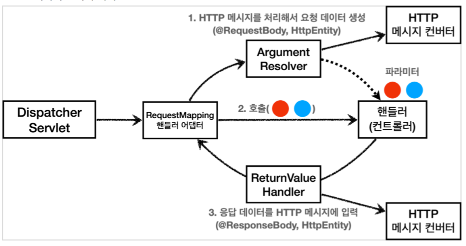

# 스프링 mvc 1편 - 인프런 김영한님

전체 목차

1. 웹 애플리케이션 이해
2. 서블릿
3. 서블릿, JSP, MVC 패턴
4. MVC 프레임워크 만들기
5. 스프링 MVC - 구조 이해
6. 스프링 MVC - 기본 기능
7. 스프링 MVC - 웹 페이지 만들기

# Servlet

## 웹 애플리케이션 서버의 요청 응답 구조

* 

## HttpServletRequest - 개요

**HttpServletRequest** 역할  
HTTP 요청 메시지를 개발자가 직접 파싱해서 사용해도 되지만, 매우 불편할 것이다. 서블릿은 개발자가 HTTP 요청 메시지를 편리하게 사용할 수 있도록 개발자 대신에 HTTP 요청 메시지를 파싱한다. 그리고 그
결과를 HttpServletRequest 객체에 담아서 제공한다

* START LINE
    * HTTP 메소드
    * URL
    * 쿼리 스트링
    * 스키마, 프로토콜
* 헤더
    * 헤더 조회
* 바디
    * form 파라미터 형식 조회
    * message body 데이터 직접 조회

HttpServletRequest 객체는 추가로 여러가지 부가기능도 함께 제공한다.  
**임시 저장소 기능**

* 해당 HTTP 요청이 시작부터 끝날 때 까지 유지되는 임시 저장소 기능
    * 저장: request.setAttribute(name, value)
    * 조회: request.getAttribute(name)
* 세션 관리 기능
* request.getSession(create: true)

> 중요> HttpServletRequest, HttpServletResponse를 사용할 때 가장 중요한 점은 이 객체들이 HTTP 요청 메시지, HTTP 응답 메시지를 편리하게 사용하도록 도와주는 객체라는 점이다. 따라서 이 기능에 대해서 깊이있는 이해를 하려면 HTTP 스펙이 제공하는 요청, 응답 메시지 자체를 이해해야 한다.

## HTTP 요청 데이터 - 개요

* 주로 다음 3가지 방법을 사용한다.
* GET - 쿼리 파라미터
    * /url?username=hello&age=20
    * 메시지 바디 없이, URL의 쿼리 파라미터에 데이터를 포함해서 전달
    * 예) 검색, 필터, 페이징등에서 많이 사용하는 방식
* POST - HTML Form
    * content-type: application/x-www-form-urlencoded
    * 메시지 바디에 쿼리 파리미터 형식으로 전달 username=hello&age=20
    * 예) 회원 가입, 상품 주문, HTML Form 사용
* HTTP message body에 데이터를 직접 담아서 요청
    * HTTP API에서 주로 사용, JSON, XML, TEXT
* 데이터 형식은 주로 JSON 사용
    * POST, PUT, PATCH

## HTTP 요청 데이터 - GET 쿼리 파라미터

* 예) 검색, 필터, 페이징등에서 많이 사용하는 방식
* 쿼리 파라미터는 URL에 다음과 같이 ? 를 시작으로 보낼 수 있다. 추가 파라미터는 & 로 구분하면 된다.

> http://localhost:8080/request-param?username=hello&age=20

* 서버에서는 HttpServletRequest 가 제공하는 다음 메서드를 통해 쿼리 파라미터를 편리하게 조회할 수 있다.

### 쿼리 파라미터 조회 메서드

```java
String username=request.getParameter("username"); //단일 파라미터 조회
        Enumeration<String> parameterNames=request.getParameterNames(); //파라미터 이름들 모두 조회
        Map<String, String[]>parameterMap=request.getParameterMap(); //파라미터를 Map 으로 조회
        String[]usernames=request.getParameterValues("username"); //복수 파라미터 조회
```

## HTTP 요청 데이터 - POST HTML Form

HTML의 Form을 사용해서 클라이언트에서 서버로 데이터를 전송.

* 주로 회원 가입, 상품 주문 등에서 사용하는 방식이다.
* 특징
* content-type: application/x-www-form-urlencoded
    * 메시지 바디에 쿼리 파리미터 형식으로 데이터를 전달한다. username=hello&age=20

* application/x-www-form-urlencoded 형식은 앞서 GET에서 살펴본 쿼리 파라미터 형식과 같다.
* 따라서 쿼리 파라미터 조회 메서드를 그대로 사용하면 된다. -> request.getParameter();
* 클라이언트(웹 브라우저) 입장에서는 두 방식에 차이가 있지만, 서버 입장에서는 둘의 형식이 동일하므로, request.getParameter() 로 편리하게 구분없이 조회할 수 있다

### 참고

> content-type은 HTTP 메시지 바디의 데이터 형식을 지정한다.  
> ₩GET URL 쿼리 파라미터 형₩식으로 클라이언트에서 서버로 데이터를 전달할 때는 HTTP 메시지 바디를 사용하지 않기 때문에 content-type이 없다.  
> `POST HTML Form 형식`으로 데이터를 전달하면 HTTP 메시지 바디에 해당 데이터를 포함해서 보내기 때문에 바디에 포함된 데이터가 어떤 형식인지 content-type을 꼭 지정해야 한다. 이렇게 폼으로 데이터를 전송하는 형식을 `application/x-www-form-urlencoded` 라 한다.

## HttpServletResponse - 기본 사용법

### HttpServletResponse 역할

* HTTP 응답 메시지 생성
    * HTTP 응답코드 지정
    * 헤더 생성
    * 바디 생성
* 편의 기능 제공
    * Content-Type, 쿠키, Redirect

> application/json 은 스펙상 utf-8 형식을 사용하도록 정의되어 있다. 그래서 스펙에서 charset=utf-8 과 같은 추가 파라미터를 지원하지 않는다. 따라서 application/json 이라고만 사용해야지
> application/json;charset=utf-8 이라고 전달하는 것은 의미 없는 파라미터를 추가한 것이 된다.
> response.getWriter()를 사용하면 추가 파라미터를 자동으로 추가해버린다. 이때는 response.getOutputStream()으로 출력하면 그런 문제가 없다.

## JSP 라이브러리 추가

```
//JSP 추가 시작
implementation 'org.apache.tomcat.embed:tomcat-embed-jasper'
implementation 'javax.servlet:jstl'
//JSP 추가 끝
```

* JSP는 자바 코드를 그대로 다 사용할 수 있다.
* <%@ page import="hello.servlet.domain.member.MemberRepository" %>
    * 자바의 import 문과 같다.
* <% ~~ %>
    * 이 부분에는 자바 코드를 입력할 수 있다.
* <%= ~~ %>
    * 이 부분에는 자바 코드를 출력할 수 있다.

## MVC 패턴 - 개요

### 너무 많은 역할

* 하나의 서블릿이나 JSP만으로 비즈니스 로직과 뷰 렌더링까지 모두 처리하게 되면, 너무 많은 역할을 하게되고, 결과적으로 유지보수가 어려워진다.
* 비즈니스 로직을 호출하는 부분에 변경이 발생해도 해당 코드를 손대야 하고, UI를 변경할 일이 있어도 비즈니스 로직이 함께 있는 해당 파일을 수정해야 한다

### 변경의 라이프 사이클

* 진짜 문제는 둘 사이에 변경의 라이프 사이클이 다르다는 점이다. 예를 들어서 UI 를 일부 수정하는 일과 비즈니스 로직을 수정하는 일은 각각 다르게 발생할 가능성이 매우 높고 대부분 서로에게 영향을 주지 않는다.
* 이렇게 변경의 라이프 사이클이 다른 부분을 하나의 코드로 관리하는 것은 유지보수하기 좋지 않다

진짜 문제는 둘 사이에 변경의 라이프 사이클이 다르다는 점이다. 예를 들어서 UI 를 일부 수정하는 일과 비즈니스 로직을 수정하는 일은 각각 다르게 발생할 가능성이 매우 높고 대부분 서로에게 영향을 주지 않는다.
이렇게 변경의 라이프 사이클이 다른 부분을 하나의 코드로 관리하는 것은 유지보수하기 좋지 않다

## Model View Controller

MVC 패턴은 지금까지 학습한 것 처럼 하나의 서블릿이나, JSP로 처리하던 것을 컨트롤러(Controller)와 뷰(View)라는 영역으로 서로 역할을 나눈 것을 말한다. 웹 애플리케이션은 보통 이 MVC 패턴을
사용한다.

### 컨트롤러

* HTTP 요청을 받아서 파라미터를 검증하고, 비즈니스 로직을 실행한다. 그리고 뷰에 전달할 결과
* 데이터를 조회해서 모델에 담는다.

### 모델

* 뷰에 출력할 데이터를 담아둔다. 뷰가 필요한 데이터를 모두 모델에 담아서 전달해주는 덕분에 뷰는 비즈니스 로직이나 데이터 접근을 몰라도 되고, 화면을 렌더링 하는 일에 집중할 수 있다.

### 뷰

* 모델에 담겨있는 데이터를 사용해서 화면을 그리는 일에 집중한다. HTML을 생성하는 부분을 말한다.

> 참고
> 컨트롤러에 비즈니스 로직을 둘 수도 있지만, 이렇게 되면 컨트롤러가 너무 많은 역할을 담당한다. 그래서 일반적으로 비즈니스 로직은 서비스(Service)라는 계층을 별도로 만들어서 처리한다. 그리고 컨트롤러는 비즈니스 로직이 있는 서비스를 호출하는 역할을 담당한다. 참고로 비즈니스 로직을 변경하면 비즈니스 로직을 호출하는 컨트롤러의 코드도 변경될 수 있다. 앞에서는 이해를 돕기 위해 비즈니스 로직을 호출한다는 표현 보다는, 비즈니스 로직이라 설명했다.

# 프론트 컨트롤러

* 

## FrontController 패턴 특징

* 프론트 컨트롤러 서블릿 하나로 클라이언트의 요청을 받음
* 프론트 컨트롤러가 요청에 맞는 컨트롤러를 찾아서 호출
* 입구를 하나로!
* 공통 처리 가능
* 프론트 컨트롤러를 제외한 나머지 컨트롤러는 서블릿을 사용하지 않아도 됨

## 스프링 웹 MVC와 프론트 컨트롤러

### 스프링 웹 MVC의 핵심도 바로 FrontController

### 스프링 웹 MVC의 DispatcherServlet이 FrontController 패턴으로 구현되어 있음

# 스프링 MVC - 구조 이해

* 

* 실제 스프링 MVC 구조

* 

### 직접 만든 프레임워크 스프링 MVC 비교

* FrontController -> DispatcherServlet
* handlerMappingMap -> HandlerMapping
* MyHandlerAdapter -> HandlerAdapter
* ModelView -> ModelAndView
* viewResolver -> ViewResolver
* MyView -> View

## DispatcherServlet 구조 살펴보기

* `org.springframework.web.servlet.DispatcherServlet`
  스프링 MVC도 프론트 컨트롤러 패턴으로 구현되어 있다.  
  스프링 MVC의 프론트 컨트롤러가 바로 디스패처 서블릿(DispatcherServlet)이다.  
  그리고 이 디스패처 서블릿이 바로 스프링 MVC의 핵심이다.

## **DispacherServlet 서블릿 등록**

* DispacherServlet 도 부모 클래스에서 HttpServlet 을 상속 받아서 사용하고, 서블릿으로 동작한다.
    * DispatcherServlet -> FrameworkServlet -> HttpServletBean -> HttpServlet
* 스프링 부트는 DispacherServlet 을 서블릿으로 자동으로 등록하면서 모든 경로( urlPatterns="/" )에 대해서 매핑한다.
* 참고: 더 자세한 경로가 우선순위가 높다. 그래서 기존에 등록한 서블릿도 함께 동작한다.

### 요청 흐름

* 서블릿이 호출되면 HttpServlet 이 제공하는 serivce() 가 호출된다.
* 스프링 MVC는 DispatcherServlet 의 부모인 FrameworkServlet 에서 service() 를 오버라이드 해두었다.
* FrameworkServlet.service() 를 시작으로 여러 메서드가 호출되면서
  `DispacherServlet.doDispatch()` 가 호출된다

* doDispatch() 코드를 분석해보자. 최대한 간단히 설명하기 위해 예외처리, 인터셉터 기능은 제외했다.

```java

class DispatcherServlet {
    protected void doDispatch(HttpServletRequest request, HttpServletResponse
            response) throws Exception {
        HttpServletRequest processedRequest = request;
        HandlerExecutionChain mappedHandler = null;
        ModelAndView mv = null;
        // 1. 핸들러 조회
        mappedHandler = getHandler(processedRequest);
        if (mappedHandler == null) {
            noHandlerFound(processedRequest, response);
            return;
        }
        // 2. 핸들러 어댑터 조회 - 핸들러를 처리할 수 있는 어댑터
        HandlerAdapter ha = getHandlerAdapter(mappedHandler.getHandler());
        // 3. 핸들러 어댑터 실행 -> 4. 핸들러 어댑터를 통해 핸들러 실행 -> 5. ModelAndView 반환
        mv = ha.handle(processedRequest, response, mappedHandler.getHandler());
        processDispatchResult(processedRequest, response, mappedHandler, mv,
                dispatchException);
    }

    private void processDispatchResult(HttpServletRequest request,
                                       HttpServletResponse response, HandlerExecutionChain mappedHandler, ModelAndView
                                               mv, Exception exception) throws Exception {// 뷰 렌더링 호출
        render(mv, request, response);
    }

    protected void render(ModelAndView mv, HttpServletRequest request,
                          HttpServletResponse response) throws Exception {
        View view;
        String viewName = mv.getViewName();
        // 6. 뷰 리졸버를 통해서 뷰 찾기, 7. View 반환
        view = resolveViewName(viewName, mv.getModelInternal(), locale, request);
        // 8. 뷰 렌더링
        view.render(mv.getModelInternal(), request, response);
    }
}
```

* 

### 동작 순서

1. 핸들러 조회: 핸들러 매핑을 통해 요청 URL에 매핑된 핸들러(컨트롤러)를 조회한다.
2. 핸들러 어댑터 조회: 핸들러를 실행할 수 있는 핸들러 어댑터를 조회한다.
3. 핸들러 어댑터 실행: 핸들러 어댑터를 실행한다.4. 핸들러 실행: 핸들러 어댑터가 실제 핸들러를 실행한다.
5. ModelAndView 반환: 핸들러 어댑터는 핸들러가 반환하는 정보를 ModelAndView로 변환해서 반환한다.
6. viewResolver 호출: 뷰 리졸버를 찾고 실행한다. JSP의 경우: InternalResourceViewResolver 가 자동 등록되고, 사용된다.
7. View 반환: 뷰 리졸버는 뷰의 논리 이름을 물리 이름으로 바꾸고, 렌더링 역할을 담당하는 뷰 객체를 반환한다.
    * JSP의 경우 InternalResourceView(JstlView) 를 반환하는데, 내부에 forward() 로직이 있다.
8. 뷰 렌더링: 뷰를 통해서 뷰를 렌더링 한다.

### 인터페이스 살펴보기

* 스프링 MVC의 큰 강점은 DispatcherServlet 코드의 변경 없이, 원하는 기능을 변경하거나 확장할 수 있다는 점이다. 지금까지 설명한 대부분을 확장 가능할 수 있게 인터페이스로 제공한다.
* 이 인터페이스들만 구현해서 DispatcherServlet 에 등록하면 여러분만의 컨트롤러를 만들 수도 있다.

### 주요 인터페이스 목록

* 핸들러 매핑: org.springframework.web.servlet.HandlerMapping
* 핸들러 어댑터: org.springframework.web.servlet.HandlerAdapter
* 뷰 리졸버: org.springframework.web.servlet.ViewResolver
* 뷰: org.springframework.web.servlet.View

## 핸들러 매핑과 핸들러 어댑터

핸들러 매핑과 핸들러 어댑터가 어떤 것들이 어떻게 사용되는지 알아보자

* handlerMapping(핸들러 매핑)
    * 핸들러 매핑에서 이 컨트롤러를 찾을 수 있어야 한다.
    * 예) 스프링 빈의 이름으로 핸들러를 찾을 수 있는 핸들러 매핑이 필요하다.HandlerAdapter(핸들러 어댑터)
* 핸들러 매핑을 통해서 찾은 핸들러를 실행할 수 있는 핸들러 어댑터가 필요하다.
    * 예) Controller 인터페이스를 실행할 수 있는 핸들러 어댑터를 찾고 실행해야 한다

### **스프링 부트가 자동 등록하는 핸들러 매핑과 핸들러 어댑터**

(실제로는 더 많지만, 중요한 부분 위주로 설명하기 위해 일부 생략)

**HandlerMapping**

```
0 = RequestMappingHandlerMapping : 애노테이션 기반의 컨트롤러인 @RequestMapping에서 사용
1 = BeanNameUrlHandlerMapping : 스프링 빈의 이름으로 핸들러를 찾는다.
```

**HandlerAdapter**

```
0 = RequestMappingHandlerAdapter : 애노테이션 기반의 컨트롤러인 @RequestMapping에서 사용
1 = HttpRequestHandlerAdapter : HttpRequestHandler 처리
2 = SimpleControllerHandlerAdapter : Controller 인터페이스(애노테이션X, 과거에 사용)처리
```

1. 핸들러 매핑으로 핸들러 조회
    1. HandlerMapping 을 순서대로 실행해서, 핸들러를 찾는다.
    2. 이 경우 빈 이름으로 핸들러를 찾아야 하기 때문에 이름 그대로 빈 이름으로 핸들러를 찾아주는 BeanNameUrlHandlerMapping 가 실행에 성공하고 핸들러인 OldController 를
       반환한다.
2. 핸들러 어댑터 조회
    1. HandlerAdapter 의 supports() 를 순서대로 호출한다.
    2. SimpleControllerHandlerAdapter 가 Controller 인터페이스를 지원하므로 대상이 된다.
3. 핸들러 어댑터 실행
    1. 디스패처 서블릿이 조회한 SimpleControllerHandlerAdapter 를 실행하면서 핸들러 정보도 함께넘겨준다.
    2. SimpleControllerHandlerAdapter 는 핸들러인 OldController 를 내부에서 실행하고, 그 결과를 반환한다.

* 정리 - OldController 핸들러매핑, 어댑터
    * OldController 를 실행하면서 사용된 객체는 다음과 같다.
    * HandlerMapping = BeanNameUrlHandlerMapping
    * HandlerAdapter = SimpleControllerHandlerAdapter

- https://yoonbing9.tistory.com/80

* Front Controller의 역할 프론트 컨트롤러의 가장 대표적인 역할을 뽑자면, 요청 URI에 따라 알맞는 컨트롤러를 선택하여 호출하는 것이다. 이 역할의 핵심이 핸들러 매핑과 핸들러 어댑터다.


* 핸들러란? 여기서 핸들러란 무엇일까? 다양하게 해석될 수 있는데, 여기서는 그냥 이벤트가 발생했을 때, 해당 이벤트에 맞는 동작을 수행하는자 라고 생각하면 된다. 즉, 해당 URI에 맞는 동작을 수행하는 자 =
  컨트롤러 라고 생각하면된다. 컨트롤러는 구체적고 핸들러가 그 상위 개념으로 더 큰 개념이라고 생각하면 된다.

* 핸들러 매핑이란? Dispatcher Servlet이 요청 URI가 어떤 핸들러와 매핑되는지 찾는 과정이다. 핸들러 매핑은 결국 요청과 알맞는 핸들러 객체를 Dispatcher Servlet에 리턴한다.


* 핸들러 어댑터란? 핸들러 매핑에서 리턴받은 핸들러 객체를 가지고 이에 맞는 어댑터를 찾는 과정이다. 여기서 어댑터란, 2개 이상의 인터페이스에 스펙이 맞지 않을 때, 중간에 이 스펙을 맞도록 변환해주는 역할을
  하는 객체이다.


* 핸들러 매핑과 핸들러 어댑터가 필요한 이유 어떤 개발자는 컨트롤러의 리턴 타입을 String으로 하고 싶고 또 어떤 개발자는 리턴 타입을 ModelAndView로 개발하고 싶을 수 있다. 컨트롤러의 매개변수도
  마찬가지로, 어떤 개발자는 서블릿의 HttpServletRequest와 HttpServletResponse로 받고 싶고, 또 어떤 개발자는 매개변수를 받지 않거나 Model만 받고 싶어할 수도 있다. 이 모든
  요구 사항을 맞추기 위해서 어댑터 패턴이 필요한 것이다. 핸들러 어댑터는 컨트롤러에서 String으로 응답받든, Model로 응답받든, 무조건 Dispatcher Servlet에서 ModelAndView객체로
  응답을 해줘야하는 역할이 있는 것이다. 이에 스프링에서는 다양한 형태의 핸들러가 생김에 따라(대표적으로 Controller Interface와 @Controller가 있다) 이에 맞는 핸들러 어댑터를 구현해
  놓았다. 이로 인해, 개발자는 비즈니스 개발 로직에만 집중하여 편하게 원하는 형태로 컨트롤러를 정의하여 개발할 수 있다.

### @RequestMapping

* 가장 우선순위가 높은 핸들러 매핑과 핸들러 어댑터는
    1. RequestMappingHandlerMapping ,
    2. RequestMappingHandlerAdapter 이다.
* @RequestMapping 의 앞글자를 따서 만든 이름인데, 이것이 바로 지금 스프링에서 주로 사용하는 애노테이션 기반의 컨트롤러를 지원하는 매핑과 어댑터이다.

## 뷰 리졸버

* 뷰 리졸버 - InternalResourceViewResolver
* 스프링 부트는 InternalResourceViewResolver 라는 뷰 리졸버를 자동으로 등록하는데, 이때 application.properties 에 등록한 spring.mvc.view.prefix ,
  spring.mvc.view.suffix 설정 정보를 사용해서 등록한다
    * 이렇게 수동으로 등록 할 수도 있다.
```java
@Bean
ViewResolver internalResourceViewResolver() {
    return new InternalResourceViewResolver("/WEB-INF/views/", ".jsp");
}
```

### 스프링 부트가 자동 등록하는 뷰 리졸버
* (실제로는 더 많지만, 중요한 부분 위주로 설명하기 위해 일부 생략)
```
1 = BeanNameViewResolver : 빈 이름으로 뷰를 찾아서 반환한다. (예: 엑셀 파일 생성 기능에 사용)
2 = InternalResourceViewResolver : JSP를 처리할 수 있는 뷰를 반환한다.
```

1. 핸들러 어댑터 호출
   * 핸들러 어댑터를 통해 new-form 이라는 논리 뷰 이름을 획득한다.
2. ViewResolver 호출
   * new-form 이라는 뷰 이름으로 viewResolver를 순서대로 호출한다.
   * BeanNameViewResolver 는 new-form 이라는 이름의 스프링 빈으로 등록된 뷰를 찾아야 하는데 없다.
   * InternalResourceViewResolver 가 호출된다.
3. InternalResourceViewResolver
   * 이 뷰 리졸버는 InternalResourceView 를 반환한다.
4. 뷰 - InternalResourceView
   * InternalResourceView 는 JSP처럼 포워드 forward() 를 호출해서 처리할 수 있는 경우에 사용한다.
5. view.render()
   * view.render() 가 호출되고 InternalResourceView 는 forward() 를 사용해서 JSP를 실행한다.
> 참고
> InternalResourceViewResolver 는 만약 JSTL 라이브러리가 있으면 InternalResourceView 를
상속받은 JstlView 를 반환한다. JstlView 는 JSTL 태그 사용시 약간의 부가 기능이 추가된다.

> 참고
> 다른 뷰는 실제 뷰를 렌더링하지만, JSP의 경우 forward() 통해서 해당 JSP로 이동(실행)해야 렌더링이
된다. JSP를 제외한 나머지 뷰 템플릿들은 forward() 과정 없이 바로 렌더링 된다.

> 참고
> Thymeleaf 뷰 템플릿을 사용하면 ThymeleafViewResolver 를 등록해야 한다. 최근에는 라이브러리만
추가하면 스프링 부트가 이런 작업도 모두 자동화해준다.

### `RequestMappingHandlerMapping`
* 스프링 빈 중에서 @RequestMapping 또는 @Controller 가
클래스 레벨에 붙어 있는 경우에 매핑 정보로 인식한다

# 스프링 MVC

* https://docs.spring.io/spring-boot/docs/current/reference/html/spring-bootfeatures.html#boot-features-spring-mvc-welcome-page

## 로깅 간단히 알아보기.

### 로깅 라이브러리
* 스프링 부트 라이브러리를 사용하면 스프링 부트 로깅 라이브러리( spring-boot-starter-logging )가 함께 포함된다.
* 스프링 부트 로깅 라이브러리는 기본으로 다음 로깅 라이브러리를 사용한다.
  * SLF4J - http://www.slf4j.org
  * Logback - http://logback.qos.ch
* 로그 라이브러리는 Logback, Log4J, Log4J2 등등 수 많은 라이브러리가 있는데, 그것을 통합해서
인터페이스로 제공하는 것이 바로 SLF4J 라이브러리다.
* 쉽게 이야기해서 SLF4J는 인터페이스이고, 그 구현체로 Logback 같은 로그 라이브러리를 선택하면 된다.
* 실무에서는 스프링 부트가 기본으로 제공하는 Logback을 대부분 사용한다

### 로그 선언 

* 로그 선언
* private Logger log = LoggerFactory.getLogger(getClass());
* private static final Logger log = LoggerFactory.getLogger(Xxx.class)
* @Slf4j : 롬복 사용 가능

### 로그 레벨 설정
* application.properties 
```properties
#전체 로그 레벨 설정(기본 info)
logging.level.root=info
#hello.springmvc 패키지와 그 하위 로그 레벨 설정
logging.level.hello.springmvc=debug
```
* 기본 `INFO` 레벨.
* LEVEL: TRACE > DEBUG > INFO > WARN > ERROR
  * 트레이스가 레벨 제일 높음.
  * 가장 높은 레벨 설정을 기준으로 그 하위레벨 모든 로그를 다 보여줌
  * ex ) TRACE는 TRACE, DEBUG, INFO, WARN,ERROR 다보임
  * ex ) INFO는 TRACE, DEBUG는 안보이고 INFO,WARN, ERROR만 보임

### 올바른 로그 사용법
* log.debug("data="+data)
  * 로그 출력 레벨을 info로 설정해도 해당 코드에 있는 "data="+data가 실제 실행이 되어 버린다.
결과적으로 문자 더하기 연산이 발생한다.
* log.debug("data={}", data)
  * 로그 출력 레벨을 info로 설정하면 아무일도 발생하지 않는다. 따라서 앞과 같은 의미없는 연산이
발생하지 않는다.
### 로그 사용시 장점
* 쓰레드 정보, 클래스 이름 같은 부가 정보를 함께 볼 수 있고, 출력 모양을 조정할 수 있다.
* 로그 레벨에 따라 개발 서버에서는 모든 로그를 출력하고, 운영서버에서는 출력하지 않는 등 로그를 상황에
맞게 조절할 수 있다.
* 시스템 아웃 콘솔에만 출력하는 것이 아니라, 파일이나 네트워크 등, 로그를 별도의 위치에 남길 수 있다.
* 특히 파일로 남길 때는 일별, 특정 용량에 따라 로그를 분할하는 것도 가능하다.
성능도 일반 System.out보다 좋다. (내부 버퍼링, 멀티 쓰레드 등등) 그래서 실무에서는 꼭 로그를사용해야 한다.
### 더 공부하실 분
* 로그에 대해서 더 자세한 내용은 slf4j, logback을 검색해보자.
  * SLF4J - http://www.slf4j.org
  * Logback - http://logback.qos.ch
* 스프링 부트가 제공하는 로그 기능은 다음을 참고하자.
* https://docs.spring.io/spring-boot/docs/current/reference/html/spring-bootfeatures.html#boot-features-logging

## requestMapping
### 특정 헤더 조건 매핑
```java
/**
* 특정 헤더로 추가 매핑
* headers="mode",
* headers="!mode"
* headers="mode=debug"
* headers="mode!=debug" (! = )
*/
@GetMapping(value = "/mapping-header", headers = "mode=debug")
public String mappingHeader() {
  log.info("mappingHeader");
  return "ok";
}
```

### 미디어 타입 조건 매핑 - HTTP 요청 Content-Type, consume
* consumes : 클라이언트가 서버에게 보내는 데이터 타입 명시 
```java
**
* Content-Type 헤더 기반 추가 매핑 Media Type
* consumes="application/json"* consumes="!application/json"
* consumes="application/*"
* consumes="*\/*"
* MediaType.APPLICATION_JSON_VALUE
*/
@PostMapping(value = "/mapping-consume", consumes = "application/json")
public String mappingConsumes() {
log.info("mappingConsumes");
return "ok";
}
```

### 미디어 타입 조건 매핑 - HTTP 요청 Accept, produce
* produces는 반환하는 데이터 타입을 정의
* HTTP 요청의 Accept 헤더를 기반으로 미디어 타입으로 매핑한다.
  만약 맞지 않으면 HTTP 406 상태코드(Not Acceptable)을 반환한다
```java
/**
* Accept 헤더 기반 Media Type
* produces = "text/html"
* produces = "!text/html"
* produces = "text/*"
* produces = "*\/*"
*/
@PostMapping(value = "/mapping-produce", produces = "text/html")
public String mappingProduces() {
log.info("mappingProduces");
return "ok";
}

/**
 * produces = "text/plain"
 produces = {"text/plain", "application/*"}
 produces = MediaType.TEXT_PLAIN_VALUE
 produces = "text/plain;charset=UTF-8"
 */
```

## HTTP 요청 헤더 조회

```java
public class RequestHeaderController {
@RequestMapping("/headers")
    public String headers(HttpServletRequest request, 
                          HttpServletResponse response, 
                          HttpMethod httpMethod, 
                          Locale locale,
                          @RequestHeader MultiValueMap<String, String> headerMap,
                          @RequestHeader("host") String host,
                          @CookieValue(value = "myCookie", required = false) 
                              String cookie) {
        log.info("request={}", request);
        log.info("response={}", response);
        log.info("httpMethod={}", httpMethod);
        log.info("locale={}", locale);
        log.info("headerMap={}", headerMap);
        log.info("header host={}", host);
        log.info("myCookie={}", cookie);
        return "ok";
    }
}
```

* HttpServletRequest
* HttpServletResponse
* HttpMethod : HTTP 메서드를 조회한다. org.springframework.http.HttpMethod
* Locale : Locale 정보를 조회한다. - LocaleResolver
* @RequestHeader MultiValueMap<String, String> headerMap
  * 모든 HTTP 헤더를 MultiValueMap 형식으로 조회한다.
* @RequestHeader("host") String host
  * 특정 HTTP 헤더를 조회한다.
  * 속성
  * 필수 값 여부: required
  * 기본 값 속성: defaultValue
* @CookieValue(value = "myCookie", required = false) String cookie
* 특정 쿠키를 조회한다.
* 속성
  * 필수 값 여부: required
  * 기본 값: defaultValue

* **MultiValueMap**
* MAP과 유사한데, 하나의 키에 여러 값을 받을 수 있다.
* HTTP header, HTTP 쿼리 파라미터와 같이 하나의 키에 여러 값을 받을 때 사용한다.
  * keyA=value1&keyA=value2

### Contollrer의 사용 가능한 파라미터 몽록
* https://docs.spring.io/spring-framework/docs/current/reference/html/web.html#mvc-annarguments
* https://docs.spring.io/spring-framework/docs/current/reference/html/web.html#mvc-annreturn-types

## HTTP 요청 파라미터 - 쿼리 파라미터, HTML Form

* GET - 쿼리 파라미터
  * /url?username=hello&age=20
  * 메시지 바디 없이, URL의 쿼리 파라미터에 데이터를 포함해서 전달
  * 예) 검색, 필터, 페이징등에서 많이 사용하는 방식
* POST - HTML Form
  * content-type: application/x-www-form-urlencoded
  * 메시지 바디에 쿼리 파리미터 형식으로 전달 username=hello&age=20
  * 예) 회원 가입, 상품 주문, HTML Form 사용
* HTTP message body에 데이터를 직접 담아서 요청
  * HTTP API에서 주로 사용, JSON, XML, TEXT
  * 데이터 형식은 주로 JSON 사용
  * POST, PUT, PATCH

## HTTP 요청 파라미터 - @RequestParam

```java
@ResponseBody
@RequestMapping("/request-param-v2")
public String requestParamV2(@RequestParam("username") String memberName,
                             @RequestParam("age") int memberAge) {
    log.info("username={}, age={}", memberName, memberAge);
    return "ok";
}
```

* @RequestParam : 파라미터 이름으로 바인딩
  * @RequestParam의 name(value) 속성이 파라미터 이름으로 사용
  * @RequestParam("username") String memberName
    * -> request.getParameter("username")
    * HTTP 파라미터 이름이 변수 이름과 같으면 @RequestParam(name="xx") 생략 가능
    * @RequestParam 애노테이션을 생략하면 스프링 MVC는 내부에서 required=false 를 적용한다
* @ResponseBody : View 조회를 무시하고, HTTP message body에 직접 해당 내용 입력

* @RequestParam(required = true)
  * 파라미터 필수 여부. 기본값이 파라미터 필수( true )이다.
  * required=true 일 때 비어있으면 400 예외 발생 
  * 파라미터 이름만 있고 값이 없는 경우 빈문자로 통과

* @RequestParam(required = true, defaultValue = "guest"
  * 파라미터에 값이 없는 경우 defaultValue 를 사용하면 기본 값을 적용할 수 있다.
    * 이미 기본 값이 있기 때문에 required 는 의미가 없다

## HTTP 요청 파라미터 - @ModelAttribute

* Setter 필요. Setter기반으로 객체에 값을 넣어준다.

```java
/**
 * @ModelAttribute 사용
 * 참고: model.addAttribute(helloData) 코드도 함께 자동 적용됨
 */
@ResponseBody
@RequestMapping("/model-attribute-v1")
public String modelAttributeV1(@ModelAttribute HelloData helloData) {
        log.info("username={}, age={}", helloData.getUsername(),
        helloData.getAge());
        return "ok";
  }
```

* 프로퍼티의 setter를 호출해서 파라미터의 값을 입력(바인딩) 한다
* age=abc 처럼 숫자가 들어가야 할 곳에 문자를 넣으면 BindException 이 발생한다. 
* `@ModelAttribute 생략 가능`

* `Form 형식의 message Body에 적합하다`
  * -> json 말고, mutlfipartfile 등을 같이 보낼 떄 


### 스프링은 해당 생략시 다음과 같은 규칙을 적용한다.
* String , int , Integer 같은 단순 타입 = @RequestParam
* 나머지 = @ModelAttribute (argument resolver 로 지정해둔 타입 외)

## HTTP 요청 메시지 - 단순 텍스트

* `요청 파라미터와 다르게, HTTP 메시지 바디를 통해 데이터가 직접 넘어오는 경우는 @RequestParam ,
  @ModelAttribute 를 사용할 수 없다. (물론 HTML Form 형식으로 전달되는 경우는 요청 파라미터로
  인정된다.)`

1. ### HTTP 메시지 바디의 데이터를 InputStream 을 사용해서 직접 읽을 수 있다.
```java
public void requestBodyString(HttpServletRequest request,HttpServletResponse response) throws IOException {
        ServletInputStream inputStream = request.getInputStream();
        String messageBody = StreamUtils.copyToString(inputStream,
                StandardCharsets.UTF_8);
        log.info("messageBody={}", messageBody);
        response.getWriter().write("ok");
    }
```

2. ### 스프링 MVC는 다음 파라미터를 지원한다. - Input, Output Stream 
* InputStream(Reader): HTTP 요청 메시지 바디의 내용을 직접 조회
* OutputStream(Writer): HTTP 응답 메시지의 바디에 직접 결과 출력

```java
/**
     * InputStream(Reader): HTTP 요청 메시지 바디의 내용을 직접 조회
     * OutputStream(Writer): HTTP 응답 메시지의 바디에 직접 결과 출력
     */
@PostMapping("/request-body-string-v2")
public void requestBodyStringV2(InputStream inputStream, Writer responseWriter)
        throws IOException {
    String messageBody = StreamUtils.copyToString(inputStream,
        StandardCharsets.UTF_8);
    log.info("messageBody={}", messageBody);
    responseWriter.write("ok");
}
```

3. ### 스프링 MVC는 다음 파라미터를 지원한다. - HttpEntity
* HttpEntity: HTTP header, body 정보를 편리하게 조회
  * 메시지 바디 정보를 직접 조회
  * 요청 파라미터를 조회하는 기능과 관계 없음 @RequestParam X, @ModelAttribute X
* HttpEntity는 응답에도 사용 가능
* 메시지 바디 정보 직접 반환
* 헤더 정보 포함 가능
* view 조회X

```java
**
* HttpEntity: HTTP header, body 정보를 편리하게 조회
* - 메시지 바디 정보를 직접 조회(@RequestParam X, @ModelAttribute X)
* - HttpMessageConverter 사용 -> StringHttpMessageConverter 적용
*
* 응답에서도 HttpEntity 사용 가능
* - 메시지 바디 정보 직접 반환(view 조회X)
* - HttpMessageConverter 사용 -> StringHttpMessageConverter 적용
*/
@PostMapping("/request-body-string-v3")
public HttpEntity<String> requestBodyStringV3(HttpEntity<String> httpEntity) {
    String messageBody = httpEntity.getBody();
    log.info("messageBody={}", messageBody);
    return new HttpEntity<>("ok");
}
```

* HttpEntity 를 상속받은 다음 객체들도 같은 기능을 제공한다.
* RequestEntity
  * HttpMethod, url 정보가 추가, 요청에서 사용
* ResponseEntity
  * HTTP 상태 코드 설정 가능, 응답에서 사용
  * return new ResponseEntity<String>("Hello World", responseHeaders, HttpStatus.CREATED)

4. ### @RequestBody, @ResponseBody
```java
/**
* @RequestBody
* - 메시지 바디 정보를 직접 조회(@RequestParam X, @ModelAttribute X)
* - HttpMessageConverter 사용 -> StringHttpMessageConverter 적용
*
* @ResponseBody
* - 메시지 바디 정보 직접 반환(view 조회X)
* - HttpMessageConverter 사용 -> StringHttpMessageConverter 적용
*/
@ResponseBody
@PostMapping("/request-body-string-v4")
public String requestBodyStringV4(@RequestBody String messageBody) {
    log.info("messageBody={}", messageBody);
    return "ok";
}
```

* @RequestBody
* @RequestBody 를 사용하면 HTTP 메시지 바디 정보를 편리하게 조회할 수 있다. 
  * 참고로 헤더 정보가 필요하다면 HttpEntity 를 사용하거나 @RequestHeader 를 사용하면 된다.
  * 이렇게 메시지 바디를 직접 조회하는 기능은 요청 파라미터를 조회하는 @RequestParam , @ModelAttribute 와는 전혀 관계가 없다.

* 요청 파라미터 vs HTTP 메시지 바디
  * 요청 파라미터를 조회하는 기능: @RequestParam , @ModelAttribute
  * HTTP 메시지 바디를 직접 조회하는 기능: @RequestBody

* @ResponseBody
  * @ResponseBody 를 사용하면 응답 결과를 HTTP 메시지 바디에 직접 담아서 전달할 수 있다.
물론 이 경우에도 view를 사용하지 않는다
  * @RestController인 경우 @ResponseBody가 생략되어 있다.

> HttpEntity , @RequestBody 를 사용하면 HTTP 메시지 컨버터가 HTTP 메시지 바디의 내용을 우리가
원하는 문자나 객체 등으로 변환해준다.  
HTTP 메시지 컨버터는 문자 뿐만 아니라 JSON도 객체로 변환해주는데, 우리가 방금 V2에서 했던 작업을
대신 처리해준다.  

* @RequestBody는 생략 불가능
  * @ModelAttribute 에서 학습한 내용을 떠올려보자.
* 스프링은 @ModelAttribute , @RequestParam 과 같은 해당 애노테이션을 생략시 다음과 같은 규칙을 적용한다.
  * String , int , Integer 같은 단순 타입 = @RequestParam
  * 나머지 = @ModelAttribute (argument resolver 로 지정해둔 타입 외)
  * 따라서 이 경우 HelloData에 @RequestBody 를 생략하면 @ModelAttribute 가 적용되어버린다.
* HelloData data -> @ModelAttribute HelloData data
* 따라서 생략하면 HTTP 메시지 바디가 아니라 요청 파라미터를 처리하게 된다.

## HTTP 응답 - 정적 리소스, 뷰 템플릿

스프링(서버)에서 응답 데이터를 만드는 방법은 크게 3가지이다.
* 정적 리소스
  * 예) 웹 브라우저에 정적인 HTML, css, js를 제공할 때는, 정적 리소스를 사용한다.
* 뷰 템플릿 사용
  * 예) 웹 브라우저에 동적인 HTML을 제공할 때는 뷰 템플릿을 사용한다.
* HTTP 메시지 사용
  * HTTP API를 제공하는 경우에는 HTML이 아니라 데이터를 전달해야 하므로, HTTP 메시지 바디에
JSON 같은 형식으로 데이터를 실어 보낸다.

### 정적 리소스
스프링 부트는 클래스패스의 다음 디렉토리에 있는 정적 리소스를 제공한다.
> `/static , /public , /resources , /META-INF/resources`
* src/main/resources 는 리소스를 보관하는 곳이고, 또 클래스패스의 시작 경로이다

* 정적 리소스 경로
  * src/main/resources/static
  * 다음 경로에 파일이 들어있으면
  * src/main/resources/static/basic/hello-form.html
  * 웹 브라우저에서 다음과 같이 실행하면 된다.
  * http://localhost:8080/basic/hello-form.html
* 정적 리소스는 해당 파일을 변경 없이 그대로 서비스하는 것이다

### 뷰 템플릿

* 뷰 템플릿 경로
  * src/main/resources/templates
* 뷰 템플릿 생성
  * src/main/resources/templates/response/hello.html

```java
@Controller
public class ResponseViewController {
  @RequestMapping("/response-view-v1")
  public ModelAndView responseViewV1() {
    ModelAndView mav = new ModelAndView("response/hello")
            .addObject("data", "hello!");
    return mav;
  }
}
```
* @ResponseBody 가 없으면 response/hello 로 뷰 리졸버가 실행되어서 뷰를 찾고, 렌더링 한다.
* @ResponseBody 가 있으면 뷰 리졸버를 실행하지 않고, HTTP 메시지 바디에 직접 response/hello 라는
  문자가 입력된다


### Thymeleaf

* 스프링 부트가 자동으로 ThymeleafViewResolver 와 필요한 스프링 빈들을 등록한다. 그리고 다음
  설정도 사용한다. 이 설정은 기본 값 이기 때문에 변경이 필요할 때만 설정하면 된다.
```properties
spring.thymeleaf.prefix=classpath:/templates/
spring.thymeleaf.suffix=.html
```

*  https://docs.spring.io/spring-boot/docs/2.4.3/reference/html/appendix-applicationproperties.html#common-application-properties-templating

## HTTP 메시지 컨버터

* 뷰 템플릿으로 HTML을 생성해서 응답하는 것이 아니라, HTTP API처럼 JSON 데이터를 HTTP 메시지
  바디에서 직접 읽거나 쓰는 경우 HTTP 메시지 컨버터를 사용하면 편리

* @ResponseBody
  * @RestController 인 경우에는 모든 메서드에 기본으로 적용된다
  * HTTP의 BODY에 문자 내용을 직접 반환
  * viewResolver 대신에 HttpMessageConverter 가 동작
  * 기본 문자처리: `StringHttpMessageConverter`
  * 기본 객체처리: `MappingJackson2HttpMessageConverter`
  * byte 처리 등등 기타 여러 HttpMessageConverter가 기본으로 등록되어 있음

* 참고: 응답의 경우 클라이언트의 HTTP Accept 해더와 서버의 컨트롤러 반환 타입 정보 둘을 조합해서 HttpMessageConverter 가 선택된다. 

### HTTP 메시지 컨버터 인터페이스
* org.springframework.http.converter.HttpMessageConverter
```java

public interface HttpMessageConverter<T> {
  boolean canRead(Class<?> clazz, @Nullable MediaType mediaType);

  boolean canWrite(Class<?> clazz, @Nullable MediaType mediaType);

  List<MediaType> getSupportedMediaTypes();

  T read(Class<? extends T> clazz, HttpInputMessage inputMessage)
          throws IOException, HttpMessageNotReadableException;

  void write(T t, @Nullable MediaType contentType, HttpOutputMessage
          outputMessage)
          throws IOException, HttpMessageNotWritableException;
}
```
HTTP 메시지 컨버터는 HTTP 요청, HTTP 응답 둘 다 사용된다.
* canRead() , canWrite() : 메시지 컨버터가 해당 클래스, 미디어타입을 지원하는지 체크
* read() , write() : 메시지 컨버터를 통해서 메시지를 읽고 쓰는 기능

#### 스프링 부트 기본 메시지 컨버터
```
0 = ByteArrayHttpMessageConverter
1 = StringHttpMessageConverter
2 = MappingJackson2HttpMessageConverter
```

* 스프링 부트는 다양한 메시지 컨버터를 제공하는데, 대상 클래스 타입과 미디어 타입 둘을 체크해서사용여부를 결정한다. 
* 만약 만족하지 않으면 `다음 메시지 컨버터로 우선순위가 넘어간다`

몇가지 주요한 메시지 컨버터를 알아보자.
* ByteArrayHttpMessageConverter : byte[] 데이터를 처리한다.
  * 클래스 타입: byte[] , 미디어타입: */* ,
  * 요청 예) @RequestBody byte[] data
  * 응답 예) @ResponseBody return byte[] 쓰기 미디어타입 application/octet-stream
* StringHttpMessageConverter : String 문자로 데이터를 처리한다.
  * 클래스 타입: String , 미디어타입: */*
  * 요청 예) @RequestBody String data
  * 응답 예) @ResponseBody return "ok" 쓰기 미디어타입 text/plain
* MappingJackson2HttpMessageConverter : application/json
  * 클래스 타입: 객체 또는 HashMap , 미디어타입 application/json 관련
  * 요청 예) @RequestBody HelloData data
  * 응답 예) @ResponseBody return helloData 쓰기 미디어타입 application/json 관련

### HTTP 요청 데이터 읽기
* HTTP 요청이 오고, 컨트롤러에서 @RequestBody , HttpEntity 파라미터를 사용한다.
* 메시지 컨버터가 메시지를 읽을 수 있는지 확인하기 위해 canRead() 를 호출한다.
  * 대상 클래스 타입을 지원하는가.
    * 예) @RequestBody 의 대상 클래스 ( byte[] , String , HelloData )
  * HTTP 요청의 Content-Type 미디어 타입을 지원하는가.
    * 예) text/plain , application/json , */*
* canRead() 조건을 만족하면 read() 를 호출해서 객체 생성하고, 반환한다


### HTTP 응답 데이터 생성
* 컨트롤러에서 @ResponseBody , HttpEntity 로 값이 반환된다.
* 메시지 컨버터가 메시지를 쓸 수 있는지 확인하기 위해 canWrite() 를 호출한다.
  * 대상 클래스 타입을 지원하는가.
    * 예) return의 대상 클래스 ( byte[] , String , HelloData )
  * HTTP 요청의 Accept 미디어 타입을 지원하는가.(더 정확히는 @RequestMapping 의 produces )
    * 예) text/plain , application/json , */*
* canWrite() 조건을 만족하면 write() 를 호출해서 HTTP 응답 메시지 바디에 데이터를 생성한다


@@ 요청 매핑 헨들러 어뎁터 구조
* **그렇다면 HTTP 메시지 컨버터는 스프링 MVC 어디쯤에서 사용되는 것일까?**
* @RequestMapping 을 처리하는 핸들러 어댑터인 RequestMappingHandlerAdapter (요청 매핑 헨들러 어뎁터)에 있다

### RequestMappingHandlerAdapter 동작 방식
* 

#### ArgumentResolver
* 생각해보면, 애노테이션 기반의 컨트롤러는 매우 다양한 파라미터를 사용할 수 있었다.
* HttpServletRequest , Model 은 물론이고, @RequestParam , @ModelAttribute 같은 애노테이션
그리고 @RequestBody , HttpEntity 같은 HTTP 메시지를 처리하는 부분까지 매우 큰 유연함을
보여주었다.
* #### 이렇게 파라미터를 유연하게 처리할 수 있는 이유가 바로 `ArgumentResolver` 덕분이다.
* 스프링은 30개가 넘는 ArgumentResolver 를 기본으로 제공한다.
   어떤 종류들이 있는지 살짝 코드로 확인만 해보자.
* 가능한 파라미터 목록은 다음 공식 메뉴얼에서 확인할 수 있다.
  * > https://docs.spring.io/spring-framework/docs/current/reference/html/web.html#mvc-annarguments

* 정확히는 HandlerMethodArgumentResolver 인데 줄여서 ArgumentResolver 라고 부른다.
```java
public interface HandlerMethodArgumentResolver {
  boolean supportsParameter(MethodParameter parameter);

  @Nullable
  Object resolveArgument(MethodParameter parameter, @Nullable
          ModelAndViewContainer mavContainer,
                         NativeWebRequest webRequest, @Nullable WebDataBinderFactory
                                 binderFactory) throws Exception;
}
```

### ArgumentResolver 동작 방식

* ArgumentResolver 의 supportsParameter() 를 호출해서 해당 파라미터를 지원하는지 체크하고,
지원하면 resolveArgument() 를 호출해서 실제 객체를 생성한다. 그리고 이렇게 생성된 객체가 컨트롤러
호출시 넘어가는 것이다.

* 그리고 원한다면 여러분이 직접 이 인터페이스를 확장해서 원하는 ArgumentResolver 를 만들 수도 있다.
실제 확장하는 예제는 향후 로그인 처리에서 진행하겠다

#### ReturnValueHandler

* HandlerMethodReturnValueHandler 를 줄여서 ReturnValueHandler 라 부른다.
* ArgumentResolver 와 비슷한데, 이것은 응답 값을 변환하고 처리한다.
  * 컨트롤러에서 String으로 뷰 이름을 반환해도, 동작하는 이유가 바로 ReturnValueHandler 덕분이다.

* 스프링은 10여개가 넘는 ReturnValueHandler 를 지원한다.
  * 예) ModelAndView , @ResponseBody , HttpEntity , String
  * 가능한 응답 값 목록은 다음 공식 메뉴얼에서 확인할 수 있다.
  * > https://docs.spring.io/spring-framework/docs/current/reference/html/web.html#mvc-annreturn-types

### HTTP 메시지 컨버터 위치

* 
* HTTP 메시지 컨버터를 사용하는 @RequestBody 도 컨트롤러가 필요로 하는 파라미터의 값에 사용된다.
  @ResponseBody 의 경우도 컨트롤러의 반환 값을 이용한다

* 요청의 경우 @RequestBody 를 처리하는 ArgumentResolver 가 있고, HttpEntity 를 처리하는
  ArgumentResolver 가 있다. 이 ArgumentResolver 들이 HTTP 메시지 컨버터를 사용해서 필요한
  객체를 생성하는 것이다. (어떤 종류가 있는지 코드로 살짝 확인해보자)

* 응답의 경우 @ResponseBody 와 HttpEntity 를 처리하는 ReturnValueHandler 가 있다. 그리고여기에서 HTTP 메시지 컨버터를 호출해서 응답 결과를 만든다

* 스프링 MVC는 @RequestBody @ResponseBody 가 있으면
  RequestResponseBodyMethodProcessor (ArgumentResolver)
  HttpEntity 가 있으면 HttpEntityMethodProcessor (ArgumentResolver)를 사용한다

### 확장
스프링은 다음을 모두 인터페이스로 제공한다. 따라서 필요하면 언제든지 기능을 확장할 수 있다.

* HandlerMethodArgumentResolver
* HandlerMethodReturnValueHandler
* HttpMessageConverter

* WebMvcConfigurer 확장
```java
@Bean
public WebMvcConfigurer webMvcConfigurer() {
        return new WebMvcConfigurer() {
            @Override
            public void addArgumentResolvers(List<HandlerMethodArgumentResolver>
            resolvers) {
            //...
            }
            @Override
            public void extendMessageConverters(List<HttpMessageConverter<?>>
                    converters) {
            //...
            }
        };
}
```