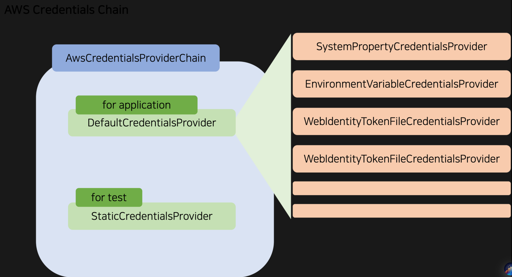
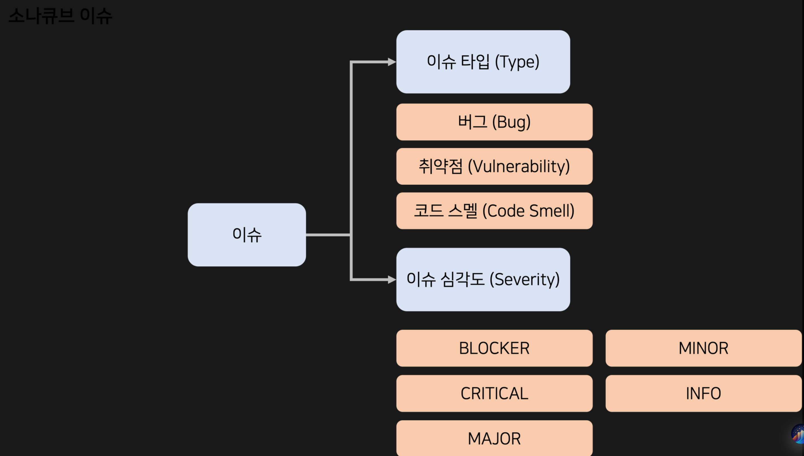
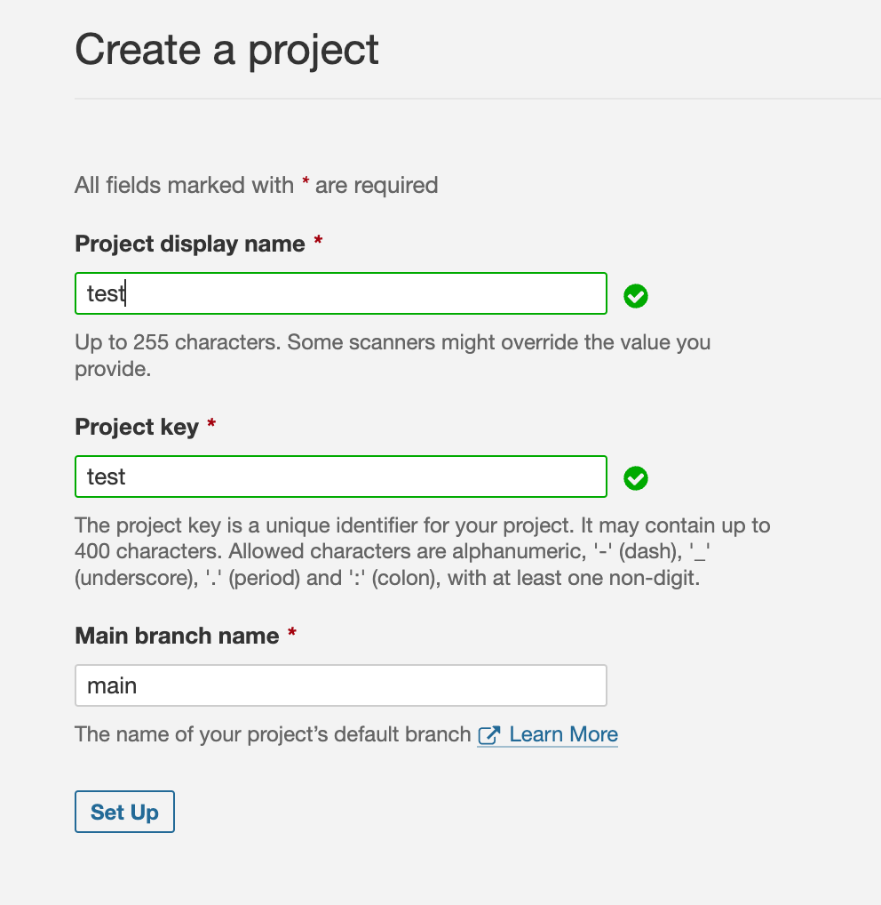
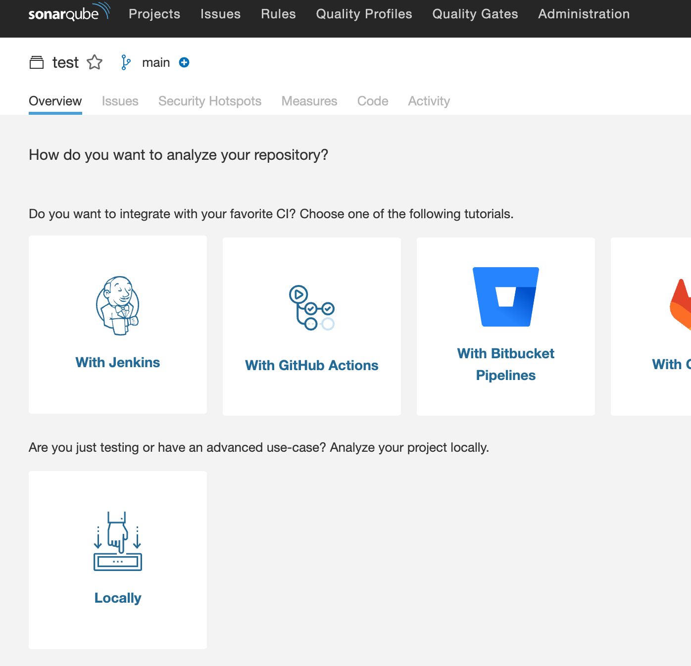
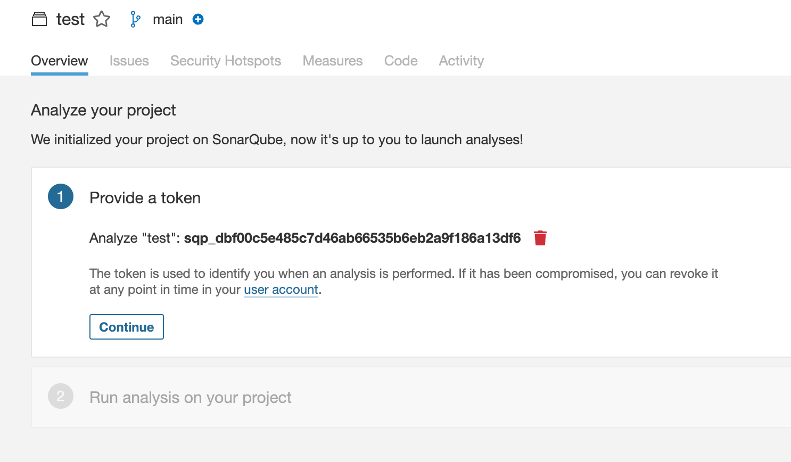
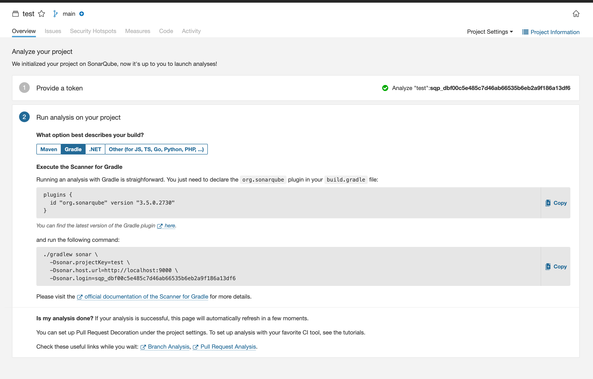
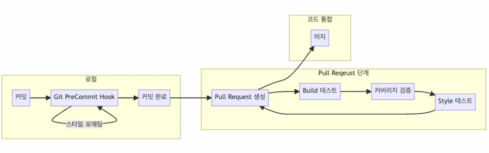

# 하루만에 끝내는 스프링 테스트 - 쥬쥬님

* https://www.inflearn.com/course/%EC%A5%AC%EC%A5%AC%EC%99%80-%ED%95%98%EB%A3%A8%EB%A7%8C%EC%97%90-%EB%81%9D%EB%82%B4%EB%8A%94-%EC%8A%A4%ED%94%84%EB%A7%81%ED%85%8C%EC%8A%A4%ED%8A%B8/dashboard


[toc]


# AAA 패턴 / GWT 패턴

**테스트에서 AAA(Arrange-Act-Assert) 패턴은 테스트 케이스를 작성할 때 사용되는 구조적인 접근 방법.**

** AAA 패턴은 다음과 같은 단계로 구성됩니다.**

1. Arrange (준비) 단계: 테스트를 수행하기 위해 필요한 초기 상태를 설정합니다. 이 단계에서는 테스트할 객체나 변수를 초기화하고, 필요한 데이터를 설정하며, 테스트 환경을 구성합니다.
2. Act (실행) 단계: 테스트 대상 코드를 실행합니다. 이 단계에서는 실제로 테스트할 메서드나 함수를 호출하고, 특정 동작을 수행합니다.
3. Assert (단언) 단계: 예상되는 결과를 확인하고 검증합니다. 이 단계에서는 실행된 코드의 결과나 상태를 기대한 대로 확인하여 테스트가 성공했는지 여부를 판단합니다. 예상된 결과와 실제 결과를 비교하고, 일치하지 않는 경우에는 테스트를 실패로 표시합니다.

AAA 패턴은 테스트 코드를 구조화하여 가독성을 높이고, 테스트의 목적과 결과를 명확하게 전달하는 데 도움을 줍니다. 이 패턴을 사용하면 테스트 케이스를 일관성 있고 구조화된 방식으로 작성할 수 있으며, 테스트 코드의 유지 보수성을 향상시킬 수 있습니다.


> AAA 패턴과 유사한 패턴인 GWT(Given - When - Then) 패턴


# xUnit과 JUnit

**xUnit은 테스트 도구에서 사용되는 테스트 프레임워크의 일종입니다.** xUnit은 다양한 프로그래밍 언어를 지원하며, 테스트 작성, 실행, 결과 분석 등을 효과적으로 수행할 수 있도록 도와줍니다. xUnit은 테스트 주도 개발(Test-Driven Development, TDD) 및 애자일 개발 방법론에서 널리 사용됩니다.

이는 초기에는 단위 테스트를 위해 설계되었지만, 현재는 단위 테스트 뿐만 아니라 통합 테스트, 시스템 테스트 등 다양한 수준의 테스트를 지원합니다. 

xUnit 프레임워크의 주요 특징은 다음과 같습니다.

1. 테스트 케이스 작성: xUnit은 테스트 케이스를 작성할 수 있는 기본적인 구조와 애너테이션 또는 어노테이션을 제공합니다. 개발자는 테스트 메서드를 작성하고, 애너테이션을 사용하여 테스트를 구성할 수 있습니다.
2. 테스트 실행: xUnit은 테스트 케이스를 실행하고 테스트 결과를 수집하는 런처 또는 테스트 실행기를 제공합니다. 이를 통해 테스트를 자동으로 실행하고, 예외 처리 및 테스트 결과를 기록할 수 있습니다.
3. 단언(Assertion): xUnit은 단언(assertion) 메서드를 통해 예상 결과와 실제 결과를 비교하여 테스트 결과를 확인합니다. 이를 통해 코드의 동작이 예상대로 수행되고 있는지를 검증합니다.
4. 테스트 결과 분석: xUnit은 테스트 결과를 분석하고 요약하여 제공합니다. 성공한 테스트, 실패한 테스트, 테스트 커버리지 등의 정보를 통해 테스트의 진행 상황과 코드의 품질을 판단할 수 있습니다.

xUnit 프레임워크는 소프트웨어 테스트의 자동화와 품질 향상을 위해 많이 사용되며, 테스트 주도 개발과 같은 개발 방법론과 함께 사용될 때 가장 효과적으로 활용됩니다.

JUnit 5는 Java 언어를 위한 테스트 프레임워크로서, 단위 테스트를 작성하고 실행하는 데 사용됩니다. JUnit은 소프트웨어 개발자들이 자동화된 테스트를 작성하여 코드의 정확성을 검증하고, 버그를 발견하고, 소프트웨어의 안정성을 향상시키는 데 도움을 줍니다.


# JUnit 테스트에 이름 붙이기

**`@DisplayNameGeneration`** 애너테이션은 테스트 클래스에 사용되며, `테스트 메서드의 이름을 동적으로 생성`하는 데 사용됩니다.

**`@DisplayNameGeneration`** 애너테이션은 **`DisplayNameGenerator`** 인터페이스를 구현한 클래스를 지정합니다.

 이 인터페이스를 구현하여 원하는 방식으로 테스트 메서드의 이름을 생성할 수 있습니다.

*  JUnit 5에서는 **`ReplaceUnderscores`** 및 **`SimpleDisplayNameGenerator`**라는 두 가지 기본 구현체를 제공합니다.

* **`Standard`** class : 디폴트 전략 그대로 반환
* `ReplaceUnderscores` : 언더바(_)를 공백( )으로 바꿔준다 
* **`Simple`** : 클래스의 이름에서 'Test' 접미사를 제거하고 메서드 이름은 그대로 반환. 만약 메서드 이름에 밑줄이 있다면 공백으로 대체
* **`IndicativeSentences`** : 테스트 클래스와 테스트 메서드의 이름을 결합하여 문장 형태로 반환. 'should'이라는 단어가 중간에 들어가며. 밑줄은 공백으로 대체

다음과 같은 방식으로 사용 

```java
@DisplayNameGeneration(DisplayNameGenerator.ReplaceUnderscores.class)
class MyTestClass {
    @Test
    void test_method_with_underscores() {}
}

@DisplayNameGeneration(DisplayNameGenerator.Simple.class)
class MyTest {
    @Test
    void myTestMethod() {}
}

```

 

# Mock 객체를 생성하는 여러 방법

```groovy
testImplementation 'org.mockito:mockito-core:5.2.0'
```

## 1. Mockito.mock()

```java
Mockito.mock(StudentScoreRepository.class);
```

## 2. @Mock

```java
class TestClass {
  @Mock
  StudentScoreRepository studentScoreRepository;
}
```


## Spy 사용법

Mockito의 **`spy()`** 메서드는 실제 객체를 사용하면서 일부 메서드를 모킹하여 테스트하는 데 사용되는 기능입니다. **`mock()`** 메서드와는 달리 **`spy()`** 메서드는 기존 객체를 래핑하여 테스트할 수 있습니다. 모킹된 메서드가 호출되면 실제 구현이 실행되지만, 원하는 메서드에 대해서는 테스트에서 명시적인 동작을 설정할 수 있습니다.

사용 예제 :

```java
import org.mockito.Mockito;

public class Example {
    public static class MyObject {
        public String getValue() {
            return "Real Value";
        }
        
        public String getRealValue() {
            return "Real Value";
        }
    }

    public static void main(String[] args) {
        // MyDependency 클래스의 실제 객체 생성
        MyObject realObject = new MyObject();

        // 실제 객체를 스파이 객체로 래핑
        MyObject spyObject = Mockito.spy(realObject);

        // 일부 메서드의 동작을 모킹
        Mockito.when(spyObject.getValue()).thenReturn("Mocked value");

        // 스파이 객체 사용
        System.out.println(spyObject.getValue()); // 출력: "Mocked value"
        System.out.println(spyObject.getRealValue()); // 출력: "Real Value"
    }
}
```

**`spy()`** 메서드는 **`mock()`** 메서드와는 다르게 실제 객체를 사용하며, 필요한 경우 일부 메서드의 동작을 원하는대로 조작할 수 있습니다. 기존 객체를 테스트 중에 래핑하여 사용하면, 테스트 대상 객체와의 상호작용과 더 가까이 시뮬레이션하여 보다 정확한 테스트를 할 수 있게 됩니다.


# 목 객체 패턴

## Test Data Builder Pattern

객체에 빌더가 없으면 구현하기 불편함

```java
@Builder
public class User {
    private String name;
    private int age;
    // ... (생략)
}

public class UserTestDataBuilder {
    public static User.Builder validUser() {
        return User.builder()
                 .name("jyujyu")
                 .age(20);
    }

    public static User.Builder invalidUser() {
        return User.builder()
						      // 잘못된 데이터로 설정
    }
}
```

## Object Mother 패턴

Object Mother 패턴은 Fixture Object 패턴과 유사

Object Mother 패턴의 핵심 아이디어는 다음과 같습니다:

1. 여러 테스트에서 사용되는 테스트 데이터를 관리하는 클래스를 생성합니다.
2. 해당 클래스에는 다양한 테스트 데이터를 생성하고 초기화하는 메소드들이 포함됩니다.
3. 각 테스트 메소드에서 필요한 테스트 데이터를 Object Mother 클래스의 메소드를 호출하여 가져옵니다.

```java
public class User {
    private String name;
    private int age;
    // ... (생략)
}

public class UserMother {
    public static User createValidUser() {
        User user = new User();
        user.setName("jyujyu");
        user.setAge(20);
        // ... (다른 필드 설정)
        return user;
    }

    public static User createInvalidUser() {
        User user = new User();
        // 잘못된 데이터로 설정
        return user;
    }
}
```


## Fixture Object 패턴 - TestFixture

Fixture Object 패턴은 테스트에서 사용되는 공통 데이터와 객체들을 별도의 Fixture 클래스로 분리하여 관리하는 패턴

* 테스트 클래스가 더 간결해지고, 
* 테스트 데이터의 관리가 편리해지며, 
* 테스트 환경 설정과 정리 작업을 효과적으로 처리할 수 있습니다

Fixture Object 패턴의 기본 아이디어는 다음과 같습니다:

1. 테스트 데이터를 생성하고 초기화하는 작업을 담당하는 Fixture 클래스를 만듭니다.
2. Fixture 클래스는 테스트에 필요한 객체와 데이터를 논리적으로 그룹화합니다.
3. 각 테스트 메소드에서 필요한 Fixture 객체를 생성하여 사용합니다.

```java
public class User {
    private String name;
    private int age;
    // ... (생략)
}

public class UserFixture {
    public static User createValidUser() {
        User user = new User();
        user.setName("jyujyu");
        user.setAge(20);
        // ... (다른 필드 설정)
        return user;
    }

    public static User createInvalidUser() {
        User user = new User();
        // 잘못된 데이터로 설정
        return user;
    }
}

// enum으로도 구현합니다
public enum UserFixture {
  VALID_USER(new User("jyujyu", 20),
  INVALID_USER(new User(잘못된값));
  
  private User user;

  UserFixture(User user);

  public User getUser() {
    return user;
  }
}
```


# 통합테스트 - testConatiners

```groovy
testImplementation 'org.testcontainers:testcontainers:1.19.0'
```

```java
@SpringBootTest
@ContextConfiguration(initializers = IntegrationTest.IntegrationTestInitializer.class)
public class IntegrationTest {

	static DockerComposeContainer rdbms;

	static {
		// 루트 디렉토리
		rdbms = new DockerComposeContainer( new File("infra/test/docker-compose.yml"))
			.withExposedService(
				"local-db", // 컴포즈내의 서비스명
				3306, // 서비스 포트
				Wait.forLogMessage(".*ready for connections.*", 1)
					.withStartupTimeout(Duration.ofSeconds(300))
			)
			.withExposedService(
				"local-db-migrate", // 컴포즈 내의 서비스명
				0, // 서비스 포트. 없으면 0
				Wait.forLogMessage("(.*Successfully applied.*)|(.*Successfully validated.*)", 1)
					.withStartupTimeout(Duration.ofSeconds(300))
			)
			// .withLocalCompose(true)
		;

		rdbms.start();
	}

	static class IntegrationTestInitializer implements ApplicationContextInitializer<ConfigurableApplicationContext> {

		@Override
		public void initialize(ConfigurableApplicationContext applicationContext) {
			Map<String, String> properties = new HashMap<>();

			var rdbmsHost = rdbms.getServiceHost("local-db", 3306);
			var rdbmsPort = rdbms.getServicePort("local-db", 3306);

			properties.put("spring.datasource.url", "jdbc:mysql://" + rdbmsHost + ":" + rdbmsPort + "/score");

			TestPropertyValues.of(properties)
							  .applyTo(applicationContext);
		}
	}
}

```

다음과 같이 실행 가능

```java
class TestApplicationTests extends IntegrationTest{

	@Test
	void contextLoads() {
	}

}
```

```yaml
services:
  local-db:
    image: mysql:8
    environment:
      MYSQL_DATABASE: score
      MYSQL_ROOT_PASSWORD: password
    ports:
      - "3306:3306"
    command: --default-authentication-plugin=mysql_native_password
  local-db-migrate:
    image: flyway/flyway:latest
    environment:
      - FLYWAY_DB_URL=jdbc:mysql://local-db/score?allowPublicKeyRetrieval=true&useSSL=false
      - FLYWAY_DB_USER=root
      - FLYWAY_DB_PASSWORD=password
    command: migrate
    volumes:
      - ../../db/flyway.conf:/flyway/conf/flyway.conf
      - ../../db/migration:/flyway/sql
    depends_on:
      - local-db
```


## 테스트 Flow


1. 테스트 시작 : 테스트를 시작합니다
2. 컨테이너 생성 : testcontainers가 Docker를 이용해 테스트 필요한 컨테이너들(MySQL, Redis 등..)을 생성합니다
3. 동적 프로퍼티 주입 : 생성한 컨테이너의 정보를 기반으로 스프링 프로퍼티 동적으로 주입(overwrite)합니다
4. 테스트 수행 : 생성한 컨테이너를 활용하여 테스트를 수행합니다
5. 테스트 종료: 테스트 종료와 동시에 생성했던 컨테이너들을 정리합니다


# Redis 테스트하기

```groovy
dependencies {
    // 생략 ...
    implementation 'org.springframework.boot:spring-boot-starter-data-redis'
    testImplementation "com.redis.testcontainers:testcontainers-redis-junit:1.6.4"
}
```

```yaml
services:

  local-redis:
    image: redis:6
    ports:
      - "6379:6379"
```

```yaml
spring:
  data:
    redis:
      host: localhost
      port: 6379

```


```java
@RequiredArgsConstructor
@Service
public class RedisService {
	private final RedisTemplate<String, String> redisTemplate;

	public String get(String key) {
		return redisTemplate.opsForValue()
							.get(key);
	}

	public void set(String key, String value) {
		redisTemplate.opsForValue()
					 .set(key, value);
	}
}
```

```java
@SpringBootTest
@ContextConfiguration(initializers = IntegrationTest.IntegrationTestInitializer.class)

public class IntegrationTest {

	static RedisContainer redis;

	static {

		redis = new RedisContainer(RedisContainer.DEFAULT_IMAGE_NAME.withTag("6"));

		// 생략 ...
		redis.start();
	}

	static class IntegrationTestInitializer implements ApplicationContextInitializer<ConfigurableApplicationContext> {

		@Override
		public void initialize(ConfigurableApplicationContext applicationContext) {
			Map<String, String> properties = new HashMap<>();
      
      var redisHost = redis.getHost();
      var redisPort = redis.getFirstMappedPort();

      properties.put("spring.data.redis.host", redisHost);
      properties.put("spring.data.redis.port", redisPort.toString());
		}
	}
}

```

```java
public class RedisServiceTest extends IntegrationTest {
	@Autowired
	private RedisService redisService;

	@Test
	@DisplayName("Redis Get / Set 테스트")
	public void redisGetSetTest() {
		// given
		String expectValue = "hello";
		String key = "hi";

		// when
		redisService.set(key, expectValue);

		// then
		String actualValue = redisService.get(key);

		Assertions.assertEquals(expectValue, actualValue);
	}

}
```


# AWS S3 테스트하기

AWS 서비스를 잘 테스트하기 위해서는 AWS 기본 설정이 필요해요. 대표적으로 AWS 인증을 하는 Credentials이라고 부르는 것들입니다! 제가 실습에서 사용한 AWSCredentials는 아래와 같습니다!



기본적으로 스프링환경에서 AWS SDK는 `AwsCredentialsProvider`라는 인터페이스를 주입받아 인증에 사용합니다. 이 인터페이스의 구현체는 대부분 체이닝된 형식으로 되어있습니다.

AWS에서 기본으로 제공하는 `DefaultCredentialsProvider`는 위와 같은 형식으로 되어있습니다.

`~/.aws/credentials` 파일을 읽거나, 환경변수에서 `AWS_*` 키 값을 가져오거나, AWS ECS와 같은 환경에서는 컨테이너에 부여한 IAM Role을  사용하곤 합니다. 즉 기본적으로 애플리케이션 실행에 필요한 대부분의 Credentials를 지원하며 실제로 AWS 서비스를 이용하기 위해서는 DefaultCredentialsProvider를 사용해야합니다.

하지만, 저희는 테스트를 위해 위 모든 체인에서 사용할 수 있는 인증 정보가 없기 때문에, 정적 문자열을 이용해 가짜로 된 인증 정보인 StaticCredentialsProvider를 만들고, 이를 다시 체이닝하여 사용합니다.


의존성 설정

```groovy
dependencies {
    // ...

    implementation(platform("software.amazon.awssdk:bom:2.20.136"))
    implementation("commons-io:commons-io:2.13.0")
    implementation("software.amazon.awssdk:aws-core")
    implementation("software.amazon.awssdk:sdk-core")
    implementation("software.amazon.awssdk:sts")
    implementation("software.amazon.awssdk:s3")
    testImplementation("org.testcontainers:localstack:1.19.0")
}
```

infra/local/docker-compose.yaml

```yaml
version: "3.8"

services:
  # 생략 ...
  local-aws:
    image: localstack/localstack:1.2
    environment:
      - SERVICES=s3
      - DEBUG=1
      - PORT_WEB_UI=4567
      - AWS_DEFAULT_REGION=ap-northeast-2
      - USE_SSL=0
    ports:
      - "4566:4566"
```

src/main/resources/static/sample.txt 에 생성

```txt
hello ysk!
```

application.yml 설정

```
aws:
  endpoint: localhost:4566
```

S3Config 클래스 설정

```java
@Configuration
public class S3Config {

	@Value("${aws.endpoint}")
	String awsEndpoint;

	@Bean
	public AwsCredentialsProvider awsCredentialsProvider() {
		return AwsCredentialsProviderChain.builder()
										  .reuseLastProviderEnabled(true)
										  .credentialsProviders(List.of(
											  DefaultCredentialsProvider.create(),
											  StaticCredentialsProvider.create(AwsBasicCredentials.create("foo", "bar"))
										  ))
										  .build();
	}

	@Bean
	public S3Client s3Client() {
		return S3Client.builder()
					   .credentialsProvider(awsCredentialsProvider())
					   .region(Region.AP_NORTHEAST_2)
					   .endpointOverride(URI.create(awsEndpoint))
					   .build();
	}
}
```

S3Service 생성

```java
@RequiredArgsConstructor
@Service
public class S3Service {
	
	private final S3Client s3Client;

	public void putFile(String bucket, String key, File file) {
		s3Client.putObject((req) -> {
			req.bucket(bucket);
			req.key(key);
		}, RequestBody.fromFile(file));
	}

	public File getFile(String bucket, String key) {
		var file = new File("build/output/getFile.txt");

		var res = s3Client.getObject((req) -> {
			req.bucket(bucket);
			req.key(key);
		});

		try {
			FileUtils.writeByteArrayToFile(file, res.readAllBytes());
		} catch (Exception e) {
			// ignore
		}

		return file;
	}

}
```

테스트 컨테이너 설정

```java
@SpringBootTest
@ContextConfiguration(initializers = IntegrationTest.IntegrationTestInitializer.class)
public class IntegrationTest {

	static LocalStackContainer aws;

	static {

		DockerImageName imageName = DockerImageName.parse("localstack/localstack:0.11.2");
		
    aws = (new LocalStackContainer(imageName))
			.withServices(LocalStackContainer.Service.S3)
			.withStartupTimeout(Duration.ofSeconds(600));
		aws.start();
	}

	static class IntegrationTestInitializer implements ApplicationContextInitializer<ConfigurableApplicationContext> {

		@Override
		public void initialize(ConfigurableApplicationContext applicationContext) {
			Map<String, String> properties = new HashMap<>();

			try {
				aws.execInContainer(
					"awslocal",
					"s3api",
					"create-bucket",
					"--bucket",
					"test-bucket"
				);

				properties.put("aws.endpoint", aws.getEndpoint().toString());
			} catch (Exception e) {
				// ignore ..
			}
      TestPropertyValues.of(properties)
        .applyTo(applicationContext); // 마지막에 설정 해야 적용된다
		}
	}
}

```

S3Service 테스트

```java
class S3ServiceTest extends IntegrationTest {
	@Autowired
	private S3Service s3Service;

	@Test
	void s3PutAndGetTest() throws Exception {
		// given
		var key = "sampelObject.txt";
		var sampleFile = new ClassPathResource("static/sample.txt").getFile();

		// when
		s3Service.putFile("test-bucket", key, sampleFile);

		// then
		var resultFile = s3Service.getFile("test-bucket", key);

		var sampleFileLines = Files.readAllLines(Paths.get(sampleFile.getPath()));
		var responseFileLines = Files.readAllLines(Paths.get(resultFile.getPath()));

    
     System.out.println("============================== here");
        System.out.println(sampleFile.length());
        System.out.println(resultFile.length());
        System.out.println(Arrays.toString(sampleFileLines.toArray()));
        System.out.println(Arrays.toString(responseFileLines.toArray()));
        System.out.println("============================== here");
    
		Assertions.assertIterableEquals(sampleFileLines, responseFileLines);
	}
}
```


# Kafka 테스트

```groovy
dependencies {
    // 생략  ...

    implementation("org.springframework.kafka:spring-kafka")
    testImplementation("org.testcontainers:kafka")
}
```

```yaml
spring:
  kafka:
    bootstrap-servers: localhost:9092
    consumer:
      auto-offset-reset: earliest

```

코드 작성

```java
@RequiredArgsConstructor
@Configuration
public class KafkaConsumerApplication {
	private final KafkaConsumerService kafkaConsumerService;

	@Bean
	public NewTopic topic() {
		return TopicBuilder.name("test-topic")
						   .build();
	}

	@KafkaListener(id = "test-id", topics = "test-topic")
	public void listen(String message) {
		kafkaConsumerService.process(message);
	}
	
}
//
@Service
public class KafkaProducerService {
	private final KafkaTemplate<String, String> kafkaTemplate;

	public void send(String topic, String message) {
		kafkaTemplate.send(topic, message);
	}
}
//
@Service
public class KafkaConsumerService {

	public void process(String message) {
		System.out.println("processing ... " + message);
	}
}
```

컨테이너 설정

```java
@SpringBootTest
@ContextConfiguration(initializers = IntegrationTest.IntegrationTestInitializer.class)
public class IntegrationTest {

	static KafkaContainer kafka;

	static {
		kafka = new KafkaContainer(DockerImageName.parse("confluentinc/cp-kafka:7.5.0"))
			.withKraft();
		kafka.start();
	}

	static class IntegrationTestInitializer implements ApplicationContextInitializer<ConfigurableApplicationContext> {

		@Override
		public void initialize(ConfigurableApplicationContext applicationContext) {
			Map<String, String> properties = new HashMap<>();

			properties.put("spring.kafka.bootstrap-servers", kafka.getBootstrapServers());

			TestPropertyValues.of(properties)
							  .applyTo(applicationContext); // 마지막에 설정 해야 적용된다
		}
	}
}

```

테스트 작성

```java
class KafkaConsumerApplicationTests extends IntegrationTest {

	@Autowired
	private KafkaProducerService kafkaProducerService;

	@MockBean
	private KafkaConsumerService kafkaConsumerService;

	@Test
	void kafkaSendAndConsumeTest() {
		String topic = "test-topic";
		String expectValue = "expect-value";

		kafkaProducerService.send(topic, expectValue);

		var stringCaptor = ArgumentCaptor.forClass(String.class);

		Mockito.verify(kafkaConsumerService, Mockito.timeout(5000)
													.times(1))
			   .process(stringCaptor.capture());

		Assertions.assertEquals(expectValue, stringCaptor.getValue());
	}
	
}
```

## API로 카프카 테스트

docker-compose.yaml 에 아래처럼 로컬 카프카 컨테이너를 추가

```yaml
services:
  # 생략 ...

  local-kafka:
    image: confluentinc/cp-kafka:7.5.0
    hostname: broker
    container_name: broker
    ports:
      - "9092:9092"
      - "9101:9101"
    environment:
      KAFKA_NODE_ID: 1
      KAFKA_LISTENER_SECURITY_PROTOCOL_MAP: 'CONTROLLER:PLAINTEXT,PLAINTEXT:PLAINTEXT,PLAINTEXT_HOST:PLAINTEXT'
      KAFKA_ADVERTISED_LISTENERS: 'PLAINTEXT://broker:29092,PLAINTEXT_HOST://localhost:9092'
      KAFKA_OFFSETS_TOPIC_REPLICATION_FACTOR: 1
      KAFKA_GROUP_INITIAL_REBALANCE_DELAY_MS: 0
      KAFKA_TRANSACTION_STATE_LOG_MIN_ISR: 1
      KAFKA_TRANSACTION_STATE_LOG_REPLICATION_FACTOR: 1
      KAFKA_JMX_PORT: 9101
      KAFKA_JMX_HOSTNAME: localhost
      KAFKA_PROCESS_ROLES: 'broker,controller'
      KAFKA_CONTROLLER_QUORUM_VOTERS: '1@broker:29093'
      KAFKA_LISTENERS: 'PLAINTEXT://broker:29092,CONTROLLER://broker:29093,PLAINTEXT_HOST://0.0.0.0:9092'
      KAFKA_INTER_BROKER_LISTENER_NAME: 'PLAINTEXT'
      KAFKA_CONTROLLER_LISTENER_NAMES: 'CONTROLLER'
      KAFKA_LOG_DIRS: '/tmp/kraft-combined-logs'
      # Replace CLUSTER_ID with a unique base64 UUID using "bin/kafka-storage.sh random-uuid"
      # See https://docs.confluent.io/kafka/operations-tools/kafka-tools.html#kafka-storage-sh
      CLUSTER_ID: 'MkU3OEVBNTcwNTJENDM2Qk'
```

```java
@RequiredArgsConstructor
@RestController
public class KafkaApi {
    private final KafkaProduceService kafkaProduceService;

    @GetMapping("/kafka/producer/send")
    public void send(
            @RequestParam("topic") String topic,
            @RequestParam("value") String value
    ) {
        kafkaProduceService.send(topic, value);
    }
}
```


# 정적 테스트

* ArchUnit : 
* https://www.archunit.org/userguide/html/000_Index.html

```groovy
dependencies {
    // 생략 ...

    testImplementation 'com.tngtech.archunit:archunit:1.1.0'
}
```

```java
import static com.tngtech.archunit.lang.syntax.ArchRuleDefinition.*;

import com.tngtech.archunit.core.domain.JavaClasses;
import com.tngtech.archunit.core.importer.ClassFileImporter;
import com.tngtech.archunit.core.importer.ImportOption;
import com.tngtech.archunit.lang.ArchRule;

class ArchitectureTest {

	private static final String ROOT_PACKAGE = "com.ys.test";

	JavaClasses javaClasses = new ClassFileImporter()
		.withImportOption(new ImportOption.DoNotIncludeTests())
		.importPackages(ROOT_PACKAGE); // 우리 루트 패키지명

	@BeforeEach
	void beforeEach() {
		javaClasses = new ClassFileImporter()
			.withImportOption(new ImportOption.DoNotIncludeTests())
			.importPackages(ROOT_PACKAGE); // 모든 소스 파일이 대상
	}

	@Test
	@DisplayName("컨트롤러 패키지 안에 있는 클래스들은 Api로 끝나야 한다")
	void controllerTest() {
		ArchRule rule = classes().that()
								 .resideInAnyPackage("..controller")
								 .should()
								 .haveSimpleNameEndingWith("Api");

		rule.check(javaClasses);
	}

	@Test
	@DisplayName("repository 패키지 안에 있는 클래스들은 interface여야 한다")
	void archRepositoryTest() {

		ArchRule rule = classes()
			.that().resideInAnyPackage("..repository..")
			.should().beInterfaces();

		rule.check(javaClasses);
	}

	@Test
	@DisplayName("controller 패키지 안에 있는 클래스들은 RestController나 Controller 어노테이션이여야 한다.")
	void archControllerTest() {
		ArchRule rule = classes()
			.that().resideInAnyPackage("..controller")
			.should().beAnnotatedWith(RestController.class)
			.orShould().beAnnotatedWith(Controller.class);

		rule.check(javaClasses);
	}
}

```


# ArchUnit 의존관계 아키텍처 검증

Controller

- Controller는 Service와 Request / Response를 사용할 수 있음
- Controller는 의존되지 않음
- Controller는 Model(or Entity)을 사용할 수 없음

Service

- Service는 Controller를 의존하면 안됨

Model

- Model은 오직 Service와 Repository에 의해 의존됨
- Model은 아무것도 의존하지 않음

```java
class ArchitectureTest {

	private static final String ROOT_PACKAGE = "com.ys.test";

	JavaClasses javaClasses = new ClassFileImporter()
		.withImportOption(new ImportOption.DoNotIncludeTests())
		.importPackages(ROOT_PACKAGE); // 우리 루트 패키지명

	@BeforeEach
	void beforeEach() {
		javaClasses = new ClassFileImporter()
			.withImportOption(new ImportOption.DoNotIncludeTests())
			.importPackages(ROOT_PACKAGE); // 모든 소스 파일이 대상
	}

	@Test
	void controllerDependencyTest() {
		ArchRule rule = classes()
			.that()
			.resideInAnyPackage("..controller")
			.should()
			.dependOnClassesThat()
			.resideInAnyPackage("..request..", "..response..", "..service..");

		rule.check(javaClasses);
	}

	@DisplayName("Controller는 의존되지 않음")
	@Test
	void controllerDependencyTest2() {

		ArchRule rule = classes()
			.that()
			.resideInAnyPackage("..controller")
			.should()
			.onlyHaveDependentClassesThat()
			.resideInAnyPackage("..controller");

		rule.check(javaClasses);
	}

	@DisplayName("Controller는 Model 사용 불가")
	@Test
	void controllerDependencyTest3() {

		ArchRule rule = noClasses()
			.that()
			.resideInAnyPackage("..controller")
			.should()
			.onlyHaveDependentClassesThat()
			.resideInAnyPackage("..model..");

		rule.check(javaClasses);
	}
  
  @DisplayName("model은 아무것도 의존하지 않음")
	@Test
	void modelDependencyTest() {
		ArchRule rule = classes()
			.that()
			.resideInAnyPackage("..model..")
			.should()
			.onlyDependOnClassesThat()
			.resideInAnyPackage("..model..", "java..", "jakarta..");

		rule.check(javaClasses);

	}
  
}
```


# 테스트 커버러지 측정 및 검증

Jacoco 공식 문서는 난해합니다! Gradle의 Jacoco Plugin 가이드를 읽어보세요!

https://docs.gradle.org/current/userguide/jacoco_plugin.html


gradle 설정

```groovy
plugins {
    // 생략 ...

    id 'jacoco'
}

jacoco {
    toolVersion = "0.8.8"
}

tasks.named('test') {
    useJUnitPlatform()

    jacoco {}
    finalizedBy(tasks.jacocoTestReport)
}

tasks.jacocoTestReport {
    reports {
        xml.required = true
        html.required = true
        csv.required = false

        xml.destination(file("build/jacoco/jacoco.xml"))
        html.destination(file("build/jacoco/jacoco.html"))
    }

    finalizedBy(tasks.jacocoTestCoverageVerification)
}

tasks.jacocoTestCoverageVerification {
    violationRules {
        rule {
            enabled = true
            element = "CLASS"

            limit {
                counter = "LINE"
                value = "COVEREDRATIO"
                minimum = BigDecimal.valueOf(0.5)
            }

            limit {
                counter = "LINE"
                value = "TOTALCOUNT"
                maximum = BigDecimal.valueOf(300)
            }

            excludes = List.of(
                    "*.test.*",
                    "*.controller.*",
                    "com.jyujyu.dayonetest.MyCalculatorApplication",
                    "com.jyujyu.dayonetest.DayonetestApplication",
            )
        }
    }
}
```


# 정적 코드 분석 - 소나큐브 

소나큐브 유저 가이드를 읽어보고, 소나큐브의 컨셉과 용어를 익혀보세요!

https://docs.sonarsource.com/sonarqube/10.1/user-guide/concepts/



소나큐브로 코드를 분석하게 되면, 기본적으로 이슈(Issue)라는 것이 생겨납니다.

이슈는 이슈 타입(Issue Type)과 이슈 심각도(Issue Severity)로 나누어지게 되며, 이 분류에 따라 이슈에 우선순위를 매겨 관리해야 합니다!


이슈 타입은 버그, 취약점, 코드스멜로 나누어지게 되며, 버그와 취약점에 해당하지 않는 이슈의 경우 코드 스멜로 분류됩니다.

- 버그 : 애플리케이션에 버그를 일으킬 가능성이 매우 큰 코드
- 취약점 : 애플리케이션에 보안적 문제를 일으킬 가능성이 매운 큰 코드
- 코드 스멜 : 버그와 취약점에 해당하지 않지만 Rule에 의해 발견된 코드

이슈 심각도는 BLOCKER, CRITICAL, MAJOR, MINOR, INFO 순서로 심각도를 나타내며 

이름에서 느껴지듯이 BLOCKER와 CRITICAL의 경우 서비스에 즉각적인 문제를 일으킬 수 있으므로 배포가 되기전 확인이 필수적으로 되어야합니다!


## 소나 큐브 도커 컴포즈 

```yaml
version: "3.8"

services:
  local-sonar:
    image: sonarqube:9.9.2-community
    ports:
      - "9000:9000"
      - "9092:9092"
```

```bash
$ docker-compose -f sonar-docker-compose.yaml up
```

http://localhost:9000/sessions/new?return_to=%2F 접속

* id : admin
* password : admin

하단 manualy 클릭

* http://localhost:9000/projects/create?mode=manual 



다음 locally 클릭 



다음  generate




* 키를 잘 복사해야 한다 

다음 Continue 누르고 gradle 선택 



gradle 세팅

```groovy
plugins {
    id "org.sonarqube" version "4.0.0.2929"
}


sonar {
    properties {
        property("sonar.host.url", "http://localhost:9000")
        property("sonar.login", "sqp_dbf00c5e485c7d46ab66535b6eb2a9f186a13df6") // 생성한 토큰
        property("sonar.sources", "src/main/java")
        property("sonar.tests", "src/test/java")
        property("sonar.sourceEncoding", "UTF-8")
        property("sonar.projectKey", "test") // 생성한 프로젝트 이름
        property("sonar.projectName", "test") // 생성한 프로젝트 이름
        property("sonar.coverage.jacoco.xmlReportPaths", "build/jacoco/jacoco.xml") // 생성한 jacoco xml 경로

    }
}
```

gradle -> tasks -> verification -> sonar 실행 

* http://localhost:9000/dashboard?id=test&selectedTutorial=local 에 결과가 나옴 

## 정적 코드 테스트 - 코드 스타일 검증

```groovy
plugins {
    // ...
    id 'com.diffplug.spotless' version '6.21.0'
}

spotless {
    java {
        googleJavaFormat()

        removeUnusedImports()
        trimTrailingWhitespace()
        indentWithSpaces()
        endWithNewline()
    }
}
```

script/pre-commit 생성 

```sh
#!/bin/sh

targetFiles=$(git diff --staged --name-only)

echo "Apply Spotless.."
./gradlew spotlessApply

for file in $targetFiles; do
  if test -f "$file"; then
    git add $file
  fi
done
```

```
$ chmod +x script/pre-commit
```

build.gradle에 추가 

```groovy
tasks.register('addGitPrecommitHook', Copy) {
    from 'script/pre-commit'
    into '.git/hooks'
}
```


# Pull Request 테스트 - 테스트 자동화 



.github/workflows/pull-request-test.yaml

```yml
name: Pull Request Test

on:
  pull_request:
    types: [opened, synchronize, reopened]

permissions: read-all

jobs:
  build-test:
    runs-on: ubuntu-latest
    permissions:
      contents: read
      pull-requests: write
    steps:
      - name: Git Checkout
        uses: actions/checkout@v3.0.2

      - uses: dorny/paths-filter@v2
        id: changes
        with:
          filters: |
            application:
              - 'build.gradle'
              - 'src/**'

      - name: JDK 설치
        if: steps.changes.outputs.application == 'true'
        uses: actions/setup-java@v3
        with:
          distribution: zulu
          java-version: 17
          cache: 'gradle'
      - name: Gradle Build
        if: steps.changes.outputs.application == 'true'
        run: |
          ./gradlew build --parallel

      - name: Coverage Report
        if: steps.changes.outputs.application == 'true'
        uses: madrapps/jacoco-report@v1.6.1
        with:
          token: ${{ secrets.GITHUB_TOKEN }}
          title: Code Coverage
          update-comment: true
          min-coverage-overall: 30
          min-coverage-changed-files: 30
          paths: |
            ${{ github.workspace }}/**/build/jacoco/jacoco.xml

  style-test:
    runs-on: ubuntu-latest
    steps:
      - name: Git Checkout
        uses: actions/checkout@v3.0.2

      - uses: dorny/paths-filter@v2
        id: changes
        with:
          filters: |
            application:
              - 'build.gradle'
              - 'src/**'

      - name: JDK 설치
        if: steps.changes.outputs.application == 'true'
        uses: actions/setup-java@v3
        with:
          distribution: zulu
          java-version: 17
          cache: 'gradle'

      - name: Style Check
        if: steps.changes.outputs.application == 'true'
        run: |
          ./gradlew spotlessCheck
```

