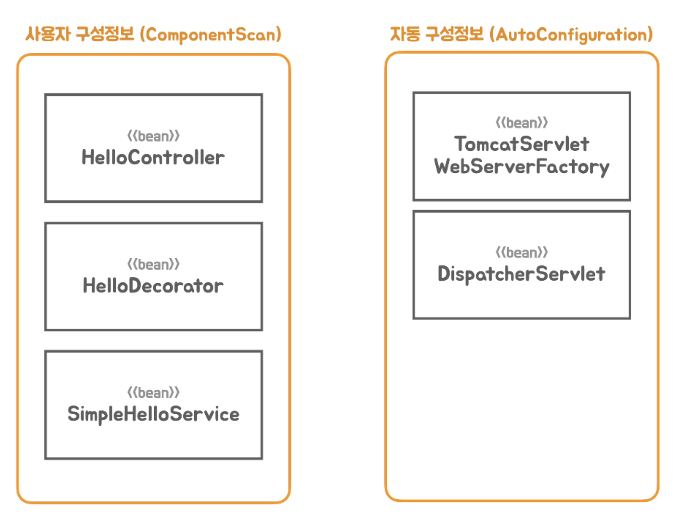

# Toby의 스프링 부트 - 이해와 원리


스프링 부트(Spring Boot)는 스프링을 기반으로 실무 환경에 사용 가능한 수준의 독립실행형 애플리케이션을 복잡한 고민 없이 빠르게 작성할 수 있게 도와주는 여러가지 도구의 모음이다


강의 목표. 

* 스프링부트의 동작 방법, 원리
* 스프링을 어떻게 이용해서 동작하는지

## 스프링 부트의 핵심 목표

* 매우 빠르고 광범위한 영역의 스프링 개발 경험을 제공
* 강한 주장을 가지고 즉시 적용 가능한 기술 조합을 제공하면서, 필요에 따라 원하는 방식으로 손쉽게 변형 가능
* 프로젝트에서 필요로 하는 다양한 비기능적인 기술(내장형 서버, 보안, 메트릭, 상태 체크, 외부 설정 방식 등) 제공
* 코드 생성이나 XML 설정을 필요로 하지 않음


스프링 부트는 2012년 스프링 프레임워크 프로젝트에 이슈로 등록된 “Containerless 웹 개발 아키텍처의지원” 요청에서 논의와 개발 시작되었다.

> https://github.com/spring-projects/spring-framework/issues/14521


## 컨테이너리스(Containerless) 개발

“컨테이너 없는” 웹 애플리케이션 아키텍처란?


웹 컨테이너의 역할

* 웹 컴포넌트의 라이프사이클 관리

* 여러 웹 컴포넌트를 관리

* 자바의 웹 컴포넌트 : 서블릿

* 서블릿을 관리하는 컨테이너 : 서블릿 컨테이너 (톰캣)
* 스프링 컨테이너는 서블릿 컨테이너의 뒤에 존재하면서, 스프링 컴포넌트(빈)들을 관리한다.

스프링 애플리케이션 개발에 요구되는 서블릿 컨테이너의 설치, WAR 폴더 구조, web.xml,
WAR 빌드, 컨테이너로 배치, 포트 설정, 클래스로더, 로깅 등과 같은 필요하지만 애플리케이션 개발의 핵심이 아닌 단순 반복 작업을 제거해주는 개발 도구와 아키텍처 지원한다

스프링부트는 설치된 컨테이너로 배포하지 않고 **독립실행형(standalone) 자바 애플리케이션**으로 동작

## 강한 주장을 가진(opinionated) 도구

스프링 부트는 매 버전마다 사용할 기술의 종류를 선정하는 것만으로 사전 검증된 추천 기술과 라이브러리 구성, 의존 관계와 적용할 버전, 각 라이브러리의 세부 구성과 디폴트 설정을 제공한다

하지만 원한다면 스프링 부트가 제시한 구성을 오버라이드 하거나 재구성하는 것이 가능한
데, 매우 안전하고 명료한 방법을 통해서 원하는 방법으로 재구성할 수 있다

> "프레임워크를 효과적으로 재사용하기 위해서는 프레임워크의 최종 모 습뿐만 아니라 현재의 모습을 띠게 되기까지 진화한 과정을 살펴 보는 것이 가장 효과적이다. 
>
> 프레임워크의 진화 과정 속에는 프레임워크의 구성 원리 및 설계 원칙, 재사용 가능한 컨텍스트와 변경 가능성에 관련
> 된 다양한 정보가 들어 있기 때문이다. “
>
> 조영호 (프레임워크 3부)
> http://aeternum.egloos.com/2640343


## API 테스트 도구

HTTP 요청을 만들고 응답을 확인하는데 사용되는 도구
웹 브라우저 개발자 도구
curl
[HTTPie](https://httpie.io)
Intellij IDEA Ultimate- http request
Postman API Platform
JUnit Test
각종 API 테스트 도구


## HTTP

**Request**

* Request Line: Method, Path, HTTP Version
* Headers
* Message Body

**Response**

* Status Line: HTTP Version, Status Code, Status Text
* Headers
* Message Body


# 독립 실행형 서블릿 애플리케이션
 서블릿 컨테이너를 동작시키는 방법

## 1. SpringBoot 제거

```
// 아래 두 코드를 제거하고 main()만 남긴다 
@SpringBootApplication
SpringApplication.run(HellobootApplication.class, args);
```

## 2. 서블릿 컨테이너 띄우기 (톰캣 띄우기)

스프링 부트 프로젝트를 만들 때 web 모듈을 선택하면 다음과 같은 내장형 톰캣 라이브러리가 추가된다

```
org.apache.tomcat.embed:tomcat-embed-core:9.0.69
org.apache.tomcat.embed:tomcat-embed-el:9.0.69
org.apache.tomcat.embed:tomcat-embed-websocket:9.0.69
```

내장형 톰캣의 초기화 작업과 간편한 설정을 지원하도록 스프링 부트가 제공하는 TomcatServletWebServerFactory
를 사용하면 톰캣 웹 서버(서블릿 컨테이너)를 실행하는 코드를 만들 수 있다

```java
ServletWebServerFactory serverFactory = new TomcatServletWebServerFactory();
//TomcatServletWebServerFactory 를 언제든지 제티, 언더토우로 교체 가능 
WebServer webServer = serverFactory.getWebServer();
webServer.start();
```

## 3. 서블릿 등록

드에서 서블릿을 등록하려면 ServletContext가 필요하다. ServletContext를 전달해서 서블릿 등록과 같은 초기화
작업을 할 때는 ServletContextInitializer를 구현한 오브젝트를 ServletWebServerFactory의 getWebServer() 메소
드에 전달한다.
ServletContextInitializer는 @FunctionalInterface이므로 람다식으로 전환해서 사용하면 편리하다

```java
@FunctionalInterface
public interface ServletContextInitializer {
void onStartup(ServletContext servletContext) throws ServletException;
}
```

* 서블릿은 HttpServlet 클래스를 상속해서 필요한 메소드를 오버라이딩 하는 방식으로 만들 수 있다.
* https://docs.oracle.com/javaee/7/api/javax/servlet/http/HttpServlet.html

서블릿을 등록할 때는 서블릿 이름과 서블릿 오브젝트를 이용한다. 

* 서블릿 등록 정보에는 매핑할 URL 정보를 지정해야한다

```java
servletContext.addServlet("hello", new HttpServlet() {
	@Override
	protected void service(HttpServletRequest req, HttpServletResponse resp) throws ServletException, 	IOException {
	}
}).addMapping("/hello");
```

```java
public class TobyspringApplication {

	public static void main(String[] args) {
		ServletWebServerFactory serverFactory = new TomcatServletWebServerFactory();
		WebServer webServer = serverFactory.getWebServer(servletContext -> {

			servletContext.addServlet("hello", new HttpServlet() {
				@Override
				protected void doGet(HttpServletRequest req, HttpServletResponse resp) throws
					ServletException,
					IOException {
					resp.setStatus(HttpStatus.OK.value());
					resp.setHeader(HttpHeaders.CONTENT_TYPE, MediaType.TEXT_PLAIN_VALUE);
					resp.getWriter().print("Hello Servlet");
				}
			}).addMapping("/hello");
		});
		webServer.start();
	}

}
```

* localhost:8080/hello 로 요청을 보내면 응답이 온다.


## 프론트 컨트롤러 (Front Controller)


여러 요청을 처리하는데 반복적으로 등장하게 되는 공통 작업을 하나의 오브젝트에서 일괄적으로 처리하게 만드는 방
식을 프론트 컨트롤러 패턴이라고 한다.

* https://martinfowler.com/eaaCatalog/frontController.html

서블릿을 프론트 컨트롤러로 만들려면 모든 요청, 혹은 일정 패턴을 가진 요청을 하나의 서블릿이 담당하도록 매핑해준다.

### 프론트 컨트롤러로 전환하는법

프론트 컨트롤러가 모든 URL을 다 처리할 수 있도록 서블릿 바인딩을 변경한다.
```java
}).addMapping("/*");
```

```java
public class TobyspringApplication {

	public static void main(String[] args) {
		ServletWebServerFactory serverFactory = new TomcatServletWebServerFactory();
		WebServer webServer = serverFactory.getWebServer(servletContext -> {

			servletContext.addServlet("hello", new HttpServlet() {
				@Override
				protected void doGet(HttpServletRequest req, HttpServletResponse resp) throws
					ServletException,
					IOException {
					resp.setStatus(HttpStatus.OK.value());
					resp.setHeader(HttpHeaders.CONTENT_TYPE, MediaType.TEXT_PLAIN_VALUE);
					resp.getWriter().print("Hello Servlet");
				}
			}).addMapping("/*");
		});
		webServer.start();
	}

}
```

서블릿 내에서 HTTP 요청 정보를 이용해서 각 요청을 분리한다. 

만약 처리할 수 있는 HTTP 요청 정보가 없다면 상태코드를 404로 설정한다.

```java
if (req.getRequestURI().equals("/hello") && req.getMethod().equals(HttpMethod.GET.name())) {
...
} else if (req.getRequestURI().equals("/user")) {
...
} else {
resp.setStatus(HttpStatus.NOT_FOUND.value());
}
```


### 컨트롤러 매핑(Controller Mapping)과 바인딩

프론트 컨트롤러가 요청을 분석해서 처리할 요청을 구분한 뒤에 이를 처리할 핸들러(컨트롤러 메소드)로 요청을 전달한다. 

* 프론트 컨트롤러가 HTTP 요청을 처리할 핸들러를 결정하고 연동하는 작업을 <u>**매핑**</u>이라고 한다

* 들러에게 웹 요청 정보를 추출하고 의미있는 오브젝트에 담아서 전달하는 작업을 <u>**바인딩**</u>이라고 한다

프론트 컨트롤러의 두 가지 중요한 기능은 <u>매핑</u>과 <u>바인딩</u>이다


# 독립 실행형 스프링 애플리케이션
## 스프링 컨테이너 사용


스프링 컨테이너는 애플리케이션 로직이 담긴 평범한 자바 오브젝트(POJO)와 구성 정보(Configuration Metadata)
를 런타임에 조합해서 동작하는 최종 애플리케이션을 만들어낸다


코드로 스프링 컨테이너를 만드는 가장 간단한 방법은 컨테이너를 대표하는 인터페이스인 ApplicationContext를 구현한
GenericApplicationContext를 이용하는 것이다

* https://docs.spring.io/spring-framework/docs/5.3.x/javadoc-api/org/springframework/context/support/GenericApplicationContext.html

이를 통해서 컨테이너에 등록할 빈 오브젝트 클래스 정보를 직접 등록할 수 있다. 이를 참고해서 컨테이너가 빈 오브젝트를 직접 생성한다

```java
GenericApplicationContext applicationContext = new GenericApplicationContext();
applicationContext.registerBean(HelloController.class);
applicationContext.refresh();
```

컨테이너에 필요한 정보를 등록하고 refresh()를 이용해서 초기화 작업을 진행한다.

ApplicationContext의 getBean() 메소드를 이용해서 컨테이너가 관리하는 빈 오브젝트를 가져올 수 있다. 

빈의 타입(클래스, 인터페이스) 정보를 이용해서 해당 타입의 빈을 요청한다.

```java
HelloController helloController = applicationContext.getBean(HelloController.class);
```

## 의존 오브젝트 추가

스프링 컨테이너는 싱글톤 패턴과 유사하게 애플리케이션이 동작하는 동안 딱 하나의 오브젝트만을 만들고 사용되게 만들어준다. 

이런 면에서 스프링 컨테이너는 **싱글톤 레지스트리라**고도 한다


## Dependency Injection
스프링 컨테이너는 DI 컨테이너이다. 스프링은 DI를 적극적으로 활용해서 만들어져 있고, 스프링을 이용해서 애플리케이
션을 개발할 때 DI를 손쉽게 적용할 수 있도록 지원해준다

* https://martinfowler.com/articles/injection.html

**어셈블러** : DI에는 두 개의 오브젝트가 동적으로 의존관계를 가지는 것을 도와주는 제3의 존재


스프링 컨테이너는 DI를 가능하게 해주는 어셈블러로 동작한다

## DispatcherServlet

https://docs.spring.io/spring-framework/docs/5.3.x/javadoc-api/org/springframework/web/servlet/DispatcherServlet.html

스프링에는 앞에서 만들었던 프론트 컨트롤러와 같은 역할을 담당하는 DispatcherServlet이 있다.
DispatcherServlet은 서블릿으로 등록되어서 동작하면서, 스프링 컨테이너를 이용해서 요청을 전달할 핸들러인 컨트롤러
오브젝트를 가져와 사용한다.
DispatcherServlet이 사용하는 스프링 컨테이너는 GenericWebApplicationContext 를 이용해서 작성한다.


## 스프링 컨테이너로 통합

```java
public class TobyspringApplication {

	public static void main(String[] args) {

		GenericWebApplicationContext applicationContext = new GenericWebApplicationContext() {
			@Override
			protected void onRefresh() {
				super.onRefresh();
				ServletWebServerFactory serverFactory = new TomcatServletWebServerFactory();
				WebServer webServer = serverFactory.getWebServer(servletContext -> {
					servletContext.addServlet("dispatcherServlet",
							new DispatcherServlet(this))
						.addMapping("/*");
				});
				webServer.start();
			}
		};
    
		applicationContext.registerBean(HelloController.class);
		applicationContext.registerBean(HelloService.class);
		applicationContext.refresh();

		}

}

```

스프링 컨테이너의 초기화 작업 중에 호출되는 훅 메소드에 서블릿 컨테이너(톰캣)을 초기화하고 띄우는 코드를 넣는다

* 훅 메소드 : super.onRefresh();

* 상속을 통한 확장을 위해 템플릿 메소드 패턴이 적용되어있다.


## Bean의 생명주기 메소드

톰캣 서블릿 서버팩토리와 DispatcherServlet도 빈으로 등록한 뒤 가져와 사용할 수 있다.

@Bean 메소드에서 독립적으로 생성되게 하는 경우 DispatcherServlet이 필요로 하는 WebApplicationContext 타입 컨
테이너 오브젝트는 스프링 컨테이너의 <u>빈 생애주기 메소드</u>를 이용해서 주입 받게 된다.


* DispatcherServlet은 ApplicationContextAware라는 스프링 컨테이너를 setter 메소드로 주입해주는 메소드를 가진 인
  터페이스를 구현해놨고, 이런 생애주기 빈 메소드를 가진 빈이 등록되면 스프링은 자신을 직접 주입해준다.


스프링이 제공하는 생애주기 메소드는 다음과 같은 것들이 있다

```
BeanNameAware's - setBeanName
BeanClassLoaderAware's - setBeanClassLoader
BeanFactoryAware's - setBeanFactory
EnvironmentAware's v setEnvironment
EmbeddedValueResolverAware's - setEmbeddedValueResolver
ResourceLoaderAware's - setResourceLoader (only applicable when running in an application context)
ApplicationEventPublisherAware's - setApplicationEventPublisher (only applicable when running in an application context)
MessageSourceAware's - setMessageSource (only applicable when running in an application context)
ApplicationContextAware's - setApplicationContext (only applicable when running in an application context)
ServletContextAware's - setServletContext (only applicable when running in a web application context)

postProcessBeforeInitialization methods of BeanPostProcessors

InitializingBean's - afterPropertiesSet

a custom init-method definition

postProcessAfterInitialization methods of BeanPostProcessors
```


## SpringApplication

main()의 코드를 MySpringApplication 클래스를 만들어 run() 메소드로 넣고, 메인 클래스를 파라미터
로 받아서 사용하도록 만들면, 스프링 부트의 main() 메소드가 있는 클래스와 유사한 코드가 만들어진다

```java
@Configuration
@ComponentScan
public class TobyspringApplication {

	public static void main(String[] args) {
		MySpringApplication.run(TobyspringApplication.class, args);
	}
}
//
public class MySpringApplication {

	public static void run(Class<?> applicationClass, String... args) {
		AnnotationConfigWebApplicationContext applicationContext = new AnnotationConfigWebApplicationContext() {
			@Override
			protected void onRefresh() {
				super.onRefresh();
				ServletWebServerFactory serverFactory = new TomcatServletWebServerFactory();
				WebServer webServer = serverFactory.getWebServer(servletContext ->
					servletContext.addServlet("dispatcherServlet",
							new DispatcherServlet(this))
						.addMapping("/*"));
				webServer.start();
			}
		};

		applicationContext.register(applicationClass);
		applicationContext.refresh();
	}
}

```


# DI와 테스트, 애노테이션 활용
## 테스트 코드를 이용한 테스트

### TestRestTemplate

웹 서버에 HTTP 요청을 보내고 응답을 받아서 검증하는 테스트에서는 TestRestTemplate
을 사용하면 편리하다

```java
@Test
void hello() {
	TestRestTemplate restTemplate = new TestRestTemplate();	
	ResponseEntity<String> res = restTemplate.getForEntity(
	"http://localhost:8080/hello?name={name}", String.class, "Spring");

  assertThat(res.getStatusCode()).isEqualTo(HttpStatus.OK);

  assertThat(res.getHeaders().getFirst(HttpHeaders.CONTENT_TYPE)
             .startsWith(MediaType.TEXT_PLAIN_VALUE)).isTrue();

  assertThat(res.getBody().trim()).isEqualTo("Hello Spring");
}
```

## DI를 이용한 Decorator 패턴과 Proxy 패턴

### Decorator Pattern

기존 코드에 동적으로 책임을 추가할 때 쓰는 패턴.
오브젝트 합성 구조로 확장이 가능하도록 설계되어있고 DI를 적용해서 의존관계를 런타임에주입할 수 있다면 의존 오브젝트와 동일한 인터페이스를 구현한 확장기능(데코레이터)을 동적으로 추가할 수 있다. 

재귀적인 구조로 여러 개의 책임을 부가하는 것도 가능하다.


데코레이터는 자기가 구현하는 인터페이스 타입의 다른 오브젝트를 의존한다. 

추가 책임, 기능의 적용 중에 의존 오브젝트를 호출한다

### Proxy Pattern

프록시 패턴에서 프록시는 다른 오브젝트의 대리자 혹은 플레이스 홀더 역할을 한다. 

프록시는 리모트 오브젝트에 대한 로컬 접근이 가능하게 하거나, 필요가 있을 때만 대상 오브젝트를 생성하는 필요가 있을 때 사용할 수 있다. 

보안이나 접속 제어 등에 사용하기도 한다.


프록시 패턴의 프록시와 일반적용 용어 프록시, 자바의 다이나믹 프록시가 동일한 건 아니다

# 자동 구성 기반 애플리케이션 (AutoConfiguration)


> 왜 어노테이션의 Retention은 RUNTIME으로 줘야 할까?
>
>
> 디폴트값은 class인데, 어노테이션 정보가 컴파일된 클래스파일까지는 살아있지만,
>
>  그 어노테이션이 달린 클래스를 런타임에 메모리로 로딩할때는 해당 정보가 사라지므로 RUNTIME까지 유지되도록 설정해줘야 한다. 

## 메타 애노테이션과 합성 애노테이션

### Meta-annotation

```java
@Target(ElementType.TYPE)
@Retention(RetentionPolicy.RUNTIME)
@Documented
@Component // Meta Annotation
public @interface Service {
}
```

애노테이션에 적용한 애노테이션을 메타 애노테이션이라고 한다. 

* 스프링은 코드에서 사용된 애노테이션의 메타 애노테이션의 효력을 적용해준다.

@Service 애노테이션이 부여된 클래스는 @Service의 메타 애노테이션인 @Component가직접 사용된 것처럼 컴포넌트 스캔의 대상이 된다.

### Composed-annotation

```java
@Target(ElementType.TYPE)
@Retention(RetentionPolicy.RUNTIME)
@Documented
@Controller // Meta Annotation
@ResponseBody // Meta Annotation
public @interface RestController {
...
}
```

합성(composed) 애노테이션은 하나 이상의 메타 애노테이션이 적용된 애노테이션을 말한다

* 합성 애노테이션을 사용하면 모든 메타 애노테이션이 적용된 것과 동일한 효과를 갖는다

@RestController를 클래스에 적용하면 @Component와 @ResponseBody를 둘 다 사용한것과 동일한 결과를 가져온다.

## 합성 애노테이션 적용

@Configuration도 @Component를 메타 애노테이션으로 가지는 애노테이션이다

```java
@Target(ElementType.TYPE)
@Retention(RetentionPolicy.RUNTIME)
@Documented
@Component
public @interface Configuration {
}
```

# 빈 오브젝트의 역할과 구분


스프링 부트의 빈 구성 정보는 컴포넌트 스캔에 의해서 등록되는 빈과 자동 구성에 의해서 등록되는 빈으로 구분된다. 일반적으로 애플리케이션 인프라 빈은 자동 구성에 의해서 등록되지만 개발자가 작성한 코드 구성 정보에 의해서도 등록할 수도 있다.
자동 구성 메카니즘을 확장하면 애플리케이션 로직을 담은 라이브러리를 만들어 자동 구성에 의해서 등록되도록 만드는 것도 가능하다.



* SpringBoot 에서는 TomcatServletWebServerFactory와 DispatcherServlet이 무조건 빈으로 등록되어야 정상적으로 동작한다.  


**애플리케이션 로직 빈**

* 애플리케이션의 비즈니스 로직을 담고 있는 클래스로 만들어지는 빈. 컴포넌트 스캐너에 의해서 빈 구성 정보가 생성되고 빈 오브젝트로 등록된다

**애플리케이션 인프라스트럭처 빈** (Infrastructure bean)

* 빈 구성 정보에 의해 컨테이너에 등록되는 빈이지만 애플리케이션의 로직이 아니라 애플리케이션이 동작하는데 꼭 필요한 기술 기반을 제공하는 빈이다.

* 전통적인 **스프링** 애플리케이션에서는 빈으로 등록되지 않지만 **스프링 부트**에서 구성 정보에 의해 빈으로 등록되어지는 **ServletWebServerFactory**나 **DispatcherServlet** 등도 애플리케이션인프라 빈이라고 볼 수 있다.

**컨테이너 인프라스트럭처 빈**

* 스프링 컨테이너의 기능을 확장해서 빈의 등록과 생성, 관계설정, 초기화 등의 작업에 참여하는빈을 컨테이너 인프라스트럭처 빈, 줄여서 컨테이너 인프라 빈이라고 한다. 

* **개발자가 작성한 구성 정보에 의해서 생성되는 게 아니라 컨테이너가 직접 만들고 사용하는 빈**이기 때문에 애플리케이션 빈과 구분한다.

* 필요한 경우 일부 컨테이너 인프라 빈은 주입 받아서 활용할 수 있다. 
* 빈오프젝트를 생성,초기화,관계 등 라이프 사이클을 관리한다. 


# 인프라 빈 구성 정보의 분리

Spring Boot는 인프라스트럭쳐 빈을 자동 구성(auto configuration)이라는 원리에 의해 자동으로 처리하는것이다.

* 빈의 종류를 잘 구분하자


**@Import** 를 이용하면 스캔 대상이 아닌 클래스를 빈으로 등록하도록 추가할 수 있다

애플리케이션 인프라스트럭처 빈 구성 정보 클래스는 스프링 부트의 자동 구성 메카니즘에 의해서 등록이 되도록 분리하는 작업이 우선 필요하다. 분리된 클래스는 @Import로 포함시킨다


Spring이 Tomcat과 같이 시작되려면 DispatcherServlet과 ServletWebServerFactory가 필요하다.

다음과 같이 어노테이션을 선언하여 구성 정보(Config)를 추가할 수는 있다.

```java
@Retention(RetentionPolicy.RUNTIME)
@Target(ElementType.TYPE)
@Configuration
@ComponentScan
@Import({Config.class, DispatcherServletConfig.class, TomcatWebServerConfig.class})
public @interface MySpringBootApplication {
}
// Main Application 

@MySpringBootApplication
public class MySpringApplication {
	
	public static void main(String[] args) {
		SpringApplication.run(TobyspringApplication.class, args);
	}

}
```

아래처럼 깔끔하게 바꿔서 메인 어노테이션의 메타 애노테이션으로 만들고, 어노테이션이 노출되지 않도록 감춰 쓸 수도 있겠다.

* EnableMyAutoConfiguration 라는 어노테이션한테 자동 구성이라는 책임을 준다. 

```java
@Retention(RetentionPolicy.RUNTIME)
@Target(ElementType.TYPE)
@Import({DispatcherServletConfig.class, TomcatWebServerConfig.class})
public @interface EnableMyAutoConfiguration {
}

// 
@Retention(RetentionPolicy.RUNTIME)
@Target(ElementType.TYPE)
@Configuration
@ComponentScan
@EnableMyAutoConfiguration
public @interface MySpringBootApplication {
}
```

그런데, 외부에서 의존성이 늘어나고 인프라 빈이 많아질수록 하나하나 Import에 추가할것인가? 

* 외부 설정파일인 MyBatis? JPA? WebFlux?(인프라 빈들) 등은 하드코딩 할것인가? 


동적으로 자동화하여 추가 할수는 없을까?

# 동적인 자동 구성 정보 등록 (동적으로 Auto Configuration)

ImportSelector를 이용할 수 있다.

```java
public interface ImportSelector {
	String[] selectImports(AnnotationMetadata importingClassMetadata);
	...
}
```

String으로 data를 리턴하면, String 이름에 해당하는 구성 정보를 스프링 컨테이너가 사용한다.

ImportSelector의 구현 클래스를 @Import하면 selectImports가 리턴하는 클래스 이름으로@Configuration 클래스를 찾아서 구성 정보로 사용한다. 

코드에 의해서 @import 대상을 외부에서 가져오고 선택할 수 있는 동적인 방법을 제공한다.

가져올 클래스 정보는 문자열 배열로 리턴한다


이 인터페이스의 서브 인터페이스인 DeferredImportSelector를 구현한다

```java
public class MyAutoConfigImportSelector implements DeferredImportSelector {
	
	@Override
	public String[] selectImports(AnnotationMetadata importingClassMetadata) {
		return new String[] {
			"tobyspring.config.autoconfig.DispatcherServletConfig",
			"tobyspring.config.autoconfig.TomcatWebServConfig",
		};
	}
	
}
```

이 클래스를 Import 하게되면 정의되어있는 구성 정보를 자동으로 등록해준다

```java
@Retention(RetentionPolicy.RUNTIME)
@Target(ElementType.TYPE)
@Import(MyAutoConfigImportSelector.class)
public @interface EnableMyAutoConfiguration {
}
```

하지만 아직도 불편한 감이 있다. 어떻게 더 유연하게 할 수 있을까? 

외부 설정파일로 빼고 파일을 읽어서 등록해볼까?

# 자동 구성 정보 파일 분리
@MyAutoConfiguration 애노테이션을 만들고 이 클래스 이름 뒤에 .imports가 붙은 파일을
META-INF/spring 폴더 아래 만들어 selectImports()에서 가져와 컨테이너에 등록시킬
@Configuration 클래스 목록을 저장해둔다


커스텀 @Configuration 어노테이션은 다음과 같이 커스텀해서 이용했다.

* @Configuration을 메타 애노테이션으로 가진다.

```java
@Retention(RetentionPolicy.RUNTIME)
@Target(ElementType.TYPE)
@Configuration
public @interface MyAutoConfiguration {
}

```

그리고 ImposertSelector에서 이렇게 쓰면 된다. 

```java
public class MyAutoConfigImportSelector implements DeferredImportSelector{

	private final ClassLoader classLoader;

	public MyAutoConfigImportSelector(ClassLoader classLoader) {
		this.classLoader = classLoader;
	}

	@Override
	public String[] selectImports(AnnotationMetadata importingClassMetadata) {
		List<String> autoConfigs = new ArrayList<>();
		ImportCandidates.load(MyAutoConfiguration.class, classLoader)
			.forEach(autoConfigs::add);

		return autoConfigs.toArray(new String[0]);
	}

}
```

* MyAutoConfiguration는 예제를 위한 커스텀 어노테이션. 

load() static 메소드는 META-INF/spring/full-qualified-annotation-name(패키지 네임까지 포함한).imports 에서 파일을 읽어온다. 

* 확장자가 .imports 이다.

그러므로 resources/META-INF/spring 밑에 실제로 파일을 만들어준다.

* 예제에서는 tobyspring.config.MyAutoConfiguration.imports 이다.


다음 파일 내용에 import할 Config 클래스를 full-qualified-annotation-name(패키지 네임까지 포함한) 포함해 작성한다.

```java
tobyspring.config.autoconfig.TomcatWebServerConfig
tobyspring.config.autoconfig.DispatcherServletConfig
```

ImportSelector는 설정한 어노테이션과 일치하는 imports 파일에서 목록을 읽어온 후 String Array로 리턴한다.

* 위에서  설정한 어노테이션은 **MyAutoConfiguration** 이고, 일치하는 파일은 어노테이션의 패키지 네임까지 포함한
  **tobyspring.config.MyAutoConfiguration.imports** 이다. 


## 자동 구성 애노테이션 적용

정의했던 @Configuration을 메타 애노테이션으로 가지는 @MyAutoConfiguration 애노테이션을

인프라 빈 클래스에 @Configuration을 대체해서 부여한다

```java
@MyAutoConfiguration
public class TomcatWebServerConfig {
...
}
///
@MyAutoConfiguration
public class DispatcherServletConfig {
	...
}
```

지금까지 적용한 자동 구성 정보를 다루는 구조는 다음과 같다


# @Configuration 클래스의 동작 방식

MyAutoConfiguration 애노테이션은 @Configuration을 메타 애노테이션으로 가지면서
proxyBeanMethods 엘리먼트를 false로 지정한다

```java
@Retention(RetentionPolicy.RUNTIME)
@Target(ElementType.TYPE)
@Configuration(proxyBeanMethods = false) // here
public @interface MyAutoConfiguration {
}
```

proxyBeanMethods는 디폴트로 true 값을 가진다. 

이 경우 @Configuration이 붙은 클래스는**CGLib**을 이용해서 프록시 클래스로 확장을 해서 @Bean이 붙은 메소드의 동작 방식을 변경한
다. 

@Bean 메소드를 직접 호출해서 다른 빈의 의존 관계를 설정할 때 여러번 호출되더라도 싱글톤 빈처럼 참조할 수 있도록 매번 같은 오브젝트를 리턴하게 한다.

* Configuration(proxyBeanMethods = true) 가 디폴트인데, proxyBeanMethods가 true이면 **Config 클래스가 직접 빈으로 등록 되지 않고 프록시 오브젝트가 등록이 된다.**
* false이면 프록시 오브젝트가 아닌 진짜 오브젝트가 등록이 된다. 

proxyBeanMethods = true이면 다음과 같이 동작한다.

먼저 @Configuration 클래스가 있다면

```java
@Configuration
class MyConfig {
  	@Bean
		Common common() {
			return new Common();
		}

		@Bean
		Bean1 bean1() {
			return new Bean1(common());
		}

		@Bean
		Bean2 bean2() {
			return new Bean2(common()); // false라면 호출할 수 없다 
		}
}
```

빈을 정의하는 @Bean 메소드 (ex: common()) 를 직접 호출하여 빈에 등록할 수 있다.

* 반면 proxyBeanMethods를 false로 지정되면 직접 @Bean 메소드를 호출할 수 없다. (위험하다고 경고를 준다.)

이 클래스를 상속받아 확장한 프록시가 빈으로 등록이 된다. 

```java
class MyConfigProxy extends MyConfig {
	private Common common;

  @Override
  public Common common() {
    if (this.common == null) this. common = super. common () ;
    return this.common;
	}
}
  
```

* 일종의 캐싱이 되어 같은 빈을 반환한다. 

proxyBeanMethods를 false로 지정되면, 다른 Bean Object를 


<u>만약 @Bean 메소드 직접 호출로 빈 의존관계 주입을 하지 않는다면 굳이 복잡한 프록시 생성을 할 필요가 없다.</u>

이 경우 proxyBeanMethods를 false로 지정해도 된다. 

@Bean 메소드는평범한 팩토리 메소드처럼 동작한다.
proxyBeanMethods는 스프링 5.2 버전부터 지원되기 시작했고 지금은 스프링과 스프링 부트의 상당히 많은 @Configuration 클래스 설정에 적용되고 있다.

* ex) SchedulingConfiguration 클래스. proxyBeanMethods = false이고, Bean 등록 메소드에서 다른 Bean 등록 메소드를 호출하지 않는다.
* 즉 쓸데없이 프록시를 만들지 않는다. 

이를 @Bean 라이트 모드(litemode)라고 부른다


# 조건부 자동 구성 (conditional auto configuration)
org.springframework.boot:spring-boot-autoconfiguration 의존성(라이브러리)을 보면 **@AutoConfiguration** 어노테이션이 있다.

* External Libaraies -> Gradle: org.springframework.boot:spring-boot-autoconfiguration

스프링 부트에 내장된 AutoConfiguration 클래스들은 이 어노테이션을 달고 있다. (proxyBeanMethods 다 false)

해당 라이브러리의 META-INF를 보면 .imports 파일이 존재한다.

* spring-boot-autoconfigure-x.x.x.jar / META-INF / spring / 아래의
  *  **org.springframework.boot:spring-boot-autoconfiguration.improts**

해당 파일 안에 스프링 부트가기본적으로 제공하는 Configuration 클래스 목록들이 존재한다.

* jdbc, jpa, mongo, r2dbc, redis, 등등 총 144개의 AutoConfiguration이 존재한다.

* spring-cloud 계열들은 다 빠져있다.
* 이 Bean들은 인프라스트럭쳐 빈들이다. 


하지만 이 모든 Configuration 클래스들이 갖고 있는 @Bean 팩토리 메소드 (Bean 등록 메소드)들이  애플리케이션이 실행될 때마다 Bean들을 등록한다면 엄청 느리고 무거울 것이다.

때문에 사용 안하는 라이브러리들 (jpa 사용 안해서 의존 안하는데 jpa 관련 클래스를 빈으로 등록하면 느리다. ) 은 등록하지 않는 메커니즘이 존재한다.


## 스타터와 Jetty 서버 구성 추가

Tomcat을 주로 웹 서버로 사용하지만, 톰캣도 결국 서블릿 인터페이스를 구현하는 구현체중 하나일뿐이다.

웹 서버로 서블릿의 구현체로는 Tomcat, Jetty, Undertow 등이 있다.

이 구현체를 바꾸고 싶다면?

* 톰캣 웹서버는 클래스이며 (Tomcat Class) 해당 클래스는 org.apache.tomcat.embed:tomcat-embod-core:x.x.x 에 존재한다.

스프링 부트의 Starter는 애플리케이션에 포함시킬 의존 라이브러리 정보를 담고 있다.

* org.springframework.boot:spring-boot-stater:x.x.x

Maven 또는 Gradle의 의존 라이브러리 목록에 추가해서 스프링 부트가 선정한 기술의 종류와 버전에 해당하는 라이브러리
모듈을 프로젝트에 포함시킨다.

**프로젝트 의존성 트리를 보는방법**

명령어 : 

```shell
./gradlew dependencies --configuration compileClasspath
```

### spring-boot-starter

* https://docs.spring.io/spring-boot/docs/current/reference/htmlsingle/#using.build-systems.starters

가장 기본이 되는 스타터이다. 

스프링 코어, 스프링 부트 코어를 포함해서 자동 구성, 애노테이션, 로깅 등에 필요한 의존 라이브러리가 포함되어있다.

```shell
+--- org.springframework.boot:spring-boot-starter:2.7.12
     |    +--- org.springframework.boot:spring-boot:2.7.12
     |    |    +--- org.springframework:spring-core:5.3.27
     |    |    |    \--- org.springframework:spring-jcl:5.3.27
     |    |    \--- org.springframework:spring-context:5.3.27
     |    |         +--- org.springframework:spring-aop:5.3.27
     |    |         +--- org.springframework:spring-beans:5.3.27 (*)
     |    |         +--- org.springframework:spring-core:5.3.27 (*)
     |    |         \--- org.springframework:spring-expression:5.3.27
     |    +--- org.springframework.boot:spring-boot-autoconfigure:2.7.12
     |    |    \--- org.springframework.boot:spring-boot:2.7.12 (*)
     |    +--- org.springframework.boot:spring-boot-starter-logging:2.7.12
     |    |    +--- ch.qos.logback:logback-classic:1.2.12
     |    |    +--- org.apache.logging.log4j:log4j-to-slf4j:2.17.2
     |    +--- jakarta.annotation:jakarta.annotation-api:1.3.5
     |    +--- org.springframework:spring-core:5.3.27 (*)
     |    \--- org.yaml:snakeyaml:1.30
     +--- org.springframework.boot:spring-boot-starter-json:2.7.12
     |    +--- org.springframework.boot:spring-boot-starter:2.7.12 (*)
     |    +--- org.springframework:spring-web:5.3.27
     |    |    +--- org.springframework:spring-beans:5.3.27 (*)
     |    |    \--- org.springframework:spring-core:5.3.27 (*)
     |    +--- com.fasterxml.jackson.core:jackson-databind:2.13.5
     |    |    +--- com.fasterxml.jackson.core:jackson-core:2.13.5
     +--- org.springframework.boot:spring-boot-starter-tomcat:2.7.12
     +--- org.springframework:spring-web:5.3.27 (*)
     \--- org.springframework:spring-webmvc:5.3.27
```

* 너무 길어서 일부 생략함

### spring-boot-start-web

Spring Initializr에서 web 모듈을 선택하면 이 스타터가 추가된다. spring-boot-starter를 포함한다. SpringWeb,
SpringMVC와 Json, Tomcat 라이브러리가 추가된다

```
\--- org.springframework.boot:spring-boot-starter-web -> 2.7.12
     +--- org.springframework.boot:spring-boot-starter:2.7.12
     +--- org.springframework.boot:spring-boot-starter-tomcat:2.7.12
     +--- org.springframework:spring-web:5.3.27 (*)
     \--- org.springframework:spring-webmvc:5.3.27
     +--- org.springframework.boot:spring-boot-starter-json:2.7.12
```

### spring-boot-starter-jetty

Jetty 서블릿 컨테이너를 이용하는데 필요한 라이브러리로 구성된다

## Jetty 사용

의존성 추가

```groovy
dependencies {
    implementation 'org.springframework.boot:spring-boot-starter-jetty'
    ...
}
```

## @Conditional과 Condition

@Conditional은 스프링 4.0에 추가된 애노테이션으로 모든 조건을 만족하는 경우에만 컨테이너에 빈으로 등록되도록 한다

```java
@Target({ElementType.TYPE, ElementType.METHOD})
@Retention(RetentionPolicy.RUNTIME)
@Documented
public @interface Conditional {
	/**
	* All {@link Condition} classes that must {@linkplain Condition#matches match}
	* in order for the component to be registered.
	*/
	Class<? extends Condition>[] value();
}
```

Condition은 @Conditional에 지정되어서 구체적인 매칭 조건을 가진 클래스가 구현해야할 인터페이스이다

```java
@FunctionalInterface
public interface Condition {
/**
* Determine if the condition matches.
*/
boolean matches(ConditionContext context, AnnotatedTypeMetadata metadata);
}
```

* Condition 인터페이스를 구현하여 matches에서 true false를 리턴해야 한다 

@Conditional은 @Configuration 클래스와 @Bean 메소드에 적용 가능하다. 

클래스 조건을 만족하지 못하는 경우 메소드는 무시된다.

예를 들어, Tomcat과 Jetty의 구성 정보를 구성하는 클래스에 다음과 같이 사용 가능하다

```java
// tomcat

@MyAutoConfiguration // 안에 @Configuration 선언되어있음
@Conditional(TomcatCondition.class)
public class TomcatWebServerConfig {

	@Bean("tomcatWebServerFactory")
	public ServletWebServerFactory servetWebServerFactory() {
		return new TomcatServletWebServerFactory();
	}
	
}

class TomcatCondition implements Condition {
		@Override
		public boolean matches(ConditionContext context, AnnotatedTypeMetadata metadata) {
			return false;
		}
	}

// jetty
@MyAutoConfiguration // 안에 @Configuration 선언되어있음
@Conditional(JettyCondition.class)
public class JettyWebServerConfig {

	@Bean("jettyWebServerFactory")
	public ServletWebServerFactory servetWebServerFactory() {
		return new JettyServletWebServerFactory();
	}

}
class JettyCondition implements Condition {

		@Override
		public boolean matches(ConditionContext context, AnnotatedTypeMetadata metadata) {
			return true;
		}
}
```

* 위처럼 TomcatCondiation의 matches가 false이고  JettyCondition의 matcher가 true이면  JettyServer가 등록된다 


### 테스트로 확인

스프링 부트가 제공하는 **ApplicationContextRunner**를 사용하면 스프링 컨테이너에 빈이 등록됐는지를 테스트 할 때 편리하다. 

```java
ApplicationContextRunner contextRunner = new ApplicationContextRunner();
	contextRunner.withUserConfiguration(Config1.class)
		.run(context -> {
					assertThat(context).hasSingleBean(MyBean.class);
					assertThat(context).hasSingleBean(Config1.class);
});
```


@Conditional이 적용된 자동 구성 클래스의 적용 여부를 테스트 할 때 사용한다

```java
class ConditionalTest {

	@DisplayName("")
	@Test
	void conditional() {
		//true
		ApplicationContextRunner contextRunner = new ApplicationContextRunner();

		contextRunner.withUserConfiguration(Config1.class)
			.run(context -> {
				assertThat(context).hasSingleBean(MyBean.class);
				assertThat(context).hasSingleBean(Config1.class);

			});

		// false
		new ApplicationContextRunner().withUserConfiguration(Config2.class)
			.run(context -> {
				assertThat(context).doesNotHaveBean(MyBean.class);
				assertThat(context).doesNotHaveBean(Config2.class);
			});
	}

	@Configuration
	@Conditional(TrueCondition.class)
	static class Config1 {
		@Bean
		MyBean myBean() {
			return new MyBean();
		}
	}

	@Configuration
	@Conditional(FalseCondition.class)
	static class Config2 {
		@Bean
		MyBean myBean() {
			return new MyBean();
		}
	}

	static class TrueCondition implements Condition {
		@Override
		public boolean matches(ConditionContext context, AnnotatedTypeMetadata metadata) {
			return true;
		}
	}

	static class FalseCondition implements Condition {
		@Override
		public boolean matches(ConditionContext context, AnnotatedTypeMetadata metadata) {
			return false;
		}
	}
  
	static class MyBean { }
}

```

메타 어노테이션을 이용해서도 할 수 있다.

```java
class ConditionalTest {

	@DisplayName("")
	@Test
	void conditional() {
		//true
		ApplicationContextRunner contextRunner = new ApplicationContextRunner();

		contextRunner.withUserConfiguration(Config1.class)
			.run(context -> {
				assertThat(context).hasSingleBean(MyBean.class);
				assertThat(context).hasSingleBean(Config1.class);

			});

		// false
		new ApplicationContextRunner().withUserConfiguration(Config2.class)
			.run(context -> {
				assertThat(context).doesNotHaveBean(MyBean.class);
				assertThat(context).doesNotHaveBean(Config2.class);
			});
	}

	@Configuration
	@TrueConditional
	static class Config1 {
		@Bean
		MyBean myBean() {
			return new MyBean();
		}
	}

	@Configuration
	@FalseConditional
	static class Config2 {
		@Bean
		MyBean myBean() {
			return new MyBean();
		}
	}
  
  @Target(ElementType.TYPE)
	@Retention(RetentionPolicy.RUNTIME)
	@Conditional(TrueCondition.class)
	@interface TrueConditional {}

	@Target(ElementType.TYPE)
	@Retention(RetentionPolicy.RUNTIME)
	@Conditional(FalseCondition.class)
	@interface FalseConditional {}

	static class TrueCondition implements Condition {
		@Override
		public boolean matches(ConditionContext context, AnnotatedTypeMetadata metadata) {
			return true;
		}
	}

	static class FalseCondition implements Condition {
		@Override
		public boolean matches(ConditionContext context, AnnotatedTypeMetadata metadata) {
			return false;
		}
	}
  
  
	static class MyBean { }
}
```


더 간단하게 다음과 같이 커스텀 할 수도 있다.

### 커스텀 컨디셔널 (custom conditional)

```java
@Retention(RetentionPolicy.RUNTIME)
@Target(ElementType.TYPE)
@Conditional(BooleanCondition.class)
@interface BooleanConditional {
	boolean value();
}

static class BooleanCondition implements Condition {
	@Override
	public boolean matches(ConditionContext context, AnnotatedTypeMetadata metadata) {
		Map<String, Object> metadataAnnotationAttributes = metadata.getAnnotationAttributes(
			BooleanConditional.class.getName());
		Object value = metadataAnnotationAttributes.get("value");
		return (Boolean)value;
	}
}
```

사용

```java
@Configuration
@BooleanConditional(true)
class Config1 {
	@Bean
	MyBean myBean() {
		return new MyBean();
	}
}
```

커스텀 @Conditional을 사용할 때의 동작 방식은 아래와 같다


## 자동 구성 정보 대체하기

자동 구성 정보는 다음의 과정으로 구성 정보가 등록된다

* imports 파일에서 자동 구성 정보 클래스 후보가 로딩된다
* @Conditional 조건 체크를 통해서 선택된 클래스가 빈으로 등록된다

@Conditional의 조건은 개발자가 프로젝트를 어떻게 구성하는지, 어떤 라이브러리가 포함되도록 하는지에 따라서 대부분 결정된다.


개발자가 자동 구성으로 등록되는 빈과 **동일한 타입의 빈**을 @Configuration/@Bean을 이용해서 직접 정의하는 경우 이 빈
구성이 자동 구성을 <u>대체</u>할 수 있다.

자동 구성 클래스의 @Bean 메소드에 @ConditionalOnMissingBean이 있는 경우엔 유저 구성에 지정한 타입의 빈이 정
의되어있으면 자동 구성 빈의 조건이 충족되지 않아 등록되지 않는다

```java
@Bean("tomcatWebServerFactory")
@ConditionalOnMissingBean
public ServletWebServerFactory servletWebServerFactory() {
	return new TomcatServletWebServerFactory();
}
```

때문에 애플리케이션 코드에 다음과 같은 빈이 등록되어있으면 이게 우선이 된다.

```java
@Configuration(proxyBeanMethods = false)
public class WebServerConfiguration {
	@Bean ServletWebServerFactory customerWebServerFactory() {
		TomcatServletWebServerFactory serverFactory = new TomcatServletWebServerFactory();
		serverFactory.setPort(9090);
		return serverFactory;
	}
}
```


#### Gradle에서 특정 모듈을 제외하는법

```groovy
dependencies {
	implementation ('org.springframework.boot:spring-boot-starter-web') {
		exclude group: 'org.springframework.boot', module: 'spring-boot-starter-tomcat'
	}
	implementation 'org.springframework.boot:spring-boot-starter-jetty' 
 }
```

* 이렇게 되면 tomcat이 제외된다. 


### 해당 클래스가 존재하면 Conditional 체크 하는 어노테이션

```java
// 이런 클래스가 있으면 이 조건을 사용해라
@Retention(RetentionPolicy.RUNTIME)
@Target({ElementType.METHOD, ElementType.TYPE})
@Conditional(MyOnClassCondition.class)
public @interface ConditionalMyOnClass {

	String value(); // 클래스의 이름을 전달
}

// 
public class MyOnClassCondition implements Condition {
	@Override
	public boolean matches(ConditionContext context, AnnotatedTypeMetadata metadata) {
		Map<String, Object> annotationAttributes = metadata.getAnnotationAttributes(
			ConditionalMyOnClass.class.getName());

		String value = (String)annotationAttributes.get("value");
		return ClassUtils.isPresent(value, context.getClassLoader());
	}

}
// 사용 
@MyAutoConfiguration
@ConditionalMyOnClass("org.apache.catalina.startup.Tomcat")
public class TomcatWebServerConfig {

	@Bean("tomcatWebServerFactory")
	public ServletWebServerFactory servetWebServerFactory() {
		return new TomcatServletWebServerFactory();
	}

}

```

* 해당 클래스가 존재하면 Tomcat Bean이 등록된다. 


지금까지 구성한 정보는 아래와 같다


## 스프링 부트의 @Conditional 과 @Profile
스프링 프레임워크의 @Profile도 @Conditional 애노테이션이다

```java
@Conditional(ProfileCondition.class)
public @interface Profile { }
```

스프링 부트는 다음과 같은 종류의 @Conditional 애노테이션과 Condition을 제공한다. 

스프링 부트의 자동 구성은 이 @Conditional을 이용한다


**Condition의 종류**

* Class Conditions
* Bean Conditions
* Property Conditions
* Resource Conditions
* Web Application Conditions
* SpEL Expression Conditions


### Class Conditions - 지정한 클래스의 프로젝트내 존재를 확인해서 포함 여부를 결정한다

* @ConditionalOnClass
* @ConditionalOnMissingClass

주로 @Configuration 클래스 레벨에서 사용하지만 @Bean 메소드에도 적용 가능하다. 

단, 클래스 레벨의 검증 없이 @Bean 메소드에만 적용하면 불필요하게 @Configuration 클래스가 빈으로 등록되기 때문에, 클래스 레벨 사용을 우선해야 한다.

### Bean Conditions - 빈의 존재 여부를 기준으로 포함여부를 결정한다. 

* @ConditionalOnBean
* @ConditionalOnMissingBean

빈의 타입 또는 이름을 지정할 수 있다. 지정된 빈 정보가 없으면 메소드의
리턴 타입을 기준으로 빈의 존재여부를 체크한다.
컨테이너에 등록된 빈 정보를 기준으로 체크하기 때문에 자동 구성 사이에 적용하려면 @Configuration 클래스의 적용 순서
가 중요하다. 개발자가 직접 정의한 커스톰 빈 구성 정보가 자동 구성 정보 처리보다 우선하기 때문에 이 관계에 적용하는 것
은 안전하다. 반대로 커스톰 빈 구성 정보에 적용하는 건 피해야 한다.


> @Configuration 클래스 레벨의 @ConditionalOnClass와 @Bean 메소드 레벨의 @ConditionalOnMissingBean 조합은 가장 대표적으로 사용되는 방식이다.
>
> 클래스의 존재로 해당 기술의 사용 여부를 확인하고, 직접 추가한 **커스텀 빈** 구성의 존재를 확인해서 자동 구성의
> 빈 오브젝트를 이용할지 최종 결정한다.
>
> - 개발자가 선언한 @Bean 메소드가 항상 우선적이기 때문이다. 

### Property Conditions -  스프링의 환경 프로퍼티 정보를 이용
@ConditionalOnProperty는 스프링의 환경 프로퍼티 정보를 이용한다. 지정된 프로퍼티가 존재하고 값이 false가 아니면
포함 대상이 된다. 특정 값을 가진 경우를 확인하거나 프로퍼티가 존재하지 않을 때 조건을 만족하게 할 수도 있다.
프로퍼티의 존재를 확인해서 빈 오브젝트를 추가하고, 해당 빈 오브젝트에서 프로퍼티 값을 이용해서 세밀하게 빈 구성을 할
수도 있다.

### Resource Conditions - 지정된 리소스(파일)의 존재를 확인하는 조건
@ConditionalOnResource는 지정된 리소스(파일)의 존재를 확인하는 조건이다.

### Web Application Conditions - 웹 애플리케이션 여부를 확인
* @ConditionalOnWebApplication
* @ConditionalOnNotWebApplication

웹 애플리케이션 여부를 확인한다. 모든 스프링 부트 프로젝트가 웹 기술을 사용해야 하는 것은 아니다.

### SpEL Expression Conditions - 스프링 SpEL(스프링 표현식)의 처리 결과를 기준으로 판단
@ConditionalOnExpression은 스프링 SpEL(스프링 표현식)의 처리 결과를 기준으로 판단한다. 매우 상세한 조건 설정
이 가능하다

### 자동 구성이 진행되는 순서 

1. .imports 파일에서 자동으로 구성할 클래스 정보들로 후보를 선별한다. 

2. @Configuration 클래스에서 Conditonal 어노테이션으로. 조건을 검사한다.  클래스가 존재하는가? (Configuration class 레벨에서 ) 클래스가 존재하면 이런 구성정보를 사용하겠다. 조건을 통과하면 Configuration 클래스를 빈으로 적용한다. 

3. Configuration 클래스가 빈으로 적용이 되면 Conditional @Bean 어노테이션이 붙은 메소드에서 Bean을 생성할 것인가,  개발자가 직접 정의한 커스텀 Configuration 클래스의  동일한 타입의 빈을 사용할 것인가를 결정한다.  개발자가 커스텀한 Bean이 자동 구성 정보에 등록된 Bean보다 우선순위가 높으며, 개발자가 커스텀한  Bean이 없다면, 자동 구성정보에 등록되어있는 Bean을 등록한다. 
4. 만약 자동 구성정보에 등록되어 있는 Bean을 등록하게 된다면, 외부 프로퍼티(Environment Properties)에 있는 값들을 불러와 프로퍼티를 적용하여 Bean으로 등록한다. 

# 외부 설정을 활용하는 자동 구성


스프링 부트가 어떻게 자동 구성( Auto Configuration)을 하는지에 대한 도표.


스프링 자동 구성이 왜 필요할까?

스프링부트가 우리를 대신해서 어떤 기술의 인프라 빈의 Configuration 클래스를 미리 만들어 놓고 그 기술을 사용하는데 필요한 빈 인스턴스들을 미리 생성해놓음으로써 우리가 빈등록을 일일이 하지 않아도 가져다 쓰기만 하면 되는것이다.

* config 클래스만 해도 150개만 넘는다 (.imports 파일)

먼저 후보로 로딩 된 후 Conditonal에 의해 검증을 거치고 최종적으로 사용할 빈들만 등록하게 되는것이다.


자동 구성이 진행되는 순서 

1. .imports 파일에서 자동으로 구성할 클래스 정보들로 후보를 선별한다. 

2. @Configuration 클래스에서 Conditonal 어노테이션으로. 조건을 검사한다.  클래스가 존재하는가? (Configuration class 레벨에서 ) 클래스가 존재하면 이런 구성정보를 사용하겠다. 조건을 통과하면 Configuration 클래스를 빈으로 적용한다. 

3. Configuration 클래스가 빈으로 적용이 되면 Conditional @Bean 어노테이션이 붙은 메소드에서 Bean을 생성할 것인가,  개발자가 직접 정의한 커스텀 Configuration 클래스의  동일한 타입의 빈을 사용할 것인가를 결정한다.  개발자가 커스텀한 Bean이 자동 구성 정보에 등록된 Bean보다 우선순위가 높으며, 개발자가 커스텀한  Bean이 없다면, 자동 구성정보에 등록되어있는 Bean을 등록한다. 
4. 만약 자동 구성정보에 등록되어 있는 Bean을 등록하게 된다면, 외부 프로퍼티(Environment Properties)에 있는 값들을 불러와 프로퍼티를 적용하여 Bean으로 등록한다. 대부분 다 default 값이 들어있으며 개발자가 프로퍼티 값을 바꿀 수 있다.. 


스프링은 Environment 추상화를 통해 다양한  Property를 읽어올 수 있는 방법을 제공한다. 

## 스프링의 Environment 추상화 (Environment Abstraction)


스프링의 Environment 추상화는 애플리케이션의 두 가지 환경 정보 모델인 **profile**과 **properties** 를 제공한다.

자동 구성 정보의 일부 내용을 변경하거나 설정해야할 때 Environment를 통해서 프로퍼티 값을 가져와 활용할 수 있다. 

커스텀 빈 등록을하는 방법에 비해서 간단하게 자동 구성의 디폴트 설정을 변경하는 게 가능하다.

프로퍼티 정보는 시스템 프로퍼티, 환경 변수, 서블릿 파라미터, JNDI 등에서 우선순위에 따라서 가져온다. 

애플리케이션 코드에서 **@PropertySource**로 프로퍼티 값을 가져올 대상을 지정할 수 있다.

스프링 부트는 기본적으로 application.properties, application.xml, application.yml 등의 파일에서 프로퍼티를 읽어오는 기능을 추가했다


### 자동 구성에 Environment 프로퍼티 적용

스프링 부트의 모든 애플리케이션 초기화 작업이 끝나고 나면 실행되는 코드를 만들 때 ApplicationRunner 인터페이스를 구현한 오브젝
트 또는 람다식을 빈으로 등록하면 된다.

```java
@Bean
ApplicationRunner applicationRunner(Environment environment) { // Environment를 주입 받아서 빈 속성으로 지정할 프로퍼티 값을 가져올 수 있다
	return args -> {
		String name = environment.getProperty("my.name");
		System.out.println("my.name: " + name);
	};
}
```

* Environment를 주입 받아서 빈 속성으로 지정할 프로퍼티 값을 가져올 수 있다

또한 Auto Configuration Class(자동 구성 클래스)의 메소드에도 Environment를 주입 받아서 빈 속성으로 지정할 프로퍼티 값을 가져올 수 있다

```java
@MyAutoConfiguration
@ConditionalMyOnClass("org.apache.catalina.startup.Tomcat")
public class TomcatWebServerConfig {

	@Bean("tomcatWebServerFactory")
	@ConditionalOnMissingBean
	public ServletWebServerFactory servetWebServerFactory(Environment environment) { // 주입
		TomcatServletWebServerFactory factory = new TomcatServletWebServerFactory();
		
		factory.setContextPath(environment.getProperty("contextPath"));
		return factory;
	}

}
```


### @Value와 PropertySourcesPlaceholderConfigurer
@Value 애노테이션은 엘리먼트로 치환자(placeholder)를 지정하고 컨테이너 초기화시 프로퍼티 값으로 이를 대체할 수 있다.

@Value의 치환자를 프로퍼티 값으로 교체하려면 PropertySourcesPlaceholderConfigurer 타입의 빈을 등록해줘야 한다.

PropertySourcesPlaceholderConfigurer는 빈 팩토리의 후처리기로 동작해서 초기 구성 정보에서 치환자를 찾아서 교체하는 기능을 담
당한다.

PropertySourcesPlaceholderConfigurer도 자동 구성 빈으로 등록되게 한다

```java
@MyAutoConfiguration
public class PropertyPlaceholderConfig {
	@Bean 
  PropertySourcesPlaceholderConfigurer propertySourcesPlaceholderConfigurer() {
    return new PropertySourcesPlaceholderConfigurer();
	}
}
```

### 프로퍼티 클래스의 분리
자동 구성에 적용할 프로퍼티의 갯수가 많아지고 프로퍼티를 처리할 로직이 추가되야 한다면, 프로퍼티를 다루는 기능을 별도의 클래스로
분리하는 것이 좋다.
기본적인 프로퍼티 클래스는 프로퍼티 값을 가지고 있는 단순한 클래스로 작성할 수 있다

ex)

```java
public class ServerProperties {

  private String contextPath;
  private int port;

  public String getContextPath() {
    return contextPath;
  } 
  
  public void setContextPath(String contextPath) {
    this.contextPath = contextPath;
  } 
 
  public int getPort() {
    return port;
  } 
  
  public void setPort(int port) {
    this.port = port;
  }
}
```

이 클래스를 빈으로 등록하는 자동 구성 클래스를 추가한다. 

Environment에서 프로퍼티 값을 가져와 오브젝트에 주입하는 것은 스프링부트의 Binder 클래스를 이용하면 편리하다

```java
import org.springframework.boot.context.properties.bind.Binder;

@MyAutoConfiguration
public class ServerPropertiesConfig {
  @Bean
  public ServerProperties serverProperties(Environment environment) {
    return Binder.get(environment).bind("", ServerProperties.class).get();
  }
}
```

## 프로퍼티 빈의 후처리기 도입


프로퍼티 클래스를 빈 등록을 위한 자동 구성을 따로 만드는 필요한 곳에서 @Import 해서 사용할 수 있다


@MyConfigurationProperties 라는 마커 애노테이션을 만들고, 이를 BeanPostProcessor를 만들어서 빈 오브젝트 생성 후에 후처리 작업을 진행시킬 수 있다. (@ConfigurationProperties 따라하기 )

```java
@Retention(RetentionPolicy.RUNTIME)
@Target(ElementType.TYPE)
public @interface MyConfigurationProperties {
  String prefix();
}
```

BeanPostProcessor

```java
public interface BeanPostProcessor {

  default Object postProcessBeforeInitialization(Object bean, String beanName) throws BeansException {
    return bean;
  } 
  
  default Object postProcessAfterInitialization(Object bean, String beanName) throws BeansException {
    return bean;
  }
}
```

마커 애노테이션(MyConfigurationProperties)을 찾아서 프로퍼티를 주입하는 기능을 이 인터페이스를 구현해서 만들고 자동 구성으로 등록되게 한다.

```java
@MyAutoConfiguration
public class PropertyPostProcessorConfig {

	@Bean
	BeanPostProcessor propertyPostProcessor(Environment environment) {
		return new BeanPostProcessor() {
			@Override
			public Object postProcessAfterInitialization(Object bean, String beanName) throws BeansException {
				MyConfigurationProperties annotation = AnnotationUtils.findAnnotation(bean.getClass(),
					MyConfigurationProperties.class);

				Map<String, Object> attrs = AnnotationUtils.getAnnotationAttributes(annotation);

				String prefix = (String)attrs.get("prefix");

				if (annotation == null) return bean;

				return Binder.get(environment).bindOrCreate(prefix, bean.getClass());
			}
		};
	}
}

```


Enable하게 할 수 있따.

애노테이션과 ImportSelector를 조합해서 애노테이션의 엘리먼트 값으로 지정한 클래스를 빈으로 등록하는 방법도 가능하다.

```java
// 어노테이션 정의
@Retention(RetentionPolicy.RUNTIME)
@Target(ElementType.TYPE)
@Import(MyConfigurationPropertiesImportSelector.class)
public @interface EnableMyConfigurationProperties {
	Class<?> value();
}

// Enable 사용
@MyAutoConfiguration
@EnableMyConfigurationProperties(ServerProperties.class)
public class ServerConfig {
}

// ImportSelector 사용
public class MyConfigurationPropertiesImportSelector implements DeferredImportSelector {
	@Override
	public String[] selectImports(AnnotationMetadata importingClassMetadata) {
		MultiValueMap<String, Object> attr = importingClassMetadata.getAllAnnotationAttributes(
			EnableMyConfigurationProperties.class.getName());

		Class propertyClass = (Class)attr.getFirst("value");
		return new String[] {propertyClass.getName()};
	}
}
```


# 스프링 JDBC 자동 구성 개발

## 자동 구성 클래스와 빈 설계

새로운 기술의 자동 구성 클래스를 작성할 때는 자동 구성 클래스에 적용할 조건과 만들어지는 빈 오브젝트의 종류 등을 먼저 설계한다

예제에서 Jdbc Opertations(Jdbc 핵심 인터페이스)를 이용해서 한다.


두 개의 DataSource 구현 클래스를 조건에 따라 등록되도록 한다. 

이 두 개의 빈은 DataSourceProperties라는 프로퍼티 클래스를 이용한다.

## DataSource 자동 구성 클래스

DataSourceConfig은 JdbcOperations 클래스의 존재를 확인해서 등록되도록 한다.

DataSource 빈 메소드에서 프로퍼티로 사용할 프로퍼티를 정의한다.

사전 작업.

1. jdbc 의존성 추가

```groovy
dependencies {
    implementation 'org.springframework:spring-jdbc'
    runtimeOnly 'com.h2database:h2:2.1.214'
    implementation 'hikari-cp:hikari-cp:3.0.1'
}
```

2. DataSourceConfig 클래스를 만들고 imports 파일에 추가

```imports
...
tobyspring.config.autoconfig.DataSourceConfig <<<< 추가 
```

3. Properties 생성

```java
@MyConfigurationProperties(prefix = "data")
public class MyDataSourceProperties {

	private String driverClassName;

	private String url;

	private String username;

	private String password;
	// ... and getter & setter
}
```

4. application.properties

```properties
data.driver-class-name=org.h2.Driver
data.url=jdbc:h2:mem:
data.username=sa
data.password=
```


Config 클래스 생성

```java
@MyAutoConfiguration
@ConditionalMyOnClass("org.springframework.jdbc.core.JdbcOperations")
@EnableMyConfigurationProperties(MyDataSourceProperties.class)
@EnableTransactionManagement
public class DataSourceConfig {

  @Bean
	@ConditionalMyOnClass("com.zaxxer.hikari.HikariDataSource")
  @ConditionalOnMissingBean
	DataSource hikariDataSource(MyDataSourceProperties properties) {
		HikariDataSource dataSource = new HikariDataSource();
		dataSource.setDriverClassName(properties.getDriverClassName());
		dataSource.setJdbcUrl(properties.getUrl());
		dataSource.setUsername(properties.getUsername());
		dataSource.setPassword(properties.getPassword());
		return dataSource;
	}
	
	@Bean
	@ConditionalOnMissingBean
	DataSource dataSource(MyDataSourceProperties properties) throws ClassNotFoundException {
		SimpleDriverDataSource dataSource = new SimpleDriverDataSource();
		dataSource.setDriverClass((Class<? extends Driver>) Class.forName(properties.getDriverClassName()));
		dataSource.setUrl(properties.getUrl());
		dataSource.setUsername(properties.getUsername());
		dataSource.setPassword(properties.getPassword());
		return dataSource;
	}
	
}

```

* com.zaxxer.hikari.HikariDataSource가 있으면 hikariDataSource Bean을 만들고, 없으면 아래의 SimpleDriverDataSource를 사용한다. 
  * SimpleDriverDataSource는 간단한 테스트에서만 사용해야 한다. 운영 환경에서 사용하면 안 된다.
* @EnableTransactionManagement는 애노테이션을 활용한 트랜잭션 기능을 가능하게 해주는 구성용 애노테이션이다

* @ConditionalOnMissingBean을 이용해서 앞에서 DataSource가 등록되면 빈을 만들지 않도록 한다.

## JdbcTemplate과 트랜잭션 매니저 구성

먼저 JdbcTemplate 빈을 생성한다. 

또한 스프링의 트랜잭션 추상화 기능을 활용하기 위해서 트랜잭션 매니저 빈도 만들어준다

```java
@MyAutoConfiguration
@ConditionalMyOnClass("org.springframework.jdbc.core.JdbcOperations")
@EnableMyConfigurationProperties(MyDataSourceProperties.class)
@EnableTransactionManagement
public class DataSourceConfig {

	//... 위와 같으므로 생략
  
	@Bean
	@ConditionalOnSingleCandidate(DataSource.class)
	@ConditionalOnMissingBean
	JdbcTemplate jdbcTemplate(DataSource dataSource) { // JdbcTemplate 빈
		return new JdbcTemplate(dataSource);
	}
  
  @Bean
	@ConditionalOnSingleCandidate(DataSource.class)
	@ConditionalOnMissingBean
	JdbcTransactionManager jdbcTransactionManager(DataSource dataSource) { // 트랜잭션 매니저
		return new JdbcTransactionManager(dataSource);
	}

}

```

* 애노테이션을 이용하는 트랜잭션 기능을 이용하기 위해 @EnableTransactionManagement을 클래스 레벨에 넣어야 한다.
* @ConditionalOnSingleCandidate는 빈 구성정보에 해당 타입의 빈이 한 개만 등록되어있는 경우에 조건이 매칭된다.

* JdbcTemplate은 DataSource를 주입 받아서 생성한다


# 스프링 부트 자세히 살펴보기


스프링 부트의 동작 방식을 이해하고, 자신이 사용하는 기술과 관련된 자동 구성과 프로퍼티 등을 분석하고, 어떻게 활용할
수 있는지 파악하는 것이 필요하다.

## 자동 구성 분석 방법


자동 구성 후보 목록과 조건 판단 결과를 조회하려면 -Ddebug이나 --debug 인자 값을 이용해서 스프링 부트 애플리케이션
을 시작하면 된다.


코드를 이용하는 방법도 제공된다. ConditionEvaluationReport 타입의 빈을 주입 받아서 필요한 정보만 선택해서 자동 구
성 결과를 보는 것도 가능하다.


최종적으로 등록된 빈 목록을 보고 싶으면 ListableBeanFactory 타입의 빈을 주입 받아서 빈 이름을 모두 가져오고, 필요하
면 빈 오브젝트도 가져와서 살펴볼 수 있다.


자동 구성 선정 결과를 기준으로 스프링 부트 레퍼런스 문서, 

그리고 자동 구성 클래스의 소스 코드, 프로퍼티 클래스, 커스토마이저 등을 차근차근 따라서 살펴보면서 어떻게 어떤 조건으로 동작할지 분석한다

## 자동 구성 조건 결과 확인 (Auto Configuration 된 결과 확인)

ConditionEvaluationReport를 이용해서 조건이 매칭된 자동 구성 클래스와 메소드를 출력하는 코드를 작성할 수 있다.

그 중에서 Jmx 관련 구성 정보는 제외하고 싶으면 아래와 같이 코드를 작성하면 된다


* -Ddbug, --debug VM Option을 주고 애플리케이션을 실행하면 컨디션 리포트를 볼 수 있다.

```

============================
CONDITIONS EVALUATION REPORT
============================


Positive matches: // 긍정적 매칭 
-----------------

   AopAutoConfiguration matched:
      - @ConditionalOnProperty (spring.aop.auto=true) matched (OnPropertyCondition)

... 

Negative matches: // 부정적 매칭 
-----------------

   ActiveMQAutoConfiguration:
      Did not match:
         - @ConditionalOnClass did not find required class 'javax.jms.ConnectionFactory' (OnClassCondition)
...


Exclusions:
-----------

    None


Unconditional classes:
----------------------

    org.springframework.boot.autoconfigure.context.ConfigurationPropertiesAutoConfiguration

```

또한 ConditionEvaluationReport를 이용해서 조건이 매칭된 자동 구성 클래스와 메소드를 출력하는 코드를 작성할 수 있다. 

그중에서 Jmx 관련 구성 정보는 제외하고 싶으면 아래와 같이 코드를 작성하면 된다

```java
import org.springframework.boot.autoconfigure.condition.ConditionEvaluationReport;
import org.springframework.context.annotation.Bean;

@SpringBootApplication
public class Auto2Application {

	public static void main(String[] args) {
		SpringApplication.run(Auto2Application.class, args);
	}
	@Bean
	ApplicationRunner run(ConditionEvaluationReport report) {
		return args -> {
			System.out.println(report.getConditionAndOutcomesBySource().entrySet().stream()
				.filter(co -> co.getValue().isFullMatch())
				.filter(co -> co.getKey().indexOf("Jmx") < 0)
				.map(co -> {
					System.out.println(co.getKey());
					co.getValue().forEach(c -> {
						System.out.println("\t" + c.getOutcome());
					});
					System.out.println();
					return co;
				}).count());
		};
	}
}

```

출력

```
2023-05-23 00:08:44.206 DEBUG 69043 --- [           main] o.s.b.a.ApplicationAvailabilityBean      : Application availability state LivenessState changed to CORRECT
org.springframework.boot.autoconfigure.aop.AopAutoConfiguration
	@ConditionalOnProperty (spring.aop.auto=true) matched

org.springframework.boot.autoconfigure.aop.AopAutoConfiguration$ClassProxyingConfiguration
	@ConditionalOnMissingClass did not find unwanted class 'org.aspectj.weaver.Advice'
	@ConditionalOnProperty (spring.aop.proxy-target-class=true) matched

org.springframework.boot.autoconfigure.availability.ApplicationAvailabilityAutoConfiguration#applicationAvailability
	@ConditionalOnMissingBean (types: org.springframework.boot.availability.ApplicationAvailability; SearchStrategy: all) did not find any beans

org.springframework.boot.autoconfigure.cache.GenericCacheConfiguration
	Cache org.springframework.boot.autoconfigure.cache.GenericCacheConfiguration automatic cache type
	
... 생략
```

## Core 자동 구성 살펴보기

**@ConditionalOnProperty** 조건인 경우 matchIfMissing = true라면 프로퍼티가 존재하지 않아도 조건이 매칭된다.

즉 무조건 빈으로 등록이 된다. 

```java
@AutoConfiguration
@ConditionalOnProperty(prefix = "spring.aop", name = "auto", havingValue = "true", matchIfMissing = true)
public class AopAutoConfiguration {
```

## Web 자동 구성 살펴보기

웹 스타터를 추가하기만 해도 50개 가까운 자동 구성 클래스와 빈 메소드 조건이 추가된다.
@ConditionalOnClass 등이 붙은 클래스에 @Import가 붙어있는 경우엔 클래스 레벨의 조건이 모두 만족하는 경우

@Import가 동작해서 자동 구성을 추가시기도 한다

```java
@AutoConfiguration(
	after = { GsonAutoConfiguration.class, JacksonAutoConfiguration.class, JsonbAutoConfiguration.class })
@ConditionalOnClass(HttpMessageConverter.class)
@Conditional(NotReactiveWebApplicationCondition.class)
@Import({ JacksonHttpMessageConvertersConfiguration.class, 	
         GsonHttpMessageConvertersConfiguration.class,
         JsonbHttpMessageConvertersConfiguration.class })
public class HttpMessageConvertersAutoConfiguration {
```

Customizer 빈을 이용하는 자동 구성은 프로퍼티 빈을 Customizer가 주입을 받고, 이를 빈 오브젝트를 만드는 메소드에서
Customizer를 주입 받아서 프로퍼티 설정 로직을 적용하는 방식으로 동작하기도 한다.

최종 빈 오브젝트를 만드는 Builder를 빈으로 등록하는 경우도 있다. 

이 빌더 빈을 애플리케이션에서 가져다 사용해서 빈 오브젝트를 직접 구성하는 것도 가능하다.
RestTemplateBuilder 처럼 빌더만 자동 구성으로 제공하는 경우도 있다

```java
@Bean
@Lazy
@ConditionalOnMissingBean
public RestTemplateBuilder restTemplateBuilder(RestTemplateBuilderConfigurer restTemplateBuilderConfigurer) {
	RestTemplateBuilder builder = new RestTemplateBuilder();
	return restTemplateBuilderConfigurer.configure(builder);
}
```

## Jdbc 자동 구성 살펴보기

ataSource 자동 구성에서 driver class name을 프로퍼티에 넣지 않으면 url을 이용해서 드라이버와 클래스 이름을 넣어준다. 

내장형 DB를 사용하는 경우에 DataSource 프로퍼티가 없으면 스프링 부트가 자동으로 연결 정보를 설정해준다.


JdbcTransactionManager는 기존 DataSourceTransactionManager에 예외 추상화 작업의 변경이 반영되어있다. 

기존 버전과 호환을 위해서 프로퍼티를 지정한 경우에만 선택된다.


@AutoConfiguration은 자동 구성을 진행할 전후 순서를 지정할 수 있다

```java
@AutoConfiguration(after = DataSourceAutoConfiguration.class)
```

TransactionProperties는 PlatformTransactionManagerCustomizer를 구현한다. 

프로퍼티 클래스가 자신이 가진 값을 이용하는 간단한 Customizer 기능을 구현해서 사용하되기도 한다

```java
@ConfigurationProperties(prefix = "spring.transaction")
public class TransactionProperties implements PlatformTransactionManagerCustomizer<AbstractPlatformTransactionManager> {
```

# 정리

**스프링 부트는**

- 스프링 프레임워크를 잘 쓰게 도와주는 도구의 모음
- 서블릿 컨테이너와 관련된 모든 번거로운 작업을 감춰줌
- 스프링과 각종 기술의 주요 인프라스트럭처 빈을 자동 구성
- 을 이용해서 자동으로 등록해줌
- 외부 설정, 커스톰 빈 등록을 통해서 유연하게 확장 가능

**스프링 프레임워크**

- 빈 오브젝트의 생명주기를 관리하는 컨테이너
- 빈 오브젝트의 의존 관계를 동적으로 주입해주는 어셈블러
- 구성 정보(configuration metadata)와 애플리케이션 기능을 담은 오브젝트가 결합되어 동작하는 애플리케이션이 된다
- @Configuration, @Bean, @Import를 이용한 구성 정보
- 메타 애노테이션, 합성 애노테이션 활용

**스프링 부트 더 알아가기**

- 스프링 부트의 코어 (Profile, Logging, Testing..)
- 핵심 기술 영역 (Web, Data, Messaging, 10..)
- 운영환경의 모니터링, 관리 방법
- 컨테이너, 배포, 빌드 툴
- 스프링 부트 3.X
- 스프링 프레임워크와 자바 표준, 오픈소스 기술


# Springboot 2.x -> 3.x 마이그레이션

2.7 예제 3.0으로 업그레이드

- build.gradle의 스프링 부트 버전 수정
- Jakarta EE의 패키지명으로 변경
- SpringMVC의 바뀐 동작 방식 적용 - 타입 레벨 단독
   @RequestMapping 문제


## build.gradle의 스프링 부트 버전 수정

```groovy
plugins {
	id 'lava'
	id 'org .springframework.boot' version '3.0.1'
	id 'io.spring dependency-management' version '1.1.0'
}
group = 'tobyspring'
version = '0.0.1-SNAPSHOT'
sourceCompatibility = '17'
```

## Jakarta EE 패키지명으로 변경

```java
import jakarta.annotation.PostConstruct;
import jakarta.servlet. ServletException;
import jakarta.servlet.http.HttpServlet;
import jakarta.servlet. http.HttpServletRequest;
import jakarta.servlet.http.HttpServletResponse;
```


## 타입 레벨 @RequestMapping 문제

* Spring 6는 타입 레벨에 단독으로 존재하는@RequestMapping을 DispatcherServlet이 인식하지
  못함. @Controller까지 지정해줘야 한다.
* 섹션 4의 [애노테이션 매핑 정보 사용]의 HelloController에 @Controller까지 추가