# 인프런 견고한 결제 시스템 구축

[toc]


강의자료 : https://algoalgo.notion.site/df648e9bf0734e838709bb6eb6b03908


# 결제 시스템의 목표 

결제 시스템의 목표: 사용자의 결제 요청을 성공적으로 처리하여 회사 매출에 기여하는 것.

- 결제 시스템의 기본 구성 요소와 작동 원리
- 신뢰성 있는 결제 시스템을 설계하는 방법
- 결제를 어떻게든 완료시키는 방법
- 결제 데이터의 일관성을 유지하는 방법
- 결제 이벤트 메시지 처리와 전달을 보장하는 방법
- 결제 트랜잭션의 동시성 문제를 제어하는 방법
- Double-Entry Ledger 기반의 시스템을 구축하는 방법


결제 시스템을 만들기 위해 필요한 요구사항들을 구체적으로 정의해보자:

- 결제 옵션 (Payment Option)으로는 여러가지가 있지만 (e.g 신용카드, Paypal, 간편결제 등), 여기서는 Toss Payments를 이용한 간편 결제만을 다루도록 하자.
- 글로벌 서비스가 아닌 대한민국에서만 서비스를 제공한다는 것을 전제로 하자.
- 결제 서비스가 처리할 수 있는 트래픽의 양은 한 달에 약 1,000,000건으로 설정하자. 즉, 1초에 10건 이상 처리할 수 있어야 한다.
- 사용자 인증이나 보안(Security)과 관련된 요구사항은 생략하도록 하자.
- 결제 시스템은 여러 서비스들의 처리가 필요하다. 결제 서비스를 포함한 다른 서비스들이 장애를 겪더라도 결국에는 결제를 올바르게 완료할 수 있어야 한다. 즉, 신뢰성(Reliability)과 장애 허용성(Fault Tolerance)이 필요하다.
- 결제 데이터는 일관성(Consistency)이 훼손되어서는 안된다. (e.g 동시성으로 인해 결과가 유실)


## High-Level 에서 바라 본 결제 시스템 


결제 시스템은 기본적으로 두 가지 플로우를 가지고 있다:

- Pay-in 플로우: 이는 구매자가 결제를 진행하고, 그 결제금이 이커머스 법인 계좌로 이체되는 과정을 포함한다.
- Pay-out 플로우: 이는 이커머스 법인 계좌에서 판매자에게 돈을 지불하는 과정을 의미한다.

Pay-out 플로우는 판매자에게 은행을 통해 이체하는 간단한 작업이므로, 우리 시스템에서는 별도로 설계하지 않는다.

## 결제 시스템에 필요한 요소들

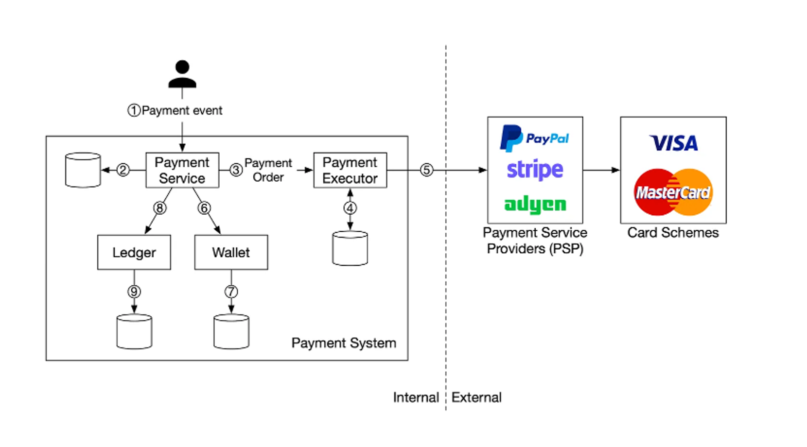

그림에 있는 Payment Event, Payment Service, Payment Order, Payment Executor, Ledger, Wallet은 모두 개발해야 할 요소

> 그러나, 앞으로 개발할 결제 시스템은 이 그림에서 보여진 결제 처리 과정과 약간 다르다. 
>
> 이 그림은 결제 이벤트 발생 시, Payment Executor가 사용자의 카드 정보 등 결제 정보를 데이터베이스에서 조회하여 PSP에 요청하고 결제가 처리되는 구조를 보여준다. 

### Payment Event:

결제를 요구하는 이벤트를 말한다. 즉, 결제가 필요할 때마다 Payment Event가 생성된다.

### Payment Order:

결제되는 항목을 의미한다. Payment Event 와는 1:N 관계이다.

### Payment Service

결제 시작부터 완료까지 총괄하는 시스템을 말한다.

- 가장 먼저 Risk Check (= AML/CFT) 와 같은 기능을 수행한다. 이 기능은 거래갸 불법적인 자금을 조달하기 위한건지 검사하는 역할을 수행한다.
- 결제를 처리하고, 결제 상태를 변경하며, 결제를 완료하는 등의 역할을 수행한다.
- 디비에 결제정보를 저장. 

### Payment Executor

PSP 에게 결제를 요청하는 서비스를 의미한다. 이 과정이 성공하면 실제로 돈이 이동하게 된다.

> PSP는 "Payment Service Provider"의 약자로, 결제 시스템에서 결제 처리를 위한 서비스를 제공하는 회사나 기관

### PSP (Payment Service Provider)

결제 처리에서 중개자의 역할을 수행한다. 결제 요청을 받을 경우, Card Schemes 에게 전달해 구매자의 자금을 인출하고, 그것을 회사 계좌로 이체하는 역할을 중개한다.

### Card Schemes

실제 자금 이체는 은행과 Card Schemes가 수행한다.

 PSP는 결제 정보를 받아 Card Schemes에게 전달하고, Card Schemes는 결제를 승인할지, 거절할지를 결정한다

. 승인이 되면 자금이 이동하게 된다.

### Ledger

장부에 **결제 내역을 기록하는 서비스**를 의미한다. 이는 은행 계좌에 거래 내역이 기록되는 것과 유사하다.

결제 내역을 기록하면, 금액 관련 문제 발생 시 추적이 용이하므로 이러한 서비스가 필요하다.

### Wallet

판매자에게 지불해야 할 금액을 정산하는 역할을 한다.

이전에 말했듯이 e-commerce 서비스에서는 구매자뿐만 아니라 판매자도 있다. 구매자가 구입한 물건에 대한 금액은 먼저 e-commerce 회사가 받고, 그 후에 정산하여 판매자에게 지불하는 시스템이다.

물론 Ledger 를 통해 Wallet 을 대체할 수 있지만, 거래가 일어날 때마다 정산 계산을 해두는 것이 더 확장성 있는 솔루션이므로 Wallet 서비스가 필요하다.


## Toss Payments 소개

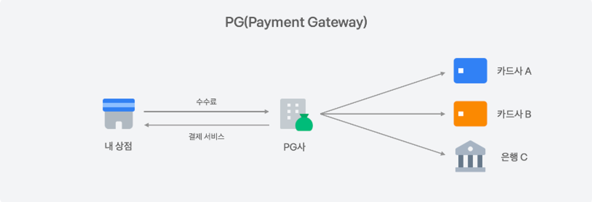

우리의 결제 시스템은 다음의 이유로, 결제 대행사(PG사)의 도움을 받아 결제를 처리해야 한다.

- 아마존과 비교하여 PCI DSS (Payment Card Industry Data Security Standard) 같은 엄격한 보안을 달성하는 것이 어렵다
- PG사가 없으면, 온라인 사업자는 카드사와 직접 계약을 맺어야 하며, 이 과정은 불편함을 주는 요소이다. 그래서 PG사를 이용하는 것이 좋다.

Toss Payments는 아래와 같은 결제 위젯을 제공한다. 이 결제 위젯을 통해 사용자는 카드 정보 등의 결제 정보를 입력할 수 있다.

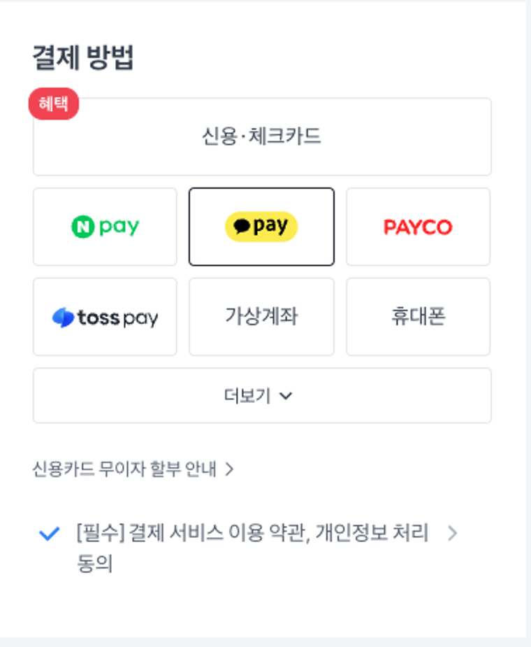<


## Toss Payments 를 이용한 결제 시스템 설계

결제 시스템과 결제 처리 프로세스는 다음과 같다:

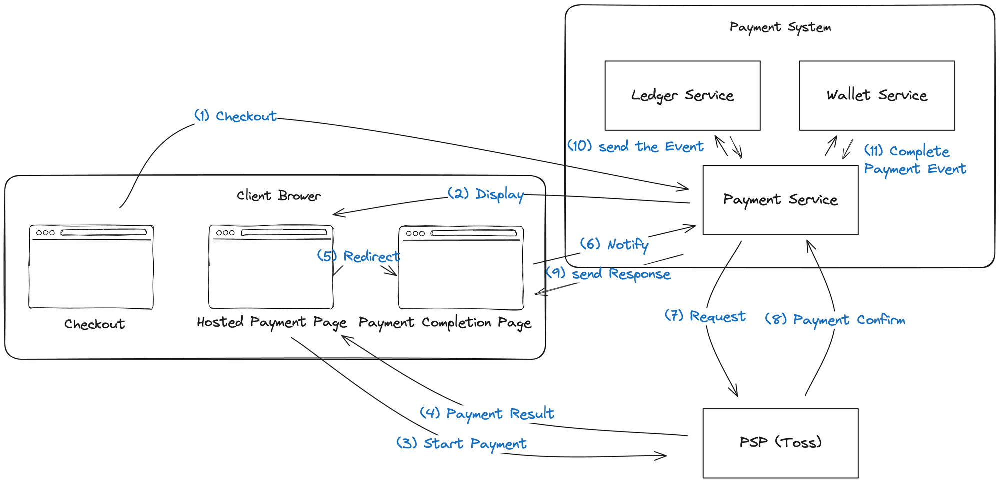

**(1) Checkout:**

- 장바구니에 물건을 담은 후, '구매하기' 버튼을 클릭하는 과정

**(2) Display:**

- Payment Service에서 Payment Event를 생성한 후 결제 페이지를 표시하는 과정
- 중요한 것은 결제를 식별할 수 있는 Unique Id를 생성하고, 결제 금액을 계산하여 함께 전달하는 것이다. 이를 바탕으로 사용자는 결제 위젯을 통해 결제를 수행한다.

**(3) Start Payment:**

- 결제 페이지의 결제 위젯에서 "결제하기" 버튼을 클릭하면 PSP 결제 창이 표시된다. 여기에서 "카드 정보" 와 같은 결제 정보를 입력하여 결제를 진행할 수 있다. 입력된 결제 정보는 암호화된 후 PSP로 전달되며 결제가 시작된다.

**(4) Payment Authentication Result:**

- PSP에서 결제 인증이 완료된 후, 성공 또는 실패에 대한 응답을 알려주는 과정

**(5) Redirect:**

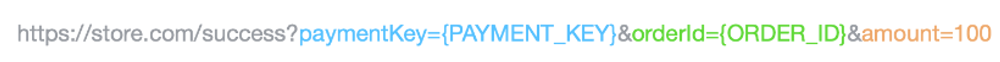

- 전달받은 Payment Result 에 따라 성공한 경우 성공한 페이지로, 실패한 경우 실패 페이지로 리다이렉션되는 과정이다. 리다이렉션될 때 파라미터로 paymentKey, orderId, amount 를 전달받는다.

**(6) Notify:**

- 구매자가 결제에 성공했다는 사실을 결제 서버에 알리는 과정이다. 이제 서버 측에서 결제 승인을 하면, 결제 거래가 종료되며 돈이 이동하게 된다.

**(7) Request:**

- 결제 서버가 결제 승인을 위해 PSP에 요청하는 과정이다.
- 결제 승인을 요청할 때는 리다이렉션으로 받은 파라미터인 paymentKey, orderId, amount를 사용하여 PSP에서 지원하는 결제 승인 API를 호출하면 된다. 이 과정이 완료되어야 구매자의 계좌에서 돈이 차감된다.

**(8) Payment Confirm Result:**

- PSP에서 결제 승인 결과를 전달하는 과정이다.

**(9) Send Response:**

- 사용자에게 결제 승인 결과를 전달하는 과정이다.

**(10) Send Event:**

- 결제 승인이 완료된 이후에 결제 승인 이벤트를 발생시키는 과정

**(11) Complete Payment Event:**

- 모든 결제 관련 후속 작업이 처리되면 결제가 완료된다.


## 결제서비스의 핵심 객체 Payment Event 와 Payment Order

Payment Event는 결제가 필요할 때 만들어지며, 장바구니에서 결제 페이지로 이동하는 Checkout 과정에서 생성된다.

Payment Event 의 중요한 데이터들은 다음과 같다:

| Name            | Type         | Description                                                  |
| --------------- | ------------ | ------------------------------------------------------------ |
| id              | BIG INT (PK) | Payment Event의 Id 값을 의미한다.                            |
| order_id        | STRING (UK)  | PSP 에서 결제 주문을 유일하게 식별하기 위해서 사용된다.      |
| payment_key     | STRING       | PSP 에서 결제 승인 처리 후에, 해당 결제를 식별하기 위해 생성된 아이디 값이다. <br /> 이 값 또는 order_id를 사용하여 결제를 조회하고 취소할 수 있다. |
| is_payment_done | BOOLEAN      | 결제가 성공적으로 완료되었는지 여부를 나타낸다.              |

Payment Order는 실제 결제 대상을 의미하며, 이는 구매자가 구매하는 물품을 지칭한다.

| Name                 | Type         | Description                                                  |
| -------------------- | ------------ | ------------------------------------------------------------ |
| id                   | BIG INT (pk) | Payment Order의 id 값을 의미한다.                            |
| payment_event_id     | BIG INT (FK) | Payment Event와 관계를 의미한다. <br />페이먼트 이벤트 1 : N 페이먼트 오더 |
| payment_order_status | ENUM         | 결제 승인 상태를 나타낸다. (e.g NOT_STARTED, EXECUTING, FAILURE, SUCCESS, UNKNOWN) |
| amount               | BIGDECIMAL   | 결제 금액을 나타낸다.                                        |
| ledger_updated       | BOOLEAN      | 결제 승인 이후에 장부에 기록했는지 여부를 나타낸다.          |
| wallet_updated       | BOOLEAN      | 결제 승인 이후에 판매자 지갑에 정산 처리를 했는지 여부를 나타낸다. |
| buyer_id             | BIG INT (FK) | 구매자의 id 값을 의미한다.                                   |
| seller_id            | BIG INT (FK) | 판매자의 id 값을 의미한다.                                   |


## Double-Entry Ledger System !!!  - 이중 기록 원칙

Double-Entry Ledger System은 회계 분야에서 사용되는 기본적인 원칙 중 하나입니다. 이 시스템은 모든 회계 거래에 대해 최소한 두 개의 계정을 기록함으로써 회계의 정확성과 신뢰성을 보장합니다.

Ledger 서비스는 결제 거래 내역을 추적하기 위해 모든 거래 내역을 장부에 기록한다. 이 때, 돈을 얻은 쪽과 잃은 쪽 모두를 기록하는 Double-Entry 기법을 사용한다. 

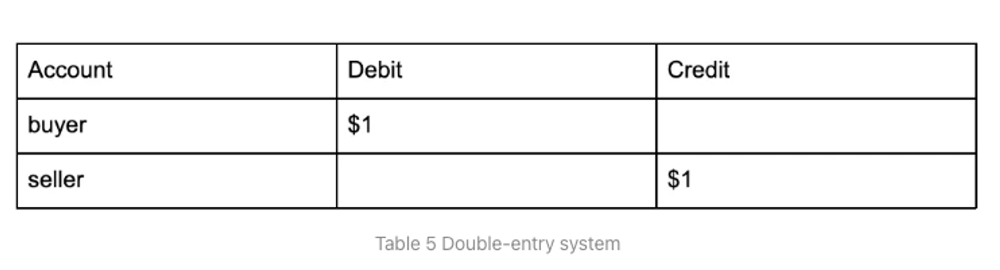

* 이렇게 하는 이유는 재무적인 오류를 쉽게 발견할 수 있기 때문이다. (장부에 기록된 내역들을 합치면 0이 되야함.)
* 그리고 장부는 원칙적으로 변경 불가능해야 한다. 변경 가능한 순간에는 변경 내역 추적이 어려워지기 때문이다.


## Message Delivery Guarantees - 메시지 전달 보장 

비동기식 통신에 메시지 큐를 이용하기로 결정했다면, 메시지 전달 보장 (Message Delivery Guarantees) 수준에 대해 고려해야한다. 주로 다음과 같은 세 가지 수준이 있다.

- At most once (최대 한 번)
- At least once (최소 한 번)
- Exactly once (정확히 한 번)

결제 시스템에서는 결제 승인 메시지를 'At least once (최소 한 번)' 전달하는 것이 보장되어야 한다. 만약 메시지가 전달되지 않고 유실된다면 결제 데이터의 일관성이 훼손될 수 있기 때문이다. 'At least once (최소 한 번)' 원칙에 따라 메시지가 여러 번 전송되더라도 큰 문제는 아니다. 메시지가 여러 번 처리되지 않게 멱등성을 활용하여 처리하면 되니까.

> 추가로, "정확히 한 번"이 "최소 한 번"을 충족하고 있지만, "최소 한 번"이 "정확히 한 번"을 충족하는 것은 아닙니다. "최소 한 번"은 메시지 처리를 보장하지만 중복 메시지를 허용할 수 있습니다. 하지만 "정확히 한 번"은 중복 메시지를 허용하지 않으며, 메시지가 정확히 한 번 처리됨을 보장합니다.


## Idempotency (멱등성) - 결제 API의 멱등성 보장

멱등성 처리는 데이터 상태를 변경할 수 있는 요청이 여러 번 들어와도 최대 한 번만 처리하도록 설계하는 방법을 의미한다. 

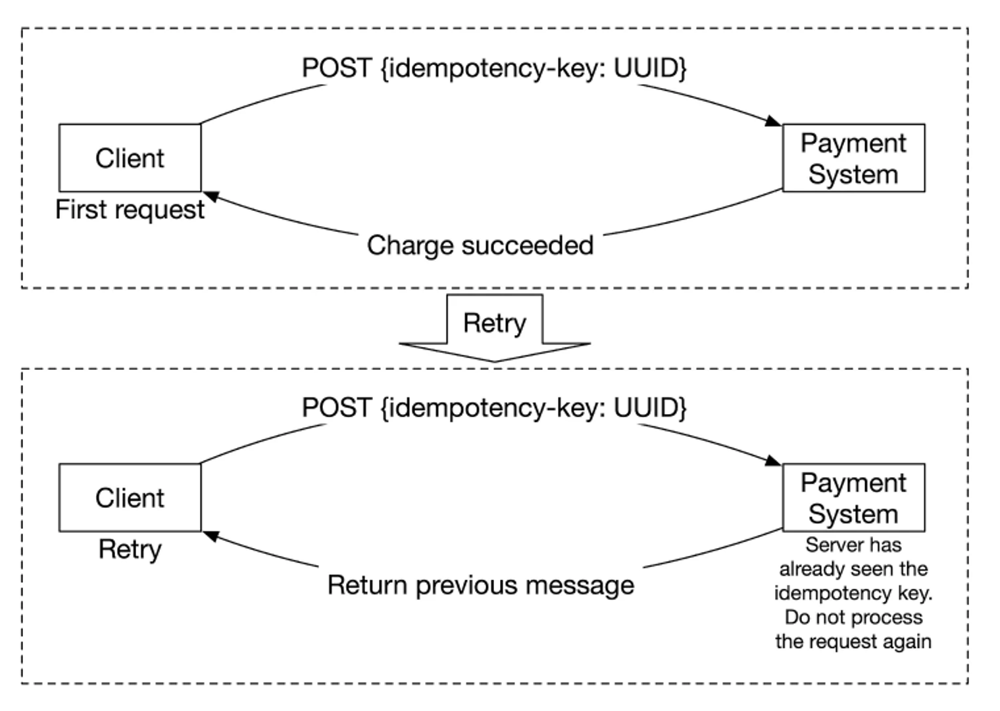

예를 들어, 결제 승인을 위해 PSP 에 요청을 보낼 때, 타임아웃으로 인해 재시도가 필요할 수 있다. 만약 재시도가 발생하고 이전 요청이 결제 승인을 받았지만 네트워크 혼잡으로 인해 응답이 오지 않았다면, 재시도 요청으로 인해 두 번 결제가 발생할 수 있다. 이러한 상황을 방지하기 위해, 요청이 오직 한 번만 처리되도록 멱등성을 활용해야한다.


API 처리에서 멱등성을 이용하는 방법은 API 제공업체마다 다르지만,

 일반적으로` Request Header에 <idempotency-key: key_value> 를 추가하여 보내면 된다`. 

이때 중요한 점은 멱등성 키의 값으로 각 요청을 식별할 수 있는 고유한 값을 주어야 한다는 것이다. 이 값으로 중복 처리를 방지한다.


##  Consistency - 일관성, 동시성  보장 

### 1.결제 승인 아벤트 메시지 전달 보장

결제 승인 후에는 결제 승인 결과를 데이터베이스에 저장하며, 메시지 큐를 통해 결제 승인 이벤트를 전달해야 한다. 즉, 데이터베이스 저장과 메시지 전달은 둘 중 하나만 성공하는 것이 아니라, 둘 다 성공하거나 둘 다 실패해야 한다.

이를 위한 가장 간단한 접근 방법은 2PC (Two-Phase Commit)를 이용한 Atomic 연산을 고려하는 것이지만, 카프카와 같은 메시지 큐는 이를 지원하지 않는다. 물론 RabbitMQ 와 같은 메시지 큐 서비스는 2PC 를 지원하긴 하나, 이 이유 하나 때문에 메시지 큐를 선택하는 건 합리적이지 않고, 2PC 방법은 상태 유지가 필요하고, 네트워크에 큰 영향을 받는다는 단점이 있다.

다음으로 고려해볼 방법은 @Transactional 을 이용해 트랜잭션 영역 내에서 결제 승인 정보를 데이터베이스에 저장하고 메시지 큐로 메시지를 전송하는 것이다. 이 방법은 메시지 큐로의 메시지 전송이 실패하면 트랜잭션도 롤백할 수 있다는 장점이 있다. 그러나 이 방법에는 **"메시지는 전송되었지만 트랜잭션이 롤백되는"**는 문제가 발생할 수 있으므로 적합하지 않다.


이 문제를 해결하기 위한 방법 중 하나는 **Transactional Outbox Pattern** 을 사용하는 것이다

. 이 패턴은 결제 승인 정보를 데이터베이스에 저장할 때, 동일한 트랜잭션에서 메시지 큐에 전달할 이벤트들도 함께 데이터베이스에  저장하는 방법이다. 이렇게 저장된 이후에 데이터베이스에 저장된 이벤트 메시지들을 가져와 메시지 큐로 전달하는 방식을 사용하면, 이벤트 전달과 데이터베이스 반영 모두 성공할 수 있다.

### 2. 이벤트 메시지 처리 & 전달 보장

이벤트 메시지 처리와 전달은 Wallet Service 와 Ledger Service 에서 일어난다. Wallet Service 와 Ledger Service 는 결제 승인 이벤트 메시지를 받아 처리하며, 처리가 완료되면 완료 이벤트 메시지를 발행하므로.

여기서 중요한 점은 카프카와 같은 메시지 큐 서비스에서  **"메시지 발행"** **이후에 "메시지를 처리했다는 커밋"** 작업이 이루어져야 한다는 것이다. 만약 메시지 커밋을 먼저 하고 메시지 발행에 실패하면 Payment Service 는 이벤트를 수신하지 못하니 결제는 완료 상태로 되지 못한다. 즉, 일관성이 깨지는 문제가 발생할 수 있다.

카프카에서는 내부적으로 **트랜잭션** 기능을 이용하여 "메시지 발행"과 "메시지 커밋"을 원자적으로 처리할 수 있다. 이 기능을 사용하면 메시지 처리를 하면서도 메시지의 전달을 보장할 수 있다.

### 3. Optimistic Locking 이용

Wallet Service 가 단일 인스턴스가 아닌 다수의 인스턴스로 운영된다면 판매자가 받아야 할 정산 금액이 동시에 업데이트되는 경우가 생길 수 있다. 즉 동시에 진행되는 트랜잭션으로 인해 갱신 내용이 덮어씌워지는 동시성 이슈인 [Lost Update](https://www.geeksforgeeks.org/concurrency-problems-in-dbms-transactions/)가 발생할 가능성이 있다.

동시성을 제어하는 다양한 방법이 있지만, **충돌이 자주 발생하지 않을 것**이므로, Lock을 이용하는 방식보다는 Optimistic Locking을 이용하는 방식이 적합해보인다. -> 이건 좀더 고민해봐야 할듯 

### 4. Database Trigger 이용

Ledger Service에서 장부에 Double Entry 방식으로 기록할 때, 데이터베이스 트리거를 사용해 정확한 데이터들을 입력했는지 검증할 수 있다. 이를 통해 일관성을 깨는 데이터 입력을 방지할 수 있고, 또 트리거를 사용해 장부의 데이터를 변경 불가능하게 만드는 것도 가능하다.

Ledger Service 의 장부 기입과 Wallet Service 의 정산 처리가 모두 완료되면 이벤트를 발행하며, Payment Service 는 이 이벤트를 수신하여 결제를 완료한다. 그러나 동시에 이 두 이벤트를 처리하는 경우, Payment Service 는 최신 상태의 결제 데이터를 읽지 못하고 결제를 완료 상태로 업데이트하지 못하는 문제가 발생할 수 있다. 이런 동시성 문제 또한 트리거를 이용하여 해결할 수 있습니다.


## Reliability 와 Fault tolerance 를 주는 법 - 신뢰성, 장애허용성 - retry, dlq

### 1. Handling Failed Payment Using Retry

구매자가 결제 정보를 입력하고 인증한 후, Payment Service 에서 PSP로 결제 승인에 성공해야만 거래가 완료될 수 있

다. 그러나 서버 측에서 결제 승인 과정 중에 Payment Service 가 **중단**된다면, 결제는 완료되지 않은 상태로 남게 될 것이다.

`그러므로 이런 문제에 대비하는 것이 중요하며, 우리는 '**재시도**' 기반으로 이 문제를 해결할 것이다.`


결제상태 : NOT_STARTED, EXECUTING, SUCCESS, FAILURE, UNKNOWN

EXECUTING 상태가 되면 이제 결제 승인은 성공적으로 완료되거나 실패할 수 있다. 만약 일정 시간이 지나도 결제 상태가 성공 또는 실패로 명확하게 변경되지 않고, EXECUTING 상태로 남아 있거나 처리 중 알 수 없는 문제가 발생하여 UNKNOWN 상태로 변경된 경우, 주기적으로 재시도하여 문제를 해결하는 방법

* 기본적으로 재시도를 통해 문제를 해결하기 때문에, 이전에 설명한 멱등성(Idempotency) 처리를 할 수 있도록 만드는 것이 중요

### 2. Retry Queue 와 Dead Letter Queue

Wallet Service 와 Ledger 서비스는 결제 승인 이벤트 메시지를 수신해서 처리하는 방식으로 설계되었다.

중요한 건, 메시지 처리가 실패할 때의 대응 전략을 설계해야 한다.

* 실패한 메시지를 무시하도록 전략을 수립하면 메시지 처리에 손실이 발생하여 일관성이 훼손
* 실패한 메시지를 성공할 때까지 재시도하는 전략을 수립하면 메시지 처리가 계속 지연되어 블로킹되는 문제가 발생

 메시지 처리에 실패하면 해당 메시지를 Retry Queue 에 기록하고, 메시지를 다시 가져와서 재시도한다. 만약 재시도가 threshold(임계값) 값만큼 실패하면, 이를 Dead Letter Queue 에 기록하고 이후에 수동으로 대응하는 전략을 사용해서 문제를 해결할 수 있다.

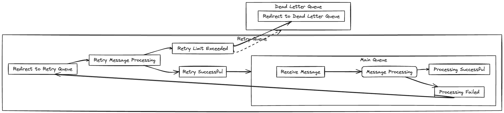

### 3. Reconciliation 프로세스 추가

PSP 업체에서는 지정된 날짜에 모든 거래 내역이 포함된 정산 파일(Settlement)을 받을 수 있다. 매일 자정마다 이 파일을 이용하여 누락된 결제를 추가하고, 잘못 처리한 결제된 내역을 정정하면, 결제는 모두 정확하게 처리될 수 있다.

즉, Reconciliation(조정 및 화해) 프로세스를 추가하여 그 날의 모든 결제 내역을 검토함으로써 누락된 결제를 추가하고, 잘못 처리된 결제가 있는지 조사하고 이를 정정해 일관성을 유지할 수 있다.

Reconciliation 프로세스를 최종 방어 역할로 사용하면 보다 견고한 결제 애플리케이션을 만들 수 있다.


### (Optional) Message Order 보장 - 메시지 순서 보장

만약 결제 완료 메시지를 수신하기 전에 결제 취소 메시지가 먼저 도착하고 처리를 요구한다면, 이는 정상적인 절차가 아니다. 따라서 결제의 경우, 취소 메시지가 완료 메시지보다 항상 늦게 처리되도록 보장해야한다.


메시지 큐로 카프카를 사용하면, 카프카 내의 토픽 파티션을 통해 메시지 처리 순서를 보장할 수 있다. 같은 파티션 내에서는 메시지가 순서대로 저장되어 있고, 이는 컨슈머에 의해 순서대로 처리되기 때문이다. 


따라서, 결제의 성공/취소 메시지는 동일한 파티션으로 전송되어야 한다. 카프카에서는 키를 사용하여 지정된 파티션으로 메시지를 보낼 수 있다. 예를 들면, 구매자의 Id 값을 사용하여 파티션을 지정하면 메시지의 순서가 보장될 것이다.


**그러나 이 방법**은 Single Producer 일 때만 가능하다. 만약 Multiple Producer를 이용하게 된다면 경쟁적으로 메시지를 보내게 될테니 이 방법은 적합하지 않다. 이때는 Global Message Sequence 를 제공하거나, 여러 Producer 가 각자 하나씩 토픽 파티션을 맡도록 파티셔닝 해야한다.


그리고 만약 메시지 처리에 순서를 보장하는 것이 아닌 인과성 정도만 필요하다면, 보다 늦게 처리해야 하는 메시지를 큐 끝에 다시 넣는 Requeue 를 이용해볼 수도 있다.


# TossPayments 결제 연동

## Goal

Toss Payments에서 제공하는 결제 위젯과 결제 승인 API를 활용하여 Payment Service에 결제 연동을 시도해볼 것이다.

Toss Payments 에서 만든 다음 [결제 프로세스 시뮬레이션 과정](https://developers.tosspayments.com/sandbox)을 구현해볼 것이다.

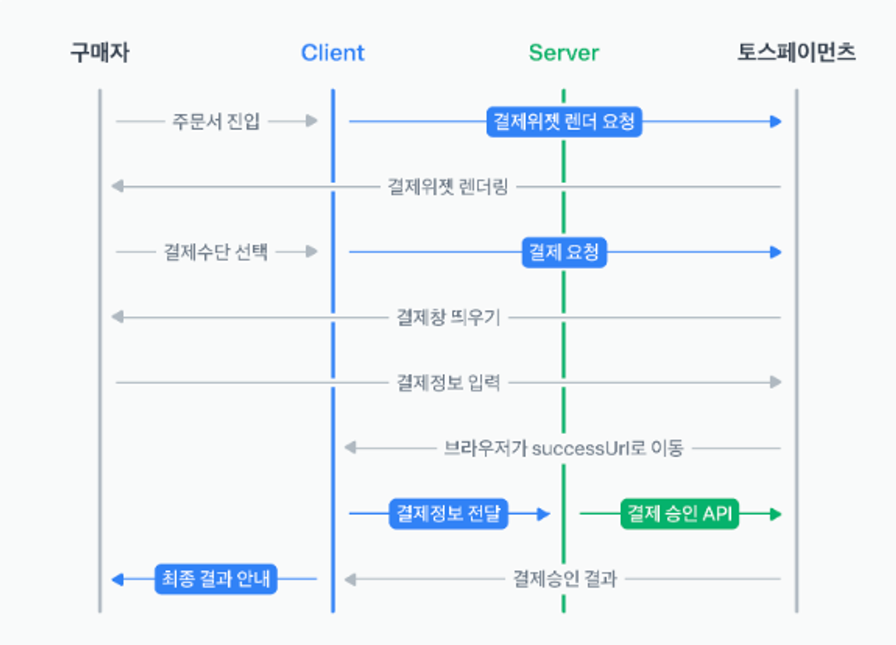

## Step 1: API Key 가져오기

1. **Toss Payments 개발자 가이드 접속하기 - 아래 링크 참고**

- https://docs.tosspayments.com/reference/using-api/api-keys

1. **API Key 에 대한 간략한 소개:**

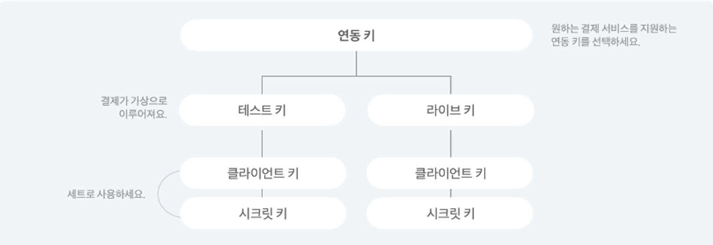

- Toss Payments 를 이용한 결제 키는 “테스트 키”와 “라이브 키”  로 나뉜다.
  - 테스트 키는 테스트 환경을 위한 키이고, 라이브 키는 실제 결제 서비스에서 사용될 키이다.
  - 테스트 키는 결제가 되는 것처럼 보이나 실제로는 결제가 되지 않으니 편하게 이용하실 수 있어요.
- 키는 “클라이언트 키” 와 “시크릿 키” 로 나뉜다.
  - “클라이언트 키”:
    - 클라이언트 사이드에서 결제 관련 요청을 할 때, 해당 요청이 실제로 우리의 애플리케이션에서 발생했음을 PG사에게 인증하기 위해 쓰인다.
    - 결제 위젯과 연동할 때 쓰인다.
    - 보안 수준이 낮은 키로 간주되며, 이를 통해 결제를 최종적으로 승인하지는 않는다.
  - “시크릿 키”:
    - 시크릿 키는 서버 사이드에서 사용되며, 외부에 노출되어서는 안 되는 매우 민감한 정보이다.
    - 이 키의 목적은 서버에서 결제 관련 요청을 할 때, 요청이 우리의 결제 서버로부터 안전하게 발생했음을 인증하기 위함이다.
    - 주로 결제 승인, 취소, 환불 등의 서버-서버 간에 이루어지는 중요한 트랜잭션을 처리할 때 사용된다. 이 키를 통해 요청이 인증되면, PG사는 그 요청을 신뢰하고 해당 요청에 따른 작업을 수행한다.
    - Toss Payments API 를 이용할 때 쓰인다.

1. **Toss Payments 에 “[회원 가입](https://app.tosspayments.com/signup)” 후 “[개발자센터](https://developers.tosspayments.com/my/api-keys)” 로 접속하면 내 API Key 를 볼 수 있습니다.**

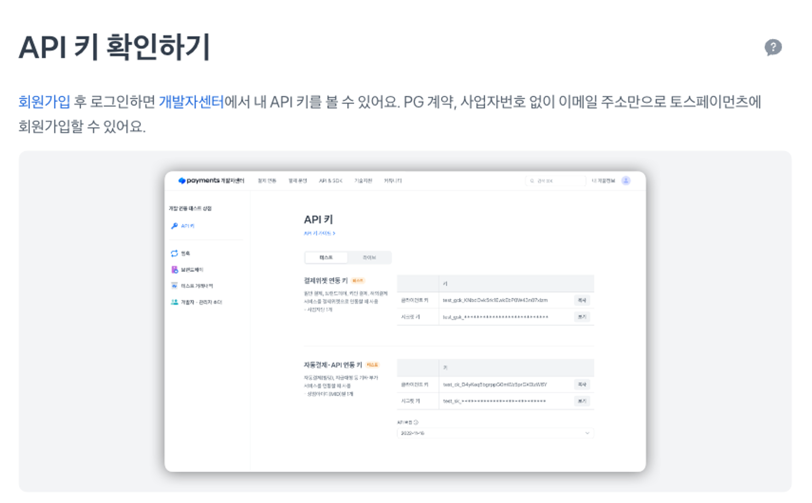

1. **API KEY 의 시크릿 키 부분을 가져와서 다음과 같이 어플리케이션에서 사용할 수 있도록 application.yaml 에 추가해준다.**

```yaml
PSP:
  toss:
    secretKey: test_sk_5OWRapdA8ddQz7lJ62WW8o1zEqZ
    url: <https://api.tosspayments.com>
```

## Step 2: 결제 위젯 연동하기

Toss 가 제공하는 [결제 위젯 샘플 GIthub](https://github.com/tosspayments/payment-widget-sample/tree/main) 를 참고해서 연동하면 된다.

1. **결제 연동을 담당하는 [Checkout.html](https://github.com/tosspayments/payment-widget-sample/blob/main/node-vanillajs/public/checkout.html) 페이지를 가지고 온다.**

```html
<!DOCTYPE html>
<html lang="ko">
  <head>
    <meta charset="utf-8" />
    <link rel="icon" href="<https://static.toss.im/icons/png/4x/icon-toss-logo.png>" />
    <link rel="stylesheet" type="text/css" href="/style.css" />
    <meta http-equiv="X-UA-Compatible" content="IE=edge" />
    <meta name="viewport" content="width=device-width, initial-scale=1.0" />
    <title>토스페이먼츠 샘플 프로젝트</title>
    <!-- 결제위젯 SDK 추가 -->
    <script src="<https://js.tosspayments.com/v1/payment-widget>"></script>
  </head>

  <body>
    <!-- 주문서 영역 -->
    <div class="wrapper">
      <div class="box_section" style="padding: 40px 30px 50px 30px; margin-top: 30px; margin-bottom: 50px">
        <!-- 결제 UI -->
        <div id="payment-method"></div>
        <!-- 이용약관 UI -->
        <div id="agreement"></div>
        <!-- 쿠폰 체크박스 -->
        <div style="padding-left: 25px">
          <div class="checkable typography--p">
            <label for="coupon-box" class="checkable__label typography--regular"
              ><input id="coupon-box" class="checkable__input" type="checkbox" aria-checked="true" /><span class="checkable__label-text">5,000원 쿠폰 적용</span></label
            >
          </div>
        </div>
        <!-- 결제하기 버튼 -->
        <div class="result wrapper">
          <button class="button" id="payment-button" style="margin-top: 30px">결제하기</button>
        </div>
      </div>
    </div>
    <script>
      const button = document.getElementById("payment-button");
      const coupon = document.getElementById("coupon-box");
      const generateRandomString = () => window.btoa(Math.random()).slice(0, 20);
      var amount = 50000;
      // ------  결제위젯 초기화 ------
      // TODO: clientKey는 개발자센터의 결제위젯 연동 키 > 클라이언트 키로 바꾸세요.
      // TODO: 구매자의 고유 아이디를 불러와서 customerKey로 설정하세요. 이메일・전화번호와 같이 유추가 가능한 값은 안전하지 않습니다.
      // @docs <https://docs.tosspayments.com/reference/widget-sdk#sdk-설치-및-초기화>
      const clientKey = "test_gck_docs_Ovk5rk1EwkEbP0W43n07xlzm";
      const customerKey = generateRandomString();
      const paymentWidget = PaymentWidget(clientKey, customerKey); // 회원 결제
      // const paymentWidget = PaymentWidget(clientKey, PaymentWidget.ANONYMOUS); // 비회원 결제

      // ------  결제 UI 렌더링 ------
      // @docs <https://docs.tosspayments.com/reference/widget-sdk#renderpaymentmethods선택자-결제-금액-옵션>
      paymentMethodWidget = paymentWidget.renderPaymentMethods(
        "#payment-method",
        { value: amount },
        // 렌더링하고 싶은 결제 UI의 variantKey
        // 결제 수단 및 스타일이 다른 멀티 UI를 직접 만들고 싶다면 계약이 필요해요.
        // @docs <https://docs.tosspayments.com/guides/payment-widget/admin#멀티-결제-ui>
        { variantKey: "DEFAULT" }
      );
      // ------  이용약관 UI 렌더링 ------
      // @docs <https://docs.tosspayments.com/reference/widget-sdk#renderagreement선택자-옵션>
      paymentWidget.renderAgreement("#agreement", { variantKey: "AGREEMENT" });

      // ------  결제 금액 업데이트 ------
      // @docs <https://docs.tosspayments.com/reference/widget-sdk#updateamount결제-금액>
      coupon.addEventListener("change", function () {
        if (coupon.checked) {
          paymentMethodWidget.updateAmount(amount - 5000);
        } else {
          paymentMethodWidget.updateAmount(amount);
        }
      });

      // ------ '결제하기' 버튼 누르면 결제창 띄우기 ------
      // @docs <https://docs.tosspayments.com/reference/widget-sdk#requestpayment결제-정보>
      button.addEventListener("click", function () {
        // 결제를 요청하기 전에 orderId, amount를 서버에 저장하세요.
        // 결제 과정에서 악의적으로 결제 금액이 바뀌는 것을 확인하는 용도입니다.
        paymentWidget.requestPayment({
          orderId: generateRandomString(),
          orderName: "토스 티셔츠 외 2건",
          successUrl: window.location.origin + "/success",
          failUrl: window.location.origin + "/fail",
          customerEmail: "customer123@gmail.com",
          customerName: "김토스",
          customerMobilePhone: "01012341234",
        });
      });
    </script>
  </body>
</html>
```

1. **결제 연동을 하는 [Checkout.html](https://github.com/tosspayments/payment-widget-sample/blob/main/node-vanillajs/public/checkout.html) 에서 다음 변수 부분을 수정하면 된다:**

- **amount** ← 이후 서버에서 결제 금액을 가지고 온 후 설정
- **clientkey** ← Toss Payment API KEY 에서 발급받은 clientKey 로 설정
- **orderId** ← 결제 주문을 식별할 Unique 한 orderId 를 만들고 이를 서버에서 가지고 온 후 설정
- **orderName** ← 결제 주문의 이름을 서버에서 가지고 온 후 설정
- **successUrl** ← 결제가 성공한 이후 리다이렉션 될 URL 을 설정
- **failUrl** ← 결제가 실패한 이후 리다이렉션 될 URL 을 설정

```html
<script>
	const button = document.getElementById("payment-button");
  const coupon = document.getElementById("coupon-box");
  const generateRandomString = () => window.btoa(Math.random()).slice(0, 20);
  
	var amount = 50000;
	// ------  결제위젯 초기화 ------
  // TODO: clientKey는 개발자센터의 결제위젯 연동 키 > 클라이언트 키로 바꾸세요.
  // TODO: 구매자의 고유 아이디를 불러와서 customerKey로 설정하세요. 이메일・전화번호와 같이 유추가 가능한 값은 안전하지 않습니다.
  // @docs <https://docs.tosspayments.com/reference/widget-sdk#sdk-설치-및-초기화>
  
	const clientKey = "test_gck_docs_Ovk5rk1EwkEbP0W43n07xlzm";
  const customerKey = generateRandomString();
  const paymentWidget = PaymentWidget(clientKey, customerKey); // 회원 결제
  
	// const paymentWidget = PaymentWidget(clientKey, PaymentWidget.ANONYMOUS); // 비회원 결제

  // ------  결제 UI 렌더링 ------
  // @docs <https://docs.tosspayments.com/reference/widget-sdk#renderpaymentmethods선택자-결제-금액-옵션>
  paymentMethodWidget = paymentWidget.renderPaymentMethods(
    "#payment-method",
    { value: amount },
    // 렌더링하고 싶은 결제 UI의 variantKey
    // 결제 수단 및 스타일이 다른 멀티 UI를 직접 만들고 싶다면 계약이 필요해요.
    // @docs <https://docs.tosspayments.com/guides/payment-widget/admin#멀티-결제-ui>
    { variantKey: "DEFAULT" }
  );
  
  // ------  이용약관 UI 렌더링 ------
  // @docs <https://docs.tosspayments.com/reference/widget-sdk#renderagreement선택자-옵션>
  paymentWidget.renderAgreement("#agreement", { variantKey: "AGREEMENT" });

	  // ------  결제 금액 업데이트 ------
    // @docs <https://docs.tosspayments.com/reference/widget-sdk#updateamount결제-금액>
    coupon.addEventListener("change", function () {
      if (coupon.checked) {
        paymentMethodWidget.updateAmount(amount - 5000);
      } else {
        paymentMethodWidget.updateAmount(amount);
      }
    });

    // ------ '결제하기' 버튼 누르면 결제창 띄우기 ------
    // @docs <https://docs.tosspayments.com/reference/widget-sdk#requestpayment결제-정보>
    button.addEventListener("click", function () {
      // 결제를 요청하기 전에 orderId, amount를 서버에 저장하세요.
      // 결제 과정에서 악의적으로 결제 금액이 바뀌는 것을 확인하는 용도입니다.
	    paymentWidget.requestPayment({
        orderId: generateRandomString(),
        orderName: "토스 티셔츠 외 2건",
        successUrl: window.location.origin + "/success",
        failUrl: window.location.origin + "/fail",
        customerEmail: "customer123@gmail.com",
        customerName: "김토스",
        customerMobilePhone: "01012341234",
      });
    });
</script>
```

1. **결제가 실패 했을 때 리다이렉션 되는 [fail.html](https://github.com/tosspayments/payment-widget-sample/blob/main/node-vanillajs/public/fail.html) 와 성공 했을 때 리다이렉션 되는 [success.html](https://github.com/tosspayments/payment-widget-sample/blob/main/node-vanillajs/public/success.html) 도 설정해주면 됩니다.**

## Step 3: 결제 승인 API 연동하기

Payment Service 에서 결제 승인을 위해서는 Toss Payments 에서 제공해주는 [결제 승인 API](https://docs.tosspayments.com/reference#결제-승인) 를 이용해야 한다. 자세한 건 실습을 참고하자.


## 진행 순서

1. checkout 페이지 진입(CheckoutController)

2. 페이지에서 결제하고 폰이나 등등 인증 통해서 결제되면 -> success시 success로 page redirect, fail시 fail로 redirect

3. success 페이지에서 우리가 지정한 /v1/toss/confirm으로 요청 전송 (TossPaymentController)

4. TossPaymentController 에서 tossPaymentExecutor를 통해 실제 토스 서버로 요청 전달

5. 응답 반환받아서 success 또는 fail 화면에 다시 노출 

   


# Payment Service 데이터 모델링(엔티티)

이전에 간략하게 다뤘던 데이터들은 크게 Payment Event 와 Payment Order 이 있다.

- **Payment Event**: 결제를 요구하며 식별하는 데이터
- **Payment Order**: 실제 결제 대상

이외에도 결제 승인에 문제가 발생했을 때 해결하기 위한 Audit Log 와 같은 데이터가 필요해보인다. 결제 주문의 상태를 추적할 수 있도록 하는 Payment Order History 라는 데이터도 만들자.

## 각 데이터들은 어떤 필드들이 필요한가?

### Payment Event

| name            | type                        | description                                                  |
| --------------- | --------------------------- | ------------------------------------------------------------ |
| id              | PK, BIG INT, AUTO INCREMENT | 결제 이벤트 고유 식별자                                      |
| buyer_id        | BIG INT                     | 구매자 식별자                                                |
| is_payment_done | BOOLEAN                     | 결제가 완료되었는지 여부                                     |
| payment_key     | VARCHAR, UNIQUE             | PSP 애서 생성한 결제 식별자                                  |
| order_id        | VARCHAR, UNIQUE             | 우리 시스템에서 생성한 고유한 결제를 구분해주는 주문 식별자  |
| type            | ENUM                        | 결제 유형. (e.g 일반 결제, 자동 결제 등)                     |
| order_name      | VARCHAR                     | 결제 주문 이름                                               |
| method          | ENUM                        | 결제 방법 (e.g 카드 결제, 간편 결제, 휴대폰 등)              |
| psp_raw_data    | JSON                        | PSP 로 부터 받은 원시 데이터(결제 승인 후에 토스로부터 받는 데이터) |
| created_at      | DATETIME                    | 생성된 시각                                                  |
| updated_at      | DATETIME                    | 업데이트 된 시각                                             |
| approved_at     | DATETIME                    | 결제 승인된 시각                                             |

### Payment Order

| name                 | type                        | description                                                  |
| -------------------- | --------------------------- | ------------------------------------------------------------ |
| id                   | PK, BIG INT, AUTO INCREMENT | 결제 주문 고유 식별자                                        |
| payment_event_id     | FK, BIG INT                 | Payment Event 를 참조하는 식별자 (결제이벤트와 결제 주문을 연결용 ) |
| seller_id            | BIG INT                     | 판매자 식별자                                                |
| product_id           | BIG INT                     | 제품 식별자                                                  |
| order_id             | VARCHAR, UNIQUE             | 우리 시스템에서 생성한 고유한 결제를 구분해주는 주문 식별자<br />(결제 시스템 내에서 Payment Order를 효율적으로 조회하기 위함 ) |
| amount               | DECIMAL                     | 결제 금액                                                    |
| payment_order_status | ENUM                        | 결제 주문 상태 (e.g NOT_STARTED, EXECUTING, SUCCESS 등)      |
| ledger_updated       | BOOLEAN                     | 장부 업데이트 여부                                           |
| wallet_updated       | BOOLEAN                     | 지갑 업데이트 여부                                           |
| failed_count         | TINYINT                     | 결제 실패 카운트                                             |
| threshold            | TINYINT                     | 결제 실패 허용 임계값                                        |
| created_at           | DATETIME                    | 생성된 시각                                                  |
| updated_at           | DATETIME                    | 업데이트 된 시각                                             |

### Payment Order History

모든 데이터를 추적해서 오류를 해결하기 위함 

| name             | type                        | description                             |
| ---------------- | --------------------------- | --------------------------------------- |
| id               | PK, BIG INT, AUTO INCREMENT | 결제 주문 변경 이력 고유 식별자         |
| payment_order_id | FK, BIG INT                 | Payment Order 를 참조하는 식별자        |
| previous_status  | ENUM                        | 변경 전 결제 상태                       |
| new_status       | ENUM                        | 변경 후 결제 상태                       |
| created_at       | DATETIME                    | 생성된 시각                             |
| changed_by       | VARCHAR                     | 변경을 수행한 사용자 또는 시스템 식별자 |
| reason           | VARCHAR                     | 상태 변경의 이유                        |


# 1. Checkout 기능 구현

## Checkout 기능이 필요한 이유는?

먼저, Checkout 기능은 사용자가 제품을 구매하기 위해 결제를 요구하는 기능을 말한다. 결제를 요구하는 이벤트가 있어야 결제 서비스가 결제를 할텐데 지금 우리 시스템에서는 이 기능이 없다. 그래서 가상의 Checkout 기능이 필요하다. 이 강의에서는 결제 서비스에 초점을 맞추기 위해, 제품을 보여주고 장바구니에 담는 기능은 만들지 않을 예정이다. 따라서, 결제 페이지가 보여질 때 이미 장바구니에 제품이 담겨 있다고 가정하고, Checkout 기능을 진행하겠습니다.

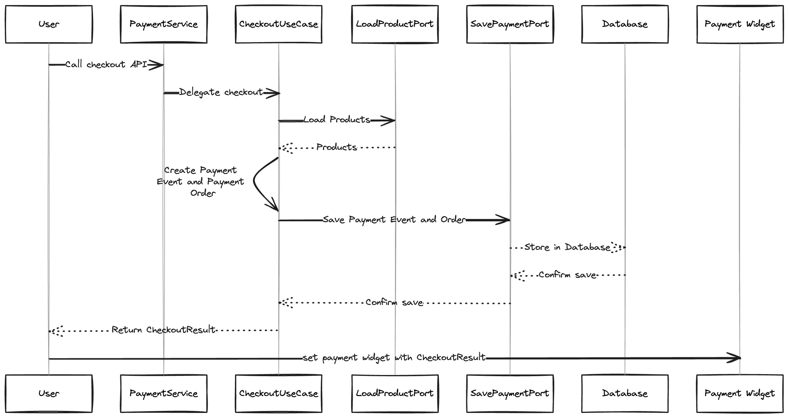

- **(1) User → PaymentService**: 결제 페이지가 호스트 될 때 Checkout API 를 호출한다.
- **(2) Payment Service → CheckoutUseCase**: PaymentService 는 Checkout 기능을 CheckoutUseCase 에게 위임한다.
- **(3) CheckoutUseCase → LoadProductPort**: 장바구니에 담긴 상품 아이디를 가지고 상품 정보를 불러온다.
- **(4) CheckoutUseCase Business Logic**: 가져온 상품 정보를 바탕으로, Payment Event 와 Payment Order 를 생성한다.
- **(5) CheckoutUseCase ↔ SavePaymentPort**: 생성한 Payment Event 와 Payment Order 를 데이터베이스에 저장한다.
- **(6) CheckoutUseCase → User**: CheckoutResult 결과를 사용자에게 전달한다.
- **(7) User → Payment Widget**: CheckoutResult 를 이용해서 결제 위젯에 결제 정보를 세팅한다. (e.g orderId, amount 등)

### Error Scenario: Checkout 기능을 연속으로 사용자가 호출하면 어떤 일이 발생하나요?

구매하기 버튼을 연속으로 두 번 눌러서 Checkout API 가 여러번 호출되는 일이 발생하면 어떤 일이 생길까? 호출된 API 수 만큼 Payment Event 와 Payment Order 가 만들어 지는 건 적절하지 않아 보인다. 그러므로 여러 번 호출되더라도 하나의 Payment Event 가 생성되도록 보장해야한다.

이를 가능하게 하는 것은 **결제 주문 아이디 (= orderId) 이다**. Checkout API를 호출할 때 사용되는 **요청 본문 데이터**를 바탕으로 **고유한 orderId**를 생성하고, 이를 이용해서 Payment Event를 생성한다고 가정해보자. 그렇게 되면, 여러 번 요청을 하더라도 단 한 번의 Payment Event만 생성된다. 이후의 요청들은 데이터베이스의 무결성 제약으로 인해 실패하기 때문에.


# 2. 결제 승인 기능 구현

## Goal

Payment Service 에서 기본적인 결제 승인 처리 과정을 구현해보자.

## 결제 승인 과정이란?

결제 승인 과정은 사용자가 결제 창에서 결제 정보를 입력하고 인증한 후에, 결제 서버 측에서 PSP 로 결제 승인을 보내는 과정을 말한다.

## 결제 승인 Sequence Diagram

다음 Sequence Diagram 과정대로 결제 승인 처리는 완료될 것이다.

- **(1) User → PaymentService:** 구매자는 PaymentService 로 결제 승인 요청을 전달한다.
- **(2) PaymentService → PaymentConfirmUseCase:** Payment Service 는 결제 승인 작업을 Payment ConfirmUseCase 에게 위임한다.
- **(3) PaymentConfirmUseCase → PaymentStateUpdatePort**: 결제 승인의 시작을 알리기 위해서 Payment 의 상태를 NOT_STARTED → EXECUTING 상태로 변경
- **(4) PaymentConfirmUseCase → PaymentValidatorPort**: 결제에 대한 유효성 검사. (e.g 금액 등)
- **(5) PaymentConfirmUseCase → PaymentExecutorPort**: PSP 에 결제 승인을 요청한다.
- **(6) PaymentConfirmUseCaes → PaymentStateUpdatePort**: PSP 결제 승인 결과에 따라서 결제 완료/실패  상태를 저장
- (7) **PaymentConfirmUseCase → User**: 결제 승인 결과를 사용자에게 전달한다.

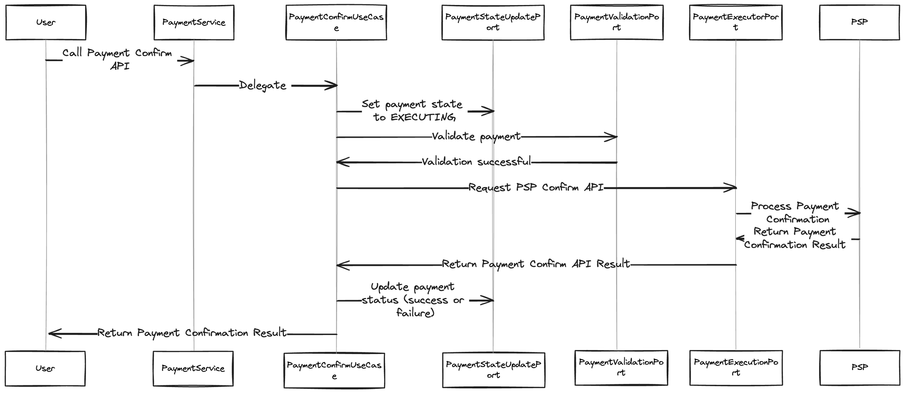


# 결제 승인 에러 핸들링 - Retry , timeout 

결제 승인과 관련된 에러를 처리할 때 중요한 건 **“재시도 가능 유무”** 이다.

**“REJECT_ACCOUNT_PAYMENT (잔액 부족)”** 와 같은 에러는 재시도 할 수 없는 명백한 결제 실패 유형 에러지만 **“PROVIDER_ERROR (일시적 오류 발생)”** 와 같은 일시적인 에러는 재시도를 통해서 해결할 수 있다.

즉, 재시도 가능한 유형인지 잘 분류해야 한다.

## 재시도를 잘하는 방법

이전에는 결제 승인 에러를 확인하고 재시도 여부를 결정하는 ‘언제 재시도를 할 수 있는가’ 에 대해서 설명했었다. 그러나 이것 말고도 ‘어떻게 재시도를 하는가’ 도 중요하다.

재시도를 적용할 때 고려해야 할 사항은 다음과 같다:

- 지수 백오프(Exponential Backoff)
- 재시도 제한 횟수(Retry Limited Count)
- 지터(Jitter)

**Exponential backoff** (지수 백오프):

- 재시도 사이에 일정 시간 지연을 설정하는 것이다. 서버가 과부하로 인해 응답을 전달하지 못하는 경우를 대비해서 일정시간 지연을 주는 것이 필요하다.
- 지연 시간은 재시도마다 지수적으로 증가한다. 예를 들면, 첫 번째 재시도에는 1초 동안 대기하고, 두 번째 재시도에는 2초 대기, 세 번째 재시도에는 4초 대기, 네 번째 재시도에는 8초 이렇게 대기하게된다.

**jitter:**

- 요청이 동시에 재시도 되지 않도록 Expotional backoff 외에 무작위 지연을 추가적으로 부여하는 것이다.
- jitter 이 없다면 요청들이 동시에 재시도 되면서 특정 시간의 주기에만 트래픽이 급증하는 문제가 생길 수 있다. 이 문제에 대해 좀 더 자세하게 설명하자면, 네트워크 요청이나 서버에 대한 쿼리가 실패했을 때, 클라이언트는 일반적으로 연속적인 실패를 방지하고 성공할 때까지 요청을 다시 시도하게 된다. 이때 재시도 간 일정한 간격을 두고 요청을 반복하게 되는데, 만약 많은 클라이언트가 동시에 같은 패턴으로 재시도를 한다면, 서버에 동시에 높은 부하가 발생하여 서버의 성능 저하나 다운타임을 초래할 수 있게 된다.

**Retry Limited Count: (재시도 제한 횟수)**

- 재시도를 수행하는 최대 횟수를 의미한다. 제한 횟수가 설정되어 있지 않으면 무한적으로 재시도하며 자원을 소모할 것이므로 횟수를 지정하는게 중요하다.

## 타임아웃 설정

타임아웃에는 크게 두 가지 유형이 있다.

- 연결 타임아웃(Connection Timeout): 서버와의 연결을 시도할 때까지의 시간을 말한다.
- 요청 타임아웃(Request Timeout): 요청을 보낸 후 서버로부터 응답을 받기까지의 시간을 말한다.

타임아웃을 설정하지 않으면 서버로부터 응답을 무한히 기다려야 하므로, 이 기간 동안 리소스가 점유되는 문제가 발생한다. 서버를 안전하게 보호하고 리소스를 효율적으로 관리하기 위해서는 타임아웃 설정이 필요하다.

타임아웃은 얼마로 설정하는 것이 좋을까?

- 타임아웃을 너무 높게 설정하면 그 시간 동안 리소스가 점유되는 문제가 있다.
- 반면, 타임아웃을 너무 낮게 설정하면 응답이 도착할 가능성이 있는데도 불구하고, 타임아웃으로 인해 응답을 받지 못하는 상황이 발생할 수 있다.

적절한 타임아웃 설정은 사용 환경과 통신하는 API 특성에 따라 달라지는 것이 좋다. 예를 들어, 자신의 서버와 같은 환경에서 네트워크 통신이 많은 다른 서버가 이웃으로 배포되어 있다면 네트워크 대역폭을 고려해 타임아웃을 좀 더 높게 설정해볼 수 있다. 또 통신하는 API 가 복잡한 연산을 요구하고 응답이 오래 걸리는 경우에도 타임아웃을 높게 설정하는 것이 바람직하다.

**참고자료** 

**Toss Payments 에러 시나리오 테스트하기**: https://docs.tosspayments.com/resources/glossary/http-header#에러-시나리오-테스트하기


# 결제 복구 서비스

## Bulk Header Pattern

Bulk Head Pattern 은 시스템의 신뢰성을 높이기 위해 사용되는 패턴이다. 이 패턴의 주 목적은 하나의 작업이 실패하더라도, 다른 작업에 영향을 주지 않게 함으로써 신뢰성을 보장하는 것이다.

이는 각 작업의  Workload 마다 사용되는 리소스를 분리함으로써 실현된다. 

예를 들어, 아래의 그림에서 Service A 의 작업에 문제가 생겨 Workload 1 의 Connection Pool 리소스가 소모되더라도, Workload 2 의 리소스들이 사용되는 것은 아니라서 Workload 2 의 리소스는 영향을 받지 않는다. 

그러므로 Workload 2 는 정상적으로 작동할 수 있다.

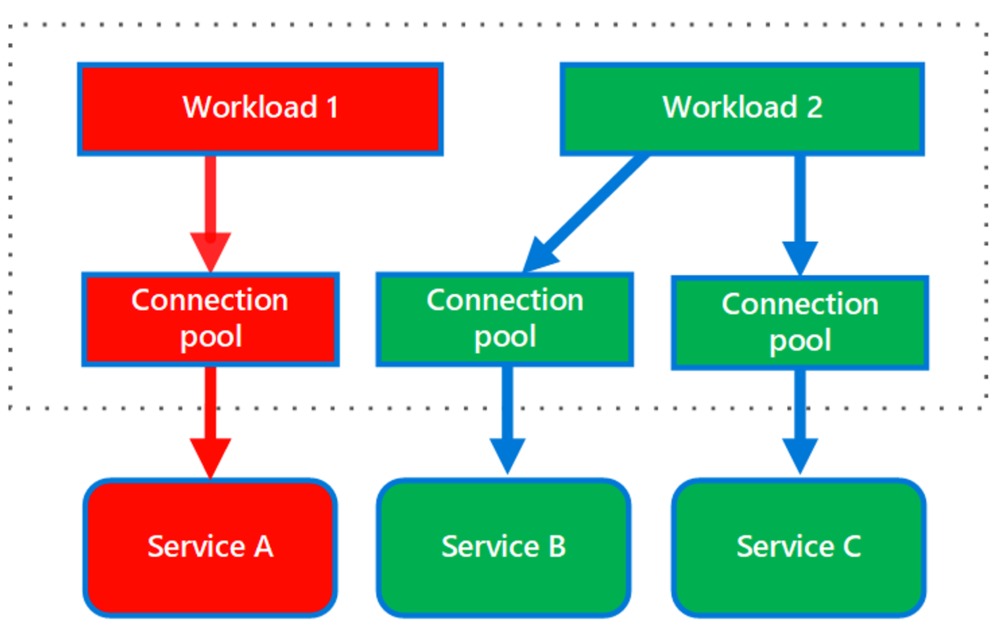

### Scalability 고려하기

결제 시스템을 운영할 땐 아마 단일 서버 인스턴스로 사용하지 않을 것이다. 확장성을 위해 여러 결제 서비스 인스턴스가 배포될텐데, 이 경우 각 서비스가 동일한 Pending 상태의 결제를 중복 처리 문제가 발생할 수 있다.

중복 처리는 확장성 부족이라는 문제를 야기할 수 있다. 시스템의 확장성은 매우 중요한 하므로, 이 문제를 어떻게 해결할 수 있을까?

근본적인 해결책은 파티셔닝(Partitioning) 이다. 즉, 각 결제 서비스가 복구해야 하는 결제를 나눠서 처리하는 것이다. 파티셔닝의 구현 방법은 배포되는 환경에 따라 달라질 수 있다. 예를 들어, 쿠버네티스 환경에서라면 StatefulSets 을 이용해서 각 서버마다 인스턴스 번호를 할당받고, 이 번호를 기반으로 결제를 조회해서 파티셔닝 처리를 하면 된다.

### 병렬 처리하기

Spring Webflux 와 같은 비동기 논블로킹 시스템에서는 API 요청과 같은 외부 통신을 병렬로 처리하는 것이 훨씬 성능에 유리하다. API 호출과 같은 I/O 작업이 대기 상태에 있을 때, 스레드가 블록되지 않고 다른 작업을 처리할 수 있으며, 동시에 많은 수의 연결을 효율적으로 관리할 수 있고 각 연결에 대해 별도의 스레드를 할당할 필요가 없기 때문이다.

물론 병렬 처리가 가능한 작업인지, 동시성 문제가 없는지, 통신 대상 서버에 과도한 트래픽이 집중되지는 않는지 등을 고려해야한다.


# Transactionoal Outbox Parttern

장기적으로 볼 때 결제 승인 성공 후에 이에 대한 후속 처리 서비스는 점점 늘어날 수 있기 때문에 이벤트 기반의 느슨한 결합 통신 방식이 더 적합해 보인다. Payment Service 는 단순히 결제 승인 이벤트를 발행하면 되고, 새롭게 추가되는 서비스들은 단순히 이벤트를 수신해서 처리하면 되므로. 이벤트 메시지를 발행하기 위한 서비스들은 많지만 여기서는 그 중 가장 대표적인 Apache Kafka 를 사용해보겠다. 

## 안전하게 메시지를 발행하는 방법

결제 승인 완료 이벤트를 발행하지 못하고 어플리케이션이 갑자기 종료되면 어떻게 될까? 메시지 유실 문제가 발생한다.

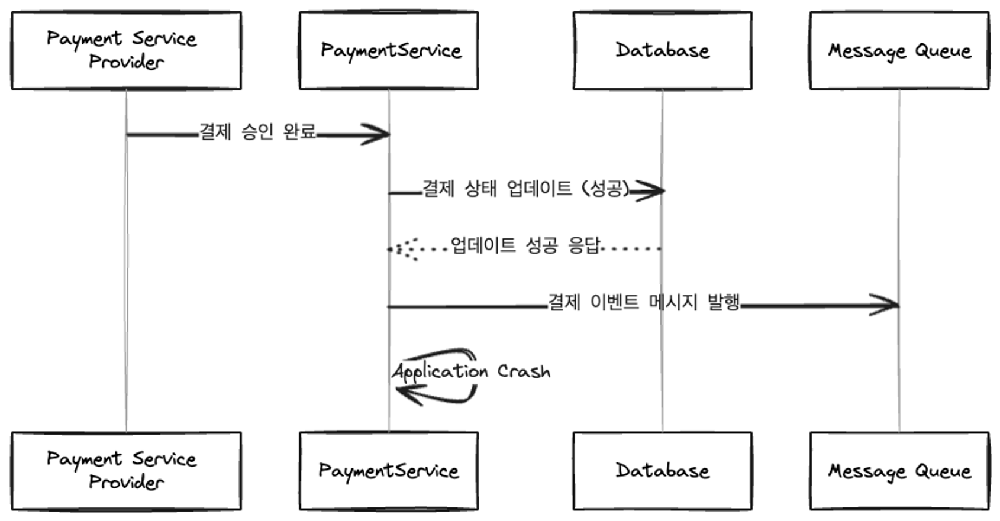

메시지가 유실되면 Wallet Service 와 Ledger Service 는 결제 후속 처리를 할 수 없으므로 결제 처리는 완료될 수 없다. 따라서 메시지를 반드시 성공적으로 전달해야한다. 

이를 위한 방법은 무엇일까? 

* 가장 직관적인 방법은 데이터베이스에 결제 상태를 업데이트 하는 트랜잭션에 결제 이벤트 메시지 발행도 포함시키는 것이다. 

* 이 방법은 이벤트 메시지 발행이 실패할 경우 결제 상태도 업데이트 되지 않는다. 

그러나 이 방법은 메시지 발행은 롤백 할 수 없다는 문제점이 있다. 

결제 상태도 업데이트 하고, 메시지 발행도 한 이후에 데이터베이스에 커밋을 보냈는데 실패하는 경우를 생각해보면 된다

. **데이터베이스에 반영한 결제 상태는 정상적으로 롤백 되겠지만 메시지 큐에 보낸 메시지는 회수할 수 없다.** 

Transactional Outbox Pattern 은 메시지 큐에 발행할 이벤트 메시지를 트랜잭션에  포함시켜 함께 저장하는 방식이다. 이렇게 저장한 이후에 Message Relay 는 주기적으로 메시지를 읽어서 메시지 큐에 전송한다. 이 방법은 데이터베이스 트랜잭션을 이용해서 결제 상태 반영과 이벤트를 일관되게 반영할 수 있는 방법이다. 

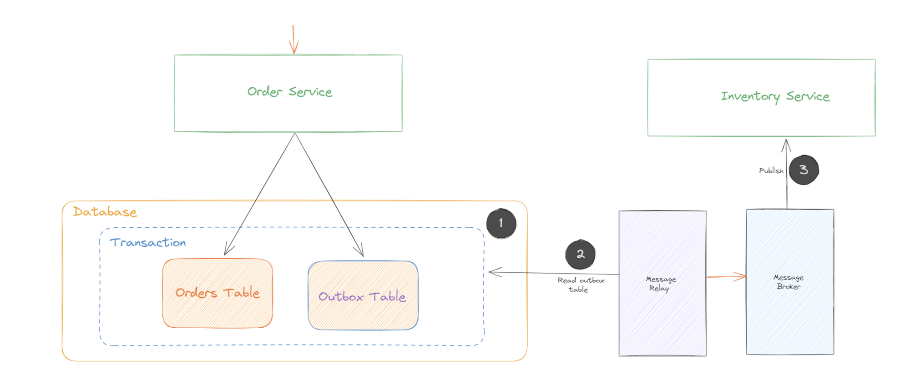

Transactional Outbox Pattern 을 적용하는 방법은 크게 두 가지가 있다:

- CDC (Change Data Capture) 를 이용하는 것.
- Outbox 테이블을 조회해서 메시지를 발행하는 것.

Outbox 테이블을 조회하는 방법은 데이터베이스에 부하를 주는 반면에 CDC 를 이용한 데이터베이스 로그 파일을 읽어서 메시지를 전달하는 방법이 더 효율적이다. 그러나 여기서는 Transactional Outbox Pattern 을 구현하기 위해서 Outbox 테이블을 직접 조회해서, 해당 내용으로 메시지를 발행하는 방법을 사용할 것이다.

## 메시지 발행 Sequence Diagram

크게 두 가지 흐름이 있다.

- (1) 주기적으로 Database 의 Outbox 테이블에서 전송되지 않은 이벤트 메시지들을 조회해서 메시지 큐에 보내는 흐름
- (2) 기존 결제 승인 Flow 에서 결제 상태가 성공으로 업데이트 될 때 메시지 큐에 메시지를 전달하는 흐름

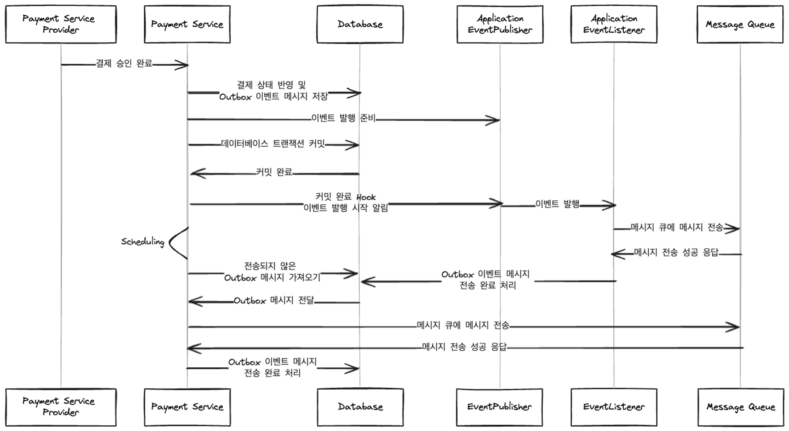

### Outbox 테이블 모델링 

| name            | type                               | description                 |
| --------------- | ---------------------------------- | --------------------------- |
| id              | PK, BIG INT, AUTO_INCREMENT        | Outbox 테이블을 식별하는 PK |
| idempotency_key | VARCHAR(255), UNIQUE               | 멱등성 키                   |
| status          | ENUM(’INIT’, ‘FAILURE’, ‘SUCCESS’) | 메시지 전송 상태            |
| type            | VARCHAR(40)                        | 이벤트 메시지 타입          |
| partition_key   | INT                                | 메시지 큐의 파티셔닝 키     |
| payload         | JSON                               | 이벤트 메시지 본문          |
| metadata        | JSON                               | 메타 데이터                 |


# 신뢰성있게 카프카를 사용하는 방법

## 카프카에 대한 기본적인 내용

앞으로 설명할 내용은 카프카에 대한 기본 지식을 가정하에 진행되므로, 카프카를 처음 접한다면 아래의 코스를 통해 미리 학습할 것을 권장합니다.

https://d2.naver.com/helloworld/7181840

### Short Course (Korean)

- [Kafka 조금 아는 척하기 시리즈 1](https://www.youtube.com/watch?v=0Ssx7jJJADI)
- [Kafka 조금 아는 척하기 시리즈 2 (Producer)](https://www.youtube.com/watch?v=geMtm17ofPY)
- [Kafka 조금 아는 척하기 시리즈 3 (Consumer)](https://www.youtube.com/watch?v=xqrIDHbGjOY)

### Short Course (English)

- [Confluent Kafka 101 Course](https://developer.confluent.io/courses/apache-kafka/events/)

## 카프카가 기본적으로 제공해주는 신뢰성

데이터베이스 트랜잭션은 ‘ACID’ 기능을 신뢰성 있게 제공한다. 마찬가지로 카프카 역시 기본적으로 신뢰성 있게 제공하는 기능들이 있다.

신뢰성은  **“시스템이 예상한대로 올바르게 작동하는 것”** 을 말한다. 카프카에게 원하는 신뢰성은 아마도 보낸 메시지가 **정확히 전달되고, 저장되며, 처리되는 것**을 말할 것이다. 즉, 메시지가 전달되지 않거나, 유실되거나, 갑자기 삭제되거나, 메시지 처리가 스킵되거나, 여러번 처리되지 않는 것들을 포함할 것이다.

카프카가 매력적인 이유는 기본적으로 제공하는 신뢰성이 있고, 개발자가 어떻게 설정하냐에 따라서 원하는 수준의 신뢰성을 달성할 수 있다.

다음은 카프카에서 기본적으로 제공해주는 신뢰성이다.

- 토픽 파티션내의 메시지들은 순서대로 저장되고, 컨슈머에 의해 순서대로 처리된다.
- 레플리카가 존재하는 한 메시지는 유실되지 않는다.

### 복제의 중요성

카프카는 저장된 메시지들을 즉시 복제해서, 메시지 유실을 방지한다. 이는 MySQL 와 같은 데이터베이스와는 다른 방식이다. MySQL 같은 데이터베이스는 fsync() 같은 시스템 콜을 이용해서 데이터를 직접 디스크에 저장한다. 즉 데이터베이스는 이 방법으로 데이터 유실을 방지한다.

그러나 카프카는 대량의 데이터 처리를 위해서 바로 디스크에 저장하지 않는다. Page Cache 라는 커널 메모리 공간에서만 데이터를 쓰고, 이후에 시간이 지나면 데이터는 디스크로 반영된다. 그러므로 디스크에 반영되기 전에 카프카 브로커가 다운된다면 메시지는 유실될 수 있다.

카프카에서는 이 문제를 복제를 통해 해결한다. 데이터를 다른 브로커의 Page Cache 에 복제 함으로써 브로커가 다운되더라도 데이터가 유실되지 않도록 한다.

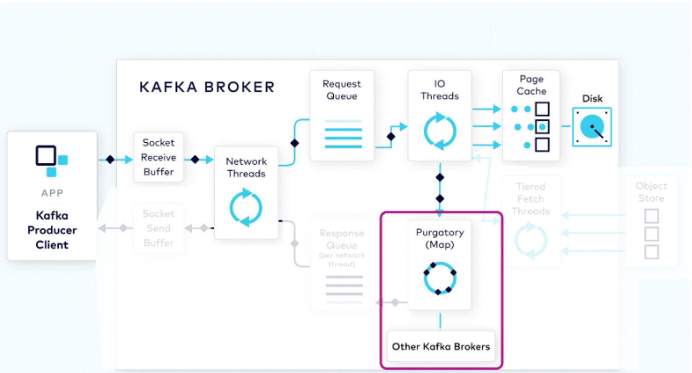

- 출처: [Confluent Kafka Architecture](https://developer.confluent.io/courses/architecture/broker/)

## 신뢰성 있게 브로커를 사용하는 방법

브로커의 주요 역할은 저장된 메시지들을 안전하게 보관해서 유실되지 않도록 하는 것이다. 이와 같은 신뢰성을 주기 위한 설정으로는 다음과 같다:

- 토픽 파티션의 복제 값을 정하는 것
- 최소 In-Sync 레플리카 수를 유지하는 것

### 토픽 파티션의 복제 수를 올바른 값으로 정하기

메시지들은 토픽 파티션 내에 저장된다. 만약에 토픽 파티션을 단일 복제로만 운영할 경우, 해당 브로커 장비가 손상되면 데이터는 사라질 위험이 있다. 그러므로 토픽 파티션의 복제 수를 늘려서 데이터의 가용성과 신뢰성을 높이는 것이 중요하다.

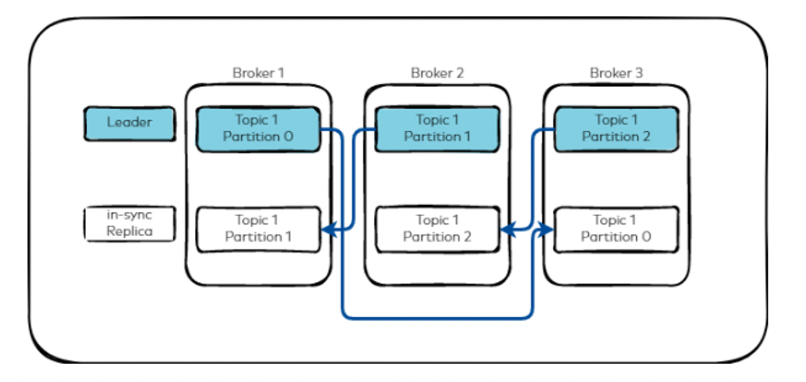

- 출처: [Confluent Kafka Reference](https://docs.confluent.io/kafka/design/replication.html)

`replication.factor` 설정 값을 통해서, 수동으로 토픽을 생성할 때 파티션 복제 수를 지정할 수 있고, `default.replication.factor` 설정을 통해 자동으로 토픽이 생성될 때 파티션 복제 수를 지정할 수 있다.

Note: 토픽 파티션의 복제 수가 너무 많은 것은 바람직하지 않다. 복제 수가 많다면 그만큼 데이터를 더 많이 저장하니까 디스크 사용량이 늘어나고, 복제를 위해 더 많이 다른 브로커들과 통신하니 네트워크 대역폭 사용량도 늘어난다. 이러한 이유로 이 값은 브로커의 노드 수에 맞춰서 값을 정하는 것이 좋다.

### 최소 In-Sync 레플리카 수를 유지하기

먼저, In-Sync 레플리카는 현재 복제가 가능한 토픽 파티션을 의미한다. 알 수 없는 이유로 현재 복제가 불가능한 토픽 파티션은 Out-Sync 레플리카라고 한다.

메시지는 리더 토픽 파티션에 기록된 후 In-Sync 레플리카에 복제되면 메시지 저장이 성공했다는 응답이 반환된다.

만약 최소 In-Sync 레플리카 값을 설정하지 않아서 복제 없이도 응답이 반환되도록 설정되어 있다면  데이터 유실 가능성이 있으므로, 이 값을 설정하는 것이 중요하다. 이는  `min.insync.replicas` 를 통해 설정할 수 있다.

Note: 이 값은 고가용성(High Availability) 과도 관련이 깊다. 만약 이 값을 `replication.factor` 와 동일하게 설정하면 가용성이 떨어지므로, 브로커 수를 고려해 적절한 값으로 설정하는 것이 중요하다.

### 브로커 Durability 와 관련된 설정

`log.retention.hours` :

- 메시지를 얼마나 오랫동안 보관할 지 결정하는 설정이다.
- 기본값은 168시간 (= 1주일) 이다.

```
log.retention.bytes
```

- `log.retention.hours` 와 유사한 의미를 가지며, 이 값의 크기에 도달할 때까지 메시지를 보관한다.
- 기본값으로 설정된 `-1` 은 로그 파일의 크기 제한을 없앤다는 의미다.
- `log.retention.hours` 와 함께 사용할 경우 혼란을 줄 수 있으므로 일반적으로 하나의 설정만 사용하는 것이 권장된다.

```
log.segment.bytes
```

- 기본적으로 토픽 파티션안의 메시지들은 하나의 거대한 로그 파일로 관리되지 않고 여러개의 세그먼트로 관리된다. 이 설정은 세그먼트의 최대 크기를 결정하며, 기본값으로는 1GB이다.
- 로그 세그먼트 파일은 최대 크기에 도달하지 않는다면 닫히지 않으며. 닫히지 않는 파일은 기본적으로 삭제되지 않는다는 사실을 알아야한다. 즉 하루에 100MB 씩 메시지가 쌓이고, `log.segment.bytes` 설정을 기본값으로 사용하고, `log.retention.hours` 값이 일주일 설정이라면 최대 17일동안 메시지는 보관될 수 있는 것이다.

```
message.max.bytes
```

- 카프카 브로커에 기록할 수 있는 최대 메시지 크기를 지정하는 설정이다. 즉 이 값보다 큰 메시지는 저장되지 않고 거절당한다.
- 기본값은 1MB 이다.
- 이 설정은 컨슈머 설정인 `fetch.message.max.bytes` 와 일치시키는 것이 좋다. `fetch.message.max.bytes` 값은 컨슈머에서 가지고 올 수 있는 최대 메시지 크기를 의미하는데, 만약 `message.max.bytes` 가 `fetch.message.max.bytes` 보다 더 크다면 컨슈머는 메시지를 읽지 못하는 상황이 발생할 수 있다.

## 신뢰성 있게 프로듀서를 사용하는 방법

프로듀서의 주요 임무는 브로커에 메시지를 잘 전달하는 것이다. 이와 관련된 설정으로는 다음과 같다.

- 메시지가 브로커에 복제될 때까지 대기하는 것
- 메시지 전송이 실패했다면 재시도 하는 것.
- (Optional) 메시지 순서를 보장하는 것.
- (Optional) 메시지 중복을 없애는 것.

### 메시지가 브로커에 복제될 때까지 기다리기

메시지가 브로커에 복제될 때까지 기다리는 옵션은 프로듀서의  `acks` 설정과 관련이 있다.

- `acks=0` 으로 설정하면, 프로듀서는 메시지 전송 후 응답을 기다리지 않는다.
- `acks=1` 으로 설정하면, 프로듀서는 리더 토픽 파티션에서만 메시지가 기록된 후 응답을 받는다.
- `acks=all` 로 설정하면, 프로듀서는 `min.insync.replicas` 값 만큼의 복제 파티션에 메시지가 기록될 때까지 기다린 후 응답을 받는다. 이는 메시지 유실을 최소하하는 가장 신뢰성 높은 옵션이다.

그러므로 메시지 유실을 방지하기 위해 `acks=all` 로 설정하는 것이 중요하다.

Note: 프로듀서는 메시지를 전달한 후 응답을 기다리는 동기식 처리 방법과, 응답을 기다리지 않고 응답이 왔을 때 콜백을 실행하도록 하는 비동기석 처리 방법이 있다. 동기식 처리 방법은 직관적이고 실패에 대한 핸들링이 쉽긴 하나 처리량이 정말 낮다는 단점이 있기 때문에 가능하다면 비동기식 처리 방법이 좋다.

### 메시지 전송이 실패했다면 재시도 하기

카프카에서는 메시지 전송 실패 시 내부적으로 재시도를 자동으로 수행한다. 재시도 횟수는 기본적으로 `Int.MAX` 값 만큼 수행하며, `deliver.timeout.ms` 설정에 따라 정해진 시간 동안만 재시도가 이뤄진다.

- `[deliver.timeout.ms](<http://deliver.timeout.ms>)` 값은 기본적으로 2분이다.

Note: 프로듀서 내부에 재시도 매커니즘이 내장되어 있기 때문에 어플리케이션 레벨에서 별도로 재시도 로직을 구현하지 않는 것이 중요하다. 어플리케이션에서 추가적인 재시도를 할 경우에는 메시지 중복이 발생할 수 있다.

### (Optional) 메시지 순서를 보장하고 싶다면?

카프카의 토픽 파티션은 로그 파일에 append only 로 데이터를 저장하기 때문에 파티션에 순서대로 메시지를 저장하면 메시지 순서는 보장된다. 즉 토픽 파티션마다 처리 순서가 보장된다.

- 메시지를 원하는 파티션으로 보내고 싶다면 Key 값을 정하면 된다.

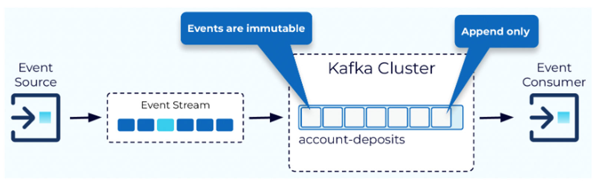

출처: [Confluent Kafka Architecture](https://developer.confluent.io/courses/architecture/get-started/)

그러나 프로듀서의 재시도 매커니즘으로 인해 메시지 순서가 바뀔 수 있다. 프로듀서에서는 원하는 파티션으로 메시지를 순차적으로 보내지만, 이후에 메시지 전달에 실패했다고 판단하면 해당 메시지는 재시도를 통해서 다시 전송되므로, 이 과정에서 순서가 뒤바뀔 수 있다.

- 프로듀서는 `max.in.flight.requests.per.connection` 설정 값만큼 한 번에 메시지를 보내니까 메시지 전송 실패 시, 재시도 과정에서 메시지 순서는 변경될 수 있는 것이다.

이러한 문제를 방지하고자 한다면 `enable.idempotency=true` 로 설정해서 멱등성 프로듀서를 사용하면 된다. 멱등성 프로듀서는 메시지에 프로듀서를 식별하는 `Producer Id` 와 메시지 순서를 식별하는 `Sequence Number` 를 부여한다. 이 정보를 통해 브로커 단에서 메시지 순서를 보장해주고, 이전에 받은 메시지라고 판단되면 이를 버림으로써 중복을 방지한다.

### **다중 프로듀서를 쓴다면 메시지 순서 보장이 어렵다.**

다중 프로듀서를 사용할 경우, 각각의 프로듀서는 멱등성을 통해 자신이 전송하는 메시지 순서를 보장할 수 있지만, 여러 프로듀서가 동일 파티션에 메시지를 경쟁적으로 전송하는 상황에서 전체 메시지 순서를 보장하기는 어렵다. 이런 경우, 메시지의 전역 순서를 보장하기 위해 글로벌 메시지 ID 를 사용하거나, 각 프로듀서 어플리케이션마다 하나의 토픽 파티션을 담당하도록 파티셔닝 해야한다.

### 멱등성 프로듀서는 중복 메시지가 발생할 수 있다.

멱등성 프로듀서를 사용하여 메시지를 전송하는 도중 프로듀서 어플리케이션이 크래쉬 나서 브로커로부터 메시지 전달 성공 응답을 받지 못했지만 실제로 메시지는 기록된 상황에서 재부팅 후 메시지를 다시 전송하게 되면 메시지 중복이 발생할 수 있다.

이는 멱등성 프로듀서의 Producer Id 특성으로 인해 메시지 중복을 방지하는 매커니즘과 관련있는데, 프로듀서 어플리케이션이 재부팅 된다면 동일한 Producer Id 값을 유지하지 못할 수도 있기 때문이다.

그러므로 이러한 문제를 완전히 방지하고자 한다면, 멱등성 프로듀서가 아닌 트랜잭셔널 프로듀서로 업그레이드 해서 사용하는 것이 좋다. 트랜잭셔널 프로듀서는 항상 동일한 Producer Id 를 유지하며, Epoch Number 를 통해 죽은 줄 알았던 이전 프로듀서 어플리케이션을 무효화 함으로써 좀비 어플리케이션 문제까지 해결해서 메시지 중복을 방지한다.

## 신뢰성 있게 컨슈머를 사용하는 방법

컨슈머의 주요 임무는 어느 메시지까지 읽었는지, 어디서부터 메시지 처리를 시작해야 하는지를 정확히 추적하는 것이다. 이를 통해 메시지 처리 과정에서 발생할 수 있는 누락을 방지할 수 있다.

컨슈머를 신뢰성 있게 사용하는 설정은 다음과 같다.

- [`group.id`](http://group.id) 를 통한 컨슈머 그룹 설정
- `auto.offset.reset` 설정
- 명시적으로 오프셋 커밋하기
- Dead Letter Queue 설정

### [group.id](http://group.id) 를 통한 컨슈머 그룹 설정

컨슈머는 컨슈머 그룹 별로 독립적으로 메시지를 처리하기 때문에 메시지 처리 목적이 서로 다르다면 각 목적에 맞는 별도의 컨슈머 그룹을 설정해야한다. 예를 들어, 다양한 처리 목적을 가진 여러 컨슈머가 동일한 컨슈머 그룹으로 속해서 토픽을 구독한다면, 각 컨슈머들은 토픽 내 전체 메시지를 처리하는 것이 아니라 각 파티션에서 일부 메시지만 처리하게 된다.

이는 카프카는 토픽 파티션을 컨슈머 그룹 내의 컨슈머들 사이에서 분배하는 과정 때문이다. 이로 인해, 하나의 컨슈머 그룹 내에 각 컨슈머는 토픽의 파티션들 중 일부를 할당받아 그 파티션의 메시지만을 처리하게 된다. 따라서, 만약 서로 다른 목적으로 메시지를 전체 처리해야 한다면, 각기 다른 컨슈머 그룹을 설정하여 메시지를 각각의 목적에 맞게 처리할 수 있도록 해야 한다.

### auto.offset.reset 설정

컨슈머가 브로커에 없는 오프셋을 요청하거나, 오프셋 데이터가 만료되어 사라진 경우 컨슈머 오프셋을 어떻게 리셋할지 결정하는 설정이다. 이 설정은 특히 컨슈머 그룹이 처음 토픽을 구독할 때, 또는 지정된 오프셋이 더 이상 존재하지 않을 때 사용된다.

- 오프셋은 consumer_offsets 이라는 토픽에 저장되며, 컨슈머 그룹에 활성화된 컨슈머가 하나도 없는 경우에 `offset.retention.minutes` 설정에 따라 이 기간이 지나면 해당 오프셋 데이터가  삭제된다.

`auto.offset.reset` 으로 설정할 수 있는 값은 다음과 같다:

- **“earliest”**: 기본값으로 파티션에 저장된 메시지 중 첫번째 메시지부터 읽도록 한다.
- **“latest”**: 파티션에 저장된 메시지 중 제일 마지막 메시지부터 읽도록 한다.
- **“none”**: 오프셋이 없다면 에러를 발생시키고 시작을 거부한다.

메시지 처리 과정에 누락이 없도록 하려면 `auto.offset.reset=earliest` 값으로 설정하는 것이 좋다. 물론 이 경우에는 메시지 처리 중복을 고려해야한다.

반면 최신 메시지 처리에만 관심이 있다면, `auto.offset.reset=latest` 설정을 사용할 수 있다. 설정을 선택할 때는 애플리케이션의 요구 사항과 메시지 처리 방식을 고려해야 한다.

### 명시적으로 오프셋 커밋하기

오프셋 커밋은 컨슈머가 메시지를 어디까지 처리했는지 카프카에 알려주는 역할을 한다. 이는 처리된 메시지의 위치를 기록함으로써 컨슈머가 중단된 후 재시작 할 때 이미 처리한 메시지를 건너뛰고, 처리하지 않은 메시지부터 처리를 시작할 수 있게 한다. 따라서 **메시지를 처리한 후에 오프셋을 커밋하는 매커니즘**이 중요하다. 만약 메시지 처리 전에 먼저 커밋을 한다면, 메시지 처리 중에 문제가 발생해서 중단되었을 때 메시지 처리에 누락이 발생할 위험이 있다.

오프셋 커밋 방법은 자동 커밋과 수동 커밋이 있다. `enable.auto.commit` 설정에 따라 이를 결정할 수 있다:

- **자동 커밋**: `enable.auto.commit=true`로 설정할 경우, 카프카는 주기적으로 오프셋을 자동으로 커밋한다. 이 방법은 구현이 간단하며, 개발자가 오프셋 커밋 시점을 직접 관리할 필요가 없다. 또 자동 커밋은 메시지 처리에 누락이 생길 수 있다고 편견을 가질 수 있는데, 그렇지 않다. 자동 커밋하는 시점은 메시지를 처리하고 다음 메시지를 가지고 올 때 수행하므로 안전한 설정이다. 하지만, 자동 커밋은 처리 중인 메시지에 대한 커밋 타이밍을 세밀하게 제어하기 어렵기 때문에, 메시지 중복 처리가 발생할 수 있다.
- **수동 커밋**: `enable.auto.commit=false`로 설정하고, 애플리케이션이 메시지 처리 후 명시적으로 오프셋을 커밋하는 방식이다. 이 방식은 개발자가 오프셋 커밋의 정확한 시점을 제어할 수 있으며, 메시지 처리를 보다 정확히 관리할 수 있어서 중복 처리를 예방할 수 있다.

추가로, 컨슈머가 Read-Process-Produce 패턴으로 처리하는 경우에도 커밋 타이밍이 중요하다. 올바른 커밋 시점은 처리가 완료되고, 메시지가 새로운 토픽에 성공적으로 전달된 후에 오프셋을 커밋하는 것이다. 또 다른 방법으로는, 트랜잭셔널 프로듀서를 사용하여 커밋과 메시지 전달을 원자적(atomic)으로 관리할 수 있다.

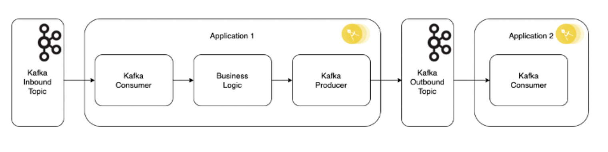

출처: [Kafka Exactly-Once Delivery](https://www.linkedin.com/pulse/kafka-transactions-part-1-exactly-once-messaging-rob-golder/)

### ## Dead Letter Queue 설정

컨슈머가 메시지를 가져와서 처리하다가 실패하는 경우엔 어떻게 대응해야할까? 일시적인 문제일 수 있으니 재시도를 해보는 것이 좋을 것 같다. 그러나 모든 문제가 재시도로 해결되지는 않는다. 재시도 후에도 문제가 지속된다면 계속해서 재시도를 하는 것은 시스템에 부담을 주고 전체 메시지 처리 성능에 영향을 줄 수 있기 때문에 실패한 메시지는 DLQ 로 분리하는 것이 좋다. 이를 통해 메시지 처리를 원활하게 진행할 수 있고, 실패한 메시지를 유실되지 않도록 하면서, 필요하다면 실패한 메시지에 대한 처리를 재개 할 수 있다.


# Wallet Service 구축 

구매자가 전자상거래 업체에서 상품을 구매하고 결제하면, 해당 금액은 즉시 판매자에게 정산되지 않는다. 결제 금액은 먼저 결제 서비스 제공업체(PSP)로 이동한 뒤, PSP에서 전자상거래 회사의 법인 계좌로 전송되고. 이후, 전자상거래 회사는 판매자에게 해당 금액을 정산한다. 


## 데이터 모델링

### Wallets

| name       | type                        | description                               |
| ---------- | --------------------------- | ----------------------------------------- |
| id         | PK, BIG INT, AUTO INCREMENT | 지갑의 고유 식별자                        |
| user_id    | BIG INT, UNIQUE             | 지갑 소유자의 식별자                      |
| balance    | DECIMAL                     | 지갑의 현재 잔액                          |
| version    | INT                         | 지갑의 버전 정보. 주로 동시성 제어에 사용 |
| created_at | DATETIME                    | 생성된 날짜                               |
| updated_at | DATETIME                    | 업데이트된 날짜                           |

### Wallet Transactions

| ame             | type                        | description                                                  |
| --------------- | --------------------------- | ------------------------------------------------------------ |
| id              | PK, BIG INT, AUTO INCREMENT | 거래의 고유 식별자                                           |
| wallet_id       | FK, BIG INT                 | 거래가 발생한 지갑의 식별자                                  |
| amount          | DECIMAL                     | 거래 금액                                                    |
| type            | ENUM(’CREDIT’, ‘DEBIT’)     | 거래 유형, 지갑에 자금이 추가되는 경우 CREDIT, 자금이 차감되는 경우 DEBIT |
| reference_type  | VARCHAR                     | 거래가 참조하는 엔터티 유형 (e.g ‘주문’, ‘환불’ 등)          |
| reference_id    | BIG INT                     | 거래가 참조하는 외부 엔터티 식별자                           |
| order_id        | VARCHAR                     | 거래와 관련된 결제 주문 식별자                               |
| idempotency_key | VARCHAR                     | 중복 거래 삽입을 막기위한 멱등성 식별자                      |
| created_at      | DATETIME                    | 생성된 날짜                                                  |
| updated_at      | DATETIME                    | 업데이트된 날짜                                              |

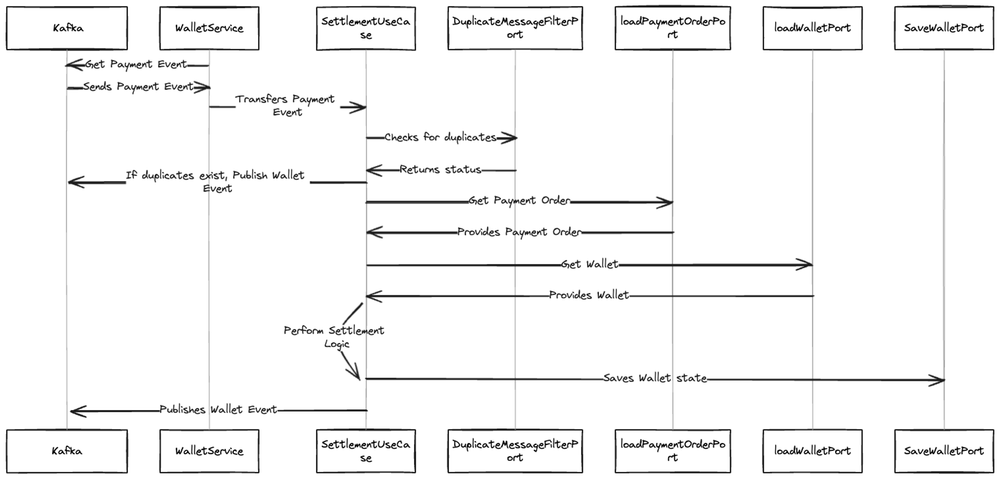

(1) **Kafka ↔ WalletService**: Wallet Service 에서는 Kafka 로부터 결제 승인 완료를 알리는 PaymentEventMessage를 받는다.

(2) **WalletService → SettlementUseCase**: Wallet Service는 정산 처리를 SettlementUseCase 에 위임한다.

(3) **SettlementUseCase → DuplicateMessageFilterPort:** 중복 이벤트 메시지로 인한 여러 번 정산을 방지하기 위해 이벤트 메시지가 이미 처리되었는지 확인한다.

(4-1) **SettlementUseCase → Kafka:** 이미 처리된 이벤트 메시지인 경우, 정산 처리를 건너뛰고 WalletEventMessage 를 Kafka 에 발행한다.

(4-2) **SettlementUseCase → LoadPaymentOrderPort**: 처음 받는 이벤트 메시지라면, 정산 처리를 위해 결제 주문 내역을 조회한다.

(5): **SettlementUseCase → LoadWalletPort**: 결제 주문 내역과 연관된 판매자의 지갑 정보를 조회한다.

(6) **Settlement Business Logic**: 정산 비즈니스 로직을 수행한다.

(7) **SettlementUseCase → SaveWalletPort**: 업데이트된 정산 내역을 데이터베이스에 반영한다.

(8) **SettlementUseCase → Kafka**: 정산 완료를 알리는 이벤트 메시지를 Kafka에 발행한다. 이후 Payment Service는 이 메시지를 받아 결제 처리를 마무리한다.


# Wallet Service - Kafka Transaction 

## Kafka Transaction 이란?

카프카 트랜잭션은 여러 파티션에 대한 원자적 쓰기를 보장한다. 이를 통해 여러 토픽으로 동시에 메시지를 발행하거나, 메시지 처리 커밋과 토픽에 메시지를 발행하는 작업을 원자적으로 정확히 한 번 수행할 수 있다.

카프카 트랜잭션은 시스템 장애가 발생했을 때 여러 토픽에 메시지를 발행하는 작업이 원자적으로 이뤄지지 못하고 부분적으로만 이루어지는 것을 방지할 수 있다.

단, 카프카 트랜잭션은 카프카 토픽 내에서만 유효하다. 외부 데이터베이스나 시스템에서 일어나는 처리 작업에 대해서는 트랜잭션을 보장하지 않는다. 따라서 카프카 트랜잭션을 통해 메시지가 정확히 한 번만 발행된다 해도, 수신한 메시지가 정확히 한 번 처리된다는 보장은 없다. 메시지를 수신하여 애플리케이션에서 외부 시스템에 대한 상태 변경 작업을 수행하는 경우, 이 작업은 여러 번 처리될 가능성이 있으므로 이에 대비할 필요가 있다.

## Wallet Service 에서 Kafka Transaction 이 필요한 이유는?

Kafka 트랜잭션이 필요한 이유는 정산 처리와 같이 중요한 작업의 성공 메시지가 절대 누락되지 않게 하기 위해서다. 만약 메시지가 누락된다면 Payment Service 는 이 메시지를 수신할 수 없으므로 결제 완료 작업을 수행할 수 없게 된다.

여기서 메시지를 안정적으로 발행하기 위해서 Kafka 커밋과 메시지 전달을 원자적으로 할 수 있는 Kafka 트랜잭션을 적용해서 해결해보겠다.

## Kafka Transaction 작동 원리 

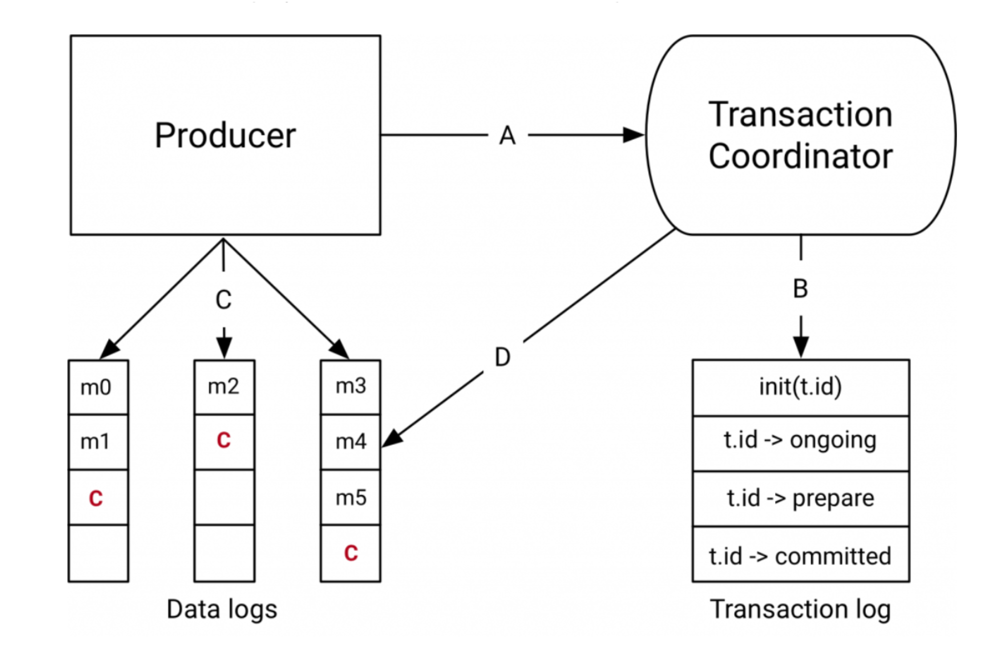

Transaction Coordinator 에 의해 카프카 트랜잭션 상태가 관리된다.

- 트랜잭션 상태는 총 3가지가 있으며, `Ongoing` -> `Prepare commit` -> `Completed` 순서대로 전환된다.
- 트랜잭션 상태는 trasnaction log 라는 토픽에서 관리가 된다. 이 토픽을 관리할 수 있는 것은 Transaction Coordinator 뿐이며, 이것도 다른 토픽 파티션과 마찬가지로 복제가 된다.

구체적으로 동작하는 과정은 크게 A -> B -> C -> D 순으로 이뤄진다:

- A) 프로듀서는 트랜잭션 기능을 사용하기 위해서 `initTransactions API` 를 호출한다. 이를 통해 프로듀서는 자신의 [transactional.id](http://transactional.id) 를 트랜잭션을 Coordinator 에 등록시켜서 트랜잭션 프로듀서로 업그레이드 된다. 그리고 이 시점에서 이전에 완료하지 못했던 트랜잭션 작업이 있다면 마무리 시킨다.
- B) 프로듀서는 트랜잭션을 시작할 때 이를 Coordinator 에게 알려준다. Transaction Coordinator 는 transaction log 의 트랜잭션 상태를 `ongoing` 으로 변경시킨다.
- C) 이 과정은 일반 프로듀서가 토픽 파티션에 데이터를 보내는 것과 거의 동일하다. 추가되는 점은 브로커에서 프로듀서가 보낸 메시지를 보고 좀비 프로듀서가 보낸 건 아닌지 검사하는 과정이 추가된다.
- D) 프로듀서가 모든 데이터를 쓰고 나서 `commitTransaction API` 를 호출하면 Transaction Coordinator 는 Transaction Log 에 상태를 `prepare commit` 으로 변경시킨다. 일단 이 상태가 되면 트랜잭션은 완료될 수 있다. 그 후 Transaction Coordinator 는 컨슈머가 커밋된 데이터를 읽어갈 수 있도록 토픽 파티션에 commit marker 를 남긴다. Commit Marker 를 모두 남기게 되면 Transaciton log 에 롼료 상태인 `Completed` 를 기록하고 마무리한다.


## Kafka Transaction 사용법

### (1) Producer Configuration

```java
public KafkaProducer<Integer, String> createKafkaProducer() {
    Properties props = new Properties();

    props.put(ProducerConfig.BOOTSTRAP_SERVERS_CONFIG, bootstrapServers);
    props.put(ProducerConfig.CLIENT_ID_CONFIG, "client-" + UUID.randomUUID());
    props.put(ProducerConfig.KEY_SERIALIZER_CLASS_CONFIG, IntegerSerializer.class);
    props.put(ProducerConfig.VALUE_SERIALIZER_CLASS_CONFIG, StringSerializer.class);

    if (transactionTimeoutMs > 0) {
        props.put(ProducerConfig.TRANSACTION_TIMEOUT_CONFIG, transactionTimeoutMs);
    }
    if (transactionalId != null) {
        props.put(ProducerConfig.TRANSACTIONAL_ID_CONFIG, transactionalId);
    }

    props.put(ProducerConfig.ENABLE_IDEMPOTENCE_CONFIG, enableIdempotency);
    return new KafkaProducer<>(props);
}
```

- `props.put(ProducerConfig.TRANSACTIONAL_ID_CONFIG, transactionalId);` 설정을 통해 [transaction.id](http://transaction.id) 를 등록해야 트랜잭션 프로듀서를 사용할 수 있다.
- `props.put(ProducerConfig.TRANSACTION_TIMEOUT_CONFIG, transactionTimeoutMs);` 가능한 transactionTimeoutMs 값을 짧게 잡아줘서 트랜잭션 작업이 지연되지 않도록 만드는 것을 추천한다.

### (2) Consumer Configuration

```java
public KafkaConsumer<Integer, String> createKafkaConsumer() {
    Properties props = new Properties();

    props.put(ConsumerConfig.BOOTSTRAP_SERVERS_CONFIG, bootstrapServers);
    props.put(ConsumerConfig.CLIENT_ID_CONFIG, "client-" + UUID.randomUUID());
    props.put(ConsumerConfig.GROUP_ID_CONFIG, groupId);

    instanceId.ifPresent(id -> props.put(ConsumerConfig.GROUP_INSTANCE_ID_CONFIG, id));
    props.put(ConsumerConfig.ENABLE_AUTO_COMMIT_CONFIG, readCommitted ? "false" : "true");
    props.put(ConsumerConfig.KEY_DESERIALIZER_CLASS_CONFIG, IntegerDeserializer.class);
    props.put(ConsumerConfig.VALUE_DESERIALIZER_CLASS_CONFIG, StringDeserializer.class);
    
		if (readCommitted) {
        props.put(ConsumerConfig.ISOLATION_LEVEL_CONFIG, "read_committed");
    }
    
		props.put(ConsumerConfig.AUTO_OFFSET_RESET_CONFIG, "earliest");
    return new KafkaConsumer<>(props);
}
```

- `props.put(ConsumerConfig.ENABLE_AUTO_COMMIT_CONFIG, readCommitted ? "false" : "true");` Transactional Producer 를 통해서 커밋을 할테니 기본적으로 자동 커밋은 꺼야한다.
- 트랜잭션으로 발행된 메시지를 읽을 때는 다음 설정을 해줘야한다.  `props.put(ConsumerConfig.ISOLATION_LEVEL_CONFIG, "read_committed")`

### (3) Transaction Demo

```java
public void run() {
    int processedRecords = 0;
    long remainingRecords = Long.MAX_VALUE;
    // it is recommended to have a relatively short txn timeout in order to clear pending offsets faster
    int transactionTimeoutMs = 10_000;
    // consumer must be in read_committed mode, which means it won't be able to read uncommitted data
    boolean readCommitted = true;
    try (KafkaProducer<Integer, String> producer = new Producer("processor-producer", bootstrapServers, outputTopic, true, transactionalId, true, -1, transactionTimeoutMs, null).createKafkaProducer();

    KafkaConsumer<Integer, String> consumer = new Consumer("processor-consumer", bootstrapServers, inputTopic, "processor-group", Optional.of(groupInstanceId), readCommitted, -1, null).createKafkaConsumer()) {

        // called first and once to fence zombies and abort any pending transaction
        producer.initTransactions();

        consumer.subscribe(singleton(inputTopic), this);

        Utils.printOut("Processing new records");
        while (!closed && remainingRecords > 0) {
            try {
                ConsumerRecords<Integer, String> records = consumer.poll(ofMillis(200));
                if (!records.isEmpty()) {
                    // begin a new transaction session
                    producer.beginTransaction();

                    for (ConsumerRecord<Integer, String> record : records) {
                        // process the record and send downstream
                        ProducerRecord<Integer, String> newRecord = new ProducerRecord<>(outputTopic, record.key(), record.value() + "-ok");
                            producer.send(newRecord);
                        }

                        // checkpoint the progress by sending offsets to group coordinator broker
                        // note that this API is only available for broker >= 2.5
                        producer.sendOffsetsToTransaction(getOffsetsToCommit(consumer), consumer.groupMetadata());

                        // commit the transaction including offsets
                        producer.commitTransaction();
                        processedRecords += records.count();
                    }
            } catch (AuthorizationException | UnsupportedVersionException | ProducerFencedException
                         | FencedInstanceIdException | OutOfOrderSequenceException | SerializationException e) {
                // we can't recover from these exceptions
                Utils.printErr(e.getMessage());
                shutdown();
            } catch (OffsetOutOfRangeException | NoOffsetForPartitionException e) {
                // invalid or no offset found without auto.reset.policy
                Utils.printOut("Invalid or no offset found, using latest");
                consumer.seekToEnd(emptyList());
                consumer.commitSync();
            } catch (KafkaException e) {
                // abort the transaction and try to continue
                Utils.printOut("Aborting transaction: %s", e);
                producer.abortTransaction();
            }
            remainingRecords = getRemainingRecords(consumer);
            if (remainingRecords != Long.MAX_VALUE) {
                Utils.printOut("Remaining records: %d", remainingRecords);
            }
        }
    } catch (Throwable e) {
        Utils.printOut("Unhandled exception");
        e.printStackTrace();
    }
    Utils.printOut("Processed %d records", processedRecords);
    shutdown();
}
```

- (1) `producer.initTransactions();` 를 통해 프로듀서를 트랜잭션 프로듀서로 업그레이드 시킨다.
- (2) `consumer.subscribe(singleton(inputTopic), this);` 를 통해서 메시지를 수신할 토픽 파티션을 설정한다.
- (3) `producer.beginTransaction();` 를 통해서 트랜잭션 처리를 시작한다.
- (4) `producer.send(newRecord);` 를 통해서 다음 스트림 처리를 위해 토픽 파티션에 메시지를 발행한다.
- (5) `producer.sendOffsetsToTransaction(getOffsetsToCommit(consumer), consumer.groupMetadata());` 를 통해서 오프셋을 커밋한다.
- (6) `producer.commitTransaction();` 를 통해서 트랜잭션을 커밋한다.
- (7) 만약 처리하다가 예외가 발생한다면 `producer.abortTransaction();` 를 통해서 트랜잭션 처리를 롤백시키는게 중요하다.

## Spring Cloud Stream 에서의 Kafka Transaction 사용법

*`spring.cloud.stream.kafka.binder.transaction.transactionIdPrefix`* 값을 설정함으로써 트랜잭셔널 프로듀서를 활용하게 되며 메시지를 처리할 때마다 Kafka Transaction 이 사용된다.

Kafka Transaction 기능을 사용할 때 주의할 점은 어플리케이션을 수평적으로 확장할 경우 각 어플리케이션마다 `transactionIdPrefix` 값을 유니크하게 설정해야 한다는 점이다.


# Wallet Service 신뢰성 향상 (feat: Dead Letter Queue) 

메시지 처리 작업에서 실패는 허용될 수 있지만, 누락은 결코 발생해서는 안된다. 처리되지 않은 메시지로 인해 판매자는 판매한 제품에 대한 보상을 받지 못할 수 있고, 결제 시스템 역시 정상적인 결제 완료가 어려워질 수 있기 때문이다.

이러한 메세지 처리 누락을 방지하고 메시지 처리 시스템에 신뢰성을 제공해주는 방법은 Retry Queue 와 Dead Letter Queue 를 활용하는 것이다. 메시지 처리에 실패한 메시지는 Retry Queue 에 넣어서 재시도 하고, 재시도를 통해 해결되지 않은 메시지는 Dead Letter Queue 에 따로 보관하는 방법이다. 만약 Dead Letter Queue 가 없다면, 실패한 메시지는 계속 재시도 되어서 전체 시스템의 처리 성능을 저하시킬 수 있다. 그러므로 일정 횟수 이상 실패한 메시지는 별도의 Dead Letter Queue 에 보관하는 것이다. 이렇게 보관된 메시지는 수동으로라도 처리할 수 있게 된다.

## **Spring Cloud Stream: Transactional Rollback Strategies**

Spring Cloud Stream 에서 Kafka Transaction 을 사용하는 경우, 트랜잭션 처리 중 예외가 발생한다면 `AfterRollbackProcessor` 에 의해 에외는 핸들링된다.

특별히 복구 전략을 설정하지 않은 경우, 기본적으로 `maxAttempts` 설정에 따라서 실패한 메시지들을 다시 가져와서 처리한다.

재시도 횟수가 모두 소진되었다면 메시지는 처리되었다고 가정하고 커밋한다. 즉, 메시지 처리에 유실이 생길 수 있다.

메시지 처리 과정에서 유실을 원치 않는다면 DLQ (Dead Letter Queue) 토픽에 메시지를 전송하도록 설정 할 수 있다. DLQ 토픽으로 메시지가 전송되면, 원본 Kafka 토픽에는 메시지가 처리되었다고 커밋을 하게된다.

만약 DLQ 토픽으로 보내는데 실패하면 무한 재시도가 이뤄지게 된다.

## Spring Cloud Stream 에서 DLQ 적용하기

Spring Cloud Stream Kafka Binder 에서 다음 설정을 넣으면 DLQ (Dead-Letter-Queue) 기능을 간단하게 적용시킬 수 있다.

- `spring.cloud.stream.kafka.bindings.[FUNCTION_NAME]-in-0.consumer.enableDlq=true`
- `spring.cloud.stream.kafka.bindings.[FUNCTION_NAME]-in-0.consumer.dlqName=[DLQ_NAME]`

`dlqName` 을 입력하지 않는다면 `error.<destination>.<group>` 으로 DLQ 토픽 이름이 지정된다.

#### Example: Retry Queue + Dead Letter Queue 를 적용하는 방법

실패한 메시지를 처리하는 일반적인 방법은 Retry Queue 에 저장해두고, Retry Queue 에서 Original Topic 으로 메시지를 다시 가져와서 재시도 하는 방법이다. 만약에 이렇게 몇 번 했는데도 실패한다면 메시지는 이제 Retry Queue 로 보내지 않고 Dead Letter Queue 로 보내서 보관하는 방식이다. 

```java
@Bean
public Function<Message<?>, Message<?>> reRoute() {
    return failed -> {
        processed.incrementAndGet();
        Integer retries = failed.getHeaders().get(X_RETRIES_HEADER, Integer.class);
        if (retries == null) {
            System.out.println("First retry for " + failed);
            return MessageBuilder.fromMessage(failed)
                    .setHeader(X_RETRIES_HEADER, 1)
                    .setHeader(BinderHeaders.PARTITION_OVERRIDE,
                            failed.getHeaders().get(KafkaHeaders.RECEIVED_PARTITION_ID))
                    .build();
        }
        else if (retries < 3) {
            System.out.println("Another retry for " + failed);
            return MessageBuilder.fromMessage(failed)
                    .setHeader(X_RETRIES_HEADER, retries + 1)
                    .setHeader(BinderHeaders.PARTITION_OVERRIDE,
                            failed.getHeaders().get(KafkaHeaders.RECEIVED_PARTITION_ID))
                    .build();
        }
        else {
            System.out.println("Retries exhausted for " + failed);
            streamBridge.send("parkingLot", MessageBuilder.fromMessage(failed)
                .setHeader(BinderHeaders.PARTITION_OVERRIDE,
                        failed.getHeaders().get(KafkaHeaders.RECEIVED_PARTITION_ID))
                .build());
        }
        return null;
    };
}
```


Note: DLQ 토픽으로 전달되는 메시지는 기존에 처리를 시도했던 메시지와 같은 토픽 파티션으로 결정된다. 그래서 DLQ 토픽과 원본 토픽은 파티션 개수가 동일해야 함을 의미한다. 만약 두 토픽의 파티션 개수가 다르거나 파티션을 변경하고자 한다면, DlqPartitionFunction 빈을 새로 정의해서 파티션을 결정할 수 있다.

```java
@Bean
public DlqPartitionFunction partitionFunction() {
    return (group, record, ex) -> 0;
}
```

### Advanced Retry Option

실패한 메시지들 재시도 관련 설정을 넣을 수 있다.

- `maxAtttempts`: 재시도 하는 횟수.
- `backOffInitialInterval`: 재시도 사이의 초기 대기 시간(밀리초 단위)을 지정.
- `backOffMultipler`: 재시도 사이의 대기시간 배수를 지정
- `backOffMaxInterval`: 재시도 간 최대 대기 시간을 밀리초 단위로 지정

```java
spring.cloud.stream.bindings.[FUNCTION_NAME]-in-0.consumer.maxAtttempts
spring.cloud.stream.bindings.[FUNCTION_NAME]-in-0.consumer.backOffInitialInterval
spring.cloud.stream.bindings.[FUNCTION_NAME]-in-0.consumer.backOffMultipler
spring.cloud.stream.bindings.[FUNCTION_NAME]-in-0.consumer.backOffMaxInterval
```

Note: 재시도를 모두 소진 했을 때 총 소요 시간은 Apache Kafka 의 [max.poll.interval.ms](http://max.poll.interval.ms) 값을 넘기면 안된다. 만약 이 값을 넘기게 된다면 Kafka 는 Consumer 가 메시지를 가져가지 않으므로 죽었다고 판단해서 리밸런싱을 진행하기 때문. ([max.poll.interval.ms](http://max.poll.interval.ms) 기본값은 5분이다.)

다음 설정을 통해서 재시도 가능한 에러일 경우에만 재시도 하도록 설정할 수 있다.

```java
spring.cloud.stream.bindings.processData-in-0.consumer.defaultRetryable=false
```

재시도 가능한 에러는 개발자가 지정해줘야한다.

```java
spring.cloud.stream.bindings.processData-in-0.consumer.retryableExceptions.java.lang.IllegalStateException=true
spring.cloud.stream.bindings.processData-in-0.consumer.retryableExceptions.java.lang.IllegalArgumentException=false
```