# 인프런 - 비전공자의 전공자 따라잡기 - 조현영님 강의 

- https://www.inflearn.com/course/%EC%A0%84%EA%B3%B5%EC%9E%90-%EB%94%B0%EB%9D%BC%EC%9E%A1%EA%B8%B0-%EB%84%A4%ED%8A%B8%EC%9B%8C%ED%81%AC-http/dashboard


* 노드 js 실행코드 : https://github.com/zerocho/cs-network-http

[toc]


# 1 OSI 7계층

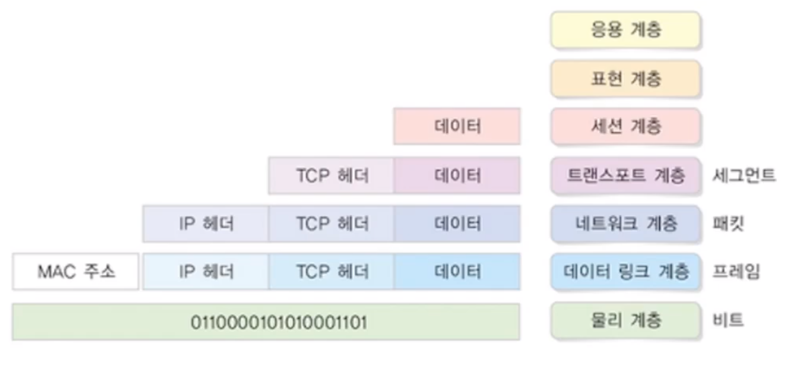


## L3 계층

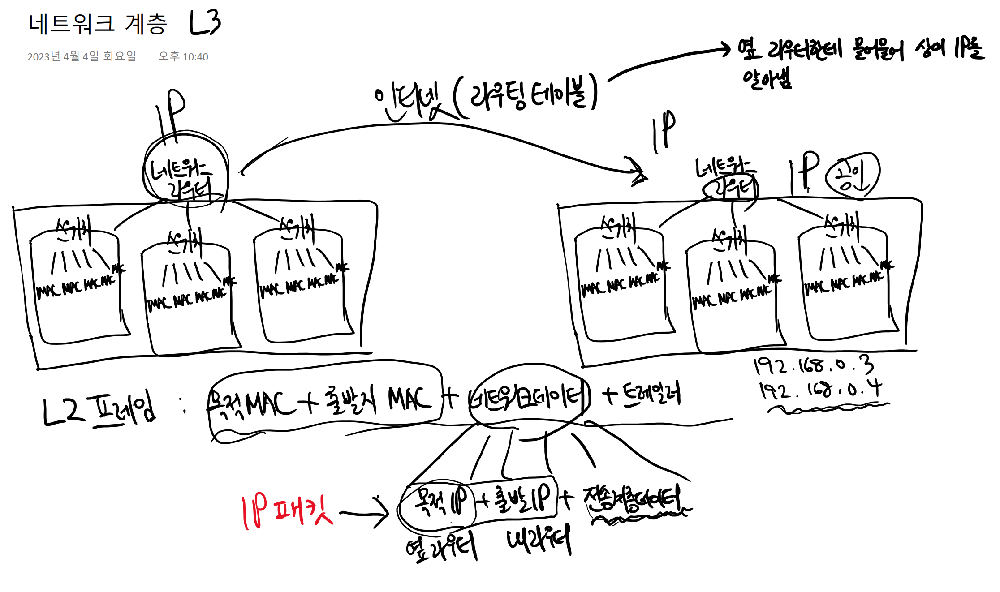

L2프레임에서 네트워크 데이터가 들어있다.

### 공인 IP vs 사설 IP

네트워크에는 대표 주소인 IP가 있음 

* but 개수 한정으로 내부 네트워크는 사설 Ip를 사용

ex) 공인 IP - 123.45.61.8 사용 - 요청을 받을때는 이 아이피를 사용

* 사설 IP - 192.168 ~~, 172.16 ~ 172.31
  * ex) 공유기 - 192.168.0.1
  * 공기청정기 - 192.168.0.23
  * 에어컨 - 192.168.0.34 

## 전송 계층

포트

0~ 1023 은 Well Known Port로 역할이 정해져있다.

총 0~65535까지 65536개

## 데이터 흐름

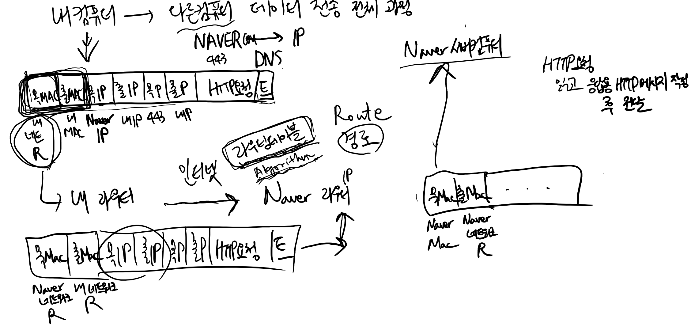

ex) 네이버로 전송 과정

1. 내 라우터로 먼저 전송( 목적지 MAC(내 네트워크), 출발지 MAC( 내 MAC))
2. 내라우터는 Naver 라우터의 MAC주소를 안다. 그래서 네이버 라우터로 전송한다
   1. 목적지 MAC(네이버 네트워크 라우터), 출발지 MAC ( 내 네트워크 라우터)
3. 네이버 라우터는 목적지 MAC(네이버 MAC), 출발지 MAC(네이버 네트워크 라우터)를 담은 정보를 전송
4. 네이버 서버컴퓨터가 요청을 읽고 응답한다

**라우터간 주소 획득 과정**

* 라우팅테이블에서 경로를 물어물어 찾아가는 것
* 네이버 IP는 처음부터 알고있다 (DNS 덕분에)

>
> 라우터끼리의 데이터 전송에서도 MAC주소와 IP 주소 전부 사용된다.
>
> `다른 라우터의 MAC 주소를 전부 알지는 못하고 바로 옆 라우터만 알고 있다`.  거기다가 네이버IP를 알고 있는 것
>
> 바로 옆 라우터(next hop)한테 네이버 찾아달라고 물어보고, 옆 라우터는 옆옆 라우터의 MAC주소를 알고 있으므로 옆옆 라우터한테 물어보고 해서 물어 물어 찾는 방식. 
>
> 이게 ip 라우팅(라우팅테이블)이다.

```
어떤 사람의 주소가 용인시 수지구라는 사실을 알아내는 것이 DNS이고, 
용인시 수지구까지 어떻게 가야하는지를 물어물어 아는 것이 라우팅 테이블
(강남구는 분당구한테 물어보고, 분당구는 수지구한테 물어보고...)
```

## DNS 레코드

DNS란?

- https://www.cloudflare.com/ko-kr/learning/dns/what-is-dns/

#### DNS 조회의 8단계:

1. 사용자가 웹 브라우저에 'example.com'을 입력하면, 쿼리가 인터넷으로 이동하고 DNS 재귀 확인자(DNS 리졸버)가 이를 수신합니다.
2. 이어서 리졸버가 DNS 루트 이름 서버(.)를 쿼리합니다.
3. 다음으로, 루트 서버가, 도메인에 대한 정보를 저장하는 최상위 도메인(TLD) DNS 서버(예: .com 또는 .net)의 주소로 확인자에 응답합니다. example.com을 검색할 경우의 요청은 .com TLD를 가리킵니다.
4. 이제, 확인자가 .com TLD에 요청합니다.
5. 이어서, TLD 서버가 도메인 이름 서버(example.com)의 IP 주소로 응답합니다.
6. 마지막으로, 리졸버가 도메인의 이름 서버로 쿼리를 보냅니다.
7. 이제, example.com의 IP 주소가 이름 서버에서 확인자에게 반환됩니다.
8. 이어서, DNS 확인자가, 처음 요청한 도메인의 IP 주소로 웹 브라우저에 응답합니다.
9. DNS 조회의 8단계를 거쳐 example.com의 IP 주소가 반환되면, 이제 브라우저가 웹 페이지를 요청할 수 있습니다.

10. 브라우저가 IP 주소로 [HTTP](https://www.cloudflare.com/learning/ddos/glossary/hypertext-transfer-protocol-http/) 요청을 보냅니다.
11. 해당 IP의 서버가 브라우저에서 렌더링할 웹 페이지를 반환합니다(10단계).

### 레코드

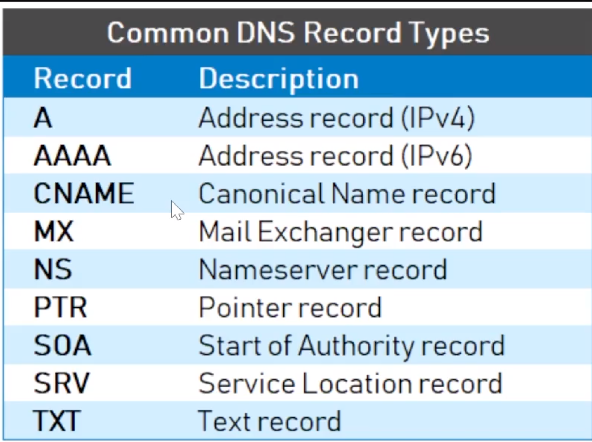

## 와이어샤크 사용하기

https://www.wireshark.org/

설치

https://hongpossible.tistory.com/entry/Wireshark%EB%9E%80-%EC%84%A4%EC%B9%98%EB%B2%95

https://luckygg.tistory.com/379

https://doongdangdoongdangdong.tistory.com/249

https://no-more-assignment.tistory.com/175

와이어샤크 3way handshake - https://stay-present.tistory.com/103

* https://whitekeyboard.tistory.com/858

* https://sh-safer.tistory.com/142


네트워크 공부시? - https://www.cloudflare.com/ko-kr/learning/


## 3way handshake, TLS 핸드쉐이크

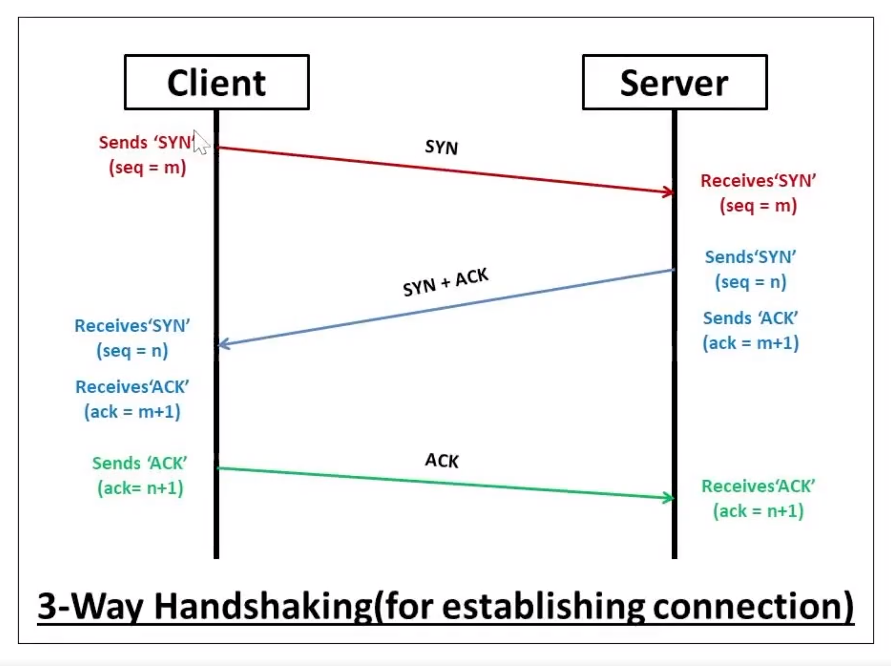

TCP는 장치들 사이에 논리적인 접속을 성립(establish)하기 위하여 three-way handshake를 사용한다.

 

**TCP 3 Way Handshake는 TCP/IP프로토콜을 이용해서 통신을 하는 응용프로그램이 데이터를 전송하기 전에** 

**먼저** **정확한 전송을 보장하기 위해 상대방 컴퓨터와 사전에 세션을 수립하는 과정을 의미한다..**

 

* Client > Server : **TCP SYN**

* Server > Client : **TCP SYN, ACK**

* Client > Server : **TCP ACK**

여기서 SYN은 'synchronize sequence numbers', 그리고 ACK는'acknowledgment' 의 약자이다.

이러한 절차는 TCP 접속을 성공적으로 성립하기 위하여 반드시 필요하다.

**TCP의 3-way Handshaking 역할**

* 양쪽 모두 데이타를 전송할 준비가 되었다는 것을 보장하고, 실제로 데이타 전달이 시작하기전에

  한쪽이 다른 쪽이 준비되었다는 것을 알수 있도록 한다.

* 양쪽 모두 상대편에 대한 초기 순차일련변호를 얻을 수 있도록 한다. 

https://seongonion.tistory.com/74

**TCP의 3-way Handshaking 과정**

**[STEP 1]**

A클라이언트는 B서버에 접속을 요청하는 SYN 패킷을 보낸다.

이때 A클라이언트는 SYN 을 보내고 SYN/ACK 응답을 기다리는 **SYN_SENT** 상태, **B서버는 Wait for Client** 상태이다.

**[STEP 2]** 

B서버는 SYN요청을 받고 A클라이언트에게 요청을 수락한다는 ACK 와 SYN flag 가 설정된 패킷을 발송하고

A가 다시 ACK으로 응답하기를 기다린다. 이때 **B서버**는 **SYN_RECEIVED** 상태가 된다.

**[STEP 3]**

A클라이언트는 B서버에게 ACK을 보내고 이후로부터는 연결이 이루어지고 데이터가 오가게 되는것이다.

이때의 **B서버 상태가 ESTABLISHED** 이다.

위와 같은 방식으로 통신하는것이 신뢰성 있는 연결을 맺어 준다는 TCP의 3 Way handshake 방식이다.

### **2. 4-way Handshaking** 

3-Way handshake는 TCP의 연결을 초기화 할 때 사용한다면, 

4-Way handshake는 세션을 종료하기 위해 수행되는 절차입니다.

> 4-Way handshake는 TCP (Transmission Control Protocol) 연결 종료 과정에서 사용되는 메커니즘입니다. TCP 연결을 정상적으로 종료하기 위해 필요한 네 단계의 메시지 교환 과정

https://seongonion.tistory.com/74

*** TCP의 4-way Handshaking 과정**

**[STEP 1]**

클라이언트가 연결을 종료하겠다는 FIN플래그를 전송한다. 이때 **A클라이언트는 FIN-WAIT** 상태가 된다.

**[STEP 2]** 

B서버는 FIN플래그를 받고, 일단 확인메시지 ACK 보내고 자신의 통신이 끝날때까지 기다리는데 이 상태가

**B서버의 CLOSE_WAIT**상태다.

**[STEP 3]**

연결을 종료할 준비가 되면, 연결해지를 위한 준비가 되었음을 알리기 위해 클라이언트에게 FIN플래그를 전송한다. 이때 B서버의 상태는 **LAST-ACK**이다.

**[STEP 4]**

클라이언트는 해지준비가 되었다는 ACK를 확인했다는 메시지를 보낸다.

**A클라이언트의 상태가 FIN-WAIT ->****TIME-WAIT** 으로 변경된다.

그런데 만약 "Server에서 FIN을 전송하기 전에 전송한 패킷이 Routing 지연이나 패킷 유실로 인한 재전송 등으로 인해 FIN패킷보다 늦게 도착하는 상황"이 발생한다면 어떻게 될까요? 

 

Client에서 세션을 종료시킨 후 뒤늦게 도착하는 패킷이 있다면 이 패킷은 Drop되고 데이터는 유실될 것입니다. 

 

**A클라이언트**는 이러한 현상에 대비하여 Client는 Server로부터 FIN을 수신하더라도 일정시간(디폴트 240초) 동안 세션을 남겨놓고 잉여 패킷을 기다리는 과정을 거치게 되는데 이 과정을 **"****TIME_WAIT****"** 라고 합니다. 일정시간이 지나면, 세션을 만료하고 연결을 종료시키며, **"CLOSE"** 상태로 변화합니다. 

> -4Way handshake가 필요한 이유
>
> 양측 모두 독립적으로 데이터를 보낼 수 있으므로, 양측 모두 독립적으로 연결을 종료할 준비가 되었다는 것을 확인해야한다

# HTTP

## 네트워크 탭 사용하기

브라우저에서 f12 누르면 된다.

* Disable cache를 눌러 끄면 좋다. 캐시땜에 제대로 못받는 데이터가 많다

## RFC 보는방법

RFC(Request for Comments)는 인터넷을 구성하는 여러 기술과 프로토콜에 대한 사양, 보고서, 정보를 기록한 문서

* rfc 번역 잘된 티스토리 블로그 : https://roka88.dev/category/RFC

* 모질라 HTTP 리소스와 명세 https://developer.mozilla.org/ko/docs/Web/HTTP/Resources_and_specifications

rfc 7231 : http 1.1 프로토콜 문서 :https://datatracker.ietf.org/doc/html/rfc7231

rfc 2616 :  http 1.1 프로토콜 세부 사양 문서  : https://datatracker.ietf.org/doc/html/rfc2616

최신 문서 - RFC 9110 - https://www.rfc-editor.org/rfc/rfc9110

* 여기가 가장 디테일하다
* 이 문서는 RFC 3864를 업데이트하고 RFC 2818, 7231, 7232, 7233, 7235, 7538, 7615, 7694 및 7230의 일부를 폐기한다고 한다.

TLS 최신 문서 - https://datatracker.ietf.org/doc/html/rfc8446

HTTP docs Mozila - https://developer.mozilla.org/en-US/docs/Web/HTTP

> MDN 에서 본 후 스펙가서 보는게 정확하다


## 주소 구성 체계 (URL, URI, Origin)

**URL (Uniform Resource Locator)**: 웹에서 정보를 찾는데 사용하는 가장 일반적인 방법으로, 웹 페이지를 가리키는 주소입니다. 

URL의 구성요소

* 프로토콜 (http, https 등), 
* 서버 이름 (또는 IP 주소), 
* 경로 (서버 상의 파일 위치), 
* 선택적으로 포트 번호와 쿼리 문자열

예시: `https://www.example.com:80/path/to/myfile.html?key1=value1&key2=value2`

- `https://`는 프로토콜
- `www.example.com`는 서버 이름
- `80`은 포트 번호. 이는 선택사항이며 일반적으로 생략다. https의 기본 포트는 443, http의 기본 포트는 80
- `/path/to/myfile.html`는 서버 상의 파일 위치
- `key1=value1&key2=value2`는 쿼리 문자열로, 서버로 전달될 추가 파라미터

**URI (Uniform Resource Identifier)**: 리소스를 식별하는 고유한 문자열로, URL과 URN (Uniform Resource Name)의 상위 개념

*  모든 URL은 URI지만 모든 URI가 URL인 것은 아니다
* **URI** (Uniform Resource Identifier)는 인터넷에서 자원을 고유하게 식별하고 구별하기 위한 문자열. 즉, 어떤 자원이 있는지를 알려줍니다. URI의 주요한 두 가지 하위 카테고리는 URL과 URN.
* **URL** (Uniform Resource Locator)은 인터넷 상의 자원의 정확한 위치를 가리키고, 그 위치에 접근하는 방법을 설명하는 URI입니다. 즉, 그 자원이 어디에 있는지와 어떻게 접근할 수 있는지를 알려줍니다.
* **URN** (Uniform Resource Name)은 리소스의 이름을 제공하는 URI의 한 형태로, 그 위치와는 상관 없이 리소스를 고유하게 식별합니다.


* https://nodejs.org/api/url.html#url

```
┌────────────────────────────────────────────────────────────────────────────────────────────────┐
│                                              href                                              │
├──────────┬──┬─────────────────────┬────────────────────────┬───────────────────────────┬───────┤
│ protocol │  │        auth         │          host          │           path            │ hash  │
│          │  │                     ├─────────────────┬──────┼──────────┬────────────────┤       │
│          │  │                     │    hostname     │ port │ pathname │     search     │       │
│          │  │                     │                 │      │          ├─┬──────────────┤       │
│          │  │                     │                 │      │          │ │    query     │       │
"  https:   //    user   :   pass   @ sub.example.com : 8080   /p/a/t/h  ?  query=string   #hash "
│          │  │          │          │    hostname     │ port │          │                │       │
│          │  │          │          ├─────────────────┴──────┤          │                │       │
│ protocol │  │ username │ password │          host          │          │                │       │
├──────────┴──┼──────────┴──────────┼────────────────────────┤          │                │       │
│   origin    │                     │         origin         │ pathname │     search     │ hash  │
├─────────────┴─────────────────────┴────────────────────────┴──────────┴────────────────┴───────┤
│                                              href                                              │
└────────────────────────────────────────────────────────────────────────────────────────────────┘
```

- **protocol (스키마)**: 이는 리소스에 액세스하기 위해 사용되는 프로토콜을 나타냅니다. 예: 'https:', 'http:', 'ftp:'
- **auth**: URL의 사용자 이름과 비밀번호를 나타냅니다. 예: 'user:pass'. 대부분의 웹사이트에서는 보안상의 이유로 사용되지 않습니다.
- **host**: URL의 호스트 이름과 포트 번호를 나타냅니다. 
  - 예: 'sub.example.com:8080'. 호스트 이름은 웹 서버의 이름 또는 IP 주소
  -  포트 번호는 해당 서버에서 리소스에 액세스하기 위해 사용되는 네트워크 포트를 나타냅니다.
- **hostname**: 이는 URL의 호스트 이름을 나타냅니다. 예: 'sub.example.com'.
- **port**: 이는 URL의 네트워크 포트 번호를 나타냅니다. 예: '8080'.
- **path (pathname)**: 이는 서버에서 리소스의 위치를 나타냅니다. 예: '/p/a/t/h'.
- **search**: 이는 URL의 쿼리 문자열을 나타냅니다. 예: '?query=string'. 이는 일반적으로 웹 서버에 추가 정보를 제공하는 데 사용됩니다.
- **query**: 이는 URL의 쿼리 파라미터를 나타냅니다. 예: 'query=string'.
- **hash**: 이는 URL의 프래그먼트 식별자를 나타냅니다. 예: '#hash'. 이는 특정 페이지 내의 특정 위치(일반적으로 앵커)를 참조하는 데 사용됩니다. - 프론트엔드에서만 식별 가능
- **origin**: 이는 URL의 출처를 나타냅니다. 출처는 스키마, 호스트, 포트 번호로 구성됩니다. 예: '[https://sub.example.com:8080](https://sub.example.com:8080/)'.
- **href**: 이는 전체 URL을 나타냅니다.


**Origin**: 웹 보안에서 매우 중요한 개념으로, 웹 컨텐츠의 출처를 정의합니다. 같은 출처 정책(Same-Origin Policy)은 웹 브라우저가 스크립트를 실행할 때 해당 스크립트가 데이터에 접근할 수 있는 범위를 제한합니다.

Origin은 URI 스킴 (프로토콜), 호스트 (도메인 이름 또는 IP 주소), 그리고 포트 번호로 정의됩니다. 

* https://www.example.com:443`는 웹 페이지 `https://www.example.com/index.html`의 origin

# HTTP 헤더

1. HTTP 메서드와 REST API
2. 안전한 메서드, 멱등성 메서드
3. 상태 코드(1XX, 2XX)
4. 직접 서버 실행해보기 + 3XX 상태 코드
5. 에러 상태 코드(4XX, 5XX)
6. 컨텐츠 협상과 MIME Type
7. Keep-Alive, Date, Transfer-Encoding
8. Authorization, 기타 헤더, 커스텀 헤더
9. 쿠키
10. 캐시(Cache-Control)
11. 캐시 신선도 검사
12. CORS

## HTTP 메서드와 REST API

https://www.rfc-editor.org/rfc/rfc9110#name-methods

### REST API

- redhat 공식문서(한글, 간단함) - https://www.redhat.com/ko/topics/api/what-is-a-rest-api
- aws 공식문서(한글, 간단함) -https://aws.amazon.com/ko/what-is/restful-api/
- 가비아 공식문서 - restful api 설계 가이드(한글, 디테일함) - https://library.gabia.com/contents/8339/
- 마이크로소프트 Learn 공식 문서 Restful web api design(한글, 디테일함) - https://learn.microsoft.com/ko-kr/azure/architecture/best-practices/api-design
- http의 멱등성 - https://hudi.blog/http-method-idempotent/
- http의 멱등성, 안정성, 캐시성 - [https://inpa.tistory.com/entry/WEB-%F0%9F%8C%90-HTTP%EC%9D%98-%EB%A9%B1%EB%93%B1%EC%8[…\]2%AF-%EC%99%84%EB%B2%BD-%EC%9D%B4%ED%95%B4%ED%95%98%EA%B8%B0](https://inpa.tistory.com/entry/WEB-🌐-HTTP의-멱등성-·-안정성-·-캐시성-💯-완벽-이해하기)


## 안전한 메서드, 멱등성 메서드

* 안전한 메서드 : https://www.rfc-editor.org/rfc/rfc9110#name-safe-methods
* 멱등성 메서드 : https://www.rfc-editor.org/rfc/rfc9110#section-9.2.2

| HTTP 메서드 | 안전성 | 멱등성 |
| ----------- | ------ | ------ |
| GET         | O      | O      |
| POST        | X      | X      |
| PUT         | X      | O      |
| PATCH       | X      | X      |
| DELETE      | X      | O      |
| HEAD        | O      | O      |
| OPTIONS     | O      | O      |
| CONNECT     | X      | X      |
| TRACE       | O      | O      |

* https://blog.tossbusiness.com/articles/dev-1


**안전한 메서드** : 안전한 메서드를 호출하는 동안 부작용을 일으키는 동작을 포함하지 않는다.

> 안전성이 보장된 메서드는 리소스를 변경하지 않는다.

-> 아무리 요청해도 서버의 상태를 바꾸지 않는 메서드

-> 정의한 요청 방식 중 [GET](https://www.rfc-editor.org/rfc/rfc9110#GET) , [HEAD](https://www.rfc-editor.org/rfc/rfc9110#HEAD) , [OPTIONS](https://www.rfc-editor.org/rfc/rfc9110#OPTIONS) , [TRACE](https://www.rfc-editor.org/rfc/rfc9110#TRACE) 방식은 안전한 것으로 정의되어 있다. 

**멱등성 메서드** : 연산을 여러 번 적용해도 결과가 달라지지 않는 성질을 갖는 메서드. 주로 분산 시스템에서 고려된다.

웹에서 HTTP 메서드 중 GET, PUT, DELETE 등은 멱등성을 가진다.

* GET 요청은 서버의 상태를 변경하지 않으므로, 한 번 요청하든 여러 번 요청하든 같은 결과를 얻는다. 
* DELETE 요청도 마찬가지로, 한 번이든 여러 번이든 요청한 리소스를 제거한다.
* PUT 요청은 한 번 사용하든 여러 번 사용하든 요청한 리소스의 상태는 항상 마지막에 전송된 요청 페이로드로 설정되기 때문에 결과가 같기 때문이다
*  반면에, PATCH 메서드는 리소스의 부분적인 수정을 가능하게하는데, 같은 PATCH 요청을 여러 번 보낼 경우, 각 요청이 리소스의 상태에 추가적인 변경을 가할 수 있다. 예를 들어, 특정 필드의 값을 증가시키는 PATCH 요청을 연속해서 보내면, 해당 필드의 값은 매번 증가한다.
  * 그러나 이는 PATCH 요청의 내용에 따라 달라질 수 있다.
  * 약 PATCH 요청이 특정한 상태로 리소스를 설정하는 방식이라면, 그 PATCH 요청은 멱등할 수 있다.

하지만 `PUT`은 리소스를 수정하고, DELETE는 메소드를 제거하므로 안전한 메소드라고는 이야기할 수 없다.


또한 대부분의 캐시 구현은 GET 및 HEAD만 지원한다.

## HTTP 상태 코드

https://developer.mozilla.org/ko/docs/web/http/status

* https://datatracker.ietf.org/doc/html/rfc2616#section-10

1. **1xx (Informational)**: 요청이 받아졌고, 프로세스가 계속되고 있다는 것을 나타냅니다.
   - 예: 100 Continue, 101 Switching Protocols
2. **2xx (Successful)**: 요청이 성공적으로 받아졌고, 이해되었으며, 승인되었다는 것을 나타냅니다.
   - 예: 200 OK, 201 Created, 204 No Content
3. **3xx (Redirection)**: 클라이언트는 요청을 완료하기 위해 추가적인 동작을 취해야 한다는 것을 나타냅니다. 대부분의 경우 URL 리디렉션을 나타냅니다.
   - 예: 301 Moved Permanently, 303 See Other, 304 Not Modified
4. **4xx (Client Error)**: 클라이언트 요청에 오류가 있음을 나타냅니다. 잘못된 문법, 유효하지 않은 요청 등이 이에 해당됩니다.
   - 예: 400 Bad Request, 401 Unauthorized, 404 Not Found
5. **5xx (Server Error)**: 서버가 유효한 요청을 수행하지 못했음을 나타냅니다. 서버 오류나 외부 의존성 실패 등이 이에 해당됩니다.
   - 예: 500 Internal Server Error, 502 Bad Gateway, 503 Service Unavailable

## 컨텐츠 협상과 MIME Type

```http
Accept: text/plain, text/html
Accept-Encoding: gzip, br
Accept-Language: ko-KR;q=0.9
Accept-Charset: utf-8
Transfer-Encoding: chunked
Content-Type: text/html; charset=utf-8
Content-Encoding: br
Content-Language: ko-KR
```

- `Accept`: 클라이언트가 이해할 수 있는 미디어 타입을 나타냅니다.
- `Accept-Encoding`: 클라이언트가 이해할 수 있는 콘텐츠 인코딩을 나타냅니다.
- `Accept-Language`: 클라이언트의 언어 선호도를 나타냅니다.
- `Accept-Charset`: 클라이언트가 이해할 수 있는 문자 인코딩을 나타냅니다.
- `Transfer-Encoding`: 메시지 바디가 어떻게 인코딩되었는지 나타냅니다. "chunked"는 메시지 바디가 여러 조각으로 분할되었음을 의미합니다.
- `Content-Type`: 실제 메시지 바디의 미디어 타입을 나타냅니다.
- `Content-Encoding`: 실제 메시지 바디가 어떻게 인코딩되었는지 나타냅니다.
- `Content-Language`: 메시지 내용의 자연어를 나타냅니다.

## Keep-Alive, Date, Transfer-Encoding

* https://developer.mozilla.org/ko/docs/Web/HTTP/Headers/Connection


1. **Keep-Alive**: Keep-Alive 헤더는 HTTP/1.1에서 도입되었으며, 클라이언트와 서버 사이에 열린 연결이 얼마나 오랫동안 유지될 것인지를 나타냅니다. 이것은 네트워크 연결에 대한 오버헤드를 줄이고 응답 시간을 향상시키는데 도움이 됩니다. Keep-Alive 헤더는 일반적으로 두 개의 파라미터, 즉 timeout과 max를 포함합니다. timeout은 연결이 유휴 상태로 있을 수 있는 최대 시간을 초 단위로 지정하고, max는 연결을 통해 전송될 수 있는 최대 요청 수를 지정합니다.
2. **Date**: Date 헤더는 메시지가 생성된 날짜와 시간을 나타냅니다. 이 헤더는 로깅, 응답 시간 측정, 캐시 유효성 등에 사용될 수 있습니다. Date 헤더의 값은 HTTP-date 형식의 타임스탬프입니다.
   * 생성된 시각이지, 도착한시각이 아니다 
3. **Transfer-Encoding**: Transfer-Encoding 헤더는 메시지 본문이 어떻게 인코딩되어 전송되었는지를 나타냅니다. 이 헤더의 가장 흔한 값은 "chunked"로, 이는 메시지 본문이 여러 개의 청크 또는 조각으로 분할되어 전송되었음을 나타냅니다. 청크 전송 인코딩은 메시지의 본문 길이를 미리 알 수 없을 때 유용하며, 본문을 생성하는 동안 동시에 전송을 시작할 수 있도록 해줍니다. 이것은 대규모 데이터를 전송할 때 유용합니다.

## Authorization, 기타 헤더, 커스텀 헤더

https://developer.mozilla.org/ko/docs/Web/HTTP/Headers/Authorization

* Authorization: Basic

* Authorization: Bearer

* Authorization: Digest

https://developer.mozilla.org/ko/docs/Web/HTTP/Authentication

### basic

**Basic**: Basic 인증 방식은 사용자 이름과 비밀번호를 Base64로 인코딩하여 전송한다. 

예를 들면, 사용자 이름이 'user'이고 비밀번호가 'pass'인 경우, `Authorization: Basic dXNlcjpwYXNz`와 같이 헤더가 설정된다. 

이 방식은 비교적 간단하지만 보안에 취약하다. 

인증 정보가 암호화되지 않고 단순히 인코딩만 되기 때문에 중간자 공격에 취약하다.

```http
GET /resource HTTP/1.1
Host: example.com
Authorization: Basic dXNlcjpwYXNz // user:pass
```

여기서 `dXNlcjpwYXNz`는 "user:pass"를 Base64로 인코딩한 결과

- 장점
  - 구현이 매우 간단하다. 클라이언트는 사용자 이름과 비밀번호를 Base64로 인코딩하기만 하면 되기 때문이다.
  - HTTP 프로토콜에 내장되어 있어서 대부분의 HTTP 클라이언트에서 지원한다.
- 단점
  - 보안성이 매우 낮다. Basic 인증은 사용자 이름과 비밀번호를 암호화하지 않고 Base64 인코딩만 사용하기 때문에, 트래픽을 가로채는 중간자 공격에 취약하다. 따라서 반드시 HTTPS와 같은 안전한 연결 상에서만 사용되어야 한다.
  - 서버에 인증 정보를 계속 보내야 하므로 세션 관리가 불가능하다.

### Bearer

**Bearer**: Bearer 인증 방식은 주로 OAuth 2.0에서 토큰을 전달하는 데 사용된다. 

이 방식은 토큰 기반의 인증 방식으로, 'Bearer' 다음에 공백을 한 칸 두고 토큰을 추가한다

예를 들면, `Authorization: Bearer your_token`와 같이 설정됩니다. 이 토큰을 이용해 서버는 클라이언트를 식별하고 인증한다.

```http
GET /resource HTTP/1.1
Host: example.com
Authorization: Bearer your_token
```

여기서 `your_token`은 실제 발급받은 토큰을 사용

- 장점
  - OAuth 2.0과 함께 사용하면, 클라이언트는 유저의 비밀번호를 서버에 보낼 필요 없이 토큰만으로도 인증을 할 수 있어 보안성이 높다.
  - Bearer 토큰은 자체적으로 인증 정보를 포함하고 있기 때문에, 분산 시스템에서 유용하게 사용될 수 있다.
- 단점
  - 토큰이 탈취당하면, 토큰을 탈취한 사람은 토큰이 만료되기 전까지 해당 유저로서의 모든 권한을 가진다.
  - 토큰 관리가 필요하다. 토큰의 만료 시간, 토큰의 갱신 등을 관리해야 하기 때문이다.

### Digest

**Digest**: Digest 인증 방식은 Basic 인증 방식의 보안 문제를 개선한 방식이다. 

사용자 이름과 비밀번호를 그대로 전송하는 대신, 비밀번호의 해시값을 전송하여 중간자 공격을 방지한다. 

그러나 이 방식은 설정이 복잡하고, 최신 인증 방식에 비해 사용이 감소하고 있다. 

Digest 인증 방식을 사용할 때는 헤더가 `Authorization: Digest username="user", realm="realm", nonce="nonce", uri="/", response="response"`와 같이 설정된다. 

* 여기서 'realm', 'nonce', 'response' 등의 값은 Digest 인증 절차에 따라 생성된다.

```http
GET /resource HTTP/1.1
Host: example.com
Authorization: Digest username="Mufasa",
                        realm="testrealm@host.com",
                        nonce="dcd98b7102dd2f0e8b11d0f600bfb0c093",
                        uri="/dir/index.html",
                        qop=auth,
                        nc=00000001,
                        cnonce="0a4f113b",
                        response="6629fae49393a05397450978507c4ef1",
                        opaque="5ccc069c403ebaf9f0171e9517f40e41"
```

Digest 인증에서는 비밀번호 해시를 생성하기 위해 여러 파라미터가 사용됩니다.

 `username`, `realm`, `nonce`, `uri`, `qop`, `nc`, `cnonce`, `response`, `opaque`는 서버와 클라이언트 간의 통신에 사용되는 값들

이 예제에서 사용된 각 값은 임의의 값을 사용한 것이며, 실제 사용 시에는 각 인증 요청에 맞는 값이 필요하다.

1. **username**: 인증할 때 쓰는 사용자 이름이다. 이메일이나 ID가 될 수 있다.
2. **realm**: 보호해야 하는 영역의 이름이다. 사용자한테 인증 요청할 때 이 이름을 보여준다.
3. **nonce**: 서버가 만들어 낸 일회용 랜덤 숫자다. 이걸로 클라이언트가 이전 인증 요청을 다시 쓰는 걸 방지한다.
4. **uri**: 요청한 주소, 즉 URI다.
5. **qop**: "quality of protection"의 줄임말로, 클라이언트가 알아들을 수 있는 보호 수준을 정의하는 거다. 보통 "auth"라는 값이 많이 쓰인다.
6. **nc**: "nonce count"의 줄임말로, 클라이언트가 nonce를 사용해서 몇 번 요청을 보냈는지를 나타내는 거다. 이건 16진수로 나타내고, 요청을 할 때마다 값이 증가한다.
7. **cnonce**: "client nonce"의 줄임말로, 클라이언트가 만든 일회용 랜덤 숫자다. 이걸로 서버가 클라이언트를 인증한다.
8. **response**: 클라이언트가 만든 특별한 해시 값이다. nonce, 사용자 이름, 비밀번호, HTTP 메서드, 요청한 URI 등을 기반으로 이 값을 계산한다.
9. **opaque**: 서버가 주는 문자열인데, 클라이언트는 이걸 그대로 모든 인증 요청에 넣어야 한다. 이 문자열은 클라이언트가 처음 인증 요청을 보낼 때 서버에게 받고, 그 후의 모든 인증 요청에서 클라이언트는 이 값을 포함해야 한다. 이건 서버가 각 인증 세션을 추적하기 위한 거다.

- 장점
  - Basic 인증보다 보안성이 높다. 비밀번호를 해시 형태로 전송하기 때문에, 트래픽을 가로채는 중간자 공격에 비밀번호가 노출되는 것을 방지할 수 있다.
  - 비밀번호를 평문으로 저장할 필요가 없다.
- 단점
  - 설정과 관리가 복잡하다.
  - 중간자 공격에 완전히 안전한 것은 아니다. 예를 들어, 중간자가 통신을 가로채서 자신을 클라이언트로 가장할 수 있다.
  - HTTPS와 같이 사용하지 않으면, 다른 보안 위협에 노출될 수 있다.
  - 최신 웹 기술에서는 잘 사용되지 않는다.

## 쿠키

https://developer.mozilla.org/ko/docs/Web/HTTP/Headers/Cookie

* **`Cookie`** HTTP 요청 헤더는 [`Set-Cookie`](https://developer.mozilla.org/ko/docs/Web/HTTP/Headers/Set-Cookie) 헤더와 함께 서버에 의해 이전에 전송

https://developer.mozilla.org/ko/docs/Web/HTTP/Headers/Set-Cookie

* **`Set-Cookie`** HTTP 응답 헤더는 서버에서 사용자 브라우저에 쿠키를 전송하기 위해 사용

https://developer.mozilla.org/ko/docs/Web/HTTP/Cookies

* HTTP 쿠키(웹 쿠키, 브라우저 쿠키)는 서버가 사용자의 웹 브라우저에 전송하는 작은 데이터 조각

> 문서에 정말 다양하게 적혀있으니 반드시 읽어보자 

쿠키는 주로 세 가지 목적을 위해 사용됩니다:

- 세션 관리(Session management)

  서버에 저장해야 할 로그인, 장바구니, 게임 스코어 등의 정보 관리

- 개인화(Personalization)

  사용자 선호, 테마 등의 세팅

- 트래킹(Tracking)

  사용자 행동을 기록하고 분석하는 용도

```
Set-Cookie: <cookie-name>=<cookie-value>
Set-Cookie: <cookie-name>=<cookie-value>; Expires=<date>
Set-Cookie: <cookie-name>=<cookie-value>; Max-Age=<non-zero-digit>
Set-Cookie: <cookie-name>=<cookie-value>; Domain=<domain-value>
Set-Cookie: <cookie-name>=<cookie-value>; Path=<path-value>
Set-Cookie: <cookie-name>=<cookie-value>; Secure
Set-Cookie: <cookie-name>=<cookie-value>; HttpOnly

Set-Cookie: <cookie-name>=<cookie-value>; SameSite=Strict
Set-Cookie: <cookie-name>=<cookie-value>; SameSite=Lax

// Multiple directives are also possible, for example:
Set-Cookie: <cookie-name>=<cookie-value>; Domain=<domain-value>; Secure; HttpOnly
```


## 캐시(Cache-Control)

"Cache-Control"은 HTTP 헤더의 일부로, 웹 콘텐츠의 캐싱 동작을 제어하는 데 사용됩니다. 웹 브라우저나 프록시 서버 등은 이 헤더를 사용하여 웹 콘텐츠를 캐시(즉, 임시로 저장)하고, 이를 통해 더 빠른 응답 시간을 제공하며, 서버의 부하를 줄이고 네트워크 대역폭 사용을 최소화할 수 있습니다.

* https://developer.mozilla.org/ko/docs/Web/HTTP/Headers/Cache-Control

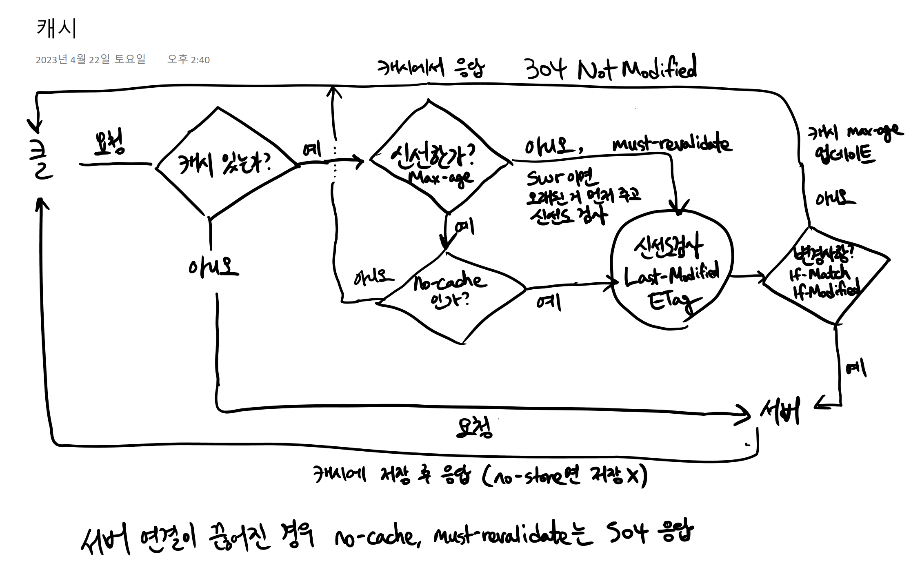

"Cache-Control" 헤더는 다음과 같은 여러 디렉티브를 포함할 수 있습니다:

- `no-cache`: 클라이언트가 캐시된 응답을 사용하기 전에 원래 서버를 통해 이를 재검증해야 함을 나타냅니다.
- `no-store`: 클라이언트가 응답을 어떤 형태로든 캐시하지 말아야 함을 나타냅니다. 이는 민감한 정보가 포함된 웹 콘텐츠를 다룰 때 주로 사용됩니다.
- `max-age`: 웹 콘텐츠가 신선하게 유지되는 최대 시간(초)을 나타냅니다.
- `private`: 응답이 특정 사용자만을 위한 것이므로 공유 캐시에 저장되지 않아야 함을 나타냅니다.
- `public`: 응답이 공유 캐시에 저장될 수 있음을 나타냅니다. 이 디렉티브는 응답이 특정 사용자에게 개인화되어 있지 않은 경우에 주로 사용됩니다.


앞서 말했듯 HTTP 캐싱이란 결국 HTTP 응답을 저장해 두고 다음번에 동일한 HTTP 요청이 시도되면 저장해 둔 HTTP 응답을 재활용하는 것이다. 그렇다면 **HTTP 응답을 저장해 두는 저장소**는 어디일까? 크게 두 가지로 분류해볼 수 있다.

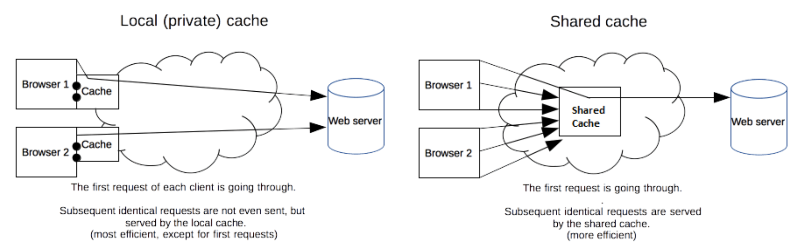

* 먼저, **사설 캐시(Private Cache)**가 있다. **지역 캐시(Local Cache)**라고도 부른다. 이는 **한 사용자에 의해서만 재활용**될 수 있는 것들이 저장되는 저장소이다. 최초의 HTTP 요청은 서버에게 전송되어 HTTP 응답을 받아오게 되고, 이를 사설 캐시에 저장해 두면 다음번에 동일한 HTTP 요청이 시도될 때는 서버에 해당 HTTP 요청을 다시 보내지 않고 저장되어 있는 HTTP 응답을 재활용하게 된다. 대표적인 사설 캐시로는 **브라우저 캐시**가 있다. 브라우저 캐시는 기본적으로 사용자가 HTTP 요청을 통해 다운로드한 모든 문서들을 저장하고 있다. 이렇게 저장된 문서들은 뒤로 가기 혹은 앞으로 가기를 할 때, 문서 저장을 할 때, 페이지 소스 보기를 할 때 등의 경우에 재활용이 된다.

 

* 다음으로, **공유 캐시(Shared Cache)**가 있다. 이는 **여러 사용자들에 의해 재활용**될 수 있는 것들이 저장되는 저장소이다. 최초의 HTTP 요청은 공유 캐시를 거쳐 서버에게 전송되어 HTTP 응답을 받아오게 되고, 이를 공유 캐시에 저장해 두면 다음번에 동일한 HTTP 요청이 공유 캐시에게 전달될 때 서버에 해당 HTTP 요청을 다시 보내지 않고 저장되어 있는 HTTP 응답을 클라이언트에게 반환하게 된다. 대표적인 공유 캐시로는 **프록시 캐시**가 있다. ISP 혹은 회사 측에서 로컬 네트워크 인프라의 일부로서 구축해둔 웹 프록시가 이러한 역할을 담당할 수 있다. 그러면 자주 사용되는 데이터들의 경우에 네트워크 트래픽을 최소화하여 많은 구성원들이 해당 데이터를 효율적으로 사용할 수 있게 되는 것이다.


> 브라우저 캐시와 프록시 캐시 외에도 다양한 종류의 캐시가 존재한다. 게이트웨이 캐시, CDN, 리버스 프록시 캐시, 로드 밸런서 등이 대표적인 예시이다

### **HTTP 캐시 엔트리 (= 캐싱하는 대상)**

**HTTP 캐시에 저장되는 데이터 뭉치 하나하나를 캐시 엔트리**라고 부른다. 그리고 각 캐시 엔트리를 구분하는 기준은 **캐시 키(Cache Key)**이다. 기본적인(Primary) 캐시 키는 HTTP 요청의 메소드와 URI의 조합으로 결정된다(일반적으로 GET 요청에 대해서만 캐싱하므로 URI로만 결정되는 경우도 있음). 즉, 간단히 생각해서 **메소드와 URI가 동일한 하나의 HTTP 요청은 하나의 캐시 엔트리에 대응**하는 것이다. 캐시 엔트리의 일반적인 형태를 살펴보면 다음과 같다.

 

- HTML 문서, 이미지, 파일 등의 리소스를 포함하는 GET 요청에 대한 **200 (OK) 응답**
- **301 (Moved Permanently) 응답**
- **404 (Not Found) 응답**
- **206 (Partial Content) 응답**
- (캐시 키로 사용하기에 적절한 무언가가 정의된 경우) GET이 아닌 HTTP 요청에 대한 HTTP 응답

 

이때 주의해야 할 것은, 하나의 캐시 엔트리가 여러 개의 HTTP 응답들로 구성되어 있을 수도 있다는 것이다. 이 경우에 해당 HTTP 응답들은 그 캐시 엔트리 내에서 두 번째(Secondary) 키에 의해 구분이 된다. 이는 보통 그 캐시 엔트리에 대응하는 HTTP 요청이 컨텐츠 협상(Content Negotiation)의 타겟인 경우에 해당한다. 이와 관련한 더 자세한 내용은 [여기](https://developer.mozilla.org/en-US/docs/Web/HTTP/Caching#varying_responses)를 읽어보도록 하자.

### **Cache-Control 헤더**

HTTP/1.1의 Cache-Control 헤더에는 **HTTP 요청/응답에서의 캐싱 메커니즘을 결정하는 여러 디렉티브(Directive)들을 나열**할 수 있다. 각각의 디렉티브는 캐싱을 어떻게 할 것인지와 관련된 일종의 옵션이라고 보면 된다. 이때 **Cache-Control 헤더는 HTTP 요청 헤더와 HTTP 응답 헤더에 모두 사용할 수 있지만, 각각에 나열하는 디렉티브들은 서로 다른 의미를 지니며 나열할 수 있는 디렉티브들의 종류도 조금씩 다르다.** 따라서 HTTP 요청의 Cache-Control 헤더에 나열된 디렉티브들이 반드시 HTTP 응답의 Cache-Control 헤더에 나열되리라는 보장은 없다. 디렉티브 이름은 대소문자를 구별하지 않으며, 여러 디렉티브들을 나열하는 경우에는 콤마로 구분한다.

 

**3-1. HTTP 요청의 Cache-Control 헤더에 나열할 수 있는 디렉티브**

| **디렉티브**          | **설명**                                                     |
| --------------------- | ------------------------------------------------------------ |
| max-age=<seconds>     | **명시된 시간보다 나이를 많이 먹은 HTTP 응답은 받아들이지 않겠다**는 것을 나타낸다. 그리고 max-stale 디렉티브가 존재하지 않는다면 만료된 HTTP 응답도 받아들이지 않는다.  참고로, 캐시에 남아 있는 기존 HTTP 응답을 삭제하려면 max-age=0 디렉티브를 명시하면 된다. 이는 서버에게 검증(Validation) 요청을 보내도록 강제할 것이기 때문이다. |
| max-stale[=<seconds>] | **만료된 HTTP 응답을 받아들이겠다**는 것을 나타낸다. 만약 이 디렉티브에 시간이 명시된다면 만료 이후의 초과 시간이 그 시간보다 크지 않은 HTTP 응답을 받아들이겠다는 것이고, 시간이 명시되지 않는다면 만료된 HTTP 응답을 무조건 받아들이겠다는 것이다. |
| min-fresh=<seconds>   | **만료될 때까지 명시된 시간 이상의 시간이 남은 HTTP 응답을 받아들이겠다**는 것을 나타낸다. 즉, 최소한 명시된 시간 만큼은 유효할 HTTP 응답을 받아들이겠다는 것이다. |
| no-cache              | **저장되어 있는 HTTP 응답을 사용하기 전에 반드시 서버에게 검증(Validation) 요청을 보내야 한다**는 것을 나타낸다. |
| no-store              | **해당 HTTP 요청을 통해 받아오는 HTTP 응답을 어떠한 종류의 캐시에도 저장하면 안 된다**는 것을 나타낸다. 이때 주의해야 할 것은, 이미 캐시에 해당 HTTP 요청에 대한 HTTP 응답이 저장되어 있다면 그것은 평소와 같이 재활용될 수 있다는 것이다. 즉, 이 디렉티브는 새로운 HTTP 응답을 저장할 것이냐의 문제인 것이다. |

 

**3-2. HTTP 응답의 Cache-Control 헤더에 나열할 수 있는 디렉티브**

| **디렉티브**       | **설명**                                                     |
| ------------------ | ------------------------------------------------------------ |
| must-revalidate    | **해당 HTTP 응답이 만료되었다면 반드시 서버에게 검증(Validation) 요청을 보내야 한다**는 것을 나타낸다. 이는 설령 만료된 HTTP 응답을 받아들이도록 설정이 되어 있는 캐시라고 할지라도 마찬가지로 적용된다. |
| no-cache           | **해당 HTTP 응답을 사용하기 전에 반드시 서버에게 검증(Validation) 요청을 보내야 한다**는 것을 나타낸다. 이는 설령 만료된 HTTP 응답을 받아들이도록 설정이 되어 있는 캐시라고 할지라도 마찬가지로 적용된다. |
| no-store           | **해당 HTTP 응답을 어떠한 종류의 캐시에도 저장하면 안 된다** |
| public             | **해당 HTTP 응답이 어떠한 캐시에도 저장될 수 있다**<br />이는 보통의 경우라면 캐시가 되지 않는 유형의 HTTP 응답까지도 캐싱될 수 있도록 한다. |
| private            | **해당 HTTP 응답이 사설 캐시에만 저장될 수 있다**는 것을 나타낸다. 이는 보통의 경우라면 캐시가 되지 않는 유형의 HTTP 응답까지도 캐싱될 수 있도록 한다. |
| proxy-revalidate   | **must-revalidate 디렉티브와 완전히 동일**한 의미를 갖는다. 단, **공유 캐시**에만 적용되기 때문에 사설 캐시에서는 무시된다. |
| max-age=<seconds>  | **해이 HTTP 응답이 최대 몇 초 동안 유효한지**를 나타낸다. 해당 시간보다 오래되면 만료된 HTTP 응답으로 판단된다. 그 시간은 요청 시각에 상대적이며, Expires 헤더가 설정되어 있어도 그것보다 우선시 된다. |
| s-maxage=<seconds> | **해당 HTTP 응답이 유효하다고 판단될 수 있는 최대 시간**을 나타낸다. max-age 디렉티브나 Expires 헤더가 설정되어 있어도 그것들보다 우선시 된다. 단, **공유 캐시**에만 적용되기 때문에 사설 캐시에서는 무시된다. 이 디렉티브를 사용하면 암시적으로 proxy-revalidate 디렉티브도 사용이 된다. |

* https://developer.mozilla.org/en-US/docs/Web/HTTP/Headers/Cache-Control#cache_directives

* stale-while-revalidate(swr) : 일단 오래된거 주고, 뒤에서 서버한테 물어봐서 새거 있으면 몰래 업데이트해놔
* stale-if-error(sie) : 주지말라고 에러 뱉어도 일단 오래된거 줌 

no-cache, no-store 등의 디렉티브는 요청 헤더와 동일하게 사용이 가능하다.

요청 헤더와 다른 점으로는 공유 캐시 전용 디렉티브인 proxy-revalidate와 s-maxage이 추가되었다.

만약 **max-age: 0, s-maxage: 31536000**으로 설정한다면 공유 캐시에서는 1년 동안 유효한 캐싱된 데이터를 가지지만, 브라우저에서는 캐시 데이터의 유효성 검증을 위해 매번 서버에 요청을 보내게 된다.


### **4. 유효성 (Freshness), 검증 (Validation)**

캐시에 저장되는 각각의 HTTP 응답은 **수명(Lifetime)**을 가지고 있다. 혹은 **유효 기간**이라고도 한다. 각 HTTP 응답의 수명은 다음과 같은 순서의 로직에 의해 결정이 된다. 기본적으로 1번과 2번이 공통이며, 3번은 브라우저마다 알고리즘이 조금씩 다르다.

 

1. Cache-Control 헤더의 **max-age=N** 디렉티브가 존재한다면, 수명은 **N**과 같다.
2. **Expires** 헤더가 존재한다면, 수명은 **Expires 헤더의 값에서 Date 헤더의 값을 뺀 것**과 같다.
3. **Last-Modified** 헤더가 존재한다면, 수명은 **Date 헤더의 값에서 Last-Modified 헤더의 값을 뺀 것을 10으로 나눈 것**과 같다. (휴리스틱 알고리즘)

 

만약 수명이 아직 다하지 않았다면 해당 HTTP 응답은 **유효하다(Fresh)**고 표현하며, 수명이 다했다면 **만료되었다(Stale)**고 표현한다. 기본적으로 캐시는 **만료된 자원에 대한 HTTP 요청을 받으면 그 자원이 여전히 유효한지 검증하기 위해 서버에게 해당 HTTP 요청을 전달**한다. 이러한 과정을 **검증(Validation)**이라고 한다. 이때 검증하고자 하는 HTTP 응답의 헤더 구성에 따라 검증 요청 시 서버에 전달하는 정보의 종류가 조금 달라진다. 다음 그림은 검증 요청이 일어나기까지의 과정을 보여준다.

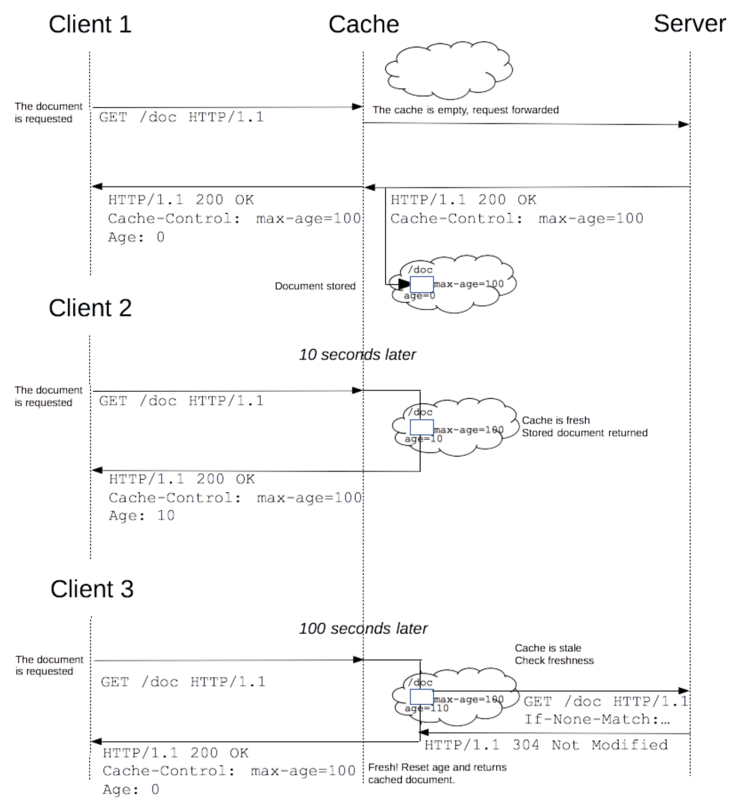

검증 방식은 크게 두 가지이다. 먼저, 검증하고자 하는 HTTP 응답에 ETag 헤더가 존재한다면 **ETag 헤더의 값을 If-None-Match 헤더에 포함**시켜서 서버에게 검증 요청을 보낸다. 다음으로, ETag 헤더가 존재하지 않는다면 Last-Modified 헤더를 활용한다. 즉, **Last-Modified 헤더의 값을 If-Modified-Since 헤더에 포함**시켜서 서버에게 검증 요청을 보낸다.

 

이제 서버는 전달받은 ETag 값 혹은 Last-Modified 값을 이용하여 자원의 유효성을 검증한다. 만약 **여전히 해당 자원이 유효하다면 서버는 Body가 없는 가벼운 304 (Not Modified) 응답을 반환**하고, **더 이상 유효하지 않다면 새로운 자원의 내용을 Body에 담아서 200 응답을 반환**한다. 전자의 경우에는 기존에 캐싱되어 있던 자원을 다시 사용하게 하는 것이므로 나이(Age)를 0으로 초기화시키게 되고, 필요한 경우에는 만료 시각을 갱신해줄 수도 있다. 지금까지 설명한 두 가지의 검증 방식을 그림으로 나타내면 다음과 같다.

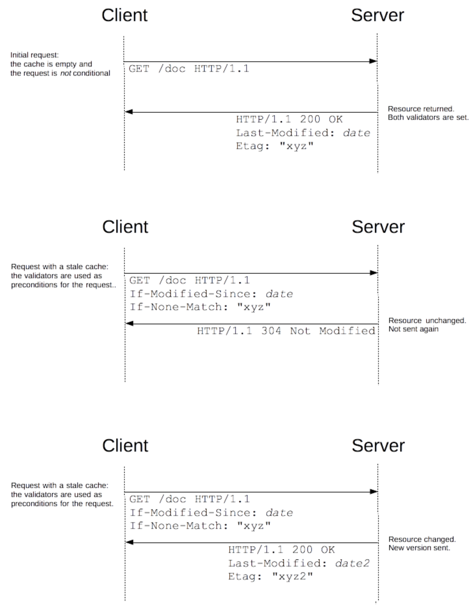

https://developer.mozilla.org/en-US/docs/Web/HTTP/Caching

**CDN을 구성하는 공유 캐시 서버가 여러 지역에 분산되어 있으며, 그렇게 분산되어 있는 공유 캐시 서버들이 자원을 가져오는 실제 서버는 따로 있다**는 점이다(위 그림 참고). 이것이 중요한 이유는, 자원을 요청하는 사용자의 위치에 따라 더 가까운 공유 캐시 서버로부터 자원을 가져올 수 있게 하기 때문이다. 이는 **GSLB(Global Server Load Balancing)**라고 하는 발전된 형태의 DNS 기술에 의해 가능한 것인데, 간단히 요약하자면 자원을 요청하는 사용자와 가장 가까운 공유 캐시 서버의 IP 주소를 알려주도록 DNS 서버가 구현되어 있다는 것이다.

## 캐시 신선도 검사

* https://developer.mozilla.org/en-US/docs/Web/HTTP/Headers/ETag

**ETag** HTTP 응답 헤더는 특정 버전의 리소스를 식별하는 식별자다. 웹 서버가 내용을 확인하고 변하지 않았으면, 웹 서버로 full 요청을 보내지 않기 때문에, 캐쉬가 더 효율적이게 되고, 대역폭도 아낄 수 있다.

**문법**

```
ETag: W/"<etag_value>"
ETag: "<etag_value>"
```


## CORS

* https://developer.mozilla.org/en-US/docs/Web/HTTP/CORS
* 영어문석 번역돌리는게 더 정확함

**교차 출처 리소스 공유**(Cross-Origin Resource Sharing, [CORS](https://developer.mozilla.org/ko/docs/Glossary/CORS))는 추가 [HTTP](https://developer.mozilla.org/ko/docs/Glossary/HTTP) 헤더를 사용하여, 한 [출처](https://developer.mozilla.org/ko/docs/Glossary/Origin)에서 실행 중인 웹 애플리케이션이 다른 출처의 선택한 자원에 접근할 수 있는 권한을 부여하도록 브라우저에 알려주는 체제입니다. 

CORS(Cross-Origin Resource Sharing) 문제는 웹 브라우저에서 같은 출처 정책(same-origin policy)을 위반할 때 발생합니다. 같은 출처 정책은 웹 보안에서 중요한 역할을 하는데, 이 정책에 의해 웹 애플리케이션은 자신과 다른 출처에서 오는 리소스를 기본적으로 제한하게 됩니다. CORS는 이 같은 제한을 풀어주는 메커니즘이며, 서버 측에서 헤더를 설정하여 해결할 수 있습니다.

다음은 CORS 문제를 해결하는 몇 가지 방법입니다:

1. **Access-Control-Allow-Origin 헤더 사용**: 서버 측에서 이 헤더를 사용하여 특정 도메인 혹은 모든 도메인('*')으로부터의 요청을 허용할 수 있습니다. 예를 들면, `Access-Control-Allow-Origin: *` 또는 `Access-Control-Allow-Origin: https://example.com`과 같이 설정할 수 있습니다.
2. **프록시 서버 사용**: 같은 도메인에서 API를 호출하도록 클라이언트 사이드에서 서버 사이드로 요청을 중계하는 프록시 서버를 설정할 수 있습니다.
3. **CORS 지원 미들웨어 사용**: Express.js와 같은 백엔드 프레임워크는 CORS를 쉽게 해결할 수 있는 미들웨어를 제공합니다. 예를 들어, Express.js의 경우 cors 라이브러리를 사용하여 CORS를 쉽게 설정할 수 있습니다.
4. **JSONP 사용**: JSONP(JSON with Padding)는 CORS 제한이 적용되지 않는 `<script>` 태그를 이용하는 방식입니다. JSONP는 웹 서버로부터 순수 JSON이 아닌 함수 호출을 포함하는 JavaScript 코드를 받습니다. 이 방법은 오직 GET 요청만 가능하다는 제한이 있습니다.

위 방법들은 일반적인 CORS 문제 해결 방법이지만, 보안 상의 이유로 정확한 출처 관리와 접근 제어가 필요한 경우에는 적절한 CORS 설정이 필요합니다. 이때는 적절한 `Access-Control-Allow-Origin`, `Access-Control-Allow-Methods`, `Access-Control-Allow-Headers` 등의 헤더 설정이 필요하며, 필요에 따라서는 사전 요청(Preflight request)을 처리하는 로직도 필요합니다.

* https://inpa.tistory.com/entry/WEB-%F0%9F%93%9A-CORS-%F0%9F%92%AF-%EC%A0%95%EB%A6%AC-%ED%95%B4%EA%B2%B0-%EB%B0%A9%EB%B2%95-%F0%9F%91%8F
* https://developer.mozilla.org/en-US/docs/Web/HTTP/CORS#preflighted_requests 이것도 보자 

> CORS는 브라우저에서만 발생한다 


# HTTPS

**HTTPS**(**H**yper**T**ext **T**ransfer **P**rotocol over **S**ecure Socket Layer) [HTTP](https://ko.wikipedia.org/wiki/HTTP)의 보안이 강화된 버전이다

HTTPS는 소켓 통신에서 일반 텍스트를 이용하는 대신에, [SSL](https://ko.wikipedia.org/wiki/SSL)이나 [TLS](https://ko.wikipedia.org/wiki/트랜스포트_레이어_보안) 프로토콜을 통해 [세션](https://en.wikipedia.org/wiki/Session_(computer_science)) 데이터를 암호화한다. 따라서 데이터의 적절한 보호를 보장한다. HTTPS의 기본 [TCP/IP](https://ko.wikipedia.org/wiki/TCP/IP) 포트는 443이다.

* https://inpa.tistory.com/entry/TOMCAT-%E2%9A%99%EF%B8%8F-SSL-%EC%84%A4%EC%A0%95-https

* ssl이란 ? -> https://www.cloudflare.com/ko-kr/learning/ssl/what-is-ssl/
* tls란? -> https://www.cloudflare.com/ko-kr/learning/ssl/transport-layer-security-tls/

## HTTPS 프로토콜은 어떻게 작동하나요?

HTTP는 암호화되지 않은 데이터를 전송합니다. 즉, 브라우저에서 전송된 정보를 제3자가 가로채고 읽을 수 있습니다. 이는 이상적인 프로세스가 아니었기 때문에, 통신에 또 다른 보안 계층을 추가하기 위해 HTTPS로 확장되었습니다. HTTPS는 HTTP 요청 및 응답을 SSL 및 TLS 기술에 결합합니다.

HTTPS 웹 사이트는 독립된 인증 기관(CA)에서 SSL/TLS 인증서를 획득해야 합니다. 이러한 웹 사이트는 신뢰를 구축하기 위해 데이터를 교환하기 전에 브라우저와 인증서를 공유합니다. SSL 인증서는 암호화 정보도 포함하므로 서버와 웹 브라우저는 암호화된 데이터나 스크램블된 데이터를 교환할 수 있습니다. 프로세스는 다음과 같이 작동합니다.

1. 사용자 브라우저의 주소 표시줄에 *https://* URL 형식을 입력하여 HTTPS 웹 사이트를 방문합니다.
2. 브라우저는 서버의 SSL 인증서를 요청하여 사이트의 신뢰성을 검증하려고 시도합니다.
3. 서버는 퍼블릭 키가 포함된 SSL 인증서를 회신으로 전송합니다.
4. 웹 사이트의 SSL 인증서는 서버 아이덴티티를 증명합니다. 브라우저에서 인증되면, 브라우저가 퍼블릭 키를 사용하여 비밀 세션 키가 포함된 메시지를 암호화하고 전송합니다.
5. 웹 서버는 프라이빗 키를 사용하여 메시지를 해독하고 세션 키를 검색합니다. 그런 다음, 세션 키를 암호화하고 브라우저에 승인 메시지를 전송합니다.
6. 이제 브라우저와 웹 서버 모두 동일한 세션 키를 사용하여 메시지를 안전하게 교환하도록 전환합니다.

> https://aws.amazon.com/ko/compare/the-difference-between-https-and-http/

### TLS/SSL Handshake

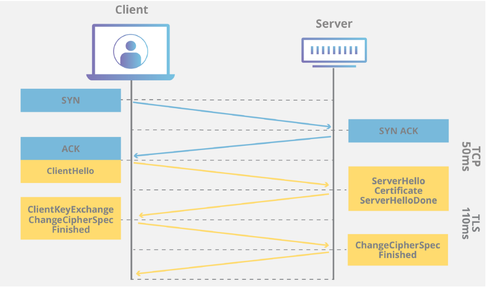

앞서 클라이언트가 서버에 접속하면 서버는 클라이언트에게 SSL 인증서 정보를 전달하고, 해당 인증서가 확인이 된 이후에 내부에 존재하는 공개키를 활용해 "세션키" 라는 것을 생성하고 이를 활용해 통신을 시작한다고 했습니다. 이렇게 SSL 프로토콜을 활용해 통신을 수립하는 과정을 **SSL/TLS Handshake**라고 합니다.

 

+) SSL/TLS Handshake의 정확한 단계는 사용되는 키 교환 알고리즘의 유형과 양측에서 지원한는 암호 제품군 유형에 따라 다릅니다. 하지만 대부분 RSA 키 교환 알고리즘을 사용하므로, 그를 기준으로 살펴보겠습니다!


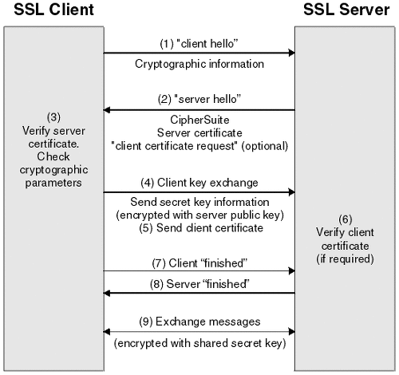


1. **"client hello"** : 클라이언트가 서버로 hello 메세지를 전송하면서 핸드셰이크를 시작합니다. 이 메세지에는 클라이언트가 지원하는 TLS(SSL) 버전, 지원되는 암호 제품군, 그리고 "client random"이라고 하는 무작위 바이트 문자열이 포함됩니다.
2. **"server hello" :** 클라이언트 hello 메시지에 대한 응답으로 서버가 서버의 SSL 인증서, 서버에서 선택한 암호 제품군, 그리고 서버에서 생성한 또 다른 무작위 바이트 문자열인 "server random"를 포함하는 메시지를 전송합니다.
3. **Verify server certificate** : 클라이언트가 서버의 SSL 인증서를 인증서 발행 기관(CA)을 통해 검증합니다. 이를 통해 서버가 인증서에 명시된 서버인지, 클라이언트가 상호작용 중인 서버가 실제 해당 도메인의 소유자인지를 확인합니다.
4. **Client key exchange** : 확인이 완료되면 클라이언트는 "The premaster secret"라고 하는 무작위 바이트 문자열을 공개 키로 암호화하여 전송합니다. (클라이언트는 서버의 SSL 인증서에서 공개 키를 받습니다.)
5. **Send client certificate** : 만약 서버가 클라이언트의 인증서를 요구한다면 서버의 인증서와 같은 방식으로 암호화를 진행하여 함께 전송합니다.
6. **Verify client certificate** : 서버가 클라이언트로부터 받은 The premaster secret을 개인키를 통해 해독합니다.
7. **Client "finished"** : 클라이언트가 "client random", "server random", "The premaster secret"를 이용해 대칭키로 활용할 "세션 키"를 생성합니다. 클라이언트가 세션 키로 암호화된 "finished" 메시지를 전송합니다.
8. **Server \**"finished"\**** : 서버가 "client random", "server random", "The premaster secret"를 이용해 대칭키로 활용할 "세션 키"를 생성합니다. 서버가 세션 키로 암호화된 "finished" 메시지를 전송합니다.
9. **Exchange messages** : 핸드셰이크가 완료되고, 세션 키를 이용해 메세지를 주고 받습니다.

### HTTPS의 사용

이제 모든 과정에 대해 이해를 마쳤으니, 서버와 클라이언트가 어떻게 HTTPS를 사용하게 되는지 정리해봅시다.

1. A라는 서버를 만드는 기업이 HTTPS를 적용하기 위해 공개키와 개인키를 만듭니다.
2. 신뢰할 수 있는 CA 기업에 공개키 관리를 부탁하며 계약을 맺습니다.
3. 계약이 완료된 CA 기업은 A 서버의 공개키, 해당 기업의 이름, 공개키 암호화 방법을 담은 인증서를 만들고 해당 인증서를 CA 기업의 개인키로 암호화해서 A 서버에게 제공합니다.
4. A 서버는 직접적인 공개키가 아닌 암호화된 인증서를 보유하게 되었습니다.
5. 클라이언트가 통신 요청을 보내면 앞선 SSL/TLS Handshake 과정을 수행하여 연결을 수립합니다.
6. 클라이언트와 A 서버와 통신을 시작합니다.

### HTTPS의 장단점

- HTTPS는 웹사이트의 무결성을 보호해준다. 웹 사이트와 사용자 브라우저 사이의 통신을 침입자가 건드리지 못하도록 한다. (침입자라함은, 악의가 있는 공격자는 물론이고, 합법이지만 통신에 침입하여 페이지에 광고를 삽입하는 경우도 해당한다.)
- 가벼운 웹 서핑이라면 HTTP도 상관없지만, 사용자의 정보를 웹 서버와 주고 받아야하는 경우라면 HTTP는 정보 유출의 위험성을 갖게 된다. HTTPS는 침입자가 웹사이트와 사용자 사이의 통신을 몰래 수신하는 것을 방지함으로써 보안을 강화해준다.
- `getUserMedia()`를 통한 사진 촬영이나 오디오 녹음, 프로그레시브 웹 앱과 같은 강력한 웹 플랫폼 신기능들은 실행하려면 사용자의 명시적인 권한 허락을 필요로 한다. [지오로케이션](https://developer.mozilla.org/en-US/docs/Web/API/Geolocation/Using_geolocation) API와 같은 오래된 API들도 실행할 때 권한이 필요하도록 업데이트되고 있는데, HTTPS는 이러한 새 기능과 업데이트된 API에 대한 권한 허락을 가능하게 한다.
- 네이버, 다음은 물론이고 구글 역시 검색 엔진 최적화(SEO: Search Engine Optimization) 관련 내용을 HTTPS 웹사이트에 대해서 적용하고 있다. 즉, 키워드 검색 시 상위 노출되는 기준 중 하나가 보안 요소이다.
- 모든 사이트에서 텍스트를 암호화해서 주고 받으면 과부하가 걸려 속도가 느려질 수 있다. 중요한 사이트는 HTTPS로 관리하고, 그렇지 않은 사이트는 HTTP를 사용한다.
- HTTPS를 지원한다고 해서 무조건 안전한 것은 아니다. 신뢰할 수 있는 CA 기업이 아니라 자체적으로 인증서를 발급할 수도 있고, 신뢰할 수 없는 CA 기업을 통해서 인증서를 발급받을 수도 있기 때문이다.


## HTTP/2, HTTP/3

HTTP /11은 Tert 기반. 3way!handshake 비효율. Pipelinins 실패(HOL 블로킹), 여러 커넥션 제한


HTTP/2  하나의 커넥션, 여러 스트림(우선순위) (SPDY)

* 헤더 압축, 서버 푸시 -> 서비에서 코딩해줘야함 
* HTTPS 필수 (엄밀히는 아니나 없이 사용 불가)

* 바이너리 (한 눈이 보기 어려울), 프레임

HTTP/3

* TCP의 비료율성을 UDP로 극복 (ex 패킷 손실 시 성능 저하)

* QUIC (tls 1.3 )

* 동영상 서비스에서 속도가 빠를

* ORTT (보안위협 준재)


* https://woojinger.tistory.com/85
* https://jjam89.tistory.com/m/148

## **HTTP3 소개**

HTTP/3는 인터넷 통신 프로토콜인 HTTP의 최신 버전으로, 이전 버전인 HTTP/2의 후속 버전입니다.

**HTTP/3의 목표**는 **웹 통신의 성능과 보안을 향상시키는 것**입니다.

이전 버전과의 주요 차이점은 **UDP를 사용하여 데이터를 전송한다는 점**입니다.

------

### **QUIC: UDP 기반 전송 프로토콜**

QUIC(Quick UDP Internet Connections)은 **HTTP/3에서 사용되는 전송 프로토콜**입니다.

QUIC은 UDP를 기반으로 데이터를 전송하며, 패킷 손실이나 지연 발생 시 재전송을 통해 성능을 향상시킵니다.

UDP의 경량성과 빠른 연결 설정 과정으로 인해 HTTP/3는 TCP에 비해 더 낮은 지연 시간을 가집니다.

 

### **멀티플렉싱 및 스트리밍 기능**

HTTP/3는 멀티플렉싱을 지원하여 여러 개의 스트림을 병렬로 전송할 수 있습니다.

이를 통해 웹 페이지 로딩 속도를 향상시키고, 사용자 경험을 개선할 수 있습니다.

또한, HTTP/3는 스트리밍 기능을 제공하여 실시간 데이터 전송에 특화되어 있습니다.

 

### **보안성 강화: QUIC의 보안 기능**

QUIC은 초기 연결 단계에서 인증과 암호화를 처리하여 보안 연결을 빠르게 설정할 수 있습니다.

중간자 공격 및 데이터 조작 등에 대한 보호를 제공하여 보안성을 강화합니다.

또한, QUIC은 기존의 TLS 프로토콜 대신 자체적인 보안 기능을 사용하여 보안성을 강조합니다.

 

### **HTTP/3의 잠재적인 영향**

HTTP/3의 성능과 보안 면에서 이전 버전과 비교하여 어떤 이점이 있는지 살펴봅니다.

#### **성능 향상:**

* 낮은 지연 시간: HTTP/3는 UDP 기반의 전송 프로토콜인 QUIC를 사용하여 연결 설정과 데이터 전송을 더 빠르게 처리합니다. UDP의 경량성과 빠른 연결 설정 과정으로 인해 HTTP/3는 TCP에 비해 더 낮은 지연 시간을 가집니다.

 

* 멀티플렉싱: HTTP/3에서는 멀티플렉싱을 지원하여 여러 개의 스트림을 병렬로 전송할 수 있습니다. 이를 통해 웹 페이지 로딩 속도를 향상시키고, 사용자 경험을 개선할 수 있습니다.

 

* 스트리밍 기능: HTTP/3는 스트리밍 기능을 제공하여 실시간 데이터 전송에 특화되어 있습니다. 이를 통해 실시간 영상 스트리밍, 대화형 웹 애플리케이션 등에서 더 나은 성능을 제공할 수 있습니다.

 **보안성 강화:**

* 빠른 보안 연결 설정: QUIC은 초기 연결 단계에서 인증과 암호화를 처리하여 보안 연결을 빠르게 설정할 수 있습니다. 이를 통해 보안 연결의 설정 시간이 단축되어 사용자 경험을 향상시킵니다.


* 중간자 공격 방지: QUIC은 중간자 공격과 데이터 조작 등에 대한 보호를 제공합니다. 중간에서 HTTP/3 트래픽을 모니터링하거나 수정하는 것이 어렵기 때문에 보안성이 강화됩니다.


* TLS 대체 기능: QUIC은 기존의 TLS 프로토콜 대신 자체적인 보안 기능을 사용하여 보안성을 강조합니다.

### HTTP 3 의 이점

### **패킷 손실 및 복구**

QUIC은 패킷 손실이 발생한 경우 재전송을 통해 데이터의 신뢰성을 보장합니다. TCP와 달리 QUIC는 패킷 손실을 감지하고 빠르게 재전송하여 데이터 손실을 최소화합니다. 이는 웹 페이지 로딩 시간을 단축하고, 대역폭의 효율성을 높이는 데 도움을 줍니다.

### **네트워크 혼잡 제어**

HTTP/3는 혼잡한 네트워크 환경에서도 성능을 유지하는 데 도움이 됩니다. QUIC는 혼잡 제어 알고리즘을 내장하고 있어 네트워크 혼잡을 감지하고 데이터 전송 속도를 조절합니다. 이로써 네트워크 혼잡에 의한 성능 저하를 최소화하고 안정적인 웹 통신을 유지할 수 있습니다.

###  **연결 유지 및 이동성**

QUIC는 연결 상태를 유지하는 기능을 제공합니다. 이는 모바일 장치의 이동성이나 네트워크 전환 상황에서도 빠른 연결 유지와 대기 시간 감소를 가능하게 합니다. 따라서 사용자는 네트워크 전환 등으로 인한 연결 중단 없이 웹 서비스를 계속 이용할 수 있습니다.

### HTTP 3 의 단점

### **채택 및 호환성 문제**

현재 HTTP/3의 채택 상황은 진행 중이며, 모든 웹 서비스와 브라우저에서 지원되지 않을 수 있습니다. 일부 네트워크 환경이나 장치에서는 호환성 문제가 발생할 수 있습니다.

### **네트워크 인프라 구조 변경 요구**

HTTP/3는 UDP 기반으로 동작하므로, 기존의 TCP 기반 인프라에서는 적절한 변환과 업데이트가 필요합니다. 이로 인해 네트워크 관리 및 관련 인프라 업데이트에 일부 비용과 노력이 필요할 수 있습니다.

### **성능 이슈**

UDP는 신뢰성이 낮은 프로토콜로 알려져 있습니다. 패킷 손실이나 지연이 발생할 경우, 재전송을 통해 문제를 해결하려 하지만, 이로 인해 성능 저하가 발생할 수 있습니다.

### **중간자 관리의 어려움**

QUIC은 초기 연결 단계에서 인증과 암호화를 처리하기 때문에 중간자 관리가 복잡해집니다. 중간에서 HTTP/3 트래픽을 모니터링하거나 수정하는 것이 어려울 수 있습니다.

### **실험적인 상태**

HTTP/3는 아직 실험적인 상태이며, 표준으로 최종화되지 않았습니다. 따라서 몇 가지 사양 변경이나 업데이트가 계속해서 이루어질 수 있습니다


# 웹소켓

**웹소켓**(WebSocket)은 하나의 [TCP](https://ko.wikipedia.org/wiki/전송_제어_프로토콜) 접속에 [전이중 통신](https://ko.wikipedia.org/wiki/이중통신) 채널을 제공하는 컴퓨터 [통신 프로토콜](https://ko.wikipedia.org/wiki/통신_프로토콜)이다. 웹소켓 프로토콜은 2011년 [IETF](https://ko.wikipedia.org/wiki/국제_인터넷_표준화_기구)에 의해 [RFC](https://ko.wikipedia.org/wiki/RFC) 6455로 표준화되었으며 [웹 IDL](https://ko.wikipedia.org/w/index.php?title=웹_IDL&action=edit&redlink=1)의 웹소켓 [API](https://ko.wikipedia.org/wiki/API)는 [W3C](https://ko.wikipedia.org/wiki/W3C)에 의해 표준화되고 있다.

웹소켓은 HTTP와 구별된다. 두 프로토콜 모두 [OSI 모델](https://ko.wikipedia.org/wiki/OSI_모델)의 제7계층에 위치해 있으며 제4계층의 TCP에 의존한다. 이들에 차이가 있으나 "[RFC 6455](https://tools.ietf.org/html/rfc6455)"에 따르면 웹소켓은 HTTP 포트 80과 443 위에 동작하도록 설계되었으며 HTTP 프록시 및 중간 층을 지원하도록 설계되었으므로 HTTP 프로토콜과 호환이 된다. 호환을 달성하기 위해 웹소켓 [핸드셰이크](https://ko.wikipedia.org/wiki/핸드셰이크)는 [HTTP 업그레이드 헤더](https://ko.wikipedia.org/w/index.php?title=HTTP/1.1_업그레이드_헤더&action=edit&redlink=1)를 사용하여[[1\]](https://ko.wikipedia.org/wiki/웹소켓#cite_note-1) HTTP 프로토콜에서 웹소켓 프로토콜로 변경한다.


* https://choseongho93.tistory.com/266
* https://xephysis.tistory.com/42

* https://velog.io/@codingbotpark/Web-Socket-%EC%9D%B4%EB%9E%80

* https://doozi0316.tistory.com/entry/WebSocket%EC%9D%B4%EB%9E%80-%EA%B0%9C%EB%85%90%EA%B3%BC-%EB%8F%99%EC%9E%91-%EA%B3%BC%EC%A0%95-socketio-Polling-Streaming

* https://inpa.tistory.com/entry/WEB-%F0%9F%8C%90-%EC%9B%B9-%EC%86%8C%EC%BC%93-Socket-%EC%97%AD%EC%82%AC%EB%B6%80%ED%84%B0-%EC%A0%95%EB%A6%AC#%EC%9B%B9_%EC%86%8C%EC%BC%93_%EC%9D%B4%EB%9E%80?

* https://spring.io/guides/gs/messaging-stomp-websocket/

* https://www.baeldung.com/websockets-spring

* https://tecoble.techcourse.co.kr/post/2020-09-20-websocket/
* * https://tech.kakao.com/2020/06/15/websocket-part2/

spring-boot-starter-websocket!

stomp! 