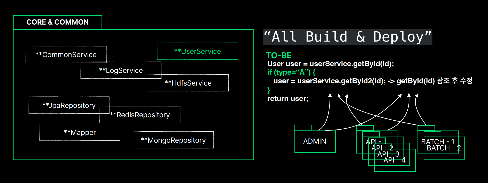
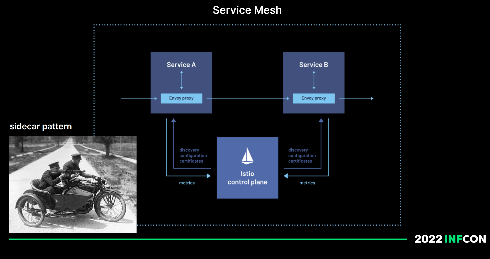

# 인프콘 2022 멀티모듈 프로젝트

[toc]

목차

1. “WHY" 멀티 모듈 프로젝트 구조가 중요할까요?

2. WHAT 을 기준으로 밀티 모두 프로젝트 구조를 나누어야 할까요?

3. HOW 실전 멀티 모든 프로젝트 구현을 해야 할까요?

# “WHY" 멀티 모듈 프로젝트 구조가 중요할까요?

멀티모듈프로젝트

* 아키텍처(멀티모듈프로젝트 ) 는 프로젝트 초기에 이루어져야 하는 일련의 설계 결정이다 

멀티모듈프로젝트

* 아키텍처(멀티모듈프로젝트)는 요소의 구조(structure)와 그 관계(relationship)에 관한 것 

아키텍처는 나중에 변경하기 어렵다.

시스템이 커져갈수록 빌드와 배포 프로세스 가 복잡해지며, 복잡도를 줄이려고 변경하기 어렵다.

해가 지날수록 기능이 많아지면 멀티모듈 프로젝트는 우측처럼 Core 모듈과 Common 모듈이 무거워진다.

중복을 제거하기 위해 Core와 Common이라는 모듈에 공통적인 기능들을 추가하여 뭉치는건 바보일수도 있다.

`정말 모든곳에서 다 Core,와 Common이 필요한가? 정말 Core, Common인가?`

현장에서 경험했던 4가지 문제점 실사례. 

## 1. Data Access 모듈 - Core와 Common 모듈의 Too Many Connections 문제

서비스가 확장되고 트래픽이 늘어나면서 서버수를 늘리면 커넥션풀을 할당받기때문에 발생할 수 있는 문제. 

## 2. NoClassDefFoundError 문제

특정한 모델이 높은버전 라이브러리를 참조하는 경우 전체적인 프로젝트 업그레이드가 힘들다

## 3. Copy & Paste 문제

## 4. All Build & Deploy 되는 문제

수정하고 배포하려면 전체 빌드가 되야하고 다시 배포가 된다면 너무 오래걸려서 생산성에 영향을 미친다.

이렇게 멀티모듈 프로젝트를 제대로 설계하고 나누지 않으면 위와같은 문제들이 발생한다.

# WHAT 을 기준으로 멀티 모듈 프로젝트 구조를 나누어야 할까요?

Core, Common에 있떤 데이터 접근 관련 구현을, 데이터 스토어 적용 기준으로 추가적인 데이터 기반의 모듈로 구성하는게 좋지 않을까?

근데. 그림을 보면 서비스 도메인 기반의 구조가 아니라, 기술 베이스 지향적인 모델이다.(Redis, Jpa, MongoDB)

조금더 고민해보자 

현재 발표자의 뮤직서비스의 도메인들을 추가해본다.

* Artist라는 도메인 기준으로, 하위로 앨범, 트랙, 비디오가 존재한다.
* 트랙 하위로는 가사(Lyric), 재생(Playback) 관련 도메인이 존재한다 

우선 Meta라는 모듈을 이름을 지어보자 

이 Meta 모듈은 뮤직 서비스에 기반이 되는 공통 도메인이다. 

아마 모든 모듈들이 필요 하다.

* 트랙은 MySQL에 적재하고
* Lyric은 MongoDB를 써야한다면?

어떻게 위치 시키고 구현을 해야 할까? 

> `기술 베이스 지향으로 멀티모듈 구조가 만들어지면 이런 문제가 발생할 수 있다.`

그리고 점점 유관부서와 다른 모듈들, 그리고 업체들의 모듈들이 필요해지면 비대해진다.

* 오른쪽 보면 시스템 관련 모듈들도 추가되어버렸다 (Aws, SpringConfig, Discovery)

도대체 어떻게 해야할까?

문제의 근원. Core, common을 삭제하고 시작해버리자

코드 중복을 어느정도 허용하자.

코드가 일부 중복되는것보다, Core와 Common이 잠재적으로 위험성을 더 크게 가지고 있을 수 있다.

## DDD의 Bounded Context - 경계 나누기를 쓰면 어떨까?

특정한 Context 문맥 하에서 완전한 의미를 갖는 경계의 기준을 잘 나누는게 멀티모듈 프로젝트 구조에서도 중요하다.

* 서버 모듈 - 코드의 변화가 제일 잦게 일어남 
* 데이터 모듈 : 서버 모듈과 민접하고, 도메인 영역으로 데이터 스토어를 직접 핸들링한다
* 인프라 모듈 : 유관 부서 및 업체 연동을 위한 모듈. 버전업이 되면 코드에 큰 변화가 일어나는 그룹
* 클라우드 시스템 모듈 : 컨테이너 환경과 트래픽 제어를 위한 시스템 관련 그룹 

각자 고유한 성격, 특성, 사이클을 갖고 있고 그 기준으로 나누면 어떨까? 

# HOW 실전 멀티 모듈 프로젝트 구현을 해야 될까요?

* 4개의 멀티 그룹을 나눈다

근데, 이렇게 되면 빌드 시간이 늘어난다 

* 먼저 변화가 가장 잦은 부트(서버)와 데이터를 묶어 특성이 갖기때문에 유지한다
* 클라우드 시스템 멀티 그룹을 별도의 두개의 저장소로 분리한다. 
  * 하나는 시스템 적
  * 하나는 웹훅 이벤트를 필요로 하는 리모트 컨피그 서버
* 마지막으로 인프라 멀티 그룹을 인프라 라이브러리라는 다른 저장소로 분리한다

## 서버와 도메인(Data) 관계 구현

서버에서 도메인을 의존할때, 서비스 레이어 구현은 어느 모듈에 있어야 할까? 

양쪽에다 구현해야 한다. 

서비스 구현체는 프로젝트 별로 역할에 맞도록 각자 각각 구현될 수 있다.

상호간의 규칙이 하나 있어야 한다.

* 서버에서 도메인쪽으로 보낼때, HttpServletRequest와 같은 웹 서버에 의존적인 객체를 보내서는 안된다.

* 역할과 책임, 협력의 입장에서 생각하자
* 도메인 모듈은 웹, 배치, 원타임 등 모든 애플리케이션에서 사용될 수 있다.

## 클라우드와 Boot(Server) 모듈 관계 구현

 

만약 DisCovery 제품의 버전업이 발생하게 되면 모든 서버 프로젝트가 의존성을 함게 갖기 때문에 서버가 모두 다시 빌드된 후 배포되어야 한다. 

웹 애플리케이션 버전이 바뀌지 않았는데 다시 배포해야 하는가? 

Istio라는 제품이 있다.

쿠버네티스 기반의 서비스 매시 플랫폼 

* **애플리케이션 네트워크 기능을 유연하고 쉽게 자동화할 수 있는 투명한 언어 독립적 방법을 제공하는 현대화된 서비스 네트워킹 레이어인 서비스 메시**

# 정리

"왜" 멀티 모듈 프로젝트 구조가 중요할까요?

- 잘못 구성되면 나중에 변경하기 고통스럽다.
- 프로젝트 초기에 이루어져야 하는 일련의 설계 과정이다.
- 개발 생산성에 막대한 영향을 미친다.
- 서비스 장애와 밀접한 연관이 있다.

"무엇"을 기준으로 멀티 모듈 프로젝트 구조를 나뉘어야 할까요?

- 경계안에서 의미를 갖을 수 있는 그룹을 정의하는(나누는) 것이 가장 중요하다. (Bounded Context)
- 역할, 책임, 협력 관계가 올바른지 다시 한번 생각한다.
- BOOT (Server), INFRA, DATA(Domain), SYSTEM(Cloud)

"어떻게" 실전 멀티 모듈 프로젝트 구현을 해야 할까요?

- 프로젝트가 커지고 있다면 다시 경계를 나누고 그 기준으로 소스 저장소를 분리한다.
- INFRA(외부) 라이브러리에는 DATA 관련 구현을 지향한다. (Anticoruption Layer)
- 서비스 구현은 각자 역할에 맞게 각각구현될 수 있다. (공통으로 한쪽에 구현하지 않는다.)
- 시스템 레벨 구현이 실제 서비스 애플리케이션과 밀접하게 연관되지 않도록 격리하거나 전환(Istio)한다.