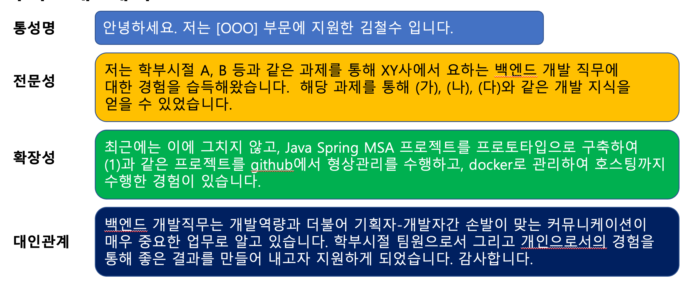
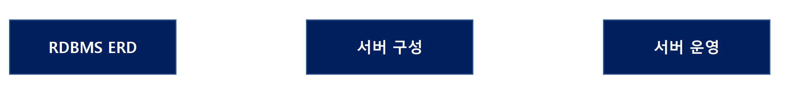
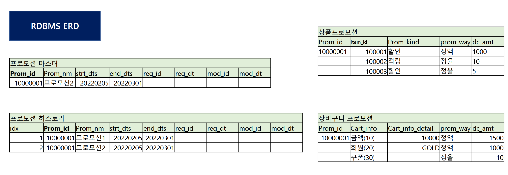
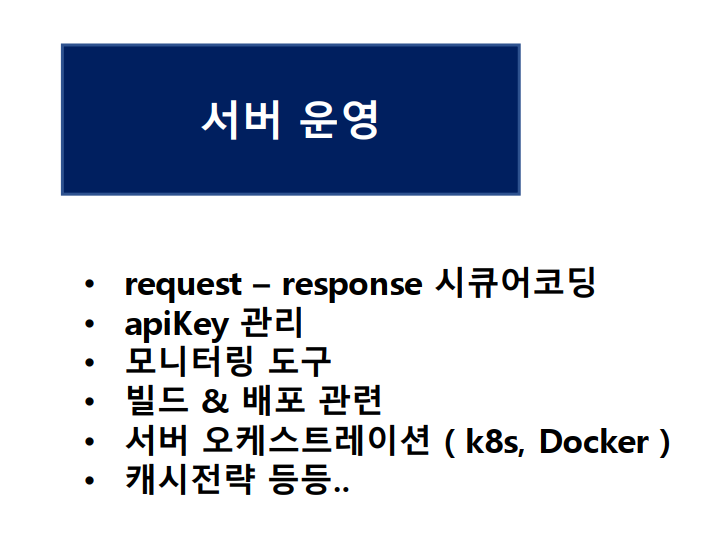

# 웹 개발 직무

* 무엇을 준비해야하나? 

* 어떻게 준비해야하나? 

* 하지 말아야 할 것들은 무엇인가? 

## 웹 서비스 개발 직무란 무엇인가?

front-end : 웹사이트에 접근했을때 보이는 웹 페이지의 개발

back-end : 웹사이트 보이지않는곳에서 보이는곳의 이벤트를 처리하는것을 개발

## 백엔드 직무 설명

이벤트 발생시 처리 

프론트와 데이터베이스 양단에서 발생한 이벤트를 처리함.

* 유효성 검증

국내 웹 개발사의 백엔드 언어는 자바가 표준이다.

전자정부 표준이라는 웹개발 표준 때문에 공기업에서는 모두 자바-스프링을 사용한다.

## **이력서** **&** **자기소개서는 나 자신의** **Sales** 과정이다

직무에서 일관된 

1. 개발 역량 : 개발역량이 프로인것을 바라진 않지만 일관되게 해당 직무에 맞게 일관된 관심과 경험을 보유했는지가 중요하다. 보유했다면 알고있는 지식을 기반으로 자소서 이력서 면접에서 물어볼것이다. 
2. 태도 : 웃거나 머리를 긁적이는 태도는 절대 보이면 안된다. 같이 일하기 힘들것 같은 인상은 뽑지 않는다.
3. 대인관계(팀워크) : 태도는 대인관계나 팀웤까지 이어진다.

이 세가지를 지속적으로 어필해야 한다. 

# 개발자의 이력서, 자기소개서

- Github 관리 및 어필

- 티스토리 혹은 기술블로그 운영

- 최신기술에 대한 관심 ( 본인이 알고 있는 최근 기술이 무엇이 있느냐? )

# 코딩테스트 준비 사이트 

1. 해커랭크

https://www.hackerrank.com/

2. 프로그래머스 

https://programmers.co.kr/

3. 백준

탐색, 정렬, 프로그램만들기, 수학(2진수, 순열과 조합, 평균값 계산, 속도), SQL

# 면접

## 자기소개

* 나 자신을 강력하게 어필할 수단 

* 기술적인 자신감과 강점을 어필 

* 대인관계에 대한 강점 

* 최종적으로 지원하는 회사의 지원직무에서 팀원들과 좋은 성과를 “함께” 낼 수 있을 것이라 생각하고 지원하게 되었다.

전문성(개발 분야에 대한 지식)

협력 (팀워크, 대인관계)

성장 가능성 (지원 분야에 대한 열정과 관심)

### 자기소개 예시

## 백엔드 1. 공통 기술 질문 리스트

* Spring AOP 란 무엇인가 ?
  * 개념에 대해 아는 대로 설명 
  * joinpoint와 pointcut 
  *  aspect 어노테이션에 대해 아는 것과 어느 시점에 사용해야 하는지? 

* Spring DI 란 무엇인가?

* MVC 패턴에 대해 알고 있는가? 

* Restful API 관련 알고 있는 지식이 있는지? 
   \- GET, POST, PUT, DELETE 

* Docker 관련 지식 

* AWS

* 뮤터블 이뮤터블 변수의 차이

* Out of memory 

* 가비지 컬렉팅 

* JVM의 heap과 stack의 차이 / 해당 영역에 쌓이는 데이터의 종류 

* 동시에 만명이 결제한다면 분산을 어떻게 할것인지? 

* docker image
  * 만드는데 어떤 어려움이 있었는지? 
  * 도커에 대해 아는대로 얘기해보시겠어요? 
  * 도커 컨테이너 몇개로 운영해서 사용하셨었는지, 쿠버네티스 사용경험에 대한 질문 

* [www.naver.com](http://www.naver.com/) 에 들어올때까지의 프로세스를 설명 가능한지? 

* 프로젝트 간 DB는 무엇을 DB를 사용했는지 왜 사용했는지? DB서버는 어떤걸 사용하였는지 AWS나 GCP ? 

* URI(상위, 논리적/물리적 리소스를 식별하는 고유한 문자열 시퀀스)와 URL(하위, 웹주소)의 차이점이 뭔지 
* 기본) AES256과 SHA256 방식의 차이점을 아는대로 설명
* 중급) AES256의 대칭 키 관리를 어떻게 하면 좋을지 

*  JWT 보안토큰 만든 이력이 있는 신입 개발자 질문 

* 기본) JWT 인증을 하는 이유 

* 중급) JWT의 토큰 구성에 대해 아는대로 이야기? 

* 중급) 헤더에 SHA256 알고리즘을 사용하는데 SHA256에 대해 아는대로 설명. AES256과의 차이점은 어떤게 있는지? 

* 우리 사이트의 문제점은 어떤게 있는지 생각해본적 있으신가요? 

*  본인이 생각하는 개발자의 가장 중요한 덕목이 무엇이라 생각하시나요? 

* 깃헙 같은 오픈소스 사용해서 진행중인 프로젝트가 별도로 있으신지? 있다면 간단하게 어떻게 구축되 있는지 설명 

* 본인이 지원하신 직무에 대해 간략히 설명이 가능할까요?

## 공통 질문 대응 및 기타 노하우

1. 정말 대답하기 어려운 질문을 받았을 때 : 최대한 대답을 짜내고, 만족스럽지 못했을 경무는 솔직하게 다음번에는 꼭 알수있도록 준비하겠다고 말하는게 좋습니다.신입사원에게 백점짜리 답안을 요구하는 것은 아닙니다. 하지만 모르는 것에 대해 소극적인 태도보다는 적극적인게 점수 를 얻을 수 있습니다.

2. 개발과정에서 기획자와의 의견충돌이 있을 떄 어떻게 할 것인지에 대한 질문 :  회사 업무라는 것은 혼자가 아닌 함께 해나가는 업무이기 때문에 내가 무조건 옳다고 생각하지 않고 의사소통을 하겠다.

   논리적인 방식으로 건전한 토론을 통해 상호 의견을 맞춰나가는 방식으로 하면 될 것이라고 생각한다.

3. 마지막으로 하고싶은말 : 면접의 중요도 여하와 관계없이 가장 마지막에 하는 말인 만큼 의미있고 좋은 인상을 줄 수 있는 얘기를 준비한다면 좋을 것 같습니다. 미미로 마무 준비만하는 사람이 많이 있었습니다. 입사에 대한 의지도 앞으로 나가지 않고 계속 열심히 해주 겠구나 라는 어딜이 될 수 있는 요인인 만큼 꼭 준비해 가시길 빕니다.

# 데이터베이스 기출문제 면접

10분 정도의 시간을 제공하고, 상세한 스펙을 말해준뒤 프로모션 서버를 구축해보라고 문제를 냄

## RDBS ERD

* 프로모션이 언제시작했고 언제 끝났는지를 알기 위해 이력관리용 히스토리 테이블이 필요하다.
* 프로모션에 대한 정책 테이블 : 상품 프로모션, 장바구니 프로모션

## 서버 구성

## 서버 운영

Clustered Index와 NonClustered Index 차이점에 대해 설명하세요.
DB의 정규화 비정규화 역정규화에 대해서 설명해보세요. (Always)
DB의 읽기수준에 대해 아는대로 이야기
동시성 제어에 관해 설명 (3년차)

# 네트워크 관련 질문

* 사이트 접속 프로세스

- ip address / mac address tO
- tcp/ip 에 대해 아는대로 설명해보세요.
- Handshaking이 client/server 간 일어나는 과정을 설명해보세요.
- Keep alive 에 대해 아는대로 설명해보세요.

### www.naver.com에 들어오기 까지의 과정을 모두 설명해보시오

1) URL 입력 -> DNS서버에서 ip address 받아옴
2) 목적지의 MAC주소 확인
3) 소켓 오픈 (3handshake)
4) TLS handshake
5) http 프로토콜 작동
6) 웹 브라우저가 리소스(HTML, CSS, JS)를 브라우저 제공 및 표시

### Keep alive

Handshake 과정을 생략하고 tcp 연결을 재사용하는 기능.
3way handshake : 너무 오래걸림
한번맺은 세션을 요청이 끝나더라도 유지해주는 기능.
Keepalive timeout 시간이 지나면, 확인 패킷을 보내고, 응답을 받으면 카운트를 다시 진행함.

### Handshake 과정을 생략하고 tcp 연결을 재사용하는 기능.
3way handshake : 너무 오래걸림
한번맺은 세션을 요청이 끝나더라도 유지해주는 기능.
Keepalive timeout 시간이 지나면, 확인 패킷을 보내고, 응답을 받으면 카운트를 다시 진행함.

# 좋았던 지원자, 아쉬웠던 지원자

지원동기 : 우리회사에 대한 지원동기가 미약한 경우 리스크가 크다.

공부를 안한 느낌이 많이 들거나 준비성이 떨어지면 별로다

**반드시 1분의 자기소개를 준비해라.** 

커뮤니케이션 역량이 좋진 않을것으로 보인다면 단점이다. 

* 면접에서 면접관과 커뮤니케이션과정중에 좋은 톤앤매너를 가지고 자기가 있는 지식을 가지고 매너있게 잘 설명해라. 

spring에 개념에 대한 기본기가 아쉬우면.. 뽑을수없다. 

restful api에 대해 설명도 할 수 있어야 한다.

가장 중요한것은 **인성**

* 잘모르는것은 가르치면서 성장시키면됌
* 말이 안통하고 인간적으로 맞지 않는다면 같이 아무것도 할 수가 없다.

# 2022 채용 트렌드

채용트렌드
1. Skill trees
* Python Django, Java Spring
* JPA
* AWS
*  Git Git actions를 통한 ci/cd(코드 통합 및 배포) 자동화 = bitbucket / bambo에 적용되어 있는..
  (https://www.daleseo.com/github-actions-basics/)
2. 채팅 프로그램
  * Websocket : 단일 TCP 연결을 통해 클라이언트 – 서버 간의 양방향 통신 채널 설정하는 표준화된 프로토콜
  * Http와 다른 프로토콜 이지만, 80(http) / 443(https) 포트를 사용하고, 기존 방화벽 규칙을 재사용할 수 있도록 HTTP 기반으로
    설계되었음
  * sockJS : javascript library
  * Spring Stomp
    * 메시지 전송을 효율적으로 처리하기 위해 탄생한 프로토콜
    * 메시지 브로커 (Rabbit MQ, Active MQ등)를 사용하여 메시지 Pub/Sub 서비스 이용 가능
    * Websocket 위에서 동작하는 프로토콜로 클라이언트 – 서버가 전송할 메시지의 유형, 형식, 내용들을 정의하는 메커니즘채용트렌드
4. 지원자 스펙 및 작업내역
  * 백준 및 인프런 김영한님 강의 대부분 수강
  * Github repository에 다수의 프로젝트 commit
  *  삼성 SW 아카데미 혹은 각종 부트캠프에서 수백시간 참여
  *  학교는 서울 우수 대학, 지방거점국립대, 사립대, 방통대등 다양하게 있음
5. 개념적이해
  * Spring의 기본적인 개념 DI, IoC, AOP 등과 같은 개념 완벽하게 이해
  * 클래스 다이어그램 잘 알고 프로젝트 진행시 많이 사용하고 있음
  *  Kafka, Redis, Docker 등 대용량 처리에 특화된 플랫폼에 대해 어느정도 이해하고 있고, 사용한 경험도 있음.
  *  AWS 사용 ( 특히 부트캠프나 코딩 교육 같은곳에서 다 들은것으로 보임 )
  *  자료구조 관련 공부도 착실히 수행한 지원자 다수코딩 테스트 관련
6. 코딩 테스트 시간분배
  * 코딩 테스트를 일단 조금이라도 풀면 부분 점수가 있는데 아예 풀지 않고 여러문제중 한 문제만 풀었던 경우가 있었다.
  *  총점이 중요하기 때문에 꼭 모든 문제에 일정부분 코드를 작성해야함.
  *  해당 코드를 가지고 면접때 리뷰를 하기 때문에 반드시 어떤 코드를 작성했는지 코딩테스트가 끝나고 개략적으로라도 이해하고
    있어야하고, 면접때 질문시 그냥 모른다고 대답하지 말고 어떤 문제였는지 부연설명을 요청해야함.기타. 배운점

코드리뷰 - 코드리뷰 30분 문화

* 코어타임을 정함. 그 시간에 PR이 올라오면 30분 이내에 코드 리뷰 해주기
*  작은 내용은 리뷰하지 않고, 비즈니스 로직에만 집중 ( 정적분석기 도입으로 효율적으로 진행함 )
*  리뷰에 번호를 매김
  1- 가장 먼저 고쳐야할것, 2-나중에 시간 나면 바꿔야할것, 3-uptoyou(첨언정도)
*  팀원들이 모두 리뷰에 적극적으로 임함.
*  코드리뷰는 나에 대한 질책이 절대 아니라, 모두의 역량을 향상 시키고 사이트 코드의 가치를 올린다고 생각.
*  감정적으로 기분 상하는 일이 발생하지 않도록 특히 리뷰할때 단어 선택에 조심

