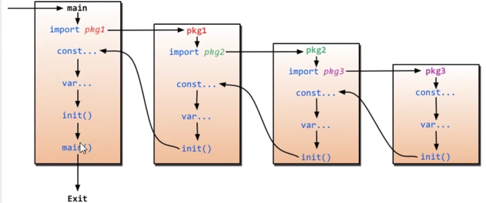

# 인프런 쉽고 빠르게 끝내는 GO언어 프로그래밍 핵심 기초 입문 과정

## https://mingrammer.com/gobyexample/

## EX) helloWorld
프로그램을 실행하기 위해, hello-world.go에 코드를 작성한 뒤 go run을 실행합니다.
```
$ go run hello-world.go
hello world
```
가끔은 프로그램을 바이너리로 빌드하고 싶을때가 있습니다. 이 땐 go build를 사용할 수 있습니다.
```
$ go build hello-world.go
$ ls
hello-world	hello-world.go
```
그런 다음 빌드된 바이너리를 직접 실행할 수 있습니다.

```
$ ./hello-world
```

hello world
이제 우리는 Go 프로그램을 실행하고 빌드할 수 있습니다, Go 언어에 대해 좀 더 배워봅시다.

## Go 장점 및 특징

* 간결한 문법 및 단순함
* 병행 프로그래밍 지원
* 정적 타입 및 동적 실행
* 간편한 협업 지원
* 컴파일 및 실행속도 빠름
* 제네릭 및 예외처리 미지원
* 컨벤션 통일

## 변수 및 상수

- 변수 선언 및 사용법 : var
- 상수 선언 및 사용법 : const

// 정수타입 : 0, 실수(소수점) : 0.0, 문자열 : " ", Boolean : true, false  
// 변수명 : 숫자 첫글자는 불가능. 대소문자 구분함.  문자 숫자 밑줄 특수기호 사용 가능.
```go
var a int
var b string
var c, d, e int
var f, g, h int = 1, 2, 3
var i float32 = 11.4
var j string = "Hi GOlang!"

f := "short"
```
* 변수를 선언해놓고 사용하지 않으면 빌드 에러.
* 초기화 없이 선언된 변수는 제로값.  예를 들어, int의 제로값은 0
* := 문법은 변수를 선언하는 동시에 초기화하기 위한 단축 표현식입니다. 예를 들면 이 경우는 var f string = "short"를 뜻합니다.

```go

func main() {
	//여러개 선언
	var (
		name string = "machine"
		height int32
		weight float32
		isRunning bool
	)

	height = 250
	weight = 350.56
	isRunning = true

	fmt.Println("name : ", name, "height : ", height, "weight : ", weight, "isRunning :", isRunning)
	
}
```
* 위처럼 여러변수를 하나로 모아서 선언해서 사용도 가능

### 짧은 선언
```go
// 짧은 선언
shortVar1 := 3
shortVar2 := "Test"
shrotVar3 := false

shortVar1 := 99 // 에러!! 재할당 불가 
```

* 이 스코프 안에서만 1회성으로 사용하는것 이 메서드가 끝나면 메모리에서 사라짐 
* 함수 내에서 초기화하여 할당한 변수는 재 할당을 할 수 없다 

### 상수
```go

package main
import "fmt"
import "math"

const s string = "constant"

func main() {
	// 상수
	// const 사용하여 초기화. 선언과 동시 초기화.  한 번 선언 후 값 변경 금지. 고정된 값 관리 용

	const a string = "Test1"
	const b = "Test2"
	const c int32 = 10 * 10

	//const d = getHeight()
	
	fmt.Println(s)

	const n = 500000000

	const d = 3e20 / n
	fmt.Println(d)
	fmt.Println(int64(d))
	fmt.Println(math.Sin(n))
}

```
* const로 상수값을 선언합니다.
* const문은 var문과 동일하게 사용할 수 있습니다.
* 상수 표현식은 임의의 정밀도로 산술 연산을 수행합니다.

* 숫자 상수는 명시적 캐스팅등으로 타입이 주어지기 전까진 타입을 가지지 않습니다.

* 숫자는 변수 할당이나 함수 호출과 같은 컨텍스트에서 사용하여 타입을 부여할 수 있습니다. 예를 들면, math.Sin은 float64를 기대합니다.

## 열거형 (Enumeration)
* `Iota`
* 주로 상수를 사용하는 일정한 규칙에 따라 숫자를 계산 하는 묶음 
* 다음 변수부터 1씩 증가함
```go
func main() {
	//열거형
	const (
		A = iota // 0
		B        // 1
		C        // 2
	)

	fmt.Println(A, B, C)
}
```

## if 문
```go

func main() {

	b := 0

	// 에러
	if b >= 25
	{
		fmt.Println("b > 25 ")
	}

	// 에러
	if b >= 25
		fmt.Println("b > 25")

	// 정상
	if b >= 25 {
		fmt.Println("b > 25")
	}

	//에러
	if c:=1; c {
		fmt.Println("true")
	}

	// 정상
	if c :=40; c >= 35 { // c의 스코프는 if문 안에서만임.
		fmt.Println("35이상")
	}

	var a int = 50

    b := 70

    // 예제1
    if a >= 65 {
        fmt.Println("65 이상")
    } else {
        fmt.Println("65 이하")
    }

    // 예제2
    if b >= 65 {
        fmt.Println("65 이상")
    } else {
        fmt.Println("65 이하")
    }

	i := 100


	if i >= 120 {

	} else if i >= 100 && i< 120 {
		
	} else if i < 100 && i >= 50 {
		
	} else {

}

}
```

## switch-case문

```go
package main

import (
	"fmt"
	"math/rand"
	"time"
)

func main() {
	// Switch 뒤 표현식 생략 가능
	// case 뒤 표현식 사용 가능
	// 자동 break 때문에 fallthrouth가 존재

	a := -7

	switch {
	case a < 0:
		fmt.Println(a, "는 음수")
	case a == 0:
		fmt.Println(a, "는 0")
	case a > 0:
		fmt.Println(" ", a, "는 양수")
	}

	switch b := 27; {
	case b < 0:
		fmt.Println(b, "는 음수")
	case b == 0:
		fmt.Println(b, "는 0")
	case b > 0:
		fmt.Println(" ", b, "는 양수")
	}

	switch c := "go"; c {
	case "go":
		fmt.Println("Go!")
	case "java":
		fmt.Println("Java!")
	default:
		fmt.Println("일치하는 값 없음")
	}

	switch c := "go"; c + "lang" {
	case "golang":
		fmt.Println("Go!")
	case "javalang":
		fmt.Println("Java!")
	default:
		fmt.Println("일치하는 값 없음")
	}

	switch i, j := 20, 30; {
	case i < j:
	case i == j:
	case i > j:
	}

	rand.Seed(time.Now().UnixNano())

	switch i := rand.Intn(100); { // 0부터 100까지의 랜덤
	case i >= 50 && i <= 100:
		fmt.Println("i -> ", i, " 50 이상 100 이하")
	case i >= 25 && i < 50:
		fmt.Println("i -> ", i, " 25 이상 50 미만")
	default:
		fmt.Println("i -> ", i, " 기본 값")
	}

	m := 30 / 15
	switch m {
	case 2, 4, 6:
	case 1, 3, 5:
	}
	switch e := "go"; e {
	case "java":
		fmt.Println("java!")
	case "go":
		fmt.Println("go!")
		fallthrough
	case "python":
		fmt.Println("python")
	case "ruby":
		fmt.Println("ruby")
	case "c":
		fmt.Println("c")
	}
	// break를 제외함
}
```
* Go는 기본적으로 switch에서 break 사용 안해도 작동함
* fallthrough는 break를 무시하는 방법. 다음 케이스들도 진행한다. 

## for

* 기본적으로 python이나 다른 언어의 문법과 유사함
* 다중 포문일시에 break 사용만 주의할 것.
  * 가장 안쪽 for만 벗어나므로 Loop1: for { for { } } 식으로 정의해놓고 break Loop1 식으로 사용
```go
package main

import "fmt"

func main()  {

	for i := 0; i < 5; i++ {
		fmt.Println("ex1 : ", i)
	}

	loc := []string{"seoul", "busan", "incheon"}

	for index, name := range loc {
		fmt.Println("ex3 : ", index, name)
	}
}
```

## 패키지 (Package)
```go
// 패키지 1
package main

// 선언방법1

import "fmt"
import "os"

//선언방법2
import (
	"fmt"
	"os"
)
```
* Go : 패키지 단위의 독립적으로 작은단위로 개발할 것을 권고
* 패키지 이름 = 디렉토리 이름
* 같은 패키지 내 -> 소스파일들은 디렉토리명을 패키지 명으로 사용한다. 
* 네이밍 규칙 : `소문자 private / 대문자 public`
  * private : 패키지 외부에서 접근 불가
  * public : 패키지 내에서만 접근 가능 


* `기본 패키지는 GOROOT에 있다.`
* main package는 특별하게 인식된다 -> main은 1개여야함. -> 컴파일러는 공유 라이브러리가 아니라 프로그램의 시작점 


* package section4/lib is not in GOROOT 가 나오면 `go mod init` 명령어 사용 
  * https://sean-ma.tistory.com/51

```go
// 패키지 1
package main
//선언방법2
import (
	"fmt"
	"section4/lib"
)

func main()  {
	fmt.Println("10보다 큰 수 ? : ", lib.CheckNum(10))
}
//// section4/lib
package lib

func CheckNum(c int32) bool {
  return c > 10
}

```
* import를 사용해서 다른 패키지의 코드 재사용. 

* `alias`를 사용하여 패키지 별칭으로도 사용 가능하다. 
```go
import (
	"fmt"
	checkUp "section4/lib"
)

func main()  {
	fmt.Println("10보다 큰 수 ? : ", checkUp.CheckNum(10)) // 별칭명
}
```

## 초기화(init) 함수

* init 함수는 패키지 로드시에 가장 먼저 호출된다.
* 초기화 되는 작업 작성시 유용
* 여러개의 init() 메서드가 있을 경우 먼저 선언한 순서대로(위에서 아래) 호출된다.
* 
```go
func init()  {
	fmt.Println("Init Start")
}

func main()  {
	fmt.Println("Main Start")
}
```
* init()이 먼저 호출됨.

# Go 데이터 타입 (자료형)

## Bool(Boolean)
* 암묵적 형변환이 안된다. 0,Nil -> false가 아님.
  * false는 false로만 써야함
  * 1 은 true가 아님 0도 false가 아님.

## Numeric(1)

* 정수, 실수, 복소수
* 32bit, 64bit, unsigned
* 8진수(0) 16진수(0x)
* float32
* https://go.dev/ref/spec#Numeric_types

## 숫자형 연산
* https://pkg.go.dev/math
* 타입이 같아야 연산 가능하다
* 다른 타입끼리는 반드시 형 변환 후 연산 (없을 경우 예외 발생) (여기서 연산은 +, -, *, % /, <<, >>, &, ^ 
  * ex ) int16(10000) + uint8(100) = 에러 발생 / 다른 타입임


