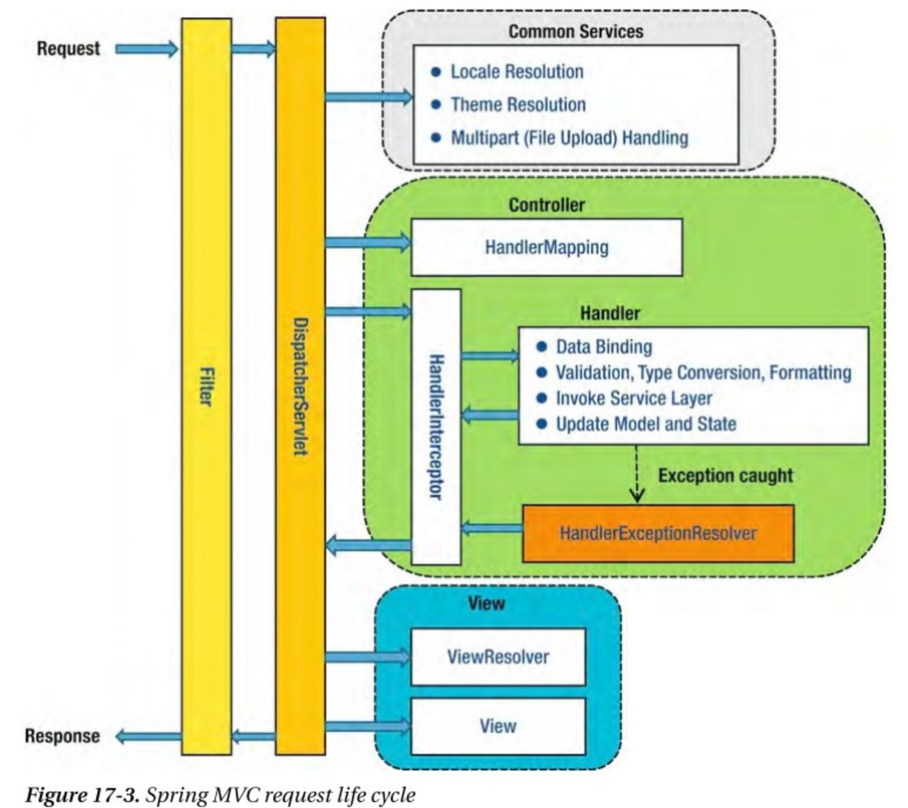

#  MDC를 이용한 로깅

# MDC Mapped Diagnostic Context

Logging 을 남기고, 문제가 발생하여 Logging을 추적할 때 멀티쓰레드 환경에서 로그가 뒤섞여 요청별로 흐름을 파악하기가 힘듭니다. 

이때 요청(Request)별로 요청의 흐름별로 로깅을 파악하면  문제 파악을 훨씬 용이하게 할 수 있습니다. 

MDC는 로깅 프레임워크에서 사용되는 기능이며 현재 실행중인 컨텍스트(혹은 쓰레드)에 메타 정보를 넣고 관리할 수 있는 공간입니다. 

각각의 로그 메시지에 대한 컨텍스트 정보를 추가하여 제공하고, 로그 메시지를 보다 구체적이고 유용하게 만들어줍니다.


내부적으로 쓰레드 로컬을 사용하며 Map 형태로 되어있어, Key Value 형태로 값을 보관하고 꺼낼 수 있어 관리에 용이합니다.

* 즉 스레드 단위로 관리되는 Map을 사용합니다.

MDC를 사용하면 로깅 프레임워크에서 제공하는 로그 출력 형식에 특정 데이터를 쉽게 추가할 수 있습니다. 

주로 다음과 같은 정보를 MDC에 설정하여 사용합니다:

- 요청 ID: 각각의 웹 요청이나 작업에 대해 고유한 식별자를 설정
- 세션 ID: 사용자 세션을 식별하기 위한 정보를 설정
- 사용자 정보: 현재 사용자의 ID, 이름 등과 같은 정보를 설정
- 트랜잭션 ID: 트랜잭션 처리에 대한 고유한 식별자를 설정
- 로깅 수준: 특정 로그 메시지에 대한 로깅 수준을 설정

MDC는 주로 다중 스레드 환경에서 스레드 로컬 (ThreadLocal) 변수를 사용하여 각각의 스레드에 대해 독립적인 MDC 값을 설정하고 사용할 수 있습니다. 이를 통해 멀티스레드 환경에서도 로그 메시지에 대한 정확한 컨텍스트 정보를 유지할 수 있습니다.


예를 들어, 웹 애플리케이션에서 각각의 HTTP 요청에 대해 고유한 요청 ID를 MDC에 설정하면, 해당 요청과 관련된 모든 로그 메시지에 자동으로 요청 ID가 포함됩니다. 이를 통해 로그 메시지를 필터링하거나 추적하는 등의 작업을 보다 쉽게 수행할 수 있습니다.


MDC는 Java에서는 로깅 프레임워크인 SLF4J (Simple Logging Facade for Java)와 함께 사용됩니다.

## MDC 사용방법

Map 형태의 메소드들을 제공해주는 `org.slf4j.MDC` 를 사용하면 됩니다.

* https://logback.qos.ch/manual/mdc.html
*  내부적으로 ThreadLocal을 이용

MDC를 사용하기 위해선 log4j 디펜던시가 필요합니다.

```groovy
// https://mvnrepository.com/artifact/org.springframework.boot/spring-boot-starter-logging
implementation 'org.springframework.boot:spring-boot-starter-logging:3.1.0'
```


```java
package org.slf4j;

public class MDC {
  public static void put(String key, String val);

  public static String get(String key);

  public static void remove(String key);

  //Clear all entries in the MDC.
  public static void clear();
}
```

* put(), get(), remove(), clear() 등의 메소드를 지원합니다 
* get(String key) : key 와 연관된 Value(데이터) 를 얻음
* put(String key, Object value) : key 와 연관된 Object(데이터) 를 저장
* remove(String key) : key 와 연관된 Value(데이터) 를 제거
* clear() : MDC의 항목을 지운다


```kotlin
import org.slf4j.MDC

fun main() {
    MDC.put("request_id", "requestId")
    MDC.put("transaction_id", "transaction_id")

    val requestId = MDC.get("request_id")
    val transactionId = MDC.get("transaction_id")
    
    MDC.clear()
}
```


## MDC 적용

Spring 사용시 각 요청당 id를 어디에서 MDC를 통해 적용하는 것이 좋을까 고민이 된다면 MVC에서 요청 흐름을 보고 적합한 위치를 고민 할 수 있습니다.



일반적으로 웹 애플리케이션의 모든 요청에서 가장 처음 만나는 부분은 filter이기 때문에, interceptor보다는 filter가 적합합니다.

또한 필터의 가장 앞 부분에 설정해주는것이 좋습니다. 요청의 시작과 끝을 알 수 있기 때문입니다.

```kotlin
@Component
@Order(Ordered.HIGHEST_PRECEDENCE)//  @Order 애노테이션을 사용하여 빈의 우선 순위를 설정할 때, 같은 우선 순위를 가진 빈들 간의 상대적인 순서는 보장되지 않는다.
class MDCRequestLoggingFilter : Filter {

    override fun doFilter(request: ServletRequest, response: ServletResponse, chain: FilterChain) {
        val uuid = UUID.randomUUID();
        MDC.put("request_id", uuid.toString());
        chain.doFilter(request, response);
        MDC.clear();
    }

}
```

* `@Order(Ordered.HIGHEST_PRECEDENCE)`를 통해 가장 높은 우선 순위를 가지게 됩니다.

* Spring Seucirty에서는 addFilterBefore() 로 filter chain의 가장 앞단에 줄 수있습니다


반드시 doFilter가 끝나서 돌아오면 clear를 해줘야 합니다.

왜냐하면,  Spring에서 ThreadLocal 변수는 스레드풀에서 꺼내 사용한 스레드로 공유되고 다시 스레드 풀로 반납되기 때문에 초기화하지 않으면 이전 데이터가 남게 됩니다. 

## Logback적용

적용한 MDC에서 request_id 등을  logback에 적용할 수 있습니다.

```
// Logback
패턴: [%X{<Key>}]
적용 예시: [%d{yyyy.MM.dd HH:mm:ss.SSS}] - [%-5level] - [%X{request_id}] - [%logger{5}] - %msg%n

// Log4J2
패턴: [%equals{%X{<Key>}}{}{<Default>}]
적용 예시: [%equals{%X{request_id}}{}{startup}] %d{HH:mm:ss.SSS} [%t] %-5level %logger{36} - %msg%n
```


```xml
<configuration>
    <appender name="consoleAppender" class="ch.qos.logback.core.ConsoleAppender">
        <encoder>
            <pattern>[%d{yyyy.MM.dd HH:mm:ss.SSS}] - [%-5level] - [%X{request_id}] - [%logger{5}] - %msg%n</pattern>
        </encoder>
    </appender>
    <root level="info">
        <appender-ref ref="consoleAppender"/>
    </root>
</configuration>
```

만약 진행하고 있는 프로젝트가 spring cloud를 도입하기에 어렵지 않은 구조라면 Spring Cloud sleuth를 이용하면 더 쉽게 로그를 추적할 수 있고 Zipkin과 연동하여 다양한 기능을 사용할 수 있습니다


## 서버에서 로그 출력

해당 로그는 서버에서 grep 명령어로 뽑아 출력할수 있습니다.

```sh
grep "request_id" path/log_file_name.log
```

**tail -f 파일명 |grep '키워드'**

* 실시간 로그파일의 특정 키워드 발생 시 라인 표출

```sh
tail -f SystemOut.log |grep 'Exception'**
```

**grep '키워드' 파일명**

SystemOut.log 파일 내 exception 문자열이 발생된 라인 표출

```sh 
grep 'exception' SystemOut.log
```

**grep -c** 

특정 키워드  발생 수 확인 시 사용

```sh
grep -c 'Exception' SystemOut.log : 500  
```

**tail 파일명**

파일의 마지막 10줄 출력

```sh
tail SystemOut.log
```

**tail -f 파일명** 

실시간 로그 확인

```sh
tail -f SystemOut.log
```

**tail -F 파일명**

로그 파일이 새로 생성되어도 로그 유지(실시간 모니터링 시 유용)

```sh
tail -F SystemOut.log
```


## With Nginx

애플리케이션 환경에서 NGINX는 애플리케이션의 리버스 프록시나, 로드밸런싱 등으로도 사용됩니다.

nginx 1.11.0 부터 고유 식별자로 `$request_id`  추가되어 다음과 같이 사용할 수 있습니다.

```
server {
    listen 80;
    add_header X-Request-ID $request_id; # Return to client
    location / {
        proxy_pass http://app_server;
        proxy_set_header X-Request-ID $request_id; # Pass to app server
    }
}
```

* http://nginx.org/en/docs/http/ngx_http_core_module.html#var_request_id

해당 변수를 Spring Request에서 꺼내서 사용할 수 있습니다

```kotlin
@Component
@Order(Ordered.HIGHEST_PRECEDENCE)//  @Order 애노테이션을 사용하여 빈의 우선 순위를 설정할 때, 같은 우선 순위를 가진 빈들 간의 상대적인 순서는 보장되지 않는다.
class MDCRequestLoggingFilter : Filter {

    override fun doFilter(request: ServletRequest, response: ServletResponse, chain: FilterChain) {
      val requestId = (servletRequest as HttpServletRequest).getHeader("X-RequestID")
      MDC.put("request_id", requestId?.takeIf { it.isNotEmpty() } ?: UUID.randomUUID().toString().replace("-", ""))
        
      filterChain.doFilter(servletRequest, servletResponse)  
      MDC.clear()
    }
}
```

* `request_id`라는 키에 `X-RequestID` 헤더 값을 설정하며, 만약 헤더 값이 존재하지 않는다면 랜덤한 UUID 값을 생성하여 설정합니다.

### 참조

* https://lovethefeel.tistory.com/91
* https://mangkyu.tistory.com/266

* https://nginxstore.com/blog/nginx/nginx-request_id-%EB%B3%80%EC%88%98%EB%A1%9C-%EC%95%A0%ED%94%8C%EB%A6%AC%EC%BC%80%EC%9D%B4%EC%85%98-%EC%B6%94%EC%A0%81%ED%95%98%EA%B8%B0/

