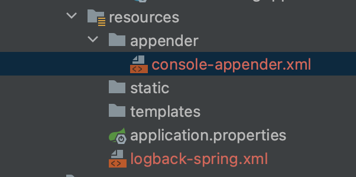
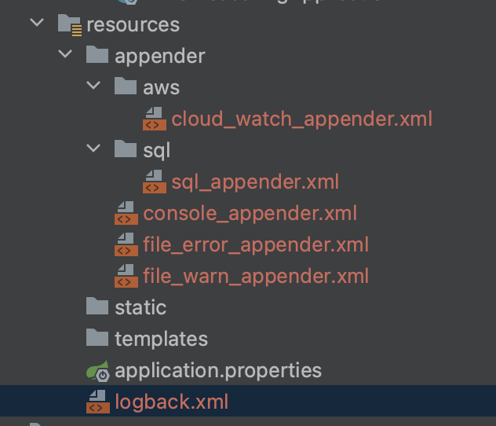

# Logback.xml include 사용하여 깔끔하게 분리하기


Logback을 사용하다 보면, 엄청나게 길어지는데요 이걸 줄여 깔끔하게 관리할 수 있는 방법이 있습니다.

`<include>` 태그는 주 구성 파일 내에서 외부 구성 파일을 포함하는 데 사용됩니다. 

`<include>` 태그를 이용해 구성을 여러 파일로 분할하여 구성을 더 조직화하고 재사용할 수 있습니다.


먼저 분리할 파일을 생성합니다.

**console-appender.xml**

```xml
<?xml version="1.0" encoding="UTF-8"?>
<included>
  <appender name="console_appender" class="ch.qos.logback.core.ConsoleAppender">
    <encoder>
      <pattern>[%d{HH:mm:ss.SSS}][%-5level] [%thread] [%logger.%method:line%line] - %msg%n</pattern>
      <charset>utf8</charset>
    </encoder> 
  </appender>
</included>
```

* 분리된 파일에 `</included>` 태그로 감싸줘야 합니다 


다음 메인 파일에서 include(포함) 시킵니다.

**logback-spring.xml**

```xml
<?xml version="1.0" encoding="UTF-8"?>
<configuration>
  
  <include resource="appender/console-appender.xml"/>
    
  <logger name="root" level="debug">
  	<appender-ref ref="console_appender"/>
  </logger>
</configuration>
```

* ` <include resource="파일위치/파일명">` 태그로 포함시켜 줍니다. 이 때 디렉토리와 일치시켜줘야 합니다.   

* 일반적으로 로그백 파일은  /src/main/resources 아래에 존재하는데요, 저는 이밑에 appender라는 디렉토리를 새로 만들었습니다. 

즉 디렉토리의 구조가 아래처럼 되도록 설정했습니다.




잘 이용하면 프로퍼티(`<property`>) 파일까지도 분리가 가능합니다!

* 프로퍼티도 마찬가지로 `<include resource="파일위치/파일명">` 로 포함시켜줄 수 있습니다.  


# 실습 - 복잡한 logback-spring.xml 파일 분리해서 깔끔하게 정리하기 

```xml
<?xml version="1.0" encoding="UTF-8"?>
<configuration>
    <appender name="consoleAppender" class="ch.qos.logback.core.ConsoleAppender">
        <encoder>
            <pattern>[%date GMT][%-5level][%logger{36}.%M\(%line\)] %msg %n</pattern>
        </encoder>
    </appender>

    <appender name="accessLogTest" class="ch.qos.logback.core.rolling.RollingFileAppender">
        <file>${logging.path:-logs}/logback-accessLog.log</file>
        <append>true</append>
        <encoder>
            <pattern>%cyan(%date GMT) [%highlight(%-5level)] [%magenta(%thread)] [%blue(%logger{36}.%M\(%line\))] %msg
                %n
            </pattern>
        </encoder>
        <rollingPolicy class="ch.qos.logback.core.rolling.TimeBasedRollingPolicy">
            <fileNamePattern>${logging.path:-logs}/access.%d{yyyyMMdd}.log.gz
            </fileNamePattern>
            <maxHistory>2</maxHistory>
        </rollingPolicy>
    </appender>

    <!-- warn 패턴 -->
    <property name="WARN_LOG_PATTERN"
              value="%cyan(%date GMT) [%highlight(%-5level)] [%magenta(%thread)] [%blue(%logger{36}.%M\(%line\))] %msg %n"/>

    <appender name="errorAppender" class="ch.qos.logback.core.rolling.RollingFileAppender">
        <file>logs/error/error.log</file>
        <append>true</append>
        <encoder>
            <pattern>%cyan(%date GMT) [%highlight(%-5level)] [%magenta(%thread)] [%red(%logger{36}.%M\(%line\))] %msg
                %n
            </pattern>
        </encoder>
        <rollingPolicy class="ch.qos.logback.core.rolling.SizeAndTimeBasedRollingPolicy">
            <fileNamePattern>logs/error/error.%d{yyyy-MM-dd}.%i.log</fileNamePattern>
            <maxFileSize>30MB</maxFileSize>
            <maxHistory>15</maxHistory>
            <!--전체 용량 제어(maxHistory와 함께 사용 필수)-->
            <totalSizeCap>1GB</totalSizeCap>
        </rollingPolicy>
    </appender>

    <appender name="warnAppender" class="ch.qos.logback.core.rolling.RollingFileAppender">
        <file>logs/warn/warn.log</file>
        <append>true</append>
        <encoder>
            <pattern>${WARN_LOG_PATTERN}</pattern>
        </encoder>
        <rollingPolicy class="ch.qos.logback.core.rolling.SizeAndTimeBasedRollingPolicy">
            <fileNamePattern>logs/warn/warn.%d{yyyy-MM-dd}.%i.log</fileNamePattern>
            <maxFileSize>30MB</maxFileSize>
            <maxHistory>15</maxHistory>
            <!--전체 용량 제어(maxHistory와 함께 사용 필수)-->
            <totalSizeCap>1GB</totalSizeCap>
        </rollingPolicy>
    </appender>

    <appender name="sqlAppender" class="ch.qos.logback.core.rolling.RollingFileAppender">
        <file>logs/sql/sql_execute_time.log</file>
        <append>true</append>
        <encoder>
            <pattern>%cyan(%date GMT) [%highlight(%-5level)] [%magenta(%thread)] [%blue(%logger{36}.%M\(%line\))] %msg
                %n
            </pattern>
        </encoder>
        <rollingPolicy class="ch.qos.logback.core.rolling.SizeAndTimeBasedRollingPolicy">
            <fileNamePattern>logs/sql/sql_execute_time.%d{yyyy-MM-dd}.%i.log</fileNamePattern>
            <maxFileSize>30MB</maxFileSize>
            <maxHistory>15</maxHistory>
            <!--전체 용량 제어(maxHistory와 함께 사용 필수)-->
            <totalSizeCap>1GB</totalSizeCap>
        </rollingPolicy>
    </appender>

    <!-- AWS Appender 설정 -->
    <appender name="cloudWatchAppender" class="ca.pjer.logback.AwsLogsAppender">
        <layout>
            <pattern>[%thread] [%date] [%level] [%file:%line] - %msg%n</pattern>
        </layout>
        <logGroupName>?</logGroupName>
        <logStreamUuidPrefix>?</logStreamUuidPrefix>
        <logRegion>ap-northeast-2</logRegion>
        <maxBatchLogEvents>50</maxBatchLogEvents>
        <maxFlushTimeMillis>10</maxFlushTimeMillis>
        <maxBlockTimeMillis>10</maxBlockTimeMillis>
        <retentionTimeDays>0</retentionTimeDays>
        <accessKeyId>?</accessKeyId>
        <secretAccessKey>?</secretAccessKey>
    </appender>


    <logger name="sqlLogger" level="debug" additivity="false">
        <appender-ref ref="sqlAppender"/>
    </logger>

    <logger name="warnLogger" level="warn" additivity="false">
        <appender-ref ref="warnAppender"/>
        <appender-ref ref="consoleAppender"/>
        <appender-ref ref="cloudWatchAppender"/>
    </logger>

    <logger name="errorLogger" level="error" additivity="false">
        <appender-ref ref="errorAppender"/>
        <appender-ref ref="consoleAppender"/>
        <appender-ref ref="cloudWatchAppender"/>
    </logger>

    <root>
        <level value="info"/>
        <appender-ref ref="consoleAppender"/>
    </root>

</configuration>
```


## appender 분리



### 분해 후 logback-spring.xml

```xml
<?xml version="1.0" encoding="UTF-8"?>
<configuration>

    <include resource="appender/console_appender.xml"/>
    <include resource="appender/file_error_appender.xml"/>
    <include resource="appender/file_warn_appender.xml"/>
    <include resource="appender/sql/sql_appender.xml"/>
    <include resource="appender/aws/cloud_watch_appender.xml"/>

    <logger name="sqlLogger" level="debug" additivity="false">
        <appender-ref ref="sqlAppender"/>
    </logger>

    <logger name="warnLogger" level="warn" additivity="false">
        <appender-ref ref="warnAppender"/>
        <appender-ref ref="cloudWatchAppender"/>
        <appender-ref ref="consoleAppender"/>
    </logger>

    <logger name="errorLogger" level="error" additivity="false">
        <appender-ref ref="errorAppender"/>
        <appender-ref ref="consoleAppender"/>
        <appender-ref ref="cloudWatchAppender"/>
    </logger>

    <root>
        <level value="info"/>
        <appender-ref ref="consoleAppender"/>
    </root>
  
</configuration>
```


1. console_appender.xml

```xml
<?xml version="1.0" encoding="UTF-8"?>
<included>
    <appender name="consoleAppender" class="ch.qos.logback.core.ConsoleAppender">
        <encoder>
            <pattern>[%date GMT][%-5level][%logger{36}.%M\(%line\)] %msg %n</pattern>
        </encoder>
    </appender>
</included>
```

2. file_error_appender.xml

```xml
<included>
    <appender name="errorAppender" class="ch.qos.logback.core.rolling.RollingFileAppender">
        <file>logs/error/error.log</file>
        <filter class="ch.qos.logback.classic.filter.ThresholdFilter">
            <level>warn</level>
        </filter>
        <append>true</append>
        <encoder>
            <pattern>%cyan(%date GMT) [%highlight(%-5level)] [%magenta(%thread)] [%red(%logger{36}.%M\(%line\))] %msg
                %n
            </pattern>
        </encoder>
        <rollingPolicy class="ch.qos.logback.core.rolling.SizeAndTimeBasedRollingPolicy">
            <fileNamePattern>logs/error/error.%d{yyyy-MM-dd}.%i.log</fileNamePattern>
            <maxFileSize>30MB</maxFileSize>
            <maxHistory>15</maxHistory>
            <!--전체 용량 제어(maxHistory와 함께 사용 필수)-->
            <totalSizeCap>1GB</totalSizeCap>
        </rollingPolicy>
    </appender>
</included>
```

3. sql/sql_appender.xml

```xml
<included>
    <appender name="sqlAppender" class="ch.qos.logback.core.rolling.RollingFileAppender">
        <file>logs/sql/sql_execute_time.log</file>
        <append>true</append>
        <encoder>
            <pattern>%cyan(%date GMT) [%highlight(%-5level)] [%magenta(%thread)] [%blue(%logger{36}.%M\(%line\))] %msg
                %n
            </pattern>
        </encoder>
        <rollingPolicy class="ch.qos.logback.core.rolling.SizeAndTimeBasedRollingPolicy">
            <fileNamePattern>logs/sql/sql_execute_time.%d{yyyy-MM-dd}.%i.log</fileNamePattern>
            <maxFileSize>30MB</maxFileSize>
            <maxHistory>15</maxHistory>
            <!--전체 용량 제어(maxHistory와 함께 사용 필수)-->
            <totalSizeCap>1GB</totalSizeCap>
        </rollingPolicy>
    </appender>
</included>
```


등 `<included>` 와 `<include resource = >`를 이용해서 깔끔하게 분리할 수 있습니다.

* 물론 `<property>`도  `<property>`를 다른 파일로 분리하고 다른 include 할 파일 안에서 다시 include 할 수 있습니다.


## Spring Profile에 따른 분리

다음처럼 Profile에 따라 분리 할수도 있습니다.

```xml
<?xml version="1.0" encoding="UTF-8"?>
<configuration>

    <include resource="appender/console_appender.xml"/>
    <include resource="appender/file_error_appender.xml"/>
    <include resource="appender/file_warn_appender.xml"/>
    <include resource="appender/sql/sql_appender.xml"/>
    <include resource="appender/aws/cloud_watch_appender.xml"/>

    <logger name="sqlLogger" level="debug" additivity="false">
        <appender-ref ref="sqlAppender"/>
    </logger>

    
    <springProfile name="local, test">
        <logger name="sqlLogger" level="debug" additivity="false">
            <appender-ref ref="sqlAppender"/>
        </logger>

        <logger name="org.springframework" level="INFO">
            <appender-ref ref="consoleAppender"/>
        </logger>

        <logger name="org.hibernate.SQL" level="DEBUG">
            <appender-ref ref="sqlAppender"/>
        </logger>

        <logger name="org.hibernate.SQL_SLOW" level="INFO">
            <appender-ref ref="sqlAppender"/>
        </logger>

    </springProfile>

    <springProfile name="dev, prod">

        <logger name="warnLogger" level="warn" additivity="false">
            <appender-ref ref="warnLogger"/>
            <appender-ref ref="consoleAppender"/>
            <appender-ref ref="cloudWatchAppender"/>
        </logger>

        <logger name="errorLogger" level="error" additivity="false">
            <appender-ref ref="errorAppender"/>
            <appender-ref ref="consoleAppender"/>
            <appender-ref ref="cloudWatchAppender"/>
        </logger>

        <logger name="org.springframework" level="INFO">
            <appender-ref ref="consoleAppender"/>
        </logger>

        <logger name="org.hibernate.SQL" level="DEBUG">
            <appender-ref ref="sqlAppender"/>
        </logger>

        <logger name="org.hibernate.SQL_SLOW" level="INFO">
            <appender-ref ref="sqlAppender"/>
        </logger>

    </springProfile>


</configuration>
```
