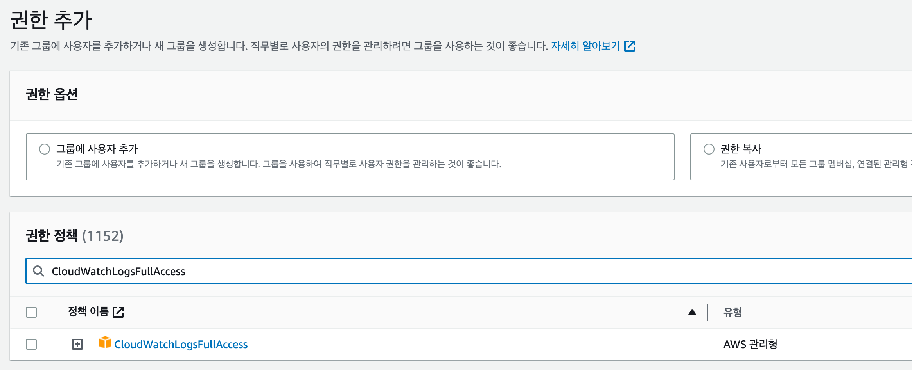

# Logback With AWS Cloud Watch

Spring 애플리케이션에서 Logback을 이용하여 AWS Cloud Watch로 전송하여 수집하는 방법에 대해 정리하겠습니다.

## 의존성 추가

```groovy
// https://mvnrepository.com/artifact/ca.pjer/logback-awslogs-appender
implementation 'ca.pjer:logback-awslogs-appender:1.6.0'
```

* 2021년 1.6.0 버전 이후로 업데이트 되지 않고 있어서 유심히 알아보고 사용하는 것이 좋습니다. 
* aws log dependency 1.5.0 을 사용하면 accessKey, secretAccessKey를 logback-spring.xml에 추가하지 않아도 동작합니다.
* 1.5.0은 aws cloudwatch credentials 인증을 accessKey, secretAccessKey를 Java System 속성 또는 OS 환경변수에 정의된 값을 참조해서 처리합니다.

## AWS IAM 권한 추가



IAM 권한을 을  CloudWatchLogsFullAccess를 지정해주시면 됩니다.

### Cloud Watch 요금

클라우드를 사용할때는 요금도 잘 계산해보고 사용해야 합니다.

요금 정책은 https://aws.amazon.com/ko/cloudwatch/pricing/?nc1=h_ls 에서 확인할 수 있습니다.

> 예제 5 - 로그를 사용한 모니터링
>
> 하루에 1GB의 수집된 로그 데이터를 전송하고 HTTP 응답을 모니터링하고 한 달 동안 해당 데이터를 아카이브하여 30일 기준 한 달 내내 24시간 동안 웹 애플리케이션 액세스 로그를 통해 HTTP 2xx, 3xx 및 4xx 응답 코드를 모니터링하는 경우, 요금은 다음과 같습니다.
>
> 월별 수집된 로그 요금
> 총 수집된 로드 데이터 = 1GB * 30일 = 30GB
> 0에서 5GB = 0 USD
> 5에서 30GB = 0.50 USD * 25 = 12.50 USD
>
> 
>
> 월별 모니터링 요금
> CloudWatch 지표 3개(지표당 0 USD) = 3 * 0 USD = 0 USD
>
> 월별 아카이브된 로그 요금(로그 데이터가 6GB로 압축되었다고 가정)
> 0에서 5GB = 0 USD
> 5GB에서 6GB = 0.03 USD * 1 = 0.03 USD
>
> **월별 CloudWatch 요금 = 12.50 USD + 0 USD + 0.03 USD = 12.53 USD**


## Logback.xml  AWS Cloud Watch 기본 설정

```xml
<configuration>
  	<springProperty name="AWS_ACCESS_KEY" source="cloud.aws.credentials.accessKey"/>
    <springProperty name="AWS_SECRET_KEY" source="cloud.aws.credentials.secretKey"/>
    
  <appender name="aws_cloud_watch_log"
              class="ca.pjer.logback.AwsLogsAppender">
      
        <!--
        <filter> 요소는 Logback 프레임워크에서 로그 이벤트를 필터링하는 데 사용되는 구성 요소  
        <level> 요소는 필터링할 로그 레벨을 지정하는 데 사용. 
         ERROR 레벨을 지정하여 ERROR 레벨 이상의 로그 이벤트만 허용되도록 필터링하여 
         ERROR 레벨 이하의 로그 이벤트는 필터링되어 출력되지 않습니다.
        -->
        <filter class="ch.qos.logback.classic.filter.ThresholdFilter">
      		<level>ERROR</level>
    		</filter>
      
       <layout>
            <pattern>[%thread] [%date] [%level] [%file:%line] - %msg%n</pattern>
        </layout>
        <logGroupName>aws-error-log-test/error-log</logGroupName>
        <logStreamUuidPrefix>error-log-</logStreamUuidPrefix>
        <logRegion>ap-northeast-2</logRegion>
        <maxBatchLogEvents>50</maxBatchLogEvents>
        <maxFlushTimeMillis>30000</maxFlushTimeMillis>
        <maxBlockTimeMillis>5000</maxBlockTimeMillis>
        <retentionTimeDays>0</retentionTimeDays>
     	  <accessKeyId>${AWS_ACCESS_KEY}</accessKeyId>
        <secretAccessKey>${AWS_SECRET_KEY}</secretAccessKey>
        <encoder>
            <charset>UTF-8</charset>
            <pattern>%d{HH:mm:ss.SSS} [%thread] [%5level] %logger{35}[%method:%line] %m%n</pattern>
        </encoder>
    </appender>
  	
  	<logger name="errorLogger" level="error" additivity="false">
        <appender-ref ref="aws_cloud_watch_log"/>
    </logger>
  
</configuration>
```

* `<springProperty>` 태그는 Logback 안에서 사용을 위해 스프링 Environment 으로부터 속성을 드러나도록(expose) 합니다.

설정 설명

- **logGroupName**: CloudWatch log Group Name. 로그스트림을 그룹화 할 수 있게끔 되어있음 
- **logStreamUuidPrefix**: CloudWatch 로그 스트림 접두사. 
  - 로그파일이 생성할때 무작위 uuid를 생성하는데 해당 설정을을 적어주면 적어준 text뒤에 uuid가 붙는 형식으로 로그파일을 생성됩니다.
  - error-log-0e001253-535e-4417-af92-ba55f9ac67fe와 같은 로그 스트림의 UUID가 생깁니다.
- **logRegion**: CloudWatch AWS Region. IAM 사용자의 region 값을 적어준다.
- **maxBatchLogEvents**: 배치의 최대 이벤트 갯수를 설정하는 것이며 1 ~ 10000사이 값만 설정이 가능하다. 
  - 이벤트 대기열에 갯수가 50개가 되면 AWS Cloud Watch로 로그가 전송됩니다.
  - 기본값  : 0 50
- **maxFlushTimeMillis**: 마지막 플러시가 발생된 이후 지정된 시간이 지나면 AWS Cloud Watch로 로그가 전송된다. 
  - 0일 경우 로그를 동기로 전송하고 0보다 큰값일 경우 비동기로 로그가 전송됩니다.
  - 기본값 : 0
- **maxBlockTimeMillis**: 로그가 전송되는 동안 코드가 계속 실행되는 것을 차단하고 값을 0으로 세팅하면 전송중에 발생되는 모든 로그를 버립니다.
  - 기본값 : 5000
- **retentionTimeDays**: 로그그룹의 보존기간을 얘기합니다. 0으로 세팅하면 보존기간은 무기한으로 보존됩니다.
  - 기본값 : 0
- **accessKeyId**: 로그를 전송할 IAM 계정의 AWS IAM Access Key 
- **secretAccessKey**: 로그를 전송할 IAM 계정의 AWS IAM Secret Key
  -  이 두 값은 다른 방법으로 안전하게도 사용 가능합니다.
  -  이 값을 logback-spring.xml 파일에 정의하지 않고 외부에서 관리를 하는방법이 있습니다.


> https://github.com/pierredavidbelanger/logback-awslogs-appender


## Profile 별로 로그 설정

`<SpringProfile name="{PROFILE_NAME}"> </SpringProfile>` 와

`<if condition=>` 2가지 방법을 이용하면 Profile 별로 로그를 사용할 수 있습니다.

### SpringProfile 사용

```xml
<?xml version="1.0" encoding="UTF-8"?>
<configuration>
   
    <!-- dev profile -->
    <springProfile name="dev">
        <filter class="ch.qos.logback.classic.filter.ThresholdFilter">
     			 <level>ERROR</level>
    		</filter>
        <!-- AWS Appender 설정 -->
        <appender name="aws_cloud_watch_log" class="ca.pjer.logback.AwsLogsAppender">
            <layout>
                <pattern>[%thread] [%date] [%level] [%file:%line] - %msg%n</pattern>
            </layout>
            <logGroupName>aws-error-log-dev/error-dev-log</logGroupName>
            <logStreamUuidPrefix>error-log-dev-</logStreamUuidPrefix>
            ... 생략
        </appender>
    </springProfile>
		
    <!-- prod profile -->
    <springProfile name="prod">
      	<filter class="ch.qos.logback.classic.filter.ThresholdFilter">
      		<level>ERROR</level>
    		</filter>
        <!-- AWS Appender 설정 -->
        <appender name="aws_cloud_watch_log" class="ca.pjer.logback.AwsLogsAppender">
            <layout>
                <pattern>[%thread] [%date] [%level] [%file:%line] - %msg%n</pattern>
            </layout>
            <logGroupName>aws-error-log-prod/error-prod-log</logGroupName>
            <logStreamUuidPrefix>error-log-prod-</logStreamUuidPrefix>
            ...생략
        </appender>

    </springProfile>

    <logger name="errorLogger" level="error" additivity="false">
        <appender-ref ref="aws_cloud_watch_log"/>
    </logger>
  
</configuration>
```

springProfile은 `<springProfile name="local,dev">` 로도 사용가능합니다.

### if condition 사용

if condition 사용시  janino library를 추가해야 합니다.

```groovy
// https://mvnrepository.com/artifact/org.codehaus.janino/janino
implementation 'org.codehaus.janino:janino:3.1.9'
```

xml

```xml
<?xml version="1.0" encoding="UTF-8"?>
<configuration>

    <!-- AWS Appender 설정 -->
    <appender name="aws_cloud_watch_log" class="ca.pjer.logback.AwsLogsAppender">
      <filter class="ch.qos.logback.classic.filter.ThresholdFilter">
      	<level>ERROR</level>
    	</filter>
      
      <layout>
          <pattern>[%thread] [%date] [%level] [%file:%line] - %msg%n</pattern>
      </layout>
        
      <!-- if condition 사용 -->
      <if condition='property("spring.profiles.active").contains("dev")'>
      	<then>
        	<logGroupName>aws-error-log-dev/error-dev-log</logGroupName>
          <logStreamUuidPrefix>error-log-dev-</logStreamUuidPrefix>
      	</then>
      </if>
      <if condition='property("spring.profiles.active").contains("prod")'>
      	<then>
      	  <logGroupName>aws-error-log-prod/error-prod-log</logGroupName>
          <logStreamUuidPrefix>error-log-prod-</logStreamUuidPrefix>
     	 </then>
    	</if>
      
        ... 생략
    </appender>

    <logger name="errorLogger" level="error" additivity="false">
        <appender-ref ref="aws_cloud_watch_log"/>
    </logger>

</configuration>
```


### 참조

* https://github.com/pierredavidbelanger/logback-awslogs-appender
* https://southouse.tistory.com/21