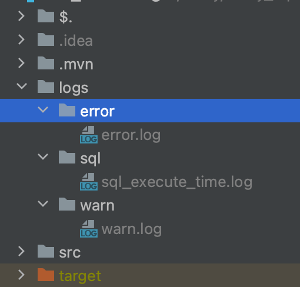
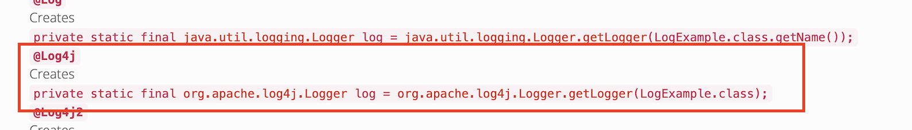

# Logback 로그 Logger마다 다른 파일에 기록하는 방법 

SpringBoot에서 Logger마다 각기 다른 파일에 분리하는 방법에 대해 정리해보겠습니다.

## 1. 요구사항과 예제 

* 에러 로그는 logs/error/error.log 에 기록되어야 한다
* sql 실행 시간을 기록한 로그는 logs/sql/sql_execute_time.log 에 기록되어야 한다
* warn 로그는 logs/warn/warn.log에 기록되어야 한다.

요구사항과 예제를 간단하게 구현한 클래스입니다.

```java
public class LoggerTest {

	private ErrorLogger errorLogger = new ErrorLogger();

	private WarnLogger warnLogger = new WarnLogger();

	private SqlLogger sqlLogger = new SqlLogger();

	public void call(String message) {
		errorLogger.errorLog(message);
		warnLogger.warnLog(message);
		sqlLogger.sqlLog();
	}

	public static class ErrorLogger {
    // 1. 
		private static final Logger errorLogger = LoggerFactory.getLogger("errorLogger");

		public void errorLog(String message) {
			errorLogger.error(message);
		}
	}

  // 2.
	@Slf4j(topic = "warnLogger")
	public static class WarnLogger {

		public void warnLog(String message) {
			log.warn(message);
		}
	}

	public static class SqlLogger {
    // 3. 
		private static final Logger sqlLogger = LoggerFactory.getLogger("sqlLogger");

		public void sqlLog() {
			sqlLogger.debug("execute time 0.01s");
		}
	}
  
  public static void main(String[] args) {
		LoggerTest loggerTest = new LoggerTest();
		loggerTest.call("로그 테스트"); // 4
	}
}
```

한 파일에 넣어 간단히 정리한 클래스 입니다.

각기 다른 로거를 사용하며, call() 메소드로 한번에 다 출력하도록 했습니다. 

1. error 레벨을 기록할 로거(Logger) 입니다. **error 로거**의 이름을 errorLogger 라고 명명
2. warn 레벨을 기록할 로거(Logger) 입니다. **warn 로거**의 이름을  warnLogger라고 명명 하였습니다.
   1. @Slf4j의 topic값을 지정하면 (위에서는 warnLogger) 해당 로거의 이름이 명명됩니다. 
   2. https://projectlombok.org/api/lombok/extern/slf4j/Slf4j
   3. https://projectlombok.org/features/log

3. sql을 기록할 로거입니다.  sql 로거의 이름을 sqlLogger 명명 


결과



```shell
> cat ./error/error.log 
2023-05-25 03:08:06,911 GMT [ERROR] [main] [errorLogger.errorLog(36)] 로그 테스트 

> cat ./warn/warn.log 
2023-05-25 03:08:06,912 GMT [WARN ] [main] [warnLogger.warnLog(52)] 로그 테스트 
2023-05-25 03:08:06,912 GMT [WARN ] [main] [warnLogger.aopWarnLog(44)] 로그 테스트 

> cat ./sql/sql_execute_time.log 
2023-05-25 03:08:06,912 GMT [DEBUG] [main] [sqlLogger.sqlLog(60)] execute time 0.01s 
```


### Loggger의 name 지정과 동일 로거

```java
LoggerFactory.getLogger(name); 
// or
@Slf4j(topic = name)
```

라고 같은 name을 지정하게 되면, 동일한 Logger를 사용하게 됩니다. 

```java
public static class AopLogger {
		
  private static final Logger logger = LoggerFactory.getLogger("warnLogger");

  public void aopWarnLog(String message) {
			logger.warn(message + "className {}, object : {} hashCode : {}", 
                  logger.getName(), logger, logger.hashCode()
                 );
		}
}

@Slf4j(topic = "warnLogger")	
public static class WarnLogger {

  public void warnLog(String message) {
	
    log.warn(message + "className {}, object : {} hashCode : {}",
             log.getName(), log, log.hashCode()
            );
		}
}
```

결과

```
2023-05-25 03:04:49,523 GMT [WARN ] [main] [warnLogger.warnLog(55)] 로그 테스트 className warnLogger, object : Logger[warnLogger] hashCode : 1800031768 
2023-05-25 03:04:49,524 GMT [WARN ] [main] [warnLogger.aopWarnLog(44)] 로그 테스트 className warnLogger, object : Logger[warnLogger] hashCode : 1800031768 
```


### @Slf4j 어노테이션 ?

lombok의 @Slf4j 어노테이션을 사용하면 편하게 사용할 수 있습니다.

@Slf4j어노테이션 사용시 변환되는 코드는 아래와 같습니다.

```java
@Slf4j 
public class LoggerClass {
}
```

위처럼 선언시 아래처럼 작동합니다.

```java
// generate 
public class LoggerClass { 
	private static final org.slf4j.Logger log = org.slf4j.LoggerFactory.getLogger(LoggerClass.class); 
}
```

* https://projectlombok.org/features/log



만약 @Slf4j의 Topic값을 지정하면, 로거의 이름이 됩니다.

Slf4j 이외에도 다음 Logger를 제공합니다.

| 어노테이션    | Logger 클래스                     |
| ------------- | --------------------------------- |
| `@CommonsLog` | `org.apache.commons.logging.Log`  |
| `@Log`        | `org.apache.commons.logging.Log`  |
| `@Log4j`      | `org.apache.log4j.Logger`         |
| `@Log4j2`     | `org.apache.logging.log4j.Logger` |
| `@Slf4j`      | `org.slf4j.Logger`                |
| `@XSlf4j`     | `org.slf4j.ext.XLogger`           |


## 2. 로그백 (logback.xml) 설정

```xml
<?xml version="1.0" encoding="UTF-8"?>
<configuration>
    <appender name="consoleLogback" class="ch.qos.logback.core.ConsoleAppender">
        <encoder>
            <!--<pattern>[%date GMT][%-5level][%logger{36}.%M\(%line\)] %msg %n</pattern>-->
            <pattern>%cyan(%date GMT) [%highlight(%-5level)] [%magenta(%thread)] [%boldBlue(%logger{36}.%M\(%line\))] %msg %n</pattern>
        </encoder>
    </appender>

    <!-- profile이 local인 경우-->
    <springProfile name="local">
        <property name="PATH" value="./logs/local.log"/>
    </springProfile>

    <!-- warn 패턴 -->
    <property name="WARN_LOG_PATTERN" value="%cyan(%date GMT) [%highlight(%-5level)] [%magenta(%thread)] [%blue(%logger{36}.%M\(%line\))] %msg %n"/>

  	<!-- 1. error Level Logger 지정 -->
    <appender name="errorLogger" class="ch.qos.logback.core.rolling.RollingFileAppender">
        <file>logs/error/error.log</file>
        <append>true</append>
        <encoder>
            <pattern>%cyan(%date GMT) [%highlight(%-5level)] [%magenta(%thread)] [%red(%logger{36}.%M\(%line\))] %msg %n</pattern>
        </encoder>
        <rollingPolicy class="ch.qos.logback.core.rolling.SizeAndTimeBasedRollingPolicy">
            <fileNamePattern>logs/error/error.%d{yyyy-MM-dd}.%i.log</fileNamePattern>
            <maxFileSize>30MB</maxFileSize>
            <maxHistory>15</maxHistory>
            <!--전체 용량 제어(maxHistory와 함께 사용 필수)-->
            <totalSizeCap>1GB</totalSizeCap>
        </rollingPolicy>
    </appender>
		
  	<!-- 2. warn Level Logger 지정 -->
    <appender name="warnLogger" class="ch.qos.logback.core.rolling.RollingFileAppender">
        <file>logs/warn/warn.log</file>
        <append>true</append>
        <encoder>
            <pattern>${WARN_LOG_PATTERN}</pattern>
        </encoder>
        <rollingPolicy class="ch.qos.logback.core.rolling.SizeAndTimeBasedRollingPolicy">
            <fileNamePattern>logs/warn/warn.%d{yyyy-MM-dd}.%i.log</fileNamePattern>
            <maxFileSize>30MB</maxFileSize>
            <maxHistory>15</maxHistory>
            <!--전체 용량 제어(maxHistory와 함께 사용 필수)-->
            <totalSizeCap>1GB</totalSizeCap>
        </rollingPolicy>
    </appender>

    <!-- 3. sql Logger 지정 -->
    <appender name="sqlLogger" class="ch.qos.logback.core.rolling.RollingFileAppender">
        <file>logs/sql/sql_execute_time.log</file>
        <append>true</append>
        <encoder>
            <pattern>%cyan(%date GMT) [%highlight(%-5level)] [%magenta(%thread)] [%blue(%logger{36}.%M\(%line\))] %msg %n</pattern>
        </encoder>
        <rollingPolicy class="ch.qos.logback.core.rolling.SizeAndTimeBasedRollingPolicy">
            <fileNamePattern>logs/sql/sql_execute_time.%d{yyyy-MM-dd}.%i.log</fileNamePattern>
            <maxFileSize>30MB</maxFileSize>
            <maxHistory>15</maxHistory>
            <!--전체 용량 제어(maxHistory와 함께 사용 필수)-->
            <totalSizeCap>1GB</totalSizeCap>
        </rollingPolicy>
    </appender>

  	<!-- 4. sqlLogger 지정 -->
    <logger name="sqlLogger" level="debug" additivity="false">
        <appender-ref ref="sqlLogger" />
        <appender-ref ref="consoleLogback"/>
    </logger>

  	
    <logger name="warnLogger" level="warn" additivity="false">
        <appender-ref ref="warnLogger" />
        <appender-ref ref="consoleLogback"/>
    </logger>

    <logger name="errorLogger" level="error" additivity="false">
        <appender-ref ref="errorLogger" />
        <appender-ref ref="consoleLogback"/>
    </logger>

    <root>
        <level value="debug"/>
        <appender-ref ref="consoleLogback"/>
    </root>
</configuration>
```

구성 방법은 간단합니다

1. 지정한 Logger의 이름으로 appender를 생성합니다.

   * sqlLogger, errorLogger, warnLogger

   * RollingFileAppender를 선택했습니다.  maxFileSize로 사이즈를 지정했으며 이 크기를 초과하면 새로운 파일이 생성됩니다, 
   * maxHistory로 삭제 주기를 지정했습니다. 

2. 각각의 Appender는 다음과 같은 일을 합니다.
   * **error Level Logger** - logs/error/ 아래 위치에 error.log라는 파일로 지정한 패턴대로 로그를 기록
   * **warn Level Logger** - logs/warn/ 아래 위치에 warn.log라는 파일로, `<property>`로 지정한 패턴대로 로그를 기록
   *  **sql Logger** - logs/sql/ 아래 위치에 sql_execute_time.log라는 파일로 지정한 패턴대로 기록
   * rollingPolicy를 따라 기록하게 됩니다. 

3. `<logger name = >` 으로 logger의 이름과 appender를 지정했습니다. 지정한 appender를 사용하게 됩니다.


 