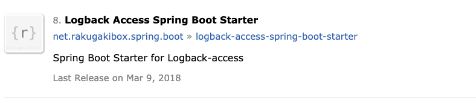
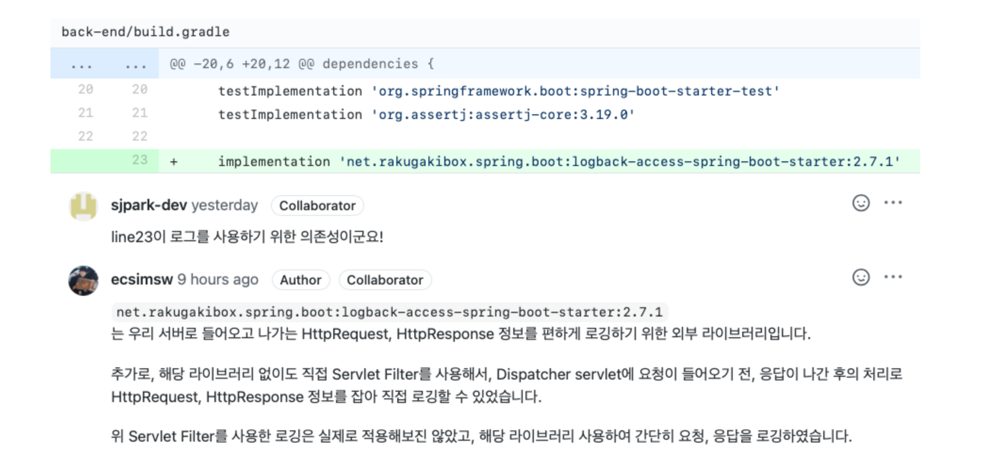

# Logback 정리

logback이란 log4j 이후에 나왔으며 log4j 보다 향상되고 가장 널리 사용되고 있는 Java 로깅 라이브러리 입니다. 

* https://logback.qos.ch/index.html- 공식 문서

* https://github.com/qos-ch/logback - Github

* https://logback.qos.ch/documentation.html - Docs

**slf4j의 구현체**로써 **SpringBoot의 기본 log**로 사용되고 있으며  spring-boot-starter-web안에 spring-boot-starter-logging의 logback이 기본적으로 포함되어 있어서 별다른 dependency 추가 없이 사용할 수 있습니다.

또한 Automatic Reloading 기능을 제공하여 별도에 재시작없이 설정을 변경하여 사용할 수 있습니다.

* ex) 특정 부분에서 더 자세한 로그를 봐야할 필요성이 있다면 INFO로 변경해야 하는데, 이를 서버의 종료 없이 컨트롤이 가능

## Log Level별 용도

일반적으로 Log Level은 다음과 같이 사용하지만, 팀이나 회사의 규칙에 따라 다르기도 합니다.

| 로그 레벨 | 설명                                                         |
| --------- | ------------------------------------------------------------ |
| Trace     | 가장 상세한 로그 레벨로, 코드의 흐름을 따라가며 디버깅 정보를 기록합니다. |
| Debug     | 디버깅을 위한 로그 레벨로, 프로그램의 상태 및 실행 중에 발생하는 중요한 이벤트를 기록합니다. |
| Info      | 일반적인 정보를 기록하는 로그 레벨로, 프로그램의 주요 이벤트 및 상태 변경을 기록합니다. <br />에러는 아니지만 주시해야할 것 |
| Warning   | 예외적인 상황을 기록하는 로그 레벨로, 잠재적인 문제 또는 예상치 못한 동작을 알립니다.<br />예외상황이긴 했지만 에러는 아닌 것 |
| Error     | 심각한 에러를 기록하는 로그 레벨로, 예외 상황 또는 잘못된 동작을 나타냅니다.<br />에러가 맞고 대응해야할 것 |
| Fatal     | 가장 심각한 로그 레벨로, 치명적인 오류를 기록하고 프로그램의 중단 또는 비정상 종료를 알립니다.<br />치명적인 것 |


## Automatic Reloading  - 자동 리로딩 - 서버의 종료 없이

설정 파일을 스캔하는 별도의 스레드를 두어 지정한 시간마다 설정 파일을 스캔해 프로그램의 재시작 없이 설정을 변경할 수 있습니다.

Logback은 설정 파일의 변경을 주기적으로 확인하고 변경이 감지되면 설정을 리로드합니다.

자동 리로딩을 사용하려면 Logback 설정 파일에 다음과 같은 변경이 필요합니다:

1. 설정 파일에 `<configuration>` 요소에 `scan="true"`를 추가합니다.

```xml
<configuration scan="true">
  <!-- 설정 내용 -->
</configuration>
```

2. 설정 파일에 `<scanPeriod>` 요소를 추가하여 주기적으로 파일 변경을 확인할 시간 간격을 지정합니다. 이 값을 밀리초 단위로 설정할 수 있습니다.

```xml
<configuration scan="true">
  <scanPeriod>5000</scanPeriod> <!-- 5초마다 파일 변경 확인 -->
  <!-- 설정 내용 -->
</configuration>
```

또는

```xml
<configuration scan="true" scanPeriod="15 seconds">
  ...
</configuration>
```

위의 변경 사항을 설정 파일에 적용한 후, Logback은 지정된 주기로 설정 파일을 확인하고 변경이 감지되면 자동으로 다시 로드합니다. 

변경 내용은 즉시 적용되며 로깅 구성을 업데이트할 수 있습니다.

https://logback.qos.ch/manual/configuration.html#autoScan


## Automatic Compression - 자동 압축

로그 파일을 생성할 때, 별도의 프로그램을 통해 압축을 진행할 필요 없이 자동 압축을 지원합니다. 

gz,.zip 등을 넣으면 자동 일자별 로그파일 압축합니다. 

"Automatic Compression" 섹션을 참조하여 설정 파일에 압축 관련 옵션을 추가할 수 있습니다.

예를 들어, Logback 설정 파일에서 다음과 같은 압축 관련 옵션을 구성할 수 있습니다:

```xml
<appender name="FILE" class="ch.qos.logback.core.rolling.RollingFileAppender">
  <file>/path/to/logfile.log</file>
  <rollingPolicy class="ch.qos.logback.core.rolling.TimeBasedRollingPolicy">
    <fileNamePattern>/path/to/logfile-%d{yyyy-MM-dd}.%i.log.gz</fileNamePattern>
    <maxHistory>7</maxHistory>
    <compressionMode>COMPRESS</compressionMode> <!-- 압축 모드 설정 -->
    <compressionsOnlyArchiveRemoval>true</compressionsOnlyArchiveRemoval>
    <!-- 롤링 정책 설정 내용 -->
  </rollingPolicy>
  <!-- 나머지 appender 설정 -->
</appender>
```

위의 예시에서는 `fileNamePattern` 속성에서 `%i` 뒤에 `.log.gz`를 추가하여 압축된 로그 파일의 확장자를 지정하고 있습니다. 또한, `compressionMode` 속성을 `COMPRESS`로 설정하여 압축 모드를 활성화하고, `compressionsOnlyArchiveRemoval` 속성을 `true`로 설정하여 압축 파일만 삭제하도록 설정되어 있습니다.

압축된 로그 파일은 gzip 유틸리티 등과 같은 압축 해제 도구를 사용하여 압축을 해제하고 내용을 확인할 수 있습니다.

# logback 설정파일의 읽는 순서 

logback 설정파일 찾는 순서

1. Classpath(일반적으로 resources 디렉토리 밑) 내에서 logback.xml 파일을 찾습니다.
   - 보통 Maven, Gradle 등의 빌드 도구를 사용할 경우, 소스 코드와 함께 리소스 디렉토리(src/main/resources)에 logback.xml 파일을 배치합니다.
   - 만약 logback.xml 파일이 클래스 경로에 있는 경우, logback은 해당 파일을 자동으로 로드합니다.
   - **스프링 부트 애플리케이션의 경우, logback-spring.xml이 먼저 로딩됩니다.**
     - logback-spring.xml은 스프링 부트의 자동 구성 기능을 활용하여 로딩되는 특별한 설정 파일입니다.
     - 스프링 부트에서는 logback-spring.xml을 사용하여 일부 기본 설정을 제공하고, 프로파일링과 관련된 환경 변수 등을 처리하는 기능을 제공합니다.
     - **logback-spring.xml은 logback.xml 파일보다 우선순위가 높습니다.**
   - logback-spring.xml 이 없다면 `.yml(.properties) 파일` 의 설정을 읽어갑니다.
     * `logback-spring.xml` 과 `.yml(.properties) 파일` 이 동시에 있으면 `.yml(.properties) 파일` 을 적용한 후 `.xml` 파일이 적용됩니다.
2. Classpath 내에서 logback-test.xml 파일을 찾습니다.
   - logback-test.xml 파일은 logback.xml 파일보다 우선순위가 높습니다.
   - 보통 테스트 환경에서 사용되며, 같은 디렉토리(src/test/resources)에 배치합니다.
3. 없다면 logback.groovy 파일을 찾습니다.
   - logback.groovy 파일은 logback.xml 파일보다 우선순위가 높습니다.
   - 마찬가지로 클래스 경로 또는 테스트 환경 디렉토리에 배치될 수 있습니다.
4. Configuration 속성을 사용하여 logback 설정을 지정합니다.
   - 만약 위의 파일들을 찾을 수 없는 경우, logback은 Configuration 속성에 지정된 설정 파일 경로로부터 설정을 로드합니다.
   - Configuration 속성은 Java 시스템 프로퍼티나 환경 변수를 통해 설정될 수 있습니다.
5. 기본 설정을 사용합니다.
   - 모든 설정 파일을 찾지 못하면, logback은 기본 설정을 사용합니다.
   - 기본 설정은 로그를 콘솔에 출력하고, 출력 형식이 간단한 형태입니다.

- 보통 main/resources 아래에 생성. - logback.xml

* https://logback.qos.ch/manual/configuration.html 로그백 설정 관련 


## 패키지나 클래스 별로 로깅 레벨 지정하는법

properties 또는 yml에서 상위 패키지의 디폴트 레벨을 설정하고, 하퓌 패키지들에 대한 각각의 로깅 레벨을 별도로 설정 가능합니다

```properties
logging.level.root = info
logging.level.com.~.service = info
logging.level.com.~.controller= debug
```

# logback 기본 구성

logback의 기본 구성은 다음과 같습니다. 

**logback 구성 요소 역할**

- appender: logging 이벤트 처리 역할을 담당. `Appender` 인터페이스를 구현해 이벤트를 처리(**Logger는 logging 이벤트를 처리**)
- logger: 이벤트의 대상, 어떤 내용을 log로 남길 것인지 정의하며 log level을 선택적으로 설정할 수 있음
- Layout:
  - Layout은 로그 이벤트의 출력 형식을 정의합니다.
  - 로그 이벤트를 어떻게 포맷할 것인지를 결정합니다.
  - logback에서는 다양한 레이아웃이 제공되며, 로그 메시지의 날짜, 로그 레벨, 클래스 이름 등을 포함할 수 있습니다.
- Filter:
  - Filter는 로그 이벤트를 필터링하는 역할을 합니다.
  - 로그 이벤트를 받아들일지 여부를 결정하거나 이벤트를 수정하는 등의 작업을 수행합니다.
  - 로그 이벤트를 일부분만 처리하거나 특정 조건에 따라 로그 이벤트를 다르게 처리하는데 사용됩니다.
- Context:
  - Context는 logback의 핵심 구성 요소로, 로깅 이벤트를 관리하는 데 사용됩니다.
  - 로깅 이벤트를 로거에 전달하고, 로거와 애펜더, 필터 등의 관계를 관리합니다.
  - 컨텍스트는 logback의 설정 파일을 로드하고, 런타임에 로그 구성을 변경하는 데 사용됩니다.

## Appender

로그를 출력할 위치, 출력 형식 등을 설정하는 구성요소입니다.

* https://logback.qos.ch/manual/appenders.html 에 많은 어펜더들이 존재합니다. 참조하세요! 

Logback-core 모듈을 통해 사용할 수 있는 Appender는 기본적으로 다음과 같이 있으며 의존성 추가 등에 의해 CloudWatch 등과 연동할 수 있습니다. 

- ConsoleAppender : 로그를 OutputStream에 write하여, 최종적으로 콘솔에 출력되도록 한다.

```xml
<appender name="STDOUT" class="ch.qos.logback.core.ConsoleAppender">
    <encoder>
        <pattern>%d{yyyy-MM-dd HH:mm:ss.SSS} [%level] [%logger] : %msg%n</pattern>
    </encoder>
</appender>
```

- FileAppender : 로그의 내용을 지정된 File에 기록한다.

```xml
<timestamp key="bySecond" datePattern="yyyyMMdd'T'HHmmss"/>

<appender name="FILE" class="ch.qos.logback.core.FileAppender">
    <file>log-${bySecond}.txt</file>
    <append>true</append>
    <!-- set immediateFlush to false for much higher logging throughput -->
    <immediateFlush>true</immediateFlush>
    <!-- encoders are assigned the type
         ch.qos.logback.classic.encoder.PatternLayoutEncoder by default -->
    <encoder>
        <pattern>%-4relative [%thread] %-5level %logger{35} - %msg%n</pattern>
    </encoder>
</appender>
```

- RollingFileAppender
  - FileAppender로부터 상속받은 Appender로서, 날짜, 최대 용량 등을 설정하여 지정한 파일명 패턴에 따라 로그가 다른 파일에 기록되도록 한다. => 대량의 로그를 효과적으로 기록 가능, 지정 용량이 넘어간 Log File을 넘버링하여 나눠서 저장 가능.
  - Logback-Core의 기본 Appender 외에도 Logback-Classic 모듈의 다양한 Appender (SSLSocketAppender, SMTPAppender, DBAppender 등)을 사용하여 로그를 원격위치에 기록할 수도 있다.
  - Appender들의 하위 항목으로 출력 형식(Layout Pattern)을 지정하여 각 Appender마다 원하는 내용을 출력시킬 수 있다.
  - ex) %logger(Logger 이름), %thread(현재 스레드명), %level(로그 레벨), %msg(로그메시지), %n(new line) 등

```xml
<appender name="FILE" class="ch.qos.logback.core.rolling.RollingFileAppender">
        <!-- 파일 경로 및 이름 -->
        <file>${PATH}</file>
        <append>true</append>
        <encoder class="ch.qos.logback.classic.encoder.PatternLayoutEncoder">
            <pattern>${LOG_PATTERN}</pattern>
        </encoder>
        <!-- 로그파일을 교체하는 정책 TimeBasedRollingPolicy: 시간 단위 -->
        <rollingPolicy class="ch.qos.logback.core.rolling.SizeAndTimeBasedRollingPolicy">
            <fileNamePattern>./logs/fileName.%d{yyyy-MM-dd}.%i.log</fileNamePattern>
            <maxFileSize>30MB</maxFileSize>
            <maxHistory>7</maxHistory>
            <!--전체 용량 제어(maxHistory와 함께 사용 필수)-->
            <totalSizeCap>1GB</totalSizeCap>
        </rollingPolicy>
    </appender>
```

- ch.qos.logback.classic.net.SMTPAppender : 로그를 메일에 찍어 보낸다.

```xml
<appender name="EMAIL" class="ch.qos.logback.classic.net.SMTPAppender">
    <smtpHost>ADDRESS-OF-YOUR-SMTP-HOST</smtpHost>
    <to>EMAIL-DESTINATION</to>
    <to>ANOTHER_EMAIL_DESTINATION</to> <!-- additional destinations are possible -->
    <from>SENDER-EMAIL</from>
    <subject>TESTING: %logger{20} - %m</subject>
    <layout class="ch.qos.logback.classic.PatternLayout">
        <pattern>%date %-5level %logger{35} - %message%n</pattern>
    </layout>       
</appender>
```


- ch.qos.logback.classic.db.DBAppender : DB에 로그를 찍는다.

```xml
property resource="application.properties" />
<springProperty name="spring.datasource.driverClassName" source="spring.datasource.driverClassName"/>
<springProperty name="spring.datasource.url" source="spring.datasource.url"/>
<springProperty name="spring.datasource.username" source="spring.datasource.username"/>
<springProperty name="spring.datasource.password" source="spring.datasource.password"/>

<appender name="DB" class="ch.qos.logback.classic.db.DBAppender">
    <connectionSource class="ch.qos.logback.core.db.DriverManagerConnectionSource">
        <driverClass>${spring.datasource.driverClassName}</driverClass>
        <url>${spring.datasource.url}</url>
        <user>${spring.datasource.username}</user>
        <password>${spring.datasource.password}</password>
    </connectionSource>
</appender>
```


## Logger

Logger는 실제 로그를 기록하는 주체로 각 Logger마다 이름을 부여하여 사용합니다. 

로그 이벤트를 생성하고 로그 레벨에 따라 적절한 Appender에게 전달합니다.

로거는 계층 구조로 구성되어 있으며, 일반적으로 패키지 또는 클래스마다 로거가 할당됩니다.

각 logger마다 원하는 출력 레벨값을 설정할 수 있으며, 0개 이상의 Appender를 지정할 수 있다. 각 소스로부터 입력받은 로깅 메시지는 로그 레벨에 따라 Appender로 전달됩니다.

- 기본적으로 최상위 로거인 Root Logger를 설정해 주어야하며, 추가로 필요한 로거에 대해 String 또는 클래스명 형식응로 Logger name을 추가하여 사용할 수 있다. 또한 Logger의 Name은 .문자를 구분자로 사용하여 계층적으로 활용할 수 있습니다


# Logger 사용법 with java code 

```java
import org.slf4j.Logger;
import org.slf4j.LoggerFactory;

class LogbackLogger {
		private static Logger logger = LoggerFactory.getLogger(LogbackLogger.class);
		// or 
  	// private static Logger logger = LoggerFactory.getLogger(this.getClass());
		void method() {
			logger.trace("Trace");
      logger.debug("Debug");
      logger.info("Info");
      logger.warn("Warn");
      logger.error("Error");
		}
}
```

# Logback xml 설정

logback은 xml 파일에 설정할 수 있으며 스프링 부트 애플리케이션의 경우, logback-spring.xml이 먼저 로딩됩니다.

* https://logback.qos.ch/manual/configuration.html

1. Configuration 설정

```xml
<configuration>

  <!-- 이곳에 기능을 설정한다. -->

  <root level="debug">
    <appender-ref ref="STDOUT" />
  </root>
</configuration>
```

2. `appender(어디에 출력할 지)`에서 콘솔에 출력되는 형식을 지정

```xml
<appender name="STDOUT" class="ch.qos.logback.core.ConsoleAppender">
    <!-- encoders are assigned the type
         ch.qos.logback.classic.encoder.PatternLayoutEncoder by default -->
    <encoder>
      <pattern>%d{HH:mm:ss.SSS} [%thread] %-5level %logger{36} -%kvp- %msg%n</pattern>
    </encoder>
</appender>
```

* 다양한 어펜더 지정 가능 합니다. 

즉 아래처럼 작성할 수 있습니다.

```xml
<configuration>

  <appender name="STDOUT" class="ch.qos.logback.core.ConsoleAppender">
    <!-- encoders are assigned the type
         ch.qos.logback.classic.encoder.PatternLayoutEncoder by default -->
    <encoder>
      <pattern>%d{HH:mm:ss.SSS} [%thread] %-5level %logger{36} -%kvp- %msg%n</pattern>
    </encoder>
  </appender>

  <root level="debug">
    <appender-ref ref="STDOUT" />
  </root>
</configuration>
```


## DBAppender 사용시 DB 필요한 Table

[`DBAppender`](https://logback.qos.ch/xref/ch/qos/logback/classic/db/DBAppender.html) Java 프로그래밍 언어와 독립적인 형식으로 세 개의 데이터베이스 테이블에 로깅 이벤트를 삽입합니다 .

* https://logback.qos.ch/manual/appenders.html#DBAppender

logback 버전 1.2.8부터 DBAppender는 더 이상 logback-classic과 함께 제공되지 않습니다

```groovy
ch.qos.logback.db:logback-classic-db:1.2.11.1
```

Logback에서 DBAppender는 독립적인 형식으로 logging_event, logging_event_property, logging_event_exception 세 개의 데이터 베이스 테이블을 insert 하므로 DBAppender를 사용하기 전에 먼저 테이블을 생성해야합니다.

### 테이블 구성 정보

```sql
DROP TABLE IF EXISTS logging_event_property;
DROP TABLE IF EXISTS logging_event_exception;
DROP TABLE IF EXISTS logging_event;

CREATE TABLE logging_event
(
    timestmp         BIGINT NOT NULL,
    formatted_message  TEXT NOT NULL,
    logger_name       VARCHAR(254) NOT NULL,
    level_string      VARCHAR(254) NOT NULL,
    thread_name       VARCHAR(254),
    reference_flag    SMALLINT,
    arg0              VARCHAR(254),
    arg1              VARCHAR(254),
    arg2              VARCHAR(254),
    arg3              VARCHAR(254),
    caller_filename   VARCHAR(254) NOT NULL,
    caller_class      VARCHAR(254) NOT NULL,
    caller_method     VARCHAR(254) NOT NULL,
    caller_line       CHAR(4) NOT NULL,
    event_id          BIGINT NOT NULL AUTO_INCREMENT PRIMARY KEY
);

CREATE TABLE logging_event_property
(
    event_id          BIGINT NOT NULL,
    mapped_key        VARCHAR(254) NOT NULL,
    mapped_value      TEXT,
    PRIMARY KEY(event_id, mapped_key),
    FOREIGN KEY (event_id) REFERENCES logging_event(event_id)
);

CREATE TABLE logging_event_exception
(
    event_id         BIGINT NOT NULL,
    i                SMALLINT NOT NULL,
    trace_line       VARCHAR(254) NOT NULL,
    PRIMARY KEY(event_id, i),
    FOREIGN KEY (event_id) REFERENCES logging_event(event_id)
);
```

DBAppender와 테이블을 생성했다면 해당테이블에 로그가 insert 됩니다.


다음은 데이터베이스 유형과 getGeneratedKeys() 메서드 지원 여부를 요약한 테이블입니다. 

해당 정보는 logback가 제공하는 방언인지 여부를 나타냅니다.

| RDBMS                | 테스트된 버전   | 테스트된 JDBC 드라이버 버전 | getGeneratedKeys() 메서드 지원 여부 | logback 방언 |
| -------------------- | --------------- | --------------------------- | ----------------------------------- | ------------ |
| DB2                  | 테스트되지 않음 | 테스트되지 않음             | 알 수 없음                          | 아니오       |
| H2                   | 1.2.132         | -                           | 알 수 없음                          | 예           |
| HSQL                 | 1.8.0.7         | -                           | 아니오                              | 예           |
| Microsoft SQL Server | 2005            | 2.0.1008.2 (sqljdbc.jar)    | 예                                  | 예           |
| MySQL                | 5.0.22          | 5.0.8 (mysql-connector.jar) | 예                                  | 예           |
| PostgreSQL           | 8.x             | 8.4-701.jdbc4               | 아니오                              | 예           |
| Oracle               | 10g             | 10.2.0.1 (ojdbc14.jar)      | 예                                  | 예           |
| SQLite               | 3.7.4           | -                           | 알 수 없음                          | 예           |
| Sybase SQLAnywhere   | 10.0.1          | -                           | 알 수 없음                          | 예           |

위의 테이블은 각 데이터베이스 유형에 대한 getGeneratedKeys() 메서드의 지원 여부를 보여줍니다. logback가 제공하는 방언 여부도 함께 표시됩니다.

* xml example 

```xml
<configuration >

  <appender name="DB" class="ch.qos.logback.classic.db.DBAppender">
     <connectionSource class="ch.qos.logback.core.db.DataSourceConnectionSource">
       
       <dataSource class="${dataSourceClass}">
       	 <!-- 
         <serverName>과 <databaseName> 요소는 변수를 사용할 수 있지만
         <param> 요소의 name 속성은 변수를 사용할 수 없습니다. 
       	 -->
         <param name="${url-key:-url}" value="${url_value}"/>
         <serverName>${serverName}</serverName>
         <databaseName>${databaseName}</databaseName>
       </dataSource>
       
       <user>${user}</user>
       <password>${password}</password>
     </connectionSource>
  </appender>

  <root level="INFO">
    <appender-ref ref="DB" />
  </root>  
</configuration>
```

즉, 이렇게 가능합니다

```xml
<configuration>
    <!-- ... 다른 설정 ... -->

    <appender name="dbAppender" class="ch.qos.logback.classic.db.DBAppender">
        <connectionSource class="ch.qos.logback.core.db.DriverManagerConnectionSource">
            <driverClass>com.mysql.jdbc.Driver</driverClass>
            <url>jdbc:mysql://localhost:3306/mydatabase</url>
            <user>myuser</user>
            <password>mypassword</password>
        </connectionSource>
        <insertHeaders>true</insertHeaders>
        <sqlDialect class="ch.qos.logback.core.db.dialect.MySQLDialect" />
        <tableName>LOG_EVENT</tableName>
    </appender>

    <root level="INFO">
        <appender-ref ref="dbAppender" />
    </root>
</configuration>
```

1. 프로퍼티 파일을 사용: Logback 설정 파일 외부에 프로퍼티 파일을 생성하고, 그 안에 변수를 정의합니다. 그리고 Logback 설정 파일에서는 `${url-key}`와 같은 변수를 사용하여 프로퍼티 파일에서 값을 가져오는 방식으로 설정합니다. 

프로퍼티 파일 (`config.properties`):

```
url-key=url
url_value=jdbc:mysql://localhost:3306/mydb
```

Logback 설정 파일 (`logback.xml`):

```xml
<configuration>
  <property file="config.properties" />
  
  <appender name="DB" class="ch.qos.logback.classic.db.DBAppender">
    <connectionSource class="ch.qos.logback.core.db.DataSourceConnectionSource">
      <dataSource class="com.mysql.jdbc.jdbc2.optional.MysqlDataSource">
        <param name="${url-key}" value="${url_value}" />
        <!-- 나머지 dataSource 설정 -->
      </dataSource>
      <!-- 나머지 connectionSource 설정 -->
    </connectionSource>
    <!-- 나머지 appender 설정 -->
  </appender>
  <!-- 나머지 설정 -->
</configuration>
```

위의 예시에서 `config.properties` 파일에서 `url-key`와 `url_value`를 정의하고,

 Logback 설정 파일에서 `${url-key}`와 `${url_value}`를 사용하여 값을 가져옵니다.

2. 프로그래밍 방식으로 설정:  애플리케이션 코드에서 Logback API를 사용하여 변수 값을 동적으로 설정할 수 있습니다. 

```java
import ch.qos.logback.classic.LoggerContext;
import ch.qos.logback.core.util.StatusPrinter;

import org.slf4j.LoggerFactory;

public class LogbackConfigurator {
  public static void configure(String urlKey, String urlValue) {
    LoggerContext loggerContext = (LoggerContext) LoggerFactory.getILoggerFactory();
    // Logback 설정 변경
    loggerContext.putProperty("url-key", urlKey);
    loggerContext.putProperty("url_value", urlValue);
    
    // 설정 변경 사항을 출력
    StatusPrinter.print(loggerContext);
  }
}
```

위의 예시에서 `LogbackConfigurator.configure()` 메서드를 호출하여 이를 통해 원하는 값으로 변수를 설정할 수 있습니다.


## Spring profile에 따른 로그 레벨 설정

```xml
<configuration>
    <!-- 로그 레벨 설정 -->
    <springProfile name="dev">
        <root level="DEBUG" />
    </springProfile>
    <springProfile name="prod">
        <root level="INFO" />
    </springProfile>
    ...
</configuration>
```

- springProfile 요소를 사용하여 개발(dev)과 운영(prod) 프로파일에 따라 로그 레벨을 설정합니다.
- 개발 프로파일에서는 루트 로거의 레벨을 DEBUG로 설정하고, 운영 프로파일에서는 INFO로 설정할 수 있습니다. 


# Logback Layout Pattern (로그 출력 패턴)

appender로 어떻게 출력할 지 로그의 출력 포맷을 지정할 수 있습니다. 

설정이 너무 다양하고, 옵션이 많기 때문에 입맛에 맞게 아래 공식문서를 참조하고 조합할 수 있습니다. 

* https://logback.qos.ch/manual/layouts.html

* https://logback.qos.ch/manual/layouts.html#conversionWord

* Logback Classic 패턴 문서:
  - https://logback.qos.ch/manual/layouts.html#ClassicPatternLayout

* Logback Classic 패턴 포맷:
  - https://logback.qos.ch/manual/layouts.html#conversionWord

예제로 다음과 같이 사용할 수 있습니다. 

```xml
<configuration>
	... 생략 
  <appender name="STDOUT" class="ch.qos.logback.core.ConsoleAppender">
    <!-- encoders are assigned the type
         ch.qos.logback.classic.encoder.PatternLayoutEncoder by default -->
    <encoder> // here
      <pattern>%d{HH:mm:ss.SSS} [%thread] %-5level %logger{36} -%kvp- %msg%n</pattern> // this!! 
    </encoder>
  </appender>

  ... 생략 
</configuration>
```

위의 패턴은 로그 이벤트를 다음과 같이 포맷합니다:

```
날짜 시간 [스레드명] 로그레벨 로거이름 - 로그메시지
```

- `%d{yyyy-MM-dd HH:mm:ss.SSS}`: 로그 이벤트의 날짜와 시간을 "yyyy-MM-dd HH:mm:ss.SSS" 형식으로 출력합니다.
- `[%thread]`: 로그 이벤트를 생성한 스레드의 이름을 출력합니다.
- `%-5level`: 로그 이벤트의 레벨을 출력하며, 최소 5자리를 할당하여 왼쪽 정렬합니다.
- `%logger{36}`: 로그 이벤트를 생성한 로거의 이름을 출력하며, 최대 36자까지 표시합니다.
- `%msg`: 로그 메시지를 출력합니다.
- `%n`: 줄 바꿈 문자를 출력합니다.

이러한 패턴 옵션들을 조합하여 원하는 로그 메시지의 출력 형식을 구성할 수 있습니다. 

로깅 시스템의 요구에 맞게 날짜, 시간, 스레드, 로그 레벨, 로거 이름 등의 정보를 포함하거나 제외할 수 있습니다.

| 요소            | 내용                                                         |
| --------------- | ------------------------------------------------------------ |
| %Logger{length} | Logger name을 축약할 수 있다. {length}는 최대 자리 수, ex)logger{35} |
| %-5level        | 로그 레벨, -5는 출력의 고정폭 값(5글자)                      |
| %msg            | 로그 메시지 (=%message)                                      |
| \${PID:-}       | 프로세스 아이디                                              |
| %d              | 로그 기록시간                                                |
| %p              | 로깅 레벨                                                    |
| %F              | 로깅이 발생한 프로그램 파일명                                |
| %M              | 로깅일 발생한 메소드의 명                                    |
| %l              | 로깅이 발생한 호출지의 정보                                  |
| %L              | 로깅이 발생한 호출지의 라인 수                               |
| %thread         | 현재 Thread 명                                               |
| %t              | 로깅이 발생한 Thread 명                                      |
| %c              | 로깅이 발생한 카테고리                                       |
| %C              | 로깅이 발생한 클래스 명                                      |
| %m              | 로그 메시지                                                  |
| %n              | 줄바꿈(new line)                                             |
| %%              | %를 출력                                                     |
| %r              | 애플리케이션 시작 이후부터 로깅이 발생한 시점까지의 시간(ms) |

* "%d{HH:mm:ss.SSS} : 시간 규칙
  * https://logback.qos.ch/manual/layouts.html#date
  * 자바에서 제공하는 Date time 페턴을 이용 : https://docs.oracle.com/javase/8/docs/api/java/text/SimpleDateFormat.html
* [%thread] : 쓰레드이름
  * https://logback.qos.ch/manual/layouts.html#prefix

* %-5level %logger{36} : 숫자는 폭을 지정한것이다
  * https://logback.qos.ch/manual/layouts.html#formatModifiers

* 더 다양한 패턴은 https://logback.qos.ch/manual/layouts.html#conversionWord 여기서 볼 수 있습니다. 

### Conversion 

conversionRule 을 이용하면 PatternLayout 에서 본것처럼 d, date, msg와 같은 컨버젼 문자를 추가할 수 있습니다.

컬러같은경우 enabled가 false이므로 AnsiOutput.setEnabled(AnsiOutput.Enabled.ALWAYS) 로 변경 필요

```xml
  <!-- 컬러같은경우 enabled가 false이므로 AnsiOutput.setEnabled(AnsiOutput.Enabled.ALWAYS) 로 변경 필요-->
  <property name="LOG_PATTERN" value="$clr(%d{HH:mm:ss.SSS}){red} [%thread] %-5level %logger{36} - %msg%n" />
```


# RollingFileAppender 정리

- RollingFileAppender는 FileAppender를 상속하여 로그 파일을 rollover 합니다. 
  - **rollover : 일정한 크기 또는 기간에 도달하면 현재 로그 파일을 백업하고 새로운 로그 파일을 생성**
- RollingFileAppender와 함께 동작하는 두 가지 component 가 존재합니다.
  - RollingPolicy(롤링 정책) : rollover에 필요한 정책을 정의합니다. 
  - TriggeringPolicy : 어느 시점에  rollover가 발생해야 하는지를 결정하는 역할을 합니다. 

| Property Name    | Type             | Description                                                  |
| ---------------- | ---------------- | ------------------------------------------------------------ |
| append           | boolean          | 기본값은 true, true일 경우 기존파일에 이어서 쓰기, false일경우 새로운 파일을 생성하여 쓰기. |
| encoder          | Encoder          | 이벤트가 어떤식으로 작성되는지 설정. pattern속성을 통해 패턴 지정이 가능. |
| file             | String           | See FileAppender properties. 타깃 파일이름                   |
| rollingPolicy    | RollingPolicy    | 만들어질 파일 이름설정, minIndex, maxIndex설정 가능, 크기별, 시간별, 크기/시간별 로그파일을 만들 수 있다. |
| triggeringPolicy | TriggeringPolicy | 새로운 파일을 만들 트리거를 지정, maxFileSize 내부속성을 사용해서 크기가 다 차면 새로운 파일을 생성하도록 설정가능하다. |
| prudent          | boolean          | 여러개의 JVM이 하나의 로그파일에 동시작성을 막기위한 lock설정, 성능저하 있을 수 있음. 일반적으로 2개 이상의 JVM이 하나의 로그파일을 같이사용하지 않습니다. |


## Rolling Policies 정책

### TimeBasedRollingPolicy

 로그 파일을 시간을 기준으로 rollover를 수행합니다. 예를 들어, 매일, 매월또는 매주 지정된 시간에 rollover가 발생합니다.

TimeBasedPolicy는 필수적으로 fileNamePattern 속성을 가져야 합니다. 

| Propoerty           | Type                            | Description                                                  |
| ------------------- | ------------------------------- | ------------------------------------------------------------ |
| fileNamePattern     | String (default %d: yyyy-MM-dd) | 아카이브 될 로그 파일의 패턴을 정의 %d 문자를 이용해 파일의 적절한 부분을 dateTime 패턴으로 치환 FileAppender의 file 프로퍼티를 통해 활성 로그 파일의 위치와 보관 될 로그 파일의 위치를 분리할 수 있다. <br />file 프로퍼티로 등록된 곳이 활성 로그 파일의 위치가 됨 %d{} 내부의 dateTime 패턴 안에 '/' 또는 '\' 기호는 디렉터리 분리자로 인식함 이를 통해 시간으로 원하는 디렉터리 구조를 구성할 수 있다. <br />ex) /var/log/%d{yyyy/MM}/myapplication.%d{yyyy-MM-dd}.log |
| maxHistory          | int                             | 아카이브에 저장 유지할 로그 파일의 개수을 지정. <br />예를들어 rollover를 1개월 마다 하며 값을 6으로 지정했다면, 6개월의 히스토리가 남게된다. 다음 월의 파일이 아카이브 될 경우 오래된 파일이 삭제된다. |
| totalSizeCap        | int                             | 로그 파일 아카이브 저장소의 최대크기를 지정. totalSizeCap을 초과한다면 가장 오래된 파일이 삭제. |
| cleanHistoryOnStart | boolean                         | (default: false) Application이 시작될 때 아카이브된 로그 파일을 모두 삭제함. false로 지정되면 삭제하지 않고 시작된다. |

 ```
 /foo.%d - default %d는 yyyy-MM-dd임. 매일 자정에 새로운 로그 파일로 rollover 
 /foo/%d{yyyy/MM}/bar.txt - 매월 새로운 디렉터리를 만들며 하위에 bar.txt 파일로 rollover
 /foo/bar.%d{yyyy-MM-dd_HH-mm} - 매 분 새로운 로그 파일로 rollover
 /foo/bar.%d.gz - 매일 새로운 로그 파일로 rollover 하고, 이전 로그파일은 GZIP으로 압축
 ```

즉 지정한 `<File>name</File>` 에 로그가 쌓이지만, 지정한 시간이 지나게 된다면 

기록되던 파일은 fileNamePattern에 맞는 파일명으로 변경되고, 지정된 `<File>`로 계속 로그를 써내려가게 됩니다.


### SizeAndTimeBasedRollingPolicy

Log4j의 RollingFileAppender와 함께 사용되는 롤링 정책의 구현체 중 하나입니다.  로그 파일의 크기와 시간 두 가지 조건을 모두 고려하여 rollover를 수행합니다. 크기와 시간 중 먼저 충족되는 조건에 따라 rollover가 발생합니다.

* TimeBasedRollingPolicy와 다른점은 fileNamePattern에서 %i와 %d가 **필수적인 토큰입니**다.
  * `%i`는 숫자 인덱스
  * `MinIndex`와 `MaxIndex`를 사용하여 인덱스의 최소값과 최대값을 설정가능
* maxFileSize라는 태그로 각각의 로그파일이 가질 수 있는 최대 크기를 제한할 수 있습니다. 

### FixedWindowRollingPolicy

Log4j의 RollingFileAppender와 함께 사용되는 롤링 정책의 구현체 중 하나입니다. 

이 정책은 고정된 창(window) 크기를 기반으로 rollover를 수행합니다. 

일정 개수의 로그 파일을 유지하고, 새로운 로그 파일을 생성할 때 가장 오래된 로그 파일을 삭제합니다.

* fileNamePattern은 파일의 이름 패턴을 지정하며 **반드시 %i 토큰이 필요합니다**

| Property        | Type   | Description                                                  |
| --------------- | ------ | ------------------------------------------------------------ |
| minIndex        | int    | window index의 최소값                                        |
| maxIndex        | int    | window index의 최대값                                        |
| fileNamePattern | String | FixedWindowRollingPolicy를 통해 지어지게된 로그 파일 이름. <br />반드시 window index를 위해 %i 토큰을 반드시 포함하고 있어야 한다. <br />예를들어 minIndex=1, maxIndex=3일 경우, <br />MyLogFile%i.log의 파일은 <br />MyLogFile1.log MyLogFile2.log, MyLogFile3.log로 지어지게됨 <br />아카이브할 로그 파일을 압축 하고싶다면 .zip이나 .gz을 끝에 붙여 처리할 수 있다. |

# 그외 기타 xml 파일 구성요소 

* https://logback.qos.ch/manual/layouts.html

### file

기록할 파일명과 경로를 설정한다.

### rollingPolicy class

ch.qos.logback.core.rolling.TimeBasedRollingPolicy => 일자별 적용 ch.qos.logback.core.rolling.SizeAndTimeBasedFNATP => 일자별 + 크기별 적용

### fileNamePattern

파일 쓰기가 종료된 log 파일명의 패턴을 지정. `.gz`, `.zip`으로 자동 압축 가능

### maxFileSize

- 한 파일당 최대 파일 용량을 지정

- log 내용 크기도 IO 성능에 영향을 미치기 때문에 최대 10MB 내외 권장

- 용량 단위는 `KB`, `MB`, `GB` 3가지 지정 가능

### maxHistory

최대 파일 생성 개수

ex) maxHistory 가 30이고, Rolling 정책을 일 단위로 하면 30일동안만 저장되고, 월 단위로 하면 30개월간 저장

### Filter

해당 패키지에 반드시 로그를 찍지 않고 필터링이 필요한 경우에 사용하는 기능

```xml
ex) 레벨 필터를 추가해서 error 단계인 로그만 찍도록 설정 가능
<?xml version="1.0" encoding="UTF-8"?>
<!-- 60초마다 설정 파일의 변경을 확인 하여 변경시 갱신 -->
<configuration scan="true" scanPeriod="60 seconds">
    <!--springProfile 태그를 사용하면 logback 설정파일에서 복수개의 프로파일을 설정할 수 있다.-->
    <springProfile name="local">
        <property resource="logback-local.properties"/>
    </springProfile>
    <springProfile name="dev">
        <property resource="logback-dev.properties"/>
    </springProfile>
    <!--Environment 내의 프로퍼티들을 개별적으로 설정할 수도 있다.-->
    <springProperty scope="context" name="LOG_LEVEL" source="logging.level.root"/>

    <!-- log file path -->
    <property name="LOG_PATH" value="${log.config.path}"/>
    <!-- log file name -->
    <property name="LOG_FILE_NAME" value="${log.config.filename}"/>
    <!-- err log file name -->
    <property name="ERR_LOG_FILE_NAME" value="err_log"/>
    <!-- pattern -->
    <property name="LOG_PATTERN" value="%-5level %d{yy-MM-dd HH:mm:ss}[%thread] [%logger{0}:%line] - %msg%n"/>


    <!-- Console Appender -->
    <appender name="CONSOLE" class="ch.qos.logback.core.ConsoleAppender">
        <encoder class="ch.qos.logback.classic.encoder.PatternLayoutEncoder">
            <pattern>${LOG_PATTERN}</pattern>
        </encoder>
    </appender>

    <!-- File Appender -->
    <appender name="FILE" class="ch.qos.logback.core.rolling.RollingFileAppender">
        <!-- 파일경로 설정 -->
        <file>${LOG_PATH}/${LOG_FILE_NAME}.log</file>


        <!-- 출력패턴 설정-->
        <encoder class="ch.qos.logback.classic.encoder.PatternLayoutEncoder">
            <pattern>${LOG_PATTERN}</pattern>
        </encoder>

        <!-- Rolling 정책 -->
        <rollingPolicy class="ch.qos.logback.core.rolling.TimeBasedRollingPolicy">
            <!-- .gz,.zip 등을 넣으면 자동 일자별 로그파일 압축 -->
            <fileNamePattern>${LOG_PATH}/${LOG_FILE_NAME}.%d{yyyy-MM-dd}_%i.log</fileNamePattern>
            <timeBasedFileNamingAndTriggeringPolicy class="ch.qos.logback.core.rolling.SizeAndTimeBasedFNATP">
                <!-- 파일당 최고 용량 kb, mb, gb -->
                    <maxFileSize>10MB</maxFileSize>
            </timeBasedFileNamingAndTriggeringPolicy>
            <!-- 일자별 로그파일 최대 보관주기(~일), 해당 설정일 이상된 파일은 자동으로 제거-->
            <maxHistory>30</maxHistory>
            <!--<MinIndex>1</MinIndex>
           <MaxIndex>10</MaxIndex>-->
        </rollingPolicy>
    </appender>


    <!-- 에러의 경우 파일에 로그 처리 -->
    <appender name="Error" class="ch.qos.logback.core.rolling.RollingFileAppender">
        <filter class="ch.qos.logback.classic.filter.LevelFilter">
            <level>error</level>
            <onMatch>ACCEPT</onMatch>
            <onMismatch>DENY</onMismatch>
        </filter>
        <file>${LOG_PATH}/${ERR_LOG_FILE_NAME}.log</file>
        <encoder class="ch.qos.logback.classic.encoder.PatternLayoutEncoder">
            <pattern>${LOG_PATTERN}</pattern>
        </encoder>

        <!-- Rolling 정책 -->
        <rollingPolicy class="ch.qos.logback.core.rolling.TimeBasedRollingPolicy">
            <!-- .gz,.zip 등을 넣으면 자동 일자별 로그파일 압축 -->
            <fileNamePattern>${LOG_PATH}/${ERR_LOG_FILE_NAME}.%d{yyyy-MM-dd}_%i.log</fileNamePattern>
            <timeBasedFileNamingAndTriggeringPolicy class="ch.qos.logback.core.rolling.SizeAndTimeBasedFNATP">
                <!-- 파일당 최고 용량 kb, mb, gb -->
                <maxFileSize>10MB</maxFileSize>
            </timeBasedFileNamingAndTriggeringPolicy>
            <!-- 일자별 로그파일 최대 보관주기(~일), 해당 설정일 이상된 파일은 자동으로 제거-->
            <maxHistory>60</maxHistory>
        </rollingPolicy>
    </appender>


    <!-- root레벨 설정 -->
    <root level="${LOG_LEVEL}">
        <appender-ref ref="CONSOLE"/>
        <appender-ref ref="FILE"/>
        <appender-ref ref="Error"/>
    </root>


    <!-- 특정패키지 로깅레벨 설정 -->
    <logger name="org.apache.ibatis" level="DEBUG" additivity="false">
        <appender-ref ref="CONSOLE"/>
        <appender-ref ref="FILE"/>
        <appender-ref ref="Error"/>
    </logger>
</configuration>
```

# 로그를 끄고 싶다면?

```xml
<logger level="off" name="org.springframework.data.redis"/>
```

* 해당 태그를 추가해주면 됩니다.


# 여러 프로파일에 같은 appender를 추가하고싶다면?

```xml
<root level="debug">
        
  <springProfile name="local,develop">
    <appender-ref ref="STDOUT"/>
  </springProfile>
  
  <springProfile name="develop">
    <appender-ref ref="FILE"/>  
  </springProfile>
</root>
```

good


# Http 통신에 대한 로그는 아래 라이브러리를 사용하는 것을 추천

* https://mvnrepository.com/artifact/net.rakugakibox.spring.boot/logback-access-spring-boot-starter

```groovy
// https://mvnrepository.com/artifact/net.rakugakibox.spring.boot/logback-access-spring-boot-starter
implementation 'net.rakugakibox.spring.boot:logback-access-spring-boot-starter:2.12.0'
```






* https://ecsimsw.tistory.com/entry/Spring-boot%EC%9D%98-logback


### ref

* https://tlo-developer.tistory.com/323

* https://velog.io/@viewrain/Logging-And-RollingFileAppender

* https://ecsimsw.tistory.com/entry/Spring-boot%EC%9D%98-logback

