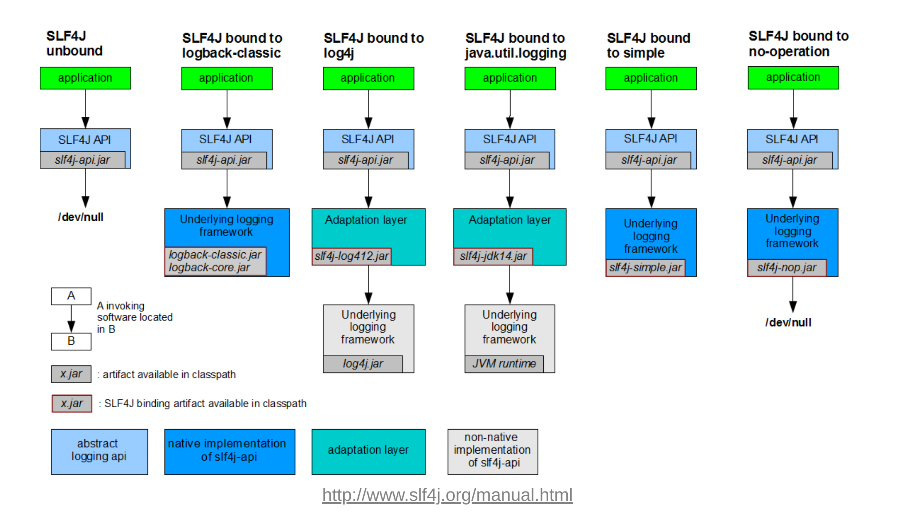

# Java 로깅 logger, log4j, logback, slf4j 비교

로그(log)는 소프트웨어의 이벤트를 시스템의 상태 및 동작 정보를 시간 경과에 따라 기록하는 것을 의미합니다.

소프트웨어 개발 과정 혹은 개발 후에 동작상태를 파악하여 문제가 발생했을 때 진단하고 해결하는데 도움이 됩니다.

또한 로그들은 운영과 관리에 도움이 되는 정보가 될 수 있으며 좋은 데이터가 되기도 합니다.

로그를 기록하는 행위를 로깅(logging)이라고 하며, Java 언어에서는 다양한 로깅 라이브러리를 지원합니다.

하지만 각각 로깅 라이브러리가 내부적으로 어떻게 동작하는지 모르면 성능상 이슈를 발생시킬 수 있기 때문에 

어떤 상황에서 어떤 로깅 라이브러리를 써야할지 잘 알고 사용하는 것이 좋습니다.


디버깅이나, System.out.println(이하 sysout)이랑 비교했을 때 로깅 라이브러리를 썼을때의 장점은 다음과 같습니다.

- 상황별로 Log Level을 지정하여 Level 별 메세지를 출력하여 Level별로 로깅 가능
- 프로그램 실행에 대한 흐름과 에러 확인 가능
- sysout에 비해 자유로운 파일, 클라우드, DB 등 출력 위치 및 다양한 출력 형식 지원
- 모듈 별, 파일별, 메소드별, 클래스별로 유연하게 메세지 출력 가능


자바 로깅 라이브러리 종류

* java.util.logging.Logger
* Log4J, log4j2
* Logback
* SLF4j

자바에서는 Log4j → Logback → Log4j2 시간 순으로 로깅 라이브러리가 개발되었습니다.

## Log Level별 용도

일반적으로 Log Level은 다음과 같이 사용하지만, 팀이나 회사의 규칙에 따라 다르기도 합니다.

| 로그 레벨 | 설명                                                         |
| --------- | ------------------------------------------------------------ |
| Trace     | 가장 상세한 로그 레벨로, 코드의 흐름을 따라가며 디버깅 정보를 기록합니다. |
| Debug     | 디버깅을 위한 로그 레벨로, 프로그램의 상태 및 실행 중에 발생하는 중요한 이벤트를 기록합니다. |
| Info      | 일반적인 정보를 기록하는 로그 레벨로, 프로그램의 주요 이벤트 및 상태 변경을 기록합니다. <br />에러는 아니지만 주시해야할 것 |
| Warning   | 예외적인 상황을 기록하는 로그 레벨로, 잠재적인 문제 또는 예상치 못한 동작을 알립니다.<br />예외상황이긴 했지만 에러는 아닌 것 |
| Error     | 심각한 에러를 기록하는 로그 레벨로, 예외 상황 또는 잘못된 동작을 나타냅니다.<br />에러가 맞고 대응해야할 것 |
| Fatal     | 가장 심각한 로그 레벨로, 치명적인 오류를 기록하고 프로그램의 중단 또는 비정상 종료를 알립니다.<br />치명적인 것 |

## System.out.println()을 로깅에 사용하면 안좋은 이유.

sysout(System.out)은 로깅에 사용하면 성능상 좋지 않습니다.

이유는 다음과 같습니다.

1. write()와 newLine()이 동기화(synchronized) 메서드이다.

System.out.println()이나 System.out.print() 메서드 둘다 내부적으로 write()랑 newLine()을 사용합니다. 내부적으로 **synchronized** 키워드를 이용해서 구현이 되어있습니다. 때문에 다른 스레드들은 접근하지 못해서 성능을 낮추게 되는 원인이 됩니다.


2. Blocking I/O이다.

내부적으로 시스템 콜을 호출하는 과정에서 블로킹으로 호출됩니다. 때문에 해당 I/O가 발생하는 작업시간동안 CPU가 놀게 되기 때문에 성능 저하의 원인이 됩니다.


또한 sysout은 로그들을 파일, DB, 클라우드 로그 저장소 등으로 저장하기 적합하지 않으며

로깅 라이브러리들은 이를 비동기, 논블로킹으로 이 문제를 해결해서 sysout보다는 비동기 논블로킹 방식으로 출력되는 로깅 라이브러리들을 사용하는 것이 좋습니다.


# java.util.logging.Logger

java언어의 java.util.logging 패키지에 속해있는 로깅용 유틸 클래스 입니다.

외부 라이브러리 사용이 필요 없으며 파일이나 콘솔에 로그 내용을 출력할 수 있습니다.

* https://docs.oracle.com/javase/8/docs/api/java/util/logging/Logger.html

7개로 분리된 Level별로 로그를 지원합니다. 위에서 아래로 중요도(high) -> low 수준 입니다. 

* SEVERE, 

* WARNING, 

* INFO, 

* CONFIG,

* FINE, 

* FINER, 

* FINEST

**사용 방법**

```java
import java.util.logging.Logger;

class JavaLogger {
		private static final Logger logger = Logger.getLogger(JavaLogger.class.getName());
		
		void method() {
			logger.log(Level.FINEST, "{0} log", "FINEST");
			logger.info("info log");
		}
}
```

#### 장점

* 외부 라이브러리 사용 없이 로깅이 가능하다. 

#### 단점

- 자바 1.4에 출시되었지만, 출시 시점에 이미 잘 만들어진 log4j가 존재하였습니다. 
- 다른 라이브러리와 비교했을 때 퍼포먼스 (속도) 가 느리다.
- Predefine 된 레벨의 개념이 명확하지 않다. Debug의 뜻으로 사용된 FINE이 무엇을 뜻하는지 처음 보면 알 수 있을까? FINE vs FINER vs FINEST의 차이점을 쉽게 구분할 수 없다.
- 나만의 custom 레벨을 만들면 메모리 누수가 일어난다.
- 메시지를 포맷팅하기에 유연하지 않으며 타 라이브러리에 비해 기능이 부족하다.

# Log4j

log4j는 가장 오래된 로깅 프레임워크로써 Apache의 Java기반 로깅 프레임 워크 입니다.

* https://ko.wikipedia.org/wiki/Log4j
* 2015년 기준으로 개발이 중단

 콘솔 및 파일 출력의 형태로 로깅을 도와주며 xml, properties로 환경을 구성할 수 있습니다. 

log4j는 다음과 같은 구성을 가지고 있습니다.

**log4j의 구성**

| 요소     | 설명                                                         |
| -------- | ------------------------------------------------------------ |
| Logger   | 출력할 메시지를 Appender에게 전달                            |
| Appender | 전달된 로그를 어디에 출력할 것인지 결정(Console, File, JDBC 등) |
| Layout   | 로그를 어떤 형식으로 출력할 것인지 결정                      |

**log4j의 로그 레벨** - 표준

| 로그 레벨 | 설명                                                         |
| --------- | ------------------------------------------------------------ |
| FATAL     | 아주 심각한 에러가 발생한 상태                               |
| ERROR     | 요청을 처리하는 중 문제가 발생한 상태                        |
| WARN      | 실행에는 문제가 없지만 향후 에러의 원인이 될 수있는 경고성 메세지 |
| INFO      | 상태변경과 같은 정보성 메세지                                |
| DEBUG     | 개발시 디버그 용도로 사용하는 메세지                         |
| TRACE     | 디버그 레벨 보다 상세한 이벤트를 나타내는 메시지             |

**사용 방법**

```java
import org.apache.logging.log4j.LogManager;
import org.apache.logging.log4j.Logger;

class Log4jLogger {
		private static Logger logger = LogManager.getLogger(Log4jLogger.class);

		void method() {
			logger.info("info log : {}", 1);
		}
}
```


이 log4j를 개선해서 새로 나온 것이 log4j2 입니다. 

Log4j는 기본적으로 SLF4J 를 지원하지 않고 추가적인 종속성을 추가해줘야 합니다.

개발이 중단된지 오래되었고, 성능적으로 더 개선되고 좋은 log4j2가 있기 때문에 이 라이브러리를 사용할 이유가 없습니다.

또한 이 Log4j의 뒤를 이어 SLF4J와 LogBack 프로젝트가 나오게 되었습니다. 

# SLF4j

SLF4J(Simple Logging Facade for Java)는  java.util.logging, logback 및 log4j와 같은 다양한 로깅 프레임 워크에 대한 추상화(인터페이스) 역할을 하는 라이브러리입니다. 

logger의 추상체로써, 인터페이스 이므로 SLF4j 인터페이스를 사용해서 로깅하게 되면 구현체만 갈아 끼우면 logback이나 log4j등으로

마이그레이션 할 수 있습니다.  

구현체로는 **logback**, **log4j2** 등이 있습니다.

 

초기의 Spring은 JCL(Jakarta Commons Logging)을 이용하여 로깅하였으나, GC가 제대로 동작하지 않는다는 단점이 있었고

이를 해결하기 위해 도입한것이 SLF4j이며 JCL의 문제를 해결하기 위해 클래스 로더 대신에 컴파일 시점에 구현체를 선택하도록 하였습니다. 



## SLF4J 구성요소

SLF4J는 세가지 구성요소를 갖습니다. 

- SLF4J API
  - SLF4J 를 사용하기 위한 인터페이스를 제공
  - slf4j-api-{version}.jar 를 통해 사용
  - **반드시 slf4j 바인딩은 하나만 사용한다**
    - SLF4J Binding은 SLF4J 인터페이스( = SLF4J API )를 로깅 구현체와 연결하는 어댑터 역할의 라이브러리

- SLF4J 바인딩
  - SLF4J 인터페이스를 로깅 구현체(logback 또는 log4j2)와 연결하는 어댑터 역할의 라이브러리

- SLF4J Bridging Modules
  - 다른 로깅 API로 Logger 호출을 할 때, SLF4J 인터페이스로 연결(redirect)하여 SLF4J API가 대신 Logger를 처리할 수 있도록 하는 어댑터 역할의 라이브러리
  - 다른 로깅 API ==> Bridge(redirect) ==> SLF4J API

# LogBack

logback이란 log4j 이후에 나왔으며 log4j 보다 향상되고 가장 널리 사용되고 있는 Java 로깅 라이브러리 입니다. 

* https://logback.qos.ch/reasonsToSwitch.html - 공식 문서

* https://github.com/qos-ch/logback

**slf4j의 구현체**로써 **SpringBoot의 기본 log**로 사용되고 있으며  spring-boot-starter-web안에 spring-boot-starter-logging의 logback이 기본적으로 포함되어 있어서 별다른 dependency 추가 없이 사용할 수 있습니다.

또한 Automatic Reloading 기능을 제공하여 별도에 재시작없이 설정을 변경하여 사용할 수 있습니다.

* ex) 특정 부분에서 더 자세한 로그를 봐야할 필요성이 있다면 INFO로 변경해야 하는데, 이를 서버의 종료 없이 컨트롤이 가능


**사용 방법**

* SpringBoot에서는 기본 log여서 따로 의존성을 추가할 필요가 없습니다. 

```java
import org.slf4j.Logger;
import org.slf4j.LoggerFactory;

class LogbackLogger {
		private static Logger logger = LoggerFactory.getLogger(LogbackLogger.class);

		void method() {
			logger.trace("Trace");
      logger.debug("Debug");
      logger.info("Info");
      logger.warn("Warn");
      logger.error("Error");
		}
}
```


# Log4j2

Log4j2는 Log4j를 보안한 라이브러리입니다. 그리고 Facade 패턴으로 구현되어 다른 Log 라이브러리들과 사용할 수 있습니다. 그 예로 LogBack의 앞에서 Facade 형태로 사용되어질 수 있습니다. 

* https://logging.apache.org/log4j/2.x/index.html

Log4j 2의 가장 눈에 띄는 기능들 가운데 하나는 비동기 성능입니다. Log4j 2는 [LMAX 디스럽터](https://ko.wikipedia.org/w/index.php?title=디스럽터&action=edit&redlink=1)를 활용하는데, 이 라이브러리는 커널 락의 필요성을 줄이며 12배만큼 로깅 성능을 제공합니다.

동일 환경에서 Log4j 2는 1초에 18,000,000개 이상의 메시지를 기록할 수 있는 반면 Logback과 Log4j 1 등은 초당 2,000,000개 미만의 메시지를 기록할 수 있다고 합니다. 

- 파일뿐만 아니라 HTTP, DB, Kafka에 로그를 남길 수 있으며 비동기적인 로거를 지원합니다.
- 로깅 성능이 중요시될 때 Log4j2 사용을 고려합니다.
- spring-boot-starter-web 모듈에 Logback을 사용하는 spring-boot-starter-logging 모듈이 포함되어있습니다.
- Log4j2 사용을 위해서는 spring-boot-starter-logging 모듈을 exclude하고 spring-boot-starter-logging-log4j2 의존성을 주입해야 합니다.
- Logback과 달리 멀티 쓰레드 환경에서 비동기 로거(Async Logger)의 경우 Log4j 1.x 및 Logback보다 성능이 우수합니다.

* **2021년 말, 최대 보안 이슈인 Apache Log4j2의 보안 취약점이 발견되었으며 글을 쓰는 현재는 최신 버전으로 업데이트 했을 경우 해당 문제를 해결할 수 있습니다.**
  * https://www.whatap.io/ko/blog/100/


# 무엇을 사용할까?

따라서, 로깅할 양이 많고 로깅에 성능이 중요하다면 Logback보단 Log4j2를 사용하는 것이 좋습니다.

또한 Logback, Log4j2 둘 다SLF4j를 구현하고 있기 때문에 구현을 교체하기에 편리합니다.


Logback과 Log4j2의 성능을 비교한 좋은 글들이 있습니다.

* https://morethantoday.tistory.com/84?category=853479
* https://www.fwantastic.com/2019/12/javautillogging-vs-log4j-vs-slf4j.html

* https://hamryt.tistory.com/m/9

* https://sujl95.tistory.com/64


### 참조

* https://stackoverflow.com/questions/18539031/slf4j-bridge-vs-migrator-jars
* https://www.slf4j.org/legacy.html
* https://stackoverflow.com/questions/18539031/slf4j-bridge-vs-migrator-jars
* https://www.slf4j.org/manual.html
* https://inyl.github.io/programming/2017/05/05/slf4j.html

* https://velog.io/@dailylifecoding/java-logging-with-slf4j-and-logback

* https://dev-donghwan.tistory.com/128