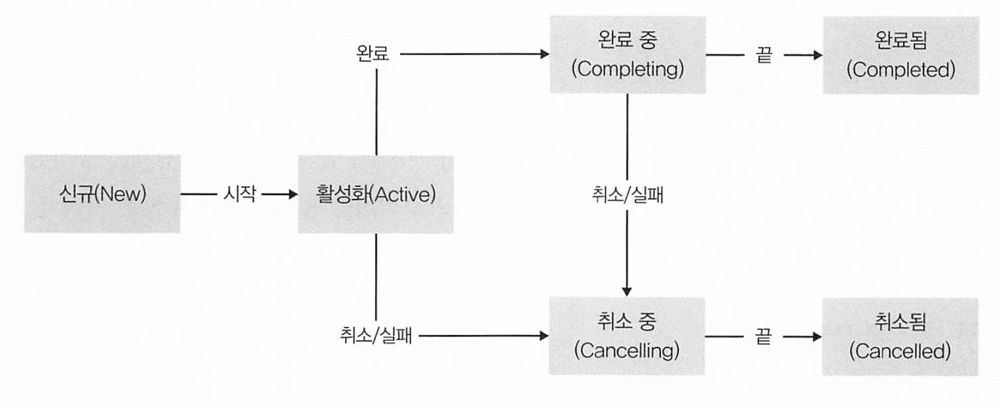

# [코틀린]코루틴(coroutine)이란? 

- co : with, togher 
- routine : 규칙적으로 하는일의 통상적인 순서와 방법
- coroutine : co + routine의 합성어로 협동루틴

> 코루틴은 코틀린만의 것이 아닙니다. 
>
> 이름이 비슷해서 코틀린의 것이라고 생각할 수 있지만 파이썬, C#, Go, Javascript 등 여러 언어에서 지원하고 있는 동시성 프로그래밍 개념입니다. 


코루틴은 코루틴이 시작된 스레드를 중단하지 않으면서 비동기적으로 실행되는 코드입니다.

코루틴은 비동기 프로그래밍을 지원하는데 유용합니다. 예를 들어, 네트워크 연결을 통해 데이터를 가져오는 작업을 수행하면서 다른 작업을 수행할 수 있도록 해주는 것이 바로 코루틴입니다. 이러한 방식으로 코루틴은 다중 작업(multitasking)을 가능하게 하며, 다른 비동기 작업과 함께 동작할 수 있습니다.


코루틴에서는 아래와 같이 3가지 스레드를 선언하고, 동기는 lanuch, 비동기는 async로 표현합니다.

- **Main**: 메인 스레드. 화면 UI 작업 등을 하는 곳
- **IO**: 네트워크, DB 등 백그라운드에서 필요한 작업을 하는 곳
- **Default**: 정렬이나 무거운 계산 작업 등을 하는 곳


> [위키피디아 코루틴](https://en.wikipedia.org/wiki/Coroutine)
>
> **코루틴은 실행을 일시 중단하고 재개할 수 있도록 해서 비선점형 멀티태스킹을 위한 서브 루틴을 일반화하는 컴퓨터 프로그램 구성 요소**다. 코루틴은 협력 작업, 예외, 이벤트 루프, 반복자, 무한 목록 및 파이프와 같은 친숙한 프로그램 구성 요소를 구현하는 데 적합하다.
> 서브루틴은 코루틴의 특수한 경우다. 
>
> 서브루틴이 호출되면 시작하고 종료되면 서브루틴도 종료된다. 서브루틴의 인스턴스는 한 번만 반환하고 호출 사이에 상태를 유지하지 않는다. 대조적으로 **코루틴은 다른 코루틴을 호출해 종료할 수 있으며 나중에 원래 코루틴에서 호출된 지점으로 돌아갈 수 있다. 코루틴의 관점에서 보면 종료되는 게 아니라 다른 코루틴을 호출하는 것이다. 따라서 코루틴 인스턴스는 상태를 유지하고 호출마다 다르다. 한 번에 주어진 코루틴의 여러 인스턴스가 있을 수 있다.** 다른 코루틴에 "양보"해서 다른 코루틴을 호출하는 것과 단순히 다른 루틴을 호출하는 것(그러면 원래 지점으로 돌아감)의 차이는 서로에게 양보하는 두 코루틴 간의 관계가 호출자의 관계가 아니란 것이다
>
> **코루틴은 쓰레드와 매우 유사하다. 그러나 코루틴은 협력적으로 멀티태스킹되는 반면 쓰레드는 일반적으로 선점형으로 멀티태스킹된다. 코루틴은 동시성을 제공하지만 병렬성은 제공하지 않는다.** 쓰레드에 비해 코루틴의 장점은 실시간 컨텍스트에서 사용할 수 있다는 것이다(코루틴 간 전환에는 시스템 호출이나 차단 호출이 불필요함) 뮤텍스, 세마포어 등과 같은 동기화 기본 요소가 불필요하다. 크리티컬 섹션을 보호하기 위해 OS 지원이 필요하지 않다. 호출 코드에 투명하게 미리 예약된 쓰레드를 써서 코루틴을 구현하는 게 가능하지만 일부 이점(실시간 작업에 대한 적합성과 이들 간의 전환이 상대적으로 저렴함)이 손실된다


코루틴의 주목할만한 기능은 다음과 같습니다.

- 경량(LightWeight): 코루틴을 실행 중인 스레드를 차단하지(block) 않는 정지(suspension)를 지원하므로 단일 스레드에서 많은 코루 틴을 실행할 수 있습니다. 정지(suspension)는 많은 동시 작업(concurrunt operation)을 지원하면서도 차단보다 메모리를 절약합니 다.
   메모리 누수 감소: 구조화된 동시 실행(structured concurrency)을 사용하여 범위(scope) 내에서 작업을 실행합니다
- 기본으로 제공되는 취소 지원: 실행 중인 코루틴 계층 구조를 통해 자동으로 최소가 전달됩니다.
- Jetpack 통합: 많은 Jetpack 라이브러리에 코루틴을 완전히 지원하는 확장 프로그램이 포함되어 있습니다. 일부 라이브러리는 구조화 된 동시 실행에 사용할 수 있는 자체 코루틴 범위도 제공합니다.


**코루틴의 장점**

1. 메모리 사용량이 적다. 코루틴은 일반적인 스레드처럼 많은 메모리를 필요로 하지 않는다.
2. 코루틴은 다른 작업과 함께 동작할 수 있다. 이는 비동기 작업을 수행하면서 다른 작업을 동시에 수행할 수 있도록 해주어 프로그램의 성능을 향상시킬 수 있다.
3. 코루틴은 더 높은 수준의 추상화를 제공한다. 이는 프로그래밍의 복잡도를 낮추고 코드의 가독성을 높일 수 있다.

**코루틴의 단점**

1. 코루틴은 일반적으로 스레드보다 느리다. 이는 코루틴이 단일 스레드에서 실행되는 반면, 스레드는 여러 개의 코어를 사용하여 병렬로 실행될 수 있기 때문이다.
2. 코루틴은 동시에 실행되는 코드 블록의 수를 제한한다. 이는 코루틴이 오버헤드를 줄이기 위해 한 번에 동시에 실행할 수 있는 코드 블록 수를 제한하기 때문이다.


코루틴은 비동기 프로그래밍을 지원하고 다중 작업을 가능하게 하며, 메모리 사용량이 적고 높은 수준의 추상화를 제공합니다. 

하지만 일반적으로 스레드보다 느리며, 동시에 실행되는 코드 블록의 수를 제한합니다.


### 코루틴 사용을 위한 의존성 추가

기본적으로 코루틴을 사용하기 위해서 아래와 같은  build.gradle.kt 파일에 dependecy를 추가 해야합니다. 

```kotlin
implementation("org.jetbrains.kotlinx:kotlinx-coroutines-core:1.6.2")
```

그리고 코틀린 파일에서 아래와 같은 import를 해줘야 코틀린 구문을 사용할 수 있습니다.

```kotlin
import kotlinx.coroutines.*
```


## suspend 키워드와 suspend fun

사전적의미 : 중단, 일시중단

* 시작하고, 멈추고, 다시 시작할 수 있다는 의미이다.

Kotlin에서 `suspend`는 일시 중단 가능한(coroutine) 함수를 선언하기 위한 키워드입니다

```kotlin
suspend fun {}
```

`suspend` 함수는 일반 함수와 마찬가지로 코드 블록 내에 로직을 작성하지만, 중간에 일시 중단이 가능하고, 다른 코드 블록이 실행된 후 다시 돌아와 실행을 이어나갈 수 있습니다. 

suspend 키워드가 붙은 function은 잠시 중단하여 다른 함수가 실행될 수 있도록 한다.

* **suspend fun은 Coroutine Scope 내에서만 사용 가능하다.**

  


thread가 block 될 경우 해당 쓰레드는 다른 작업을 할 수 없어 해당 Thread는 중지 상태이지만,

suspend function을 사용한다면 thread가 blocked 된 상태가 되면 그 작업을 suspend(일시 중단)하고 다른 thread에서 작업을 할 수 있습니다.

마찬가지로 suspend fun(일시중단 함수) 내부에서는 다른 suspend fun을 호출할 수 있으며 코루틴 내부에서만 쓸 수 있습니다. 

따라서, suspend 키워드를 이용해 하나의 thread 에서 여러 개의 coroutine 을 실행할 수 있게 되고,  특정 작업이 suspend 되고 resume 될 때까지 다른 작업을 수행할 수 있습니다. 

## CoroutineScope

```kotlin
public interface CoroutineScope {
    public val coroutineContext: CoroutineContext
}
```

`CoroutineScope`는 코루틴을 실행하기 위한 스코프를 나타냅니다. 스코프는 코루틴이 실행될 수 있는 범위를 정의하며 CoroutineContext 하나만 맴버 속성으로 정의하고 있는 인터페이스 입니다.

* (CoroutineContext 는 Coroutine을 어떻게 처리 할지에 대한 정보를 가지고있는 객체입니다.)


새로운 coroutine을 실행하기 위한 범위를 정의하고, 구조적인 동시성을 위해 모든 코루틴은 CoroutineScope에서만 실행할 수 있도록 제어합니다. 

* suspend fun는 CoroutineScope 안에서만 실행이 가능합니다. 

이 CoroutineScope가 중요한 이유는, 한 스레드, 프로세스에서 수백개의 코루틴을 실행할 수 있습니다만 

코루틴들이 작업이 끝났는지 추적하지 않아 메모리 누수가 발생할 수 있습니다.

이 문제를 스코프를 이용해서 관리하여 해결합니다. 

  


`CoroutineScope`를 사용하면 코루틴을 시작하고 취소할 수 있습니다. 

예를 들어, `launch` 또는 `async` 함수를 사용하여 새로운 코루틴을 시작하고, `cancel` 함수를 사용하여 코루틴을 취소할 수 있습니다.

## CoroutineContext

```kotlin
@SinceKotlin("1.3")
public interface CoroutineContext {

    public operator fun <E : Element> get(key: Key<E>): E?

    public fun <R> fold(initial: R, operation: (R, Element) -> R): R

    public operator fun plus(context: CoroutineContext): CoroutineContext =
        if (context === EmptyCoroutineContext) this else // fast path -- avoid lambda creation
            context.fold(this) { acc, element ->
                val removed = acc.minusKey(element.key)
                if (removed === EmptyCoroutineContext) element else {
                    val interceptor = removed[ContinuationInterceptor]
                    if (interceptor == null) CombinedContext(removed, element) else {
                        val left = removed.minusKey(ContinuationInterceptor)
                        if (left === EmptyCoroutineContext) CombinedContext(element, interceptor) else
                            CombinedContext(CombinedContext(left, element), interceptor)
                    }
                }
            }

    public fun minusKey(key: Key<*>): CoroutineContext

    public interface Key<E : Element>

    public interface Element : CoroutineContext {

        public val key: Key<*>

        public override operator fun <E : Element> get(key: Key<E>): E? =
            @Suppress("UNCHECKED_CAST")
            if (this.key == key) this as E else null

        public override fun <R> fold(initial: R, operation: (R, Element) -> R): R =
            operation(initial, this)

        public override fun minusKey(key: Key<*>): CoroutineContext =
            if (this.key == key) EmptyCoroutineContext else this
    }
}

```

CoroutineContext는 코루틴이 실행될 때 필요한 여러 가지 정보를 제공하는 인터페이스이며, 실행되는 문맥(환경)이라는 의미 입니다. 

Context는 키-값 쌍으로 이뤄진 불변 컬렉션이며, 코루틴의 실행을 제어하고 관리하는 데 사용되고, Dispatcher와 Job을 조합하여 구성할 수 있습니다.

코루틴 실행에 필요한 정보에는 코루틴이 실행될 스레드 또는 스레드 풀, 예외 처리 방법, 실행 시간 제한 등이 포함될 수 있습니다.

모든 코루틴은 CoroutineContext를 필요로 하며, Dispatcher 와 Job은 CoroutineConetext를 상속받습니다.

- Job : 코루틴의 작업을 관리하는데 사용 (`join()`, `cancel()`, `cancelAndJoin()`, `isActive`, `isCancelled`, `isCompleted`...)
- Dispatcher : 코루틴이 실행되는 스레드를 제어하는 데 사용 (`Dispatchers.Default`, `Dispatchers.IO`...)

  


`CoroutineContext`는 일반적으로 `CoroutineScope`를 통해 생성되며, CoroutineContext는 해당 CoroutineScope의 것을 상속합니다.  `CoroutineScope`를 사용하여 `CoroutineContext`를 생성하면 이를 사용하여 새로운 코루틴을 시작할 수 있습니다. 

예를 들어, `launch` 또는 `async` 함수를 사용하여 새로운 코루틴을 시작할 때, `CoroutineContext`를 명시하지 않거나, 

해당 Context에 Dispatcher나 다른 ContinuationInterceptor가 없으면 Dispatchers.Default가 지정됩니다.

  


키 - 값 쌍으로 이뤄진 불변 컬렉션이라서 CorutineContext.Element를 구현하는 아무 데이터나 저장할 수 있으며  특정 원소에 접근하려면 get() 메서드나 인덱스 연산자 [ ] 에 키를 넘겨야 합니다.

기본적으로 launch(), async() 등의 표준 코루틴 빌더에 의해 만들어지는 코루틴은 현재 Context를 이어받습니다. 

필요하면 빌더 함수에 context 파라미터를 지정해서 새 Context를 넘길 수도 있습니다.

### Coroutine Context 연산

새 Context를 만들려면 두 Context의 데이터를 합쳐주는 plus() 함수/+ 연산자를 사용하거나, minusKey 함수를 사용하면 됩니다.

* get() : 연산자(operator) 함수로써 주어진 key 에 해당하는 컨텍스트 요소를 반환합니다.

* fold() : 초기값(initialValue)을 시작으로 제공된 병합 함수를 이용하여 대상 컨텍스트 요소들을 병합한 후 결과를 반환합니다. 예를들어 초기값을 0을 주고 특정 컨텍스트 요소들만 찾는 병합 함수(filter 역할)를 주면 찾은 개수를 반환할 수 있고, 초기값을 EmptyCoroutineContext 를 주고 특정 컨텍스트 요소들만 찾아 추가하는 함수를 주면 해당 요소들만드로 구성된 코루틴 컨텍스트를 만들 수 있습니다.

* plus() : 현재 컨텍스트와 파라미터로 주어진 다른 컨텍스트가 갖는 요소들을 모두 포함하는 컨텍스트를 반환합니다. 현재 컨텍스트 요소 중 파라미터로 주어진 요소에 이미 존재하는 요소(중복)는 버려집니다.

* minusKey() : 현재 컨텍스트에서 주어진 키를 갖는 요소들을 제외한 새로운 컨텍스트를 반환합니다.

## Dispatcher (CoroutineDispatcher)

**디스패처는** 특정 코루틴을 실행할 때 사용할 스레드를 제어하는 작업을 담당하는 컴포넌트 입니다.

```kotlin
public actual object Dispatchers { 
  ...
}
```

코루틴이 실행될 스레드 또는 스레드 풀이라고 생각해도 됩니다 . 

* 디스패처는 코루틴 문맥의 일부로, launch()나 runBlocking() 등의 코루틴 빌더 함수에서 이를 지정할 수 있다.
* 디스패처는 그 자체가 원소가 하나뿐인 문맥이기도 하므로 코루틴 빌더에 디스패처를 넘길 수 있다.

* 디스패처는 코루틴 문맥의 일부로, launch()나 runBlocking() 등의 코루틴 빌더 함수에서 이를 지정할 수 있다.
* 디스패처는 그 자체가 원소가 하나뿐인 문맥이기도 하므로 코루틴 빌더에 디스패처를 넘길 수 있다.

```kotlin
fun main() {
    runBlocking {
        // 전역 스레드 풀 디스패처를 사용해 코루틴을 실행한다.
        launch (Dispatchers.Default ) {
            println(Thread.currentThread().name)
        }
    }

}
// DefaultDispatcher-worker-1
```

코루틴 디스패처는 자바 Executor와 비슷합니다.

실제로 asCoroutineDispacher() 확장 함수를 사용하면 기존 Executor 구현을 그에 상응하는 코루틴 디스패처로 바꿀 수 있습니다다.

```kotlin
fun main() {

    val id = AtomicInteger(0)

    val executor = ScheduledThreadPoolExecutor(5) { runnable ->
        Thread(
            runnable,
            "WorkerThread-${id.incrementAndGet()}"
        ).also { it.isDaemon = true }
    }

    executor.asCoroutineDispatcher().use { dispatcher ->
        runBlocking {
            for (i in 1..3) {
                launch(dispatcher) {
                    println(Thread.currentThread().name)
                    delay(1000)
                }
            }
        }
    }

}
//출력
WorkerThread-1
WorkerThread-2
WorkerThread-3
```

* 실행하는 쓰레드에 WorkerThread1, 2 등의 이름을 부여하여 커스텀 스레드 팩토리를 사용하는 풀 기반의 Executor를 정의한다.
* 명시적으로 작업자 스레드를 데몬 스레드(isDaemon = true)로 지정해서 코루틴 실행이 끝난 후에 프로그램이 종료되지 못하는 일이 없게 해야한다.
* 구체적인 실행 결과는 다를 수 있다.

ExecutorService의 인스턴스에 대해 asCoroutineDispatcher()를 호출하면 ExecutorCoroutineDispatcher를 반환하는데,

이 디스패처는 Closeable 인스턴스도 구현하므로 시스템 자원을 해제하려면 

close() 함수를 직접호출하거나 use() 함수 블록 안에서 디스패처를 사용해야 합니다.

  

코루틴 라이브러리에서는 기본적으로 몇 가지 디스패처를 재공합니다. 

### 기본적으로 제공되는 디스패처의 종류들

[공식문서 - dispatchers](https://kotlinlang.org/api/kotlinx.coroutines/kotlinx-coroutines-core/kotlinx.coroutines/-dispatchers/)

* **Dispatchers.Default** : 공유 쓰레드 풀로 풀 크기는 디폴트로 사용 가능한 CPU 코어 수이거나 2다(둘 중 큰값.)

  * 이 구현은 일반적으로 작업 성능이 주로 CPU 속도에 의해 결정되는 CPU 위주의 작업에 적합하다.
  * 많은 리스트를 정렬하는 작업같이 CPU 부하가 많은 작업을 할 때 사용하는것에 적합

* **Dispatchers.IO** : 스레드 풀 기반이며 디폴트와 비슷하지만 파일을 읽고 쓰는것처럼 잠재적으로 블로킹 될 수있는 I/O를 많이 사용하는 작업에 최적화 돼 있다.

  * 공유된 스레드 풀에있는 백그라운드 스레드에서 작동
  * 필요에 따라 스레드를 추가하거나 종료시켜 준다
  * 로컬 DB, 네트워크 작업, 파일 I/O 작업 

* **Dispatchers.Main**: 사용자 입력이 처리되는 UI 스레드에서만 배타적으로 작동하는 디스패처

  * 메인스레드에서 코루틴이 실행
  * ui, suspending, LiveData에서 수정사항을 가져오는 등 작고 가벼운 작업이 좋다 .

  * 권장 사항은 코루틴을 메인 스레드에서 시작하되 백그라운드 스레드로 변경하여 시작하기.

* **Dispatchers.Unconfined** : 특정 스레드에 국한되지 안는 코루틴 디스패처

  * GlobalScope와 함께 사용된다
  * 이 디스패처에서 시작된 중첩 코루틴은 스택 오버플로를 방지하기 위해 이벤트 루프를 형성
  * 코루틴이 현재 스레드에서 작동하고, 중단되고 다시 시작되면 중단된 스레드에서 시작한다.


### 커스텀 스레드 풀을 사용하는 디스패처


newFixedThreadPoolContext()나 newSingleThreadPoolContext()를 사용하면 커스텀 스레드 풀을 사용하는 디스패처도 만들 수 있습니다. 

```kotlin
@Suppress("EXPERIMENTAL_API_USAGE")
fun main() {
    newFixedThreadPoolContext(5, "WorkerThread").use { dispatcher ->
        runBlocking {
            for (i in 1..3) {
                launch(dispatcher) {
                    println(Thread.currentThread().name)
                    delay(1000)
                }
            }
        }
    }
}

```

* newFixedThreadPoolContext()나 newSingleThreadPoolContext()가 실험적인 기능으로 표시되어 있고, 향후 공유 스레드 풀을 기반으로 하는 더 새로운 함수로 대치될 예정이기 때문에 컴파일러는 경고를 한다.

디스패처를 명시적으로 지정하지 않으면, 코루틴을 시작한 영역으로부터 디스패처가 자동으로 상속됩니다.

```kotlin
fun main() {

    runBlocking {
        println("Root: ${Thread.currentThread().name}")

        launch {
            println("Nested, inherited: ${Thread.currentThread().name}")
        }

        launch(Dispatchers.Default) {
            println("Nested, explicit: ${Thread.currentThread().name}")
        }
    }
}
// 결과
Root: main
Nested, explicit: DefaultDispatcher-worker-1
Nested, inherited: main
```

부모 코루틴이 없으면 암시적으로 Dispatchers.Default로 디스패처를 가정한다.

* Default는 공유 쓰레드 풀

* 다만 runBlocking() 빌더는 현재 스레드를 사용합니다.

디스패처를 withContext() 함수를 사용해 오버라이드 할 수도 있습니다. 

```kotlin
@Suppress("EXPERIMENTAL_API_USAGE")
fun main() {
    newSingleThreadContext("Worker").use { worker ->
        runBlocking {
            println(Thread.currentThread().name)   // main
            withContext(worker) {
                println(Thread.currentThread().name) // Worker
            }
            println(Thread.currentThread().name)   // main
        }
    }
}
// 결과
main
Worker
main
```

* 이 기법은 중단 가능한 루틴의 일부를 한 스레드에서만 실행하고 싶을 때 유용하다

## GlobalScope

`GlobalScope`는 Kotlin 코루틴에서 전역적으로 사용할 수 있는 기본 `CoroutineScope`입니다. `GlobalScope`는 애플리케이션 전체에서 사용할 수 있으며, `CoroutineScope`를 직접 만들지 않고도 코루틴을 시작할 수 있습니다.

```kotlin
public object GlobalScope : CoroutineScope {
    override val coroutineContext: CoroutineContext
        get() = EmptyCoroutineContext
}
```

* EmptyCoroutineContext를 context로 사용하는 CoroutineScope를 반환합니다.

키워드를 보면 알겠지만, object로 생성된 싱글톤 객체여서 생명주기를 관리하는 주체가 개발자가 아닌 애플리케이션이 됩니다.

`GlobalScope`를 사용하여 코루틴을 시작하면, 코루틴의 생명 주기는 애플리케이션 전체의 생명 주기에 따라 결정됩니다. 

따라서 `GlobalScope`를 사용하여 생성된 코루틴은 애플리케이션이 종료될 때까지 유효합니다. 

이러한 이유로 `GlobalScope`를 사용하여 코루틴을 시작하는 것은 권장되지 않습니다. 

대신 `CoroutineScope`를 사용하여 새로운 스코프를 만들고, 해당 스코프에서 코루틴을 시작하는 것이 좋습니다.


## Coroutine Builder

코루틴 스코프 (Coroutine Scope)의 확장 함수로써 새 코루틴 스코프를 만들고 새로운 코루틴을 실행하기 위해 사용됩니다.


### runBlocking builder

* https://kotlinlang.org/api/kotlinx.coroutines/kotlinx-coroutines-core/kotlinx.coroutines/run-blocking.html

```kotlin
public actual fun <T> runBlocking(context: CoroutineContext, block: suspend CoroutineScope.() -> T): T
```

runBlocking{} 블록은 주어진 블록의 작업이 완료될때까지 현재 스레드를 멈추는 새로운 코루틴을 생성하여 실행하는 코루틴 빌더입니다.

runBlocking은 새 코루틴을 실행하고 작업이 완료될 때까지 **현재 스레드를 blocking** 시키기 때문에, Coroutine의 목적과는 맞지 않으며, 공식 문서에서도 사용을 지양하므로 코루틴에서 사용하면 안됩니다.

```kotlin
fun main() {

    runBlocking {
        println("start runBlocking")
        delay(100)
        println("end runBlocking")
    }

    println("main end")
}
// 결과
start runBlocking
end runBlocking
main end
```

CoroutineDispatcher가 컨텍스트에서 명시적으로 지정되면 새 코루틴은 현재 스레드가 차단되는 동안 지정된 디스패처의 컨텍스트에서 실행됩니다. 이 blocking된 스레드가 인터럽트 되면 코루틴 job이 취소되고 **interruptedException**이 발생합니다.

### async Builder

```kotlin
public fun <T> CoroutineScope.async(
    context: CoroutineContext = EmptyCoroutineContext,
    start: CoroutineStart = CoroutineStart.DEFAULT,
    block: suspend CoroutineScope.() -> T
): Deferred<T> {
  val newContext = newCoroutineContext(context)
	...
  return coroutine
}
```

현재 스레드를 blocking하지 않고 새로운 코루틴을 실행하는 async한 코루틴을 만드는 builder입니다.

async() 함수는 일반적으로 백그라운드 스레드에서 수행되는 작업을 나타내며, 결과 값을 반환하거나 예외를 던질 수 있습니다.

때문에 async() 빌더는 결과가 필요할 때 사용하며 Deferred의 인스턴스를 돌려주고 이 인스턴스는 Job의 하위 타입으로 await() 메서드를 통해 계산 결과에 접근할 수 있게 해줍니다.

```kotlin
suspend fun main() {

    val async = CoroutineScope(Dispatchers.Default).async {
        println("start async")
        delay(100)
        println("end async")
    }

    val async1 = GlobalScope.async {
        println("async1 start")
    }

    val async2 = GlobalScope.async {
        println("async2 start")
    }

    async.await()
    async1.await()
    async2.await()
    println("main end")
}

// 출력
async1 start
async2 start
start async
end async
main end
```

* `Deferred<T>` 의 인스턴스를 반환한다. 값을 얻기 위해서 await()함수를 사용.

* Deferred 인터페이스는 job인터페이스를 확장한 것 그래서 우리는 Deferred 인스턴스를 코루틴을 취소하는 것 같이 job처럼 사용할 수 있다.

* 결과 값을 반환받고 싶은 경우에 Aysnc Builder를 사용.

* 자바의 future에 해당하는 빌더라고 생각할 수 있다.
* await()는 계싼이 완료되거나 계산 작업이 취소될 때까지 현재 코루틴을 일시 중단시키며 작업이 취소되는 경우 await()는 예외를 발생시키면서 실패한다.

### launch builder

```kotlin
public fun CoroutineScope.launch(
    context: CoroutineContext = EmptyCoroutineContext,
    start: CoroutineStart = CoroutineStart.DEFAULT,
    block: suspend CoroutineScope.() -> Unit
): Job {
    val newContext = newCoroutineContext(context)
  	...
    return coroutine
}
```

현재 쓰레드를 blocking 않고 새 코루틴을 시작하며, 이에 대한 참조를 Job 객체로 반환하는 builder입니다.  

이 Job이 취소되면 코루틴이 취소 됩니다.

launch() 빌더는 동시성 작업이 결과를 만들어 내지 않는 경우에 적합하므로 Unit 타입을 반환하는 람다를 인자로 받습니다

즉, 리턴 값이 없는 코루틴을 위해 사용합니다.

* block 함수의 반환형이 Unit으로 없다고 할 수 있다.
* Job 객체를 반환한다. 

```kotlin
suspend fun main() {

    val async = CoroutineScope(Dispatchers.Default).launch {
        println("start launch")
        delay(100)
        println("end launch")
    }


    val async1 = GlobalScope.launch {
        println("launch1 start")
    }

    val async2 = GlobalScope.launch {
        println("launch2 start")
    }

    async.join()
    async1.join()
    async2.join()
    println("main end")
}

// 출력
launch2 start
launch1 start
start launch
end launch
main end
```

## 코루틴 흐름제어와 잡(Job) 생명주기

Job은 동시성 작업의 생명주기를 표현하는 객체로 코루틴의 수행을 나타냅니다.

`Job`은 코루틴의 상태 및 취소를 관리하고, 코루틴이 완료될 때까지 대기하는 데 사용됩니다. 

잡을 사용하면 작업 상태를 추적하고 필요할 때 작업을 취소할 수 있습니다

```kotlin
public interface Job : CoroutineContext.Element {
	...
}
```



* Active : 작업이 시작됐고 완료나 취소로 끝나지 않은 상태. 디폴트 상태. 생성되자마자 활성화(active) 상태가 된다.
  * CoroutineStart.DEFAULT : 디폴트 동작. 잡을 즉시 시작
  * CoroutineStart.LAZY : 잡을 자동으로 시작하지 말라느는뜻. 신규 상태가 되어 시작을 기다리게 됌 

async의 반환형인 Deferred 인터페이스를 코드상에서 확인해보면, Job 인터페이스를 상속받는 것을 확인할 수 있습니다.

```kotlin
public interface Deferred<out T> : Job { ... }
```

Job이 다른 Job을 시작할수도 있는데 이 경우 새 Job은 기존 Job의 자식이 됩니다

* Job의 부모 자식 관계는 동시성 계산 사이에 트리 형태의 의존구조를 만든다.

또한 children 프로퍼티를 통해 완료되지 않은 자식 잡들을 얻을 수 있습니다

```kotlin
fun main() {

    runBlocking {
        val job = coroutineContext[Job.Key]!!

        launch { println("Task A") }
        launch { println("Task B") }

        println("${job.children.count()} is running")
    }
}
// 결과
2 is running
Task A
Task B
```

Job의 join() 메서드를 사용하면 조인 대상 잡이 완료될 때 까지 현재 코루틴을 일시 중단시킬 수 있습니다

```kotlin
fun main() {

    runBlocking {
        val job = coroutineContext[Job.Key]!!

        val jobA = launch { println("Task A") }
        val jobB = launch { println("Task B") }

        jobA.join()
        jobB.join()
        println("${job.children.count()} is running")
    }
}
// 결과
Task A
Task B 
0 is running
```

현재 Job의 상태를 잡의 isActive, isCancelled, isComplete 프로퍼티로 부터 추적할 수 있습니다

이에 대한 정보는 Job 인터페이스 문서에서 볼 수 있습니다. 

### Job의 상태

| 상태                 | isActive | isCompleted | isCancelled |
| -------------------- | -------- | ----------- | ----------- |
| 신규( New)           | false    | false       | false       |
| 활성화 (Active)      | true     | false       | false       |
| 완료 중 (Completing) | true     | false       | false       |
| 취소중 (Cancelling)  | false    | false       | true        |
| 취소됨 (Cancelled)   | false    | true        | true        |
| 완료됨 (Completed)   | false    | true        | false       |

* 완료됨, 취소됨 Job의 isCompleted가 true 라는 점에 유의하라.
* Job 외부에서 활성화된 작업과 완료 중인 작업을 구분할 수 없다

### Job 취소

Job의 cancel() 메소드를 호출하면 Job을 취소할 수 있습니다

계산을 중단시킬 수 있는 표준적인 방법이며, 취소 가능한 코루틴이 스스로 취소가 요청됐는지 검사해서 적절히 반응해줘야 합니다

```kotlin
suspend fun main() {
    
    val squarePrinter = GlobalScope.launch(Dispatchers.Default) {
        var i = 1
        while (isActive) {
            println(i++)
        }
    }

    delay(100) // 자식 잡이 어느 정도 실행될 시간을 준다
    squarePrinter.cancel()

}
```

* isActive 확장 프로퍼티는 현재 Job이 활성화된 상태인지 검사한다.
* 부모 코루틴이 cancel() 메서드를 호출하면 squarePrinter의 상태가 취소 중으로 바뀌고 그다음 isActive 검사를 통해 루프를 종료시킬 수 있다.

다른 방법은 상태(isActive)를 검사하는 대신 CancellationException을 발생시키면서 취소에 반응할 수 있게 일시 중단 함수를 호출하는 것입니다.

이는 Job을 취소하는 과정이 진행 중이라는 사실을 전달하는 토큰 역할을 하기 위해 코루틴 라이브러리 내에서 쓰이는 예외이다.

코루틴 라이브러리에 정의된 delay()나 join() 등의 모든 일시 중단 함수가 이 예외를 발생시킵니다.

yield() 메서드는 실행 중인 잡을 일시 중단 시켜서 자신을 실행 중인 스레드를 다른 코루틴에게 양보합니다.

* (마치 Thread.yield()와 비슷) 


부모 코루틴이 취소되면 자동으로 모든 자식의 실행을 취소합니다. 

```kotlin
fun main() {

    runBlocking {
        println("Parent task started")

        launch {
            println("Task A started")
            delay(200)
            println("Task A finished")
        }

        launch {
            println("Task B started")
            delay(200)
            println("Task B finished")
        }

        delay(100)
        println("Parent task finished")
    }
    println("Shutting down...")

}
// 출력
Parent started
Child 1 started
Child 2 started
```

* 부모 잡이 100미리초 만에 취소되므로 세 잡중 어느 하나도 완료 상태에 도달하지 못한다.

## 코루틴 타임아웃 (Coroutine TimeOut)

시간이 너무 길어져 허용할 수 있는 시간을 넘어섰을 경우  타임아웃(Timeout)을 지정하고 이 시간을 넘어설 경우 해당 작업을 취소하도록 구현할 수 있습니다. 작업이 완료되기를 무작정 기다릴 수 없을때 타임아웃을 사용합니다.

**withTimeout() 함수**

```kotlin
fun main() {
    runBlocking {
        val asyncData = async { File("data.txt").readText() }
        try {
            val text = withTimeout(50) { asyncData.await() } // 
            println("Data loaded: $text")
        } catch (e: Exception) {
            println("Timeout exceeded")
        }
    }
}

```

* 파일을 50미리초 안에 읽을 수 있다면 withTimeout()은 결과를 돌려주고, 읽지 못한다면 TimeoutCancellationException을 던진다.

비슷한 함수로 withTimeoutOrNull()이 있는데, 이 함수는 타임아웃이 발생하면 예외를 던지는 대신 널 값을 돌려줍니다.


## 코루틴 예외처리 (Coroutine Exception Handling)

예외 처리 핸들러를 사용하여 코루틴에서 발생한 예외를 처리할 수 있습니다.  


코루틴 빌더들은 두 가지 기본 전략 중 하나를 따릅니다.

첫 번째는 launch() 같은 빌더가 선택한 전략으로, 예외를 부모 코루틴으로 전달하는것. 다음과 같이 전파됩니다.

* 부모 코루틴이 (자식에게서 발생한 오류와) 똑같은 오류로 취소된다. 이로 인해 부모의 나머지 자식도 모두 취소된다.
* 자식들이 모두 취소되고 나면 부모는 예외를 코루틴 트리의 윗부분으로 전달한다. 

전역 영역에 있는 코루틴에 도달할 때 까지 이 과정이 반복되고 CoroutineExceptionHandler.Consider 에 의해 처리됩니다.

  


CoroutineExceptionHandler는 현재 코루틴 문맥(CoroutineContext)과 던져진 예외를 인자로 전달받는다

```kotlin
fun handleException(context: CoroutineContext, exception: Throwable)
```

* 핸들러를 만드는 가장 간단한 방법은 인자가 두 개인 람다를 받는 CoroutineExceptionHandler()를 사용하는것

```kotlin
val handler = CoroutineExceptionHandler{ _, exception ->
        println("Caught $exception")
}
```

* 이 핸들러의 인스턴스가 예외를 처리하도록 지정하려면 코루틴 문맥에 인스턴스를 넣어야 한다.

핸들러도 그냥 코루틴 문맥이므로 그냥 코루틴 빌더의 context 인자로 핸들러를 넘길 수 있습니다.

```kotlin
suspend fun main() {
    val handler = CoroutineExceptionHandler{ _, exception ->
        println("Caught $exception") // 2 예외 출력
    }

    GlobalScope.launch(handler) {
        launch {
            throw Exception("Error in task A")
            println("Task A completed")
        }

        launch {
            delay(1000)
            println("Task B completed")
        }

        println("Root") // 1 출력 
    }.join()
}
//결과
Root
Caught java.lang.Exception: Error in task A
```

만약 Context(문맥)에 핸들러 인스턴스 정의가 없는 경우 코루틴 라이브러리는 JVM ServiceLoader 장치를 통해 설정된 모든 전역 핸들러를 호출하고 현재 스레드에 대해서는 **uncaughtExceptionHandler**를 발생시킵니다. 

**CoroutineExceptionHandler**는 전역 영역에서 실행된 코루틴에 대해서만 정의할 수 있고, **CoroutineExceptionHandler**가 정의된 코루틴에 자식에 대해서만 적용됩니다.

때문에 runBlocking()을 쓰면 적용이 되지 않으며, GlobalScope로 변경하고 main() 함수를 suspend로 표시하고 join() 호출을 사용해야 한다. 그렇지 않으면 디폴트 핸들러를 사용하기 때문입니다. 

###  async 예외처리

던져진 예외를 저장했다가 예외가 발생한 계산에 대한 await() 호출을 받았을 때 다시 던지게 됩니다.

```kotlin
fun main() {
    runBlocking {
        val deferredA = async {
            throw Exception("Error in task A")
            println("Task A completed")
        }
        val deferredB = async {
            println("Task B completed")
        }
        deferredA.await() // 여기서 예외가 다시 던져짐 
        deferredB.await()
        println("Root")
    }
}
// 출력
Exception in thread "main" java.lang.Exception: Error in task A
```

* deferredA.await() 에서 예외가 다시 던져지므로 프로그램은 println("Root")를 실행하지 못한다.

* 즉 async와 유사한 빌더는 데이터 접근시 예외를 다시 던진다.

* 그리고 CoroutineExceptionHandler를 사용하지 않아서 Context에 CoroutineExceptionHandler 인스턴스를 설정했더라도 아무 효과가 없다. 그냥 전역 디폴트 핸들러가 호출된다.


또한 부모 코루틴 수준에서 try-catch블록으로 예외를 처리하려고 시도해도 예외와 함께 중단됩니다.

```kotlin
fun main() {
    runBlocking {
        val deferredA = async {
            throw Exception("Error in task A")
            println("Task A completed")
        }

        val deferredB = async {
            println("Task B completed")
        }

        try {
            deferredA.await()
            deferredB.await()
        } catch (e: Exception) {
            println("Caught $e")
        }
        println("Root")
    }
}
// 출력
Exception in thread "main" java.lang.Exception: Error in task A
```

자식 코루틴이 실패한 경우(여기서는 deferredA)에 부모를 취소시키기 위해 자동으로 예외를 다시 던지기 때문입니다.

이 동작을 변경하려면 **Supervisor(슈퍼바이저) 잡**을 사용해야 합니다.

### 슈퍼바이저 잡 (Supervisor Job)


슈퍼바이저 Job이 있으면 취소가 아래방향으로만 전달되고, 슈퍼바이저를 취소하면 자동으로 자신의 모든 자식을 취소합니다.

하지만 슈퍼바이저가 아니라 자식이 취소된 경우, 슈퍼바이저나 다른 자식들은 아무 영향을 받지 않습니다. 

**부모 코루틴을 슈퍼바이저로 변환하는법**

coroutinScope() 대신 supervisorScope() 함수를 사용해 새로운 영역을 정의하면 된다

```kotlin
fun main() {
    runBlocking {
        supervisorScope {
            val deferredA = async {
                throw Exception("Error in task A")
                println("Task A completed")
            }

            val deferredB = async {
                println("Task B completed")
            }

            try {
                deferredA.await()
            } catch (e: Exception) {
                println("Caught $e")
            }
            deferredB.await()
            println("Root")
        }
    }
}
```

* 부모 코루틴에서 try-catch로 캐치해도 다른 작업과 루트 코루틴에 영향을 끼치지 않는다 

* 슈퍼바이저 스코프의 자식 중 하나에 cancel()을 호출해도 해당 코루틴의 형제자매나 슈퍼바이저 자신에는 아무 영향이 없다. 


### 참조

* 도서 - 코틀린 완벽 가이드
* https://www.charlezz.com/?p=45962
* https://12bme.tistory.com/582
* https://develop-writing.tistory.com/50