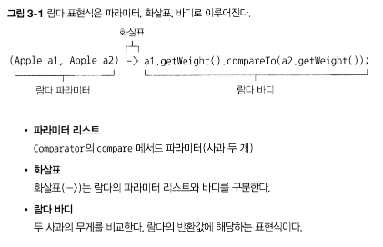
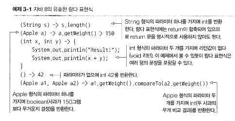
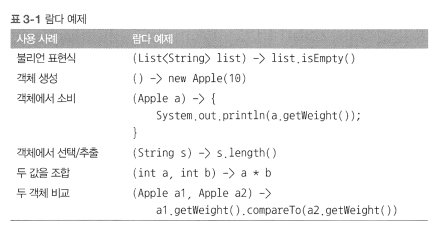
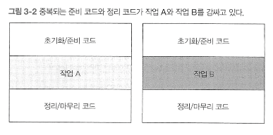
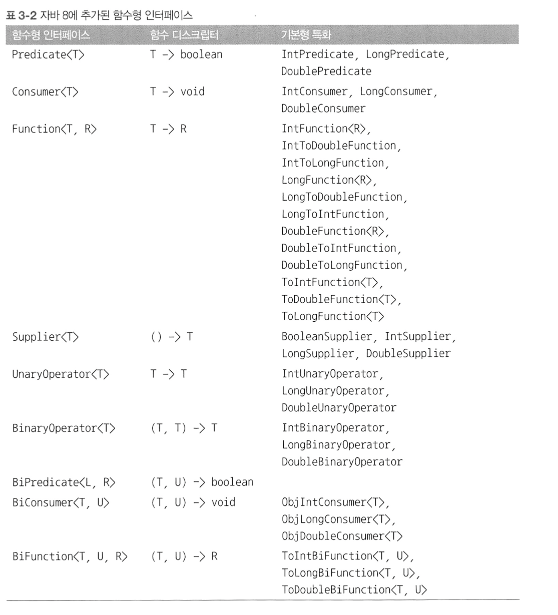
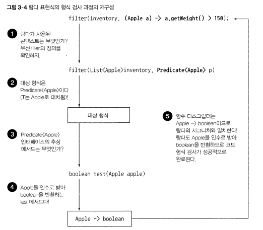
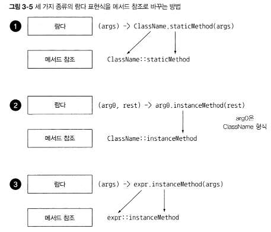

* 모던 자바 인 액션을 읽으면서 책에있는 내용을 간단하게 정리한 노트

# Part1 기초


## 스트림 처리

* 자바 8은 병렬 연산을 지원하는 스트림이라는 새로운 API 제공.
* 스트림을 이용하면 에러를 자주 일으키며 멀티코어를 이용하는것보다 비용이 훨씬 비싼 키워드 'synchronized'를 사용하지 않아도 된다 .

* 스트림이란, 한 번에 한 개씩 만들어지는 연속적인 데이터 항목들의 모임.
* java.util.stream 패키지
* Stream<T> : T형식으로 구성된 일련의 항목


## 동작 파라미터화 
동작 파라미터화 (behavior parameterization) : 아직은 어떻게 실행할 것인지 결정하지 않은 코드 블록.  
* 이 코드블록은 나중에 프로그램에서 호출.
* 나중에 실행될 메서드의 인수로 코드 블록 전달 가능. 
* 예를 들어 컬렉션 처리
    * 리스트의 모든 요소에 대해서 '어떤 동작' 수행
    * 리스트 관련 작업을 끝낸 다음에 '어떤 동작' 수행
    * 에러가 발생하면 '정해진 어떤 동작'을 수행

* 참 또는 거짓을 반환하는 함수를 `프레디케이트(prodicate)`라고 한다.


## 람다 표현식

* 메서드로 전달할 수 있는 익명 함수를 단순화한 것. 
* 이름은 없지만 파라미터 리스트, 바디, 반환형식, 예외리스트를 가질 수 있다.
  * 익명 : 이름이 없으므로 익명이라 표현
  * 함수 : 람다는 메서드처럼 특정 클래스에 종속되지 않으므로 함수라고 부른다.
  * 전달 : 람다 표현식을 인수로 전달하거나 변수로 저장 가능
  * 간결성 : 익명 클래스처럼 많은 자질구레한 코드를 구현할 필요가 없다. 

* 
* 

* 

## 람다는 어디에 사용하는가
* 함수형 인터페이스 

### 함수형 인터페이스
* 정확히 하나의 추상 메서드를 지정하는 인터페이스
* 자바 API 함수형 인터페이스로 Comparator, Runnable 등이 있음
```java
public interface Comparator<T> { // | java.util.Comparator
    int compare(T o1, T o2);
}
public interface Runnable { //java.lang.Runnable
    void run();
}
public interface ActionListener extends EventListener { // java.awt.event.ActionListener
    void actionPerforined(ActionEvent e);
}
public interface Callable<V> { //java.util.concurrent.Callable
    V callO throws Exception;
}
public interface PrivilegedAction<T> { // java.secuhty.PhvilegedAction
    T run();
}
```

* 추상메서드가 오직 하나면 함수형 인터페이스이다.

* 람다 표현식으로 함수형 인터페이스의 추상 메서드 구현을 직접 전달할 수 있으므로 `전체 표현식을 함수형 인터페이스의 인스턴스`로 취급할 수 있따.
    * 기술적으로, 함수형 인터페이스를 구현한 클래스의 인스턴스.

### 함수 디스크럽터(function descriptor)
* 함수형 인터페이스의 추상 메서드 시그니처는 람다 표현식의 시그니처를 가리킨다.
* 람다 표현식의 시그니처를 서술하는 메서드를 함수 디스크립터 라고 부른다.
    * Runnable 인터페이스의 유일한 추상 메서드 run은 인수와 반환값이 없으므로 인수와 반환값이 없는 시그니처로 생각할 수 있다. 

* `@FunctionalInterface` 어노테이션
    * 함수형 인터페이스임을 가리키는 어노테이션
    * @FunctionalInterface로 인터페이스를 선언했지만, 실제로 함수형 인터페이스가 아니면 컴파일 에어.

## 람다 활용 : 실행 어라운드 (execute around parttern)

* 자원 처리에 사용하는 순환 패턴은 자원을 열고 처리하고 닫는 순서로 이루어 진다.
* 실제 자원을 처리하는 코드를 설정(열고) 정리 (닫는)하는 과정이 둘러싸는 패턴을 갖는다.

* 
    * 실행 어라운드 패턴.

```java
public String processFile() throws IOException {
    try (BufferedReader br = new BufferedReader(new FileReader("data.txt"))) {
        return br.readLine(); // 실제 필요한 작업을 하는 행 
    }
}
```
* 동작 파라미터화(저 메서드의 동작을 파라미터화) 해서 람다를 이용해서 수정
```java
String result = processFile(BufferedReader br) -> br.readLine() + br.readLine());
```

* 2단계 : 함수형 인터페이스를 이용해서 동작 전달
```java
@FunctionalInterface
public interface BufferedReaderProcessor {
    String process(BufferedReader b) throws IOException;
}

public String processFile(BufferedReaderProcessor p) throws IOException {
    ...
}
```
* 3단계 : 동작 실행
```java
public String profcessFile(BufferedReaderProcessor p) thorws IOException {
    try (BufferedReader br = new BufferedReader(new FileReader("data.txt"))) {
        return p.process(br);
    }
}
```

* 4단계 람다 전달

```java
String oneLine = processFile((BufferedReader br) -> br.readerLine());
String twoLine = processFile((BufferedReader br) -> br.readerLine() + br.readLine());
```


## Predicate

* <T> 형식의 객체를 사용하는 Boolean 표현식이 필요한 상황에서 Predicate 인터페이스를 사용할 수 있따.

## Consumer

* java.util.function.Consumer
* T객체를 받아 void를 반환한다.

## Function

* java.util.function.Function<T, R>
* T를 인수로 받아 R객체를 반환 
* 입력을 출력으로 매핑하는 람다를 정의할 때 활용. 

* 


|사용 사례| 람다 예제|함수형 인터페이스|
|---|---|---|
|불리언|(`List<String> list`) -> list.isEmpty()|Predicate(`<List<String>>`)|
|객체 생성| () -> new Apple(10)| Supplier `<Apple>` |
|객체에서 소비| (Apple a) -> System.out.print(a)|Consumer`<Apple>`|
|객체에서 선택 / 추출| (String s) -> s.length()|Function`<String, Integer>` 또는 ToIntFunction`<String>` |
|두 값 조합|(int a, int b) -> a * b|IntBinaryOperator |
|두 객체 비교|(Apple a1, Apple a2) -> a1.getWeight().compareTo(a2.getWeight())|Comparator`<Apple>` 또는 BiFunction`<Apple, Apple, Integer>` 또는 ToIntBiFunction`<Apple, Apple>` |

* 함수형 인터페이스는 확인된 예외를 동작을 허용하지 않는다.
* 예외를 던지는 람다 표현식을 만들려면 확인된 예외를 선언하는 함수형 인터페이스를 정의하거나 람다를 try / catch블록으로 감싸야 한다.

## 람다의 형식 검사, 형식 추론, 제약

* 람다가 사용되는 Context를 이용해서 람다의 type(형식)을 추론할 수 있따.
* 어떤 context에서 기대되는 람다 표현식의 형식을 대상 형식(target type)이라고 부른다.

```java
List<Apple> heavierThan150g = filter(inventory, (Apple apple) -> apple.getWeight()  > 150);
```
* 위코드의 형식 확인 과정

1. filter 메서드의 선언 확인
2. filter 메서드는 두번째 파라미터로 Predicate`<Apple>` 형식 을 기대한다.
3. Predicate`<apple>`은 test라는 한 개의 추상 메서드를 정의하는 함수형 인터페이스.
4. test 메서드는 Apple을 받아 boolean을 반환하는 함수 디스크립터를 묘사
5. filter 메서드로 전달된 인수는 이와 같은 요구사항을 만족해야한다.

* 

* 람다 표현식이 예외를 던질 수 있다면 추상 메서드도 `같은 예외` 를 던질 수 잇도록 thorws로 선언해야함 .

## 람다의 지역 변수 사용
```java
int portNumber = 1337;
Runnable r = () -> System.out.println(portNumber);
```
* 람다는 인스턴스 변수와 정적 변수를 자유롭게 캡처(자신의 바디에서 참조할 수 있도록)
* 히지만 그러려면` 지역변수는 명시적으로 final로`선언이 되어있어야 하거나 실질적으로 `final`로 선언된 변수와 똑같이 사용되어야한다
    * 람다 표현식은 한 번만 할당할 수 있는 지역 변수를 캡처할 수 있다.
    * 인스턴스 변수 캡처는 final 지역 변수 this를 캡처하는 것과 마찬가지다.
* 지역 변수에 재할당을 하면 람다 표현식에서는 사용할 수 없다.

### 왜 지역 변수에 제약이 있나?
* 인스턴스 변수는 `힙에 저장`되는 반면 지역 변수는 `스택에 위치`.
* 람다에서 지역 변수에 바로 접근할 수 있다는 가정 하에 람다가 스레드에서 실행된다면 변수를 할당한 스레드가 사라져서 변수 할당이 해제되었는데도 해당 변수에 접근하려 할 수없음.
* 따라서 자바 구현에서는 원래 변수에 접근을 허용하는 것이 아니라 `자유 지역변수의 복사본`을 제공
    * `복사본의 값이 바뀌지 말아야 한다`

#### `클로저`

* 클로저란 함수의 비지역 변수를 자유롭게 참조할 수 있는 함수의 인스턴스.
* 클로저 외부에 정의된 변수에 값에 접근하고 값을 바꿀 수 있다.
* 다만 `람다와 익명 클래스는 !람다가 정의된 메서드의! 지역변수의 값을 바꿀 수 없다.`
    * 람다가 정의된 메서드의 지역 변수 값은 final 변수여야 한다.

* 그래야 람다는 변수가 아닌 값에 국한되어 어떤 동작을 수행한다는 사실이 명확해짐.
* 지역 변수값은 스택에 존재하므로 자신의 스레드와 생존을 같이해야 한다.

## 메서드 참조
* 기존의 메서드 정의를 재활용해서 람다처럼 전달할 수 있다.
* 명시적으로 메서드명을 참조함으로써 가독성을 높일 수 있따.
* 메서드명 앞에 구분자 ::를 붙이는 방식으로 활용 가능.
```java
(Apple apple) -> apple.getWeight(); -> Apple::getWeight
(String s) -> System.out.println(s) -> System.out::println
```
* 

## 생성자 참조
* ClassName::new
```java
Supplier<Apple> c1 = Apple::new;
Apple a1 = c1.get(); // Supplier의 get 메서드를 통해 메서드 실행
```

* 인스턴스화 하지 않고도 생성자에 접근할 수 있는 기능을 만들 수 있다.
    * Map으로 생성자와 문자열값을 관련시킬 수 있다.

```java
static Map<String, Function<Intger, Fruit>> map = new HashMap<>();
static {
    map.put("apple", Apple::new);
    map.put("orange", Orange::new);
}

public static Fruit giveMeFruit(String fruit, Integer weight) {
    return map.get(fruit.toLoWerCase())
                .apply(weight);
}
```

* 인수가 세개인 생성자 참조를 사용하려면?
```java
public interface TriFunction<T, U, V, R> {
    R apply(T t, U u, V v);
}

TriFunction<Integer, Integer, Integer, Color> colorFactory = Color::new;
```

## 람다, 메서드 참조 활용하기

### 1단계 : 코드 전달 방법
```java
void sort(Comparator<? super E> c);
```
* 이 코드는 Comparator 객체를 인수로 받아 두 사과를 비교한다.
* sort의 동작은 파라미터화 되었다고 할 수 있다.
```java
public class AppleComparator implements Comparator<Apple> {
    public int compare(Apple a1, Apple a2) {
        return a1.getWeight().compareTo(a2.getWeight());
    }
}

inventory.sort(new AppleComparator());

// 람다 표현식으로 변환
inventory.sort((a1, a2) -> a1.getWEight().compareTo(a2.getWeight()));

// 정먹세더드 comparing 사용
Comparator<Apple> c = Comparator.comparing((Apple a) -> a.getWeight());

inventory.sort(comparing(apple -> apple.getWeight()));

// 메서드 참조 사용
inventory.sort(comparing(Apple::getWeight));
```

### Comperator 연결
* 무게 비교시, 무게가 같은 두 사과가 존재한다면 어떻게 해야 할까? 
    * 만약 무게로 두 사과를 비교한 다음에 무게가 같다면 원산지 국가별로 사과를 정렬한다면?

* thenComparing 메서드로 체이닝 해서 두 번째 비교자를 만든다
```java
inventory.sort(comparing(Apple::getWeight)
        .reversed()
        .thenComparing(Apple::getCountry));
```
### Predicate 조합

* Predicate 인터페이스는 복잡한 프레디케이트를 만들 수 있도록 `negate, and, or` 세가지 메서드 제공

```java
Predicate<Apple> notRedApple = redApple.negate; // 기존 프레디케이트 객체 redApple의 결과를 반대로 한 객체를 만듬 

// and 메서드를 이용해서 조합
Predicate<Apple> redAndHeavyApple = redApple.and(apple -> apple.getWeight > 150); 

// or 메서드를 이용해서 조합

Predicate<Apple> redAndHeavyAppleOrGreen = redApple.and(apple -> apple.getWeight() > 150)
                                                    .or(apple -> GREEN.eqauls(a.getColor()));
```

### Function 조합

* andThen, compose 두가지 디폴트 메서드 제공

* andThen : 주어진 함수를 먼저 적용한 결과를 다른 함수의 입력으로 전달하는 함수를 반환
* ex : (x -> x + 1) 시키는 f라는 함수가 있고 숫자에 2를 곱하는 g라는 숫자가 있따면?
```java
Function<Integer, Integer> f = x -> x + 1;
Function<Integer, Integer> g = x -> x * 2;
Function<Integer, Integer> h = f.andThen(g);
```
* f 먼저 연산 하고 g를 연산함.

* compose : 인수로 주어진 함수를 먼저 실행한 다음에 그 결과를 외부 함수의 인수로 제공
```java
Function<Integer, Integer> f = x -> x + 1;
Function<Integer, Integer> g = x -> x * 2;
Function<Integer, Integer> h = f.compose(g);
int result = h.apply(1); // 3을 반환
```
* f(g(x))가 되는것.
    * 인수인 g함수가 먼저 실행되고 그 결괏값을 f함수로 넘겨줘서 연산한다.

## 정리

* 람다 표현식은 익명 함수의 일종. 파라미터 리스트, 바디, 반환형식을 가지며 예외를 던질 수 있음.
* 함수형 인터페이스는 하나의 추상 메서드만을 정의하는 인터페이스
* 함수형 인터페이스를 기대하는곳에서만 람다 표현식 사용 가능
* 람다 표현식을 이용해서 함수형 인터페이스의 추상 메서드를 제공할 수 있으며, 람다 표현식 전체가 `함수형 인터페이스의 인스턴스` 로 취급됨


