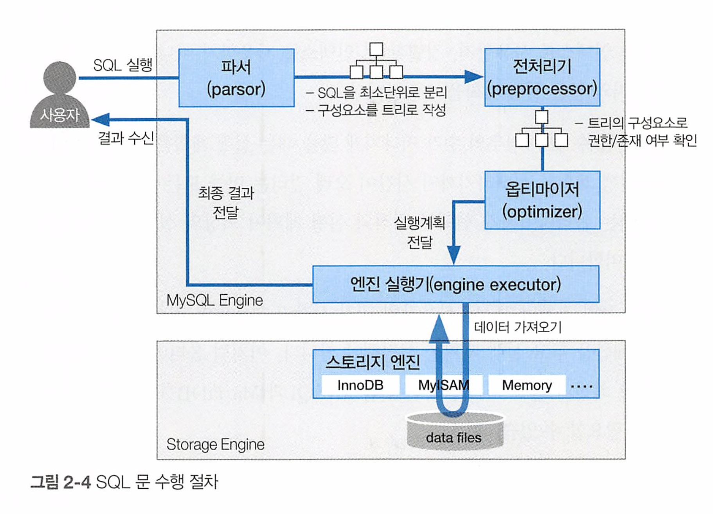

# MySQL 실행계획 정리

쿼리 튜닝 검토 전, 실행계획(explain)을 보고 실행할 SQL이 DB에서 어떻게 처리될지 파악할 수 있습니다.

MySQL 튜닝에서 가장 중요한 것은 쿼리와 스키마 설계인데, 스키마 설계는 한번 진행되면 그 테이블을 사용하는 모든 쿼리에 영향을 주기 때문에 좀처럼 변경하기 힘들지만 

쿼리는 해당 쿼리만 수정하면 되므로 상대적으로 변경하기 쉽습니다. 

Slow Query를 없애고 어플리케이션의 성능을 향상 시키고 싶다면 우선적으로 쿼리의 튜닝을 검토해봐야 합니다.

이때 쿼리 튜닝 검토 전, 실행계획(explain)을 보고 실행할 SQL이 DB에서 어떻게 처리될지 파악할 수 있습니다.


`EXPLAIN` 명령을 사용하면 MySQL 엔진이 쿼리를 어떻게 처리하는지에 대한 정보를 제공하는 쿼리 실행 계획을 볼 수 있습니다.

### MySQL SQL 수행 절차



사용자가 SQL을 실행하면 MySQL은 최적의 쿼리를 실행하기 위해 옵티마이저가 각 테이블의 데이터가 어떻게 되어있는지 참조하고, 

비용이 얼마나 발생하는지를 계산해서 비용이 가장 적은 것을 택하여 실행합니다.


MySQL 에서는 테이블과 실행 계획에 대한 정보를 얻을 수 있는 키워드를 EXPLAIN, DESCRIBE 키워드로 제공합니다.

```sql
{EXPLAIN | DESCRIBE | DESC}
    tbl_name [col_name | wild]

{EXPLAIN | DESCRIBE | DESC}
    [explain_type]
    {explainable_stmt | FOR CONNECTION connection_id}

{EXPLAIN | DESCRIBE | DESC} ANALYZE [FORMAT = TREE] select_statement

explain_type: {
    FORMAT = format_name
}

format_name: {
    TRADITIONAL
  | JSON
  | TREE
}

explainable_stmt: {
    SELECT statement
  | TABLE statement
  | DELETE statement
  | INSERT statement
  | REPLACE statement
  | UPDATE statement
}

```

**EXPLAIN**으로 실행 계획을 확인할 수 있습니다.

**DESCRIBE** 키워드로는 테이블 구조에 대한 정보를 얻을 수 있습니다.


* https://dev.mysql.com/doc/refman/8.0/en/explain.html#explain-table-structure


 ```sql
 mysql> describe 사원;
 
 +--------------+---------------+------+-----+---------+-------+
 | Field        | Type          | Null | Key | Default | Extra |
 +--------------+---------------+------+-----+---------+-------+
 | 사원번호     | int           | NO   | PRI | NULL    |       |
 | 생년월일     | date          | NO   |     | NULL    |       |
 | 이름         | varchar(14)   | NO   |     | NULL    |       |
 | 성           | varchar(16)   | NO   |     | NULL    |       |
 | 성별         | enum('M','F') | NO   | MUL | NULL    |       |
 | 입사일자     | date          | NO   | MUL | NULL    |       |
 +--------------+---------------+------+-----+---------+-------+
 ```


# 실행 계획(explain) 정보 얻기


실행시키려는 쿼리(SQL)와 함께 EXPLAIN 키워드를 사용하면 정보를 실행계획에 대한 정보를 얻을 수 있습니다.

```sql
EXPLAIN  # << 
SELECT 이름, 성 
FROM 사원
WHERE 입사일자 
BETWEEN STR_TO_DATE('1994-01-01' , '%Y-%m-%d')
AND STR_TO_DATE('2000-12-31', '%Y-%m-%d')
```


실행계획

```
+----+-------------+--------+------------+-------+----------------+----------------+---------+------+------+----------+-----------------------+
| id | select_type | table  | partitions | type  | possible_keys  | key            | key_len | ref  | rows | filtered | Extra                 |
+----+-------------+--------+------------+-------+----------------+----------------+---------+------+------+----------+-----------------------+
|  1 | SIMPLE      | 사원   | NULL       | range | I_입사일자     | I_입사일자     | 3       | NULL |    1 |   100.00 | Using index condition |
+----+-------------+--------+------------+-------+----------------+----------------+---------+------+------+----------+-----------------------+
```

위 결과별 각 항목에 대한 의미를 보도록 하겠습니다.

| 구분          | 설명                                                         |
| ------------- | ------------------------------------------------------------ |
| id            | 아이디(id) 로 SELECT를 구분하는 번호이며 실행 순서를 표시하는 숫자. |
| table         | 참조하는 테이블 항목                                         |
| select_type   | SQL 문을 구성하는 SELECT 문의 유형을 출력하는 항목           |
| type          | 테이블의 데이터를 어떻게 찾을지에 관한 정보를 제공하는 항목. 조인 혹은 조회 타입 |
| possible_keys | 데이터를 조회할 때 DB에서 사용할 수 있는 인덱스 리스트. <br />옵티마이저가 SQL문을 최적화 하고자 사용할 수 있는 인덱스 목록 출력. |
| key           | 실제로 사용할 인덱스.<br />옵티마이저가 SQL문을 최적화하고자 사용한 기본 키(PK) 또는 인덱스 명 |
| key_len       | 실제로 사용할 인덱스의 길이                                  |
| ref           | reference의 약자로, 테이블 조인시 어떤 조건으로 해당 테이블에 액세스 되었는지 알려주는 정보 <br />Key 안의 인덱스와 비교하는 컬럼(상수) |
| rows          | 쿼리 실행 시 조사하는 행 수립                                |
| filtered      | 어느 정도의 비율로 데이터를 제거했는지 의미하는 항목         |
| extra         | SQL문을 어떻게 수행할것인지에 대한 추가 정보를 보여주는 항목 |


## id 

id는 SELECT에 붙은 번호이며 실행 순서입니다. 

id가 작을수록 먼저 수행된 것이며, id가 같은 값이라면 두 개 테이블의 조인이 되었다고 볼 수 있습니다.

MySQL은 조인을 하나의 단위로 실행하기 때문에 id는 그 쿼리에 실행 단위를 식별합니다. 따라서 조인만 수행하는 쿼리에서는 id는 항상 1이 됩니다.

구문에 서브 쿼리나 UNION이 없다면 SELECT는 하나밖에 없기 때문에 모든 행에 대해 1이란 값이 부여되지만 이외의 경우에는 원 구문에서 순서에 따라 각 SELECT 구문들에 순차적으로 번호가 부여됩니다.

## select_type  

SQL 문을 구성하는 SELECT 문의 유형을 출력하는 항목입니다. FROM에 위치하는지, 서브쿼리인지, UNION 절로 묶인 SELECT 인지를 나타냅니다.

종류는 다음과 같습니다.

| **구분**             | **설명**                                                     |
| -------------------- | ------------------------------------------------------------ |
| SIMPLE               | Union 이나 Sub Query가 없는 단순한 SELECT문                  |
| PRIMARY              | 서브쿼리가 포함된 SQL문. <br />가장 밖에 있는 SELECT문 Sub Query를 사용할 경우 Sub Query의 외부에 있는 쿼리(첫 번째 쿼리), Union을 사용할 경우 Union의 첫 번째 쿼리 |
| UNION                | Union 쿼리에서 PRIMARY를 제외한 나머지 SELECT문.<br />UNION 및 UNION ALL 구문으로 합쳐진 SELECT 문에서 첫 번째 SELECT 구문을 제외한 이후의 SELECT 구문 |
| DEPENDENT_UNION      | UNION과 동일하나 바깥 쿼리에 의존성을 가진 Union의 SELECT문  |
| UNION_RESULT         | Union 쿼리의 결과물.<br />UNION ALL이 아닌 UNION 구문으로 SELECT 절을 결합했을 때 출력 |
| SUBQUERY             | 독립적으로 수행되는 서브쿼리. <br />가장 밖에 있는 SELECT문의 Sub Query<br />또는 Sub Query를 구성하는 여러 쿼리 중 첫 번째 SELECT문<br />즉 스칼라 서브쿼리와 WHERE 절의 중첩 서브쿼리일 때 표시된다. |
| DEPENDENT_SUBQUERY   | UNION 또는 UNION ALL을 사용하는 서브쿼리가 메인테이블에 영향을 받는 경우이다. <br />SUBQUERY와 동일하나 바깥 쿼리에 의존성을 가진 Sub Query의 SELECT문 |
| DERIVED              | 서브쿼리가 재사용되지 못할 때 출력되는 유형 <br />SELECT로 추출된 테이블(FROM 절에서의 Sub Query 또는 Inline View) <br />FROM절의 별도 임시 테이블인 인라인 뷰를 의미 |
| UNCACHEABLE_SUBQUERY | SUBQUERY와 동일하지만 공급되는 모든 값에 대해 Sub Query를 재처리 바깥 쿼리에서 공급되는 값이 동일하더라도 Cache된 결과를 사용할 수 없음<br />- 해당 서브쿼리 안에 사용자 정의 함수나 사용자 변수가 포함되거나  <br />- RAND( ), UUID( ) 함수 등을 사용하여 매번 조회 시마다 결과가 달라지는 경우에 해당 |
| UNCACHEABLE_UNION    | UNION과 동일하지만 공급되는 모든 값에 대하여 UNION 쿼리를 재처리 |
| METERIALIZED         | IN절 구문에 연결된 서브쿼리가 임시 테이블을 생성한 뒤, 조인이나 가공 작업을 수행할 때 출력되는 유형 <br />IN 절의 서브쿼리를 임시 테이블로 만들어서 조인작업을 수행하는 것 |

## table  

행이 어떤 테이블에 접근하는 지를 보여주는 것으로 대부분의 경우 테이블 이름이나 SQL에서 지정된 별명 같은 값을 나타냅니다..

* 별도의 테이블을 사용하지 않는 SELECT 쿼리의 경우에는 table 이 null로 표시됩니다.

* 서브쿼리인 경우에는 `<subquery#>` 가 출력됩니다. 

table 컬럼에 `<derived>` 또는 `<union>` 과 같이 "<>"로 둘러싸인 이름이 명시되는 경우가 많은데, 이 테이블은 임시 테이블을 의미합니다. "<>"안에 항상 표시되는 숫자는 단위 SELECT 쿼리의 id를 지칭합니다.


첫 번째 라인의 table 컬럼이 <derived 2> 인데, 이것은 id 2번인 라인이 먼저 실행되고 결과인 임시 테이블을 참조하는것 입니다.

단위 SELECT 쿼리의 id 2번은 dept_emp 테이블로부터 SELECT된 결과가 저장된 파생 테이블입니다.

```
+----+-------------+------------+------------+
| id | select_type |    table   | ... |
+----+-------------+------------+------------+
| 1  |  PRIMARY    | <derived2> | ...
| 1  |  PRIMARY    |      e     | ...
| 2  |  DERIVED    |     사원    | ... 
```

* derived2 인 경우 id: 2 를 수행하고 진행됩니다.

## type  

type은 어떤 방식으로 데이터 접근할지 **접근 방식**을 표시하는 필드입니다.

Optimizer가 join, select시에 어떤 방법으로 row를 조회하는지 나타내는 칼럼입니다. 

**접근 방식은 대상 테이블로의 접근이 효율적일지 여부를 판단하는 데 아주 중요한 항목입니다.**

풀스캔할 지, 인덱스 사용할 지 등등을 알 수 있습니다. 

(상위에 위치한 type일수록 빠릅니다)

| 구분            | 설명                                                         |
| --------------- | ------------------------------------------------------------ |
| system          | 테이블에 단 한개의 데이터만 있는 경우. 가장 빠름             |
| const           | SELECT에서 기본 키(Primary Key) 혹은 고유 키 (Unique Key)를 이용하여조회하는 경우로 결과는 최대 1건입니다. 성능이 매우 좋습니다. <br />- 기본 키 또는 고유키에 의한 loockup(등가비교), 조인이 아닌 가장 외부의 테이블에 접근 하는 방식 <br />- 단 기본 키, 고유 키를 사용하고 있으므로 범위 검색으로 지정하는 경우 const가 되지 않음 |
| eq_ref          | 조인을 할 때 Primary Key를 사용한것. <br />조인 시 드라이빙 테이블이 드리븐 테이블 접근하여 고유 인덱스나 기본 키를 사용하여 단 1건의 데이터를 조회할 때 표시 <br />- 드라이빙 테이블과의 조인 키가 드리븐 테이블에 유일하므로 조인 수행시 성능상 가장 유리한 경우임 |
| ref             | 조인을 할 때 Primary Key 혹은 Unique Key가 아닌 Key로 매칭하는 경우. <br />드리븐 테이블의 데이터 접근 범위가 2개 이상인 경우.<br /> - **조인할 때** 드리븐 테이블의 데이터 접근 범위가 2개 이상일 경우 또는 WHERE 절의 비교 연산자(<, >, =)에 표시된다. <br />- 드리븐 테이블에 접근 데이터가 2개 이상인 경우는 드라이빙-드리븐가 일대다 관계 |
| ref_or_null     | ref 와 같지만 null 이 추가되어 검색되는 경우  IS NULL 구문에 대해 인덱스를 활용하도록 최적화된 방식 <br />- ref와 유사하다. SQL 문의 IS NULL 구문을 수행 시 인덱스 활용할 때 표시 <br />- 인덱스 접근 시 맨 앞에 저장되어 있는 NULL의 엔트리를 검색 <br />- 검색할  NULL데이터가 적다면 ref_of_null 방식을 활용했을 때 효율적이지만 많다면 튜닝 대상 |
| index_merge     | 두 개의 인덱스가 병합되어(동시에 사용되는) 검색이 이루어지는 경우 <br />- 전문 인덱스는 제외된다 |
| unique_subquery | IN 서브쿼리 접근에서 기본 키 또는 고유 키를 사용한다. 이 방식은 쓸데 없는 오버헤드를 줄여 상당히 빠르다. <br />다음과 같이 IN 절 안의 서브쿼리에서 Primary Key가 오는 특수한 경우 <br />- SELECT * FROM tab01 WHERE col01 IN (SELECT Primary Key FROM tab01); |
| index_subquery  | unique_sunquery와 거의 비슷하지만 고유한 인덱스를 사용하지 않는 점이 다르다. 이 접근 방식도 상당히 빠르다 <br />unique_subquery와 비슷하나 Primary Key가 아닌 인덱스인 경우 <br />- SELECT * FROM tab01 WHERE col01 IN (SELECT key01 FROM tab02); |
| range           | 특정 범위 내에서 인덱스를 사용하여 범위 비교할 때 사용 <br />데이터가 방대하지 않다면 단순 SELECT 에서는 나쁘지 않음 <br /> - =, <>, >, >=, <, <=, IS NULL , <=>, BETWEEN, IN 연산 등을 통한 범위 스캔 수행 방식 스캔할 범위가 넓으면 성능 저하의 요인이 될 수 있으므로 SQL 튜닝 검토 대상 |
| index           | 인덱스 풀스캔. 인덱스를 처음부터 끝까지 찾아서 검색하는 경우 <br />ALL 유형의 테이블 풀 스캔 방식과 유사하지만 테이블 풀 스캔보다는 빠르다. |
| all             | 테이블 풀스캔. 테이블을 처음부터 끝까지 검색하는 경우 <br /> 검색하려는 데이터가 전체 데이터의 20% 정도 이상일때는 ALL 성능이 인덱스 조회보다 좋을 수 있습니다. |

* ALL, index 두 가지는 테이블 또는 특정 인덱스가 전체 행에 접근하기 때문에 테이블 크기가 크면 효율이 떨어집니다.
* ref_or_null의 경우 NUL이 들어있는 행은 인덱스의 맨 앞에 모아서 저장하지만 그 건수가 많으면 MySQL 서버의 작업량이 방대해집니다. 
* 즉 ALL 이외의 접근 방식은 모두 인덱스를 사용하는데, 해당 쿼리로 사용할 수 있는 적절한 인덱스가 없다는 의미일 수도 있습니다.

## possible_keys  

옵티마이저가 SQL문을 최적화 하고자 사용할 수 있는 인덱스 목록이며 
쿼리에서 접근하는 컬럼 들과 사용된 비교 연산자들을 바탕으로 **어떤 인덱스를 사용할 수 있는 지를** 표시해줍니다.

실제 사용한 인덱스가 아닌, 사용할 수 있는 후보군의 기본 키와 인덱스 목록만 보여줍니다.

## key  

옵티마이저가 SQL문을 최적화하고자 사용한 기본 키(PK) 또는 인덱스 명

key가 NULL이면 인덱스를 사용할 수 없다는 의미입니다.

비효율적인 인덱스를 사용했거나 인덱스 사용하지 않은 경우(NULL) 튜닝 대상입니다. 

## key_len  

key_len 필드는 선택된 인덱스의 길이를 의미합니다.. 중요한 필드는 아니지만 인덱스가 너무 긴 것도 비효율적인것입니다.

UTF-8 기준 사용한 인덱스가 INT면 4바이트, VARCHAR는 3바이트 

복합 인덱스라면 인덱스를 모두 더한 값이 나옵니다.

## ref  

reference의 약자로, 테이블 조인시 어떤 조건으로 해당 테이블에 액세스 되었는지 알려주는 정보입니다.

키 컬럼에 나와 있는 인덱스에서 값을 찾기 위해 선행 테이블의 어떤 컬럼이 사용되었는 지를 나타냅니다. 

## rows  

원하는 행을 찾기 위해 접근하는 데이터의 모든 행(row)의 예측값을 의미합니다.

EXPLAIN ANALYZE를 제외하곤 EXPLAIN은 MYSQL 통계 정보를 가지고 예측한 값이다. 실제로 SQL 문을 실행한 뒤의 실행 계획이 아닙니다.

SQL문의 최종 결과 건 수와 비교해 rows 수가 많이 차이날 때는 MySQL 엔진에서 데이터를 많이 가져와 불필요하게 조회한것 이므로 튜닝 대상이 됩니다. 

## filtered

SQL 문을 통해 MySQL 엔진이 스토리지 엔진으로부터 가져온 데이터를 필터 조건에 따라 제거된 비율입니다. (단위 %)

필터 조건은 WHERE구의 검색 조건이며, 스토리지 엔진으로부터 100건 가져왔고 이후 MySQL 엔진의 필터 조건을 거쳐 10건이 필터링된다면 filtered 값은 10.00 입니다. 

통계 값 바탕으로 계산한 값이므로 현실의 값과 반드시 일치하지 않습니다. 

* 필터가 제대로 동작하지 않으면 테이블 등을 ANALYZE 해서 분석을 해야합니다

## Extra

옵티마이저가 SQL문을 어떻게 해석하여 수행할것인지에 대한 추가 정보를 보여주는 항목.입니다. 

옵티마이저의 동작에 대해서 우리에게 알려주는 힌트이며 행동을 파악할때 아주 중요합니다.

| Extra                                                        | 설명                                                         |
| :----------------------------------------------------------- | :----------------------------------------------------------- |
| Using where                                                  | WHERE 절의 필터 조건을 사용해 MySQL 엔진으로 가져온 데이터를 추출한 경우<br />테이블에서 행을 가져온 후 추가적으로 검색조건을 적용해 행의 범위를 축소한 것을 표시한다. |
| Using index                                                  | **커버링 인덱스라고도 하며 index only scan이라고도 부른다** <br />- 테이블에는 접근하지 않고 인덱스에서만 접근해서 쿼리를 해결하는 것을 의미한다. |
| Distinct                                                     | 중복이 제거되어 유일한 값을 찾을 때 출력되는 정보. <br />중복 제거가 포함되는 distinct 키워드나 union 구문 포함된 경우 출력 |
| Using index for group-by                                     | Using index와 유사하지만 GROUP BY가 포함되어 있는 쿼리를 커버링 인덱스로 해결할 수 있음을 나타낸다 - **인덱스 루스 스캔일 때** 출력 |
| Using filesort                                               | 정렬이 필요한 데이터를 메모리에 올리고 작업을 수행하겠다는 의미 <br />ORDER BY 인덱스로 해결하지 못하고, filesort(MySQL의 quick sort)로 행을 정렬한 것을 나타낸다. <br />추가적인 정렬 작업이므로 인덱스를 활용하도록 SQL 튜닝 검토 대상이 될 수 있다. |
| Using temporary                                              | 암묵적으로 **임시 테이블**이 생성된 것을 표시한다. <br />데이터 가져와 저장한 뒤 정렬 작업 수행하거나 중복 제거 작업 수행할 때 표시된다.<br />- 데이터를 가져와 저장한 뒤 정렬을 수행하거나 중복 제거하는 작업 수행 <br />- DISTINCT, GROUP BY, ORDER BY 구문이 포함된 경우 출력 <br />- 임시 테이블을 메모리에 생성하거나, 메모리 영역을 초과하여 디스크에 임시 테이블을 생성하면 Using Temporary는 성능 저하의 원인이 될 수 있다. <br />- 따라서 Using temporary가 출력되면 SQL 튜닝의 대상이 될 수 있다. |
| Using where with pushed                                      | 다시 말해 distinct, group by, order by 구문이 포함된 경우 표시된다.엔진 컨디션 pushdown 최적화가 일어난 것을 표시한다. 현재는 NDB만 유효 |
| Using index condition                                        | .인덱스 컨디션 pushdown(ICP) 최적화가 일어났음을 표시한다.<br /> ICP는 멀티 칼럼 인덱스에서 왼쪽부터 순서대로 칼럼을 지정하지 않는 경우에도 인덱스를 이용하는 실행 계획이다.  <br />필터 조건을 스토리지 엔진으로 전달하여 필터링 작업에 대한 Mysql 엔 진의 부하를 줄이는 방식.  <br />이는 스토리지 엔진의 데이터 결과를 Mysql 엔진으로 전송하는 데이터양을 줄여 성능 효율을 높일 수 있는 옵티마이저의 최적화 방식 |
| Using MRR                                                    | 멀티 레인지 리드(MRR) 최적화가 사용되었음을 표시한다.        |
| Using join buffer(Block Nested Loop)                         | 조인에 적절한 인덱스가 없어 중간 데이터 결과를 저장하는 조인 버퍼 사용 의미 |
| Using join buffer(Batched Key Access)                        | Batched Key Access(BKAJ) 알고리즘을 위한 조인 버퍼를 사용했음을 표시한다. |
| Not exists                                                   | 하나의 일치하는 행을 찾으면 추가로 행을 더 검색하지 않아도 될 때 출력되는 유형 <br />왼쪽 외부 조인 또는 오른쪽 외부 조인에서 테이블에 존재하지 않는 데이터를 명시적으로 검색할 때 발생 |
| Using union / <br />Using intersect / <br />Using sort_union | 인덱스가 병합되어 실행되는 경우 어떻게 병합했는지에 대한 상세 정보 출력 <br /> - Using union : 인덱스들을 합집합처럼 모두 결합하여 데이터에 접근. **보통 OR 구문** <br />- Using intersect : 인덱스들을 교집합처럼 추출하는 방식. 보통 **AND 구문** <br />- Using sort_union : Using union과 유사하지만, OR 구문이 동등 조건이 아닐 때 확인할 수 있는 정보 |


추가 정보 MySQL 8.0 버전 기준 : https://docs.oracle.com/cd/EI7952_0/mysql-8.0-en/explain-output.html


## EXPLAIN ANALYZE

실제 실행된 소요 시간, 비용을 측정하여 **실행 계획 정보를 출력**하고 싶다면 ANALYZE 키워드를 사용해서 정확하게 분석할 수 있습니다.

* 일반적으로 그냥 EXPLAIN 키워드는 실제 SQL문이 실행된 뒤 나온 계획이 아니라 MySQL 서버가 가지고 있는 통계정보들을 활용한 **예측된 결과**입니다
* ANALYZE 키워드를 사용해야 올바른 결과가 나올 확률이 높습니다.


EXPLAIN ANALYZE 키워드를 사용하거나,

ALALYZE '테이블명' 을 이용하고 EXPLAIN 하면 됩니다.


```sql
EXPLAIN ANALYZE
SELECT * 
FROM 사원 
WHERE 사원번호 BETWEEN 1 and 10000000

+------------+
| EXPLAIN    |
+-----------------------------------------------------------------------------------------------+
| -> Filter: (`사원`.`사원번호` between 1 and 10000000)  (cost=30099 rows=149645) (actual time=0.291..127 rows=300024 loops=1)
    -> Index range scan on 사원 using PRIMARY over (1 <= 사원번호 <= 10000000)  (cost=30099 rows=149645) (actual time=0.237..104 rows=300024 loops=1)
             |
+---------------------------------------------------------------------------------------------+
```


## EXPLAIN의 format(포맷) 옵션들

MySQL 8.0 부터 EXPLAIN 명령에 FORMAT 옵션을 사용해 실행 계획의 결과를 **단순 Table, JSON, TREE** 으로 지정할 수 있다.


Default EXPLAIN (Table View)

```sql
EXPLAIN 
SELECT * 
FROM 사원 
WHERE 사원번호 BETWEEN 1 and 10000000
+----+-------------+--------+------------+-------+---------------+---------+---------+------+--------+----------+-------------+
| id | select_type | table  | partitions | type  | possible_keys | key     | key_len | ref  | rows   | filtered | Extra       |
+----+-------------+--------+------------+-------+---------------+---------+---------+------+--------+----------+-------------+
|  1 | SIMPLE      | 사원   | NULL       | range | PRIMARY       | PRIMARY | 4       | NULL | 149645 |   100.00 | Using where |
+----+-------------+--------+------------+-------+---------------+---------+---------+------+--------+----------+-------------+
```


EXPLAIN vertical  view (쿼리 끝에 '\G' 사용)

```sql
EXPLAIN 
SELECT * 
FROM 사원 
WHERE 사원번호 BETWEEN '1' and '10000000'\G;

*************************** 1. row ***************************
           id: 1
  select_type: SIMPLE
        table: 사원
   partitions: NULL
         type: range
possible_keys: PRIMARY
          key: PRIMARY
      key_len: 4
          ref: NULL
         rows: 149645
     filtered: 100.00
        Extra: Using where
```

JSON VIEW

* OSN 형식의 EXPLAIN에는 Extra 필드에서 Using WHERE 라고만 출력되는 것이 attached_condition로 나와서 구체적으로 어떤 조건이 적용되는지 알 수 있다.

```sql
EXPLAIN FORMAT = JSON
SELECT * 
FROM 사원 
WHERE 사원번호 BETWEEN '1' and '10000000';

----------------+
| EXPLAIN |
+-----------------------------------------------------------------------------------------------------
...
----------------------------------------------------+
| {
  "query_block": {
    "select_id": 1,
    "cost_info": {
      "query_cost": "30098.76"
    },
    "table": {
      "table_name": "사원",
      "access_type": "range",
      "possible_keys": [
        "PRIMARY"
      ],
      "key": "PRIMARY",
      "used_key_parts": [
        "사원번호"
      ],
      "key_length": "4",
      "rows_examined_per_scan": 149645,
      "rows_produced_per_join": 149645,
      "filtered": "100.00",
      "cost_info": {
        "read_cost": "15134.26",
        "eval_cost": "14964.50",
        "prefix_cost": "30098.76",
        "data_read_per_join": "14M"
      },
      "used_columns": [
        "사원번호",
        "생년월일",
        "이름",
        "성",
        "성별",
        "입사일자"
      ],
      "attached_condition": "(`tuning`.`사원`.`사원번호` between '1' and '10000000')"
    }
  }
}                              |
+-----------------------------------------------------------------------------------------------------
...
----------------------------------------------------+
```

TREE View

```sql
EXPLAIN FORMAT = TREE
SELECT * 
FROM 사원 
WHERE 사원번호 BETWEEN '1' and '10000000';

+-----------------------------------------------------------------------------------------------------------------------------------------------------------------------------------------------------------+
| EXPLAIN                                                                                                                                                                                                   |
+-----------------------------------------------------------------------------------------------------------------------------------------------------------------------------------------------------------+
| -> Filter: (`사원`.`사원번호` between '1' and '10000000')  (cost=30099 rows=149645)
    -> Index range scan on 사원 using PRIMARY over (1 <= 사원번호 <= 10000000)  (cost=30099 rows=149645)
             |
+-----------------------------------------------------------------------------------------------------------------------------------------------------------------------------------------------------------+
```


### 참조

* [MySQL 공식문서](https://dev.mysql.com/doc/refman/8.0/en/explain.html#explain-table-structure)
* 도서 - 업무에 바로 쓰는 SQL 튜닝

* https://cheese10yun.github.io/mysql-explian/


