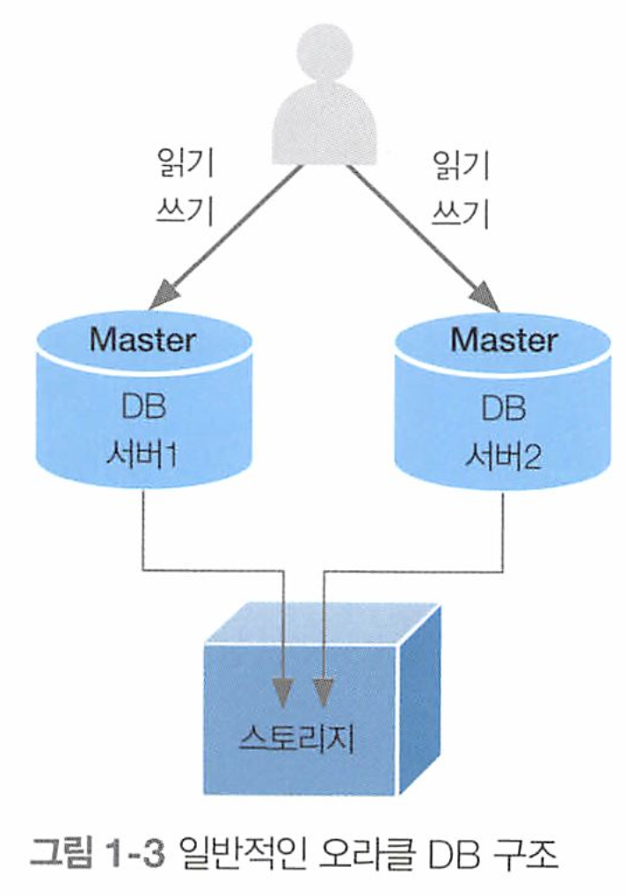
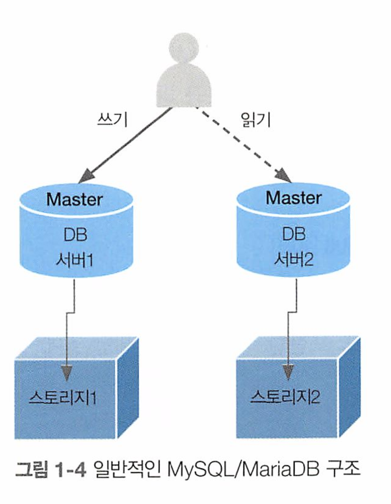

# 업무에 바로쓰는 SQL 튜닝

1장. MySQL과 MariaDB 개요

1.1 현황
1.2 상용 RDBMS와의 차이점
1.3 MySQL과 MariaDB 튜닝의 중요성
1.4 마치며


2장. SQL 튜닝 용어를 직관적으로 이해하기
2.1 물리 엔진과 오브젝트 용어
2.2 논리적인 SQL 개념 용어
2.3 개념적인 튜닝 용어
2.4 마치며


3장. SQL 튜닝의 실행 계획 파헤치기
3.1 실습 환경 구성하기
3.2 실행 계획 수행
3.3 프로파일링
3.4 마치며


4장. 악성 SQL 튜닝으로 초보자 탈출하기
4.1 SQL 튜닝 준비하기
4.2 SQL 문 단순 수정으로 착한 쿼리 만들기
4.3 테이블 조인 설정 변경으로 착한 쿼리 만들기
4.4 마치며


5장. 악성 SQL 튜닝으로 전문가 되기
5.1 SQL 문 재작성으로 착한 쿼리 만들
5.2 인덱스 조정으로 착한 쿼리 만들기
5.3 적절한 테이블 및 열 속성 설정으로 착한 쿼리 만들기
5.4 마치며


# 1장. MySQL과 MariaDB 개요

MySQL 버전 확인 쿼리

```sql
#
show variables like 'version';
# 또는
select @@version;
```

버전별 MySQL vs MariaDB 기능 차이

- MySQL: https://dev.mysq1.com/doc/refman/8.0/en/select.htmI
- MariaDB: https://mariadb.com/kb/en/selecting-data/

## 1.1 현황

MySQL은 상용, 무료 버전으로 나뉜다. 무료버전의 라이센스는 GPL이다.

상용 버전은 오라클에서 다양한 보안 패치와 개선된 기능을 제공하는 밤년, 무료 버전은 제약된 기능과 서비스만 사용할 수 있다.

반면 MariaDB는 GPL v2를 따르는  완전한 오픈소스 소프트웨어이다

## 1.2 상용 RDBMS와의 차이점

### 1.2.1 구조적 차이

오라클과 MySQL을 실제 서비스에 도입할 때는 장애 예방 효과 또는 장애 발생 시 가용성을 기대하며 이중화 구조로 구축한다.

* 삼중화 이상의 다중화로도 가능하다.

오라클 DB는 통합된 스토리지 하나를 공유하는 방식

MySQL은 물리적인 DB서버마다 독립적으로 스토리지를 할당하여 구성한다.

|  |  |
| ------------------------------------------------------------ | ------------------------------------------------------------ |


오라클은 공유 스토리지를 사용하므로 사용자가 어느 DB에 접속하여 SQL을 수행해도 같은 결과를 출력하거나 동일한 구문을 처리한다.

반면 MYSQL은 독립적인 스토리지 할당에 기반을 두는 만큼 이중와를 위한 클러스터(cluster)나 복제(replication) 구성으로 운영하더라도 **보통은 마스터 - 슬레이브 구조가 대부분이다** 

* 보통 마스터 노드는 쓰기/읽기 모두 처리 가능, 슬레이브 노드는 읽기만 처리 가능

즉, 물리적으로 여러 MySQL에 접속하더라도 동일한 구문이 처리되지 않을 수 있다.

쿼리문이 수행하는 서버의 위치를 파악하고 튜닝을 진행하면 물리적인 위치 특성이 내포된 쿼리 튜닝을 수행할 수 있다.

애플리케이션을 통해 쿼리 오프로딩(query offloading)이 적용되어 마스터랑 슬레이브에 각각 쓰기/ 읽기 작업만 수행한다

> 쿼리 오프로딩
>
> DB서버의 트랜잭션에서 쓰기(write) 작업과 읽기(read) 트랜잭션을 분리하여 DB 처리량을 증가시키는 성능 향상 기법

### 1.2.2 지원 기능 차이

MySQL vs Oracel 에선 조인 알고리즘 기능의 차이가 있다

* MySQL은 **대부분** 중첩 루프 조인(nested loop join) 방식으로 수행
* 오라클은 정렬 병합, 해시 조인 방식도 제공

또한 MySQL은 오라클 대비 메모리 사용률이 상대적으로 낮다.

### 1.2.3 oracle vs MySQL SQL 구문 차이

#### Null 대체

* Null이 포함될 때는 다른값으로 대체

```sql
# MySQL
IFNULL(컬럼명, '대체값')
```

오라클

```sql
NVL(컬럼명, '대체값')
```

#### 페이징 처리

MySQL은 LIMIT 오라클은 ROWNUM

**MySQL**

```sql
LIMIT 5;
```

**오라클**

```
ROWNUM <= 5
```

#### 현재 날짜

MySQL에서는 now() 함수를 사용하고 오라클에서는 SYSDATE키워드를 사용

**MySQL**

```sql
now()
```

**오라클**

```
SYSDATE
```

#### 조건문

MySQL은 IF - CASE WHEN~ THEN

오라클은 DECODE, IF CASE WHEN ~ THEN

**MySQL**

```sql
IF (조건식, '참값', '거짓값')
#
SELECT IF(col1 = 'A', 'apple', '-')
```

**오라클**

```sql
DECODE (컬럼명, '값', '참값', '거짓값')
#
SELECT DECODE(col1, 'A', 'apple', '-')
```

#### 날짜 형식

MySQL에서는 DATE_FORMAT()

오라클에서는 TO_CHAR ()

**MySQL**

```sql
DATE_FORMAT(날짜열, '형식')
#
SELECT DATE_FORMAT(now(), '%Y%m%d %H%i%s')
```

**오라클**

```sql
TO_CHAR(날짜열, '형식')
#
SELECT TO_CHAR(SYSDATE, 'YYYYMMDD HH24MISS')
```


#### 자동 증가값 - auto_increment, 시퀀스

MySQL에서는 auto_increment와 시퀀스를 이용할 수 있다. 

```sql
CREATE TABLE tab 
(seg INT NOT NULL AUTO_INCREMENT PRIMARY KEY,
 title VARCHAR (20) NOT NULL
);
```

MardaDB 10.3 이상

```
CREATE SEQUENCE [시퀀스명]
INCREMENT BY [증감숫자]
START WITH [시작숫자]
NOMINVALUE OR MINVALUE [최솟값]
NOMAXVALUE OR MAXVALUE [최댓값]
CYCLE OR NOCYCLE
CACHE OR NOCACHE
```

사용법

```sql
CREATE SEQUENCE MARIA_SEQ_SAMPLE
INCREMENT BY 1
START WITH 1
MINVALUE 1
MAXVALUE 99999999999
CYCLE CACHE;
```

다음 값 채번

```sql
SELECT NEXTVAL(시퀀스 명);
```

```sql
SELECT NEXTVAL (MARIA_SEQ_SAMPLE);
```

  


마리아디비, 오라클에서는 sequence 오브젝트를 사용한다. 

* CREATE SEQUENCE 문으로 시퀀스 오브젝트를 생성한 뒤 해당 시퀀스 문으로 함수를 호출한다
* SELECT 시퀀스명.nextval FROM dual; 구문을 사용

생성 문법

```
CREATE SEQUENCE [시퀀스명]
INCREMENT BY [증감숫자]
START WITH [시작숫자]
NOMINVALUE OR MINVALUE [최솟값]
NOMAXVALUE OR MAXVALUE [최댓값]
CYCLE OR NOCYCLE
CACHE OR NOCACHE
```

예제

```sql
CREATE SEQUENCE ORACLE SEQ SAMPLE
INCREMENT BY 1
START WITH 1
MINVALUE 1
MAXVALUE 99999999999
CYCLE CACHE;
```

채번 문법

```sql
SELECT ORACLE SEO SAMPLE.NEXTVAL
FROM DUAL;
```

#### 문자 결합

MySQL에서는 CONCAT() 함수 사용

오라클에서는 || 나 CONCAT() 함수 사용


**MySQL**

```
CONCAT(열값 또는 문자열, 열값 또는 문자열)
```

예제

```sql
SELECT CONCAT ('A', 'B') TEXT;
```

**오라클**

```sql
SELECT 'A'!!'B' TEXT 2 FROM DUAL;
# 또는
SELECT CONCAT ('A', 'B') TEXT;
```


#### 문자 추출

MySQL 은 SUBSTRING()

오라클은 SUBSTR() 함수 사용


**MySQL**

```
SUBSTRING(열값 또는 문자열, 시작 위치, 추출하려는 문자 개수)
```

예제

```sql
# 두번째부터 시작해서 3개의 문자를 가져옴 
SELECT SUBSTRING('ABCDE',2,3) AS sub_string;
```


**오라클**

```
SUBSTR(열값 또는 문자열, 시작 위치, 추출하려는 문자 개수)
```

예제

```sql
SELECT SUBSTR('ABCDE', 2,3) AS sub_string
2 FROM DUAL;
```


### 1.3 MySQL과 MariaDB 튜닝의 중요성

안정적인 서비스 운영을 위해서 여러 아키텍처를 사용한다

한대의 기본 노드, 다수의 복제본 노드, 여러개의 마스터 노드 구조 등


MySQL은 무료, 경량화, 편리하지만 수행 가능한 알고리즘이 적어서 성능적으로 분리.


# 2장 SQL 튜닝 용어를 직관적으로 이해하기


MySQL 엔진에서  SQL이 실행되면 

1. 문법 에러를 먼저 검사하고, 
2. 대상 테이블이 존재하는지 확인한다 (파서 )
3. 이후 요청한 데이터를 빠르고 효율적으로 찾아가는 전략적 계획을 수립한다 (옵티마이저가)
4. 이 계획을 토대로 스토리지 엔진에 위치한 데이터까지 찾아간 뒤 해당 데이터를 MySQL 엔진으로 전달
5. MySQL 엔진은 전달된 데이터에서 불필요한 부분은 필터링(제거, 변경)하고 필요한 연산을 수행한 뒤 결과를 반환 


### 스토리지 엔진 (Storage Engine)

(InnoDB, MyISAM, Memory 등) 스토리지 엔진은 사용자가 요청한 SQL 문을 토대로

 DB 에 저장된 디스크나 메모리에서 필요한 데이터를 가져오는 역할을 수행한다.

이후 해당 데이터를 MySQL 엔진으로 보낸다. 

* 스토리지 엔진이 데이터를 저장하는 방식에 따라 각각의 스토리지 엔진을 선택해서 사용할 수 있다
* 필요하다면 외부에서 스토리지 엔진 설치 파일을 가져와 활성화하여 즉시 사용할 수 있다.

온라인상의 트랜잭션인 OLTP를 처리하면 InnoDB 엔진,

대량의 쓰기 트랜잭션이 발생하면 MyISAM 엔진

메모리 데이터를 빠르게 읽을때는 Memory 엔진을 사용한다.


**MySQL에서 엔진, 트랜잭션, 등을 조회하는법**

```sql
SELECT ENGINE, TRANSACTIONS, COMMENT FROM information_Schema.engines;
```

```
+--------------------+--------------+----------------------------------------------------------------+
| ENGINE             | TRANSACTIONS | COMMENT                                                        |
+--------------------+--------------+----------------------------------------------------------------+
| ndbcluster         | NULL         | Clustered, fault-tolerant tables                               |
| FEDERATED          | NULL         | Federated MySQL storage engine                                 |
| MEMORY             | NO           | Hash based, stored in memory, useful for temporary tables      |
| InnoDB             | YES          | Supports transactions, row-level locking, and foreign keys     |
| PERFORMANCE_SCHEMA | NO           | Performance Schema                                             |
| MyISAM             | NO           | MyISAM storage engine                                          |
| ndbinfo            | NULL         | MySQL Cluster system information storage engine                |
| MRG_MYISAM         | NO           | Collection of identical MyISAM tables                          |
| BLACKHOLE          | NO           | /dev/null storage engine (anything you write to it disappears) |
| CSV                | NO           | CSV storage engine                                             |
| ARCHIVE            | NO           | Archive storage engine                                         |
+--------------------+--------------+----------------------------------------------------------------+
```

### MySQL 엔진

MySOL 엔진의 역할

* 사용자가 요청한 SQL 문을 넘겨받은 뒤 SOL 문법 검사와 적절한 오브젝트 활용 검사를 하고, SOL. 문을 최소 단위로 분리하여 원하는 데이터를 빠르게 찾는 경로를 모 색하는 역할을 수행
* 이후 스토리지 엔진으로부터 전달받은 데이터 대상으로 불필요한 데이터는 제거하거나 가공 및 연산한다.
* 즉, SOL 문의 시작 및 마무리 단계에 MySOL 엔진이 관여하며, 스토리지 엔진으로부터 필요한 데이터만을 가져오는 핵심 역할을 담당한다


## 2.1.2 SQL 프로세스 용어


**파서(parser)**

* 사용자가 요청한 SQL문을 쪼개 최소 단위로 분리하고 트리를 만들면서 문법을 검사한다
  * 트리를 만드는 과정에서 문법 오류 검토. 
  * 트리의 최소 단위는 >, <, = 등의 기호나 SQL 키워드로 분리

**전처리기 (preprocessor)**

* 파서에서 생성한 트리를 토대로 SQL 문에 구조적인 문제가 없는지 파악 
* 테이블, 열, 함수, 뷰와 같은 오브젝트가 실질적으로 생성된 오브젝트인지, 접근 권한은 부여되어있는지 확인하는 역할 
  * 유효하지 않거나 권한이 없는 오브젝트를 호출하면 바로 에러를 발생하여 사용자에게 표시 

**옵티마이저(Optimizer)**

* 실행 계획을 수립하는 핵심 엔진 
* 전달된 파서 트리를 토대로 필요하지 않은 조건은 제거하거나 연산 과정 단순화
* 어떤 순서로 테이블에 접근할지, 인덱스를 사용할지, 사용한다면 어떤 인덱스를 사용할지, 정렬할 때 인덱스를 사용할 지 아니면 임시 테이블을 사용할지 실행 계획 수립  
  * 실행 계획으로 도출할 수 있는 경우의 수가 너무 많을 때는 최적의 실행 계획을 선택하기까지 시간이 오래 걸리는 만큼 모든 실행 계획을 판단하지는 않는다.
  * <u>즉 이말은 옵티마이저가 선택한 최적의 실행 계획이 최상의 실행 계획이 아닐 수도 있다는 뜻</u>

**엔진 실행기 (engine executor)**

* 옵티마이저에서 수립한 실행 계획을 참고하여 스토리지 엔진에서 데이터를 가져온다
* 이후 MySQL 엔진에서는 읽어온 데이터를 정렬하거나 조인하고 불필요한 데이터는 필터링 한다.
* 즉 MySQL 엔진의 부하를 줄이려면, 스토리지 엔진에서 가져오는 데이터 양을 줄이는게 중요하다 .

### 2.1.3 DB 오브젝트 용어


**인덱스(index)**

데이터 접근 속도를 높이고자 생성되는 키 기준으로 정렬된 오브젝트

기본키와 유니크(고유) 인덱스의 차이점 : 기본 키는 null 불가능, 유니크 인덱스는 가능


**뷰(view)**

가상 테이블. 제한된 정보만을 제공함으로써 보안적 측면으로 좋다. 

* 뷰를 사용하는 이유는 일부 데이터에 대해서만 데이터를 공개하고, 노출에 민감한 데이터에 대해서는 제약을 설정할 수 있는 보안성 때문. 
* 한편 여러 개의 테이블을 병합 join해서 활용할 때는 성능을 고려한 최적 화된 뷰를 생성함으로써 일관된 성능을 제공할 수 있다.


### 2.2.1 서브쿼리와 서브쿼리 위치에 따른 용어

스칼라 서브쿼리 :  SELECT 절에 사용되는 서브쿼리 

* 결괏값은 1행 1열의 구조로만 출력되어야 한다. 
* 스칼라 서브쿼리는 출력되는 건수가 1건이야 하므로 집계함수(max, min, avg, sum, count)가 자주 쓰임 

```sql
SELECT 이름,
	(SELECT COUNT (*)
		FROM 학생 AS 학생2
		WHERE 학생2. 이름 = 학생1. 이름 ) 카운트

FROM 학생 AS 학생1;
```


**인라인 뷰**   : FROM 절에 사용되는 서브쿼리 

* 내부에서 일시적으로 뷰를 생성하는 방식이여서 인라인 뷰
* 내부적으로 메모리 또는 디스크에 임시 테이블을 생성하여 활용

```sql
SELECT 학생2. 학번, 학생2. 이름
	FROM (SELECT *
				FROM 학생
WHERE 성별 = '남') 학생2;
```


 **중첩 서브쿼리** : WHERE 절에 사용되는 서브쿼리 

* 단순한 값 비교 대신 복잡한 값을 비교 연산하기 위해 사용
* 보통 비교 연산자 (=, <>,   >=, <>, 1=)를 비롯해 IN, EXISTS. NOT IN, NOT EXISTS 문을 많이 사용

```sql
SELECT *
	FROM 학생
WHERE 학번 = (SELECT MAX(학번) FROM 학생)
```


### 2.2.2 메인쿼리와의 관계성에 따른 SQL 서브쿼리 용어

**비상관 서브쿼리**(non correlated subquery) : 메인쿼리와 서브쿼리 간에 관계성이 없음을 의미

서브쿼리가 독자적으로 실행된 뒤 메인쿼리에게 그 결과를 던져주는 형태

```sql
SELECT ...
FROM 학생
WHERE ... IN 
(SELECT ... FROM 지도교수) # << 비상관 서브쿼리
```

 비상관 서브쿼리에서는 서브쿼리가 먼저 실행된 뒤 그 결과를 메인쿼리가 활용한다.  

* DB 버전 및 옵티마이저에 따라 서브쿼리가 제거되고 하나의 메인쿼리로 통합되는 뷰 병합 (SQL 재작성 )이 동작할 수 있다.


**상관 서브쿼리**(coreelated subquery) : 메인쿼리와 서브쿼리 간에 관계성이 있음을 의미

메인쿼리가 실행된 뒤, 해당 결과를 이용해서 서브쿼리가 수행된다.

```sql
SELECT ...
FROM 학생
WHERE ... IN 
(SELECT ... FROM 지도교수 WHERE 학생.학번 = ) # << 상관 서브쿼리. 메인쿼리와 학생이라는 연관성이있음
```

메인쿼리의에서 학생 테이블의 결과를 서브쿼리로 전달한 뒤 지도교수 테이블의 학번과 비교한다(지도교수.학번 = 학생.학번)

메인쿼리 실행 -> 서브쿼리 실행 - > 다시 메인 쿼리 실행한 뒤 결과 출력.

* DB 버전 및 옵티마이저에 따라 서브쿼리가 제거되고 하나의 메인쿼리로 통합되는 뷰 병합 (SQL 재작성 )이 동작할 수 있다.

### 2.2.3 반환 결과에 따른 SQL 용어

서브쿼리의 결과 유형은 수치적 기준으로 구분할 수 있다.

* 1건 행 데이터 반환하는 경우 
* 2개 이상의 행 데이터 반환하는 경우
* 2개 이상의 행과 열 데이터를 반환하는 경우


**단일행 서브쿼리** : 서브쿼리의 결과가 1건의 행인 쿼리

* 메인 쿼리의 조건절에서는 = , <, > 등의 연산자와 비교한다. 
* 이런 단일행 서브쿼리는 주로 SELECT 절에서 사용하는 스칼라 서브쿼리와 동일하다고 볼 수 있다.

```sql
SELECT ...
FROM ...
WHERE 학번 = 
(SELECT MAX(학번) FROM 학생) # 출력값이 1개인 서브쿼리 
```


**다중행 서브쿼리** : 서브쿼리의 결과가 여러 건의 행으로 반환되는 쿼리

* 메인쿼리의 조건절에는 IN 구문으로 서브쿼리에서 반환되는 값들을 받는다.

```sql
SELECT ...
FROM ...
WHERE 학번 IN
(SELECT MAX(학번) FROM 학생 GROUP BY 전공코드 ) # 출력값이 2개 이상인 서브쿼리 
```


**다중열 서브쿼리** : 서브쿼리의 결과가 여러 개의 열과 행으로 반환되는 쿼리 

* 메인쿼리의 조건절에서는 IN 구문과 함께 서브쿼리에서 반환될 열들을 동일하게 나열해 결과를 받는다.

```sql
SELECT ...
FROM ...
WHERE 이름, 전공코드 IN
(SELECT 이름, 전공코드 FROM 학생 WHERE 이름 LIKE '김%' ) # 출력값으로 2개 이상의 컬럼을 출력하는 서브쿼리
```


### 2.2.4 조인 연산방식 용어(조인 용어)


**내부조인(inner join)** : 양쪽 테이블에 같은 데이터만 있을 때만 결합하는 방식

왼쪽 외부 조인(left outer join): 조건에 맞는 왼쪽 테이블에 있는 데이터는 다 가져오고 오른쪽은 해당하지 않으면 null

오른쪽 외부 조인(right outer join) : 조건에 맞는오른쪽 테이블에 있는 데이터는 다 가져오고 왼쪽은 해당하지 않으면 null

전체 외부 조인(full outer join) : 양쪽 테이블 데이터를 다 가져오되, 각각 서로 해당하는 데이터가 없으면 null

교차 조인(cross join) : 데카르트 곱. 조인에 참여하는 테이블에서 발생할 수 있는 모든 조합을 찾아내어 반환한다. 시간, 공간 리소스 가장 많이 사용 

자연 조인 (natural join) : 2개 테이블에 동일한 컬럼명이 있을 떄 조인 조건절을 작성하지 않아도 자동으로 조인을 수행해주는 방식 

* 자연 조인은 동일한 컬럼명이 있을때는 내부조인으로, 그렇지 않으면 교차(크로스) 조인으로 동작한다. 

### 2.2.5 조인 알고리즘 용어

```sql
SELECT 학생.학번, 학생.이름,
		   비상연락망.관계, 비상연락망.연락처
FROM 학생
JOIN 비상연락망
ON 학생. 학번 = 비상연락망. 학번 
WHERE 학생. 학번 IN (1, 100)
```

* 이 쿼리에서는 **학생.학번 IN (1, 100) 조건**이 있으므로 학생 테이블의 데이터를 먼저 찾는다

이처럼 , 분리된 두 테이블 에서 원하는 결과를 추려 결합하는 조인을 수행할 때,

테이블의 **데이터에 접근하는 우선 순위**가 존재한다.

**드라이빙 테이블(driving table = outer table과 같은 용어 )이란**, 먼저 접근하는 테이블이다.

 이 예제에서는 학생 테이블에 먼저 접근하고, 그 결과를 통해 뒤늦게 데이터를 검색하는 테이블이 비상 연락망 테이블이다.

**드리븐 테이블(driven able = inner table과 같은 용어)란**, 결과를 통해 뒤늦게 검색되는 테이블이다


드라이빙 테이블에서 많은 건수가 반환되면, 해당 결과를 가지고 드리븐 테이블에 접근하게 되므로,

드라이빙 테이블을 무엇으로 선정할지는 매우 중요한 문제이다. 

**드라이빙 테이블의 조회 결과가 적고, 조인 조건절의 열이 인덱스로구성되도록 구성해야 한다.** 


### 조인 알고리즘의 개념과 튜닝 방법

**중첩 루프 조인( nested loop join, NL 조인)** : 드라이빙 테이블의 데이터 1건당 드리븐 테이블을 반복해 검색하며,

최종적으로는 양쪽 테이블에 공통된 데이터를 출력한다. 

ex) 기본 키와 인덱스가 없는 두 테이블의 중첩 루프 조인 - 학생 테이블 100건, 비상연락망 테이블 1000건

```sql
SELECT 학생.학번, 학생.이름,
		   비상연락망.관계, 비상연락망.연락처
FROM 학생
JOIN 비상연락망
ON 학생. 학번 = 비상연락망. 학번 
WHERE 학생. 학번 IN (1, 100)
```

* 학번 100의 정보를 찾고자 학생 테이블 100건 모두 접근
* 학번 100 데이터와 동일한 데이터를 가졌는지 비교해보려고 비상연락망 테이블에서 학번 100을 찾는 작업 반복
* 학번 1 (100건 + 1000건 ) + 학번 100(100건 + 1000건 ) 을 찾으므로 대략 2200건의 데이터에 접근하는 문제 발생

  


ex) 학번 열 인덱스, 비상연락망 테이블의 학번 열도 인덱스가 있는 두 테이블의 중첩 루프 조인 - 학생 테이블 100건, 비상연락망 테이블 1000건

* 학번 1 데이터 (조회 : 1건 + 2건)
* 학번 100 데이터 (조회 :  1건 + 2건)
* 대략 6건


> 인덱스는 인덱스로 정의된 열 기준으로 순차 정렬되지만, 
> 인덱스를 이용해 테이블의 데이터를 찾아가는 과정에서 
>
> 임의 접근 방식인 랜덤 액세스(random access) 가 발생한다.
>
> 랜덤 액세스를 유발하는 인덱스는 기본 키가 아닌, 비고유 인덱스(not unique)일 경우에 해당한다.   

  


**블록 중첩 루프 조인(block nested loop join, BNL 조인)**

* 일반적인 중첩 루프 조인(NL 조인)은, 검색할 때마다 드라이빙을 뒤지고 드리븐을 비교한다. 

중첩 루프 조인의 효율성을 높이고자 탄생한것. 

드라이빙 테이블에 조인 버퍼(join buffer)라는 개념을 도입하여 조인 성능 향상을 꾀한다.


BNL 조인이 수행되는 절차

1. 드라이빙 테이블인 학생 테이블에서 학번 1, 100 검색
2. 검색된 데이터를 (그림상의 0) 조인 버퍼에 가득 채워질 때 까지 적재
3. 조인 버퍼와 드리븐 (비상 연락망) 테이블의 데이터를 비교

즉 ,조인 버퍼(0)와 데이터(2)를 조인하고 다시 조인 버퍼(0)와 데이터(3)을 조인하는 식으로 반복하여 데이터에 모두 접근한다.

한 번의 table full scan으로 원하는 데이터를 모두 찾을 수 있다.

* 드라이빙 테이블을 다시 뒤질 필요 없이, 조인 버퍼의 데이터만으로 조인하니까 드라이빙 테이블을 뒤지는 비용이 줄어든다.

  
  

**배치 키 액세스 조인(batched key access join, BKA조인 ):**  랜덤 액세스의 단점을 해결하고자 접근할 데이터를 미리 예상하고 가져오는 조인 알고리즘


* 드라이빙 테이블의 조인 버퍼 개념을 그대로 사용하고, 드리븐 테이블에 필요한 데이터를 예측하고 **정렬된 상태**로 담는 랜덤 버퍼 개념 도입 
* 드리븐 테이블의 데이터를 미리 예측하고 정렬된 상태로 버퍼에 적재하는 기능을 다중 범위 읽기(multi range read, MMR) 라고 한다.
* 즉, 미리 예측된 데이터를 가져와 **정렬된 상태**로 랜덤 버퍼에 담기 때문에, 랜덤 액세스가 아닌 시퀀셜 액세스를 수행하는 방식이다.

* 드리븐 테이블의 인덱스 기반으로 필요한 데이터를 예측하고, 랜덤 버퍼인 메모리상에 상주시킨다. 
  * 이후, 조인 조건절로 동일한 데이터가 있다고 판단되면 드리븐 테이블에 접근하고 결과를 조인하여 반환한다.

  


**해시 조인(hash join)** : 조인에 참여하는 각 테이블의 데이터를 내부적으로 해시값으로 만들어 내부조인 수행 


* 내부적으로 생성된 학생 테이블의 데이터의 해시값과 비상연락망 테이블의 해시값을 비교한 뒤 동일한 경우에만 조인 버퍼에 저장 
* 보통 대용량 데이터의 동등 비교 연산에서 확인 가능 
* MySQL 8.0.18버전부터 지원 
* MariaDB도 **블록 중첩 루프 해시** 라는 이름으로 해시 조인 기능 제공
* 하지만 아직 MySQL/MariaDB에서 핵심적인 조인 알고리즘으로는 처리되지 못한다.

## 2.3 개념적인 튜닝 용어

오브젝트들을 스캔하는 유형, 디스크 접근 방식 등 쿼리 튜닝과 관련된 용어를 설명한다.


### 2.3.1 기초 용어


**오브젝트 스캔 유형** : 테이블 스캔(table scan)과 인덱스 스캔(index scan)으로 구분.

* 테이블 스캔(table scan) : 인덱스를 거치지 않고 바로 디스크에 위치한 테이블에 접근하는 유형
  * 테이블 풀 스캔 방식이 있다.
* 인덱스 스캔(index scan) : 인덱스로 테이블 데이터를 찾아가는 유형
  * 인덱스 범위(range) 스캔, 인덱스 풀(full) 스캔, 인덱스 고유 스캔, 인덱스 루스 스캔, 인덱스 병합 스캔 방식이 있다

  


**테이블 풀 스캔(table full scan)** : 인덱스를 거치지 않고 테이블로 바로 직행하여 처음부터 끝까지 데이터를 훑어보는 방식


* where절의 조건을 기준으로 활용할 인덱스가 없거나, 전체 데이터 대비 대량의 데이터가 필요할 시 테이블 풀 스캔 수행 
* 인덱스 없이 사용하는 유일한 방식

  


**인덱스 범위 스캔(index range scan)** : 인덱스를 범위 기준으로 스캔한 뒤, 스캔 결과를 토대로 테이블의 데이터를 찾아가는 방식


* between ~ and 구문 , < , > , LIKE 구문 등 비교 연산 및 구문에 포함될 경우 인덱스 범위 스캔 수행 
* 좁은 범위를 스캔할 때는 성능적으로 효율적이지만, 넓은 범위를 스캔할 때는 비효율적이다. 

  


**인덱스 풀 스캔(index full scan)** : 인덱스를 처음부터 끝까지 수행하는 방식.


* 테이블에 접근하지 않고 인덱스로 구성된 열 정보만 요구하는 SQL문에서 인덱스 풀 스캔 수행
* 인덱스는 테이블보다 적은 양을 차지하므로, 테이블 풀 스캔방식보다  인덱스 풀 스캔 방식이 성능상 유리하다.
* 그러나 인덱스라는 오브젝트의 전 영역을 모두 검색하는 방식인 만큼 검색 범위를 최대한 줄이는 방향으로 SQL 튜닝을 해야 한다.

  


**인덱스 고유 스캔(index unique scan)** : 기본 키나, 고유 (unique) 인덱스로 테이블에 접근하는 방식


* 인덱스를 사용하는 스캔 방식 중 가장 효율적인 스캔 방식
* WHERE = 조건으로 작성하며, 해당 조인 열이 기본 키 또는 고유 인덱스의 선두 열로 설정되었을 때 활용

  


**인덱스 루스 스캔(index loose scan)** : 인덱스의 필요한 부분들만 골라 스캔하는 방식


* 인덱스 범위 스캔처럼 넓은 범위에 전부 접근하지 않는다
* where 절 조건문 기준으로 필요한 데이터와 필요하지 않은 데이터를 구분한 뒤 불필요한 인덱스 키는 무시한다 
* 인덱스 루스 스캔은 보통 GROUP BY 구문이라 MAX(), MIN() 함수가 포함되면 작동한다 
* 이미 오름차순으로 정렬된 인덱스에서 최댓값이나 최솟값이 필요한 경우가 이에 해당한다.

​    


인덱스 병합 스캔(index merge scan) : 테이블 내에 생성된 인덱스들을 통합해서 스캔하는 방식 


* where 문 조건절의 열들이 서로 다른 인덱스로 존재하면 옵티마이저가 해당하는 인덱스를 가져와서 모두 활용하는 방식을 취한다.
* 통합하는 방법으로는 결합(union)과 교차(intersection) 방식이 있으며 모두 실행 계획으로 출력된다. 
* 인덱스 병합 스캔은 물리적으로 존재하는 개별 인덱스를 각각 수행하므로 인덱스에 접근하는 시간이 몇 배로 걸린다.
* 따라서 별개로 생성된 인덱스들은 보통 하나의 인덱스로 통합하여 튜닝하거나, 쿼리 자체를 하나의 인덱스만 수행하도록 변경한다. 


### 디스크 접근 방식

MySQL은 원하는 데이터를 찾으려고 데이터가 저장된 스토리지(storage)의 페이지(page)에 접근한다.

* 여기서 페이지란, 데이터를 검색하는 최소 단위로 페이지 단위로 데이터를 읽고 쓴다.
* 시퀀셜 액세스 : 서로 연결된 페이지를 차례대로 읽는다
* 랜덤 액세스 : 여기저기 원하는 페이지를 임의로 열어보면서 데이터를 읽는다
* 중요한 것은, 두 방식은 디스크 헤더랑 연관이 있다. 


**시퀀셜 액세스(sequential access)** : 물리적으로 인접한 페이지를 차례대로 읽는 순차 접근 방식, 보통 테이블 풀 스캔에서 활용


* 데이터를 찾고자 이동하는 **디스크 헤더**의 움직임을 최소화 하여 작업 시간과 리소스 점유 비용을 줄일 수 있다.
* 테이블 풀 스캔일 때는 인접한 페이지를 여러개 읽는 다중 페이지 읽기(multi-page read) 방식으로 수행

  


**랜덤 액세스(random access)** : 물리적으로 떨어진 페이지들에 임의로 접근하는 임의 접근 방식.


* 페이지에 접근하는 **디스크 헤더**가 정해진 순서 없이 이동하는 만큼 디스크의 물리적인 움직임이 필요하고, 다중 페이지 읽기가 불가능하기 때문에 데이터 접근 수행 시간이 오래걸린다.
* 따라서 최소한의 페이지에 접근할 수 있도록 접근 범위를 줄이고 효율적인 인덱스를 사용할 수 있도록 튜닝해야 한다.


### 조건 유형 (where 조건)

SQL WHERE 조건문 기준으로 데이터가 저장된 디스크에 접근하게 된다.

* 액세스 조건 : 맨 처음 디스크에서 데이터를 검색하는 조건
* 필터 조건 : 디스크에서 가져온 데이터를 추가로 추출하거나, 가공 및 연산하는 조건

  


액세스 조건(access condition) : 데이터에 어떻게 접근할 것인지를 다루는 WHERE 조건문 


* SQL 튜닝의 핵심사항 
* 옵티마이저는 WHERE절을 이용하여 소량의 데이터를 가져오고 인덱스를 통해 시간낭비를 줄이는 조건절을 선택하여 데이터를 가져온다.
* 풀 스캔으로 가져올것인가? 인덱스로 필요한 것만 가져올것인가? 
* 위 예제에서는 **id = 1 조건문**이 액세스 조건이다. 만약 인덱스가 아닌 CODE = 'A' 조건문을 액세스 조건으로 삼아 데이터에 접근한다면, 인덱스 활용 없이 대량의 데이터에 접근할 것으로 예측할 수 있다. 

​    


**필터 조건(filter ocndition)** : 액세스 조건을 이용해 MySQL 엔진으로 가져온 데이터를 기준으로 불필요한 데이터를 제거하거나 가공하는 조건


* where절에 포함되어있지만 액세스 조건이 아닌 조건이 필터 조건.
* 액세스 조건으로 가져온 데이터를 대상으로 필터 조건인 ( 위 예제에서는 CODE = 'A')를 적용해 필터링 작업을 한다. 
* 만약 필터 조건에 따라 필터링할 데이터가 없다면 좋은 쿼리, 필터링 된 데이터가 많다면 비효율적인 SQL 문 
  * 스토리지 엔진에서 MySQL 엔진으로 데이터를 전달하는 오버헤드가 있으며, 필터 조건으로 제거될 데이터를 가져오는 것은 성능적으로 비효율적이다. 제외되어 안가져오는것이 좋다. 
* **필터 조건으로 제거되는 데이터의 비율을 실행 계획으로 확인하고 튜닝이 필요한지 판단할 수 있다.**


## 2.3.2 응용 용어


### 선택도(selectivity)

**선택도(selectivity)** : 테이블의 특정 열을 기준으로 해당 열의 WHERE절 조건문에 따라 선택되는 데이터 비율

*  해당 열에 중복되는 데이터가 많다면 선택도가 높다 -> 대량의 데이터가 선택
* 중복되는 데이터가 적다 -> 선택도가 낮다 -> 적은양의 데이터가 선택 
* **낮은 선택도를 가지는 열은 데이터를 조회하는 SQL문에서 인덱스를 생성할 때 주요 고려대상이 된다.**

선택도를 계산하는 수식

```
선택도 = 선택한 데이터 건수 % 전체 데이터 건수
```

* 데이터에 접근하고자 특정 열에 대한 조건문을 작성하고, 해당 조건문에 포함되는 열의 선택도를 산출한다.

그러나 선택하는 조건절의 데이터 건수를 매번 계산할 수 없고, 데이터의 삭제 수정 삽입이 수시로 발생하므로,

보통은 아래와 같이 중복이 제거된 데이터의 건수를 활용하여 선택도를 일반화 한다

```
변형된 선택도 = 1 % DISTINCT(COUNT 열명)
```


ex) 선택도 계산 예제


* 학번 키본키. 총 100개의 데이터


1. 학번 열의 선택도 계산 = 0.01이라는 낮은 선택도 (인덱스로 good )

```
학번 열의 선택도 = 1 % 100 = 0.01
```

SQL 문을 다음과 같이 수행해서도 계산 가능

```sql
SELECT COUNT(*) -- 전체 데이터 건수 구하기
FROM 학생;
=> 100

SELECT COUNT(DISTINCT 학번) -- 학번 데이터에서 중복을 제외한 개수 구하기
FROM 학생;
=> 100

-- 여기가 핵심
SELECT 1 / COUNT(DISTINCT 학번) -- 선택도 구하기 
FROM 학생;
=> 0.01 # good 
```

2. 성별 열에서 여 조건에 대한 선택도 계산 = 0.5라는 높은 선택도(인덱스로 bad)

```
성별 열의 선택도 = 50 % 100 = 0.5
```

SQL 문을 다음과 같이 수행해서도 계산 가능

```sql
SELECT COUNT (*) -- 전체 데이터 건수 구하기
FROM 학생;
=> 100
SELECT COUNT(DISTINCT 성별) --성별 데이터에서 중복을 제외한 개수 구하기
FROM 학생;
=> 2

-- 여기가 핵심
SELECT 1 / COUNT(DISTINCT 성별) -- 성별 열의 선택도 구하기
FROM 학생;
=> 0.5 # bad
```


### 카디널리티(cardinality)

사전적 정의 : 하나의 데이터 유형으로 정의되는 데이터 행의 개수.

* 카디널리티가 높다 : 특정 열에 중복되는 값이 적다.
* 카디널리티가 낮다 : 특정 열에 중복되는 값이 적다 


전체 데이터에 접근한 뒤 출력될 것이라 예상되는 데이터 건수.

* 전체 행에 대한 특정 열의 중복 수치를 나타내는 지표

카디널리티는 전체 데이터 건수에 해당 열의 선택도를 곱하여 계산할 수 있다.

> 카디널리티 = 전체 데이터 건수 x 선택도 


MySQL에서 계산하는 방식인 중복을 제외한 유일한 데이터 값의 수로 계산해보자 

* 특정 열에 중복된 값이 많다면, 카디널리티가 낮다고 할 수 있다.
* 그렇다면 해당 열을 조회하면 상당수의 데이터를 거르지 못한 채 대량의 데이터가 출력될 수 있다.
* 주민 등록 번호, 휴대폰 번호, 계좌 번호 등은 중복되지않도록 발급되므로 카디널리티가 높은 데이터이다.

* 이름은 겹칠 수 있으며 성별은 남, 녀 두 종류만 있으므로 중복 데이터가 많으므로 카디널리티가 낮다.

> 일상생활에서의 카디널리티 적용 사례
>
> - 주민등록번호: 카디널리티 높음
> - 이름: 카디널리티 중간
> - 성별: 카디널리티 낮음


### 힌트 (hint)

데이터베이스에게 힌트를 전달함으로써 의도대로 동작하도록 도울 수 있다.

* 데이터를 빨리 찾을 수 있게 추가 정보를 전달하는 게 힌트. 

ex) 힌트 사용 예제


1. /*! */ 주석처럼 힌트 명시하는 방법

```sql
SELECT 학번, 전공코드 
FROM 학생 /*! USE INDEX (학생_IDX01) */ -- 이부분이 힌트 
WHERE 이름 = '유재석' ;
```

2. 주석 표기 없이 쿼리의 일부로 작성

```sql
SELECT 학번, 전공코드 
FROM 학생 USE INDEX (학생_IDX01) -- 힌트 
WHERE 이름 = '유재석';
```


**실무에 자주 쓰이는 힌트들**

| 힌트          | 설명                                                | 활용도 |
| ------------- | --------------------------------------------------- | ------ |
| STRAIGHT_JOIN | FROM 절에 작성된 테이블 순으로 조인을 유도하는 힌트 | 높음   |
| USE INDEX     | 특정 인덱스를 사용하도록 유도하는 힌트              | 높음   |
| FORCE INDEX   | 특정 인덱스를 사용하도록 강하게 유도하는 힌트       | 낮음   |
| IGNORE INDEX  | 특정 인덱스를 사용하지 못하도록 유도하는 힌트       | 중간   |

> -> **강력하지 않은 힌트**
>
> 명시적으로 힌트를 작성해도 옵티마이저는 무조건 힌트를 참고하지 않는다.
>
> 옵티마이저가 비효율적이라고 예측하면 작성한 힌트는 무시될 수 있다.

*  **힌트 사용시 고려 사항 **
   *  힌트가 적용된 서비스 환경에서는 데이터 건수가 수시로 급변할 수 있고, 테이블이나 인덱스/뷰 등에 변화가 생기면 SQL 문 실행 시 오류가 발생할 가능성도 있습니다. 이때는 SQL 문에 힌트를 작성하면 별도로 관리 해야 합니다.
   *  MySQL MariaDB에서는 힌트의 오브젝트(인덱스나 객체)가 존재하지 않으면 에러가 발생한다. 

### 콜레이션(collation)

콜레이션 : 특정 문자셋으로 DB에 저장된 값을 비교하거나 정렬하는 작업의 규칙 

* 소문자 a와 대문자 A중 무엇이 더 클까?

* utf8_bin 콜레이션 : A, B, a ,b 순
* utf8_general_ci 콜레이션 : A, a, B ,b 순

이런 콜레이션은 데이터베이스, 테이블, 열 단위까지 세세하게 설정할 수 있다.


**캐릭터셋(charset) vs 콜레이션**

데이터를 저장하는 방식에 대한 캐릭터셋과 데이터 정렬에 대한 콜레이션을 다음과 같이 간단히 비교해봅니다.

| 캐릭터셋 (Character Set)                                     | 콜레이션 (Collation)                                         |
| ------------------------------------------------------------ | ------------------------------------------------------------ |
| \- 데이터 저장을 어떻게 할 것인가? <br />- 영문 + 숫자 <br />- 중국어 <br />- 다국어 | \- 데이터 정렬을 어떻게 할 것인가? <br />- a와 A 간의 대소관계 정의 <br />- a와 b 간의 대소관계 정의 <br />- 예) utF8 (다국어), utf8mb4 (다국어 + 이모지) |


### 통계정보

옵티마이저는 통계정보에 기반을 두고 SQL문의 실행 계획을 수립한다. 

때문에 통계정보의 최신성 유지 및 관리가 매우 중요하다. 

* MySQL은 시스템 변수를 통해 활용한 통계정보의 수준을 정의할 수 있다.
* 테이블 통계 정보, 인덱스 통계 정보, 선택적인 열 통계 정보를 토대로 
  **어떤 인덱스를 활용해 데이터에 액세스 할것인지**,
  **어떤 테이블을 드라이빙 테이블로 선택할지** 등을 결정 


### 히스토그램(histgram)

테이블의 열 값이 어떻게 분포되어 있는지를 확인하는 통계정보.

* 옵티마이저가 실행계획을 최적화하고자 참고하는 정보 

만약 특정 열값들의 통계정보가 히스토그램으로 수집되지 않았다면, 

중복이 제거된 열 값의 개수 **(COUNT(DISTINCT 컬럼명))** 으로 대략적인 열값의 분포를 예측하고 실행계획을 수립한다.


* 높이 균형 히스토그램(height balanced histogram) : MySQL에서 내부적으로 열의 분포를 저장할 때 사용하는 방식
  * 저장된 데이터 값의 종류가 수백, 수천, 수만개 이상이므로 이 데이터 값들을 그룹화 하고 정해진 버킷(bucket)만큼 분리해서 통계정보를 저장 

**히스토그램 정보 직접 생성하기 (히스토그램 생성 방법)**

MySQL

문법

```sql
ANALYZE TABLE 테이블명 UPDATE HISTOGRAM ON 열명 나열;

# 예시
ANALYZE TABLE 사원 UPDATE HISTOGRAM ON 이름;

# 확인 
SELECT * FROM INFORMAT ION_SCHEMA. COLUMN_STATISTICS; 를 통해서 결과 확인
```

MariaDB

문법

```sql
ANALYZE TABLE E0 PERSISTENT FOR COLUMNS (9 49) INDEXES(인덱스명 나열);

# 예시
ANALYZE TABLE 사원 PERSISTENT FOR COLUMNS (사원번호, 이름) INDEXES();

# 확인
SELECT * FROM mysqL.colunn_stats; 를 통해서 결과 확인                                                                                               
```


# 3장 SQL 튜닝의 실행 계획 파헤치기


# 3.1 실습 환경 구성하기


실습 데이터 세팅

* 실제 샘플 데이터는 MySQL 공식 사이트(https://dev.mysql.com/doc/index-other.html)에서 제공하는 employess data를 가공하여 저자 깃허브에서 제공합니다.

* https://github.com/7ieon/SQLtune


SQL파일들을 DB로 복사하는 방법

```sql
mysql -uroot -p --port 포트번호 < SOL 파일
```

도커 내로 파일 옮기는 방법

```sh
# 먼저 해당 파일이 존재하는 디렉토리로 이동한다
# 본인의 경우 전송할 파일명 : SQLtune-main, 컨테이너 이름 : mysql_container
docker cp ./SQLtune-main mysql_container:/

# 다음 위 명령어 실행하면 된다.
mysql -uroot -p --port 포트번호 < SOL 파일

# 포트번호가 3306이라면 다음과 같이도 가능 
mysql -uroot -p < SOL 파일
```


## 실행 계획 수행

실행 계획 (explain)로 SQL로 요청한 데이터를 어떻게 불러올지에 관한 계획이며 경로이다. 

### 3.2.1 기본 실행 계획 수행

실행계획을 확인하는 키워드

* EXPLAIN
* DESCRIBE
* DESC

* 세가지중 어떤 키워드를 사용해도 결과는 같다 .


### 3.2.2 기본 실행 계획 항목 분석

실행 계획에 따른 키워드가 무엇인지 보자

| id   | select_type | table  | partitions | type    | possible_keys | key       | key_len | ref  | rows    | filtered | Extra         |
| ---- | ----------- | ------ | ---------- | ------- | ------------- | --------- | ------- | ---- | ------- | -------- | ------------- |
| '1'  | 'SIMPLE'    | '사원' | NULL       | 'range' | 'PRIMARY'     | 'PRIMARY' | '4'     | NULL | '18006' | '100.00' | 'Using where' |

위 테이블은 실행 계획이다.

다음은 각 키워드에 대한 의미이다. 

**id**

- 실행 순서를 표시하는 숫자. 
- SQL문이 수행되는 차례
- 조인할 때는 똑같은 ID가 표시 -  ID가 같다면 두 테이블 조인이 이루어짐
- id가 작을수록 먼저 수행됨 

**select_type**

- SQL 문을 구성하는 SELECT 문의 유형을 출력하는 항목 
- FROM절에 위치하는지 서브쿼리인지, UNION절로 묶인 SELECT인지  
- **SIMPLE** : UNION이나 내부쿼리가 없는 단순한 SELECT 구문 
- **PRIMARY** : 서브쿼리가 포함된 SQL문. 
  - 서브쿼리를 감싸는 외부쿼리이거나 UNION이 포함된 SQL에서 첫 번째로 SELECT 키워드가 작성된 구문에 표시 
- **SUBQUERY** : 독립적으로 수행되는 서브쿼리
- **DERIVED** : FROM절에 작성된 서브쿼리 
  - FROM절의 별도 임시 테이블인 인라인 뷰를 의미 
- **UNION** : UNION 및 UNION ALL 구문으로 합쳐진 SELECT 문에서 첫 번째 SELECT 구문을 제외한 이후의 SELECT 구문
  - 첫 번째 SELECT 절은 PRIMARY로 표시 
- **UNION RESULT** : UNION ALL이 아닌 UNION 구문으로 SELECT 절을 결합했을 때 출력
  - 별도의 메모리 또는 디스크에 임시 테이블을 만들어 중복을 제거하겠다는 의미 .
- **DEPENDENT SUBQUERY** : UNION으로 연결된 단위 쿼리들 중에서 처음으로 작성한 단위 쿼리에 해당되는 경우 
  - 즉, UNION으로 연결되는 첫 번째 단위 쿼리가 독립적으로 수행하지 못하고 메인 테이블로부터 값을 하나씩 공 급받는 구조(AND 사원1. 사원번호 = 관리자.사원번호)이므로 성능적으로 불리하여 SOL 문이 튜닝 대상이 됌

* **DEPENDENT UNION** : UNION 연결된 단위 쿼리 중 첫 번째 단위 쿼리를 제외하고 두 번째 단위 쿼리에 해당되는 경우
  * 즉, UNION으로 연결되는 두 번째 이후의 단위 쿼리가 독립적으로 수행하지 못하고 메인 테이블 로부터 값을 하나씩 공급받는 구조(AND 사원2. 사원번호 = 관리자.사원번호)이므로 성능적으 로 불리하여 SQL 문의 튜닝 대상이 됌
* **UNCACHEABLE SUBQUERY** : 서브쿼리가 재사용되지 못할 때 출력되는 유형
  * 해당 서브쿼리 안에 사용자 정의 함수나 사용자 변수가 포함되거나 
  * RAND( ), UUID( ) 함수 등을 사용하여 매번 조회 시마다 결과가 달라지는 경우에 해당

* **METERIALIZED** : IN절 구문에 연결된 서브쿼리가 임시 테이블을 생성한 뒤, 조인이나 가공 작업을 수행할 때 출력되는 유형
  * IN 절의 서브쿼리를 임시 테이블로 만들어서 조인작업을 수행하는 것 


**table**

* 테이블명 표시하는 항목
* 서브쿼리나 임시테이블을 만들어서 별도의 작업을 수행할 때는 <subquery#>, <derived#> 라고 출력됌


**partitions** 


* 실행계획의 부가 정보로, 데이터가 저장된 논리적인 영역을 표시하는 항목
* 사전에 정의한 전체 파티션 중 특정 파티션에 선택적으로 접근하는 것이 SQL 성능측면에서 유리
* 만약 너무 많은 영역의 파티션에 접근하는 것으로 출력된다면, 파티션 정의를 튜닝해봐야 함


**type** 

* 테이블의 데이터를 어떻게 찾을지에 관한 정보를 제공하는 항목.
* 풀스캔할 지, 인덱스 사용할 지 등등
* **system** : 테이블에 데이터가 없거나 한 개만 있는 경우로 성능상 최상의 type
* **const** : 조회되는 데이터가 단 1건일때 출력되는 유형. 성능상 매우 유리한 방식
  * 고유 인덱스나 기본 키를 사용하여 단 1건의 데이터에만 접근하면 되므로 속도나 리소스 측면에서 지향해야 할 타입
* **eq_ref** : 조인이 수행될 때 드리븐 테이블의 데이터에 접근하며 고유(unique index) 또는 기본 키로 단 1건의 데이터를 조회하는 방식
  * 드라이빙 테이블과의 조인 키가 드리븐 테이블에 유일하므로 조인 수행시 성능상 가장 유리한 경우 
* **ref** : 조인을 수행할 때 드리븐 테이블의 데이터 접근 범위가 2개 이상인 경우
  * 드라이빙, 드리븐 테이블이 1: N 관계.
  * 기본 키나 고유 인덱스를 활용하면 2개 이상의 데이터가 검색되거나, 유일성이 없는 비고유 인덱스를 사용
  * 데이터 양이 많다면 접근해야 할 데이터 범위가 넓어져 성능 저하의 원인이 될 수 있다.
  * =, <, > 등의 연산자를 사용해 인덱스로 생성된 열을 비교할 때도 출력 
* **ref_or_null** : ref와 유사하지만 IS NULL 구문에 대해 인덱스를 활용하도록 최적화된 방식
  * MySQL은 NULL에 대해서도 인덱스를 활용하여 검색할 수 있으며, NULL은 가장 앞쪽에 정렬됌
  * 검색할  NULL데이터가 적다면 ref_of_null 방식을 활용했을 때 효율적
  * 그러나 NULL 데이터가 많다면 SQL 튜닝 대상 
* **range** : 테이블 내의 연속된 데이터 범위 조회 유형
  * =, <>, >, >=, <, <=, IS NULL , <=>, BETWEEN, IN 연산 등을 통한 범위 스캔 수행 방식
  * 스캔할 범위가 넓으면 성능 저하의 요인이 될 수 있으므로 SQL 튜닝 검토 대상

* **fulltext** : 전문 인덱스 사용할 때 접근하는 방식
* **index_merge** : 결합된 인덱스들이 동시에 사용되는 유형
  * 특정 테이블에 생성된 두 개 이상의 인덱스가 병합되어 동시에 적용. 
  * 전문 인덱스는 제외된다 
* **index** : 인덱스 풀 스캔
  * 물리적인 인덱스 블록을 처음부터 끝까지 훑는 방식.
  * ALL 유형의 테이블 풀 스캔 방식과 유사하다. 
* **ALL** : 테이블 풀 스캔. 


**possible_keys** 

* 옵티마이저가 SQL문을 최적화 하고자 사용할 수 있는 인덱스 목록 출력.
* 실제 사용한 인덱스가 아닌, 사용할 수 있는 후보군의 기본 키와 인덱스 목록만 보여줌 


**key** 

* 옵티마이저가 SQL문을 최적화하고자 사용한 기본 키(PK) 또는 인덱스 명 
* 비효율적인 인덱스를 사용했거나 인덱스 자체를 사용하지 않았다면 SQL 튜닝 대상 

**key_len** 

* 사용한 인덱스의 바이트(byte) 수. 
* UTF-8 기준 INT는 4바이트, VARCHAR는 3바이트 

**ref** 

* reference의 약자로, 테이블 조인시 어떤 조건으로 해당 테이블에 액세스 되었는지 알려주는 정보 

**rows** 

* 접근하는 데이터의 모든 행(row) 수 
* SQL문의 최종 결과 건 수와 비교해 rows 수가 많이 차이날 때는 불필요하게 조회한것 이므로 튜닝 대상 

**filtered** 

* 어느 정도의 비율로 데이터를 제거했는지 의미하는 항목. 
* 단위는 10%

**Extra**

* SQL문을 어떻게 수행할것인지에 대한 추가 정보를 보여주는 항목. 
* **Distinct** : 중복이 제거되어 유일한 값을 찾을 때 출력되는 정보.
  * 중복 제거가 포함되는 distinct 키워드나 union 구문 포함된 경우 출력
* **Using where** : WHERE 절의 필터 조건을 사용해 MySQL 엔진으로 가져온 데이터를 추출할 것이라는 의미
* **Using temporary** : 데이터의 중간 결과를 저장하고자 임시 테이블을 생성하겠다는 의미.
  * 데이터를 가져와 저장한 뒤 정렬을 수행하거나 중복 제거하는 작업 수행
  * DISTINCT, GROUP BY, ORDER BY 구문이 포함된 경우 출력
  * 임시 테이블을 메모리에 생성하거나, 메모리 영역을 초과하여 디스크에 임시 테이블을 생성하면 Using Temporary는 성능 저하의 원인이 될 수 있다.
  * 따라서 Using temporary가 출력되면 SQL 튜닝의 대상이 될 수 있다.
* **Using index** : 인덱스만을 읽어서 SQL의 요청사항을 처리할 수 있는 경우.
  * 커버링 인덱스(covering index) 라고 하며, 인덱스로 구성된 열만 SQL문에서 사용할 경우 출력
  * 테이블보다 인덱스가 작고 정렬되어 있으므로 성능 측면에서 효율적
* **Using filesort** : 정렬이 필요한 데이터를 메모리에 올리고 작업을 수행하겠다는 의미
  * 추가적인 정렬 작업이므로 인덱스를 활용하도록 SQL 튜닝 검토 대상이 될 수 있다.
* **Using join buffer** : 조인을 수행하기 위해 중간 데이터 결과를 저장하는 조인 버퍼 사용 의미. 

* **Using union / Using intersect / Using sort_union** : 인덱스가 병합되어 실행되는 경우 어떻게 병합했는지에 대한 상세 정보 출력
  * Using union : 인덱스들을 합집합처럼 모두 결합하여 데이터에 접근. **보통 OR 구문**
  * Using intersect : 인덱스들을 교집합처럼 추출하는 방식. 보통 **AND 구문**
  * Using sort_union : Using union과 유사하지만, OR 구문이 동등 조건이 아닐 때 확인할 수 있는 정보
* **Using index condition** : Mysal 엔진에서 인덱스로 생성된 열의 필터 조건에 따라 요청된 데이터만 필터링하는 Using where 방식과 달리, 필터 조건을 스토리지 엔진으로 전달하여 필터링 작업에 대한 Mysql 엔 진의 부하를 줄이는 방식. 
  * 이는 스토리지 엔진의 데이터 결과를 Mysql 엔진으로 전송하는 데이터양을 줄여 성능 효율을 높일 수 있는 옵티마이저의 최적화 방식
* **Using index condition (BKA)** : type 정보의 Using index condition 유형과 비슷하나, 데이터를 검색하기 위해 **배치 키 액 세스를 사용하는 방식**

*  **Using index for group -by**  :  Using index for group-by는 인덱스로 정렬 작업을 수행하는 **인덱스 루스 스캔일 때** 출력
* **Not exists** : 하나의 일치하는 행을 찾으면 추가로 행을 더 검색하지 않아도 될 때 출력되는 유형입니다. 
  * 해 당 메커니즘은 왼쪽 외부 조인 또는 오른쪽 외부 조인에서 테이블에 존재하지 않는 데이터를 명시적으로 검색함 때 발생
  * 예를 들어 SELECT * FROM t1 LEFT JOIN t2 on (...) WHERE t2.not_nuLl_.column IS NULL; 이라는 SQL 문에서 t1과 t2 테이블의 조건에 일치하는 데이터가 없는 경우에는 그 값이 NULL이 될 수 있으므로, 일치하는 행을 하나 찾았으니 검색을 중지
  * 이 상황에서 Not exists가 출력


추가 정보 MySQL 8.0 버전 기준 : https://docs.oracle.com/cd/EI7952_0/mysql-8.0-en/explain-output.html


## 3.2.3 좋고 나쁨을 판단하는 기준 

SQL 튜닝 대상을 검토할 때 select_type, type, extra 를 검토할 수 있따.


## 3.2.4 확장된 실행 계획 수행

실행계획을 확인하는 키워드로 EXPLAIN과 추가 정보를 사용할 수 있다.

**TRADITONAL**

```sql
EXPLIAN FORMAT = TRADITONAL
SELECT * FROM 사원
```

**TREE**

```sql
EXPLIAN FORMAT = TREE
SELECT * FROM 사원
```

**JSON**

```sql
EXPLIAN FORMAT = JSON
SELECT * FROM 사원
```


예측된 실행 계획이 아닌, 실제 측정한 실행 계획 정보를 출력하고 싶다면?

**EXPLIAN ANALYZE**

```sql
EXPLIAN ANALYZE
SELECT * FROM 사원
```

# 3.3 프로파일링(profiling)

MySQL의 프로파일링 설정값 확인

```sql
show variables like 'profiling%';
```

ON으로 바꿔준다

```sql
set profiling = 'ON'
```

프로파일링을 활성화(ON) 한 뒤 프로파일링된 쿼리목록을 확인한다.

QUERY_ID 값이 2인 쿼리가 프로파일링으로 확인할 대상이다

```sql
show profiles;
```

특정 쿼리 ID에 대해서만 프로파일링 된 내용을 확인하고자 한다면?

```sql
show profile for query 1;
```

* 쿼리 ID 값을 입력하자. 
* 실제 특정 Status에 해당되는 Duration 값이 높게 나타난다면, 문제가 될 소지가 높다 

**프로파일링 항목**

| 항목                           | 설명                       |
| ------------------------------ | -------------------------- |
| starting                       | SQL 문 시작                |
| checking permissions           | 필요 권한 확인             |
| Opening tables                 | 테이블을 열기              |
| After opening tables           | 테이블을 연 이후           |
| System lock                    | 시스템 잠금                |
| Table lock                     | 테이블 잠금                |
| init                           | 초기화                     |
| optimizing statistics          | 최적화 통계                |
| preparing executing            | 준비 실행                  |
| Sending data end               | 데이터 보내기 끝           |
| query end closing tables       | 질의 끝 테이블 닫기        |
| Unlocking tables freeing items | 잠금 해제 테이블 항목 해방 |
| updating status                | 상태 업데이트              |
| cleaning up                    | 청소                       |

# 4장. 악성 SQL 튜닝으로 초보자 탈출하기


## 4.1 실습 데이터

실습 데이터과 열


| **사원 테이블** 

해당 기업에 소속된 직원들의 정보를 저장하는 테이블로서 총 6개의 열로 이루어집니다. 각 열 의 의미는 다음과 같습니다.

- 사원번호: 시원이라는 오브젝트를 유일하게 구분할 수 있는 숫자
- 생년월일: 해당 사원이 태어난 년/월/일에 대한 정보로, 날짜 타입으로 구성
- 이름: 사원의 이름
- 성 last name : 사원의 가족 이름 정보
- 성별 gender : 사원의 성별 정보. M male (남성)과 Ffemale (여성)이라는 데이터만 입력할 수 있음
- 입사일자: 사원이 해당 기업에 인사한 날짜로. 날짜 타입으로 구성

| **부서 테이블**

조직에서 관리하는 업무 부서에 관한 정보를 저장하는 테이블로서 총 3개의 열로 이루어집니 다. 각 열의 의미는 다음과 같습니다.

- 부서번호: 부서를 유일하게 식별할 수 있는 문자열
- 부서명: 부서 이름
- 비고: 해당 부서가 현재 유효한지를 나타내는 정보로 NULL 값이 포함될 수 있음

|**부서사원 매핑 테이블** 

부서 테이블과 사원 테이블 간의 매핑 정보를 담고 있습니다. 즉, 한 명의 사원은 특정 부서에 소속되므로 그에 해당하는 연결 정보를 저장합니다. 총 4개의 열로 구성되며 의미는 다음과 같 습니다.

- 사원번호: 시원을 유일하게 식별할 수 있는 숫자
- 부서번호: 부서를 유일하게 식별할 수 있는 문자열
- 시작일자: 시원이 해당 부서에 소속된 일자
- 종료일자: 사원이 해당 부서에 소속 해지된 일자

| **부서관리자 테이블**

부서를 대표하는 관리자 사원의 정보가 저장되는 테이블로서 총 4개의 열로 이루어져 있습니다.

- 사원번호: 관리자에 해당되는 사원번호
- 부서번호: 부서를 유일하게 식별할 수 있는 문자열
- 시작일자: 해당 부서에 사원이 관리자 역할로 임명된 일자
- 종료일자: 해당 부서에 사원이 관리자 역할에서 해지된 일자

| **직급 테이블** 

사원이 위치한 포지션을 나타내는 테이블로, 과거의 직급 정보부터 현재의 직급 정보까지 적재 하고 있습니다. 총 4개의 열로 구성되며 의미는 다음과 같습니다.

- 사원번호: 사원을 유일하게 식별할 수 있는 숫자
- 직급명: 사원이 위치한 포지션
- 시작일자: 해당 직급이 부여된 일자
- 종료일자: 해당 직급이 만료된 일자로 NULL일 때는 종료일자가 정해지지 않았음을 의미

| **급여 테이블**

사원별로 매년 계약한 연봉 정보가 저장되는 테이블로서, 과거 급여부터 현재 급여까지 매번 적재하고 있습니다. 총 5개의 열로 이루어지며 그 의미는 다음과 같습니다.

- 사원번호: 사원을 유일하게 식별하는 숫자
- 연봉: 계약된 연봉 숫자
- 시작일자: 해당 연봉 정보가 유효한 시작 일자
- 종료일자: 해당 연봉 정보가 만료되는 일자
- 사용여부: 해당 연봉정보의 활성화 여부를 나타내는 문자로서 NULL값이 포함될 수 있음

| **사원출입기록 테이블** 

지역별, 출입문별로 출입한 이력에 관한 시간 정보를 적재하는 테이블입니다. 총 6개의 열로 구성되며 의미는 다음과 같습니다.

- 순번: 자동적으로 숫자가 증가하는 AUTO_INCREMENT로 설정된 숫자(시퀀스)
- 사원번호: 사원을 유일하게 식별할 수 있는 숫자

- 입출입시간: 출입한 시간정보로 TIMESTAMP 형식으로 적재됨
- 입출입구분: 출입의 구분자를 |와 O라는 문자로 저장하는 열
- 출입문: 출입문 코드로 NULL 이 포함될 수 있음
- 지역: 지역 코드로 NULL 이 포함될 수 있음


인덱스 확인 명령어

```sql
show index from 테이블명;
```

## 4.1.2 실무적인 SQL 튜닝 절차 이해하기 - 실무 SQL 튜닝

SQL문의 구성요소

가시적인 요소 : 테이블 현황, 조건절, 그룹핑 열, 정렬되는 열, SELECT 절

비가시적인 요소 : 실행 계획, 인덱스 현황, 조건절 열들의 데이터 분포, 데이터 적재 속도, 업무 특성


## 4.2.1 기본 키를 변형하는 나쁜 SQL 문

### 사원번호가 1100으로 시작하면서 사원번호가 5자리인 사원의 정보를 모두 출력

튜닝 전 SQL 

```sql
select * 
from 사원 
where substring(사원번호, 1, 4) = 1100 
AND LENGTH(사원번호) = 5
```

튜닝 전 실행 계획

```
+----+-------------+--------+------------+------+---------------+------+---------+------+------+----------+-------------+
| id | select_type | table  | partitions | type | possible_keys | key  | key_len | ref  | rows | filtered | Extra       |
+----+-------------+--------+------------+------+---------------+------+---------+------+------+----------+-------------+
|  1 | SIMPLE      | 사원   | NULL       | ALL  | NULL          | NULL | NULL    | NULL |    1 |   100.00 | Using where |
+----+-------------+--------+------------+------+---------------+------+---------+------+------+----------+-------------+
10 rows in set (0.13 sec) # 수행시간
```

* 수행시간 0.13 초

<br>


튜닝해야할점 1: 사원번호가 인덱스이지만, **substring으로 가공**하였으므로 기본키를 사용하지 않고 테이블 풀 스캔을 수행한다.

* 가공하면 인덱스를 타지 않는다.

그러므로 다음과 같이 Between으로 가공할 수 있다. 

```sql
SELECT *
FROM 사원
WHERE 사원번호 BETWEEN 11000 AND 11009
# or
SELECT *
FROM 사원
WHERE 사원번호 >= 11000 AND 사원번호 <= 11009
```

실행계획도 인덱스를 사용하는 것을 볼 수 있다. 

```
+----+-------------+--------+------------+-------+---------------+---------+---------+------+------+----------+-------------+
| id | select_type | table  | partitions | type  | possible_keys | key     | key_len | ref  | rows | filtered | Extra       |
+----+-------------+--------+------------+-------+---------------+---------+---------+------+------+----------+-------------+
|  1 | SIMPLE      | 사원   | NULL       | range | PRIMARY       | PRIMARY | 4       | NULL |   10 |   100.00 | Using where |
+----+-------------+--------+------------+-------+---------------+---------+---------+------+------+----------+-------------+
1 row in set, 1 warning (0.00 sec) # 수행시간
```

* 수행시간이 0.13 -> 0.00sec으로 바뀐것을 볼 수 있다.

* WHERE절의 BETWEEN 구문에 의해 기본 키(PRIMARY)의 특정 범위만 스캔(range) 이다.

## 4.2.1 사용하지 않는 함수를 포함하는 나쁜  SQL 문

### 사원 테이블에서 성별 기준으로 몇 명의 사원이 있는지 출력하는 쿼리

* 이때 성별의 값이 NULL이라면 NO DATA 라고 출력할 수 있도록 IFNULL() 함수 사용
* 하지만, 사실 성별은 NULL이 없다. (NOT NULL) 즉 사용하지 않는 함수이다. 

튜닝 전 쿼리

```sql
SELECT IFNULL (성별, 'NO DATA') AS 성별, COUNT(1) 건수 
FROM 사원
GROUP BY IFNULL(성별, 'NO DATA');
```

튜닝 전 실행계획

```
+----+-------------+--------+------------+-------+---------------+--------------+---------+------+------+----------+------------------------------+
| id | select_type | table  | partitions | type  | possible_keys | key          | key_len | ref  | rows | filtered | Extra                        |
+----+-------------+--------+------------+-------+---------------+--------------+---------+------+------+----------+------------------------------+
|  1 | SIMPLE      | 사원   | NULL       | index | I_성별_성     | I_성별_성    | 51      | NULL |    1 |   100.00 | Using index; Using temporary |
+----+-------------+--------+------------+-------+---------------+--------------+---------+------+------+----------+------------------------------+
2 rows in set (0.13 sec) # 실행시간
```

* 인덱스 풀 스캔 방식으로 수행되며, Extra 항목이 Using temporary이므로 임시 테이블을 생성한다는걸 알 수 있다.

* 내부적으로 별도의 임시 테이블을 만들어서 NULL값의 여부를 검사할 필요가 없다.

<br>

튜닝 후 SQL문

```sql
SELECT 성별, COUNT(1) 건수 
FROM 사원 
GROUP BY 성별;
```

튜닝 후 실행계획

```
+----+-------------+--------+------------+-------+---------------+--------------+---------+------+------+----------+-------------+
| id | select_type | table  | partitions | type  | possible_keys | key          | key_len | ref  | rows | filtered | Extra       |
+----+-------------+--------+------------+-------+---------------+--------------+---------+------+------+----------+-------------+
|  1 | SIMPLE      | 사원   | NULL       | index | I_성별_성     | I_성별_성    | 51      | NULL |    1 |   100.00 | Using index |
+----+-------------+--------+------------+-------+---------------+--------------+---------+------+------+----------+-------------+
2 rows in set (0.08 sec) # 실행시간
```

* 실행시간이 0.13 -> 0.08로 줄었다.

* key 항목을 보면 I 인덱스를 사용하고, Extra 항목이 Using index이므로 임시 테이블 없이 인덱스만 사용하여 데이터를 추출한다.

## 4.2.3 형 변환으로 인덱스를 활용하지 못하는 나쁜 SQL 문

### 급여 테이블에서 현재 유효한 급여 정보만 조회하고자 사용여부 열의 값이 1인 데이터를 출력하는 쿼리

* 사용여부 컬럼은 char(1) 타입이다. 

튜닝 전 SQL 문

```sql
SELECT COUNT(1)
FROM 급여
WHERE 사용여부 = 1
```

튜닝 전 실행계획

```
+----+-------------+--------+------------+-------+----------------+----------------+---------+------+------+----------+--------------------------+
| id | select_type | table  | partitions | type  | possible_keys  | key            | key_len | ref  | rows | filtered | Extra                    |
+----+-------------+--------+------------+-------+----------------+----------------+---------+------+------+----------+--------------------------+
|  1 | SIMPLE      | 급여   | NULL       | index | I_사용여부     | I_사용여부     | 4       | NULL |    1 |   10.00 | Using where; Using index |
+----+-------------+--------+------------+-------+----------------+----------------+---------+------+------+----------+--------------------------+
1 row in set (0.33 sec) # 실행시간
```

* key 항목이 I_사용여부 인덱스 사용, type 항목이 index 이므로 인덱스 풀 스캔 방식이다.
* 또한 filtered 항목이 10.00이므로 가져온 데이터중 10%를 추출해서 최종 데이터를 출력한다.
* 2,844,047 개의 데이터중 42842개를 가져온다
* I_사용여부 열이 문자형인데, 숫자형인 =1로 접근해서 인덱스 풀 스캔이 수행된것이다. 

<br>

튜닝 후 SQL 문

```sql
SELECT COUNT(1)
FROM 급여
WHERE 사용여부 = '1' 
```

튜닝 후 실행계획

```
+----+-------------+--------+------------+------+----------------+----------------+---------+-------+------+----------+-------------+
| id | select_type | table  | partitions | type | possible_keys  | key            | key_len | ref   | rows | filtered | Extra       |
+----+-------------+--------+------------+------+----------------+----------------+---------+-------+------+----------+-------------+
|  1 | SIMPLE      | 급여   | NULL       | ref  | I_사용여부     | I_사용여부     | 4       | const |    1 |   100.00 | Using index |
+----+-------------+--------+------------+------+----------------+----------------+---------+-------+------+----------+-------------+
1 row in set (0.02 sec) # 수행 시간 
```

* 수행 시간이 0.33초에서 0.02초로 개선되었다. 
* 단순히 묵시적 형변환을 없애고 '1' 로 타입에 맞게 지정해준것 뿐이다.


> 데이터 유형에 맞게 열을 활용해야 내부적인 형변환이 발생하지 않는다.
>
> 형변환의 영향으로 의도한대로 인덱스를 사용하지 못할수도 있다.

## 4.2.4 열(컬럼)을 결합하여 사용하는 나쁜 SQL 문

### 사원 테이블에서 성별의 값과 1칸의 공백(space), 성의 값을 모두 결합한 결과가 'M Radwan'인 데이터 조회 쿼리

튜닝 전 SQL

````sql
SELECT *
FROM 사 원
WHERE CONCAT(성별,' ', 성) ='M Radwan'
````

튜닝 전 실행계획

```
+----+-------------+--------+------------+------+---------------+------+---------+------+------+----------+-------------+
| id | select_type | table  | partitions | type | possible_keys | key  | key_len | ref  | rows | filtered | Extra       |
+----+-------------+--------+------------+------+---------------+------+---------+------+------+----------+-------------+
|  1 | SIMPLE      | 사원   | NULL       | ALL  | NULL          | NULL | NULL    | NULL |    1 |   100.00 | Using where |
+----+-------------+--------+------------+------+---------------+------+---------+------+------+----------+-------------+
102 rows in set (0.12 sec) # 수행 시간
```

* 소요 시간 약 0.12초 
* type 항목이 ALL 이므로 테이블 풀 스캔이  일어나서 비효율적이다. 

<br>

튜닝 전 고려

* 튜닝 대상 SQL문에서 조회하려는 데이터와 전체 데이터 건수의 결과를 다음과 같은 명령어로 확인해보자.
* 전체데이터 300024건중 102건의 데이터를 조회하려는 목적

```
+------------------+----------+
| 성별_성          | COUNT(1) |
+------------------+----------+
| M Radwan         |      102 |
| 전체 데이터      |   300024 |
+------------------+----------+
2 rows in set (0.10 sec)
```

* 성별에 인덱스가 있으니까 동등 조건으로 튜닝하자

튜닝 후 SQL

```sql
SELECT *
FROM 사원
WHERE 성별 = 'M'
AND 성 = 'Radwan'
```


## 4.2.5 습관적으로 중복을 제거하는 나쁜 SQL문

### 부서 관리자의 사원번호와 이름, 성, 부서번호 데이터를 중복 제거하여 조회하는 쿼리

* DISTINCT 연산으로 SELECT절에 작성된 사원번호, 이름, 성, 부서번호 순으로 정렬한 뒤 중복된 데이터를 제외하고 출력할 것

튜닝 전 SQL

```sql
SELECT DISTINCT 사원.사원번호, 이름, 성, 부서번호
FROM 사원
JOIN 부서관리자
ON (사원.사원번호 = 부서관리자.사원번호);
```


튜닝 후 SQL

```sql
SELECT 사원.사원번호, 사원.이름, 사원.성, 부서관리자.부서번호
FROM 사원
JOIN 부서관리자
ON (사원.사원번호 = 부서관리자.사원번호);
```

