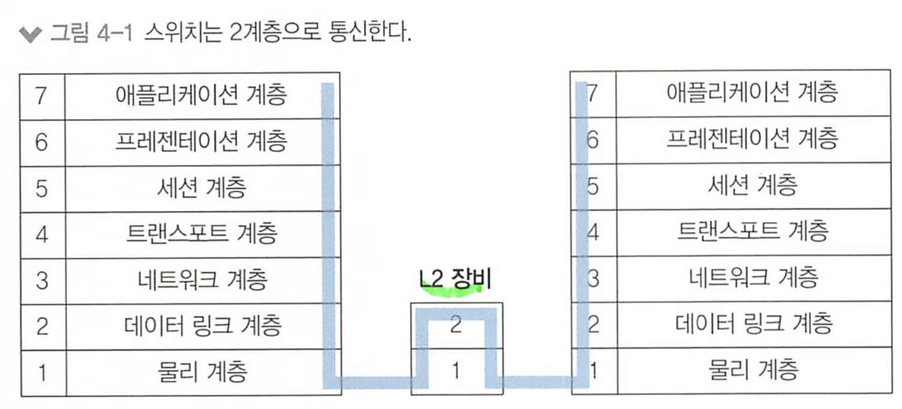
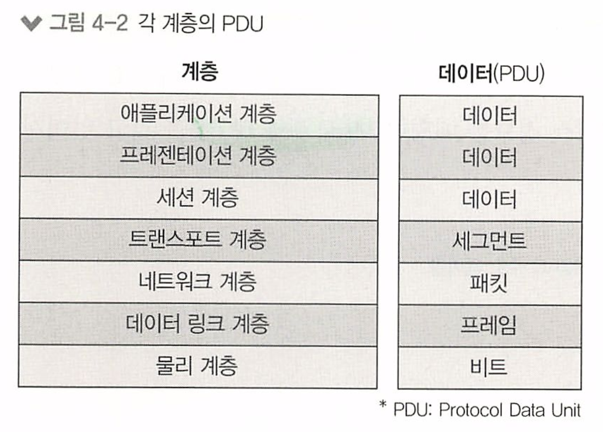
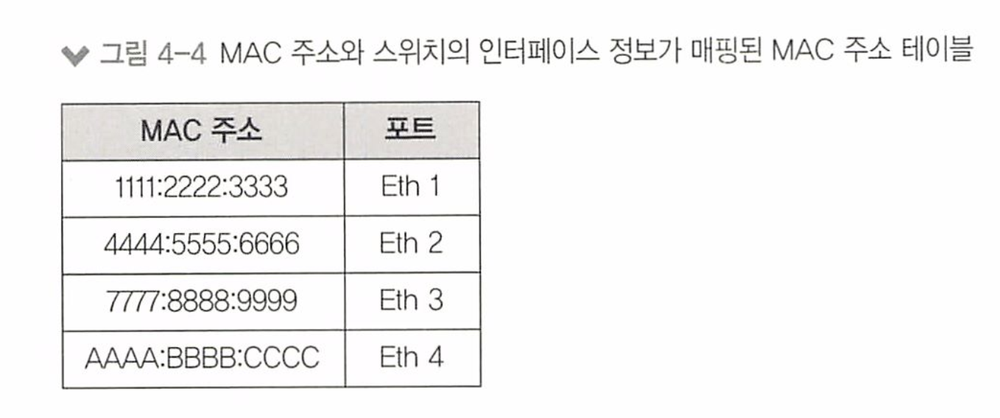
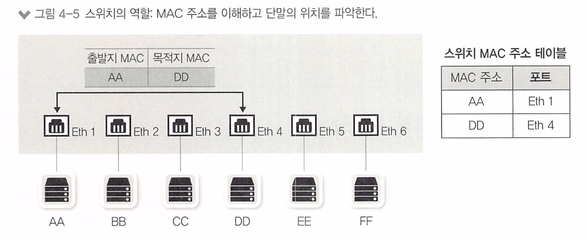
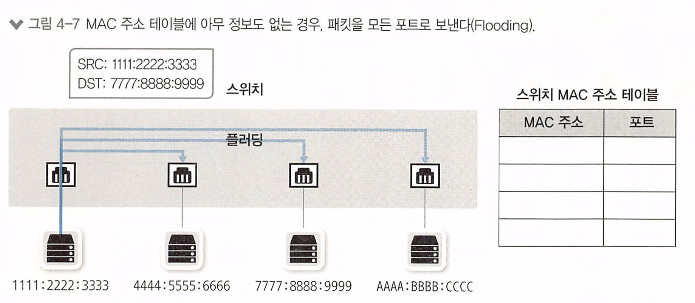
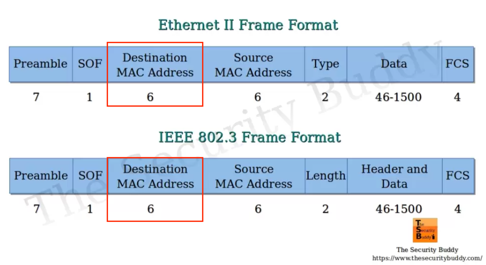
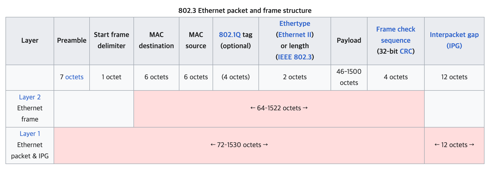
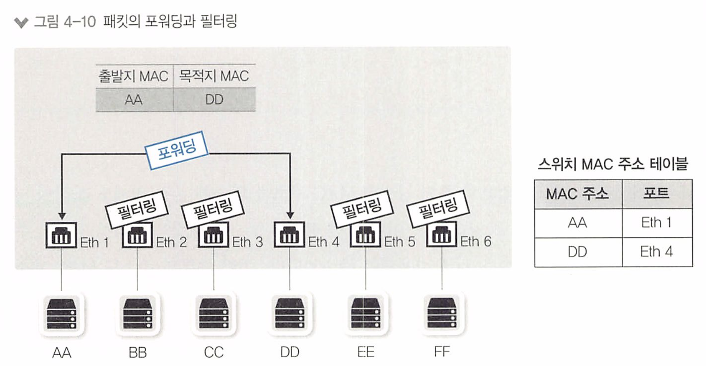
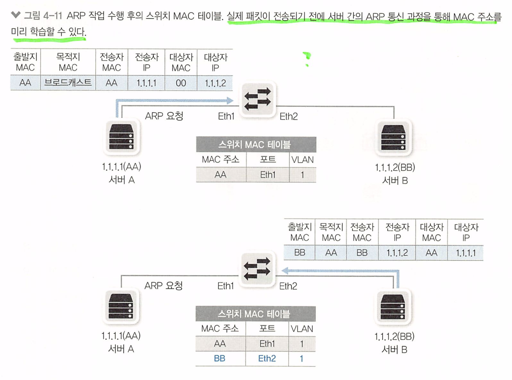

# 스위치 : 2계층 장비

* 스위치 장비 동작
* VLAN
* STP

네트워크의 핵심장비인 스위치는 2계층 주소인 MAC 주소를 기반으로 동작한다. 

네트워크 스위치는 물리 포트에 연결된 디바이스가 보낸 패킷을 받아서 패킷이 도달하려는 다른 디바이스로 전달(Forward)한다

* 네트워크 스위치는 여러 대의 컴퓨터나 네트워크 장치들이 연결된 네트워크에서 데이터를 전송하고 수신하는 역할
* **네트워크의 중재자**

스위치는 MAC주소를 기반으로 패킷을 전달한다.

* 맥 주소 기반이기 때문에 패킷이 동일한 네트워크 안에 있는 다른 장치로 전송되는 경우에도 해당 장치만이 패킷을 받을 수 있다. 

또한, VLAN 기능(한 대의 장비에서 논리적으로 네트워크를 분리할 수 있는 기능)과 STP(스패닝 트리 프로토콜, 네트워크 루프 방지)와 같은 기능을 기본적으로 가지고있다.

> 패킷? 프레임
>
> 각 계층에서 헤더와 데이터를 합친 부분을 PDU(Protocol Data Unit) 이라고 한다.
>
> 1계층 PDU : 비트
>
> 2계층 : 프레임
>
> 3계층 : 패킷
>
> 4계층 세그먼트 
>
>  5 6 7 : 데이터

# 4.1 스위치 장비 동작

스위치가 없던 오래된 이더넷 네트워크에서 는 패킷을 전송할 때 서로 경합해 그로 인한 네트워크 성능 저하가 컸는데, 이런 경쟁을 없애고 패킷을 동시에 여러 장비가 서로 간섭 없이 통신하도록 도와줌으로써. 여러 단말이 한꺼번에 통신할 수 있어 통신하기 위해 기다리거나 충돌 때문에 대기하는 문제가 해결되고 네트워크 전체의 통신 효율성이 향상되었다.

> 스위치의 핵심 역할은 누가 어느 위치에 있는지 파악하고 패킷을 정확히 전송하는 것이다 

스위치가 2계층 맥주소를 이해하고 MAC 주소 테이블을 고 있어서 가능한 일이다.

스위치는 전송하려는 패킷의 헤더 안에 있는 2계층 목적지 주소를 확인하고 MAC주소 테이블에서 해당 주소가 어느 포트에 있는지 확인하고 해당 포트로만 패킷을 전송한다.

패킷의 도착지 주소가 맥 주소 테이블에 있으면 해당 주소가 매핑된 포트로만 패킷을 전송하고 다른 포트로는 전송하지 않는다.

이 동작 방식을 다음3가지로 정리한다

1. 플러딩(Flooding)
2. 어드레스 러닝(Address Learning)
3. 포워딩 / 필터링 (Forwarding / Filtering)

> 이 세가지 를 이용해서 동작한다. 

## 4.1.1 플러딩 (Flooding)

스위치는 처음 부팅하면 네트워크 관련 정보가 아무 것도 없어 네트워크 통신을 중재하는 자신의 역할을 하지 못하고 허브처럼 동작한다.

* 허브는 데이터를 받으면 그 데이터를 연결된 모든 포트 또는 장치로 데이터를 중계하여 전송한다. 

**플러딩**이란, 이렇게 스위치가 특정 맥 주소의 포트에만 전송하는 것이 아닌, 허브와 같이 모든 포트로 패킷을 전송하는 것을 의미한다. 

* 스위치가 목적지 주소를 알지 못하는 경우에 사용

스위치는 패킷이 들어오면 도착지 맥 주소를 확인하고, 자신이 갖고있는 MAC 주소 테이블에 해당 MAC 주소를 확인하여 전송하는데,

없으므로 연결된 모든 포트 또는 장치로 전송하는 것이다.

이 이유는, 스위치는 LAN에서 동작하므로 자신이 정보를 갖고있지 않더라도 어딘가에 있는 다른 장비가 있을 수 있다고 가정하고 보내는 것이다. 

즉 네트워크 목적지 주소를 모르는 경우에 동작한다. 

이렇게 진행되다가, 패킷이 스위치에 들어오면 해당 패킷 정보의 MAC 주소를 보고 이를 학습해 MAC 주소 테이블을 만든 후 이를 통해 패킷을 전송한다.

**비 정상적인 플러딩**

스위치를 사용하면 필요한 곳에만 패킷을 포워딩(forward)하므로 주변 통신을 가로채기 힘들어 보안에 도움이 된다. 

공격자들은 스위치하게 엉뚱한(이상있는) MAC 주소를 습득시키거나 MAC 테이블을 꽉 차게 해 스위치의 플러딩 동작을 유발하는  **MAC 주소 스푸핑** 기법을 이용해 공격한다.

이 외에도 ARP 포이즈닝(Poisoning) 기법을 이용해 모니터링해야 할 IP의 MAC 주소를 공격자 자신인것처럼 속여 원하는 통신을 가로채기도 한다. 

## 4.1.2 어드레스 러닝(Address Learning)

어드레스 러닝 : 스위치가 MAC 주소 테이블을 만들고 유지하는 과정

* MAC 주소 테이블은 어느 위치(포트)에 어떤 장비(MAC 주소)가 연결되었는지에 대한 정보가 저장되어 있는 임시 테이블

어드레스 러닝은 패킷의 **출발지 MAC 주소 정보**를 이용한다.

1. 패킷이 특정 포트에 들어오면 스위치에 해당 패킷의 출발지 MAC 주소와 포트번호를 MAC 주소 테이블에 기록한다.

2. 1번 포트에서 들어온 패킷의 출발지 MAC 주소가 AAAA 라면 1번 포트에 AAAA MAC 주소를 가진 장비가 연결되었다고 추론하여 정보를 습득한다.

3. 이 과정을 반복하다. 

어드레스 러닝은 출발지의 MAC 주소 정보를 사용하므로 브로드캐스트나 멀티캐스트에 대한 MAC 주소를 학습할 수 없다. 

* 두 가지 모두 목적지 MAC 주소 필드에서만 사용하기 때문.
* 브로드캐스트와 멀티캐스트 패킷은 **목적지 주소 필드에 특정 값**이 사용되므로 스위치는 이러한 패킷을 통해 출발지 MAC 주소를 학습하지 않는다.
  * 브로드 캐스트의 경우 : 6바이트로 구성된 모든 비트가 1로 설정된 값인 "FF:FF:FF:FF:FF:FF" 같은 값. **기본 게이트웨이**.
  * 멀티캐스트의 경우 : 멀티캐스트 주소는 01:00:5E로 시작하는 3바이트로 구성된 값. 나머지 3바이트는 멀티캐스트 그룹 식별자
  * 이렇게 브로드캐스트와 멀티캐스트 패킷은 목적지 MAC 주소 필드에 특정 값이 사용되어 네트워크 상의 모든 장치 또는 특정 그룹의 멤버에게 패킷을 전송
* **브로드캐스트와 멀티캐스트 패킷은 네트워크에 있는 모든 장치에게 동시에 전송되어야 하기 때문에, 스위치가 출발지 MAC 주소를 학습하면 패킷을 올바르게 전달할 수 없게 되기 때문**

 스위치가 사전에 미리 정의된 MAC 주소 정보를 가지고 있는데, 이 주소들은 대부분 스위치 간 통신을 위해 사용되는 주소dㅣ다.

* 스위치에서 MAC 주소 테이블을 보기 위해서는 show mac address-table 명령어를 사용한다

이더넷 프레임의 내부 구조는 IEEE 802.3에 규정되어 있다

d일반적으로 이더넷 프레임은 목적지 MAC 주소, 출발지 MAC 주소, 유형/길이, 데이터 및 CRC 등의 필드를 포함하는 구조

* 출발지 맥 주소 : MAC Source
* 목적지 맥 주소 : MAC Destination

* "Octet"은 8 비트로 구성된 데이터 단위 = 1Byte 
  * 네트워크 프로토콜에서 데이터 단위를 나타낼 때 "octet"이라는 용어를 사용
* "MAC destination이 6 octets"는 "MAC 목적지 주소가 6바이트(48비트)"를 의미

즉, 물리 계층에서 전송된 비트들을, 데이터 링크 계층에서 NIC가 물리적인 연결로부터 비트 스트림을 만들어 비트들을 그룹화하여 프레임을 만든다. 이 프레임이 이더넷 프레임이며 패킷이 이것을 한번 감싼 구조이다

패킷은 특정 프로토콜에서 정의된 헤더와 데이터로 구성되어 있다. 패킷은 일반적으로 프레임 안에 포함되는 데이터의 단위로 간주된다. 

* EtherType은 이더넷 프레임의 헤더에 있는 필드로, 해당 프레임의 **상위 계층 프로토콜**을 식별하는 값이다. 이 값으로 프로토콜을 구분할 수 있다.
  * 예를 들어, IPv4 패킷은 EtherType 값으로 0x0800을 사용하고, IPv6 패킷은 0x86DD를 사용

* https://en.wikipedia.org/wiki/Ethernet_frame

## 4.1.3 포워딩 / 필터링

스위치의 동작은 다음과 같다

패킷이 스위치에들어온 경우 도착지 MAC 주소를 확인하고 MAC 테이블과 비교해 맞는 정보가 있으면 패킷을 전송한다

해당 포트로 패킷을 전송하는 것을 **포워딩(패킷 포워딩)** 이라 하고, 다른 포트로는 보내지 않는것을 **필터링** 이라고 한다.

**포워딩과** **필터링을** 통해 목적지로만 패킷을 전달시키는 것이다.

* 스위치에서는 포워딩과 필터링 작업이 여러 포트에서 동시에 수행될 수 있다.
* 통신이 다른 포트에 영향을 미치지 않는다.

일반적인 **유니캐스트** 에 대해서만 포워딩과 필터링 작업을 수행한다.

BUM 트래픽은 조금 다르게 동작한다.

* 브로드 캐스트
* 언노운 유니캐스트
* 멀티캐스트

브로드, 멀티 캐스트 두 가지 모두 목적지 MAC 주소 만 사용하기 때문에 이런 트래픽은 모두 플러딩 한다.

* 언노운 유니캐스트도 맥 주소 테이블에 없는 주소이다.

**LAN에서의 ARP - 스위치 동작**

이더넷 - TCP/IP 네트워크에서는 스위치가 유니캐스트를 플러딩 하는 경우는 거의 없다 - **중요**

* 유니캐스트 : 특정 목적지를 가진 단일 호스트 간의 통신

패키을 만들기 전에 통신해야 하는 단말의 MAC 주소를 알아내기 위해 ARP 브로드캐스트가 먼저 수행되어야 하므로 ARP 브로드 캐스트가 먼저 전달되기 때문이다.

이 ARP를 이용한 MAC 주소 습득 과정에서 이미 스위치는 출발지와 목적지의 MAC주소를 습득하여, 실제 유니캐스트 통신이 시작되면 이미 만들어진 MAC 주소 테이블로  패킷을 전송(포워딩 / 필터링)한다.

ARP와 MAC 테이블이 일정시간동안 지워지지 않는것을 Aging Time 이라고 한다.

* 일반적으로 MAC 테이블의 에이징 타임이 단말의 ARP 에이징 타임보다 길어 플러딩 없이 효율적으로 운영할 수 있다.

