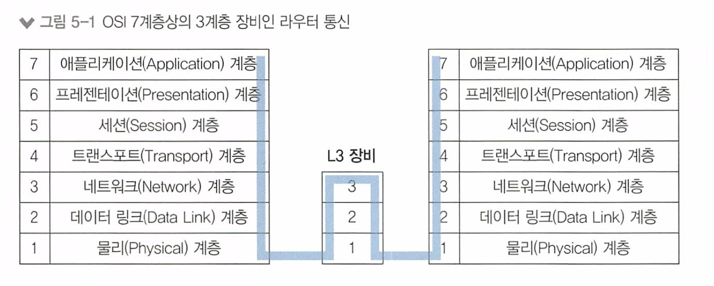

# 5장 라우터/ L3 스위치 : 3계층 장비

- 5.1 라우터의 동작 방식과 역할
- 5.2 경로 지정 - 라우팅/스위칭
- 5.3 라우팅 설정 방법

라우터는 3계층에서 동작하는 여러 네트워크 장비의 대표격으로 이름처럼 경로를 지정해주는 장비. 

라우터에 들어오는 패킷의 목적지 IP 주소를 확인하고 자신이 가진 경로(route)를 활용해 패킷을 최적의 경로로 포워딩 한다.

현대 네트워크 환경에선 인터넷을 통해 다양한 서비스를 제공받기 때문에 인터넷 연결을위한 원격지 통신이 매우 중요한데, 라우터는 이러한 원격지 통신에서 필수적인 장비이다. 

**라우터? L3 스위치?** 

> 스위치는 대표적인 2계층 장비이다. 
>
> 하지만, 3계층에서 동작하는 L3 스위치라 부르는 장비들도 많이 사용되고있다. 
>
> 과거에는 라우터는 소프트웨어로 구현하고 스위치는 하드웨어로 구현하는 형태로 구분하거나 다양한 기능의 라우터와 패킷을 빨리 보내는데 최적화된 스위치로 구분했지만, 최근에는 기술의 발전으로 라우터와 L3 스위치를 구분하기 어렵다. 
>
> 그렇기에 이번 챕터에서 다루는 내용은 라우터를 설명하지만 L3 스위치로도 모두 동일하게 적용된다.

# 5.1 라우터의 동작 방식과 역할

라우터의 동작 방식

1. 경로 지정: 다양한 경로수집 후 최적의 경로를 라우팅 테이블에 저장한 뒤 패킷이 들어오면 도착지 IP주소를 라우팅 테이블과 비교해 최선의 경로로 패킷을 내보낸다. 

2. 브로드캐스트 컨트롤: 들어온 패킷의 목적지 주소가 라우팅 테이블에 없으면 패킷을 버린다.

3. 프로토콜 변환: 패킷 포워딩 과정에서 기존 2계층 헤더 정보를 제거 후 새로운 2계층 헤더를 만든다.

## 경로 지정 - 5.1.1

라우터는 패킷이 들어오면 패킷의 도착지 IP주소를 확인해서 경로를 지정해 패킷을 포워딩해줘야 한다.

경로를 어떻게 지정할까?

IP주소는 네트워크 주소와 호스트 주소로 나뉜다. 

그렇기에 로컬 네트워크와 원격지 네트워크 구분이 가능하고 이 네트워크 주소를 기반으로 경로를 찾을 수 있다. 

라우터는 이 IP주소를 확인해 원격지에 있는 적절한 경로로 패킷을 포워딩한다. 

