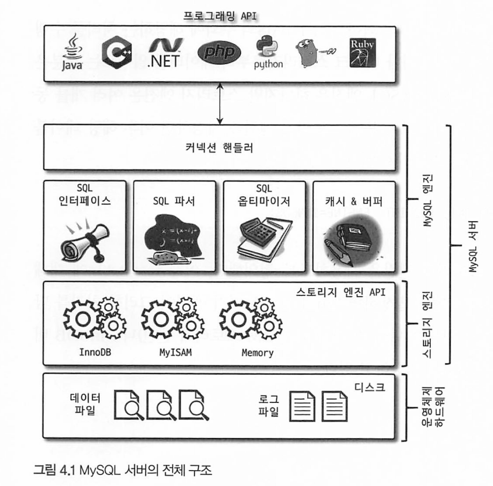
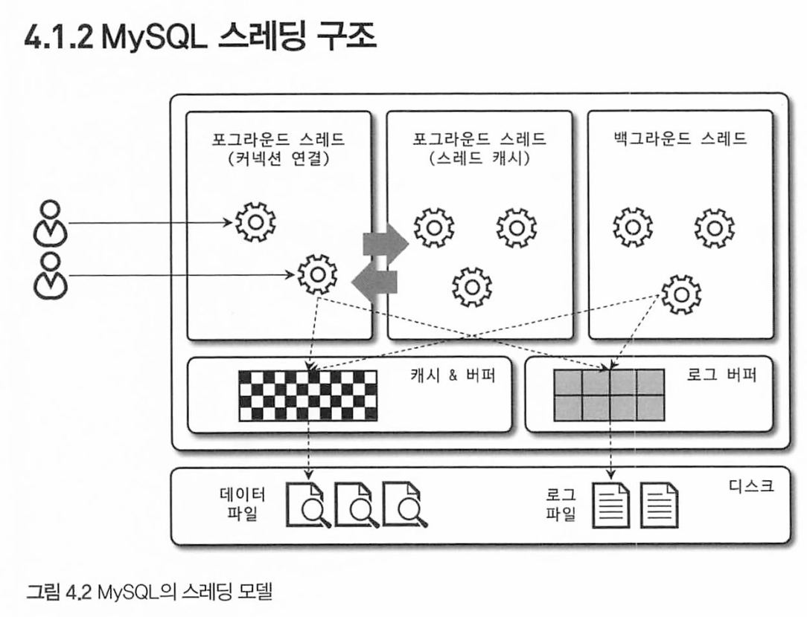
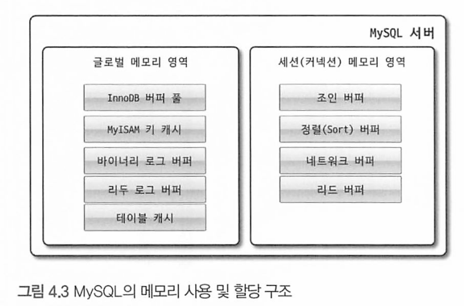
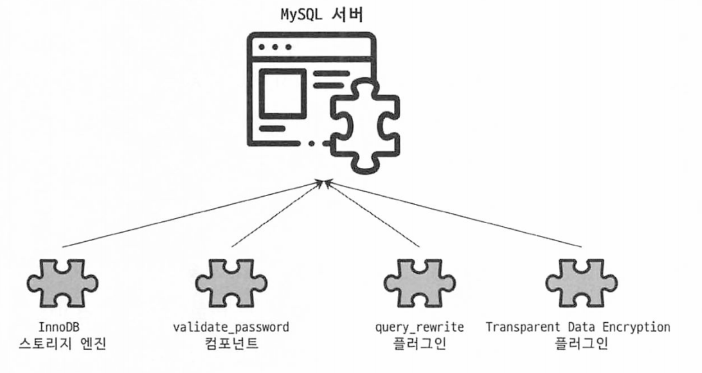
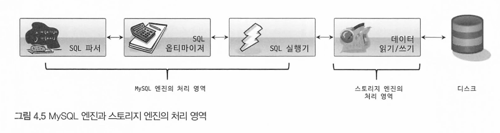
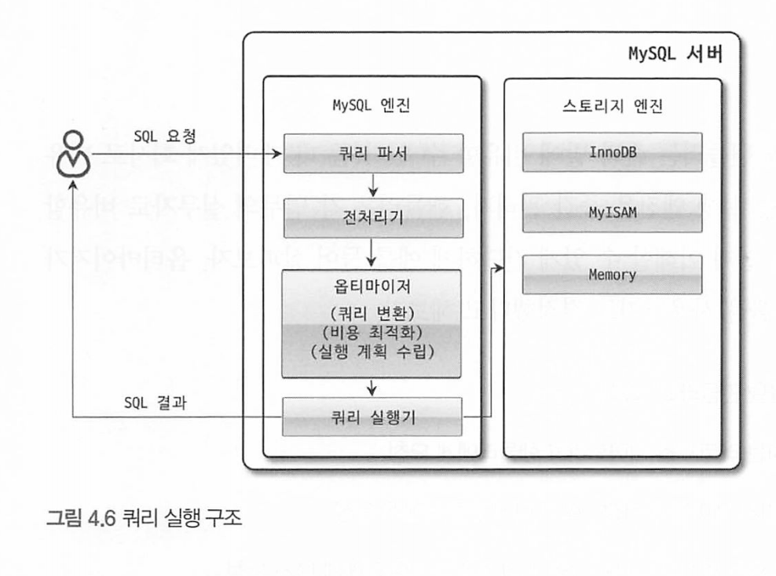

# 4장 아키텍처

# 4.1 MySQL 엔진 아키텍처


머리 : MySQL 엔진 

손발 : 스토리지 엔진

MySQL은 접속 클라이언트, 엔진, 스토리지 엔진으로 구분할 수 있다.

엔진에서는 SQL문장을 분석하고 검증하고 최적화한 뒤 스토리지 엔진을 통해 데이터를 읽고 쓴다.

스토리지 엔진은 실제 디스크에 접근해 데이터를 읽고 쓰는 역할을 수행한다. InnoDB, MyISAM 등을 선택할 수 있다.

InnoDB는 기본으로 선택되는 스토리지 엔진이며, 버퍼풀, 언두 로그 등을 통해 MVCC 를 제공한다.



### MySQL 엔진

요청된 SQL 문장을 분석하거나 최적화하는 등 DBMS의 두뇌에 해당하는 처리를 수행한다.

· 중심 구성 요소

\- **커넥션 핸들러, SQL 파서, 전처리기**: 클라이언트로부터 접속 및 쿼리 요청

\- **옵티마이저**: 쿼리를 최적화하여 실행

· MySQL은 **표준 SQL**(ANSI SQL) 문법을 지원하여, 표준 문법에 따라 작성된 쿼리는 타 DBMS와 호환되어 실행될 수 있다.

### 스토리지 엔진 (InnoDB, MyISAM)

실제 데이터를 DISK 스토리지에 저장하거나, 읽어오는 처리를 담당한다.

* 스토리지 엔진은 여러 개를 동시에 사용할 수 있다. (각 테이블 마다 다른 스토리지 엔진 사용 가능)

* 성능 향상을 위해 키 캐시(MyISAM), 버퍼 풀(InnoDB) 등의 기능을 내장한다.

ex) 테이블이 사용할 스토리지 엔진 지정

```mysql
mysql> CREATE TABLE test_table (fd1 INT, fd2 INT) ENGINE=INNODB;
```

ex) 현재 테이블의 스토리지 확인하기

```mysql
mysql> SHOW TABLE STATUS FROM DB명
```

```mysql
mysql> SHOW TABLE STATUS FROM dadok_local;
+--------------------------+--------+---------+------------+------+----------------+-------------+-----------------+--------------+-----------+----------------+---------------------+-------------+------------+--------------------+----------+----------------+---------+
| Name                     | Engine | Version | Row_format | Rows | Avg_row_length | Data_length | Max_data_length | Index_length | Data_free | Auto_increment | Create_time         | Update_time | Check_time | Collation          | Checksum | Create_options | Comment |
+--------------------------+--------+---------+------------+------+----------------+-------------+-----------------+--------------+-----------+----------------+---------------------+-------------+------------+--------------------+----------+----------------+---------+
| book_groups              | InnoDB |      10 | Dynamic    |    0 |              0 |       16384 |               0 |        49152 |         0 |           NULL | 2023-03-09 18:42:14 | NULL        | NULL       | utf8mb4_0900_ai_ci |     NULL |                |         |
| books                    | InnoDB |      10 | Dynamic    |    0 |              0 |       16384 |               0 |        16384 |         0 |              2 | 2023-03-09 18:42:14 | NULL        | NULL       | utf8mb4_0900_ai_ci |     NULL |                |         
| jobs                     | InnoDB |      10 | Dynamic    |    0 |              0 |       16384 |               0 |            0 |         0 |           NULL | 2023-03-09 18:42:14 | NULL        | NULL       | utf8mb4_0900_ai_ci |     NULL |                |         |
| oauth2_authorized_client | InnoDB |      10 | Dynamic    |    0 |              0 |       16384 |               0 |            0 |         0 |           NULL | 2023-03-09 18:41:55 | NULL        | NULL       | utf8mb4_0900_ai_ci |     NULL |                |         |
| user_authorities         | InnoDB |      10 | Dynamic    |    1 |          16384 |       16384 |               0 |        32768 |         0 |              2 | 2023-03-09 18:42:14 | NULL        | NULL       | utf8mb4_0900_ai_ci |     NULL |                |         |
| users                    | InnoDB |      10 | Dynamic    |    1 |          16384 |       16384 |               0 |        32768 |         0 |              2 | 2023-03-09 18:42:14 | NULL        | NULL       | utf8mb4_0900_ai_ci |     NULL |                |         |
+--------------------------+--------+---------+------------+------+----------------+-------------+-----------------+--------------+-----------+----------------+---------------------+-------------+------------+--------------------+----------+----------------+---------+
```

**MyISAM 스토리지 엔진**

- MySQL 5.5 버전 이전에 테이블 생성시 디폴트로 지정되던 스토리지 엔진
- 키 캐시 기능을 지원한다.

**InnoDB 스토리지 엔진**

- MysOL 5.5 버전 이후에 테이블 생성시 디폴트로 지정된 스토리지 엔진
- 키 캐시 대신 버퍼풀을 지원한다.
- 그리고 무엇보다도 트랜잭션이 지원 되기 때문에 현재는 MySQL 사용한다고 하면 InnoDB 스토리지 엔진을 사용한다고 보아 도 무방할 정도로 많은 곳에서 사용하고있다.

주요 차이점

1. 트랜잭션 지원:
   - InnoDB: InnoDB는 트랜잭션을 지원
   - MyISAM: MyISAM은 트랜잭션을 지원하지 않는다. 따라서 트랜잭션에 대한 롤백이나 복구 기능이 없으며, 개별 쿼리마다 자동 커밋이 발생
2. 락 및 동시성:
   - InnoDB: InnoDB는 행 단위의 락을 사용한다. 다중 사용자 환경에서 동시에 여러 트랜잭션을 처리할 수 있다. 
   - MyISAM: MyISAM은 테이블 단위의 락을 사용. 따라서 동시에 여러 쓰기 작업이 발생할 경우 성능 저하가 발생할 수 있다. 읽기 작업이 많은 경우에는 성능이 좋을 수 있다
3. 외래 키 지원:
   - InnoDB는 외래 키 제약 조건을 지원하지만 MyISAM은 외래 키 제약 조건을 지원하지 않는다.외래 키 관계를 직접 처리해야 한다


> **`InnoDB` 엔진**은 **트랜잭션 처리가 필요**하고 **대용량의 데이터를 다루는 부분에서** 효율적이고,
> **`MyISAM` 엔진**은 **트랜잭션 처리가 필요 없고**, **Read only 기능이 많은 서비스일수록 효율적**이다.


### 핸들러 API

핸들러 요청 : MySQL 엔진의 **쿼리 실행기**에서 데이터를 쓰거나 읽어야 할 때, 각 **스토리지 엔진**에 쓰기 또는 읽기 요청

핸들러 API : 핸들러 요청에 사용되는 API

```mysql
SHOW GLOBAL STATUS LIKE 'Handler%'; 
```

위 명령으로 핸들러 API 통해 얼마나 많은 데이터(레코드) 작업이 있었는지 확인할 수 있다.

ex) commit, delete, update, write, read_key, rollback

## MySQL 스레딩 구조 



MySQL 서버는 프로세스 기반이 아닌 스레드 기반(멀티스레드)으로 작동하며, 크게 Foreground Thread와 Background Thread로 구분할 수 있다.

실행중인 스레드의 목록은 performance_schema DB의 threads 테이블을 통해 확인할 수 있다.

```mysql
mysql> select thread_id, name, type from performance_schema.threads ORDER BY type, thread_id;
+-----------+---------------------------------------------+------------+
| thread_id | name                                        | type       |
+-----------+---------------------------------------------+------------+
|         1 | thread/sql/main                             | BACKGROUND |
|         3 | thread/innodb/io_ibuf_thread                | BACKGROUND |
|         4 | thread/innodb/io_read_thread                | BACKGROUND |
|         5 | thread/innodb/io_read_thread                | BACKGROUND |
|         6 | thread/innodb/io_read_thread                | BACKGROUND |
|         7 | thread/innodb/io_read_thread                | BACKGROUND |
|         8 | thread/innodb/io_write_thread               | BACKGROUND |
|         9 | thread/innodb/io_write_thread               | BACKGROUND |
|        10 | thread/innodb/io_write_thread               | BACKGROUND |
|        11 | thread/innodb/io_write_thread               | BACKGROUND |
|        12 | thread/innodb/page_flush_coordinator_thread | BACKGROUND |
|        13 | thread/innodb/log_checkpointer_thread       | BACKGROUND |
|        14 | thread/innodb/log_flush_notifier_thread     | BACKGROUND |
|        15 | thread/innodb/log_flusher_thread            | BACKGROUND |
|        16 | thread/innodb/log_write_notifier_thread     | BACKGROUND |
|        17 | thread/innodb/log_writer_thread             | BACKGROUND |
|        18 | thread/innodb/log_files_governor_thread     | BACKGROUND |
|        23 | thread/innodb/srv_lock_timeout_thread       | BACKGROUND |
|        24 | thread/innodb/srv_error_monitor_thread      | BACKGROUND |
|        25 | thread/innodb/srv_monitor_thread            | BACKGROUND |
|        26 | thread/innodb/buf_resize_thread             | BACKGROUND |
|        27 | thread/innodb/srv_master_thread             | BACKGROUND |
|        28 | thread/innodb/dict_stats_thread             | BACKGROUND |
|        29 | thread/innodb/fts_optimize_thread           | BACKGROUND |
|        30 | thread/mysqlx/worker                        | BACKGROUND |
|        31 | thread/mysqlx/acceptor_network              | BACKGROUND |
|        32 | thread/mysqlx/worker                        | BACKGROUND |
|        36 | thread/innodb/buf_dump_thread               | BACKGROUND |
|        37 | thread/innodb/clone_gtid_thread             | BACKGROUND |
|        38 | thread/innodb/srv_purge_thread              | BACKGROUND |
|        39 | thread/innodb/srv_worker_thread             | BACKGROUND |
|        40 | thread/innodb/srv_worker_thread             | BACKGROUND |
|        41 | thread/innodb/srv_worker_thread             | BACKGROUND |
|        43 | thread/sql/signal_handler                   | BACKGROUND |
|        44 | thread/mysqlx/acceptor_network              | BACKGROUND |
|        42 | thread/sql/event_scheduler                  | FOREGROUND |
|        45 | thread/sql/compress_gtid_table              | FOREGROUND |
|       192 | thread/sql/one_connection                   | FOREGROUND |
+-----------+---------------------------------------------+------------+
38 rows in set (0.00 sec)
```

이 중에서 마지막 'thread/sql/one_conection' 스레드만 실 제 사용자의 요청을 처리하는 포그라운드 스레드다

> 이 스레드 모델은 MySQL 커뮤니티 에디션 모델에서 사용되는 모델이며,
>
> MySQL 엔터프라이즈 에디션 등에서는 다른 모델을 사용할 수도 있다.


### MySQL의 포그라운드 스레드(=클라이언트 스레드, 사용자 스레드)

사용자의 요청을 처리하는 스레드

데이터를 읽는 작업을 처리한다. 

* 디스크에 직접 데이터를 쓰는 작업은 백그라운드 스레드에서 일어남.

포그라운드 스레드의 수는 MySQL 서버에 접속된 **클라이언트의 숫자** 만큼 존재하며, 사용자가 작업을 마치고 커넥션을 종료하면 스레드 캐시로 돌아간다. 

이때, 이미 스레드 캐시에 일정 개수 이상의 대기중인 스레드가 있으면 캐시에 넣지 않고 스레드를 종료 시켜 일정 개수의 스레드만 캐시에 유지한다.

* 스레드 캐시에 유지할 수 있는 최대 스레드 수는 thread_cache_size 시스템 변수로 설정한다. 


이 스레드는 데이터 캐시나 버퍼에서 데이터를 읽어오며, 만약 캐시나 버퍼에 데이터가 없으면 디스크나 인덱스파일에 데이터를 직접 읽어와 처리하기도 한다.

InnoDB는 데이터 버퍼나 캐시까지만 포그라운드 스레드가 처리하고 나머지 버퍼로부터 디스크까지 기록하는 작업은 백그라운드 스레드가 처리한다.

MyISAM은 디스크 까지 기록하는 작업을 포그라운드 스레드가 처리한다. 

**포그라운드 스레드가 하는일**

* 클라이언트 통신
* 쿼리 분석 실행 및 처리. SQL 파서로 구문 분석 후 옵티마이저를 통해 실행 계획 결정
* 데이터 액세스 후 결과 반환 

### MySQL의 백그라운드 스레드(=클라이언트 스레드)

디스크에 데이터를 직접 기록하는 작업은 백그라운드 스레드에서 일어난다.

현재 로그나, 버퍼풀에 있는 데이터를 디스크에 기록 기록이외에 데이터를 버퍼로 읽어오거나, 락, 데드락을 모니터하는 백그라운드 쓰레드도 존재한다.

InnoDB의 백그라운드 작업들

* insert buffer 병합하는 스레드
* 로그를 디스크로 기록하는 스레드
* InnoDB버퍼 풀의 데이터를 디스크에 기록
* 데이터를 버퍼로 읽어옴
* 잠금이나 데드락을 모니터링 

사용자의 데이터 쓰기 작업은 지연(버퍼링)되어 처리할 수 있지만, 읽기 작업은 절대 지연될 수 없으므로 일반적인 상용 DBMS는 대부분 쓰기 작업을 버퍼링해서 일괄 처리하는 기능이 탑재 되있고, InnoDB도 이렇게 처리한다.

* MyISAM은 사용자 쓰레드가 쓰기작업까지 한번에 처리한다.

이러한 이유 때문에 InnoDB에서는 INSERT, UPDATE, DELETE 쿼리로 데이터가 변경되는 경우 데이터가 디스크에 완전히 저장될 때까지 기다리지 않아도 된다 


MySQL(InnoDB)이 스레드를 포그라운드, 백그라운드로 나뉜 이유?

읽기 요청의 처리와 쓰기 요청의 처리를 분리하기 위함

읽기 요청의 경우 바로 처리되어야 하지만, 쓰기 작업 같은 경우는 여러 요청을 모아서 한번에 처리해도 사용상의 문제가 되지 않기 때문이다.

## 메모리 할당 및 사용 구조



MySQL의 메모리 공간은 글로벌 메모리 영역과 로컬 메모리 영역으로 구분할 수 있다.

글로벌 메모리 영역은 운영체제로부터 할당된다.

글로벌 메모리 영역과 로컬 메모리 영역은 MySQL 스레드들이 공유해서 사용하는 공간인지 여부에 따라 구분된다. 

### 글로벌 메모리 영역

클라이언트 스레드 수와 무관하게 하나의 메모리 공간만 할당된다.

버퍼 캐시를 위해 사용되며  모든 스레드에 의해 공유된다.

대표적인 글로벌 메모리 영역

- 테이블 캐시
- InnoDB 버퍼 풀
- InnoDB 어댑티브 해시 인덱스
- InnoDB 리두 로그 버퍼

### 로컬 메모리 영역 (=세션 메모리 영역, 클라이언트 메모리 영역)

포워드 스레드(=클라이언트 스레드)가 사용자의 쿼리를 처리하기 위해 사용하는 독자적인 메모리 공간. 

* 클라이언트 - 서버 커넥션을 세션이라고도 한다. 

 스레드간 공유되는 글로벌 메모리영역과 달리, 로컬 메모리 영역은 스레드간 공유되지 않는다.

대표적으로 커넥션 버퍼나 정렬(sort)이나, 조인할때 사용하는 버퍼 등이 있다.

커넥션 버퍼는 커넥션이 열려있는 동안 계속 메모리 공간에 남아있으며, 조인이나 정렬할때 사용되는 버퍼는 쿼리를 실행하는 순 간에만 메모리공간에 할당 되었다가 해제된다.

* 커넥션 버퍼나 결과 버퍼는 커넥션이 유지되는 동안 계속 할당된 상태로 남아있다.
* 소트 버퍼나 조인 버퍼는 쿼리가 실행되는 순간에만 할당했다가 해제된다.

대표적인 로컬 메모리 영역은 다음과 같다.

- 정렬 버퍼(Sort buffer)
- 조인 버퍼
- 바이너리 로그 캐시
- 네트워크 버퍼

## 플러그인 스토리지 엔진 모델



**플러그인**

MySQL에서 기본적으로 제공되는 기능 이외에 부가적인 기능을 더 제공하기 위한 방법으로 플러그인 모델을 사용한다.

InnoDB 또한 플러그인 형태로 제공되는 하나의 스토리지 엔진에 해당한다.

스토리지엔진 뿐만아니라 3장에서 살펴보았던, 사용자 인증을위한 Native Authentication, Caching SHA-2 Authentication과 같은 인증 모듈들도 전부 플러그인이다.

플러그인 확인 하기 - SHOW PLUGINS

```mysql
mysql> SHOW PLUGINS
```

MySQL 쿼리 실행과정을 보면 다음과 같다. 



대부분의 작업이 MySQL 엔진에서 처리되고, 스토리지 엔진에서는 읽기/쓰기 작업만 처리한다. 

>  중요한 점은 MySQL 엔진이 각 스토리지 엔진(InnoDB, MyISAM)에게 데이터를 읽거나 저장하도록 명령하려면 핸들러를 통해야만 한다. 

GROUP BY, ORDER BY 등의 복잡한 처리는 MySQL 엔진 영역의 SQL 실행기가 처리한다. 


하나의 쿼리 작업은 여러 하위 작업으로 나뉘는데, 각 하위 작업이 MySQL 엔진 영역에서 처리되는지, 스토리지 엔진 영역에서 처리되는지 구분할 줄 알아야 한다.

* 성능 최적화: 각 하위 작업이 MySQL 엔진 영역에서 처리되는지, 스토리지 엔진 영역에서 처리되는지 알면, 어떤 작업이 성능에 영향을 주는지 파악할 수 있습니다. 예를 들어, 데이터베이스가 많은 I/O 작업을 수행한다면 스토리지 엔진에서 병목 현상이 발생할 수 있으므로 디스크 I/O를 최소화하기 위한 조치가 필요합니다. 이러한 성능 이슈를 파악하고 최적화하는 데에는 각 영역의 역할과 작업 흐름을 이해하는 것이 중요합니다.
* 버그 또는 이슈 식별: 각 영역에서 발생하는 문제를 파악하려면 어떤 작업이 어느 영역에서 처리되는지를 알아야 합니다. 예를 들어, 특정 쿼리 작업에서 예기치 않은 결과가 발생한다면 해당 작업이 MySQL 엔진 영역에서 오류가 발생한 것인지, 스토리지 엔진 영역에서 문제가 발생한 것인지 확인할 수 있습니다. 이를 통해 문제를 식별하고 수정할 수 있습니다.
* 기능 활용 및 호환성: 각 엔진의 역할을 이해하면 MySQL 서버에서 지원하는 기능과 스토리지 엔진이 제공하는 기능을 파악할 수 있습니다. MySQL 엔진은 트랜잭션 관리, 외래 키 지원 등과 같은 고급 기능을 제공하는 반면, 스토리지 엔진은 특정 데이터 형식이나 인덱스 유형을 지원하는 경우가 있습니다. 이러한 기능을 활용하기 위해서는 각 영역의 역할을 구분하고 해당 기능을 지원하는 엔진을 선택하는 것이 중요합니다.


플러그인 구조의 장점: 새로운 용도를 위해 개발할 때, 전체 데이터베이스가 아닌 필요한 부분의 플러그인만 개발해서 교체하면 된다.

## 컴포넌트

플러그인과 비슷한 역할을 하나, 플러그인의 단점을 극복하기 위한 아키텍처.

**MySQL 서버 플러그인의 단점**

* 오직 MySQL 서버와 인터페이스할 수 있고, 플러그인끼리 통신할 수 없다.

*  MySQL 서버의 변수나 함수를 직접 호출하기 때문에 안전하지 않다. (캡슐화가 안됨)

* 플러그인은 상호 의존 관계를 설정할 수 없어서 초기화가 어렵다.

컴포넌트는 위 단점들을 극복했다.

## 쿼리 실행 구조



MySQL 쿼리 실행 순서 

1. 사용자 요청
2. 쿼리 파서에서 트리형태로 쿼리 재구성 -> 문법오류 걸러짐
3. 전처리기 - 쿼리 구조적 오류, 테이블, 컬럼이름 검증, 권한 검증
4. 옵티마이저 -> 쿼리를 어떻게 빠르게 처리할지 결정
5. 쿼리실행기 - 옵티마이저에서 만든 계획대로 핸들러에게 실제 요청을 주고받음
6. 스토리지엔진 = 실제 데이터를 디스크로부터 읽고 쓰는 작업을 수행

조금 더 자세히 보자

**쿼리 파서**

사용자 요청으로 들어온 쿼리 문장을 **토큰**으로 분해해 **트리** 형태의 구조로 만드는 작업을 한다.

* 토큰: MySQL이 인식할 수 있는 최소 단위의 어휘나 기호
* **쿼리 문장**의 **기본 문법 오류가** 걸러져, 문법 오류 발생시 사용자에게 오류 메시지를 전달한다.

 

**전처리기** - 검증

파서 과정에서 만들어진 파서 트리를 기반으로 쿼리 문장에 구조적인 문제가 있는지 확인한다.

각 토큰을 테이블 이름, 칼럼 이름, 내장 함수 같은 개체에 매핑해 해당 객체의 존재 여부와 객체 접근 권한 등을 확인한다. 

존재하지 않거나 권한상 사용할 수 없는 개체의 토큰이 걸러지는 단계다.

 

**옵티마이저**

사용자 요청으로 들어온 쿼리 문장을 저렴한 비용으로 가장 빠르게 처리할지 결정하는 역할을 담당한다. 

*  DBMS의 두뇌에 해당한다.

 옵티마이저가 더 나은 선택을 할 수 있게 유도하는가가 쿼리 튜닝의 시작이다. 


**실행 엔진**

만들어진 계획대로 각 핸들러에게 요청해서 받은 결과를 또 다른 핸들러 요청의 입력으로 **연결하는 역할**을 수행한다.

* 옵티마이저는 회사의 경영진, 실행 엔진은 중간 관리자, 핸들러는 업무의 실무자나 팀으로 비교 가능

ex) 옵티마이저가 group by를 처리하기 위해 임시테이블을 사용한다 하였을때의 계획

1. 실행 엔진이 핸들러에게 임시 테이블을 만들라고 요청
2. 다시 실행 엔진은 WHERE 절에 일치하는 레코드를 읽어오라고 핸들러에게 요청
3. 읽어온 레코드들을 1번에서 준비한 임시 테이블로 저장하라고 다시 핸들러에게 요청
4. 데이터가 준비된 임시 테이블에서 필요한 방식으로 데이터를 읽어 오라고 핸들러에게 다시 요청
5. 최종적으로 실행 엔진은 결과를 사용자나 다른 모듈로 넘김

즉, 실행 엔진은 요청을 다른 요청으로 전달하여 요청들을 이어주는 역할이다. 

 

**핸들러(스토리지 엔진)**

 MySQL 서버 가장 밑단에서 MySQL 실행 엔진의 요청에 따라 데이터를 **디스크로 저장**하고 디스크로부터 읽어 오는 역할을 담당한다.

* 핸들러는 결국 스토리지 엔진을 의미한다.

핸들러가 InnoDB 테이블을 조작하면 핸들러는 InnoDB 엔진이고 MyISAM 을 조작하면 핸들러는 MyISAM이다.


## 쿼리 캐시 - 지금은 제거됨 

SQL 실행 결과를 메모리에 캐시하고, 동일한 SQL 쿼리가 실행되면 테이블을 읽지 않고 즉시 결과를 반환하는 기능이다.  데이터 변경은 거의 없고 읽기만 하는 서비스에서는 매우 훌륭한 기능이지만, 그런 서비스는 거의 없다 

 

* 문제점: 빠른 응답을 필요로 하는 웹 기반 응용 프로그램에서 매우 중요한 역할을 담당했지만, 테이블 데이터가 변경되면 캐시에 저장된 결과 중 관련된 것은 모두 삭제하는 문제가 있었다. 이는 심각한 동시 처리 성능 저하를 유발했다. - 버그의 원인 

`MySQL 8.0 부터 완전히 제거되었다.`


## 스레드 풀 (Thread Pool)

스레드 풀은 작업처리에 사용되는 스레드를 제한된 개수만큼 정해놓고 작업큐에 들어오는 작업들을 하나씩 스레드가 맡아 처리한다. 

 MySQL 서버 엔터프라이즈 에디션은 스레드 풀 기능을 제공하고, **커뮤니티 버전은 제공하지 않는다**. 하지만 커뮤니티 버전도 플러그인 형태로 **Percona Server의 스레드 풀을 사용할 수 있다.**

* 엔터프라이즈 버전 스레드 풀은 MySQL 서버 프로그램에 내장되어 있고, Percona Server는 플러그인 형태로 제공한다.

**스레드 풀의 목적**: 내부적으로 사용자의 요청을 처리하는 스레드 개수를 줄여서 동시 처리되는 요청이 많아도,

CPU가, 한정된 스레드의 처리에만 집중할 수 있게 해서 서버의 자원 소모를 줄이는 것이다.

* 즉 스레드 풀은 다수의 클라이언트 요청을 효율적으로 처리하기 위해 사용되며, 서버의 자원 소모를 줄여 성능을 향상시키려는 것

주의할점은, 스케줄링 과정에서 CPU 시간을 제대로 확보하지 못하는 경우, 쿼리 처리가 더 느려질 수도 있다.


**커뮤니티 에디션에서 스레드 풀을 사용하는법**

* Percona Server에서 스레드 풀 플러그인 라이브러리(thread_pool.so)를 INSTALL PLUGIN으로 설치하면 된다 
* https://dev.mysql.com/doc/refman/8.0/en/thread-pool-installation.html


### Percona Server 스레드 풀

Percona Server의 스레드 풀은 CPU 코어 수 만큼 스레드 그룹을 생성한다. 

* **thread_pool_size** 시스템 변수로 스레드 그룹의 개수를 조정할 수 있다. 기본 값: CPU 코어 개수

* 일반적으로 CPU 코어의 개수와 맞추는 것이 CPU 프로세서 친화도를 높이는 데 좋다.

만약 이미 스레드 풀이 처리중인 작업이 있는 경우, thread_pool_oversubscribe 시스템 변수에 설정된 개수만큼 추가로 받아들여서 처리하는데, 이 값이 너무 크면 스케줄링할 스레드가 많아져서 비효율적이 될 수도 있다. 

 

스레드 그룹의 모든 스레드가 일을 처리하고 있다면,

스레드 풀은 해당 스레드 그룹에 새로운 작업 스레드를 추가하거나, 기존 작업 스레드가 처리를 완료할 때까지 기다릴지 여부를 판단해야한다.

*  **thread_pool_stall_limit** 시스템 변수에 정의된 밀리초만큼 작업 스레드가 지금 처리 중인 작업을 끝내지 못하면 새로운 스레드를 생성해서 스레드 그룹에 추가한다. (스레드 풀의 타이머 스레드가 주기적으로 스레드 그룹의 상태를 체크)

응답 시간에 민감한 서비스는 **thread_pool_stall_limit** 시스템 변수를 적절히 낮춰서 설정해야 한다.

* thread_pool_stall_limit는 작업을 대기하는 시간이므로, 낮아야 응답을 빠르게 유지할 수 있기 때문 

전체 스레드 풀의 스레드 개수는 **thread_pool_max_thread** 시스템 변수에 설정된 개수를 넘을 수 없다.


Percona Server의 스레드 풀 플러그인은 우선순위 큐와 후순위 를 이용해 특정 트랜잭션이나 쿼리를 우선적으로 처리할 수 있다.

*  먼저 시작된 트랜잭션 내에 속한 SQL을 빨리 처리해주면 해당 트랜잭션이 가지고 있는 잠금이 빨리 해제되고 잠금 경합을 낮춰 전체적인 처리 성능을 향상시킬 수 있다.


## 트랜잭션 지원 메타데이터 

데이터 딕셔너리 or 메타데이터: 테이블 구조 정보와 스토어드 프로그램 등의 정보


MySQL 5.7 이전에는 테이블 구조를 FRM 파일에 저장하고 일부 스토어드 프로그램 또한 **파일(*.TRN, *.TGF, *.PAR 등) 기반으로** 관리했다

* 문제점: **파일 기반의 메타데이터**는 생성 및 변경 작업이 **트랙잭션**을 지원하지 않는다. 
* 때문에 테이블의 생성 또는 병경 도중 MySQL 서버가 비정상적으로 종료되면 일관되지 않은 상태로 남는 문제가 있었다. -> 테이블 깨짐 현상


이 문제를

MySQL 8.0 이후에 테이블 구조 정보 또는 스토어드 프로그램 코드 관련 정보를 모두 **InnoDB 테이블에** 저장하여 해결했다.

시스템 테이블과 데이터 딕셔너리 정보를 모두 mysql DB에 저장한다.

* 시스템 테이블: MySQL 서버가 작동하는 데 기본적으로 필요한 테이블 ex) 사용자 인증과 권한에 관련된 테이블

* mysql DB는 통째로 mysql.ibd라는 이름의 테이블스페이스에 저장된다.

트랜잭션에 기반의 InnoDB 에 저장하므로, 때문에 스키마 변경 작업 중 MySQL 서버가 비정상 종료되어도, 스키마 변경이 완전한 성공 또는 완전한 실패로 정리된다.

*  InnoDB 스토리지 엔진 이외의 스토리지 엔진을 사용하는 테이블은 SDI(Serialized Dictionary Information) 형식의 *.sdi 파일에 저장된다
* 이 파일은 기존의 FRM 파일과 동일한 역할을 한다.


데이터 딕셔너리 테이블 조회 방법(뷰로 이루어져 있다): Real MySQL p96

```mysql
mysql> SHOW CREATE TABLEE INFORMATION_SCHIMA.TABLES; 
```

mysqlDB에서 tables 라는 이름에 접근해도 권한이 없어 실행할 수 없으므로 위 방식으로 조회해야 한다. 


> 즉, 스키마 정보가 파일로 저장되었을 경우에는 중간에 파일 쓰다가 에러나면 생길 수 있는 문제를 
> 테이블에 저장함으로써 스키마 변경 작업중에 MySOL 서버가 비정상적으로 종료되더라도 스키마 변경이 완전한 성공 또는 완전한 실패로 처리할 수 있도록 변경되었다.

