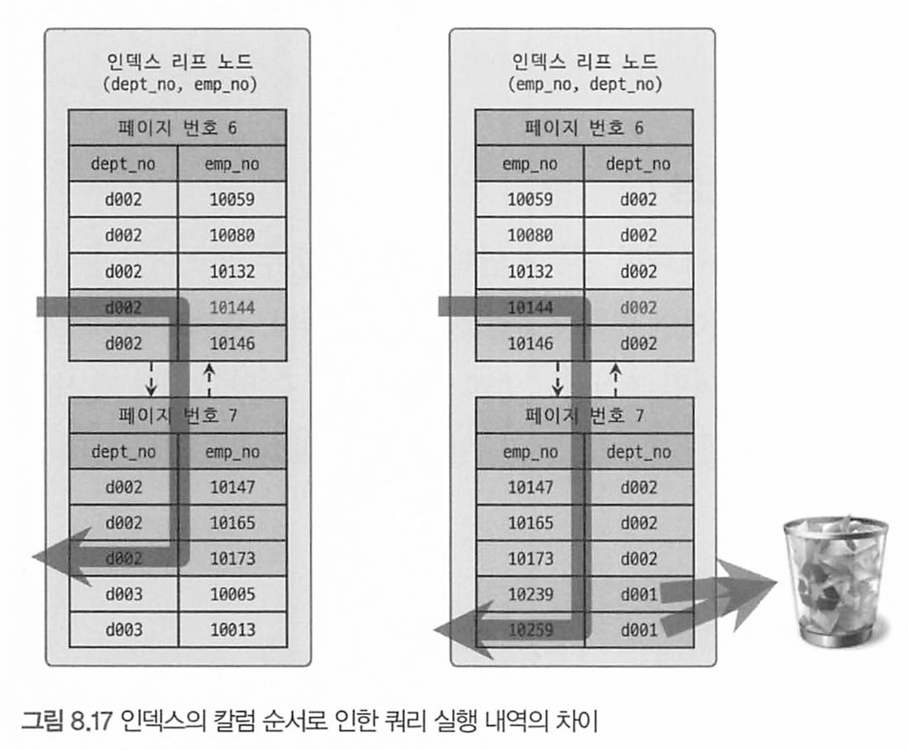

# 8 인덱스

- 8.1 디스크 읽기 방식
- 8.2 인덱스란?
- 8.3 B-Tree 인덱스
- 8.4 R-Tree 인덱스
- 8.5 전문 검색(Full Text search) 인덱스
- 8.6 함수 기반 인덱스
- 8.7 멀티 밸류(Mult-Value) 인덱스
- 8.8 클러스터링 인덱스
- 8.9 유니크 인덱스
- 8.10 외래키

[toc]


# 8.1 디스크 읽기 방식

데이터베이스의 성능 튜닝은 어떻게 디스크 I/O를 줄이느냐가 관건일때가 상당히 많다.


### HDD와 SSD

SDD의 장점 : 기존 HDD보다 랜덤 I/O가 훨씬 빠르다.

### Random I/O와 순차 I/O

1. **순차 I/O(Sequential I/O)**: 이 방식은 디스크의 데이터를 연속적으로 읽거나 쓰는 방식. 
   * 예를 들어, 하나의 큰 파일을 처음부터 끝까지 읽는 경우 순차 I/O가 사용. 
   * 장점은 디스크 헤드의 이동을 최소화하므로 효율적이며 빠르다.
2. **랜덤 I/O(Random I/O)**: 이 방식은 디스크의 데이터를 불연속적으로, 즉 임의의 순서로 읽거나 쓰는 방식. 
   * 예를 들어, 데이터베이스에서 특정 레코드를 조회하거나 업데이트하는 경우 랜덤 I/O가 사용될 수 있다. 
   * 랜덤 I/O는 디스크 헤드의 이동이 더 많이 필요하므로 순차 I/O에 비해 일반적으로 느리다.

따라서, 데이터베이스 성능을 최적화하기 위해서는 가능한 한 랜덤 I/O를 줄이고 순차 I/O를 늘리는 것이 좋다


순차 I/O는 3개의 페이지( 3 x 16KB)를 디스크에 기록하기 위해 1번 시스템 콜을 요청했지만

랜덤 I/O는 3개의 페이지를 기록하기 위해 3번 시스템 콜을 요청했다.

즉 디스크에 기록할 위치를 찾기 위해 순차 I/O는 디스크 헤드를 1번, 랜덤 I/O는 3번 움직였다.

즉 디스크 성능은 헤더의 위치 이동 없이 얼마나 많은 데이터를 기록하느냐에 따라 결정된다


쿼리를 튜닝하는 것은 랜덤 I/O 자체를 줄여주는 것이 목적이다.

* 랜덤 I/O를 줄이는 것은 쿼리 처리시 꼭 필요한 데이터만 읽도록 쿼리를 개선하는것

> 인덱스 레인지 스캔은 주로 랜덤 I/O를 사용하며, 풀 테이블 스캔은 순차 I/O를 사용한다.
>
> 때문에 레코드를 많이 읽는 작업에서는 인덱스를 사용하지 않고 풀테이블 스캔을 사용하는 것이 빠른경우도 있다.
>
> 이는 순차 I/O 랜덤 I/O 보다 훨씬 많은 레코드를 읽어올 수 있기 때문인데, 이 형태는 OLTP인 웹 서비스보다 OLAP(분석, 통계) 에 더 어울린다.

# 8.2 인덱스란?

칼럼들의 값과 해당 레코드가 저장된 주소를 key-value로 만들어 두는것.

또한 최대한 빨리 찾을 수 있게 칼럼 값을 주어진 순서로 미리 정렬해서 보관한다.


인덱스는 저장 (I, U, D)의 성능을 희생하고 읽기 속도를 높이는 기능.

인덱스를 역할별로 구분한다면 프라이머리 키와 보조 키(세컨더리 인덱스)로 구분할 수 있다.

대표적으로 B-Tree 인덱스와 Hash 인덱스로 구분할 수 있다.


데이터 중복 허용 여부로 분류하면 Unique Index와 Non-Unique인덱스로 구분할 수 있다.

유니크 인덱스에 대해 동등 조건(equal, =)로 검색한다는 것은 항상 1건의 레코드만 찾으면 더 찾지 않아도 된다는 의미로

옵티마이저에게 알려주는 상당한 효과를 낸다.

# 8.3 B-Tree 인덱스

B-Tree 인덱스는 데이터베이스에서 가장 널리 사용되는 인덱스 구조 중 하나이며,Balanced Tree의 약자로, 모든 리프 노드가 동일한 깊이를 갖는 이진 트리의 한 형태이다

* InnoDB, Postgresql, oracle 등 모두 B-Tree 인덱스를 기본 인덱스로 사용한다

컬럼의 원래 값을 변행시키지 않고 인덱스 구조체 내에서 항상 정렬된 상태로 유지한다 


* 루트 노드: 가장 위에 위치하며, 트리의 시작점. 인덱스 키와 자식노드 주소를 가지고 있다.
* 중간 노드: 루트 노드와 리프 노드 사이에 위치한 노드들로, 다른 노드들로의 포인터와 키값을 포함한다
* 리프 노드: 트리의 가장 아래에 위치한 노드들로, 실제 데이터 또는 실제 데이터로를 찾아가기 위한 포인터(주솟값)를 포함한다.
* 각 레벨의 노드들은 키값에 따라 정렬되어 있으며, 모든 리프 노드는 동일한 깊이를 갖는다.

인덱스 키 값은 모두 정렬되어 있지만 레코드는 정렬 돼 있지 않고 임의의 순서로 저장돼 있다.

레코드가 삭제되어 빈 공간이 생기면 그 다음 INSERT는 가능한 한 삭제된 공간을 재활용 하므로 항상 INSERT된 순서로 저장되는것은 아니다.

> InnoDB 테이블에서 레코드는 클러스터되어 디스크에 저장되므로 기본적으로 프라이머리 키 순서로 정렬되어 저장된다.
>
> * 오라클의 Index Organized Table 과 같은 구조

인덱스는 테이블의 키 컬럼만 갖고 있으므로 나머지 컬럼을 읽으려면 데이터 파일에서 해당 레코드를 찾아야 한다.

* 이를 위해 리프 노드가 데이터 파일에 저장된 레코드의 주소를 가진다.


> MyISAM에서는 클러스터링 키를 지원하지 않으며, 프라이머리 키랑 세컨더리 인덱스가 구조적으로 아무런 차이가 없다
>
> * MyISAM의 프라이머리 키 : 유니크 제약을 가진 세컨더리 인덱스 
>
> MyISAM 테이블의 프라이머 리 키를 포함한 모든 인덱스는 물리적인 레코드의 주소 값(ROWID)을 가지는데, 인덱스가 레코드의 물리적 위치, 즉 ROWID를 가리키므로 키 값을 통해 바로 레코드의 물리적 위치를 찾아 데이터를 조회할 수 있다.

InnoDB에서는 프라이머리 키가 ROWID 역할을 한다

* MyISAM 테이블은 세컨더리 인덱스가 물리적인 주소를 가지는 반면
*  InnoDB 테이블은 프라이머리 키를 주소처럼 사용하기 때문에 논리적인 주소를 가진다고 볼 수 있다.

때문에 InnoDB에서 인덱스를 통해 레코드를 읽을 때는 데이터 파일을 바로 찾아가지 못하고,

인덱스에 저장돼 있는 프라이머리 키 값을 이용해 프라이머리 키 인덱스를 한번 더 검색한 후 프라이머리 키 인덱스의 리프 페이지에 저장돼있는 레코드를 읽는다

즉, InnoDB 스토리지 엔진에서는 `모든 세컨더리 인덱스 검색에서 데이터 레코드를 읽기 위해 서는 반드시 프라이머리 키를 저장하고 있는 B-Tree를 다시 한번 검색`해야 한다

## B-Tree 인덱스 키 추가 및 삭제

### 인덱스 키 추가

B-Tree는 새로운 키를 추가하는 작업에 비용이 많이 든다.

* 노드 분할: 새로운 키를 추가할 때, 해당 키가 삽입될 노드가 이미 가득 차 있으면, 노드는 두 개의 노드로 분할되어야 한다. 이는 상위 브랜치 노드까지 전파되며 추가적인 디스크 쓰기를 유발하여 비용이 높다.

### 인덱스 키 삭제

키가 삭제되는 경우는 간단하지만 마찬가지로 비용이 든다.

* 노드 병합: 키를 제거할 때, 제거 후 해당 노드가 공간을 충분히 사용하지 않게 되면, 이웃 노드와 병합될 수 있으며 이런 작업도 추가적인 디스크 쓰기를 유발하고, 병합 작업은 상위 노드로 전파될 수 있다

### 인덱스 키 변경

B-Tree의 키 변경 작업은, 먼저 키 작업을 삭제한 후 새로운 키 값을 추가하는 형태로 처리된다.

때문에 추가와 삭제의 비용이 모두 들어 비싸다.

InnoDB는 이 작업 모두 체인지 버퍼를 활용해 지연처리 한다.

### 인덱스 키 검색

B-Tree 인덱스를 이용한 검색은 100% 일치 또는 값의 앞 부분만 일치하는 경우에 사용할 수 있다.

* 인덱스를 구성하는 키 값의 뒷부분만 검색하는 용도로는 사용할 수 없다
  * 이는 트리 구조를 통한 검색 방식이 앞부분을 기준으로 하기 때문이다. 이런 경우 전체 트리를 탐색해야 하므로 테이블 Full 스캔하는 것과 같은 효율성을 보인다.
* 또한 키 값에 변형(함수 등을 사용한 경우)이 가해진 후 비교되는 경우 절대 b-tree의 빠른 검색 기능을 사용할 수 없다
  * 변형된 값은 B-Tree 인덱스에 존재하는 값이 아니기 때문이다.

또한, InnoDB에서 지원하는 레코드 잠금이나 넥스트 키 락이 검색을 수행한 인덱스를 잠근 후 테이블의 레코드를 잠그는데,

UPDATE나 DELETE 문장이 실행될 때 테이블에 적절히 사용할 수 있는 인덱스가 없으면 불필요하게 많은 레코드를 잠그거나 모든 레코드를 잠글 수 있으므로 주의하자.


## B-Tree 인덱스 사용에 영향을 미치는 요소

B-Tree 인덱스는 

* 인덱스를 구성하는 칼럼의 크기와 
* 레코드의 건수, 
* 그리고 유니크한 인덱스 키 값의 개수 등

에 의해 검색이나 변경 작업의 성능이 영향을 받는다.

### 인덱스 키 값의 크기 (인덱스를 구성하는 컬럼의 크기 )

InnoDB는 디스크에 데이터를 저장하는 가장 기본 단위를 Page 또는 Block 이라고 하며 디스크의 모든 읽기 및 쓰기 작업의 최소 단위가 된다.

인덱스도 결국은 페이지 단위로 관리된다.

B-Tree는 자식 노드의 개수가 가변적인 구조다.

인덱스의 페이지 크기와 키 값의 크기에 따라 자식 노드의 개수가 결정된다.

innodb_page_size 시스템 변수를 이용해 4KB ~ 64KB 사이의 값을 지정할 수 있지만 기본값은 **16KB**다


위 인덱스 페이지의 경우, 하나의 인덱스 페이지(16KB)에 몇 개의 키를 저장할 수 있을까?

* 16 * 1024 / (16 + 12) = 585개 저장 가능
* 자식 노드를 585개 가질 수 있는 B-Tree

인덱스 키 값이 두배인 32바이트로 늘어나면?

* 16 * 1024 / (32 + 12) = 372개

SELECT 쿼리가 레코드 500개를 읽어야 한다면, 전자인 경우 1번으로 해결될 수 있지만, 후자인 경우 2번 읽어야 한다.

결국 인덱스를 구성하는 키 값의 크기가 커지면, 디스크로 부터 읽어야 하는 수가 늘어나 그만큼 늘어진다

그러므로 인덱스 키 값의 길이가 길어진다는 것은 크기가 커지는 것이므로, 키 값의 길이를 줄여 인덱스 크기를 줄여두는 것이 좋다.

### B-Tree 깊이

인덱스의 깊이(Depth)는 우리가 직접 제어할 방법이 없다.

위 예제를 그대로, B-Tree 깊이가 3인 경우 최대 몇개의 키 값을 가질 수 있을까? 

키 값이 16바이트인 경우 : (585 * 585 * 585*) : 최대 2억개 정도

키 값이 32바이트인 경우 : (372 * 372 * 372) : 최대 5천만개로 줄어든다

그러므로 인덱스 키 값의 크기는 가능하면 작게 만드는 것이 좋다.

> 실제로는 아무리 대용량 데이터베이스라도 B-Tree의 깊이(Depth)가 5단계 이상까지 깊어지는 경우는 흔치 않다. 

### 선택도 (Selectivity) = 기수성 (Cardinality)

모든 인덱스 키 값 가운데 유니크한 값의 수를 의미한다.

선택도 또는 카디널리티가 높을수록 검색 대상이 줄어들기 때문에 그만큼 빠르게 처리된다

**ex) country라는 칼럼과 city라는 칼럼이 포함된 tb_test 테이블**

tb_test 테이블의 전체 레코드 건수는 1만 건이며, country 칼럼으로만 인덱스가 생성된 상태

- 케이스 A: country 칼럼의 유니크한 값의 개수가 10개
- 케이스 B: country 칼럼의 유니크한 값의 개수가 1,000개

```mysql
mysql> SELECT * FROM tb test
			 WHERE country='KOREA' AND city='SEOUL';
```

위의 쿼리를 실행하면 

*  A 케이스의 경우에는 평균 1,000건, 
  * 케이스 A에서는 총 레코드 수가 1만 건이며, 유니크한 country 값이 10개이므로, 각 country당 평균적으로 1,000건의 레코드

* B 케이스의 경우에는 평균 10건
  * 케이스 B에서는 유니크한 country 값이 1,000개이므로, 각 country당 평균적으로 10건의 레코드

이 조회될 수 있다는 것을 인덱스의 통계 정보(유니크한 값의 개수)로 예측할 수 있다. 

* A 케이스와 B 케이스 모두 실제 모든 조건을 만족하는 레코드는 단 1건만 있었다면? 
* A  케이스의 인덱스는 적합하지 않다. A 케이스는 1건의 레코드를 위해 쓸모없는 999 건의 레코드를 더 읽은 것
* 그러나 B 케이스는 9건만 더 읽은 것. 
* **그래서 A 케이스의 경우 country 칼럼에 생성된 인덱스는 비효율적이다**

> 레코드의 개수가 동일할 경우, 유니크한 값이 많은 칼럼을 인덱싱하는 것이 검색 성능을 향상시키는데 더 효과적

또다른 예제

**ex) 각 국가의 도시를 저장하는 tb_city**

* 1만건의 레코드가 존재, country 컬럼에만 인덱스가 존재
* 국가와 도시가 중복해서 저장돼지 않는다

```mysql
mysql> CREATE TABLE tb_city(
			country VARCHAR(10), 
			city VARCHAR (10),
			INDEX ix country (country));
```

다음 쿼리를 실행시켜 효율을 보자

```mysql
mysal> SELECT * FROM tb_test
			 WHERE country='KOREA' AND city='SEOUL'
```

* country 컬럼의 유니크 값이 10개일 때
  * country='korea'로 검색시 1000건이 일치(10,000 / 10)
  * city = 'SEOUL'인 레코드는 1건이므로 999건은 불필요하게 읽은것
* country 컬럼의 유니크 값이 1000개일 때
  * country = 'KOREA' 는 조건은 10건 (10,000/ 1,000)이 일치
  * citry = 'SEOUL'인 레코드는 1건이므로 9건만 불필요하게 읽은것

즉 인덱스에서 유니크한 값의 개수는 인덱스나 쿼리의 효율성에 큰 영향을 끼친다.

> 카디널리티가 높아야 인덱스 성능이 좋다

### 읽어야 하는 레코드 건수

테이블에 100만건의 레코드가 있을 시 50만건을 읽어야 하는 쿼리가 있다고 가정

다음을 고민해야 한다.

1. 전체 테이블을 모두 읽어 필요 없는 50만건 버리기
2. 인덱스를 통해 필요한 50만건만 읽어 오는것이 효율적일지


인덱스를 이용한 읽기의 손익 분기점이 얼마인지 판단할 필요가 있다.

일반적인 DBMS의 옵티마이저에서는 

`인덱스를 통해 레코드 1건을 읽는것`이 

`테이블에서 직접 레코드 1건을 읽는 것보다 4~5배 정도 비용이 더 많이 드는 작업`인 것으로 예측한다. 

* 인덱스를 통해 데이터를 찾는 과정은 다음과 같다
  * 먼저, 인덱스를 통해 해당 레코드의 위치를 찾는다. 
  * 이 과정은 인덱스 트리를 탐색하는 과정을 포함하며, 이는 여러 개의 디스크 I/O 작업을 필요로 한다.
  * 인덱스가 가리키는 실제 레코드 위치로 이동하여 해당 레코드를 읽는데, 이것은 추가적인 디스크 I/O 작업을 발생시킨다.

* MySQL 서버에서는 코스트 모델 에 따라 변경 가능

즉 인덱스를 통해 읽어야 할 레코드의 건수가 전체 테이블의 20~25%를 넘어서면 인덱스를 이용하지 않고 모두 읽어 필터링 하는 방식이 더 효율적이다.

## B-Tree 인덱스를 통한 데이터 읽기

어떤 경우에 인덱스를 사용하게 유도할지, 또는 사용하지 못하게 할지 판단하려면 MyQLL(더 정확히 는 각 스토리지 엔진)이 어떻게 인덱스를 이용(경유)해서 실제 레코드를 읽어 내는지 알아야 한다

### 인덱스 레인지 스캔 - Index Range Scan

가장 대표적인 방식으로 인덱스 레인지 스캔은 주어진 범위의 값을 가진 행을 찾기 위해 인덱스를 사용하는 검색 방법이다.

* 검색해야 할 인덱스의 범위가 결정됐을 때 사용하는 방식

다음 쿼리를 예로 보자

```mysql
mysql> SELECT * FROM employees WHERE first name BETWEEN 'Ebbe' AND 'Gad';
```


* 루트 노드부터 비교를 시작해 브랜치 노드를 거치고 리프 노드까지 찾아 가야만 레코드의 시작 지점을 찾을 수 있다.
* 시작지점을 찾으면 그때부터 리프노드의 레코드만 순서대로 읽는다.
* 만약 스캔하다가 리프 노드의 끝까지 읽으면, 리프 노드간의 링크를 이용해 다음 리프 노드를 찾아서 다시 스캔한다.

> 인덱스 레인지 스캔은 특정 범위의 데이터만 빠르게 검색할 수 있기 때문에, 큰 테이블에서 작은 부분의 데이터만 필요한 경우에 매우 유용하다

하지만 B-Tree 인덱스의 리프 노드를 스캔하면서 실제 데이터 파일의 레코드를 읽어 와야 하는 경우도 많다. 

다음 그림을 보자


* 어떤 방식으로 스캔하든 관계 없이, 해당 인덱스를 구성하는 컬럼의 정순 또는 역순으로 정렬된 상태로 레코드를 가져온다
  * 별도의 정렬 과정 때문이 아닌 원래 인덱스가 정렬 되어 있어 그렇다

더 중요한 것은, 리프 노드에서 검색 조건에 일치하는 건들은, 데이터 파일에서 레코드를 추가로 읽어와야 한다.

리프 노드에 저장된 레코드 주소(포인터, 주솟값)으로 데이터 파일에 접근하여 레코드를 읽어오는데 한 건 한 건 단위로 랜덤 I/O가 한 번씩 일어난다.

* 3건의 레코드가 조건에 일치하면 랜덤 I/O가 최대 3번 필요한것

그래서 인덱스를 통해 레코드를 읽는 작업은 랜덤 I/O 때문에서라도 비용이 많이든다

때문에, 인덱스를 통해 읽어야 할 데이터가 전체 테이블의 20~25%를 넘으면 인덱스를 통하기 보다 테이블의 데이터를 직접 읽는것이 더 효율적인 처리 방식이 된다.

**인덱스 레인지 스캔은 다음과 같이 크게 3단계를 거친다**

1. 인덱스에서 조건을 만족하는 값이 저장된 위치를 찾는다. 이 과정을 인덱스 탐색(Index seek)이라고 한다.
2. 1번에서 탐색된 위치부터 필요한 만큼 인덱스를 차례대로 쭉 읽는다. 이 과정을 인덱스 스캔(ndex scan)이라고 한 다. (1번과 2번 합쳐서 인덱스 스캔으로 통칭하기도 한다.)
3. 2번에서 읽어 들인 인덱스 키와 레코드 주소를 이용해 레코드가 저장된 페이지를 가져오고, 최종 레코드를 읽어 온다.

쿼리가 필요로 하는 데이터에 따라 3번 과정(리프 노드의 주솟값으로 데이터 파일에서 데이터를 읽어오는 과정)이 필요하지 않을 수 있다

이를 `커버링 인덱스 라고 한다.`

커버링 인덱스로 처리되는 쿼리는, 디스크의 레코드를 읽지 않고 인덱스 페이지에서 바로 값을 반환한다.

### 커버링 인덱스 예제

커버링 인덱스를 구성하는 데이터는 인덱스 리프 페이지에 저장된다. 

먼저, 아래와 같은 users 테이블이 있다고 가정해보자

| id   | name  | age  | city |
| ---- | ----- | ---- | ---- |
| 1    | John  | 30   | NYC  |
| 2    | Mary  | 25   | LA   |
| 3    | Tom   | 35   | SF   |
| 4    | Alice | 20   | LA   |
| 5    | Bob   | 28   | NYC  |

여기서 `age`와 `name` 두 필드에 대해 인덱스를 만들면, 해당 인덱스의 리프 페이지는 다음과 같은 형태로 저장된다

| age**** | **name** | PK   |
| ------- | -------- | ---- |
| 20      | Alice    | 4    |
| 25      | Mary     | 2    |
| 28      | Bob      | 5    |
| 30      | John     | 1    |
| 35      | Tom      | 3    |

위 인덱스에서, `age`는 인덱스 키이며, `name`과 `PK(Primary Key)`는 페이로드 데이터로서 인덱스 리프 페이지에 저장된다.

`SELECT name FROM users WHERE age > 30` 이라는 쿼리를 실행하면, DBMS는 `age`와 `name` 데이터를 포함하는 인덱스 리프 페이지에서 필요한 모든 정보를 바로 가져올 수 있다. 따라서 이 인덱스는 커버링 인덱스가 됩니다.

하지만, `SELECT name, city FROM users WHERE age > 30` 이라는 쿼리를 실행하려면, `city` 정보가 인덱스에 없으므로 테이블의 행을 찾아야 합니다. 이 경우에는 커버링 인덱스를 사용할 수 없습니다.

### 인덱스 풀 스캔 (index full scan)

인덱스 레인지스캔과는 달리 인덱스 처음부터 끝까지 모두 읽는 방식

쿼리 조건절에 사용된 컬럼이 인덱스의 첫 번째 컬럼이 아닌 경우 인덱스 풀 스캔 방식이 사용된다 

예를들어, 인덱스는 (A, B, C) 순서로 되어있지만 조건절은 B, C 컬럼으로 검색되는 경우다

`쿼리가 인덱스에 명시된 컬럼만으로 조건을 처리할 수 있는 경우 이 방식이 사용된다.`

* 인덱스 뿐만 아니라 데이터 레코드 까지 모두 읽어야 한다면 절대 이방식으로 처리되지 않는다

**인덱스 풀 스캔 처리 방식**


* 인덱스 리프노드의 제일 앞 또는 뒤로 이동 후 모든 리프노드를 처음부터 끝까지 스캔하는 방식

인덱스 전체 크기는 테이블보다는 작으므로, 테이블 전체를 읽는것보다는 적은 디스크 I/O로 쿼리를 처리할 수 있다.

### 루스 인덱스 스캔 (Loose Index Scan)

루스 인덱스 스캔이란, 느슨하게 인덱스를 읽는것을 의미한다.

루스 인덱스 스캔은 같은 값을 가진 레코드를 만나면 그 값의 첫번째 레코드만 읽고, 그 다음 유니크한 값의 레코드로 바로 넘어가는 방식

이를 통해 중복된 값을 가진 레코드를 건너뛰어 처리 속도를 향상시킨다.


* 오라클의 index skip scan이랑 비슷하다.

* 루스 인덱스 스캔은 주로 그룹화 (`GROUP BY`) 또는 `DISTINCT`와 같이 중복된 결과를 제거하는 쿼리에 사용


* dept_name과 first_name 컬럼은 참조용으로 표시됌

인덱스 레인지 스캔과 비슷하게 작동하지만 중간에 필요치 않은 인덱스 키 값은 무시(SKIP) 하고 다음으로 넘어간다.

```mysql
mysql> SELECT dept_no, MIN(emp_no)
       FROM dept emp
			 WHERE dept_no BETWEEN 'd002' AND 'd004' 
			 GROUP BY dept_no;
```

* dept_no와 emp_no라는 두 컬럼으로 인덱스가 생성 돼고 정렬까지 돼 있다고 가정
* 그림과 같이 dept_no 그룹 별로 첫번째 레코드의 emp_no 값만 읽으면 된다.
* 인덱스에서 WHERE 조건을 만족하는 범위 전체를 다 스캔할 필요가 없다는 것을 옵티마이저는 알기 때문에 조건에 만족하지 않는 레코드는 무시하고 건너 뛴다
* 리프 노드를 스캔하면서 불필요한 부분(페이지 범위)을 무시하고 필요한 부분 (회색 바탕 레코드)인 emp no만 읽음

또한 예를 들어, 다음과 같은 쿼리가 있을 때:

```mysql
SELECT DISTINCT first_name FROM employees;
```

루스 인덱스 스캔은 `first_name` 칼럼의 모든 유니크한 값을 찾기 위해 해당 칼럼에 대한 인덱스를 점프하면서 스캔을 진행하게 된다. 이렇게 하면 `first_name` 칼럼의 모든 값을 스캔하는 것보다 훨씬 빠르게 작업을 마칠 수 있다.

> 루스 인덱스 스캔은 MySQL에 최적화된 방식이며, 일부 쿼리에 대해서만 사용할 수 있는 특수한 케이스이므로, 실제 쿼리 성능 향상에 도움이 될지는 쿼리의 특성과 데이터의 분포 등 여러 요소를 고려해야한다

### 인덱스 스킵 스캔 (index skip scan)

합성 인덱스의 첫 번째 칼럼의 조건 없이 두 번째 칼럼에 대한 조건만 주어졌을 때 사용되는 인덱스 스캔

합성 인덱스(복합, composite index)에서 특정 상황에서 유용하게 사용되는 방법

예를들어 다음과 같은 인덱스를 생성해보자

* gender, bith_date 복합 인덱스

```mysql
mysql> ALTER TABLE employees
			 ADD INDEX ix_gender_birthdate (gender, birth_date);
```

이 인덱스를 사용하려면 WHERE 조건절에 gender 컬럼 비교 조건이 필수다

```mysql
-- // 인덱스를 사용하지 못하는 쿼리
mysql> SELECT * FROM employees WHERE birth_date >='1965-02-01';

-- // 인덱스를 사용할 수 있는 쿼리
mysql) SELECT * FROM employees WHERE gender='M' AND birth_date>='1965-02-01';
```

MySQL 8.0부터 옵티마이저가 gender 컬럼을 건너 뛰어 birth_date 컬럼만으로도 인덱스 검색이 가능하게 해주는 인덱스 스킵 스캔 최적화 기능이 도입됐다.

index skip scan을 사용하면, 실행계획에 `Using index for skip scan` 이라고 나온다

```mysql
mysql> SET optimizer_switch='skip_scan=on';

mysql> EXPLAIN
			 SELECT gender, birth_date
			 FROM employees
			 WHERE birth_date>='1965-02-01';
			 
+----+-----------+-------+---------------------+-----------------------------------+
| id | table     | type  | key                 | Extra                             |
+----+-----------+-------+---------------------+-----------------------------------+
|  1 | employees | range | ix_gender_birthdate | Using where; Using index for skip scan |
+----+-----------+-------+---------------------+-----------------------------------+
```

* type : range : 인덱스에서 필요한 부분만 읽었다는것
* extra : Using index for skip scan : 인덱스 스킵 스캔을 활용한것

MySQL 옵티마이저는 우선 gender 칼럼에서 유니크한 값을 모두 조회해서 주어진 쿼리에 gender 칼럼의 조건을 추가해서 쿼리를 다시 실행하는 형태로 처리한것.

```mysql
mysql> SELECT gender, birth_date FROM employees WHERE gender='M' AND birth_date>='1965-02-01'; 
mysql> SELECT gender, birth_date FROM employees WHERE gender='F' AND birth_date>='1965-02-01';
```

* 내부적으로 위 쿼리를 실행하는것과 비슷한 형태의 최적화를 한것이다

참고로, 컬럼이 enum이 아니고 어떤 타입이더라도, 

루스 인덱스 스캔과 동일한 방식으로 읽으면서 인덱스에 존재하는 모든 값을 먼저 추출하고 그결과를 이용해 스킵 스캔을 실행한다. 

* 루스 인덱스 스캔은 같은 값을 가진 레코드를 만나면 그 값의 첫번째 레코드만 읽고, 그 다음 유니크한 값의 레코드로 바로 넘어가는 방식

그러나 인덱스 스킵 스캔은 아직 다음과 같은 단점이 있다.

- **WHERE 조건절에 조건이 없는 인덱스의 선행 칼럼의 유니크한 값의 개수가 적어야 함**
  - 선행 컬럼 (위 예제에서는 gender)가 많을 수록 스캔해야 할 시작 지점을 검색하는 작업이 많아지므로 오히려 느려질수도 있다.
- **쿼리가 인덱스에 존재하는 칼럼만으로 처리 가능해야 함(커버링 인덱스여야함)**
  - 인덱스의 일부 컬럼을 건너뛰고 다른 컬럼만을 이용하여 검색을 수행합니다. 이 방식은 인덱스 내부에서만 작동하며, 실제 데이터 행을 직접 참조하지 않는데, 만약 인덱스가 아닌 컬럼이라면 실제 데이터를 참조해야 하므로 추가적인 디스크 랜덤 I/O가 발생하므로 테이블 풀 스캔으로 실행계획을 수립하게 된다


### 다중 칼럼 (Multi-column) 인덱스 (복합)

두 개 이상의 컬럼으로 구성된 인덱스 


복합인덱스의 중요한점은, 두 세 네번째의 컬럼은 각각 앞 컬럼에 의존되어 정렬되어있단것이다.

때문에 위 그림에서 emp_no 값이 10003인 레코드가 emp_no 자체만으로는 매우 빠른 편이지만, 앞 컬럼들이 먼저 정렬되어있으므로 가장 마지막에 위치하는것이다.

다중칼럼 인덱스에서는 인덱스 내에서 각 칼럼의 위치(순서)가 상당히 중요하며, 아주 신중히 결정해야 하는 이유이다

다중 칼럼 인덱스를 결정할때의 고려사항

1. **쿼리 패턴**: 어떤 쿼리들이 주로 사용되는지 확인해야 한다. 인덱스를 만들 때는 WHERE, JOIN, ORDER BY 등에서 자주 사용되는 컬럼들을 고려한다.
2. **선택성 or 카디널리티**: 일반적으로 선택성이 높거나 또는 카디널리티가 높은 컬럼을 인덱스의 앞부분에 위치시키는 것이 좋다. 유니크한 값의 범위가 넓은 컬럼을 인덱스의 앞부분에 두면, 인덱스를 통해 데이터를 찾는 데 더 효율적일 수 있다.
3. **데이터의 크기**: 큰 데이터를 담고 있는 컬럼보다는 작은 크기의 데이터를 담고 있는 컬럼을 먼저 인덱스로 사용하는 것이 효율적일 수 있다. 이는 디스크 공간의 효율성과 인덱스 검색 속도에 영향을 미친다.

## B-Tree 인덱스의 정렬 및 스캔 방향

인덱스 생성시 설정한 정렬 규칙에 따라 인덱스의 키 값은 항상 오름차순이거나 내림차순으로 정렬되어 저장된다. 

오름차순 정렬 인덱스:

```mysql
CREATE INDEX idx_name ON table_name (column_name ASC);
```

내림차순 정렬 인덱스:

```mysql
CREATE INDEX idx_name ON table_name (column_name DESC);
```

* 실제로 해당 정렬 순서를 사용하여 쿼리를 최적화하는 것은 지원하지 않을 수도 있으므로, 내림차순 인덱스는 특별한 경우에만 사용하고, 일반적으로는 오름차순 인덱스를 사용하는 것이 좋다.

### 인덱스의 정렬

MySQL 8.0부터 다음과 같은 형태의 순서를 혼합한 복합 인덱스도 생성할 수 있다.

```mysql
mysql> CREATE INDEX ix_teamname_userscore ON employees (team_name ASC, user_score DESC);
```

### 인덱스 스캔 방향

first_name 칼럼에 대한 인덱스가 포함된 employees 테이블에 대해 다음 쿼리를 실행하는 과정을 한 번 살펴보자

* 인덱스를 처음부터 오름차순으로 끝까지 읽어 first name이 가장 큰(오름차순으로 읽었을 때 가장 마지막 레코드) 값 하나를 가져오는 것일까?

```mysql
mysql> SELECT *
			 FROM employees
			 ORDER BY first_name DESC
			 LIMIT 1;
```

그렇지 않다. 옵티마이저는 바보가 아니다. 인덱스를 역순으로 접근해 첫 번째 레코드만 읽는다


오름차순으로 생성된 인덱스를 정순으로 읽으면 출력되는 결과 레코드는 자동으로 오름차순으로 정렬된 결과가 되고, 

역순으로 읽으면 그 결과는 내림차순으로 정렬된 상태가 되는 것이다.

### 내림차순 인덱스

MySQL 서버에서 다음 두 쿼리는 실제 내림차순인지 오름차순인지와 관계없이 인덱스를 읽는 순서만 변경해서 해결할 수 있다

```mysql
mysql> SELECT * FROM employees ORDER BY first_name ASC LIMIT 10;
mysq1> SELECT * FROM employees ORDER BY first_name DESC LIMIT 10;
```

만약 다음과 같이 2개 이상의 컬럼으로 구성된 복합 인덱스에서 각각의 컬럼이 내림차순과 오름차순이 혼합된 경우에는,

내림차순 인덱스로만 해결될 수 있다.

```mysql
mysql> CREATE INDEX ix_teamname_userscore ON employees (team_name ASC, user_score DESC);
```

그렇다면 first_name 칼럼을 역순으로 정렬하는 요건만 있다면 다음 2개 인덱스 중에서 어떤 것을 선택하는 것이 좋을까? 

아니면 두 인덱스 모두 동일한 성능을 보일까?

```mysql
mysql> CREATE INDEX ix_firstname_as ON employees (first_name ASC ); 
mysql> CREATE INDEX ix_firstname_desc ON employees (first_name DESC);
```


- 오름차순 인덱스(Ascending index): 작은 값의 인덱스 키가 B-Tree의 왼쪽으로 정렬된 인덱스
- 내림차순 인덱스(Descendling index): 큰 값의 인덱스 키가 B-Tree의 왼쪽으로 정렬된 인덱스
- 인덱스 정순 스캔(Forward index scan): 인덱스 키의 크고 작음에 관계없이 인덱스 리프 노드의 왼쪽 페이지부터 오른쪽으로 스캔
- 인덱스 역순 스캔(Backward index scan): 인덱스 키의 크고 작음에 관계없이 인덱스 리프 노드의 오른쪽 페이지부터 왼쪽으로 스캔

실제 내부적으로는 InnoDB에서 인덱스 역순 스캔이 인덱스 정순 스캔에 비해 느릴 수밖에 없는 다음의 두 가지 이유가 있다.

- 페이지 잠금이 인덱스 정순 스캔(Forward index scan)에 적합한 구조
  - 페이지 잠금은 인덱스를 순차적으로 읽는 경우에만 효율적이다. 왜냐하면 인덱스 역순 스캔에서는 다음 페이지를 잠그기 전에 현재 페이지의 모든 레코드를 거꾸로 읽어야 하기 때문이다. 이로 인해 추가적인 디스크 I/O 비용이 발생하며, 이는 인덱스 역순 스캔을 더 느리게 만든다
- 페이지 내에서 인덱스 레코드가 단방향으로만 연결된 구조
  - InnoDB의 페이지 내부에서는 레코드들이 단방향으로만 링크를 가지고 있다. 즉, 각 레코드는 다음 또는 자식 레코드를 가리키는 링크를 가지고 있지만, 이전 레코드를 가리키는 링크는 없기 때문이다. 이런 구조는 정순 스캔에 유리하나, 역순 스캔에는 비효율적이다. 왜냐하면 역순 스캔을 하려면 매번 페이지의 마지막 레코드부터 거꾸로 읽어야 하기 때문이다.

> 각 데이터 페이지(InnoDB에서 데이터 파일은 프라이머리 키 인덱스 자체라는 것에 주의하자)나 인
>
> 덱스 페이지의 엔트리(데이터 레코드 또는 인덱스 키)는 키 값과 데이터를 가지는데, 
>
> 인덱스(프라이머리 키 인덱스와 세컨더리 인덱스 모두)의 루트 노드 또는 브랜치 노드라면 자식 노드의 주소를 가진다. 
>
> \- 리프 노드가 아니면 포인터를 가진다는 말이다. 데이터는 리프노드에 있다.
>
> 프라이머리 키에서 리프 노드의 "데이터"는 실제 레코드의 칼럼 값들이며, 세컨더리 인덱스 페이지에서는 프라이머리 키 값을 가진다.


일반적으로 ORDER BY ... DESC 하는 쿼리가 소량으로 생성된다면 내림차순 인덱스를 고려할 필요는 없지만

`아주 자주 사용된다면 내림차순 인덱스를 고려하자!`

* 성능차이가 꽤 많이난다

내림차순 정렬 인덱스:

```mysql
CREATE INDEX idx_name ON table_name (column_name DESC);
```

* 실제로 해당 정렬 순서를 사용하여 쿼리를 최적화하는 것은 지원하지 않을 수도 있으므로, 내림차순 인덱스는 특별한 경우에만 사용하고, 일반적으로는 오름차순 인덱스를 사용하는 것이 좋다.

## B-Tree 인덱스의 가용성과 효율성

### 비교 조건의 종류와 효율성

다중 컬럼 인덱스(복합 인덱스)에서 각 컬럼의 순서와 사용된 조건이 동등 (=) 크다(>) 작다 (<) 같은 범위 조건인지에 따라 칼럼의 활용 형태랑 효율이 달라진다

다음 예제를 한번 살펴보자.

```mysql
mysql> SELECT * FROM dept_emp
			 WHERE dept_no='d002' AND emp_no >= 10114;
```

이 쿼리를 위해 dept_emp 테이블에 각각칼럼의 순서만 다른 두 가지 케이스로 인덱스를 생성했다고 가정

* 케이스 A: INDEX (dept_no, emp_no)

* 케이스 B: INDEX (emp_no, dept _no)



케이스 A 인덱스는 효율적이다.

* dept_no는 정렬되어있으므로 dept_no = d002인 애들만 찾고 dept_no가 d002가 아닐때까지 인덱스를 읽기만 하면되기 때문 

케이스 B는 비효율적이다

* emp_no>= 10144 and dept_no = d002인 레코드를 찾고 모든 레코드에 대해 dept_no = d002인지 비교해야 하기 때문

즉 필터링을 더 많이 하게되며, 비교 작업의 범위를 좁혀야 하는데 

케이스 A의 2번째 칼럼인 emp_no는 범위를 좁혔고, 케이스 B의 2번째 칼럼인 dept_no 비교 작업의 범위를 좁히지 못하고 쿼리 조건에 맞는지 검사하는 용도로만 사용됐기 때문이다 

1. '작업 범위 결정 조건': 이 조건은 검색할 데이터의 범위를 좁혀주며, 작업 범위를 결정하는 조건이 많아질수록 해당 범위는 좁아져서 필요한 데이터를 더 빠르게 찾을 수 있게 된다. 케이스 A에서 'dept_no'와 'emp_no'가 이에 해당한다.
2. '필터링 조건' 또는 '체크 조건': 이 조건은 범위를 좁히는 것이 아니라, 범위 안에서 어떤 데이터가 조건에 맞는지 확인하는 역할을 한다. 이것은 결과의 정확성을 보장하지만, 성능 향상에는 크게 기여하지 않는다. 케이스 B에서 'dept_no'가 이에 해당한다.

`'작업 범위 결정 조건'이 앞에 오고, 그 뒤에 '필터링 조건'이 위치하는 것이 일반적으로 더 효율적이다.`

 그러나 항상 이런 원칙에 따르는 것은 아니며, 실제 쿼리 패턴과 데이터의 분포를 고려해야 한다.

### 인덱스의 가용성

B-Tree 인덱스의 특징은 왼쪽 값에 기준해서(Left-most) 오른쪽 값이 정렬돼 있다

여기서 왼쪽이란 하나의 칼럼 내에서뿐만 아니라 다중 칼럼 인덱스의 칼럼에 대해서도 함께 적용된다.

- 케이스 A: INDEX (first_name)
- 케이스 B: INDEX (dept_no, emp_no)


```mysql
mysql> SELECT * FROM employees WHERE first name LIKE '%mer'
```

이 쿼리는 인덱스 레인지 스캔 방식으로 인덱스를 사용할 수 없다.

first_name 칼럼에 저장 된 값의 왼쪽부터 한 글자씩 비교해 가면서 일치하는 레코드를 찾아야 하는데, 

조건절에 주어진 상숫값 (''%mer')에는 왼쪽 부분이 고정되지 않았기 때문이다.

> 이 쿼리는 "mer"로 끝나는 모든 문자열을 찾는것인데 
> 인덱스는 기본적으로 문자열의 앞부분으로 정렬되므로, 끝나는 부분에 대한 검색은 전체 인덱스를 훑어야 하는 full scan을 발생시킨다
>
> 반면 LIKE 'mer%' 는 다르다.
>
> 인덱스를 순차적으로 읽어 'mer'로 시작하는 첫 번째 항목을 찾고, 'mer'로 시작하지 않는 항목이 나올 때까지 계속 읽는 것이 가능하기 때문이다.

### 가용성과 효율성 판단 - B-Tree에서 사용할 수 없는 조건들

B-Tree 인덱스의 특성상 다음 조건절에서는 작업 범위 결정 조건으로 사용할 수 없고, 경우에 따라서는 체크 조건으로 인덱스를 사용할 수는 있다.

1. **NOT-EQUAL 비교**
   - `WHERE column <> 'N'`
   - `WHERE column NOT IN (10, 11, 12)`
   - `WHERE column IS NOT NULL`
2. **문자열 패턴 비교 (앞부분이 아닌 뒷부분 일치)**
   - `WHERE column LIKE '%승환'`
3. **인덱스 칼럼 변형 후 비교**
   - `WHERE SUBSTRING(column, 1, 1) ='X'`
   - `WHERE DAYOFMONTH(column) = 1`
4. **NOT-DETERMINISTIC 속성의 스토어드 함수가 비교 조건에 사용**
   - `WHERE column = deterministic_function()`
5. **데이터 타입이 서로 다른 비교 (인덱스 칼럼의 타입을 변환해야 비교 가능)**
   - `WHERE char_column = 10`
6. **문자열 데이터 타입의 콜레이션 (정렬 및 비교 규칙)이 다른 경우**
   - `WHERE utf8_bin_char_column = euckr_bin_char_column`

다른 일반적인 DBMS에서는 NULL 값이 인덱스에 저장되지 않지만 MySQL에서는 NULL 값도 인덱스에 저장된다. 다음과 같은 WHERE 조건도 `작업 범위 결정 조건`으로 인덱스를 사용한다.

```mysql
mysql> WHERE column IS NULL ..
```

다중 컬럼 인덱스의 사용할 수 있는 조건과 없는 조건을 보자

ex) 다음 인덱스를 바탕으로 정리

```mysql
INDEX ix_test ( column_1, column_2, column_3, .., column_n)
```

1. **작업 범위 결정 조건으로 인덱스를 사용하지 못하는 경우**
   - column_1에 대한 조건이 없음
   - column_1의 비교 조건이 인덱스 사용 불가 조건 중 하나에 해당함
2. **작업 범위 결정 조건으로 인덱스를 사용하는 경우**
   - column_1 ~ column_(i-1)까지 동등 비교 형태("=" 또는 "IN")로 비교
   - column_i에 대해 다음 연산자 중 하나로 비교:
     - 동등 비교("=" 또는 "IN")
     - 크다 작다 형태(">" 또는 "<")
     - LIKE로 좌측 일치 패턴 (`LIKE '승환%'`)

또 다른 예제를 보자

```mysql
-- 인덱스를 사용할 수 없는 쿼리 예시 (colum_1 <> 2 사용으로 인해)
-- 인덱스 사용 불가 X
mysql> WHERE column_1 <> 2;

-- 범위 결정 조건으로 인덱스를 사용하는 쿼리 예시 (column_1과 column_2까지 범위 결정 조건으로 사용)
-- 인덱스 사용 가능 O
mysql> WHERE column_1 = 1 AND column_2 > 10;

-- 범위 결정 조건으로 인덱스를 사용하는 쿼리 예시 (column_1, column_2, colum_3까지 범위 결정 조건으로 사용)
-- 인덱스 사용 가능 O
mysql> WHERE column_1 IN (1,2) AND column_2 = 2 AND column_3 <= 10;

-- 범위 결정 조건과 체크 조건으로 인덱스를 사용하는 쿼리 예시 
-- (colum_1, column_2, colum_3까지 범위 결정 조건으로, colum_A는 체크 조건으로 사용)
-- 인덱스 사용 가능 O
mysql> WHERE column_1 = 1 AND column_2 = 2 AND column_3 IN (10,20,30) AND column_4 < 100;

-- 범위 결정 조건으로 인덱스를 사용하는 쿼리 예시 
-- (column_1, column_2, column_3, column_4까지 범위 결정 조건으로 사용)
-- 인덱스 사용 가능 O
mysql> WHERE column_1 = 1 AND column_2 = 2 AND column_3 IN (10,20,30) AND column_4 < 100;

-- 좌측 패턴 일치 LIKE 비교는 크다 또는 작다 비교와 동급으로 생각하면 됨
-- 범위 결정 조건으로 인덱스를 사용하는 쿼리 예시 
-- (column_1, column_2, column_3, column_4까지 범위 결정 조건으로 사용)
-- 인덱스 사용 가능 O
mysql> WHERE column_1 = 1 AND column_2 IN (2,4) AND column_3 = 30 AND column_4 LIKE '8%';

-- 범위 결정 조건으로 인덱스를 사용하는 쿼리 예시 
-- (column_1, column_2, column_3, column_4, column_5까지 모두 범위 결정 조건으로 사용)
-- 인덱스 사용 가능 O
mysql> WHERE column_1 = 1 AND column_2 = 2 AND column_3 = 30 
       AND column_4 = '김승환' AND column_5 = '서울';

```


# 8.4 R-Tree 인덱스


# 8.5 전문 검색(Full Text search) 인덱스


# 8.6 함수 기반 인덱스


# 8.7 멀티 밸류(Multi-Value) 인덱스


# 8.8 클러스터링 인덱스


# 8.9 유니크 인덱스


# 8.10 외래키