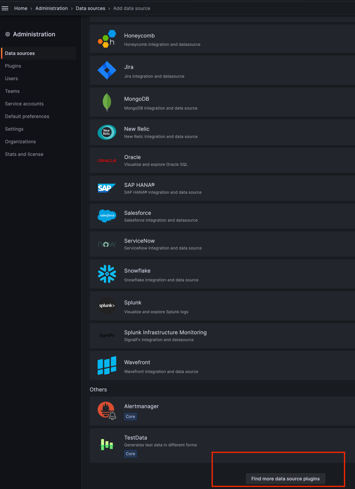
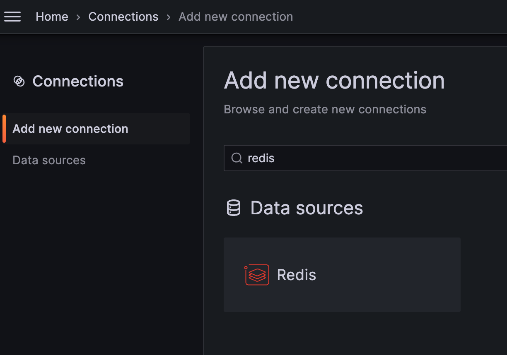
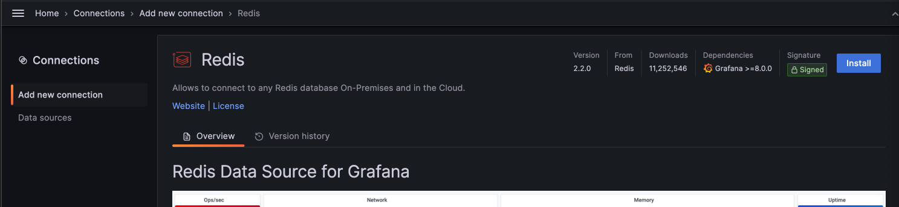
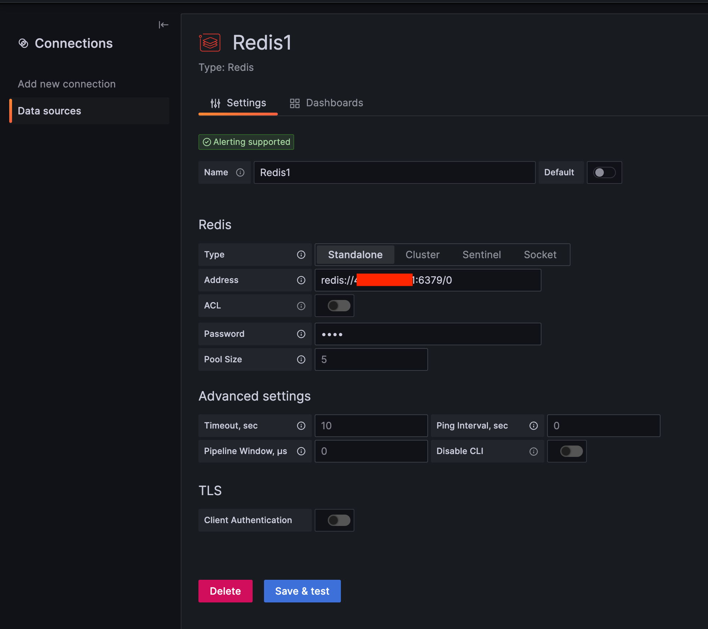
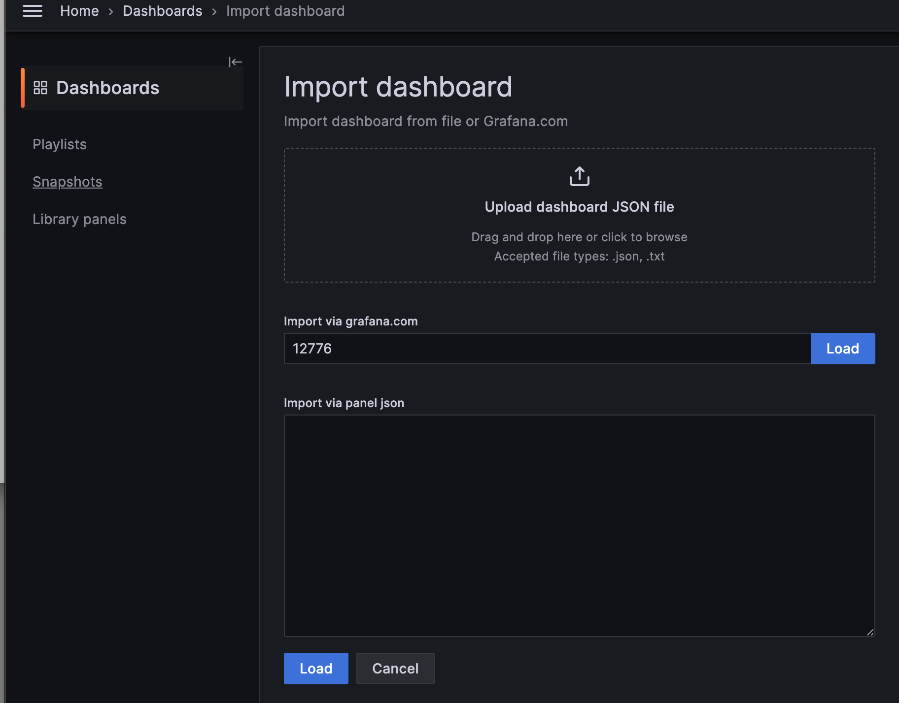
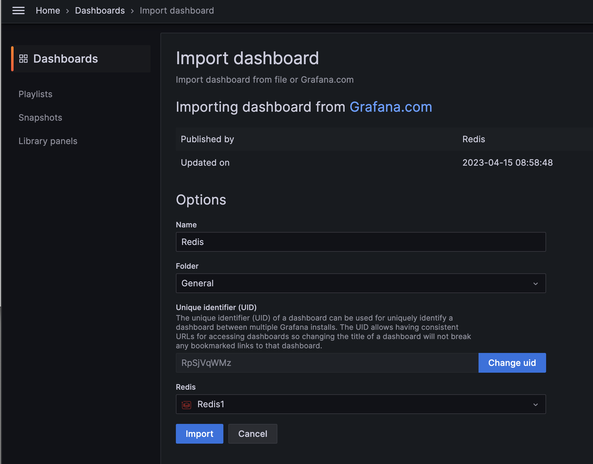
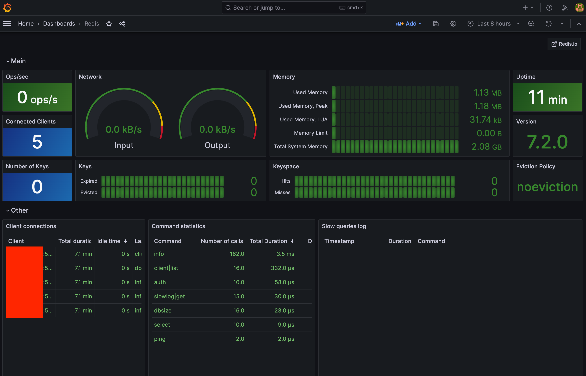
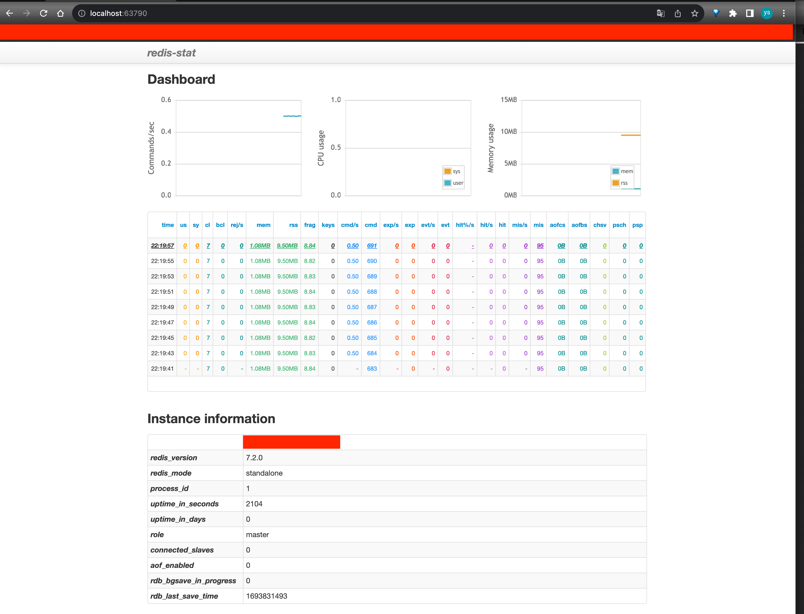
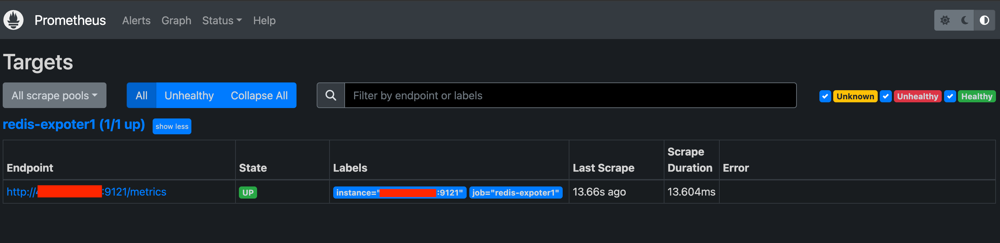
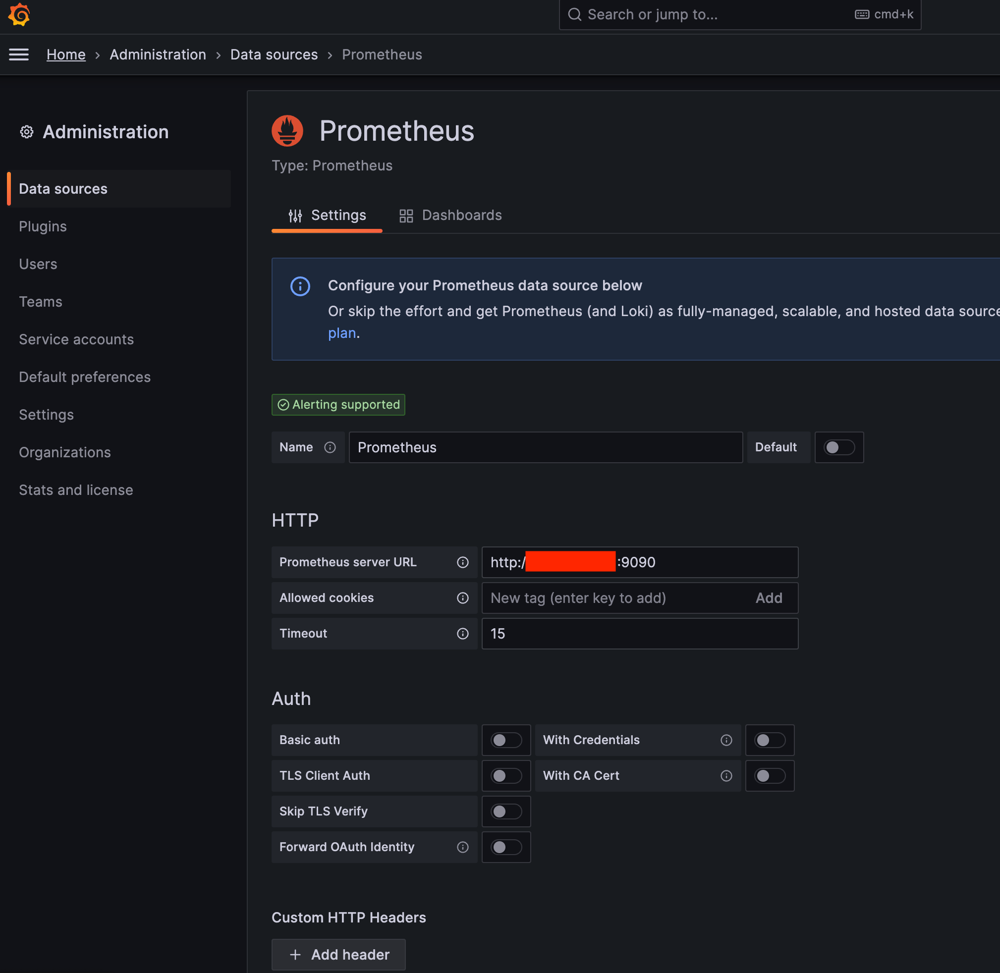

#  레디스 모니터링 - redis-stat, RedisExporter with 프로메테우스, 그라파나


[toc]

레디스를 모니터링 할 수 있는 방법들은 대표적으로 3가지가 있습니다.

1. 그라파나 Redis 플러그인 Data Source로 모니터링

2. 오픈소스 Redis-Stat

3. Reids-Exporter와 프로메테우스로 Redis 메트릭 수집후 그라파나에서 모니터링

 위 세가지 방법에 대해 정리합니다.

# 1. 그라파나 Redis 플러그인 Data Source로 바로 모니터링

설치 편의를 위해 도커 컴포즈로 설치를 진행합니다.

서버에 접속하여 컴포즈 파일을 작성 후 레디스 컨테이너를 실행합니다.

```yaml
version: '3'

services:
  redis-stat:
    container_name: redis-stat
    environment:
      - TZ=Asia/Seoul
      - ALLOW_EMPTY_PASSWORD=yes
    image: redis:latest
    ports:
      - "6379:6379"
    command: redis-server --requirepass 1234 --port 6379
    volumes:
      - /home/redis-volume/data:/data
      - /home/redis-volume/config:/usr/local/etc/redis
```

레디스 서버가 켜지면 그라파나에 접속하여 new DataSource를 선택합니다 

* Home > Administration -> Datasources -> Add new DataSoruces -> 드래그해서 Find more data source plugins (그라파나url.com/connections/add-new-connection?cat=data-source)



Find more data source plugins에서 redis를 검색합니다.

* https://grafana.com/grafana/plugins/redis-datasource/
* document : https://redisgrafana.github.io/redis-datasource/overview/



오른쪽 상단의 install 버튼을 클릭하여 설치합니다.



이후 Redis DataSource를 선택합니다

* -> create a Redis data source

다음 정보를 입력합니다

* redis://서버IP/포트/0
* 패스워드 입력



이후에 save & test로 연결을 테스트합니다. 


데이타 소스가 연결됐으면 대시보드로 연결해야합니다. 

그라파나에서 레디스용 대시보드로는 다음이 있습니다.

* https://grafana.com/grafana/dashboards/12776-redis/

* aws Elasticache Redis : https://grafana.com/grafana/dashboards/969-aws-elasticache-redis/
* for Prometheus Redis Exporter : https://grafana.com/grafana/dashboards/11835-redis-dashboard-for-prometheus-redis-exporter-helm-stable-redis-ha/

Id인 12776을 입력하고  Load합니다.

* http://그라파나 서버URL/dashboard/import로 이동

* import via grafana.com에서 위 패널 라이브러리 id인 12776 입력 후 Load



다음으로 앞에서 지정했던 Redis 데이터 소스 선택 후 Import합니다.



import하면 다음과 같이 대쉬보드를 볼 수 있습니다.



추가로 다음 사이트에서 해당 Data Source에 대한 정보들을 볼 수 있습니다.

* https://redisgrafana.github.io/redis-datasource/overview/


# 2. Redis Stat

* https://github.com/junegunn/redis-stat

*redis-stat는* Ruby로 작성된 간단한 Redis 모니터링 도구입니다.

* 마지막 업데이트가 7년전 ..;;

## redis-stat docker-compose 작성

모니터링을 할 서버에서(로컬호스트도 가능) 다음 docker-compose 를 작성하여 redis-stat 컨테이너를 실행합니다.

```yaml
version: '3'

services:
  redis-stat:
    container_name: redis-stat
    environment:
      - TZ=Asia/Seoul
    image: insready/redis-stat:latest
    ports:
      - "63790:63790"
    command:
      - '--verbose'   # --verbose는 추가 정보 보기
      - '--server'
      - '서버IP:6379/1234' # IP2:PORT2, IP3:PORT3 등으로 추가 가능. 뒤에 1234는 레디스 패스워드
    volumes:
      - /Users/ysk/dev/volume/redis-stat/data:/redis-stat

```

명령어

```
docker-compose -f docker-compose-redis-stat.yml up -d
```

* redis 접속에 패스워드가 필요한 경우 서버IP:포트번호/패스워드를 입력합니다


이후 Redis-stat 컨테이너를 실행하면 위에서 지정한 포트번호인 localhost:63790으로 접속하면 다음 웹에서 대시보드를 볼 수 있습니다. 



대시보드를  위와 같이 확인 가능합니다. 

다음은 대시보드에서 지표들의 의미하는 값들입니다.

| 변수명 | 풀 네임             | 설명                   |
| ------ | ------------------- | ---------------------- |
| us     | used_cpu_user       | 사용자 공간 CPU 퍼센트 |
| sy     | used_cpu_sys        | 커널 공간 CPU 퍼센트   |
| cl     | connected_clients   | 연결 클라이언트 수     |
| bcl    | blocked_clients     | 클라이언트 차단 수     |
| mem    | used_memory         | 총 메모리 사용량       |
| res    | used_memory_ress    | 물리적 메모리 사용량   |
| keys   | dbc.keys            | key의 총 수량          |
| cmd/s  | command/s           | 초당 명령 실행 수      |
| exp/s  | expired_keys/s      | 초당 만료 key 개수     |
| evt/s  | evicted_keys/s      | 초당 제거 key 개수     |
| hit%/s | keyspace_hitratio/s | 초당 히트 백분율       |
| hit/s  | keyspace_hits/s     | 초당 히트 수           |
| mis/s  | keyspace_miss/s     | 초당 미스 수           |
| aofcs  | aof_current_size    | 현재 AOF 로그 크기     |

### redis-stat 여러 서버를 모니터링 하려면?

```yml
version: '3'

services:
  redis-stat:
    container_name: redis-stat
    environment:
      - TZ=Asia/Seoul
    image: insready/redis-stat:latest
    ports:
      - "63790:63790"
    command:
      - '--verbose'
      - '--server'
      - 'server1_host:port/password1'
      - 'server2_host:port/password2'
      - 'server3_host:port/password3'
      # ... 필요한 만큼 추가
    volumes:
      - /Users/ysk/dev/volume/redis-stat/data:/redis-stat
```

## 실행할 수 있는 옵션들

redis-stat에는 다양한 실행할 수 있는 옵션들이 있습니다

```
usage: redis-stat [HOST[:PORT][/PASS] ...] [INTERVAL [COUNT]]
                  [호스트[:포트][/비밀번호] ...] [갱신간격 [횟수]]

    -a, --auth=비밀번호            # 비밀번호 설정
    -v, --verbose               # 더 많은 정보 보여주기
    --style=스타일                # 출력 스타일: unicode 또는 ascii
    --no-color                  # ANSI 색상 코드 제거하기
    --csv=출력_CSV_파일_경로        # 결과를 CSV 형식으로 저장하기
    --es=ELASTICSEARCH_URL      # 결과를 ElasticSearch에 전송하기: [http://]호스트[:포트][/인덱스]

    --server[=포트]              # redis-stat 웹 서버 실행하기 (기본 포트: 63790)
    --daemon                    # redis-stat를 백그라운드에서 실행하기. --server 옵션과 함께 사용해야 함.

    --version                   # 버전 확인
    --help                      # 도움말 메시지 확인

```

1. `[HOST[:PORT][/PASS] ...]`: Redis 서버의 호스트, 포트, 및 비밀번호를 지정합니다. 여러 서버를 모니터링하려면 이 형식의 값을 여러 개 지정할 수 있습니다.
2. `[INTERVAL [COUNT]]`: 통계 정보를 얼마나 자주 갱신할지 (인터벌)와 총 몇 번 갱신할지 (카운트)를 지정합니다.
3. `-a, --auth=PASSWORD`: Redis 서버의 비밀번호를 지정합니다.
4. `-v, --verbose`: 상세 정보를 출력합니다.
5. `--style=STYLE`: 출력 스타일을 지정합니다. `unicode`나 `ascii` 중 선택할 수 있습니다.
6. `--no-color`: 출력에서 ANSI 컬러 코드를 제거합니다.
7. `--csv=OUTPUT_CSV_FILE_PATH`: 결과를 CSV 형식으로 저장합니다.
8. `--es=ELASTICSEARCH_URL`: 결과를 ElasticSearch에 전송합니다. URL 형식은 `[http://]HOST[:PORT][/INDEX]`입니다.
9. `--server[=PORT]`: `redis-stat` 웹 서버를 실행합니다. 기본 포트는 63790입니다.
10. `--daemon`: `redis-stat`를 백그라운드에서 실행합니다. `--server` 옵션과 함께 사용해야 합니다.
11. `--version`: 프로그램 버전을 출력합니다.
12. `--help`: 도움말을 출력합니다.


# 3. Redis-Exporter로 Prometheus + Grafana로 Redis Metric 수집

Redis Exporter는 Redis의 성능 및 상태 지표를 수집하고 모니터링하기 위한 도구 중 하나입니다. 

Redis Exporter는 Grafana, Prometheus와 함께 사용하여 Redis 인스턴스의 메트릭을 수집하고 이러한 메트릭을 시각화하거나 경고알림을 설정하는 데 사용됩니다.


다음 레디스 공식 문서에 더 자세한내용과 추가적인 내용이 적혀있으므로 참고해서 봐도 됩니다.

이 글에서는 간단히 빠르게 설정하는 법을 정리합니다. 

* 프로메테우스와 통합방법 : https://docs.redis.com/latest/rs/clusters/monitoring/prometheus-integration/
* 다양한 메트릭 정보 : https://docs.redis.com/latest/rs/clusters/monitoring/prometheus-metrics-definitions/

* redis exporter : https://github.com/oliver006/redis_exporter


Redis-Exporter를 설치하는 2가지 방법이 있습니다.

1. wget으로 단순하게 설치해서 실행하는 방법
2. 리눅스 서버에 설치 후 system화 해서 service에 등록하는 방법

## 1-1 wget으로 Redis Expoter 설치

* https://grafana.com/oss/prometheus/exporters/redis-exporter/?tab=installation

```sh
wget https://github.com/oliver006/redis_exporter/releases/download/v1.53.0/redis_exporter-v1.53.0.linux-amd64.tar.gz
```

* v.1.53은 설치하려는 버전으로 교체
* https://github.com/oliver006/redis_exporter/releases

압축을 풀고 디렉토리에 넣습니다.

```sh
tar xvfz redis_exporter-v1.53.0.linux-amd64.tar.gz
mv redis_exporter-v1.53.0.linux-amd64 redis-exporter
```

레디스를 보도록 설정합니다

```sh
cd redis-exporter

./redis_exporter -redis.addr redis://:your_password@localhost:6379 &

# 백그라운드 프로세스의 출력을 무시하고 싶다면? -> 터미널 밖을 나가지는 못함
./redis_exporter -redis.addr redis://:your_password@localhost:6379 > /dev/null 2>&1 &
```

* 레디스가 로컬호스트에 있다고 가정 
* your_password에 암호 지정하고 백그라운드로 실행

http://서바이이피:9121/metrics 로 들어가서 레디스 메트릭 수집이 가능합니다.

### 1-2 시스템에 영구적으로 RedisExporter 설치

첫 번째 방법은 단순하게 `redis_exporter`를 실행하는 반면, 
두 번째 방법은 `redis_exporter`를 시스템 서비스로 설치하고 관리합니다.

1. 설치

```sh
wget https://github.com/oliver006/redis_exporter/releases/download/v1.53.0/redis_exporter-v1.53.0.linux-amd64.tar.gz
```

2. 압축 해제 및 파일 복사

```sh
tar xvfz redis_exporter-v1.53.0.linux-amd64.tar.gz
mv redis_exporter-v1.53.0.linux-amd64 redis-exporter
```

3. Systemd로관리

```sh
cp redis_exporter /usr/bin/

sudo vi /etc/systemd/system/redis-exporter.service

# 내용작성
[Unit]
Description=Redis Exporter
Wants=network-online.target
After=network-online.target

[Service]
User=root
Group=root
Type=simple
ExecStart=/usr/bin/redis_exporter \
    -web.listen-address ":9121" \
    -redis.addr "redis://패스워드@IP 주소:6379" \

[Install]
WantedBy=multi-user.target
```

- `systemd`는 리눅스 시스템에서 서비스를 관리하는 데 사용되는 도구입니다.
- 이렇게 설정하면 시스템 부팅 시 `redis_exporter`가 자동으로 시작됩니다.
- `systemctl` 명령어를 사용하여 서비스를 시작, 중지, 재시작하거나 상태를 확인할 수 있습니다.

4. 입력이 완료돼면 아래의 명령을 순서대로 실행합니다.

```sh
systemctl daemon-reload
systemctl enable redis_exporter
systemctl start redis_exporter
```

**확인**

```sh
curl -XGET http://localhost:9121/metrics
```

메트릭이 출력되면 Promtheus로 보낼 Redis  메트릭 준비 완료가 됩니다. 

## 2. docker-compose로 Redis Exporter 설치

```yaml
version: '3'

services:
  redis_exporter:
    image: oliver006/redis_exporter
    container_name: redis_exporter
    ports:
      - "9121:9121"
    command:
      - "-redis.addr=your_redis_host:your_redis_port"
```

## 3.프로메테우스 설치 및 설정

docker-compose.yml

프로메테우스 설정 디렉토리로 이동 후 prometheus.yml을 엽니다

* 여기서는 /home/promethues/config로 지정하였습니다. 

```yaml
cd /home/prometheus/config
vi prometheus.yml
```

프로메테우스를 실행 전 설정 파일을 작성해야 합니다.

다음 prometheus.yml을 작성합니다.

```yaml
global:
  scrape_interval: 15s     # scrap target의 기본 interval을 15초로 변경 / default = 1m
  scrape_timeout: 15s      # scrap request 가 timeout waite/ default = 10s
  external_labels:
    monitor: 'ysk-monitor'  # Default label to be added
  query_log_file: query_log_file.log  # Log file for Prometheus queries

# 매트릭을 수집할 엔드포인드로 여기선 Prometheus 서버 자신을 가리킨다.
scrape_configs:

  - job_name: "redis-expoter1" # 작업(job)의 이름 job_name 은 모든 scrap 내에서 고유해야한다
    static_configs:						 # 정적 설정을 사용하여 대상을 지정
      - targets:							 # 스크레이프할 대상의 주소
          - '서버IP:9121'  # Redis Exporter의 주소

  external_labels:
    monitor: 'ysk-monitor'       # 기본적으로 붙여줄 라벨
  query_log_file: query_log_file.log # prometheus의 쿼리 로그들을 기록. 설정되지않으면 기록하지않는다.


    #file_sd_configs:                                # 파일을 기반으로 한 서비스 디스커버리 설정
    #  - files:                                      # 스크레이프할 대상 정보를 포함하는 파일
    #    - targets-redis-instances.json              # Redis 인스턴스의 대상 정보가 들어있는 JSON 파일
  	#metrics_path: /scrape                           # 대상에서 메트릭을 가져올 경로
    #relabel_configs:                                # 대상 레이블을 재설정하기 위한 설정
    #  - source_labels: [__address__]                # 원본 레이블 (보통 대상의 주소)
    #    target_label: __param_target                # 해당 원본 레이블을 __param_target으로 이름을 변경
    #  - source_labels: [__param_target]             # 위에서 재설정한 레이블
    #    target_label: instance                      # 해당 레이블을 instance로 이름을 변경
    #  - target_label: __address__                   # 대상의 주소 레이블
    #    replacement: <<REDIS-EXPORTER-HOSTNAME>>:9121 # 원본 주소를 Redis Exporter의 주소로 변경


```

* 아래 추가 설정은 필요하면 설정하시면 됩니다.
* 문법 검사에 실패했을 시 yml 파일을 확인해주는 사이트를 확인하세요
  * http://www.yamllint.com/


다음 프로메테우스를 도커로 실행하기 위해 docker-compose.yml을 작성합니다

```yaml
version: '3'

services:
  prometheus:
    image: prom/prometheus
    container_name: prometheus
    user: root
    volumes:
      - /home/prometheus/config:/etc/prometheus
      - /home/prometheus/volume:/prometheus
    ports:
      - 9090:9090 # 접근 포트 설정 (컨테이너 외부:컨테이너 내부)
    command: # web.enalbe-lifecycle은 api 재시작없이 설정파일들을 reload 할 수 있게 해줌
      - '--web.enable-lifecycle'
      - '--config.file=/etc/prometheus/prometheus.yml'
```

docker-compose를 실행합니다

```sh
docker-compose up -d
```


프로메테우스 메뉴 ->  Status Configuration 에 들어가서 prometheus.yml 에 입력한 부분이 추가되어 있는지 확인합니다.

* http://서버주소:9090/config

프로메테우스에 접속해서 targets에 올라오면 성공입니다.

* http://프로메테우스IP:9090/targets 에 접속



## 4. 그라파나에서 프로메테우스 참조

다음으로 그라파나에서 프로메테우스 메트릭을 수집하도록 합니다. 

그라파나로 접속합니다.

1. 프로메테우스를 DataSource에 연동합니다 

* Home > Administration -> Datasources -> Add new DataSoruces

* http://그라파나IP:3000/datasources/new



http://그라파나IP:3000/dashboard/imports 로 접속하여 대시보드를 Import합니다 

다음 아래의 대시보드를 선택해서 이용하면 됩니다. 이미 잘 만들어진 것들이 있습니다.

* https://grafana.com/grafana/dashboards/763-redis-dashboard-for-prometheus-redis-exporter-1-x/

* https://grafana.com/grafana/dashboards/11835-redis-dashboard-for-prometheus-redis-exporter-helm-stable-redis-ha/

* https://grafana.com/grafana/dashboards/14091-redis-dashboard-for-prometheus-redis-exporter-1-x/

* https://grafana.com/grafana/dashboards/11692-redis-dashboard-for-prometheus-redis-exporter-1-x/

## 더 다양한 설정

더 다양한 설정은 https://grafana.com/oss/prometheus/exporters/redis-exporter/?tab=installation 를 참고하여 구현하면 됩니다.

- 알림 구성하기
  - [Prometheus에 알림 규칙 로드하기](https://grafana.com/oss/prometheus/exporters/redis-exporter/?tab=installation#load-alerting-rules-into-prometheus)
  - [Grafana Cloud에 알림 규칙 로드](https://grafana.com/oss/prometheus/exporters/redis-exporter/?tab=installation#load-alerting-rules-into-grafana-cloud)

## 번외 - Redis Exporter 엔드포인트 보호

Redis Exporter는 기본적으로 인증 메커니즘을 제공하지 않습니다. 

때문에 엔드포인트가 쉽게 노출되어 정보를 외부에 노출될 위험이 있습니다.

다음과 같이 보안을 위한 다양한 방법이 있습니다.

1. **Reverse Proxy 사용 (예: Nginx 또는 Apache)**
   - Nginx나 Apache와 같은 리버스 프록시를 설정하여 Redis Exporter 앞에 배치하고 이 프록시를 통해 Basic Authentication을 적용할 수 있습니다.
   - 이렇게 하면 엔드포인트에 접근하기 전에 사용자 이름과 비밀번호를 입력해야 합니다.
2. **Network Level Security**
   - Redis Exporter를 특정 IP 주소 또는 네트워크에서만 액세스할 수 있도록 방화벽 또는 보안 그룹을 설정합니다. 이렇게 하면 미리 정의된 IP 또는 네트워크 범위 외부에서는 엔드포인트에 접근할 수 없습니다.
3. **TLS/SSL 사용**
   - 리버스 프록시를 사용하여 Redis Exporter 앞에 TLS/SSL 암호화를 추가합니다. 이렇게 하면 트래픽이 암호화되어 중간자 공격(man-in-the-middle attack)을 방지할 수 있습니다.
4. **OAuth, OIDC 또는 JWT와 같은 고급 인증**
   - 리버스 프록시 뒤에 Redis Exporter를 배치하고 OAuth, OIDC, JWT와 같은 고급 인증 메커니즘을 사용하여 엔드포인트에 대한 접근을 보호할 수 있습니다.

이중에서 가장 간단하면서도 효과적인 방법은 리버스 프록시를 사용하여 Basic Authentication을 설정하는 것입니다. 