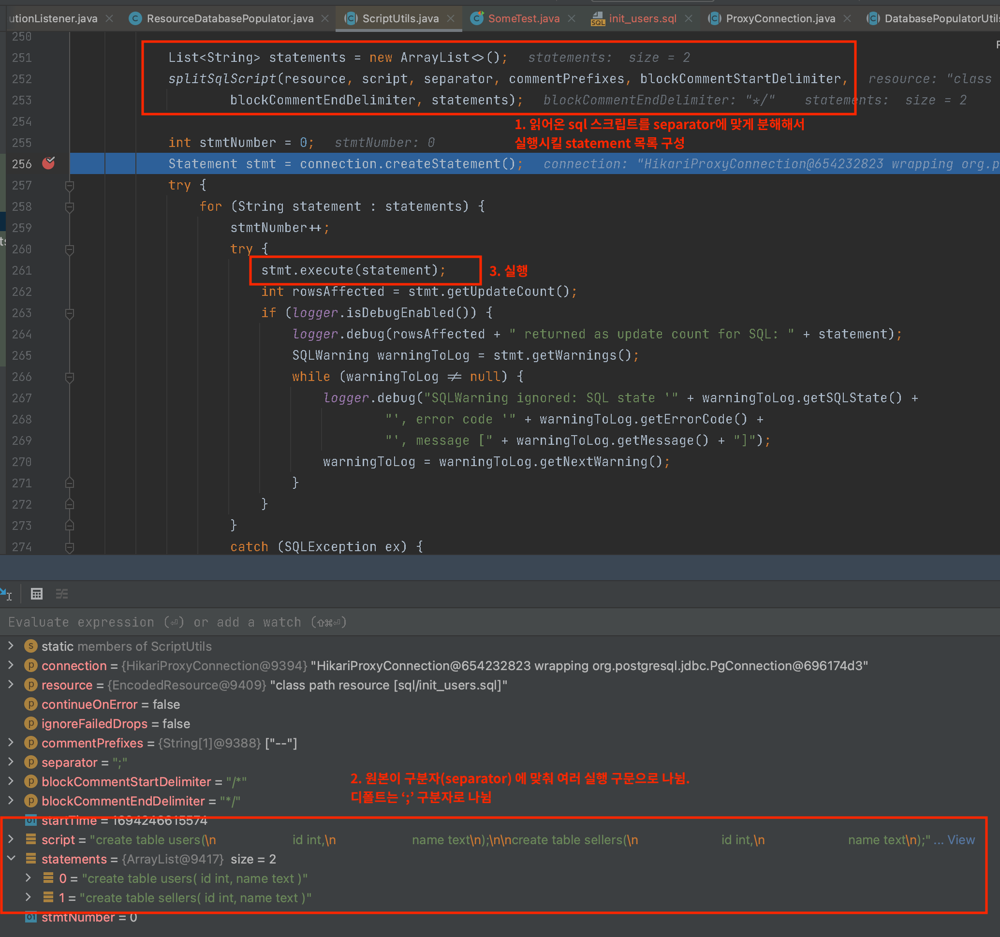
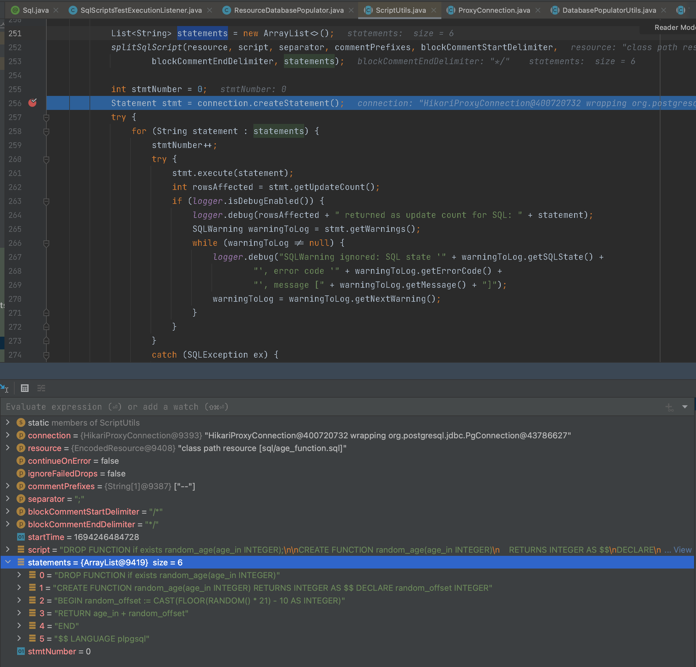
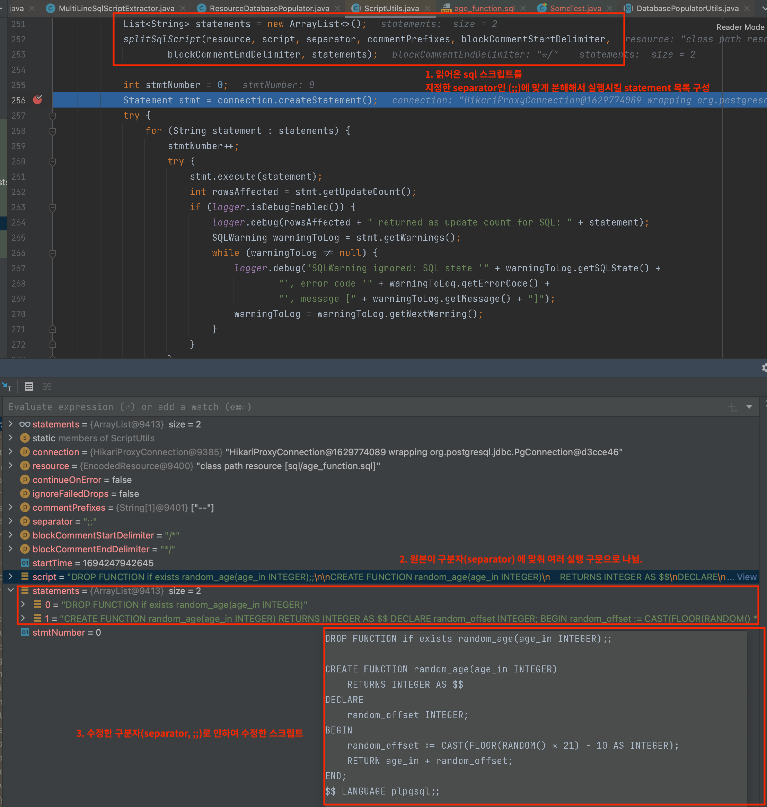

# Springboot PSQLException: Unterminated dollar quote started at position $$

SpringBoot Junit5 환경에서, 일부 테스트 에만 sql 파일을 실행시켜 테스트 해야하는 경우가 있었습니다.

특정 sql 스크립트를 이용하여 테스트 하던 중 다음과 같은 오류를 만나 테스트가 실행되지 않는 문제를 해결한 방법입니다.

```
Caused by: org.postgresql.util.PSQLException: Unterminated dollar quote started at position 62 in SQL CREATE FUNCTION random_age(age_in INTEGER) RETURNS INTEGER AS $$ DECLARE random_offset INTEGER. Expected terminating $$
// 스크립트 내용은 재현하기 위한 가제. 예외명이랑 메시지는 겪은 문제와 같다.
```

**환경**

* SpringBoot 2.7.x
* Java 17 
* Postgresql 14


SpringBoot Junit5 에서는 테스트 실행 전후로 @Sql 어노테이션을 이용해서 특정 SQL 스크립트를 실행시킬 수 있습니다.

* classpath:디렉토리명/sql파일명
* *@Sql* 어노테이션 의 속성
  - **config** : SQL 스크립트에 대한 설정. - `@SqlConfig`
  - **executionPhase** – BEFORE_TEST_METHOD 또는 *AFTER_TEST_METHOD* 중 스크립트를 실행 시기 지정
  - **구문(statements)** - 실행할 인라인 SQL 문을 선언.
  - **script(스크립트) – 값** 실행할 SQL 스크립트 파일의 경로를 선언 .

```java 
@SpringBootTest(webEnvironment = SpringBootTest.WebEnvironment.NONE)
public class SomeTest {

  @Autowired
	private SomeService service;

	@Sql(scripts = "classpath:sql/age_function.sql",
		executionPhase = Sql.ExecutionPhase.BEFORE_TEST_METHOD
	)
	@Sql(scripts = {"classpath:sql/drop_age_function.sql"},
		executionPhase = Sql.ExecutionPhase.AFTER_TEST_METHOD)
	@Test
	void test() {
		int age = 10;
		service.logic("bob", age);
	}

}
```


postgresql 등에서 함수를 선언할때 `$$(달러 쿼트)` 를 많이 이용하는데요

재연을 위해 간단하게 $$가 포함된 함수를 선언합니다.

* 정수값을 넘기면 랜덤하게 더해서 돌려주는 예시입니다. 

```postgresql
CREATE FUNCTION random_age(age_in INTEGER)
    RETURNS INTEGER AS $$
DECLARE
    random_offset INTEGER;
BEGIN
    random_offset := CAST(FLOOR(RANDOM() * 21) - 10 AS INTEGER);
    RETURN age_in + random_offset;
END;
$$ LANGUAGE plpgsql;
```

이 함수를 age_function.sql에 작성하고, 위 자바 테스트 코드 예제와 같이 작성하면 다음과 같은 오류를 만납니다.

```
Caused by: org.postgresql.util.PSQLException: Unterminated dollar quote started at position xxx...
```


## 문제 원인 분석

구문은 맞습니다. 그러나 문제는 파일을 가져온 후 구문 분석에 있었습니다. 

`@Sql` 어노테이션이 지정된 테스트 메서드나 테스트 클래스가 실행될 때, 해당 SQL 스크립트나 문장은 **`TestExecutionListener`**에 의해 처리됩니다.

org.springframework.test.context.jdbc.`SqlScriptsTestExecutionListener`에 의해 처리되는데,

`TestExecutionListner`가 처리하는 과정에서 

`DatabasePopulator` 를 구현한 `ResourceDatabasePopulator`가 populate(Connection connection)메소드로

`ScriptUtils`를 호출합니다. 

`org.springframework.jdbc.datasource.init.ScriptUtils`에서 executeSqlScript()메소드가 구문을 분석하고 SQL을 파싱하는 과정에서

ResourceDatabasePopulator의 separator(구분자)를 같이 넘겨주고, 

디폴트로는 `;` 라는 기호 기준으로, 한 파일내에서  SQL을 분리합니다

```java

public class ResourceDatabasePopulator {
	
  private String separator = ScriptUtils.DEFAULT_STATEMENT_SEPARATOR; // 구분자.  변경 가능하다.

	@Override
	public void populate(Connection connection) throws ScriptException {
		Assert.notNull(connection, "'connection' must not be null");
		for (Resource script : this.scripts) {
			EncodedResource encodedScript = new EncodedResource(script, this.sqlScriptEncoding);
			ScriptUtils.executeSqlScript(connection, encodedScript, this.continueOnError, this.ignoreFailedDrops,
					this.commentPrefixes, this.separator, this.blockCommentStartDelimiter, this.blockCommentEndDelimiter);
		}
	}
}

// Script Utils의 DEFAULT_SEPARATOR
public abstract class ScriptUtils {

	/**
	 * Default statement separator within SQL scripts: {@code ";"}.
	 */
	public static final String DEFAULT_STATEMENT_SEPARATOR = ";"; // here
  
  public static final String FALLBACK_STATEMENT_SEPARATOR = "\n";
}
```

만약 다음 예제 스크립트라면 

```sql
create table users(
	id int,
	name text
);

create table sellers(
	id int,
	name text
);
```

라고 적혀있는 스크립트 내에서 ; 구분자를 이용해 두 구문을 분리하게 되면, 다음과 같이 2개의 스크립트가 생기는 것입니다. 



다시 처음으로 돌아가, 우리의 기존 예제 함수인

```sql
CREATE FUNCTION random_age(age_in INTEGER)
    RETURNS INTEGER AS $$
DECLARE
    random_offset INTEGER;
BEGIN
    random_offset := CAST(FLOOR(RANDOM() * 21) - 10 AS INTEGER);
    RETURN age_in + random_offset;
END;
$$ LANGUAGE plpgsql;
```

을 보면 '';'' 구분자에 의해 6개로 나뉜것을 확인할 수 있습니다. 



때문에 구문이 문법에 맞지않게 분리되어 함수가 제대로 실행이 되지 못하는것입니다.

# 해결방법

해결방법은 2가지가 있습니다.

1. @Sql 어노테이션 지정시 구문을 분리할 적당한 separtor 지정
2. SQL Script에서 함수 정의 본문을 `'`로 감싸주기


## 1. @Sql 어노테이션 지정시 구문을 분리할 적당한 separtor 지정

다음과 같이 테스트 어노테이션에서 지정합니다

```java
@Sql(scripts = {"classpath:sql/age_function.sql"},
		executionPhase = Sql.ExecutionPhase.BEFORE_TEST_METHOD,
		config = @SqlConfig(separator = ";;") // separator 지정
)
```

이렇게 지정하면, ResourceDatabasePopulator에서 주입받아서 ScriptUtils에게 구문 분석시 지정한 separator를 넘겨주게 됩니다.

물론 원문 스크립트도 구분할 수 있게 지정한 separator로 바꿔줘야 합니다

```sql
// test/resources/sql 아래에 있는 age_function.sql

DROP FUNCTION if exists random_age(age_in INTEGER);; // 지정한 separator

CREATE FUNCTION random_age(age_in INTEGER)
    RETURNS INTEGER AS $$
DECLARE
    random_offset INTEGER;
BEGIN
    random_offset := CAST(FLOOR(RANDOM() * 21) - 10 AS INTEGER);
    RETURN age_in + random_offset;
END;
$$ LANGUAGE plpgsql;; // 지정한  separator
```



이렇게하면 정상 실행됩니다.

( 물론 스크립트 내용에 따라 다르겠지만, 상황에 맞게 적절한 구분자(separator)를 지정해주고 스크립트를 수정하면 됩니다)


## 2.SQL Script에서 함수 정의 본문을 `'`로 감싸주기

기존에 사용했던 $$ 대신 '로 함수 정의 본문을 감싸주면 해결됩니다

**바꾸기 전 $$를 이용한 스크립트**

```sql
DROP FUNCTION if exists random_age(age_in INTEGER);

CREATE FUNCTION random_age(age_in INTEGER)
    RETURNS INTEGER AS $$
DECLARE
    random_offset INTEGER;
BEGIN
    random_offset := CAST(FLOOR(RANDOM() * 21) - 10 AS INTEGER);
    RETURN age_in + random_offset;
END;
$$ LANGUAGE plpgsql;
```

바꾼 후 ''를 이용한 스크립트

```sql

DROP FUNCTION if exists random_age(age_in INTEGER);

CREATE FUNCTION random_age(age_in INTEGER)
    RETURNS INTEGER AS '

DECLARE
    random_offset INTEGER;
BEGIN
    random_offset := CAST(FLOOR(RANDOM() * 21) - 10 AS INTEGER);
    RETURN age_in + random_offset;
END;

' LANGUAGE plpgsql;
```

만약, 다음과 같이 SQl 스크립트 내부에 ''가 나 %같은 다른 특수문자가 들어간다면, 그때는 더블 쿼트를주면 됩니다

```
'~~~' -> ''~~~''
'%' -> ''%''
```

ex) 만약 다음과 같이 예외를 발생시킨다면

```sql

DROP FUNCTION if exists random_age(age_in INTEGER);

CREATE OR REPLACE FUNCTION random_age(age_in INTEGER)
    RETURNS INTEGER AS $$
DECLARE
    random_offset INTEGER;
BEGIN
    -- 입력값 검사
    IF age_in < 0 OR age_in > 150 THEN
        RAISE EXCEPTION 'Invalid age value: %', age_in; // ''가 들어가있음 
    END IF;

    random_offset := CAST(FLOOR(RANDOM() * 21) - 10 AS INTEGER);
    RETURN age_in + random_offset;
END;
$$ LANGUAGE plpgsql;
```

해당 싱글 쿼트를 더블 쿼트로 지정해줍니다 

```sql

DROP FUNCTION if exists random_age(age_in INTEGER);

CREATE OR REPLACE FUNCTION random_age(age_in INTEGER)
    RETURNS INTEGER AS '
DECLARE
    random_offset INTEGER;
BEGIN
    -- 입력값 검사
    IF age_in < 0 OR age_in > 150 THEN
        RAISE EXCEPTION ''Invalid age value: %'', age_in;
    END IF;

    random_offset := CAST(FLOOR(RANDOM() * 21) - 10 AS INTEGER);
    RETURN age_in + random_offset;
END;
' LANGUAGE plpgsql;
```


## 이외 다른 해결방법

추가적으로 비슷한 문제가 있는데 위 방법으로 해결이 안된다면 아래를 참고해보세요

* https://stackoverflow.com/questions/52228470/exception-in-jpa-when-using-seed-file-for-postgresql/52230382#52230382