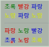

# 개발자영어 - 유데미 박재호 강사님

# 개발자는 왜 영어를 배워야 하는가?

---
* 개발 과정에서 코드와 문서 작성
* 필요한 자료 검색을 위한 기반
  * 네이버나 다음에서 검색하는 것보다 좀더 자세한 해결 방법이 외국 사이트(stackoverflow.com) 등에 나와있다.
  * 국내 포털에서 한국어로 검색 하는 것보단 해외 포털에서 영어로 검색하는 것이 내 문제의 해결 방법을 찾을 가능성이 높다.  
* 학습을 위한 기반 

## 개발자에게 영어가 중요한 이유

* 개발자가 가장 먼저 익혀 할 언어는 ? - 영어 
  * 영문 독해력이 중요하다. 대부분의 자료가 영어이기 때문이다. 
* 지식과 정보의 보고
  * 대다수 최신 정보는 영어
  * 남들보다 한 걸음 앞서는 토대

* 프로그래밍 언어 자체가 영어
  * 영어권에서 개발
  * 의사 소통을 위해 작명 관례가 중요하다.
    * 변수 이름을 value가 아닌 gab(값)으로 하면 ..? 
  * 깨끗한 코드의 중요성

* 의사 소통 도구
  * 공동체 참여(특히 오픈 소스)
  * 질문, 묻고 답하기(Stack OverFlow, Quora)/ 메일링 등에서 질문과 대답을 위한 공용어 

### 코드 문서화에 영어가 필요한 이유
* 대다수 프로그래밍 언어는 영어권에서 개발됨
  * 물론 유니코드 보급으로 함수나 변수 이름을 비롯해 주석에도 자유롭게 여러 언어를 사용할 수는 있으나 여전히 대다수 상용/오픈소스 코드는 전세계적인 표준어인 영어로 되어있다.
### 회사 생활에 영어가 중요한 이유
* 인적 네트워크 구성 기회
  * 링크드인 페이지 구성
  * 트위터/페이스북 정보 습득

* 업무상 필요한 사항
  * 문의/계약을 위한 이메일
  * 기술 문서 작성
  * 앱 소개 자료(앱스토어에 올릴 설명)

* `하지만 영어를 사용한다고 해서 저절로 소프트웨어 개발이 쉬워지거나 품질이 향상되지는 않는다. -> 제대로 학습하고 제대로 사용해야 함.`

* 실제 소프트웨어 개발에서 대다수 시간은 생각에 쓰고 남은 시간 대다수를 읽기에 쓴다
  * 여전히 많은 정보가 `텍스트 중심`으로 전파된다.

## 읽기 좋은 코드가 중요한 이유

---
* 코드는 이해하기 쉬워야 한다.
  * 코드의 읽기 : 쓰기 비율은?

* 코드 이해도가 핵심
  * 다른 사람(자기자신이 될 가능성도 있다. 내가 만든 코드를 내가 개선하거나 유지보수할 수도 있다.)이 이해하는 시간을 줄여야 함.
  * 구현과 테스트가 쉬운 코드의 특성
    * -> 이해도가 쉬운 코드
  * 가독성 높은 코드는 클린코드의 기본 특성

* `코드 자체가 문서로 볼 수 있다`.
  * 어려운 코드를 주석과 문서로 방어하는 대신 코드 자체를 문서로 생각할 수 있게!
  * 생산성을 높이는 첫 걸음. 

## 코드 작성 과정에서 쓰기의 중요성

---

* 코드 내부 식별자는 영어가 일반적이다.
  * 타입(클래스, 인터페이스, 열거형(enum)), 변수, 메서드, 함수, 모듈, 라이브러리, 네임스페이스 등
* 코드 내부 주석도 영어가 일반적이다.
  * 묹서화를 위한 주석
  * 코드 내 알고리즘이나 자료 구조 등을 설명하기 위한 주석
* 코드 내부 오류 메시지도 영어가 일반적이다
  * 문제나 에러가 발생했을 경우 사용자에게 알려주고 제시하는 문구
* 형상 관리를 위한 코드 커밋 메시지도 영어가 일반적이다
  * 코드 변경의 이유와 배경, 그리고 부수 효과 등을 설명하는 문구 


### 코드와 글의 공통점(1) - 그레디 부치(Grady Booch)
* 깨끗한 코드는 단순하고 직접적이다. 
* 깨끗한 코드는 잘 쓴 문장처럼 읽힌다. 
* 깨끗한 코드는 결코 설계자의 의도를 숨기지 않는다. 오히려 명쾌한 추상화와 단순한 제어문으로 가득하다 

### 코드와 글의 공통점(2) - 워드 커닝엄(워드 커닝햄, Ward Cunningham, 위키 창시자)
* 코드를 읽으면서 짐작했던 기능을 각 루틴이 그대로 수행한다면 깨끗한 코드라 불러도 되겠다. 
* 코드가 그 문제를 풀기 위한 언어처럼 보인다면 아름다운 코드라 불러도 되겠다.
* 개발자는 문제를 풀고 해결하는사람.
* 우리가 풀고자 하는 특정 도메인에 속하는 문제를 프로그램 언어로 어떻게 잘 표현하느냐가 관건.


### 어휘력

* 소프트웨어 개발 과정에서 다양한 문서를 읽어야 한다.
  * 이 과정에서 필수적으로 어휘력이 뒷받침될 필요가 있다.
* 전공이나 직업 관점에서 생각해보자
  * 전문 분야에서 두각을 나타내려면 어휘력이 매우 중요! 

* 가장 먼저 읽기에 투자하자.
  * 기술 자료들과 코드를 읽을 수 있으면 된다.
* 그 다음 쓰기에 투자
  * 아주 복잡한 논문을 쓰기 위한 수준은 필요하지 않다.
  * 실무에 적합한 수준을 달성하면 된다.

* `특히 기술용어에 대해 익숙해져야 한다.`

## 개발자를 위한 영어 학습 로드맵

---
### 개발역량 향상으로 초점을 옮겨가자
* 남의 코드를 제대로 읽을 수 있게 준비
  * 실제 프로그램 논리, 주석, 커밋 메시지, 영어로 된 각종 문서
  * 오픈 소스를 적극적으로 활용

* 내 코드를 깔끔하게 만들 수 있게 준비
  * 클린코드가 가능하려면 프로그램 논리도 명쾌해야 하지만 영어 관련 역량도 좋아야 함
  * 읽기에서 쓰기로 확장 -> (가장 먼저 읽기에 투자, 그 다음 쓰기로 투자하여 확장)

* 문서화에도 신경을 써야 함
  * README나 주석(코드 설명을 위한, 문서화를 위한)은 영어로 작성하는 습관을 들이는게 좋다.
  * ChangeLog 등은 커밋 메시지와 연계해서 제대로 작성해야 한다. 

* `한국어 자료보다 영어 자료가 더 많다`
  * 따라서 영어로 정보 습득을 위한 준비를 해야한다.
  * 학습 역량 향상을 위해 준비하고 공부해야한다.
* 학습 역량을 토대로 개발 역량을 강화해야 한다
  * `코드 문서화`, `개발을 위한 정보 습득 역량`, `질문과 대답하기`에 초점을 맞추자

> 영어 학습이 최종 목표가 아닌 현업(개발)과 연계시켜 함께 키워나갈 방법을 찾아보고 궁리해야 한다. 

# 코드 문서화

## 코드 문서화는 마지못해 해야하는 숙제인가?

---
* 클린코드에서 작명과 주석의 중요성에 대해 강조하는 이유는 무엇일까?
  * 사례 : 코드 이름과 주석의 연관성은?
  * 코드 주석은 동전의 양면과도 같다.
    * 잘못된 코드를 제대로 설명하기 위해 주석이 필수인가? 불을 지른 다음에 이를 수습하기 위해 열심히 물을 붓는 상황과 유사하다.
    * 원칙 : 잘못된 코드를 주석으로 바로잡는 설명을 붙이는 대신, 코드를 수정하자! 
* 다음 예제는 강의 내에서 파이썬 코드를 자바 코드로 변환한 것이며, 편의상 class 이름은 Calculate라고 하였다.
```java

public class Calculate {
    /**
     * 
     * @param r : the hourly pay rate
     * @param h : the work hours
     * @param ovt : the overtime pay rate
     * @param ovh : the overtime work hours
     * @param e : indicate if employee is eligible for overtime pay
     * @return the total amount of pay
     */
    public Integer calculatePay_1(int r, int h, int ovt, int ovh, int e) {
        int t = r * h; // calculate pay for normal working hours
        
      if (e) {
            t = t + ovt * ovh; // if yes, appli overtime rate
        } else {
            t = t + r * ovh; // if no, apply normal rate
        }
        
        return t; // return total pay
    }
    
    public Integer calculatePay_2(int hourlyPayRate, int workHours, 
                                int overtimePayRate, int overtimeWorkHours, 
                                boolean isEligibleOvertimeRate) {
        int totalPay = 0;
        totalPay = hourlyPayRate * workHours;
        
        if (isEligibleOvertimeRate) {
            totalPay = totalPay + overtimePayRate * overtimeWorkHours;
        } else {
            totalPay = totalPay + hourlyPayRate * overtimePayRate;
        }
        
        return totalPay;
    }
}
```
* 위 코드 `calculatePay_1` 과 `calculatePay_2` 는 같은 기능을 하는 코드이다.
* calculatePay_1처럼 해석할 수 없는 코드에 주석으로 수습해도 이해가 잘 안된다.
  * `이 메서드가 무슨 일을 하는지, 이 파라미터가 무슨 의미인지 알 수가 없다.`
* 그러나 calculatePay_2처럼 코드 이름의 의미를 명확하게 하면 잘 읽히고 주석이 필요 없게 된다.
* 이처럼 주석으로 바로 잡아봤자 해석은 여전히 어려우니, 주석을 붙이는 대신 코드를 수정하여 읽기 좋게 만드는게 좋습니다.

* 커밋메시지를 제대로 달면 어떤 점이 좋아질까?
* 오류 메시지와 오류 코드 역시 코드 문서화의 일부가 아닐까? 

## 프로그래밍 과정에서 이름 짓기와 관련된 심리학
---

### 이름의 중요성

---
* 스트루프 효과(stroop effect)
> 심리학에서, 스트루프 효과(Stroop effect) 또는 스트루프 검사(Stroop test)는 과제에 대한 반응 시간이 주의에 따라 달라지는 효과 또는 이러한 현상을 이용하는 검사를 말한다.  
> "파랑", "초록", "빨강"과 같은 글자와 이 글자가 나타내는 의미인 실제 색상이 일치하지 않을 경우,   
> 즉 `"빨강"이 빨간색으로 프린트되어 있지 않고 노란색으로 프린트되어 있을 경우에 글자의 색을 말하는 데 더 오랜 시간이 걸리며 잘못 말하는 경향이 생기는 현상이다.`
- 위키백과 
* 

* 부가적인 정보보다 단어 자체에 강하게 자극된다. 

#### 오해할 수 없는 이름의 중요성(1)

* 코드 기반에서 식별자 이름이 중요
  * 식별자 종류 : 타입 (클래스, 인터페이스, 열거형(enum) ), 변수, 메섣, 함수, 모듈, 라이브러리, 네임스페이스 등
  * 중요한 이유 
    * 이름은 코드 기반의 상당 부분을 차지한다.
    * 코드 리뷰시 지적되는 사항 : 연구 조사 결과 코드 리뷰 중 25%가 명칭과 관련된 언급, 식별자 이름에 대한 언급은 9%
    * `이름은 문서화의 가장 쉬운 형태` - 이름은 코드 기반 내에서 바로 사용되므로 일종의 문서로 기능한다.
    * 이름이 표식 역할을 함 : 변수 이름은 주석문 이외에 코드 이해해 도움을 주는 중요한 표식이다. 
    * `이름을 똑바로 짓지 않으면, 결국 코드를 해석해 나갈 수 없다.` 

#### 오해할 수 없는 이름의 중요성(2)
* 여기서 생각할 사항 - 좋은 이름과 나쁜 이름은 어떻게 구분될까?
* 두가지 관점
  1. 문법적인 정의
  2. 코드 기반 내에서 일관성 

##### 1. 문법적인 정의
* 문법적인 정의 : 버틀러의 명명 규칙 목록 - 다음과 같은 방식으로 명명 하지 말자!
  * 비정상적인 대문자 사용 : paGecoUnter
  * 연속된 밑줄 두 개 : page__counter
  * 사전 미등재 단어 : page_countr
  * 너무 많은 단어 : page_counter_converted_and_normalized_value
  * 짧은 이름 : P
  * 열거형 식별자에서 임의의 선언 순서 : CardValue = {ACE, EIGHT, FIVE, FOUR, JACK, KING...} - 1, 2, 3, 4 식으로 정의했으면 더 보기 좋을지도 모른다. 숫자 카드니까
  * 식별자 인코딩 : int_page_count - 숫자를 의미한다고 int를 앞에 붙인다..?
  * 명명법 규약 이상 : Page_Counter - 파스칼케이스도 아니고 스네이크 케이스도 아님

#### 2. 코드 기반 내에서 일관성 - 코드 기반에서 명명 관행
* 프로그램 개발 초기에 만들어진 식별자의 품질이 계속 유지된다. 
  * `처음부터 깔끔하고 깨끗하게 명명하면 다음부터도 그렇게 유지하려고 노력한다.`
    * 최신 코드는 명명 지침을 더 잘 따른다.
    * 그러나 동일한 코드 기반 내에서 명명 관행은 일정하게 유지된다.
    * 명명 관행 면에서 작은 코드와 큰 코드 사이에 차이는 없다
  * 반면, 처음부터 이상하면 뒤에도 이상해질 확률이 높다.  
* `매우 중요한 발견으로 새 프로젝트를 시작할 때 부터 이름을 특히 잘 지어야 한다.`

---

* 변수 이름이 포함하는 정보
  * 코드 도메인에 대한 정보
    * customer와 같은 이름을 보면 -> 고객의 행위(제품 구매), 고객의 정보(이름, 주소) 에 대한 정보 유추 가능
  * 프로그래밍 자체에 대한 정보
    * tree와 같은 이름을 보면 -> 노드, 순회 방법, 탐색 방법
  * 변수에 담긴 이미 알고 있는 정보
    * j는 내부 for 루프의 카운팅 -> 중첩 루프가 떠오름 

---
### 더 나은 이름을 위한 모델

---

* 페이텔슨의 3단계 모델 - (프로그래머의 뇌 )
  1. 이름에 포함할 개념을 선택한다.
  2. 각 개념을 나타낼 단어를 선택한다.
  3. 이 단어를 사용해 이름을 구성한다.

#### 1. 이름에 포함할 개념을 선택한다
* 업무 영역 별로 고민, 또는 컴퓨터 기술 별로 고민
* 이름의 의도가 중요 -> 개체가 어떤 정보를 보유하며 무엇을 위해 사용되는가?
* 정보를 제공해야 하는 경우도 있음(초단위 인지, 안전하지 않은 데이터인지 -> 패스워드? 대칭 키? 해쉬 값? )

#### 2. 각 개념을 나타낼 단어를 선택한다.
* 업무 영역에서 사용되는 특정 단어나 코드 기반 전체에서 사용되는 단어
* 경쟁적인 옵션이 있을 경우가 문제 -> 동의어가 같은 의미인지 미묘한 차이를 보이는지 의견이 갈릴 수 있다.
* 프로젝트 어휘 사전(단어 사전)이 필요할 수도 있다.

#### 3. 이 단어를 사용해 이름을 구성한다.
* 선택된 단어를 사용해 이름을 구성하는 데, 자연어(영에)에 맞출 필요가 있습니다.
* 예 : point_max vs max_points -> 점수 최대(point_max) vs 최대 점수(max_points) 무엇이 더 어울리는가?
* 예 : indexOf, elementAt 같이 전치사 추가 

* 피보나치 수열 함수 이름
  * Fib.fib(n) -> 좋긴 하지만 중복
  * Fib.of(n) -> 이해가 잘됨
  * Fib.nth(n) -> 이해가 더 잘 -> n번째 값은? 

## 작명 도와주는 사이트 : `https://www.curioustore.com/#!/` < 남들이 무엇을 많이 사용하는가 알 수 있다. 

