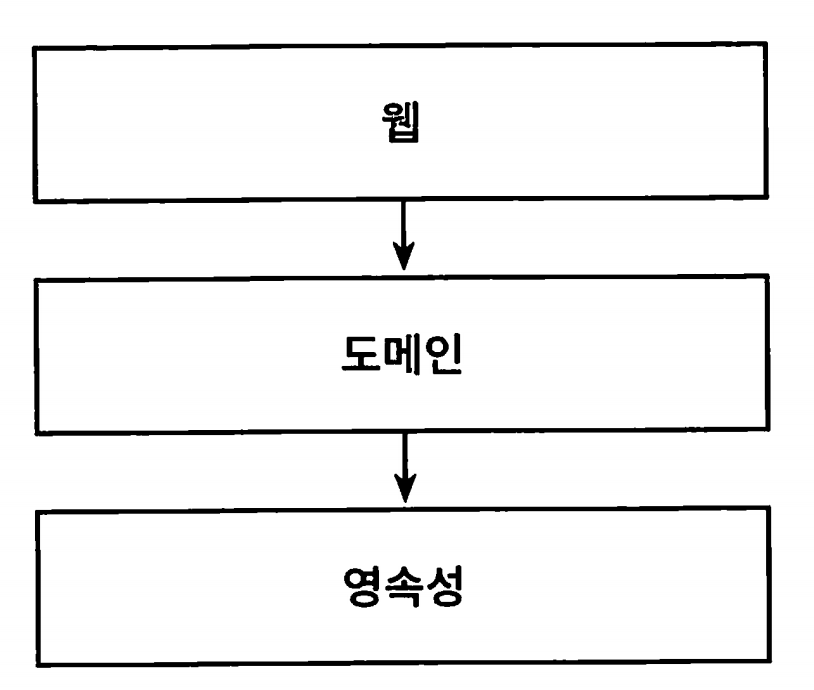
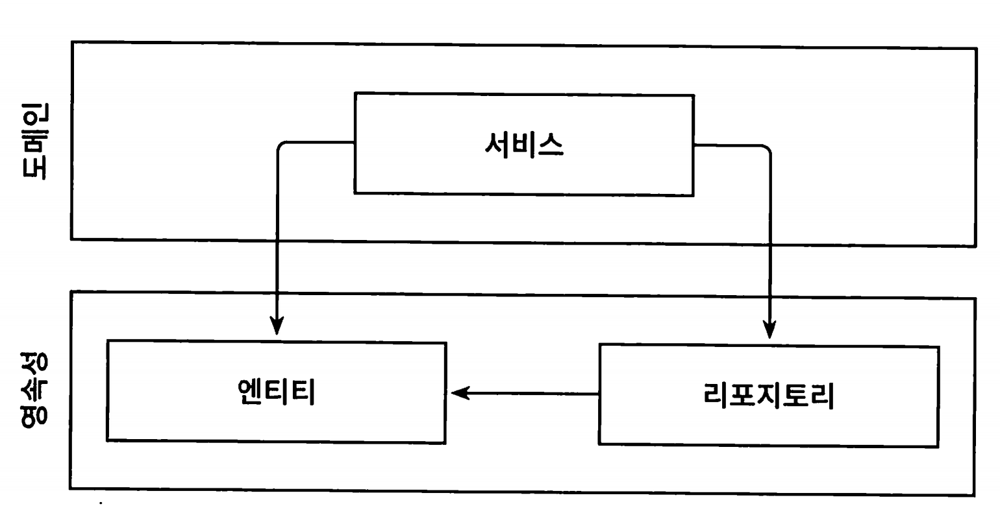
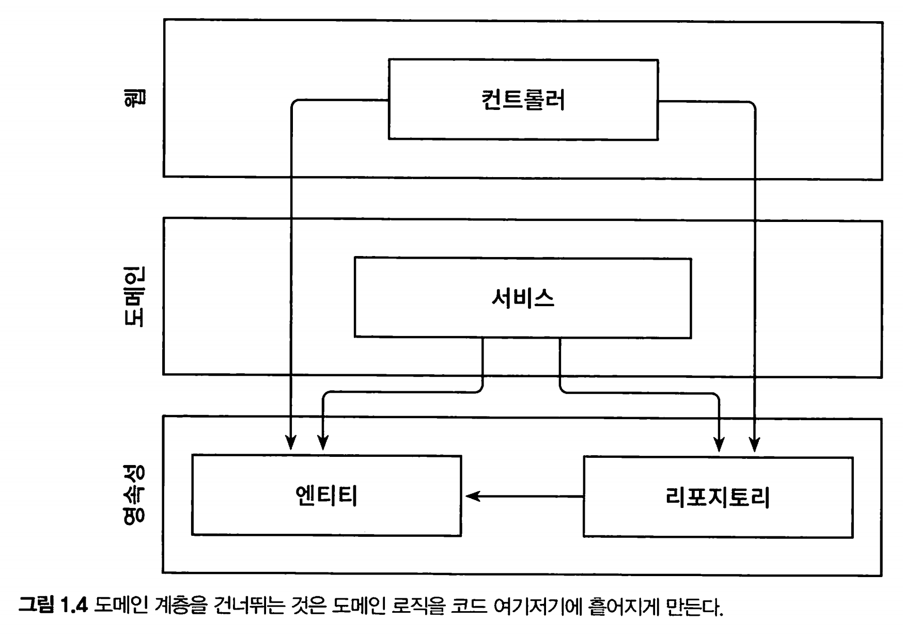
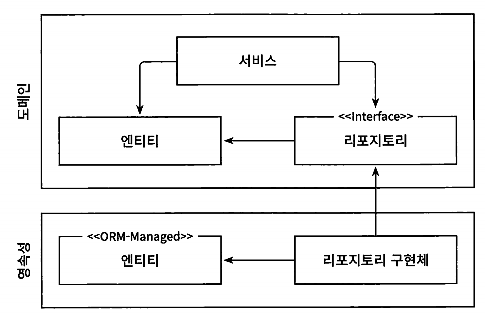
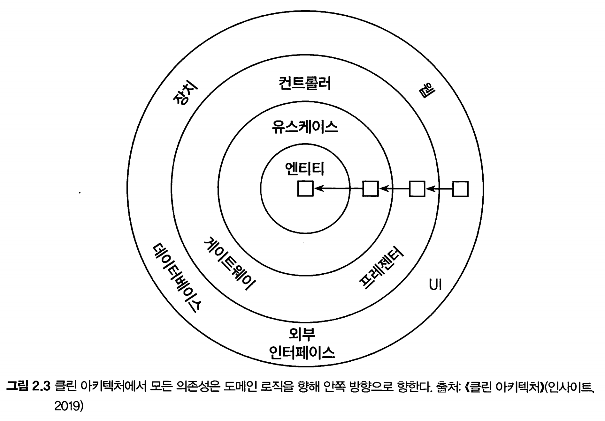
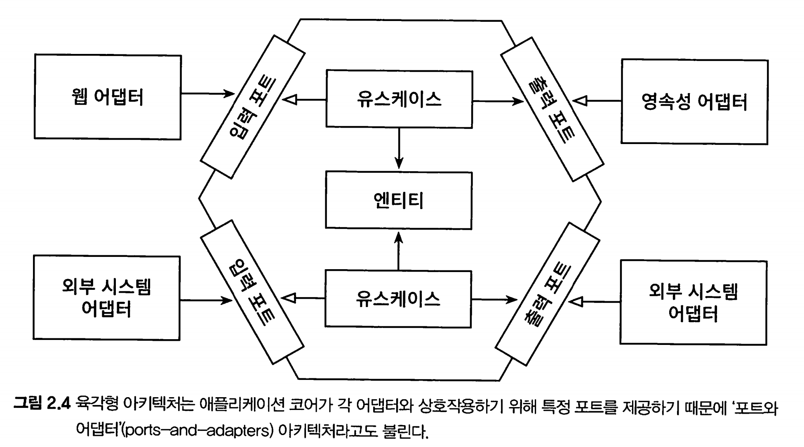

# 만들면서 배우는 클린 아키텍처

## Table of Contents

1. [계층형 아키텍처의 문제는 무엇일까?](#1-계층형-아키텍처의-문제는-무엇일까)
2. [의존성 역전하기](#2-의존성-역전하기)
3. [코드 구성하기](#3-코드-구성하기)
4. [유스케이스 구현하기](#4-유스케이스-구현하기)
5. [웹 어댑터 구현하기](#5-웹-어댑터-구현하기)
6. [영속성 어댑터 구현하기](#6-영속성-어댑터-구현하기)
7. [아키텍처 요소 테스트하기](#7-아키텍처-요소-테스트하기)
8. [경계 간 매핑하기](#8-경계-간-매핑하기)
9. [애플리케이션 조립하기](#9-애플리케이션-조립하기)
10. [아키텍처 경계 강제하기](#10-아키텍처-경계-강제하기)
11. [의식적으로 지름길 사용하기](#11-의식적으로-지름길-사용하기)

12. [아키텍처 스타일 결정하기](#12-아키텍처-스타일-결정하기)

* 계층형 아키텍처를 사용했을 때의 잠재적인 단점들을 파악할 수 있다.
* 아키텍처 경계를 강제하는 방법들을 적용할 수 있다.
* 잠재적인 지름길들이 소프트웨어 아키텍처에 어떻게 영향을 미칠 수 있는지 파악할 수 있다.
* 언제 어떤 스타일의 아키텍처를 사용할 것인지에 대해 논할 수 있다.

*  아키텍처에 따라 코드를 구성할 수 있다.

*  아키텍처의 각 요소들을 포함하는 다양한 종류의 테스트를 적용할 수 있다.

헥사고날 아키텍처에서는 사용자 인터페이스나 데이터베이스 모두 비즈니스 로직으로부터 분리돼야 하느 ㄴ외부 요소로 취급한다.

핵심은 의존성이 방향이 비즈니스 로직이 외부 요소에 의존하지 않고, 프레젠테이션 계층과 데이터 소스 계층이 도메인 계층에 의존하도록 만들어야 한다.

애플리케이션은 비즈니스 관심사를 다루는 내부(inside)와 기술적인 관심사를 다루는 외부(outside)로 분해되고,

외부에 포함된 기술적인 컴포넌트를 Adapter, adapter와 내부와 상호작용하는 접점을 포트(port) 라고 부른다.

# 1. 계층형 아키텍처의 문제는 무엇일까?

* 웹 계층, 도메인 계층, 영속성 계층으로 구성된 전통적인 웹 애플리케이션 구조

계층형 아키텍처의 문제점은 무엇일까?

## 계층형 아키텍처는 데이터베이스 주도 설계를 유도한다

계층형 아키텍처의 토대는 DB이다

웹 -> 도메인 -> 영속성 에 의존하기 때문이다

우리가 만드는 애플리케이션의 목적 : 비즈니스 규칙이나 정책을 반영한 모델을 만들어 사용자가 더욱 편리하게 활용할 수 있게 함.

상태(state)가 아니라 행동(behivior) 중심으로 모델링한다.

* 도메인 계층에서 데이터베이스 엔티티를 사용하는 것은 영속성 계층과의 강한 결합을 유발한다.

일반적으로 ORM에 의해 관리되는 엔티티들은 영속성 계층에 두며, 도메인 계층이 엔티티에 의존한다.

서비스는 영속성 모델을 비즈니스 모델처럼 사용하게 되고, 이로 인해 즉시로딩, 지연로딩, 트랜잭션 등 영속성 계층과 관련된 작업들을 해야만 한다.

때문에 영속성 코드가 도메인 코드에 녹아 들어가서 둘 중 하나만 바꾸는 것이 어려워진다.

## 테스트하기 어려워진다

엔티티의 필드를 단 하나만 조작하면 되는 경우에 웹 계층에서 바로 영속성 계층에 접근하면 무슨 일이 일어날까.

1.  단 하나만 조작하더라도 도메인 로직을 웹 계층에 구현하게 되버린다. 유스케이스가 확장되면 점점 더 웹 계층에 추가될것이다
2. 웹 계층 테스트에서 도메인 계층 뿐만이 아닌 영속성 계층도 Mocking 해야 하며 단위 테스트의 복잡도가 올라간다.

어느순간, 웹의 규모가 커지면 어느 순간에는 테스트 코드를 작성하는 것보다 Mock을 만드는 데 더 많은 시간이 걸리게 된다.

## 유스케이스를 숨긴다

개발자들은 새로운 유스케이스를 구현하는 새로운 코드를 짜는 것을 선호한다.

그러나 실제로는 새 코드를 짜는 데 시간을 쓰기보다는 기존 코드를 바꾸는데 더 많은 시간을 쓴다.

기능을 변경할 적절한 위치를 찾는 일이 빈번하기 때문에 아키텍처는 코드를 빠르게 탐색하는데 도움이 돼야 한다.

계층형 아키텍처는 도메인 로직이 여러 계층에 걸쳐 흩어지기 쉽기 때문에 위치를 찾기 어렵다.

고도로 특화된 좁은 도메인 서비스가 유스케이스 하나씩만 담당하게 한다면 수월해진다.

UserService에서 사용자 등록 유즈 케이스를 찾는 대신, RegisterUserSerivce를 바로 열어 작업하는 것처럼 말이다.

## 동시 작업이 어려워진다

개발자 셋이 한명이 웹계층, 한명이 도메인, 나머지는 영속성 계층에 기능을 추가할 때 계층형 아키텍처는 이렇게 작업할 수 없다.

모든것이 영속성 계층 위에 만들어 지기 때문에 영속성 계층을 먼저 개발해야 한다.

병합 충돌도 고민해야 한다.

# 2. 의존성 역전하기

SOLID를 보자

## 단일 책임 원칙

>  하나의 컴포넌트는 오로지 한가지 일만 해야 하고 그것을 올바르게 수행해야 한다

실제 의도는?

컴포넌트를 변경하는 이유는 오직 하나뿐이여야 한다.

* 책임은 사실 '오로지 한가지 일만 하는것' 보다는 `'변경할 이유'`로 해석해야 한다

## 의존성 역전 원칙

> 코드상의 어떤 의존성이든 그 방향을 바꿀 수 (역전할 수) 있다.

도메인 코드와 영속성 코드 간의 의존성을 역전시켜서 영속성 코드가 도메인 코드에 의존하고, 도메인 코드를 `변경할 이유`의 수를 줄여보자

도메인 계층에 레포지토리에 대한 인터페이스를 만들고, 실제 레포지토리는 영속성 계층에서 구현하게 해보자

## 클린 아키텍처

로버트 C 마틴은 클린 아키텍처에서는 설계가 

* 비즈니스 규칙의 테스트를 용이하게 하고, 
* 비즈니스 규칙은 프레임워크, 데이터베이스, UI기술, 그 밖의 외부 애플리케이션이나 인터페이스로부터 독립적일 수 있다고 이야기 했다.

이는 도메인 코드가 바깥의 어떤 의존성도 없어야 함을 의미한다.

* 의존 역전 원칙의 도움으로 모든 의존성이 도메인 코드를 향하고 있다.

이 아키텍처의 코어에는 주변 유스케이스(서비스)에서 접근하는 도메인 엔티티들이 있다.

단일 책임을 갖기 위해 유스케이스는 더 세분화 되어 있다.

영속성 계층에서 ORM을 사용한다고 가정해보자

* 도메인 계층은 영속성 계층을 모르기 때문에 도메인 계층에서 사용한 엔티티 클래스를 영속성 계층에서 함께 사용할 수 없고, 두 계층에서 각각 엔티티를 만들어야 한다.
* 즉 도메인 계층과 영속성 계층이 데이터를 주고받을 때 두 엔티티를 서로 변환해야 한다.
* 이는 도메인 계층과 다른 계층들 사이에서도 마찬가지다

이것이 바로 도메인 코드를 프레임워크에 특화된 문제로부터 해방시키고자 했던, 결합이 제거된 상태이다.

## 육각형 아키텍처 (헥사고날 아키텍처)

육각형 안에는 도메인 엔티티와 상호작용하는 유스케이스가 있다.

육각형에서 외부로 향하는 의존성이 없기 때문에 클린 아키텍처에서 제시한 의존성 규칙이 그대로 내부로 향한다.

바깥에는 애플리케이션과 상호작용하는 다양한 adpator들이 있다.

왼쪽에 있는 어뎁터(웹, 외부시스템)는 애플리케이션을 주도하는 어뎁터이다.

오른쪽에 있는 어뎁터는 애플리케이션에 의해 주도되는 어뎁터들이다.

주도하는 어뎁터(driving adaptor)에게는 포트가 코어에 있는 유즈케이스에 의해 구현되고, 

주도되는 어뎁터(driven adatper)에게는 포트가 어뎁터에 의해 구현되고 코어에 의해 호출된다. 

# 3. 코드 구성하기

# 4. 유스케이스 구현하기

# 5. 웹 어댑터 구현하기

# 6. 영속성 어댑터 구현하기

# 7. 아키텍처 요소 테스트하기

# 8. 경계 간 매핑하기

# 9. 애플리케이션 조립하기

# 10. 아키텍처 경계 강제하기

# 11. 의식적으로 지름길 사용하기

# 12. 아키텍처 스타일 결정하기
