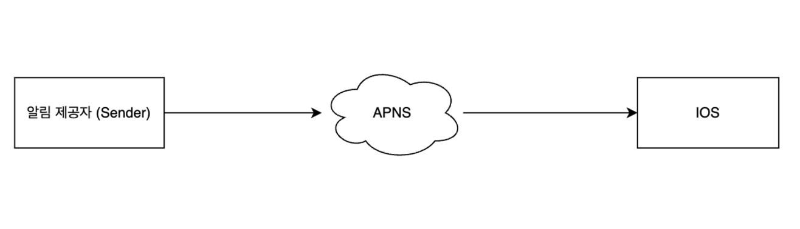
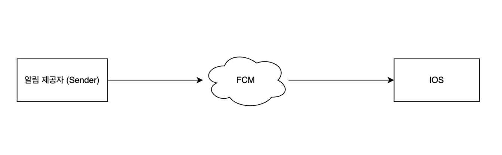
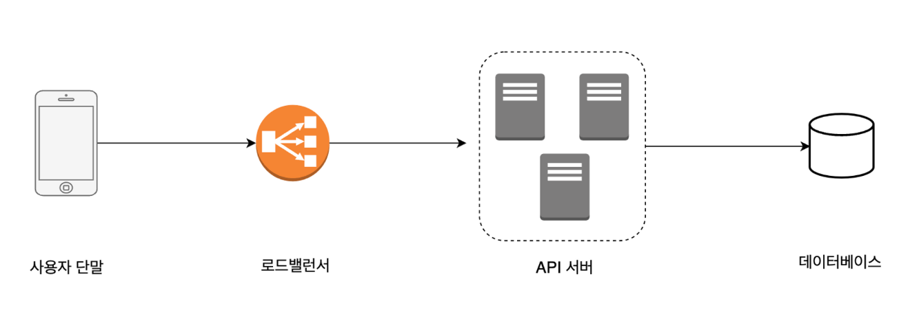
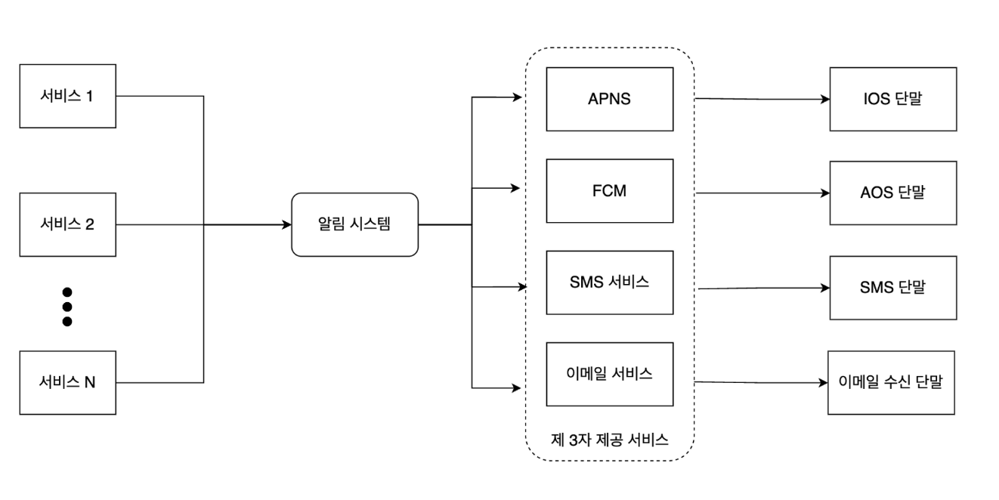
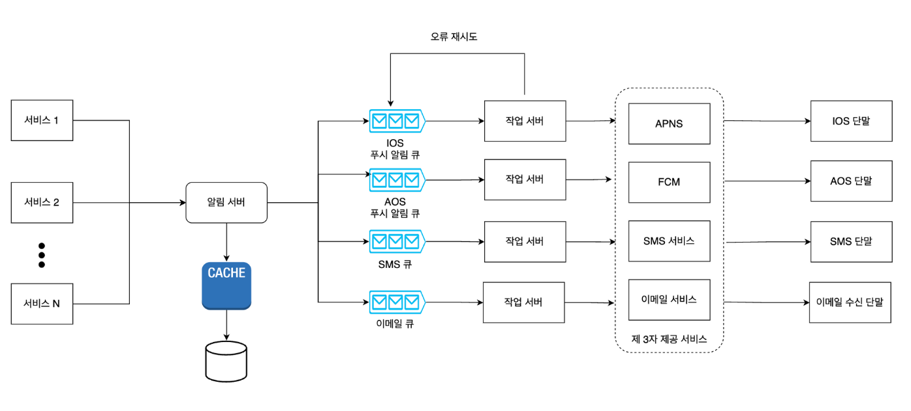
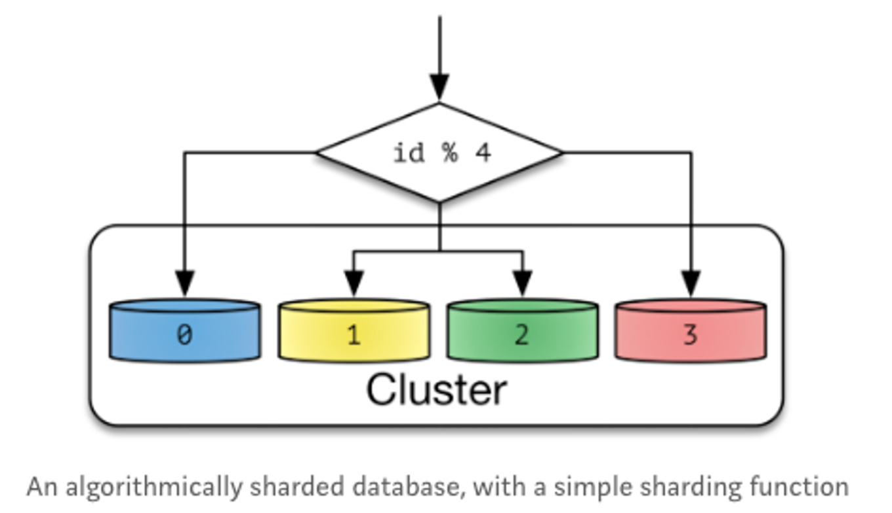
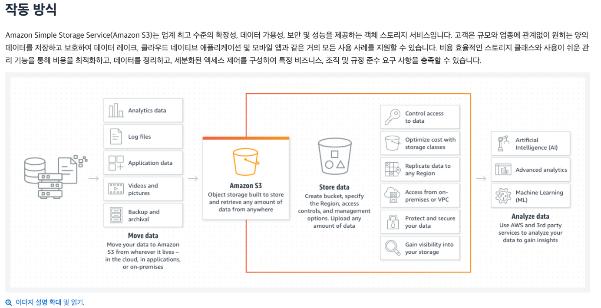
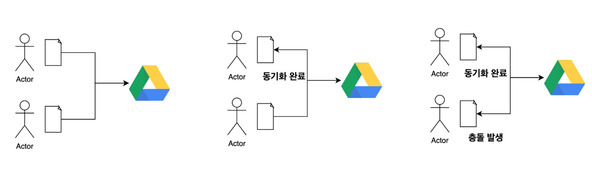
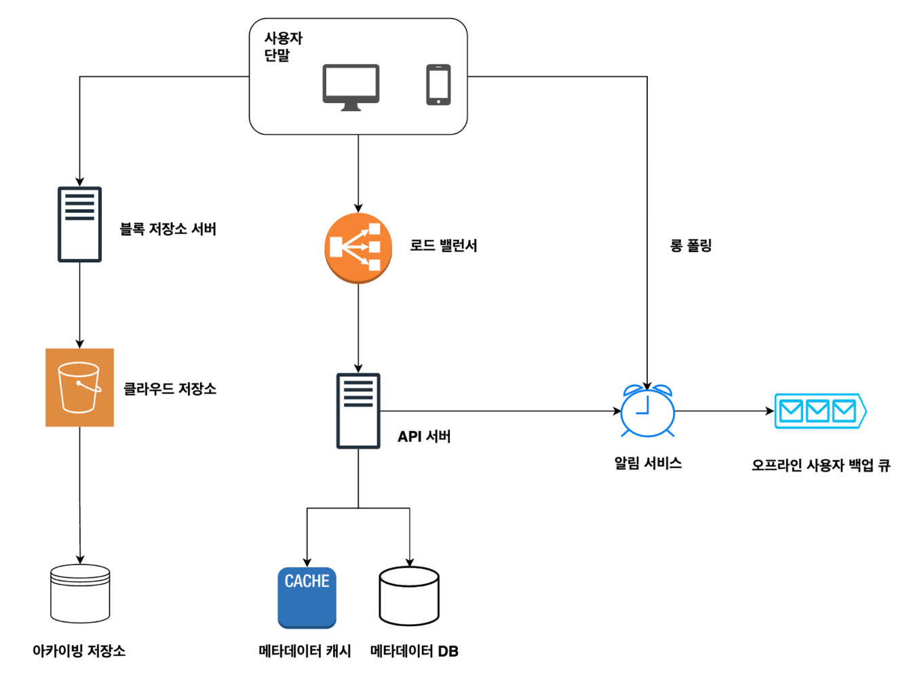
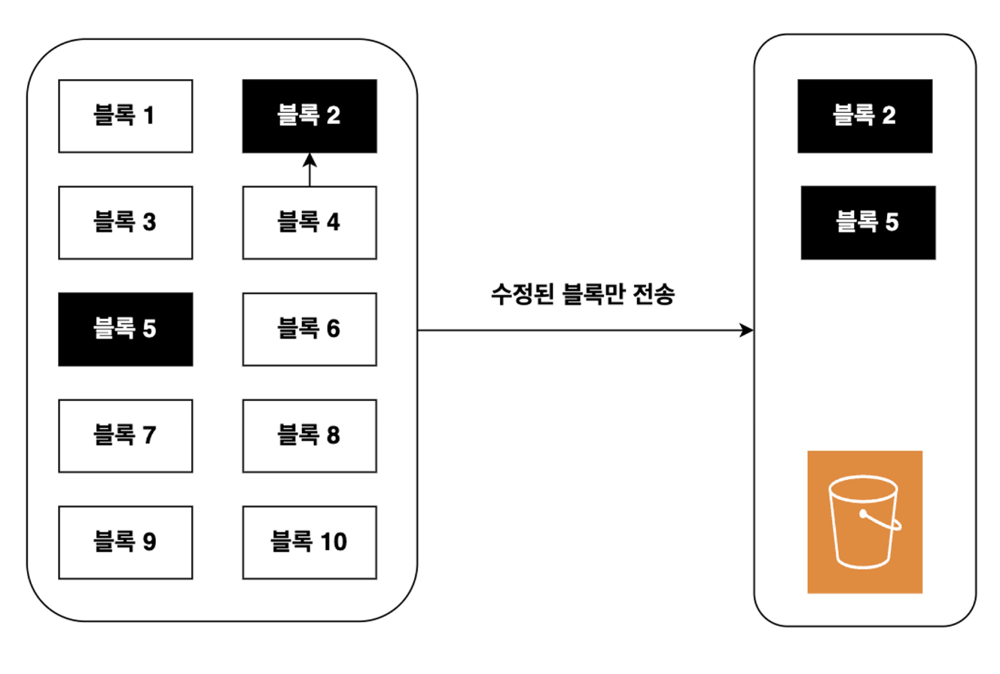

# **앞에서 배운 내용을 예제에 적용하자**

## **1) 알림 시스템 설계**

### **1.1 개요**

알림 시스템은 많은 서비스에서 최신 뉴스, 제품 업데이트, 이벤트 등 비즈니스적으로 중요한 내용들을 비동기적으로 제공한다. 이 시스템은 모바일 푸쉬 알림, SMS 메시지 그리고 이메일 세 가지로 분류할 수 있다.

### **1.2 대략적 설계**

### **(1) IOS**

- 알림 제공자(provider): 알림 요청을 만들어 애플 푸시 알림 서비스로 보내주는 주체. 알림 요청을 보내려면 device token, payload 데이터가 필요하다.
- 알림 서비스(APNS): 애플에서 제공하는 원격 서비스다. 푸시 알림을 iOS 장치로 보내는 역할을 담당한다

### **(2) AOS**

- 안드로이드 푸시 알림도 APNS 대신 FCM을 사용한다는 점만 다르다.

### **(3) 이메일, SMS 메시지**

위와 동일하다

### **(4) 연락처 정보 수집 절차**

- 알림을 보내려면 모바일 단말 토큰, 전화번호, 이메일 주소 등의 정보가 필요하다.
- 즉, 앱을 설치한 후에 처음 계정에 가입할 때 해당 사용자의 정보를 데이터베이스에 저장한다.

### **(5) [초안] 개략적 설계**

N 개의 서비스

- 이 서비스 각각은 마이크로서비스일수도 있고, 크론잡일 수도 있고, 분산 시스템 컴포넌트일 수도 있다.

알림 시스템

- 알림 시스템은 알림 전송/수신 처리의 핵심이다.
- 시스템은 서비스 1~N에 알림 전송을 위한 API를 제공해야 하고, 제 3자 서비스에 전달할 알림 페이로드를 만들어 낼 수 있어야 한다.

제 3자 서비스 (third party services)

- 이 서비스들은 사용자에게 알림을 실제로 전달하는 역할을 한다.
- 해당 서비스는 확장성이 중요하다. 쉽게 새로운 서비스를 통합하거나 기존 서비스를 제거할 수 있어야 한다는 뜻이다.

[문제점]

SPOF (Single Point Of Faliure)

- 알림 서비스에 서버가 하나밖에 없다는 것은, 그 서버에 장애가 생기면 전체 서비스의 장애로 이어진다.

규모 확장성

- 한 대 서비스로 푸시 알림에 관계된 모든 것을 처리하므로, 데이터베이스나 캐시 등 중요 컴포넌트의 규모를 개별적으로 늘리기 어렵다.

### **(6) [최종] 개략적 설계**

- 데이터베이스와 캐시를 알림 시스템의 주 서버에서 분리한다.
- 알림 서버를 증설하고 자동으로 수평적 규모 확장이 이루어질 수 있도록 한다.
- 메세지 큐를 이용해 시스템 컴포넌트 사이의 강한 결합을 끊는다.

## **2) 구글 드라이브 설계**

### **2.1 요구 사항**

- (1) 파일 추가
- (2) 파일 다운로드
- (3) 여러 단말에 파일 동기화
- (4) 파일 갱신 이력 조회
- (5) 파일 공유
- (6) 파일 편집 & 삭제 알림 표시

### **2.2 구현해야 할 API**

(1) 파일 업로드 API

- 단순 업로드: 파일 크기가 작을 때 사용한다.
- 이어 올리기: 파일 크기가 크거나 네트워크 단절이 생길 경우 사용한다.

(2) 파일 다운로드 API

- ex) POST https://api.example.com/files/download --data '{"path" : "/recipes/soup/best_soup.txt"}'

### **2.3 한 대 서버 제약 극복**

만약 파일시스템 여유 공간이 없다면 ?? -> 데이터를 샤딩하여 여러 서버에 나누어 저장할 수 있다.

하지만, 여유 공간이 없을 때마다 매번 샤딩을 하는 것은 번거로운 작업이다.

이럴땐 이미 알려진 서비스를 사용하는 것도 좋은 방법이다.

아마존 S3 를 사용하면 업계 최고 수준의 규모 확장성, 가용성, 보안 성능을 모두 제공받을 수 있다.

### **2.4 좀 더 고민할 수 있는 부분들**

### **(1) 로드밸런서**

- 네트워크 트래픽을 분산하기 위해 사용한다.
- 로드밸런서는 트래픽을 고르게 분산할 뿐 아니라 장애가 발생하면 자동으로 해당 서버를 우회해준다.

### **(2) 웹 서버**

- 로드밸런서를 추가하고 나면 더 많은 웹서버를 쉽게 추가할 수 있다.
- 따라서 트래픽이 증가해도 쉽게 대응이 가능하다.

### **(3) 메타데이터 데이터베이스**

- 데이터베이스 파일 저장 서버에서 분리하여 SPOF(single point of failure) 를 회피한다.
- 사용자 이름, 파일 이름, 업로드 날짜

### **(4) 파일 저장소**

- S3 파일 저장소로 사용하고 가용성과 데이터 무손실을 보장하기 위해 두 개 이상의 지역에 데이터를 다중화한다.

### **2.5 동기화 충돌**

### **두 명 이상의 사용자가 같은 파일이나 폴더를 동시에 업데이트 ??**

- 버전으로 해결한다.
- 먼저 처리되는 변경은 성공한 것으로 보고, 나중에 처리되는 변경은 충돌이 발생한 것으로 표시한다.
- 즉, 두 가지 버전 중 합칠지 아니면 대체할지 결정한다.

### **2.5 개략적 설계안**

### **(1) 사용자 단말**

- 사용자가 이용하는 웹브라우저, 모바일 앱 등의 클라이언트

### **(2) 블록 저장소 서버**

- 파일 블록을 클라우드 저장소에 업로드하는 서버, 클라우드 환경에서 데이터 파일을 저장하는 기술이다.
- 이 저장소는 파일을 여러개의 블록으로 나눠 저장하며, 각 블록에는 고유한 해시값이 할당된다.
- 이 해시값은 메타데이터 데이터베이스에 저장된다.
- 각 블록은 독립적인 객체로 취급되며, 클라우드 저장소 시스템에 보관된다.
- 파일을 재구성하려면 블록들은 원래 순서대로 합쳐야한다.

### **(3) 클라우드 저장소**

- 파일은 블록 단위로 나눠져 클라우드 저장소에 보관된다.

### **(4) 아카이빙 저장소**

- 오랫동안 사용되지 않은 비활성 데이터를 저장하기 위한 시스템

### **(5) 로드밸런서**

- 요청을 모든 API 서버에 고르게 분산한다.

### **(6) API 서버**

- 사용자 인증, 사용자 프로파일 관리, 파일 메타데이터 갱신 등을 한다.

### **(7) 메타데이터 데이터베이스**

- 사용자, 파일, 블록, 버젼 등의 메타데이터 정보를 관리
- 실제 파일은 클라우드에 보관하며, 이 데이터베이스는 오직 메타 데이터만 저장한다.

### **(8) 메타데이터 캐시**

- 성능을 높히기 위해 자주 쓰이는 메타데이터는 캐시한다.

### **(9) 알림 서비스**

- 특정 이벤트가 발생했음을 클라이언트에게 알리는데 쓰이는 시스템이다.
- 예를 들어 클라이언트에게 파일이 추가되거나, 편집 삭제되었음을 알린다.

### **(10) 오프라인 사용자 백업 큐**

- 클라이언트가 접속 중이 아니라서 파일의 최신 상태를 확인할 수 없을 때, 해당 정보를 이 큐에 두어 나중에 클라이언트가 접속했을 때 동기화될 수 있도록 한다.

### **2.6 블록 저장소 서버**

정기적으로 갱신되는 큰 파일들은 업데이트가 일어날 때마다 전체 파일을 서버로 보내면 네트워크 대역폭을 많이 잡아먹는다.

이를 최적화하는 방법은 아래 두가지 정도 있다.

- 델타 동기화: 파일이 수정되면 전체 파일 대신 수정이 일어난 블록만 동기화한다.
- 압축: 블록 단위로 압축하여 데이터 사이즈를 줄인다.

델타 동기화는 아래 그림처럼 갱싱된 부분 (2,5번) 만 클라우드 저장소에 업로드하면 된다.

### **2.7 알림 서비스**

### **(1) 알림 서비스 ??**

- 이벤트 데이터를 클라이언트들로 보내는 서비스
- 알림 서비스 구현으로 아래 두 가지 선택지가 있음
- 책에서는 롤 폴링 채택, 양방향 통신은 필요가 없기 때문에

### **(2) 롱 폴링 (long polling)**

- 드롭박스가 채택하는 방식
- 각 클라이언트는 알림 서버와 롱 폴링용 연결을 유지
- 특정 파일에 대한 변경 감지 -> connection 끊음
- 이때 클라이언트는 반드시 메타데이터 서버와 연결해 파일의 최신 내역을 다운로드 한다.
- 다운로드 작업이 끝나거나 timeout 시간이 되면 새 요청을 보내어 롱 폴링 연결을 복원 및 유지

### **(2) 웹 소켓**

- 클라이언트 <--> 서버, 클라이언트와 서버 사이에 지속적인 통신 채널을 제공
- 주식 거래 ? 코인 거래 ? —> 차트 보면 실시간으로 데이터 주고 받죠

### **2.8 저장소 공간 절약**

### **(1) 중복 제거**

- 두 블록이 같은 블록인지 해시 값을 비교하여 판단한다
- 예시) MD5 와 같은 해시 함수 사용 해서 해시 값 비교

### **(2) 지능적 백업 전략 도입**

- 파일 버전 개수에 상한을 둔다. -> 상한에 도달하면 제일 오래된 버전은 버린다.
- 중요한 버전만 보관한다. -> 자주 수정되는 파일은 불필요한 버전을 많이 생성한다.

### **(3) 자주 쓰이지 않는 데이터는 아카이빙 저장소로 옮긴다.**

- 아마존 S3 글래시어같은 아카이빙 저장소를 사용한다.

# → 주제: **내가 신입 때 공부 했던 주제**

→ (1) 스프링 공식 문서 (다른 프레임워크 장고, 레일즈 기타 등등)

→ (2) 이펙티브 자바 (다른 언어도 비슷한 책) + 객체 지향도 병행하면 좋음

→ (3) SQL 튜닝 공부 → Real MySQL 병행

→ (4) 만들면서 배우는 클린아키텍처

→ (5) 가상면접사례 대규모 시스템 설계

→ (6) 데이터 중심 애플리케이션 설계

30개월 정도 개발 한 것 같고

24개월 되기 전까지 1~5까지는 다 본 것 같아요

면접 대비용으로 아래 책으로 스터디 했었는데 좋았어요

