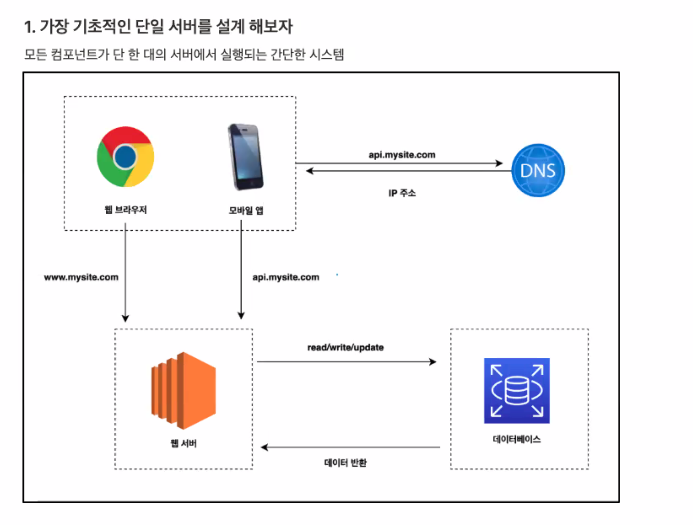
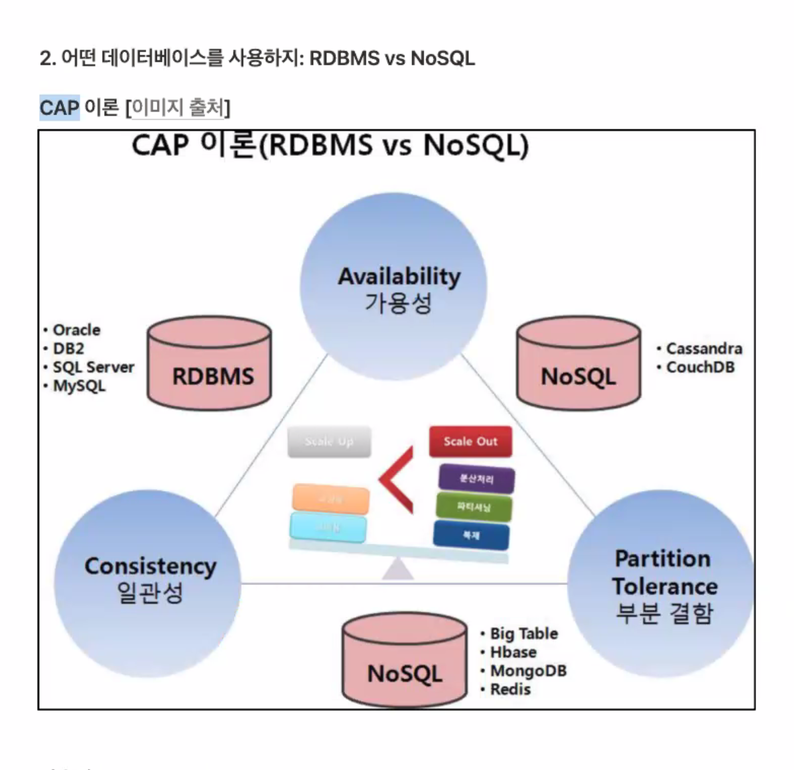

* https://www.wanted.co.kr/events/pre_challenge_be_9

# Week 1-1 - 기술 면접에서 시스템 설계 문제가 가지는 의미

1. 시스템 설계 문제란

   

##  1. 무엇을 원하는 가?

- 기술 면접에서 구직자에게 어떻게 주어진 문제를 해결할 것인지 문제 해결 능력을 파악하는 과정이다.
- 문제의 정답은 없고 단지 설계 기술을 면접관들에게 보여주는 자리이다.
- 지원자가 협력에 적함한 사람인지, 압박이 심한 상황에도 잘 헤쳐 나갈 자질이 있는지 등을 파악할 수 있는 항목이다.

1-2) 피해야할 것 ??

- 설계의 순수성에 집착한 나머지 타협적 결정을 도외시하고 오버 엔지니어링을 하는 엔지니어링들이 협업에도 많다.
- 오버 엔지니어링의 결과로 시스템 전반의 비용이 올라간다. 해당 비용에는 인프라 비용과 개발자 인력에 비용 모두 포함이 된다.

>  이직 사유 팁 - 사용자 수에 따른 아키텍처 설계를 해보고 싶었다.

## 2. 효과적 면접을 위한 4단계 접근법

### 1단계: 문제 이해 및 설계 범위 확정

* 바로 답부터 들이밀지 말자.

- 깊이 생각하고 질문하여 요구사항과 가정들을 분명히 하자.
- 가장 중요한 기술 중 하나는 올바른 질문을 하는 것. 적절한 가정을 하는 것. 그리고 시스템 구축에 필요한 정보 를 모으는 것.
- 이 단계에서는 요구사항을 이해하고 모호함을 없애는 게 이 단계에서 가장 중요하다.

Ex) 뉴스피드 시스템 설계

- 질문
- 가장 중요한 기능이 무엇인가?
- 뉴스피드의 정렬상태는 어떻게 되야하는가?
- 최대 사용자? 친구상태?
- 트래픽 규모?
- 피드에 이미지 또는 영상의 유무?

### 2단계: 개략적인 설계안 제시 및 동의 구하기

- 개략적인 설계안을 제시하고, 면접관의 동의를 얻는 것
- 최초 설계안이 시스템 규모에 관계된 제약사항들을 만족하는지 개략적으로 계산해보자.
- 추가로 시스템의 구체적 사용 사례도 몇 가지 살펴보자, Edge case 를 발견하는 데도 도움이 될 수 있다.

### 3단계: 상세 설계

- 대부분의 경우, 면접관은 여러분의 특정 시스템 컴포넌트들의 세부사항을 깊이 있게 설명하는 것을 보길 원한 다.
- 예를들어
- 단축 URL 생성기 설계 -> 해시 함수 설계를 어떻게 하였는가?
- 채팅 시스템 -> 어떻게 지연시간을 줄였는가? 사용자의 온/오프라인 상태를 어떻게 확인하는가?

### 4단계: 마무리

- 시스템에 개선할 점은 언제나 있기 마련이다. 면접관이 개선 가능한 점을 찾아내라 주문한다면, 자신의 설계를 비판적 사고로 바라보자.
- 여러분이 만든 설계를 한번 다시 요약해주는 것도 좋다.
- 오류(서버오류/네트워크 장애 등)가 발생하면 무슨 일이 생기는지 생각해보자.
- 미래에 닥칠 규모 확장 요구에 어떻게 대처할 것인지 생각해보자.

### 해야 할 것

- 질문을 통해 확인하라, 스스로 내린 가정이 옳다 믿고 진행하지 말아라
- 문제의 요구사항을 최대한 이해하라 (사용자 수)
- 면접관이 여러분의 사고 흐름을 이해할 수 있도록 하라. 즉 소통이 중요하다.
- 소통을 통해 면접관과 함께 좋은 아이디어를 도출하라.

### 하지 말아야 하는 것

- 전형적인 면접 문제들에도 대비하지 않고 면접장에 가지말자.
- 요구사항/가정이 분명하지 않은 상태에서 설계를 하지말자.
- 힌트를 청하길 주저하지 말자. 면접관과 소통해나가며 풀어나가자. 침묵 속 설계를 진행하지 말자.
- 의견을 일찍, 그리고 자주 구하자. 면접이 끝나기 전까지.

## 3. 어떻게 준비할 것인가?

다음과 같은 책등으로 알아보자

* 데이터 중심 애플리케이션 설계
* 대규모 시스템 설계 기초
* 마이크로 서비스 패턴(크리스 리처드슨)

###  가장 기초적인 단일 설계 서버

### 어떤 데이터 베이스를 사용할까 : RDBMS vs NoSQL

* 가용성 : 모든 노드가 모든 요청에 대하여 정상적인 응답을 한다

* 일관성 (Consistecy) : 모든 노드가 동일한 데이터를 가지고 있어야한다.

* 부분결함 (Partition Tolerance)

* (1) The system continues to operate despite arbitrary message loss or failure of part of the systen [Bremer의 발표 자료]
* [(2) The network will be allowed to lose arbitrarily many messages sent from one node to another

[Gilbert & Lych 정리]

= 가용성과 일관성은 분산시스템의 특성이지만 부분결함은 네트워크의 특성

= 하지만 CAP 이론은 세가지 요소가 모두 분산시스템의 특성인 것 처럼 서술한다.

* http://eincs.com/2013/07/misleading-and-truth-of-cap-theorem/

RDBMS: 관계형 데이터 베이스

* MysQL, Oracle DB, PostgresQL 등이 있다.

*  관계형 데이터베이스는 자료를 테이블과 열, 컬럼으로 표현한다.

*  Join 을 하여 여러 관계를 합칠 수 있다.

NoSQL :  비 관계형 데이터 베이스

- MongoDB, DynamoDB, Cassandra 등이 있다.
- 키값 저장소, 그래프 저장소, 칼럼 저장소, 문서 저장소 등으로 구분할 수 있다.
- Join 연산은 지원하지 않는다.

\+ 개념

https://www.vinsguru.com/cqrs-pattern/

### 수평적 확장 vs 수직적 확장

- 수평적 확장: 더 많은 서버를 !!
- 수직적 확장: 더 고사양으로 !!

수직적 확장의 단점

- 한 대의 서버에 CPU, Memory 를 무한대로 증설할 방법은 없다.
- 비용이 선형적인 추세보다 훨씬 빠르게 증가한다.
- (고사양의 )두배 이상의 CPU, Memory 를 갖춘 시스템은 두배 이상의 비용이 들지만, 두배 이상의 부하를 처 리할 수 있는 것은 아니다.

### 아하! 모먼트

첫 회사를 고르는 기준

-> 키워드 : 처우, 성장, 워라벨

* cto 면접시, 아키텍처 설계, 코드 배포, 자바 버전, 코드리뷰, 스프링부트 버전, 성장에 대한 말을 돌려 이야기한다.

* 신규 사업, 비즈니스, 

# Week 1-2 사용자 수에 따른 규모를 확장하는 방법 - 1 편

# week 2-1) 사용자 수에 따른 규모를 확장하는 방법 - 2 편

# Week2- 2) 앞에서 배운 내용을 예제에 적용하는 방법