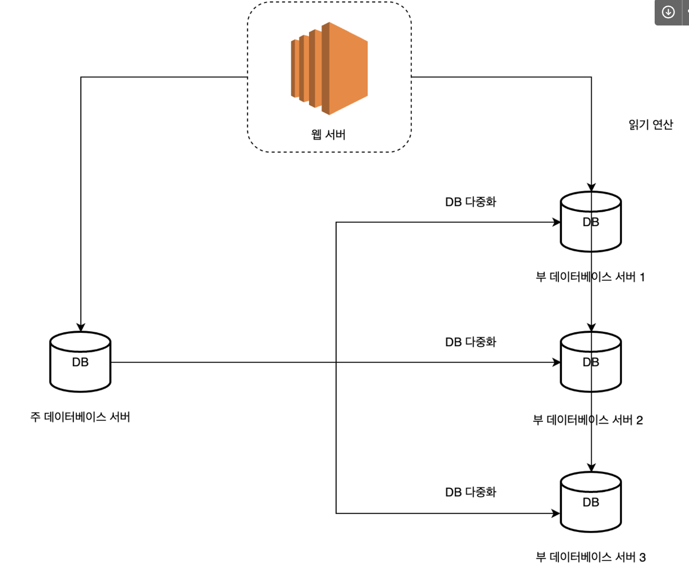
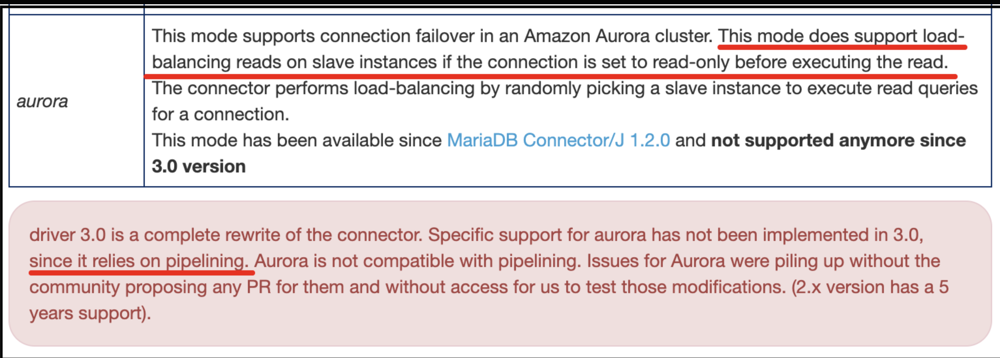
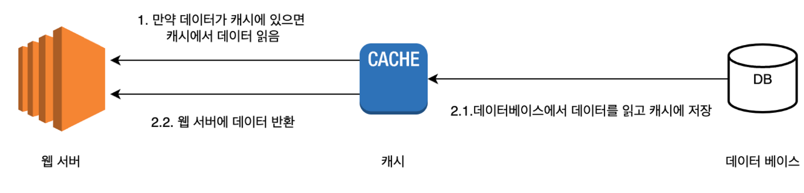
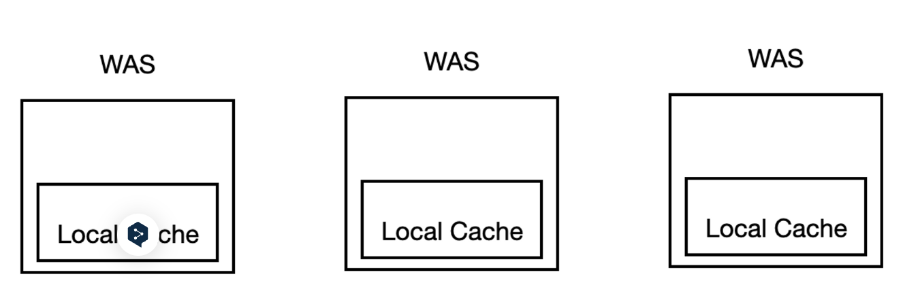
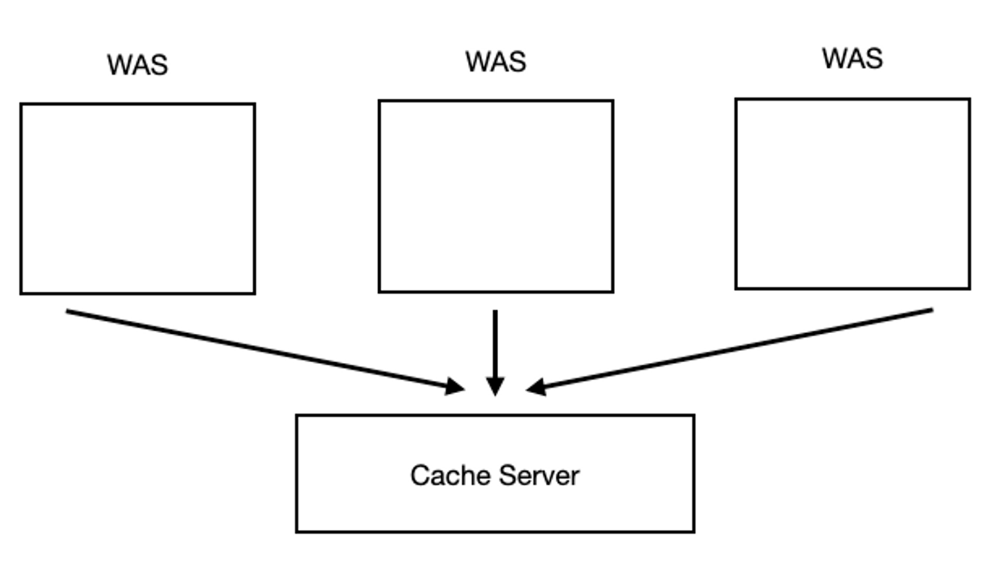
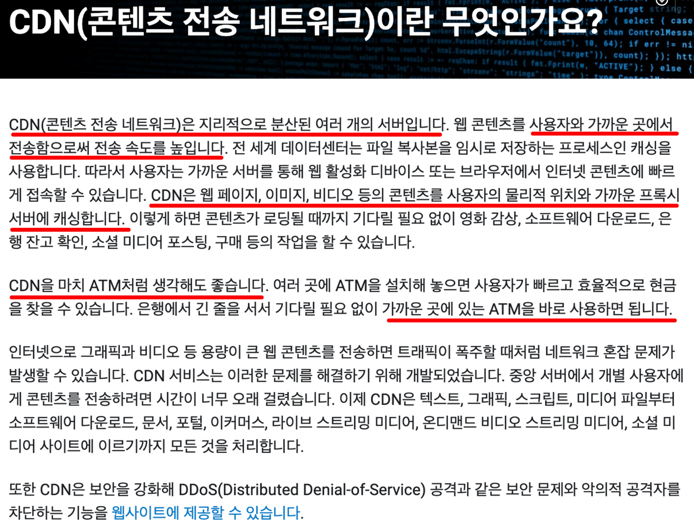
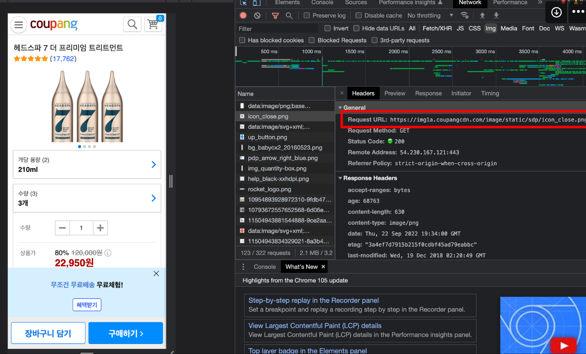
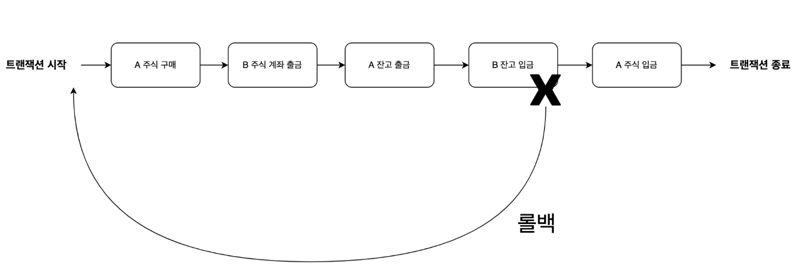
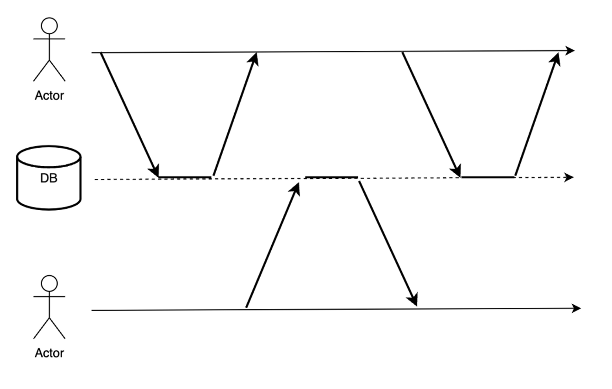

* https://www.wanted.co.kr/events/pre_challenge_be_9

* https://lean-mahogany-686.notion.site/07-08-11-00-8ae523170a0140ff8ad21087d7f2af6b

# Week 1-1 - 기술 면접에서 시스템 설계 문제가 가지는 의미

1. 시스템 설계 문제란

   


##  1. 무엇을 원하는 가?

- 기술 면접에서 구직자에게 어떻게 주어진 문제를 해결할 것인지 문제 해결 능력을 파악하는 과정이다.
- 문제의 정답은 없고 단지 설계 기술을 면접관들에게 보여주는 자리이다.
- 지원자가 협력에 적함한 사람인지, 압박이 심한 상황에도 잘 헤쳐 나갈 자질이 있는지 등을 파악할 수 있는 항목이다.

1-2) 피해야할 것 ??

- 설계의 순수성에 집착한 나머지 타협적 결정을 도외시하고 오버 엔지니어링을 하는 엔지니어링들이 협업에도 많다.
- 오버 엔지니어링의 결과로 시스템 전반의 비용이 올라간다. 해당 비용에는 인프라 비용과 개발자 인력에 비용 모두 포함이 된다.


>  이직 사유 팁 - 사용자 수에 따른 아키텍처 설계를 해보고 싶었다.

## 2. 효과적 면접을 위한 4단계 접근법

### 1단계: 문제 이해 및 설계 범위 확정

* 바로 답부터 들이밀지 말자.

- 깊이 생각하고 질문하여 요구사항과 가정들을 분명히 하자.
- 가장 중요한 기술 중 하나는 올바른 질문을 하는 것. 적절한 가정을 하는 것. 그리고 시스템 구축에 필요한 정보 를 모으는 것.
- 이 단계에서는 요구사항을 이해하고 모호함을 없애는 게 이 단계에서 가장 중요하다.

Ex) 뉴스피드 시스템 설계

- 질문
- 가장 중요한 기능이 무엇인가?
- 뉴스피드의 정렬상태는 어떻게 되야하는가?
- 최대 사용자? 친구상태?
- 트래픽 규모?
- 피드에 이미지 또는 영상의 유무?

### 2단계: 개략적인 설계안 제시 및 동의 구하기

- 개략적인 설계안을 제시하고, 면접관의 동의를 얻는 것
- 최초 설계안이 시스템 규모에 관계된 제약사항들을 만족하는지 개략적으로 계산해보자.
- 추가로 시스템의 구체적 사용 사례도 몇 가지 살펴보자, Edge case 를 발견하는 데도 도움이 될 수 있다.

### 3단계: 상세 설계

- 대부분의 경우, 면접관은 여러분의 특정 시스템 컴포넌트들의 세부사항을 깊이 있게 설명하는 것을 보길 원한 다.
- 예를들어
- 단축 URL 생성기 설계 -> 해시 함수 설계를 어떻게 하였는가?
- 채팅 시스템 -> 어떻게 지연시간을 줄였는가? 사용자의 온/오프라인 상태를 어떻게 확인하는가?

### 4단계: 마무리

- 시스템에 개선할 점은 언제나 있기 마련이다. 면접관이 개선 가능한 점을 찾아내라 주문한다면, 자신의 설계를 비판적 사고로 바라보자.
- 여러분이 만든 설계를 한번 다시 요약해주는 것도 좋다.
- 오류(서버오류/네트워크 장애 등)가 발생하면 무슨 일이 생기는지 생각해보자.
- 미래에 닥칠 규모 확장 요구에 어떻게 대처할 것인지 생각해보자.


### 해야 할 것

- 질문을 통해 확인하라, 스스로 내린 가정이 옳다 믿고 진행하지 말아라
- 문제의 요구사항을 최대한 이해하라 (사용자 수)
- 면접관이 여러분의 사고 흐름을 이해할 수 있도록 하라. 즉 소통이 중요하다.
- 소통을 통해 면접관과 함께 좋은 아이디어를 도출하라.


### 하지 말아야 하는 것

- 전형적인 면접 문제들에도 대비하지 않고 면접장에 가지말자.
- 요구사항/가정이 분명하지 않은 상태에서 설계를 하지말자.
- 힌트를 청하길 주저하지 말자. 면접관과 소통해나가며 풀어나가자. 침묵 속 설계를 진행하지 말자.
- 의견을 일찍, 그리고 자주 구하자. 면접이 끝나기 전까지.


## 3. 어떻게 준비할 것인가?

다음과 같은 책등으로 알아보자

* 데이터 중심 애플리케이션 설계
* 대규모 시스템 설계 기초
* 마이크로 서비스 패턴(크리스 리처드슨)


###  가장 기초적인 단일 설계 서버


### 어떤 데이터 베이스를 사용할까 : RDBMS vs NoSQL


* 가용성 : 모든 노드가 모든 요청에 대하여 정상적인 응답을 한다

* 일관성 (Consistecy) : 모든 노드가 동일한 데이터를 가지고 있어야한다.


* 부분결함 (Partition Tolerance)

* (1) The system continues to operate despite arbitrary message loss or failure of part of the systen [Bremer의 발표 자료]
* [(2) The network will be allowed to lose arbitrarily many messages sent from one node to another


[Gilbert & Lych 정리]

= 가용성과 일관성은 분산시스템의 특성이지만 부분결함은 네트워크의 특성

= 하지만 CAP 이론은 세가지 요소가 모두 분산시스템의 특성인 것 처럼 서술한다.


* http://eincs.com/2013/07/misleading-and-truth-of-cap-theorem/

RDBMS: 관계형 데이터 베이스

* MysQL, Oracle DB, PostgresQL 등이 있다.

*  관계형 데이터베이스는 자료를 테이블과 열, 컬럼으로 표현한다.

*  Join 을 하여 여러 관계를 합칠 수 있다.


NoSQL :  비 관계형 데이터 베이스

- MongoDB, DynamoDB, Cassandra 등이 있다.
- 키값 저장소, 그래프 저장소, 칼럼 저장소, 문서 저장소 등으로 구분할 수 있다.
- Join 연산은 지원하지 않는다.

\+ 개념

https://www.vinsguru.com/cqrs-pattern/


### 수평적 확장 vs 수직적 확장

- 수평적 확장: 더 많은 서버를 !!
- 수직적 확장: 더 고사양으로 !!

수직적 확장의 단점

- 한 대의 서버에 CPU, Memory 를 무한대로 증설할 방법은 없다.
- 비용이 선형적인 추세보다 훨씬 빠르게 증가한다.
- (고사양의 )두배 이상의 CPU, Memory 를 갖춘 시스템은 두배 이상의 비용이 들지만, 두배 이상의 부하를 처 리할 수 있는 것은 아니다.


### 아하! 모먼트

첫 회사를 고르는 기준

-> 키워드 : 처우, 성장, 워라벨

* cto 면접시, 아키텍처 설계, 코드 배포, 자바 버전, 코드리뷰, 스프링부트 버전, 성장에 대한 말을 돌려 이야기한다.

* 신규 사업, 비즈니스, 


# Week 1-2) 사용자 수에 따른 규모를 확장하는 방법 - 1 편

## 1. 데이터 베이스 다중화

### **1.1 목적**

대부분의 애플리케이션은 읽기 연산의 비중이 쓰기 연산보다 훨씬 높다.

따라서 더 나은 성능을 위하여 데이터 변경은 주 데이터 베이스로 읽기 연산은 부 데이터베이스 서버들로 분산한다.

### 1.2 개념



주 데이터베이스 (Master)

- 쓰기 연산 (INSERT, UPDATE, DELETE) 지원

부 데이터베이스 (Slave)

- 주 데이터베이스로 부터 사본을 전달 받는다.
- 읽기 연산 (SELECT) 지원

### **1.3 스프링에서는 어떻게 할까 ??**

하나의 데이터소스를 사용할 경우 아래와 같이 설정파일을 작성하면 스프링에서 자동으로 데이터소스를 생성한다.

```yml
spring:
  datasource:
    url: jdbc:mysql://127.0.0.1:3306/kotlin_spring?serverTimezone=UTC
    driver-class-name: com.mysql.cj.jdbc.Driver
    username: root
    password: 1234
```

하지만 두개 이상의 데이터소스를 사용하는 경우 스프링에서 자동으로 데이터소스를 생성하지 않기 때문에 아래와 같이 작성을 하면 추가적인 코드가 필요하다.

```yml
spring:
  datasource:
    master:
      hikari:
        driver-class-name: com.mysql.cj.jdbc.Driver
        jdbc-url: jdbc:mysql://127.0.0.1:3306/multiple-datesource?serverTimezone=UTC
        read-only: false
        username: root
        password: 1234

    slave:
      hikari:
        driver-class-name: com.mysql.cj.jdbc.Driver
        jdbc-url: jdbc:mysql://127.0.0.1:3306/multiple-datesource?serverTimezone=UTC
        read-only: true
        username: root
        password: 1234
```

간단하게 어떤 식으로 작성하는지 살펴보자.

우선 등록한 데이터소스에 대한 Bean 을 수동으로 등록을 해줘야한다.

```java
@Configuration
public class MasterDataSourceConfig {

    @Primary
    @Bean(name = "masterDataSource")
    @ConfigurationProperties(prefix="spring.datasource.master.hikari")
    public DataSource masterDataSource() {
        return DataSourceBuilder.create()
                .type(HikariDataSource.class)
                .build();
    }

}

@Configuration
public class SlaveDataSourceConfig {

    @Bean(name = "slaveDataSource")
    @ConfigurationProperties(prefix="spring.datasource.slave.hikari")
    public DataSource slaveDataSource() {
        return DataSourceBuilder.create()
                .type(HikariDataSource.class)
                .build();
    }

}
```

그 다음 스프링의 트랜잭션 readOnly 옵션에 따라 어떤 데이터 소스를 사용할지에 대한 분기 처리가 필요하다.

```java
public class ReplicationRoutingDataSource extends AbstractRoutingDataSource {

    @Override
    protected Object determineCurrentLookupKey() {
        DataSourceType dataSourceType = TransactionSynchronizationManager
          .isCurrentTransactionReadOnly() ? DataSourceType.Slave : DataSourceType.Master;
          
        return dataSourceType;
    }
}

public enum DataSourceType {
    Master, Slave
}
```


그 외 추가적인 설정이 필요하지만 어떤 식으로 코드로 작성하는지는 이 정도로 마무리 지으려고 한다.

좀 더 자세한 코드를 보고 싶다면 아래 문서를 참고하길 바란다.

- https://cheese10yun.github.io/spring-transaction/
- http://egloos.zum.com/kwon37xi/v/5364167

* http://webcache.googleusercontent.com/search?q=cache:Lw-c3SLW8LEJ:kwon37xi.egloos.com/5364167&cd=11&hl=ko&ct=clnk&gl=kr 
  * egloos가 서비스 종료햇으므로 이 링크 이용 

위 예제를 살펴보면, 설정할 코드들이 상당히 많은 것을 알 수 있다.

AWS Aurora MySQL 을 사용하면서 MariaDB Connector / J 를 사용한다면 위 예제와 같이 복잡한 코드를 작성할 필요가 없다.

아래와 같이 데이터소스를 마스터 하나만 등록을 하고 읽기 트랜잭션만 명시하면 자동으로 요청 분기가 처리된다.

```yml
spring:
  datasource:
    url: jdbc:aurora:mysql://127.0.0.1:3306/kotlin_spring?serverTimezone=UTC
    driver-class-name: com.mysql.cj.jdbc.Driver
    username: root
    password: 1234
```

* 단 최신 버전의 MariaDB Connector / J 에서는 지원하고 있지 않기 때문에 추후 다른 드라이버로 교체할 필요가 있다.


하지만 현재는 MariaDB Connector / J 말고는 대안이 없기 때문에 현업에서도 해당 드라이버로 사용하고 있다.



[AWS MySQL JDBC](https://github.com/awslabs/aws-mysql-jdbc) 가 있지만, 아직 개발은 되지 않았다.

### **1.4 Replica 관련 개념 잡기 좋은 영상**

우형 - [테코톡](https://www.youtube.com/watch?v=95bnLnIxyWI)


Proxy SQL도 알아보자. 


### 1.5 개발 후 테스트 시 개발 DB의 데이터의 수가 운영 DB의 데이터보다 훨씬 적어서 성능을 포함한 여러 측면에서 제대로 된 테스트를 하는법

1. 운영디비에서 덤프떠서 테스트나 개발용 디비에 집어넣는다.
2. 더미 데이터를 정말 많이 만든다. 


### 1.6 패키지

https://github.com/woowacourse-teams/2020-6rinkers

패키지 구조, 맵핑를 공부해보자


## 2) 캐시

### 2.1 캐시란 ?



값비싼 연산 결과 또는 자주 참조되는 데이터를 메모리 안에 두고 사용하도록 하는 저장소이다.

캐시의 장점은 데이터베이스에 직접 조회하는 것 보다 성능이 좋을 뿐만 아니라 데이터베이스 부하를 부하를 줄일 수 있다.


만약  공지사항과 같은 동일한 결과를 반본적으로 돌려주는 API 가 있다고 생각하자.

이 API는 요청을 받으면 매번 Controller --> Service --> Repository 를 거친다음 DB 조회 및 로직을 처리하는 과정을 반복적으로 진행한다.

즉, 동일한 결과를 보여주는 작업을 반복적으로 진행하기 때문에 비효율적이다.

위와 같은 상황에서 캐시를 사용한다면 첫 번째 요청 이후 부터는 캐시에 저장되어 있는 데이터를 바로 읽어서 전달하면 되기 때문에 시스템 부하를 줄일 수 있다.

### 2.2 로컬 캐시



### **장점**

- 네트워크 호출 x, 서버의 물리 메모리에 직접 접근하기 때문에 빠르다.

### **단점**

- 서버가 여러대인 경우 동기화 문제가 있다.
- 인스턴스 물리 메모리 사이즈 제약이 있다.

https://dev.gmarket.com/16

### 2.3 글로벌 캐시



### **장점**

- 서버 동기화를 걱정할 필요가 없다

### **단점**

- 네트워크 호출이 필요하다
- 상대적으로 로컬 캐시 보다 느리다.
- 캐시 서버 장애 대비가 필요하다.

https://dev.gmarket.com/16

## CDN (Contents Delivery Network)

### **3.1 CDN 이란?**

정적 콘텐츠를 전송하는 데 쓰이는 분산된 서버

대표적인 CDN 벤더인 Akamai 문서에는 아래와 같이 소개하고 있다. [[문서 링크](https://www.akamai.com/ko/our-thinking/cdn/what-is-a-cdn)]



### 3.2 사용 사례

특정 사이트에서 개발자 도구로 이미지 URL 를 확인해보자.




## 4) 트랜잭션

### **4.1 개념**

애플리케이션에서 몇 개의 읽기와 쓰기를 하나의 논리적 단위로 묶는 방법



개념적으로 한 트랜잭션 내의 모든 읽기와 쓰기는 한 연산으로 실행된다.

트랜잭션은 전체가 성공(Commit) 하거나 실패(RollBack)한다.

현실에서 시스템은 아래와 같은 상항을 마주칠 수 있다.

- 시스템은 쓰기 연산이 실행 중일 때를 포함해서 언제라도 실패할 수 있다.
- 시스템은 언제든지 죽을 수 있다.
- 시스템은 언제든지 네트워크 단절이 발생할 수 있다.
- 여러 클라이언트가 동시에 데이터베이스에 쓰기 연산을 수행하여 데이터를 덮어쓸 수 있다.
- 부분적으로 갱신된 비정상적인 데이터를 읽을 수 있다.
- 클라이언트끼리 경합이 발생하여 예상치 못한 동작을 할 수 있다.

### 4.2 ACID 의 의미

트랜잭션이 보장하는 안전성 보장은 원자성(Atiomicity), 일관성(Consistency), 격리성(Isolation), 지속성(Durability)을 의미하는 약어인 ACID 로 잘 알려져 있다.

사실 ACID 라는 용어는 매우 모호하다. ACID 를 준수하는 시스템이라고 할 때 그 시스템에서 실제로 어떤 것을 기대할 수 있는지 분명하지 않다.

예를들어 격리성 같은 경우 어떠한 종류의 격리성을 사용하는지에 따라 시스템이 동작하는 방식이 다르기 때문이다.

원자성, 격리성, 지속성은 데이터베이스의 속성인 반면에, 일관성은 애플리케이션 속성이다. 자세한 내용은 아래에서 더 살펴보자.

**[원자성]**

- 원자적이란 ? 더 작은 부분으로 쪼갤 수 없는 의미를 가진다.
- 멀티쓰레드 프로그래밍에서는 A쓰레드에서 원자적 연산을 수행한다면, B쓰레드에서는 중간에 알 수 없다.
- 즉, 시스템은 연산을 실행하기 전/후 상태만 있을 수 있고 중간 상태는 있을 수 없다.

이 개념은 트랜잭션에 적용한다면, 하나의 트랜잭션이 원자성을 보장한다는 의미는 Commit 혹은 Rollback 만이 존재한다는 것이다.

Rollback의 원인은 비즈니스 로직 실패, 네트워크 단절 등의 이슈로 발생할 수 있다.

정리하자면, 트랜잭션을 Rollback 하고 기록한 모든 내용을 되돌리는 기능은 ACID 의 원자성의 특징이다.

**[일관성]**

일관성은 데이터 불변식을 보장하는 것을 의미한다.

예를들어 회계 시스템에서 모든 계좌에 걸친 대변과 차변은 항상 맞아 떨어져야한다.

하지만, 일관성을 유지하도록 트랜잭션을 정의하는 것을 애플리케이션의 책임이다.

데이터베이스는 불변식을 위반하는 잘못된 데이터를 쓰지 못하도록 막을 수 없다. (사용할 수 있는 방법은 외래 키 제약 조건 혹은 유일 성 제약 조건 뿐이다.)

일반적으로 애플리케이션에서 데이터가 유효한지 아닌지를 정의하고 데이터베이스는 단순히 데이터를 저장할 뿐이다.

**[격리성]**

격리성은 동시에 실행되는 트랜잭션은 서로 격리된다는 것을 의미한다.

해당 개념이 중요한 이유는 동일한 데이터베이스 레코드에 접근하면 동시성 문제가 발생하기 때문에 적절한 전략을 선택해야한다.

애플리케이션에서 직렬성 격리(Serializable isolation)을 사용하면 아래와 같이 동작하고 전체 데이테베이스에서 실행되는 유일한 트랜잭션인 것처럼 동작할 수 있다.



하지만, 직렬성 격리는 성능이 상대적으로 떨어질 수 밖에 없다. 그래서 실제 운영되는 시스템에서 많이 사용되지는 않는다.

격리성 관련해서는 READ UNCOMMITTED, READ COMMITTED, REPEATABLE READ 도 공부해보는 것을 추천한다.

**[지속성]**

지속성은 트랜잭션이 성공적으로 Commit 되었다면 하드웨어 결함이 발생하거나 데이터베이스가 죽더라도 데이터가 손실되지 않는 것을 보장하는 것을 뜻한다.

일반적으로 하드디스크나 SSD 같은 비휘발성 저장소에 기록이 되었다는 뜻이다. (메모리 X)

하지만 완벽한 지속성은 존재하지 않는다. 모든 하드디스크와 백업이 동시에 파괴가 된다면 ??

### **4.3 스프링의 @Transactional 애노테이션은 어떻게 동작할까 ??**

- 생각해보기

## **5) DB Lock**

### **낙관적 락 (Optimistic Lock)**

트랜잭션이 커밋될 때, 데이터베이스는 격리가 위반되었는지 체크한다.

만약, 위반하였다면 해당 트랜잭션은 Rollback 한다.

경쟁이 심하지 않은 상황이라면 낙관적락이 비관적락보다 비교적 성능이 좋다.

하지만 경쟁이 심하다면 Rollback 비율이 높아지기 때문에 성능이 떨어진다.

```java
@Entity
@OptimisticLocking(type = OptimisticLockType.VERSION)
public class Product {
  
  @Id
  private Long id;

  private String name;
  
  @Version
  private Long version;
}
```

### **비관적 락 (Pessimistic Lock)**

각 트랜잭션이 실행이 되는 동안 전체 데이터베이스에 독점 잠금을 획득한다.

즉, 락이 걸린 상태에서 다른 트랜잭션은 락이 끝날때까지 대기하는 상태가 된다.

개별 트랜잭션의 성능을 향상 시키는 방법 말고는 락 시간을 줄이는 방법을 찾기 어렵다.

### **s Lock**

- 다른 사용자가 동시에 읽을 수는 있지만, Update Delete 를 방지함
- JPA: PESSIMISTIC.READ

### **x Lock**

- 다른 사용자가 읽기, 수정, 삭제 모두를 불가능하게 함
- JPA: PESSIMISTIC.WRITE

## 분산락

- 분산락이란 여러서버에서 공유된 데이터를 제어하기 위해 사용
- 분산락 저장소로 Redis 를 많이 사용하고 ZooKeeper 를 사용하여 구현할 수 있다.
- JAVA 와 Redis 를 사용한다면 Redisson 을 사용하여 쉽게 분산락을 사용할 수 있다.
  - 키워드: 스핀락, Pub/Sub

- 분산락 읽어 볼 만한 글

https://hyperconnect.github.io/2019/11/15/redis-distributed-lock-1.html

https://helloworld.kurly.com/blog/distributed-redisson-lock/

https://channel.io/ko/blog/distributedlock_2022_backend

# week 2-1) 사용자 수에 따른 규모를 확장하는 방법 - 2 편


# Week2-2) 앞에서 배운 내용을 예제에 적용하는 방법