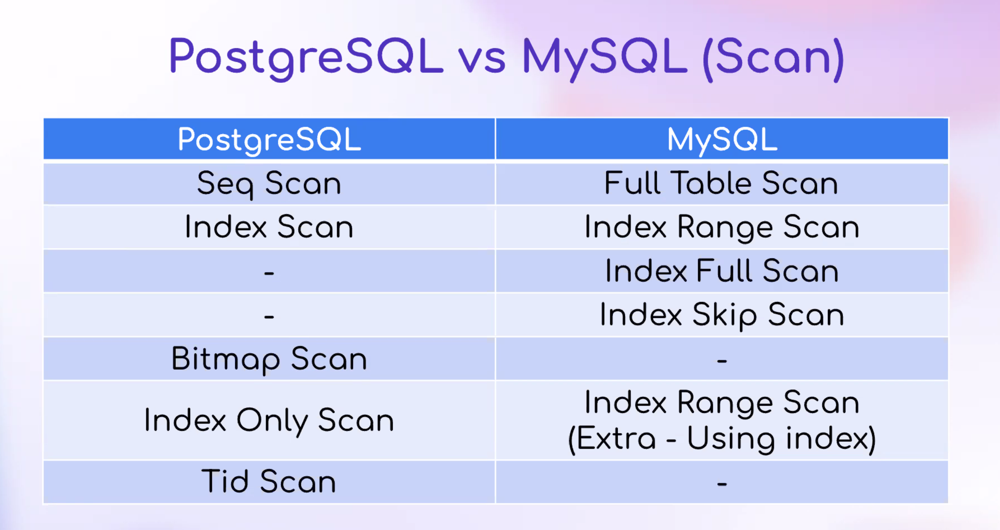
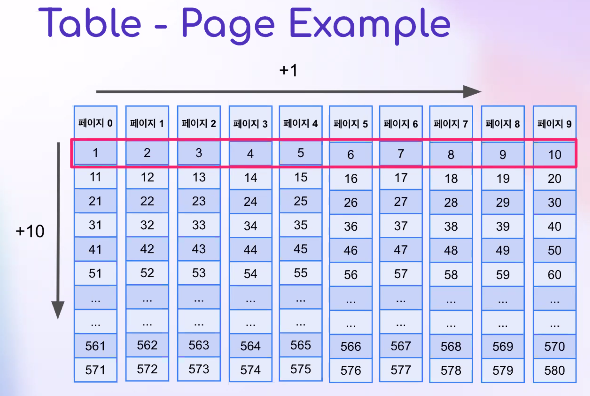
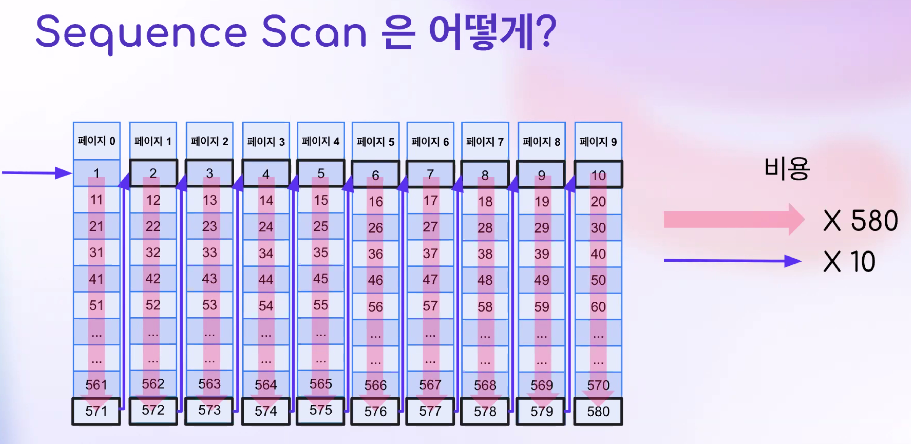
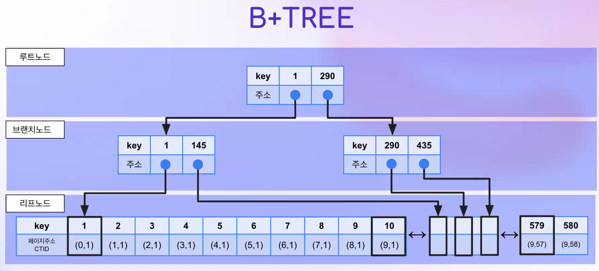
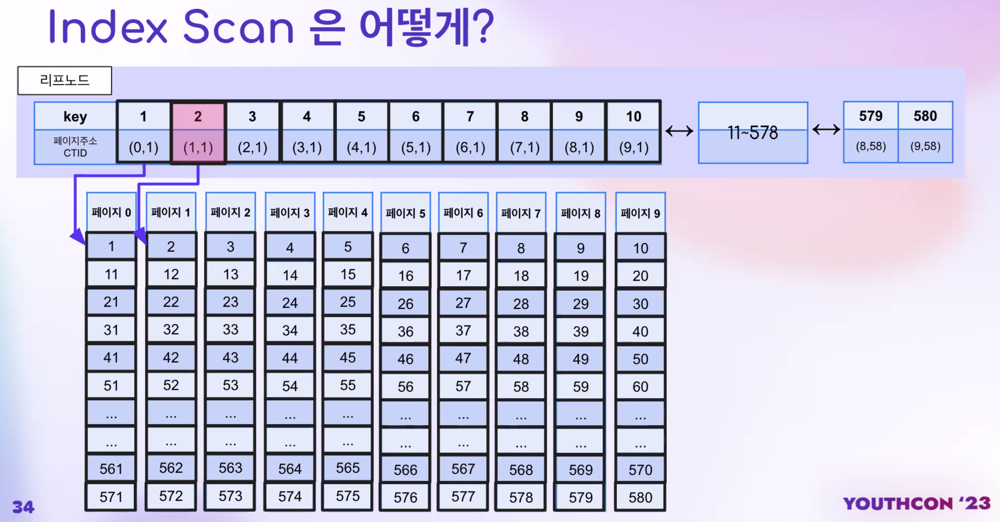
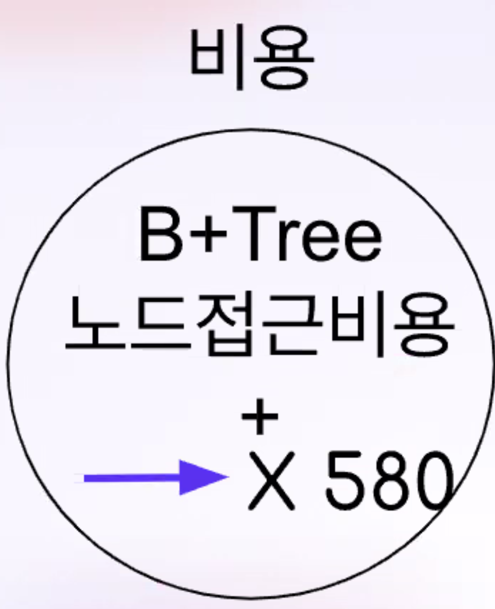
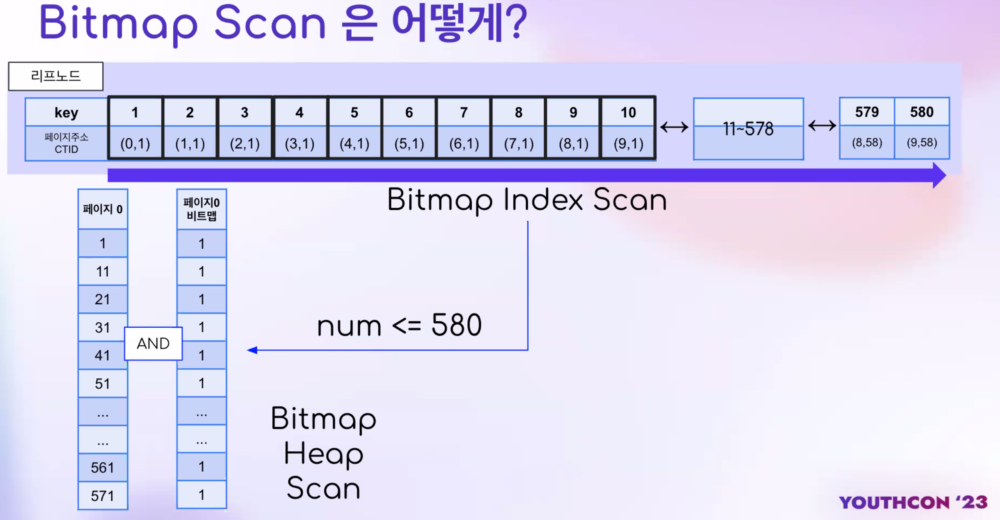
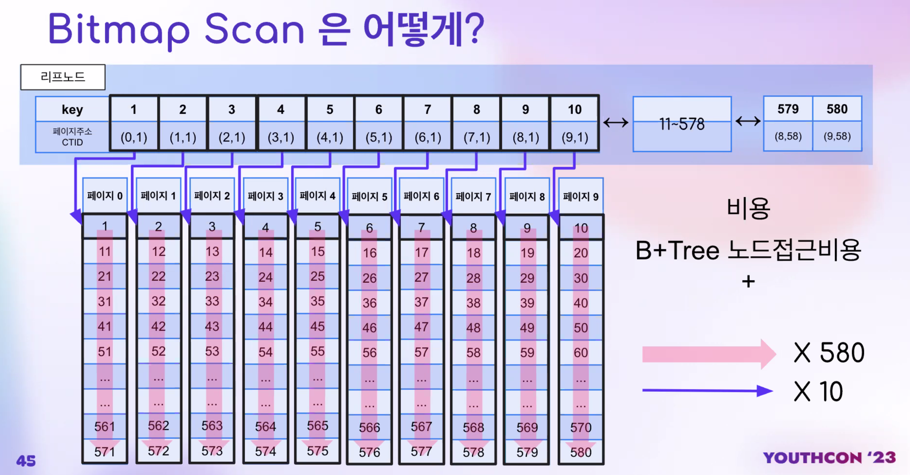

# PostgreSQL의 Scan 작동 원리 파헤치기

https://github.com/changsubkwak

본 세션에서 가져가야 할 것

-  Sequential Access 
- Random Access
- PostgreSQL ° Scan
- Sequential Scan
- Index Scon
-  Bitmap Scan

# SequentalAccess vs RandomAccess

시퀀셜 액세스 : 데이터를 얻기 위해 모든 데이터를 순서대로 접근하는 액세스

* 단위 접근 비용이 적다

랜덤액세스 : 주소로 점프해서 데이터를 가져옴

* 단위 접근 비용이 크다

- 조회하고자 하는 데이터의 양이 중간정도라면?
- Bitmap Scan (By PostgreSQL Planner)

## Table - Page Example

- 테이블 데이터
- 페이지 단위 저장
- 1~ 580 까지

해당 페이지는 전체적으로 정렬되지 않는 테이블이다.

* 571에서 2로 가려면 복잡하다.

정렬되지 않은 테이블에서 시퀀스 스캔은 어떻게 일어날까?

571에서 -> 2로 랜덤액세스

2에서 572까지 시퀀셜액세스

* 비용 계산
  * 순서대로 쭉~ 하고 랜덤익세스 10번

### B+Tree

* 2를 찾으려면?
* 루트노드의 1보단 크고 290보단 작으므로 왼족
* 브랜치노

### 인덱스 스캔은 어떻게?

* 리프노드의 페이지주소(CTID) 0은 페이지번호, 1은 페이지 내의 몇번째

* 정렬이 안되어있으면 랜덤액세스를 진행한다.
* 정렬이 되어있으면 시퀀스액세스 진행 후 랜덤액세스

### Bitmap Scan은 어떻게?

리프노드에 모든 키갑셍 대해서 조건에 맞는 모든 데이터를 찾는다

후에 해당 데이터들을 찾아서 페이지 단위로 묶는다 

* 페이지 0 에대한 비트맵.
* 존재하면 1 존재하지않으면 0을 세팅하여 비트맵을 만든다. -> 비트맵 인덱스 스캔
* 후에 실제 페이지랑 And(&) 연산을 한다 (비트맵 힙 스캔)

* 핑크 : 시퀀셜액세스
* 보라 : 랜덤액세스

## 언제 Index Scan 보다 Bitmap Scanol 사용될까?

**테이블의 실 자료의 정렬도가 낮은데,** 그 칼럼 기준으로 검색은 해야겠는데, 굳이 **인덱스 탐색(인덱스와 테이블 페이지를 왔다 갔다 하는 일)**을 안해도 될 어느 정도(?)의 총 자료량이여서 쿼리 중에 임시로 메모리에 비트맵을 만들어될 만큼의 자료라고 예측 되면 이 비트맵 스캔을 실행계획기가 선택합니다.

- postgresal.kr 김상기 님

- Sequential Access(SA) 와 Random Access(RA)
  - 전부 접근시, SA가 좋고, 하나 접근시 RA 가 좋아
- PostgreSQL 의 Scan 방식 3가지
  - Sequential Scan - 전부 조회시 유리해!
  - Index Scan - 정렬되었을 때 빠르지만 그렇지 않으면 하나 조회하는 것은 최고!
  - Bitmap Scan - 정렬되지 않으면서 적은 범위시 조회시 유리해!

