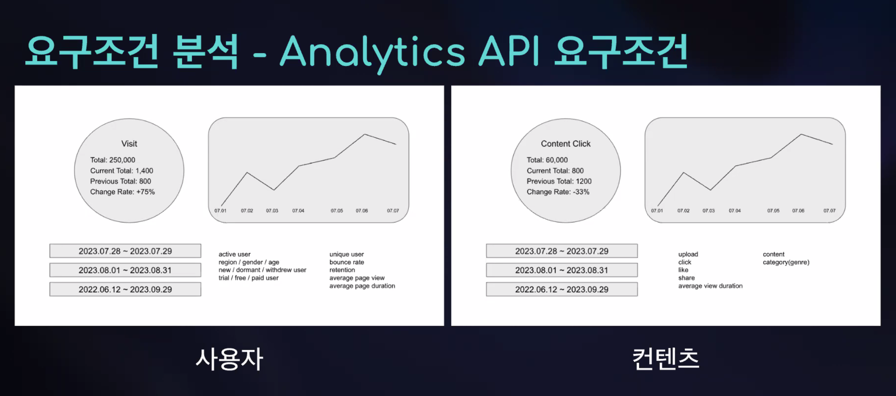
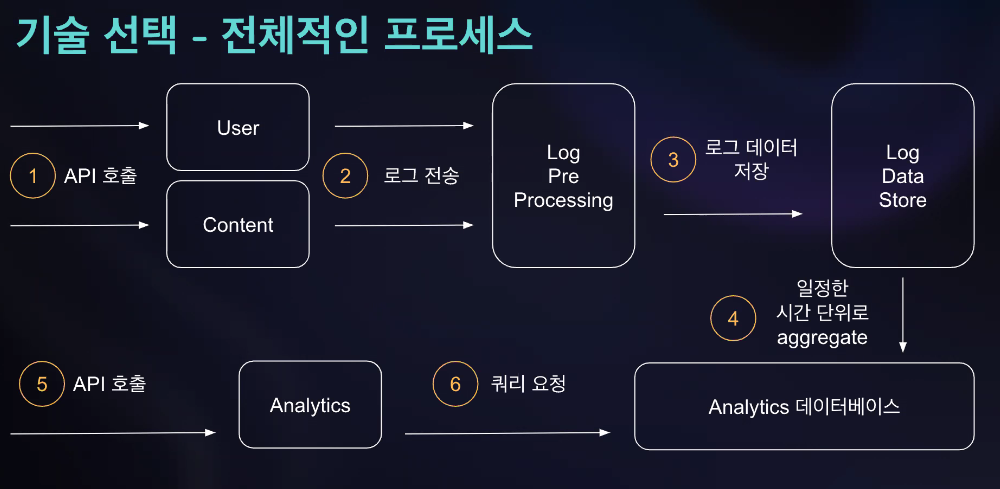
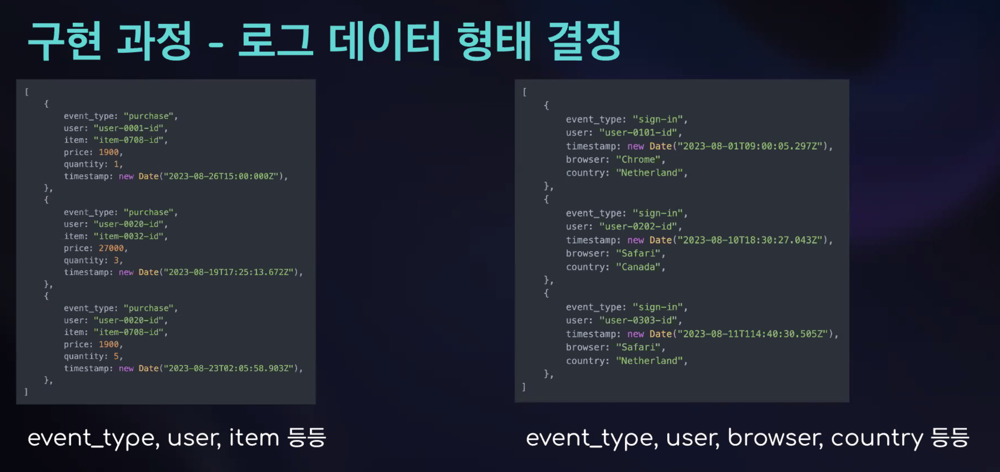
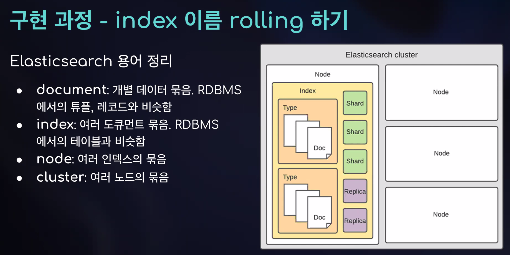

# ELK 스택을 활용해 통계성 데이터 제공하는 API  구현하기

발표 대상

- ELK 활용해서 프로젝트 하기를 원하는 사람

* 통계성 데이터 기반 API 구현하기를 원하는 사람 , 데이터 분석 및 데이터 처리에 관심이 있는 사람

# 목차 

1. 요구조건 분석

2. 기술 선택

3. 구현 과정에서의 고민과 해결책

## 요구조건 분석 - 서비스 개요

SNS 같이 많은 사람들이 컨텐츠를 즐기며 서로 상호작용하는 커뮤니티형 서비스

(예시: 유튜브, 페이스북, 인스타그램)

크게 네 종류의 도메인

1. 컨텐츠 - Content
2. 컨텐츠를 업로드하는 사용자 - Uploader
3. 컨텐츠를 즐기는 사용자 - Viewer or Visitor
4. 통계 정보를 확인하는 어드민 - Admin

## 기술 선택

### 왜 ELK?

데이터 분석 플랫폼으로 유명한 Hodoop, Spork 도 고려했지만 결국에는 Elasticseorch, Logstosh, Kibono 를 선택

1. 백엔드 메인 환경은 Nodejs
2. search 와 aggregation 이 필요한 경우가 많을 것이라고 예상
3. 빅데이터 프로세싱보다는 Analytics(통계 처리), Visualization(시각화) 에 집중하게 될 듯

## ELK 강의 추천

* https://www.youtube.com/results?search_query=lisa+h+jung+beginners+crash+course+to

# 구현과정에서의 고민과 해결책

구현 과정 - 셋업

Elasticseorch, Logstash, Kibana 세 가지를 각각셋업해서 서로 유기적으로 동작하도록 만드는 것은 쉽지 않음 도커 컨테이너로 묶어서 관리한다면 훨씬 편해짐 docker-elk(https://loithub.com/deviontonv/docker-ellk.ait)

컨테이너 기반으로 환경을 구성하면 dev, test, staging, prod 등 다양한 환경을 거의 동일하게 구성할 수 있음

## 구현 과정 - 로그 데이터 형태 결정

사용자 동작 ~> 이벤트 기반 로그 발생 

사용자 롱작 .> 이벤트 기반 로그 발생 

사용자 동작 ~> 이벤트 기반 로그 발생

정확하게는

1. 사용자가 어떤 동작(버튼 페이지 이동 등)을 하면

2. 프론트엔드에서 해당 동작에 맞는 AP 요청

3. 백엔드에서는 Ap 요청을 수신해서 처리

4. 처리 로직 내부에 Logstash 로 로그 전송하는 로직 추가

### 로그 데이터 형태 결정

## 엘라스틱 서치 용어 정리

* document: 개별 데이터 묶음. RDBMS 에서의 튜플, 레코드와 비슷함

* index: 여러 도큐먼트 묶음. RDBMS 에서의 테이블과 비슷함

* node: 여러 인덱스의 묶음

* cluster: 여러 노드의 묶음

### 구현 과정 - index 이름 rolling 하기

Elasticsearch 내부 타입 시스템: mapping

* mopping 시스템은 index 단위로 동작

* 구현 과정에서 "a00" 이라는 이름의 특정한 필드를 booleon 타입으로 사용하다가 text, keyword 타입으로 바꿔서 사용해야 하는 경우가 있었는데 계속해서 오류가 발생했다.

* 오류가 발생하지 않게 만들려면 reindex(인덱스 전체 갱신) 를 실행하거나 기존 데이터 전체를 새로운 index 로 복제하는 작업을 해야했다.

