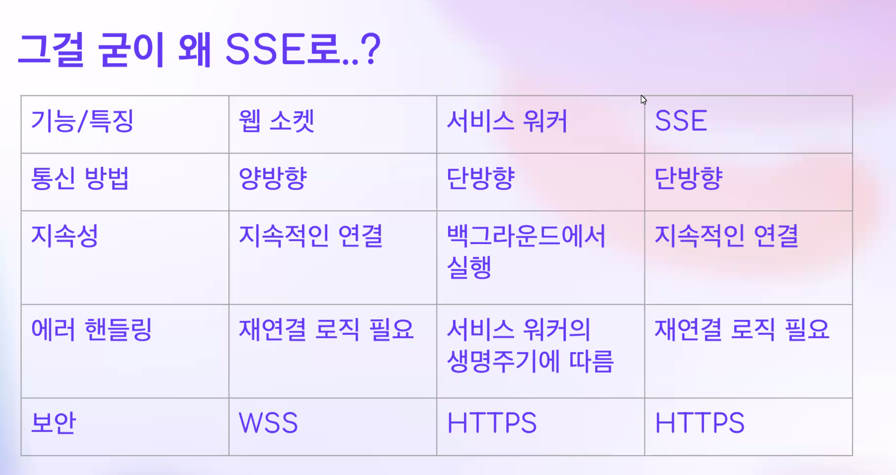
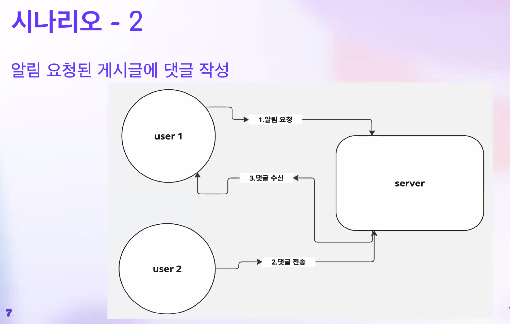

# 모두의 Server-Sent Events

https://github.com/Bue-von-hon/SSE-samples

시작 브랜치

git checkout first-step

# SSE

서버에서 클라이언트로 요청 없이 데이터를 전송

* 실시간 댓글
* 실시간 알림
* 실시간 주식 가격

## 폴링 vs 롱폴링 vs SSE

폴링

롱폴링

## 시나리오 1

게시글에 알림 요청 전송 

## 시나리오 2 알림 요청된 게시글에 댓글 작성

## 메시

# 주의 사항

메시지는 콜백을 등록하고 다른 스레드에서 실행되기 때문에 주의

- 동시성 제어 주의
  - 컨테이너는 thread-safe 해야 한다
- 타임아웃과 재연결 주의
  - 타임아웃을 적절하게 설정해야 한다. 
  - 타임아웃이 너무 길면 서버에서 관리해야함
  - 너무 짧으면 재연결 요청이 증가하기 때문이다 
- SSE는 탭 당 연결
  - 만약 유저가 다른탭에서 동일한 게시글을 보는 경우 해당 게시글에 대한 푸시가 유저에게 중복 전송될 수 있다.
  - 중복 전송을 방지해보자

