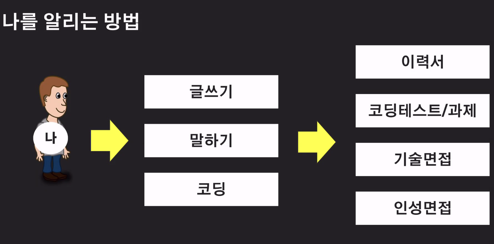
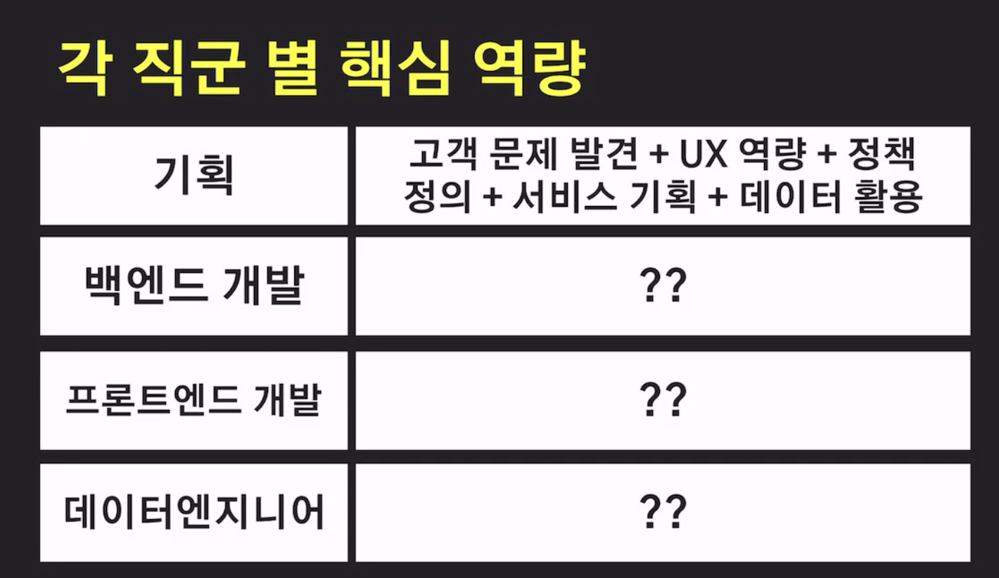
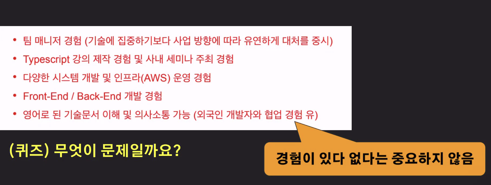
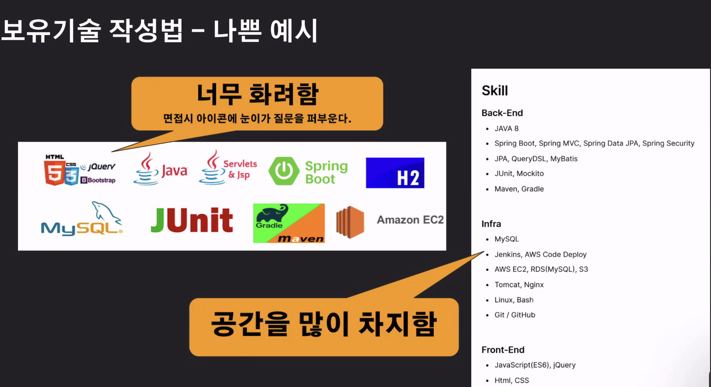
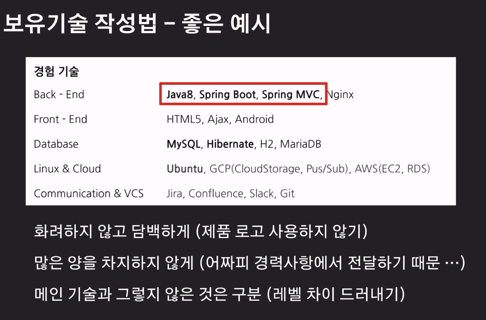
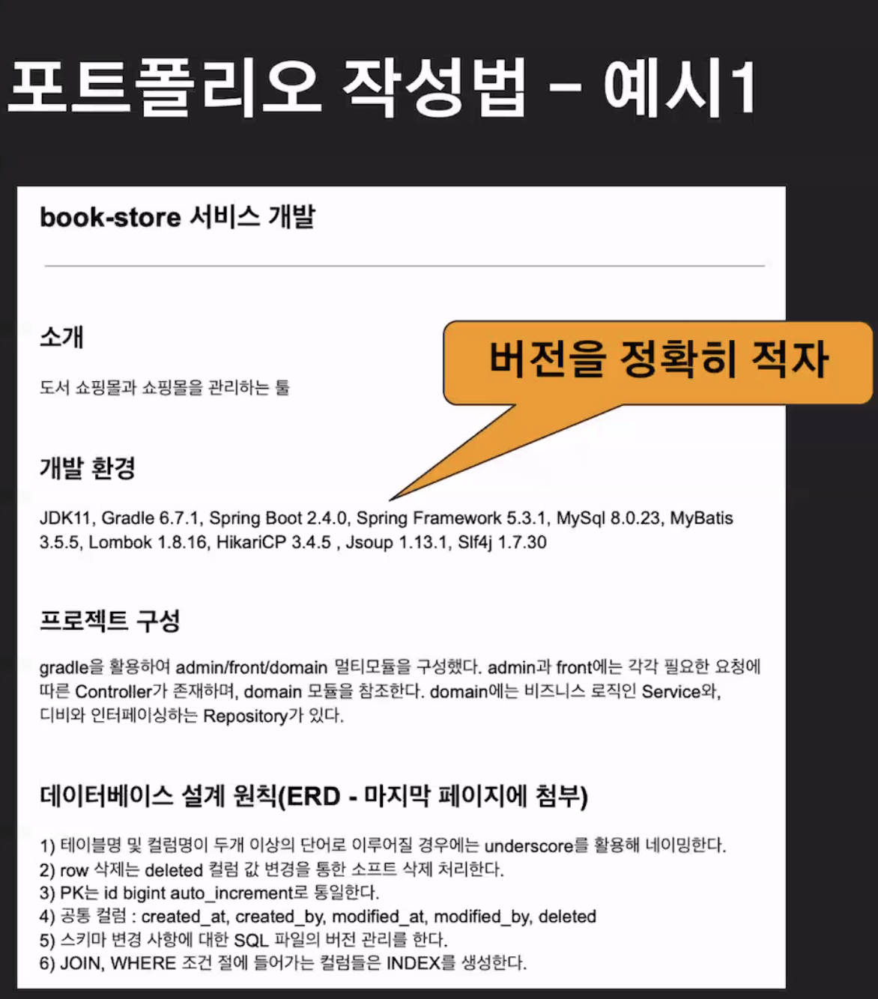
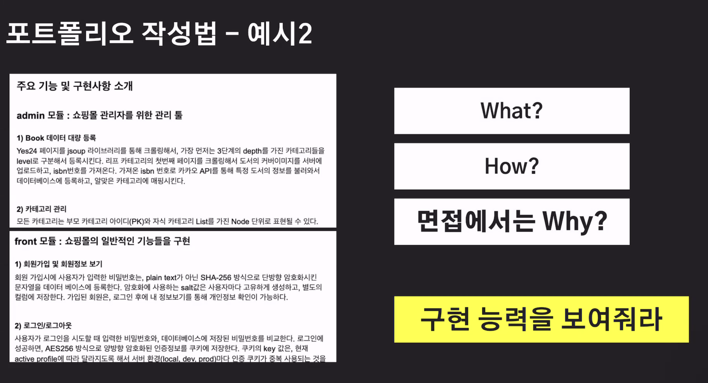
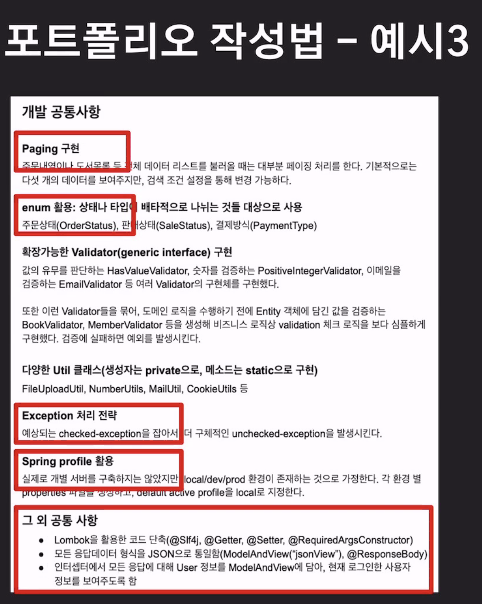
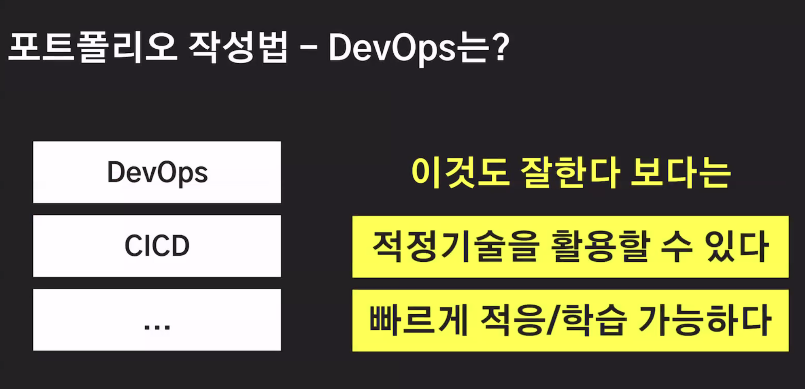
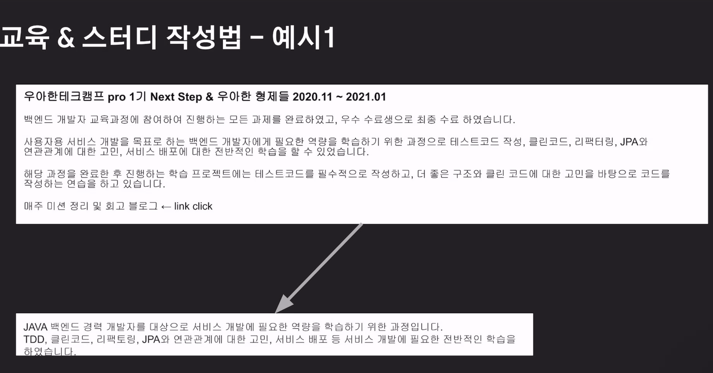

# **신희송님과 함께하는 이력서 특강**

* 100개의 이력서가 들어온다면, 1~3명 정도만 붙는다. -> 1~3%
* 성장 방법을 모르는 개발자가 많다.

회사는 개발자가 부족하다.

**나를 채용해야 하는 이유를 적어보자**

> 나를 채용해야 하는 이유는 ? ~~~ 때문이다.

* 나를 채용해야하는 이유는 필요하면 만들 수 있기 때문이다.

나의 강점들을 먼저 알아보자.

나를 잘 알리기 위해서는

* 과대평가 해서는 안된다. -> 아는것과 모르는것을 정확히 알아야 한다.
* 보여주지 못해도 안된다. -> 준비를 해야한다. 
* 나를 정확히 알고 표현할 수 있어야 한다.

이 모든것을 이력서에 담아야 한다. 

### 이력서는 누가 읽는가?

* 사람 - > 읽기 편해야 한다. 
* 개발리더 등 -> 면접 보고 싶은 마음이 들어야 한다.

#### 읽기 편해야 한다

* 기본적인 글쓰기 능력은 중요하다

* 한 문장이 길어서는 안된다

* 주어와 서술어가 명확 해야 한다

- 한 문단에는 하나의 주장만 담는게 좋다 (단일책임의 원칙)
- 폰트가 너무 크거나 작지 않도록...
- 줄간이 너무 크거나 작지 않도록..

#### 면접 보고 싶은 마음이 들어야 한다.

> 백엔드 개발자는 서버 측 프로그래밍을 담당하며, 사용자 인터페이스나 클라이언트 측 개발을 수행하는 프론트엔드 개발자와 함께 일하는 경우가 많습니다.
>
> 백엔드 개발자가 가져야 할 핵심 역량은 다음과 같습니다:
>
> 1. 프로그래밍 언어와 프레임워크에 대한 지식: 백엔드 개발자는 주로 Java, Python, Ruby, PHP, C # 등의 프로그래밍 언어를 사용합니다. 또한, Spring, Django, Ruby on Rails, Laravel, ASP.NET 등의 프레임워크를 이해하고 사용해야 합니다.
> 2. 데이터베이스 관리: 백엔드 개발자는 데이터베이스를 설계하고 관리해야 하므로, SQL 또는 NoSQL 데이터베이스의 이해가 필요합니다. MongoDB, MySQL, PostgreSQL, Oracle 등이 대표적인 데이터베이스입니다.
> 3. API 설계 및 구현: 백엔드 개발자는 RESTful API를 설계하고 구현하는 데 능숙해야 합니다. 이는 다른 개발자들이 프로그램과 상호 작용할 수 있도록하는 중요한 요소입니다.
> 4. 시스템 아키텍처와 배포: 백엔드 개발자는 대규모 시스템의 설계 및 개발을 담당하므로, 시스템 아키텍처와 클라우드 서비스의 이해가 필요합니다. 이는 높은 가용성, 성능 및 확장성을 보장하는 데 중요합니다.
> 5. 보안: 백엔드 개발자는 사용자 데이터를 안전하게 보호해야 하므로, 보안의 기본 원리를 이해하고, 서버 보안 및 데이터 보호 기술에 대한 이해가 필요합니다.
> 6. 협업과 문제 해결: 백엔드 개발자는 다른 개발자들과 협력하고 문제를 해결하는 데 능숙해야 합니다. 따라서 커뮤니케이션, 문제 해결 및 프로젝트 관리 능력이 필요합니다.

백엔드의 필요 핵심 역량

* 기능 구현 능력을 기술적인 키워드로 뽑아서 적어야 한다. 

### 매력적인 개발자란?

(퀴즈) 개발리더가 가장 매력적으로 생각하는 것은 무엇일까? -> <u>기본기</u>

1. <u>**기본기가 탄탄한가?**</u> -> 코테 / 1차 면접에 중요

2. 구현 능력이 있는가? -> 이력서 / 코테 / 1차 면접 

3. 꾸준한 성장 & 가능성 -> 이력서 / 1차 면접

4. 인성/태도/커뮤니케이션/협업 -> 2차 면접

내가 경험한것들을 확실하게 내것으로 만들자. 

### 이력서의 구성 - 볼드체의 중요성

이름 전화번호 이메일

**github blog**

자기 소개

보유 기술

**경력 사항 / 포트폴리오**

학력 사항

**교육 / 스터디 / 기타 /  활동**

## 자기소개 작성법

경력자는 나의 특징만 3~ 4 문장으로 간략하게 하는 편

- 주로 어떤 업무 경험(기술 스택)을 쌓아왔고 업무적으로 나의 장점, 관심사는?
- 앞으로 어떤 사람(개발, 데이터분석, 마케터, 기획자)이 되고 싶은지.
- 

맨 나중에 작성하기

*  자기소개가 이력서, 경력소개서, 면졉 등에서 증명이 되어야 한다.

* ex) 신기술에 관심있다. : but github, blog, 경력사항, 스터디, 교육 어디에도 신기술 내용이 없다?

### 잘못된 이력서

경험이 중요한게 아닌, 잘 하는것이 중요하다.

무엇을 잘 하는가?

What과 How로 **무엇을 어떻게 했다** 를 적고. 면접에는 왜 이렇게 했다를 설명한다.

* 경험은 하나도 중요하지 않다.

### github / blog / Notion 작성법

얼마나 자주 업데이트 하는가?

- github code push
- blog post

얼마나 잘 정리하나?

- 경험한 것, 모르는 것, 호기심 있는 것 ...
- 단순히 인터넷 자료를 Copy 아닌 나의 경험, 느낌, 생각을 녹이면 금상첨화 새로운 기술을 얼마나 관심을 가지나?

따로 만들고 있는 서비스는 없는가?

보여주면 마이너스가 될것 같다? 이력서에 넣지 않는다. 하지만 요즘은 넣는게 default

## 보유기술 작성법 - 나쁜 예시

## 보유기술 작성법 - 좋은 예시

* 잘 쓰면 볼드 처리, 잘 모르면 볼드처리 안한것 

### 경력사항/포트폴리오 작성법 - 공통

- 회사 / 교육기관
  - 회사/교육기간 명, 근무기간, 간단한 회사/교육소개
- 프로젝트
  - 프로젝트명, 기간, 소개, 맡은 역할, 미션, 참여자 수 
  - 설계방법, 구현내용, 성과, 문제해결 내용이 중요

- 기본은 시간 역순
  -  but 항상은 아님 (ex. 업무효율성만 따로 그룹핑해서 작성)
- 중요한 프로젝트는 글 양도 많아야 한다
- 개발자에게 중요한 가치와 의미를 전달해야 한다
- 하나의 프로젝트에 하나의 의미를 전달하는게 좋다

- 성과는 명확한 숫자로 보여주기

> 프로젝트 == 뭐 해봤니? == 뭘 믿고 내가 널 뽑아야하니?

## 포트폴리오 작성법 예시

* 우리가 지정했떤 컨벤션들에 대해 적어놓으면 좋다

* 프로젝트 소개 (간단히)

* 개발 환경 (버전 포함)

* 설계 원칙 & 방법

* 개발 컨벤션

프로젝트 기간, 참여 인원, 내가 맡은 부분을 명확하게 적어주면 좋다.( 위 예시는 없다.)

## DevOps 기술은?

* 나는 데브옵스 개발자가 아니니까, 이런것들이 필요하면 적정 기술을 사용하여 빠르게 학습하고 적용시킬 수 있다를 보여주면 된다.

* 나는 이것도 적당하게 할 줄 알아. 라는 의미로 적어주면 된다.

## 교육 & 스터디 작성법

경력사항/포트폴리오 보다 화려해서는 안된다

왼손은 거들뿐 (교육, 스터디는 경력사항을 거들 뿐)

왜 했고, 이를 통해 얻은 것은 무엇인가?

담백하게 써야 함

클론코딩과 목적, 과정, 무엇을 성취했는지, 무엇을 구현했는지 작성한다.

클론보다는 how -> 왜?

