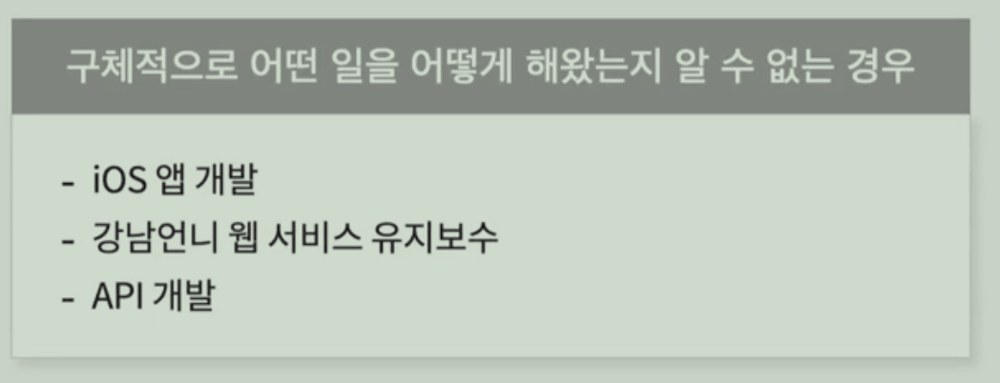
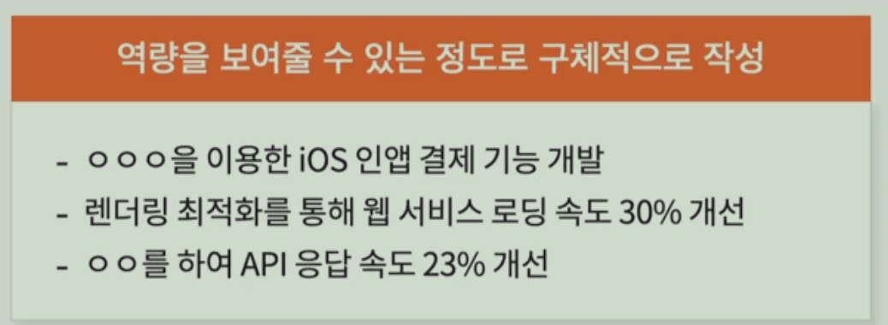
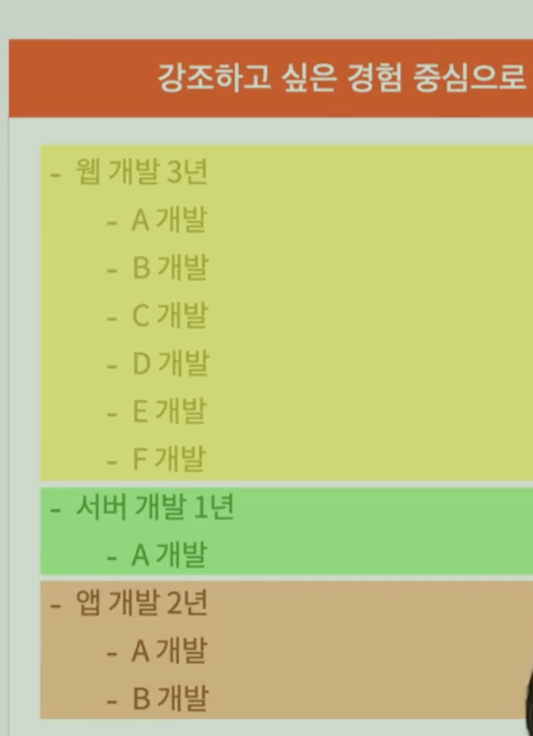
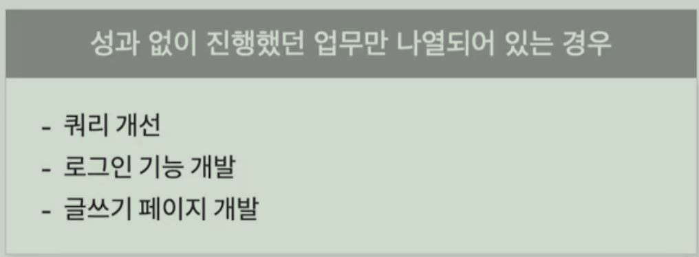
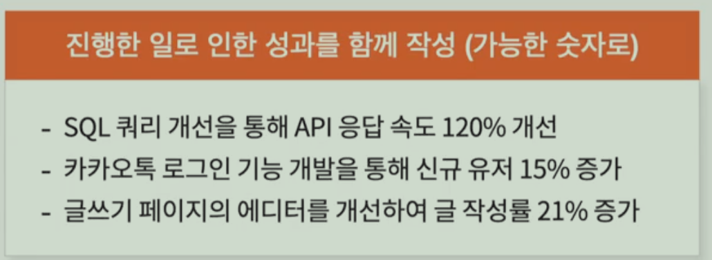
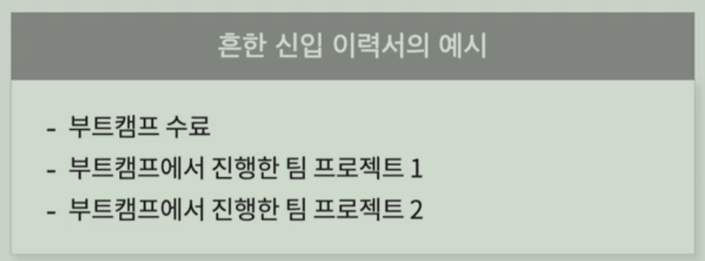
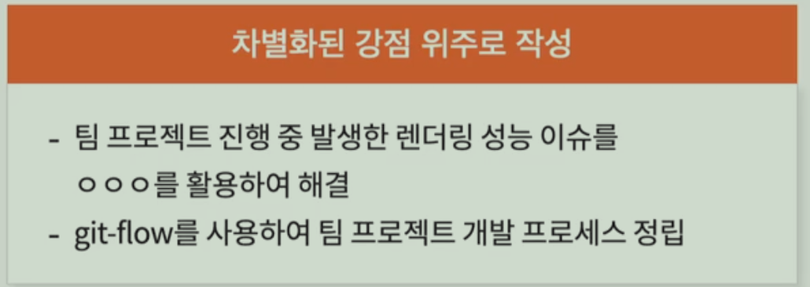
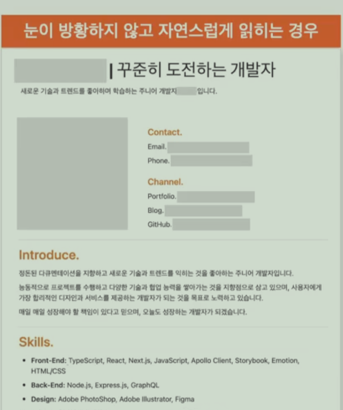

**Part 1. 이력서를 작성하기 전에**

- 이력서의 목적
- 탈락하는 이력서, 합격하는 이력서
- 잘 읽히는 이력서 (이력서 템플릿 제공)

**Part 2. 이력서 작성하기**

- 이력서 구성과 순서
- 제목과 프로필
- 자기소개
- 경험
- 기술과 학력/교육

**Part 3. 이력서 작성 후**

- 지키지 않으면 과락인 것들
- 작성보다 중요한 퇴고 (최종 점검 체크리스트, 피드백 잘 받는 방법 제공)
- 회사 지원할 때 유용했던 팁

**Part 4. 실제 이력서 개선하기**

- 신입 이력서 개선하기
- 경력 이력서 개선하기

**Part 5. FAQ**

- 신입 개발자가 자주 하는 질문
- 자주하는 질문 모음 (강의 노트 only 📝)

## 이력서의 목적

목적을 알아야 이력서가 목적에 부합하는 좋은 이력서인지 아닌지 파악할 수 있다.

### 이력서는 왜 있을까

* **채용 담당자가 면접 볼만한 사람을 걸러내기 위해**
  * 채용 담당자 입장에서 면접으로 갈만하다는 생각이 들게하는 이력써를 써야한다.
  * 채용 담당자 입장에서 맥력적으로 느껴질까? 를 고민
* **면접 질문을 준비하기 위해**
  * 지원자의 이력서에서 면접 질문을 뽑는 경우가 많다.
  * 때문에 전략적으로 면접을 고려하며 이력서를 써야한다.
  * 이력서 내용이 면접 떄 어떤 질문으로 이어질지 고민해보기
* **나의 부족한 점/ 개선 포인트를 발견하는 장치**
  * 이력서에 쓸 내용이 없다면, 의미있는 경험을 더 해야 한다.
  * 한 일에 대한 성과를 모르거나, 숫자로 표현할 수 없다. -> 일할 떄 성과(목표)에 집중하고 임팩트를 숫자로 측정해야 한다.
  * 한 일에 대해 면접 때 잘 대답할 자신이 없다. -> 공부해라 

## 탈락하는 이력서, 합격하는 이력서

* 이력서를 리뷰하는 데 몇 분을 쓸까? -> 20초 미만
* 20초이내로 슥 훑어보며 탈락 이력서를 1차로 걸러내고, 괜찮아 보이는 이력서만 다시 살펴봄

* 20초만에 탈락하는 이력서 -> 알 수 없다, 잘 모르겠다는 생각이 드는 이력서

### 탈락하는 이력서 특징

정리.

> 1. 무슨 역량이 있는지 알 수 없다.
>    * 1-1. 구체적으로 어떤 일을 어떻게 해왔는지가 나타나있지 않은 경우
>    * -> 역량을 보여줄 수 있는 정도로 구체적으로 작성
>    * 1-2. 경력 대비 해온 일이 너무 다양한 경우
>    * -> 강조하고 싶은 경험 중심으로 추리기
>
> 2. 무슨 성과를 내왔는지 알 수 없다.
>    * 성과 없이 단순히 진행했던 업무만 나열되어 있는 경우
>    * -> 진행한 일로 인한 성과를 함께 작성 (가능한 숫자로)
>    *  성과를 숫자로 표현하기 어려운 경우에는 이 일을 한 목적에 대해 명시
>
> 3. 다른 사람과의 차별점을 알 수 없다.
>
>    * 지원자 이름이나 회사 이름만 바꾼 것처럼 별다른 차별점이 없는 경우
>
>    * -> 차별화된 강점 위주로 작성
>
> 4. 위의 세 가지 포인트들이 눈에 들어오지 않는다.
>    * 가독성이 나쁘거나, 핵심 내용이 강조되지 않은 경우

1. 무슨 역량이 있는지 알 수 없다.
   1. 구체적으로 어떤 일을 해왔는지가 알 수 없는 경우
      * 
   2. **내가 가지고 있는 역량을 보여줄 수 있는 정도로 구체적으로 작성**
      * 

2. 경력 대비 해온 일이 너무 다양한경우 이상하다.
   1. 지원하고자 하는 직무와 관련된 경험 중심으로 강조해서 정리하자.
      * 

3. **무슨 성과를 내왔는지 알 수 없다. (지원자의 역량으로)**

   * 성과 없이 단순히 진행했던 업무만 나열되어 있는 경우 < 이렇게 하지 말자
     * 
     * 이렇게만 적게 된다면, 이 내용들을 통해서 무엇을 달성하고자 했는지를 알 수가 없다.
   * 그러므로 진행한 일로 인한 성과를 함께 작성한다.(가능한 숫자로)
     * 

   * 마찬가지로
     * 디자인 시스템 개발 보다는 -> 어드민 개발 생산성을 높이기 위한 디자인 시스템 개발
     * 튜토리얼 페이지 개발 보다는 -> 유저 이탈을 방지하기 위한 튜토리얼 페이지 개발
   * 만들어낸 성과와 목적에 대해 명시.

4. **다른 사람과의 차별점을 알 수 없다.**

   * 지원자 이름이나 회사 이름만 바꾼 것처럼 별다른 차별점이 없는 경우

   * 

   * 차별화된 강점 위주로 작성하는 것이 좋다.

     * 

       

## 잘 읽히는 이력서 (이력서 템플릿 제공)

> **깔끔한 이력서 템플릿**
> \- 노션 이력서 템플릿: [https://www.notion.so/wonny-log/26e16f43cf404086b74f054b36d4d080 ](https://www.notion.so/wonny-log/26e16f43cf404086b74f054b36d4d080)
> \- 구글 이력서 템플릿: https://docs.google.com/document/u/0/?ftv=1&tgif=c
> \- 원티드 이력서 템플릿: https://www.wanted.co.kr/cv/intro

### 가독성의 중요성

이력서를 리뷰하는 방식

* 20초 이내로 수 훑어보며 일차로 걸러내고, 괜찮아보이는 이력서만 다시 살펴봄 

* -> 슥 훑어볼 때 걸러지지 않도록 한 눈에 봐도 면접 볼만한 사람임이 어필되야 함

1. 좋은 레이아웃을 구성한다.
   * 눈이 방황하지 않고 위에서부터 아래로 자연스럽게 읽히게 배치한다.
     * 
   * 섹션을 명확히 나누고 섹션마다 섹션을 잘 설명하는 제목을 달아준다.
   * 관련있는 정보끼리 잘 그룹핑한다.
     * 
   * 읽기 편한 폰트와 글씨 크기, 줄간격, 여백을 사용한다.
   * 줄글보단 불렛 (-, * )을 활용한다.

2. 레이아웃은 디자인의 영역이므로 디자인에 자신이 없다면 깔끔한 템플릿을 사용한다.

3. 핵심 내용을 강조한다.
   * 강조하고 싶은 내용을 포인트 컬러, 볼드, 밑줄, 링크 등을 적절히 사용해서 강조한다.

4. 불필요한 내용을 쳐낸다.
5. 

**Part 2. 이력서 작성하기**

- 이력서 구성과 순서
- 제목과 프로필
- 자기소개
- 경험
- 기술과 학력/교육

**Part 3. 이력서 작성 후**

- 지키지 않으면 과락인 것들
- 작성보다 중요한 퇴고 (최종 점검 체크리스트, 피드백 잘 받는 방법 제공)
- 회사 지원할 때 유용했던 팁

**Part 4. 실제 이력서 개선하기**

- 신입 이력서 개선하기
- 경력 이력서 개선하기

**Part 5. FAQ**

- 신입 개발자가 자주 하는 질문
- 자주하는 질문 모음 (강의 노트 only 📝)