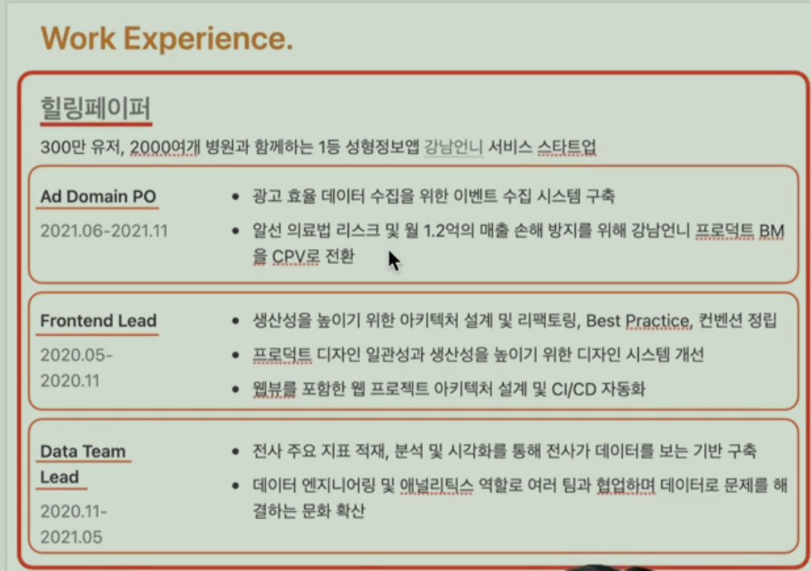

# 인프런 워니님 강의 - 실제 이력서 사례로 알아보는 [합격하는 이력서] 작성 가이드

목차

**Part 1. 이력서를 작성하기 전에**

- 이력서의 목적
- 탈락하는 이력서, 합격하는 이력서
- 잘 읽히는 이력서 (이력서 템플릿 제공)

**Part 2. 이력서 작성하기**

- 이력서 구성과 순서
- 제목과 프로필
- 자기소개
- 경험
- 기술과 학력/교육

**Part 3. 이력서 작성 후**

- 지키지 않으면 과락인 것들
- 작성보다 중요한 퇴고 (최종 점검 체크리스트, 피드백 잘 받는 방법 제공)
- 회사 지원할 때 유용했던 팁

**Part 4. 실제 이력서 개선하기**

- 신입 이력서 개선하기
- 경력 이력서 개선하기

**Part 5. FAQ**

- 신입 개발자가 자주 하는 질문
- 자주하는 질문 모음 (강의 노트 only 📝)

## 이력서의 목적

목적을 알아야 이력서가 목적에 부합하는 좋은 이력서인지 아닌지 파악할 수 있다.

### 이력서는 왜 있을까

* **채용 담당자가 면접 볼만한 사람을 걸러내기 위해**
  * 채용 담당자 입장에서 면접으로 갈만하다는 생각이 들게하는 이력써를 써야한다.
  * 채용 담당자 입장에서 맥력적으로 느껴질까? 를 고민
* **면접 질문을 준비하기 위해**
  * 지원자의 이력서에서 면접 질문을 뽑는 경우가 많다.
  * 때문에 전략적으로 면접을 고려하며 이력서를 써야한다.
  * 이력서 내용이 면접 떄 어떤 질문으로 이어질지 고민해보기
* **나의 부족한 점/ 개선 포인트를 발견하는 장치**
  * 이력서에 쓸 내용이 없다면, 의미있는 경험을 더 해야 한다.
  * 한 일에 대한 성과를 모르거나, 숫자로 표현할 수 없다. -> 일할 떄 성과(목표)에 집중하고 임팩트를 숫자로 측정해야 한다.
  * 한 일에 대해 면접 때 잘 대답할 자신이 없다. -> 공부해라 

## 탈락하는 이력서, 합격하는 이력서

* 이력서를 리뷰하는 데 몇 분을 쓸까? -> 20초 미만
* 20초이내로 슥 훑어보며 탈락 이력서를 1차로 걸러내고, 괜찮아 보이는 이력서만 다시 살펴봄

* 20초만에 탈락하는 이력서 -> 알 수 없다, 잘 모르겠다는 생각이 드는 이력서

### 탈락하는 이력서 특징

정리.

> 1. 무슨 역량이 있는지 알 수 없다.
>    * 1-1. 구체적으로 어떤 일을 어떻게 해왔는지가 나타나있지 않은 경우
>    * -> 역량을 보여줄 수 있는 정도로 구체적으로 작성
>    * 1-2. 경력 대비 해온 일이 너무 다양한 경우
>    * -> 강조하고 싶은 경험 중심으로 추리기
>
> 2. 무슨 성과를 내왔는지 알 수 없다.
>    * 성과 없이 단순히 진행했던 업무만 나열되어 있는 경우
>    * -> 진행한 일로 인한 성과를 함께 작성 (가능한 숫자로)
>    *  성과를 숫자로 표현하기 어려운 경우에는 이 일을 한 목적에 대해 명시
>
> 3. 다른 사람과의 차별점을 알 수 없다.
>
>    * 지원자 이름이나 회사 이름만 바꾼 것처럼 별다른 차별점이 없는 경우
>
>    * -> 차별화된 강점 위주로 작성
>
> 4. 위의 세 가지 포인트들이 눈에 들어오지 않는다.
>    * 가독성이 나쁘거나, 핵심 내용이 강조되지 않은 경우

1. 무슨 역량이 있는지 알 수 없다.
   1. 구체적으로 어떤 일을 해왔는지가 알 수 없는 경우
      * 
   2. **내가 가지고 있는 역량을 보여줄 수 있는 정도로 구체적으로 작성**
      * 

2. 경력 대비 해온 일이 너무 다양한경우 이상하다.
   1. 지원하고자 하는 직무와 관련된 경험 중심으로 강조해서 정리하자.
      * 

3. **무슨 성과를 내왔는지 알 수 없다. (지원자의 역량으로)**

   * 성과 없이 단순히 진행했던 업무만 나열되어 있는 경우 < 이렇게 하지 말자
     * 
     * 이렇게만 적게 된다면, 이 내용들을 통해서 무엇을 달성하고자 했는지를 알 수가 없다.
   * 그러므로 진행한 일로 인한 성과를 함께 작성한다.(가능한 숫자로)
     * 

   * 마찬가지로
     * 디자인 시스템 개발 보다는 -> 어드민 개발 생산성을 높이기 위한 디자인 시스템 개발
     * 튜토리얼 페이지 개발 보다는 -> 유저 이탈을 방지하기 위한 튜토리얼 페이지 개발
   * 만들어낸 성과와 목적에 대해 명시.

4. **다른 사람과의 차별점을 알 수 없다.**

   * 지원자 이름이나 회사 이름만 바꾼 것처럼 별다른 차별점이 없는 경우

   * 

   * 차별화된 강점 위주로 작성하는 것이 좋다.

     * 

       

## 잘 읽히는 이력서 (이력서 템플릿 제공)

> **깔끔한 이력서 템플릿**
> \- 노션 이력서 템플릿: [https:/www.notion.so/wonny-log/26e16f43cf404086b74f054b36d4d080 ](https:/www.notion.so/wonny-log/26e16f43cf404086b74f054b36d4d080)
> \- 구글 이력서 템플릿: https:/docs.google.com/document/u/0/?ftv=1&tgif=c
> \- 원티드 이력서 템플릿: https:/www.wanted.co.kr/cv/intro

### 가독성의 중요성

이력서를 리뷰하는 방식

* 20초 이내로 수 훑어보며 일차로 걸러내고, 괜찮아보이는 이력서만 다시 살펴봄 

* -> 슥 훑어볼 때 걸러지지 않도록 한 눈에 봐도 면접 볼만한 사람임이 어필되야 함

1. 좋은 레이아웃을 구성한다.
   * 눈이 방황하지 않고 위에서부터 아래로 자연스럽게 읽히게 배치한다.
     * 
   * 섹션을 명확히 나누고 섹션마다 섹션을 잘 설명하는 제목을 달아준다.
   * 관련있는 정보끼리 잘 그룹핑한다.
     * 
   * 읽기 편한 폰트와 글씨 크기, 줄간격, 여백을 사용한다.
   * 줄글보단 불렛 (-, * )을 활용한다.
2. 레이아웃은 디자인의 영역이므로 디자인에 자신이 없다면 깔끔한 템플릿을 사용한다.
3. 핵심 내용을 강조한다.
   * 강조하고 싶은 내용을 포인트 컬러, 볼드, 밑줄, 링크 등을 적절히 사용해서 강조한다.
   * 
4. 불필요한 내용을 쳐낸다.

# **Part 2. 이력서 작성하기**

## 이력서 구성과 순서

- 제목과 프로필
- 자기소개
- 경험
  - 역량으로 그룹핑하고, 회사나 프로젝트에서 한 내용을 추가적으로 적는다.
- 기술과 학력/교육

- 제목 -> 프로필-> 자기소개 -> 경험(회사 경력/프로젝트, 회사 외 경험) -> 스킬 -> 학력/교육
- 제목 > 프로필-> 자기소개 -> 스킬-> 경험(회사 경력/프로젝트, 회사 외 경험) -> 학력/교육

> 학력은 점점 덜 중요하게 보는 추세이다. 정말 좋은 학력이라 강조하고 싶은 게 아니라면 하단에 두는 것을 추천한다.

요즘에는 보유 역량 항목을 추가하는 경우도 있다.

- 보유 역량에 대한 글: https:/www.facebook.com/cjunekim/posts/3477505705611305
- 역량으로 그룹핑하고 역량에 해당하는 경험을 나열하는 방식

## 제목과 프로필 작성 방법

### 제목

* 이름, 한줄 자기소개가 들어가는 항목 -> 한줄 자기소개는 필수가 아니고 엄청난 가산점이 있지도 않다.
* 채용담당자에게 어필이 될 만한 부분을 한번에 적어보자
  * 그러나 뻔한 제목은 지양하자 (개발을 좋아하는 개발자, 성장하는 개발자 등)

* 무난하게 n년차 백엔드 개발자 김영수 같이 쓰는것도 좋다. 
  * 굳이 신입이라고 쓰는 것은 추천하지 않는다.
  * 이동욱 : Java & NodeJs 백엔드 엔지니어
  * 동기부여를 나누어 함께 설정하는 환경을 만드는 백엔드 개발자
  * 꾸준히 도전하는 개발자 - 새로운 기술과 트렌드를 좋아하며 학습하는 주니어 개발자

### 프로필 - 나의 기본 정보가 들어가는 항목

* 연락처, 깃허브, 블로그 링크 등,

## 자기소개 작성 방법

* 나에 대한 전반적인 소개와 업무적 강점을 어필하는 항목
* 일반적으로 2~5줄 분량으로 작성 
* **간략하게 내가 어떤 경력/경험을 가진 개발자인지 요약**
* 그동안 어떤 성과를 내왔는지
* 업무적 강점/관심사/태도를 적을떄에는 일과 무관한것은 적지말자

* 핵심 내용이 눈에 띄도록 **두괄식**으로 작성
  * 두괄식 : 핵심을 먼저 이야기 하는것.
* 애둘러 표현하는 것이 아니라 직접적으로 표현 / 어필 
* 경험 항목과 연결될 수 있는 내용이 들어가는게 좋다. 
  * 자기소개에서의 강점들이 경험항목에서 근거로 보충될 수 있으면 좋다. 

### 자기소개 사례

## 경력 - 회사 경험 항목 작성 방법

* 회사가 필요로 하는 역량을 갖췄음을 증명하는 항목
  1. 회사 경력 / 프로젝트 
  2. 회사 외 경험 및 프로젝트

* 경험 항목을 적을시에는 최신순으로 작성.

* 경험항목을 채울때에는 어필될 수 있는 핵심적인 경험 위주로 작성
  * 지원하는 회사에서 필요로 하는 역량을 가지고 있다고 <u>증명할 수 있는 경험들이다</u>
  * 양보다는 질이 중요하다. 중요하지 않은 내용이 껴있으면 역량이 약해보인다
* 경험항목은 면접 질문시에 가장 많이 참고하는 항목
* 들어갈 내용 :
  * 회사, 부서, 직함, 재직, 담당기간
  * 사용한 기술
  * 담당한 일과 성과와 수치 중심의 결과.
  * **숫자로 표현하기 어려운 경우에는, 왜 이일을 했는지에 대한 목적을 적어주는것이 좋다.**

### 회사 경력 / 프로젝트 사례 더보기

스터디 경험이 있다면, 스터디를 통해 무엇을 얻었는지를 작성하는 것이 중요하다.

## 회사 외 경험 작성 방법

* 직무와 관련한 중요한 경험 모두(프로젝트, 오픈소스 활동, 발표, 인터뷰, 강의, 집필, 자격증 등)

### 경험

* 필요로 하는 역량을 갖췄음을 증명하는 항목

- 1) 회사 경력/프로젝트와 2) 회사 외 경험으로 나뉨
- 그간의 경력과 경험을 최신순으로 작성
- 어필될 수 있는 핵심적인 경험 위주로 작성
  - 양보다는 질이 중요하다. 중요하지 않은 내용이 껴있으면 역량이 약해보인다. 회사 경력/프로젝트에 들어갈 내용
-  면접 질문 준비할 때 가장 많이 참고하는 항목

### 회사 경력/프로젝트 작성 방법

* 들어갈 내용: 회사, 부서/직함, 재직/담당 기간, 사용한 기술, 담당한 일과 성과와 수치 중심의 결과(예: 매출 신장률, 수상 경력, 언론 기사 등) 등
  * **성과를 숫자로 표현하기 어려운 경우에는 이 일을 한 목적에 대해 명시**

* 역량을 보여줄 수 있는 정도로 구체적으로 작성

* 강점이 될만한 내용의 링크를 적절히 활용하면 좋음

### 회사 외 경험에 들어갈 내용

* 들어갈 내용: 직무와 관련한 중요한 경험 모두 (프로젝트, 오픈소스 활동, 발표, 인터뷰, 강의, 집필, 자격등 등)

* 비교적 자유로운 포맷으로 작성

## 기술과 학력/ 교육 작성 방법

### 기술

내가 활용할 수 있는 기술을 보여주는 항목

* 실무에서 활용할 수 있는 기술만 작성

* 상태바, 레벨, 숙련도 등으로 기술 능숙도를 표현하는 것은 **비추천**

### 학력 / 교육

학력과 직무와 관련하여 받은 교육을 보여주는 항목

* 학점 필요 없이

* 지원한 포지션과 관련하여 수료한 프로그램, 부트캠프 등을 포함 
  * 어떤것들을 배웠는지 간략하게 적어주는 것이 좋다.

# **Part 3. 이력서 작성 후**

## 지키지 않으면 과락인 것들

1. 반드시 사실인 정보만 쓴다.

2. 맞춤법을 반드시 지킨다. 아주 기본적인 요소 - 맞춤법 검사기를 돌려보자
   * 추천 맞춤법 검사 사이트 : http:/speller.cs.pusan.ac.kr/

3. 이력서의 모든 링크가 제대로 동작하는지 확인한다.
   * 특히 프로필, 데모프로젝트의 링크들, 깃허브 링크들. 
4. zip 등의 별도 첨부파일을 첨부하지 않는다. 
   * 소스코드 절대 첨부 금지
   * 그 외 프로젝트 설명 ppt도 크게 도움되지 않는다.

5. 만약 제출이 필요한 포트폴리오가 있다면, PDF나 링크로 제출한다. (HWP, DOCS등의 파일 절대 금지) 

## 작성보다 중요한 퇴고 (최종 점검 체크리스트, 피드백 잘 받는 방법 제공)

> 퇴고 : 퇴고는 초고를 바탕으로 수정·보완하고 정리하는 작업을 뜻한다. 주로 시, 소설 등의 문학에서 편집을 하는 과정 속에 퇴고가 포함된다

작성은 편하게 하고 퇴고로 완성한다.

* 채용 담당자 입장에서 이 내용이 어떻게 보일까 하고 그 입장에서 편집 

* 핵심 내용 강조하고, 불필요한 내용 쳐내고, 아쉬운 내용을 개선하는 과정. 

### 퇴고하는 방법

1. 혼자 하는 퇴고 - 체크리스트를 활용하여 최종 점검
   * 체크리스트 : https:/wonny-log.notion.site/367531dac44c45329f16b35020db074b

2. 피드백을 통한 퇴고 
   * 좋은 피드백 대상으로 피드백을 받아보자
     * 채용을 담당해본 경험이 있는 사람 
     * 내가 우려하는 지점에 대한 인사이트가 있는 사람. 
     * 신뢰를 바탕으로 솔직하게 피드백을 주고 받을 수 있는 사람.
   * **피드백을 잘 받는 방법**
     * 무조건 **예의**를 지킨다.
     * 피드백 요청시 다음의 내용을 전달한다.
       * <u>자기소개</u>
       * <u>나의 상황/맥락 설명</u>
       * <u>당신이 왜 나에게 도움이 될 수 있다고 생각했는지</u>
       * <u>우려되는 점, 궁금한 점을 직접적이고 구체적으로 언급/질문</u>
       * <u>감사 인사</u> 

피드백 요청 예시

> 안녕하세요, 00님. 저는 현재 취업을 준비하고 있는 신입 개발자 0 0 0 입니다. (자기소개)
>
> 저는 지금 0 0 0 한 회사들에 취업하고자 이력서를 작성하고 있습니다. (나의 상황/맥락 설명)
>
> 
>
> 그 과정에서 0 00 한 이유로 00님에게 이력서 피드백을 받는다면 큰 도움이 될 것 같다고 생각되어 이렇게 메일을 보내게 되었습니다.
>
> (당신이 왜 나에게 도움이 될 수 있다고 생각했는지)
>
> 괜찮으시다면 피드백을 요청드려도 될까요? 혹시나 바쁘시거나 부담스러우시다면 편히 거절해주셔도 괜찮습니다.
>
> 
>
> 이력서를 쓰며 가장 우려됐던 점은 00 0, 00 0인데요. 이런 부분에 대해 피드백을 부탁드리고 싶습니다.
>
> (우려되는 점, 궁금한 점을 직접적이고 구체적으로 질문)
>
> 이 부분 외에도 개선하면 좋을만한 점을 피드백 해주신다면 무척 큰 도움이 될 것 같습니다.
>
> 
>
> 혹시 가능하시다면 바쁘시겠지만 피드백을 부탁드려보고 싶습니다.
>
> 편하실 때 답변주시면 감사하겠습니다.
>
> 감사합니다.
>
> 0 0 드림

## 회사 지원할 때 유용했던 팁 

1. 관심이 적은회사 - > 관심이 많은 회사 순서로 일정을 적당히 나눠서 지원한다.
   * 채용 프로세스를 직접 경험해봐야 얻을 수 있는 정보나 감이 있기 때문에 탈락해도 비교적 아쉬움이 적을 회사에 먼저 지원한다.
   * 과제와 면접도 볼수록 실력이 늘기 때문에 관심 많은 회사에 지원할 때 처음보다 능숙하게 과제와 면접을 진행할 수 있다.
   * 한 번에 지원하면 여러 회사의 과제와 면접을 동시에 진행하게 되는데 생각보다 빡세다.
   * 이력서 합격은 부익부 빈익빈이 되는 경우가 많으므로 관심 많은 회사에 지원할 때는 합격률이 어느정도 올라온 후여야 유리하다.

2. 탈락 시 피드백을 요청해서 이력서/과제/면접 실력을 개선한다.

3. 지원 전에 관심 가는 회사 몇 군데와 티타임을 가진다. 
   * 티타임에서 지원하려는 회사(혹은 동료)가 나와 잘 맞을지, 입사했을 때 내가 잘 기여할 수 있을지를 확인한다. 
   * 티타임을 통해 실제로 내가 원하는 회사나 동료에 대한 기준을 현실적이고 구체적으로 정해나갈 수 있다. 
   * 나와 함께 일할 확률이 높은 사람과 티타임을 가지는 것이 좋다.
   * 미리 한 번 얼굴이라도 보면 면접/코딩 테스트 때 비교적 편하게 이야기할 수 있다. 

4. 가능한 추천 전형으로 지원한다.
   * 추천 전형으로 지원하는 경우 채용 프로세스가 빨라지거나 간소화 되는 경우가 많다.

5. 과제와 코딩 테스트에 대비하여 몇 가지 코드를 미리 준비해둔다. 
   * 과제나 코딩 테스트에서 흔히 나오는 요구사항에 대한 코드를 내 수준에서 가장 높은 퀄리티로 미리 고민해서 작성해둔다.

# 실제 이력서 개선하기

- 신입 이력서 개선하기
- 경력 이력서 개선하기

## 신입 이력서 개선하기

* aws 같은 경우에는, aws 내의 여러 서비스들 중 사용할 수 있는것들에 대해 작성
* 백엔드 , 프론트엔드, 인프라 등 큰 그룹핑이 좋다.
* Spring 하나만 써도 충분히 전달된다. 
* 프로젝트 리드미가 포트폴리오를 대체할 수 있다.

# 신입 개발자가 자주 하는 질문

강의에서 이야기하는 질문 리스트

* Q. 신입에게 요구하는 수준은 어느 정도인가요?
  * 1~3달 안에 온보딩 완료해서 실무 프로젝트에 투입될 수 있을 정도 
  * 기술 역량을 안보지는 않지만 잠재력/태도 등을 더 중요하게 보는 편이다.
  * 면접 때 기술 질문을 하는 이유도 기술 지식을 많이 알고있느냐 자체 보다는 그간 제대로 잘 공부해왔느냐를 확인하기 위함이 더 크다. 	
* Q. 프로젝트는 몇 개를 해야 할까요?
  * 개수보다는 퀄리티가 중요하다. 한개더라도 그 프로젝트를 통해 해결한 기술적 문제가 많다면 합격할 수 있다.
* Q. 어떤 프로젝트를 하면 좋을까요?
  * 강의/스터디 등에서 진행하는 클론 코딩보다는 **내가 직접 고민해보며 개발할 수 있는 프로젝트를 추천**한다.
  * 프로젝트 기획 자체에 큰 노력을 들이기보다는 **어떤 기술적 역량을 쌓을지를 더 많이 고려해서 진행**하는 것이 좋다.
    * 커머스, 블로그가 중요한게 아님
    * 커머스 -> 결제 연동 
    * 블로그서비스 -> 에디터 개발
    * 등등 어떤 기술적 경험을 쌓을지! 
  * 실제 운영까지 해볼 수 있는 프로젝트면 엄청 좋다. 
* Q. 블로그와 깃헙을 관리할 때 무엇을 잘 챙기면 좋을까요?
  * 채용 담당자마다 중요하게 보는게 다르지만 주변에서 여러 번 들어온 것은 다음과 같다.
  * 블로그 : 단순 요약이 아닌, 실제로 경험해 본 문제를 문제 해결 과정에 대해 정리한 글
  * 깃헙: readme.md, 커밋 메시지, 기본적인 코드 퀄리티(폴더 구조, 컨벤션, 주석 정리 등)
* Q. 포트폴리오 꼭 필요한가요?
  * 꼭 필요하지는 않다. 경력 개발자의 경우에는 포트폴리오를 제출하는 사람이 거의 없다.
  * 내가 경험한 것들을 이력서에 충분히 담지 못했다고 느껴질 때 작성하는 것을 추천한다. 
* Q.실제 서비스가 아니라서 성과를 숫자로 표현할 수 없는데 어떡하죠?
  * 정 없다면 숫자 대신 목적만 잘 명시해도 충분하다.
  * 
* 네카라쿠배에 합격할 때까지 공부하는 게 좋을까요?
  * 왜 네카라쿠배에 가고 싶은 것인지, 내가 가고 싶은 회사의 기준이 무엇인지를 먼저 잘 정의하는것이 좋다.
  * 언제될지 모르는 네카라쿠배에 합격할 떄까지 공부하기 보다는 잘 성장할 수 있을 것 같은 회사에 들어가는 것을 추천하낟.

* Q. 쓸 내용이 없어요.

강의 오픈 이후에 자주 들었던 질문

**Q. 비전공자는 전공자랑 경쟁하면 무조건 밀릴 수밖에 없을 것 같은데.. 어떻게 비전공자가 경쟁력을 가질 수 있을까요?**
A. 이 부분에 정답이 있지는 않지만 저는 크게 두 가지라고 생각합니다.

**첫 번째는 학습하는 짧은 기간 동안 압축적으로 알차게 실무에 필요한 지식을 잘 공부해왔다는 모습을 통해 성장 가능성을 잘 보여주는 것**입니다. 채용 담당자 입장에서는 사실 신입 개발자분들에게 지식 자체가 많은 것을 기대하기보다는 앞으로 더 잘해주실지를 기대하게 됩니다. 그렇기 때문에 비전공자는 아무래도 전공자에 비해 매우 학습 기간이 짧기 때문에 기간 대비 잘 학습해왔다는 모습을 보여주는 것으로 잠재력을 잘 보여줄 수 있다고 생각합니다.

**두 번째는 실무와 가까운 프로젝트 경험**입니다. 생각보다 전공자분들이 과제가 아닌 프로젝트 경험을 해보시는 경우가 많지는 않습니다. 그에 반해 비전공자분들은 실무에 가까운 프로젝트, 특히 팀 프로젝트 등을 여러번 경험하시기 때문에 이런 프로젝트들을 통해 실무에 빠르게 기여할 수 있다는 것을 보여줄 수 있다고 생각합니다. 그렇기 때문에 비전공자분들은 더더욱 프로젝트 퀄리티를 챙기셔서 내가 어떤 기술적 역량을 가지고 있는지 프로젝트를 통해 어필하실 수 있고, 해야 한다고 생각합니다.

**Q. 원하는 회사의 채용공고에 나온 기술과 내 이력서에 쓴 기술이 달라도 괜찮을까요?**
A. 가능한 비슷하면 좋지만 어느 정도 달라도 괜찮습니다!
회사에서도 모든 기술 경험이나 역량이 일치하기 바라기보다는 이 중에 중요한 몇 가지만 충족하면 된다고 생각하는 경우가 많습니다.
또, 겹치는 기술이 거의 없더라도 다른 기술로 임팩트 있는 성과를 내주신 경험이 충분한 경우 기술 자체는 오셔서 배우면 된다고 생각하기도 합니다. (잘하는 분은 특정 기술 학습은 금방하시는 경우가 많으니..!)

**Q. 다른 직무를 전환한 경우 기존 경력은 어떻게 쓰는 게 좋을까요? 아예 빼는 게 좋을까요?**
A. 짧게만 정리해서 작성해주세요.
아예 없는 것보다 일한 경험이 있는 게 더 낫기 때문에 안 쓰는 것보다는 쓰는 게 더 좋다고 생각합니다. 작성하실 때 이전 경력 중 그나마 이번 취업/이직 때 도움이 조금이라도 될 법한 포인트 위주로 작성해주시면 좋습니다.

**Q. 프론트엔드 개발자면 화려한 웹 포트폴리오가 있는 게 더 좋지 않을까요?
**A. 있으면 눈길이 한 번 더 가는 효과는 있지만 이력서에 담긴 내용이 가장 중요하다고 생각합니다. 그렇기 때문에 웹 포트폴리오에 너무 많은 시간을 쓰시는 거보다 이력서 내용에 집중하시는 걸 추천드리는 편입니다.

