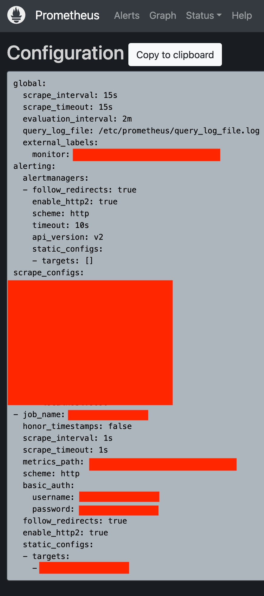
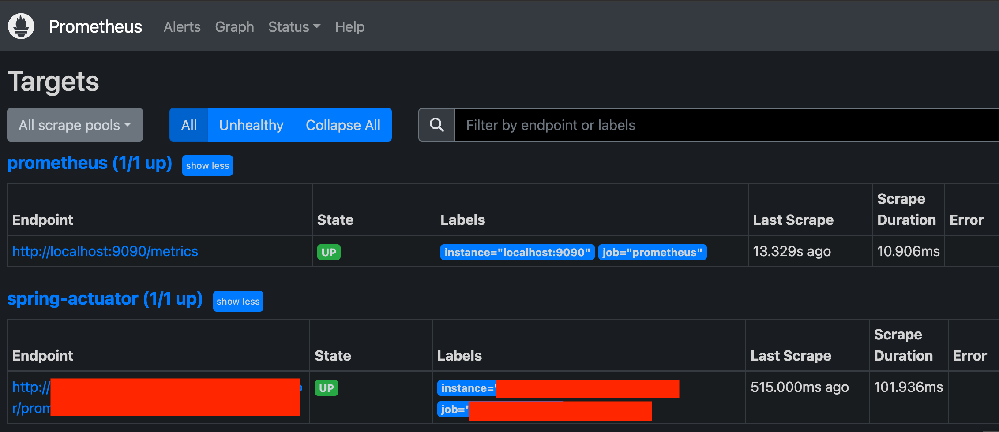
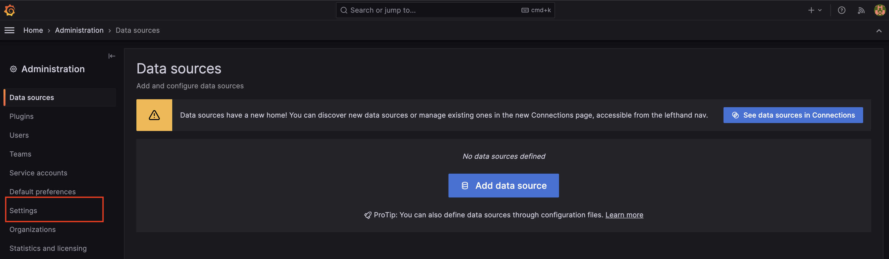
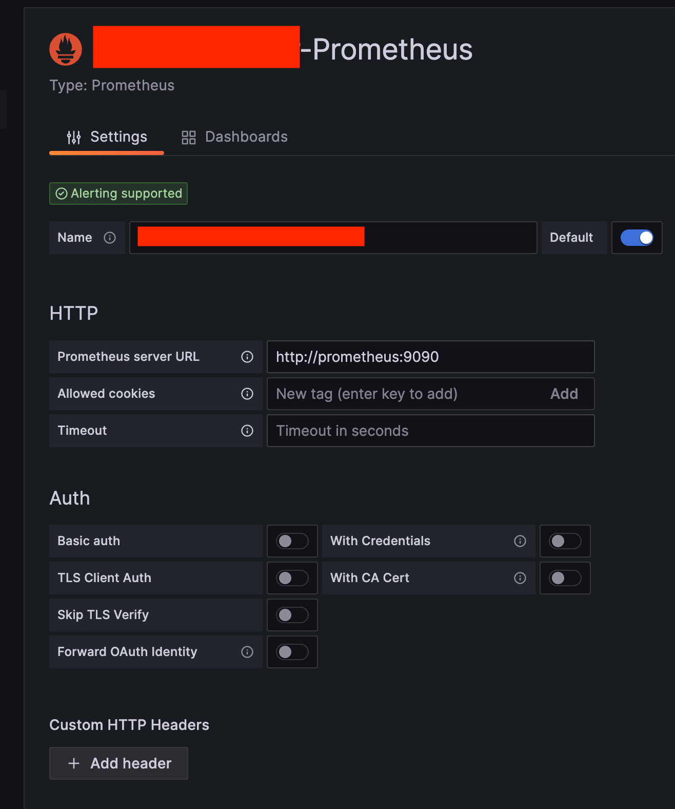

# 프로메테우스 + 그라파나 + 도커 + NCP

운영중인 서버의 모니터링을 위해, 프로메테우스 + 그라파나를 이용해서 메트릭을 수집하고 모니터링 하기 위한 설정 방법에 대해 정리합니다.

**환경**

* kotlin

* SpringBoot 2.7.5 
* Spring actuator, Security with Jwt Auth & Basic Auth
* docker, docker-compose

* NCP ubuntu 18 linux 

## 의존성 추가

```kotlin
plugins {
	id("org.springframework.boot") version "2.7.4"
	id("io.spring.dependency-management") version "1.0.14.RELEASE"
	kotlin("jvm") version "1.6.21"
	kotlin("plugin.spring") version "1.6.21"
	kotlin("kapt") version "1.7.10"
	idea
}


dependencies {
	...
  implementation 'org.springframework.boot:spring-boot-starter-web'
	implementation("org.springframework.boot:spring-boot-starter-actuator")
	implementation("org.springframework.boot:spring-boot-starter-security")
  implementation("io.micrometer:micrometer-registry-prometheus") 
  ...
}
```

### application.yml 설정

```yml
spring:
  config:
    activate:
      on-profile: develop # develop profile

management:
  endpoints:
    web:
      exposure:
        include: "*" #  이 설정은 모든 Actuator 엔드포인트를 외부에 노출
      base-path: system/actuator # Actuator 엔드포인트의 기본 경로를 system/actuator로 지정
  server:
    port: 8090 # Actuator 엔드포인트가 서비스될 서버의 포트를 8090으로 지정
  endpoint:
    health:
      show-details: always # health 엔드포인트가 상세 정보를 항상 표시하도록 함

server:
  tomcat: #  tomcat 메트릭 설정 on. 톰캣 메트릭은 tomcat. 으로 시작
    mbeanregistry: # 톰캣 메트릭을 모두 사용하려면 다음 옵션을 켜야하며, 옵션을 켜지 않으면 tomcat.session. 관련정보만 노출됩니다
      enabled: true

actuator: # basic 인증에 사용하기 위한 커스텀 Properties
  user: ysk
  password: yskgood
  role-name: ACTUATOR
```

프로메테우스에서 scrape 할 때 basic auth를 사용합니다.

*  jwt 인증을 할 수도 있지만 설정의 간소화를 위해 basic auth를 사용했습니다.
* 프로메테우스의 다양한 scrape 인증 방법은 아래에 정리하였습니다.

> Basic auth란?- 기본 인증
>
> HTTP가 액세스 제어와 인증을 위한 프레임워크 중 가장 일반적인 방식
>
> 서버는 사용자가 누구인지 식별 할 수 있어야 함으로 authentication를 통하여 식별하여 접근 권한을 결정한다.
>
> http 호출 시 **Authorization 헤더**에 user id와 password를 **base64**로 인코딩한 문자열을 추가하여 인증하는 형식

## Spring Security 

현재 api 서버의 기본 인증방식은 jwt 입니다. 

때문에 basic auth를 위한 추가적인 security 설정이 필요합니다. 

Spring Security는 여러 FilterChain을 지원합니다. 여러 FilterChain을 사용하면 각기 다른 보안 정책을 다른 URL 패턴에 적용할 수 있습니다.

다중 설정을 위해 basic auth를 위해 추가적인 설정을 합니다.

```kotlin
@EnableGlobalMethodSecurity(prePostEnabled = true, proxyTargetClass = true)
@Configuration
@EnableWebSecurity
class WebSecurityConfig(
    private val actuatorProperties: ActuatorProperties,
  	private val passwordEncoder: PasswordEncoder
) {

    @Bean
    @Order(0) // jwt 인증을 위한 Security FilterChain 설정
    fun apiSecurity(http: HttpSecurity): SecurityFilterChain {
        http.httpBasic().disable()
            .cors().and()
            .csrf().disable()
            .sessionManagement().sessionCreationPolicy(SessionCreationPolicy.STATELESS)
            .and()
      
            .authorizeRequests()
            .antMatchers("/api/**").hasAnyAuthority(...)) // here
            .anyRequest().authenticated()
      
            .and()
            .addFilterBefore(
                JwtAuthenticationFilter(authService),
                UsernamePasswordAuthenticationFilter::class.java
            )
						
      			...

        return http.build()
    }

    @Bean
    @Order(1) // basic auth를 위한 Security Filter chain 설정
    fun actuatorSecurity(http: HttpSecurity, passwordEncoder: PasswordEncoder) : SecurityFilterChain {
        http
            .requestMatchers().antMatchers("/system/actuator/**")
            .and()
            .httpBasic()
            .and().userDetailsService(userDetailsService(passwordEncoder))
            .cors().and()
            .csrf().disable()
            .sessionManagement().sessionCreationPolicy(SessionCreationPolicy.STATELESS)
            .and()
            .authorizeRequests()
            .antMatchers("/api/system/actuator/**").hasRole(actuatorProperties.roleName)

            .anyRequest().denyAll()

        return http.build()
    }

    fun userDetailsService(): UserDetailsService { // basic auth를 위한 UserDetailsService
        val user = User.withUsername(actuatorProperties.user)
            .password(passwordEncoder.encode(actuatorProperties.password))
            .roles(actuatorProperties.roleName)
            .build()

        return InMemoryUserDetailsManager(user)
    }
		
  ...
}

//
@ConstructorBinding
@ConfigurationProperties(prefix = "actuator") // application.yml에 설정된 값을 읽어 바인딩
data class ActuatorProperties(
    val user: String,
    val password : String,
    val roleName: String,
) {
}
```

* Spring의 `@Order` 어노테이션은 특정 타입의 빈들이 여러 개 있을 경우 어떤 순서로 처리될지를 정의합니다. 이 어노테이션은 빈들 간의 실행 순서를 지정하는데 사용됩니다.
  * `@Order(number)`는 . 숫자가 작을 수록 우선순위가 높고, 필터 체인 리스트에 들어가는 순서가 됩니다
* @Order(0) - apiSecurity: 제일 높은 우선순위이며 jwt 인증을 위한 filterchain입니다.
  * , `/api/**` endpoint로 들어오는 요청을 해당 filterchain이 인증 / 인가처리합니다
* @Order(1) - actuatorSecurity : 다음 우선순위이며 basic auth 인증을 위한 filterchain입니다, 
  *  `/system/actuator/**` 로 들어오는 요청을 해당 filterchain이 인증/ 인가처리합니다. 

> ```null
> @Order(0) apiSecurity : .antMatchers("/api/**")
> @Order(1) actuatorSecurity : .antMatchers("/system/actuator/**")
> 
> 1. `/api/**`으로 접속 -> apiSecurity FilterChain 실행
> 2. `/system/actuator/**`으로 접속 -> actuatorSecurity FilterChain 실행
> ```


application.yml에 설정한 값으로 basic auth를 처리하도록 하였습니다.

해당 property는 ActuatorProperties class에 바인딩됩니다. 

* 보안을 위해 다른 방법이 많으나, basic auth 간소화를 위함입니다.

```yaml
actuator: # basic 인증에 사용하기 위한 커스텀 Properties
  user: ysk
  password: yskgood
  role-name: ACTUATOR
```


이제 /api/** 로 오는 요청들은 해당 filterchain이 jwt 인증을 처리하며, basic auth로는 인증이 되지 않습니다.

/system/actuator로 오는 요청들은 해당 filterchain이 basic auth 인증을 처리하며, jwt auth로는 인증이 되지 않습니다. 


다음은 클라우드 (Naver Cloud Platform)의 Server instance 에서 도커를 설치하고, docker-compose 파일 작성입니다.

# Docker-compose 파일 작성

Prometheus, grafana를 Docker에 설치하기 위해 docker-compose.yml, 파일 및 디렉토리를 구성해야 합니다.

```yml
version: '3.3'  # 파일 규격 버전
services:       # 이 항목 밑에 실행하려는 컨테이너 들을 정의
  prometheus:
    image: prom/prometheus
    container_name: prometheus
    volumes:
      - ./prometheus/config:/etc/prometheus
      - ./prometheus/volume:/prometheus
    ports:
      - 9090:9090 # 접근 포트 설정 (컨테이너 외부:컨테이너 내부)
    command: # web.enalbe-lifecycle은 api 재시작없이 설정파일들을 reload 할 수 있게 해줌
      - '--web.enable-lifecycle'
      - '--config.file=/etc/prometheus/prometheus.yml'
    restart: always
    networks:
      - promnet

  grafana:
    image: grafana/grafana
    container_name: grafana
    # user: "$GRA_UID:$GRA_GID"
    ports:
      - 3000:3000 # 접근 포트 설정 (컨테이너 외부:컨테이너 내부)
    volumes:
      - ./grafana/volume:/var/lib/grafana
      - ./grafana/provisioning/:/etc/grafana/provisioning/
    restart: always
    networks:
      - promnet
    depends_on:
      - prometheus

networks:
  promnet:
    driver: bridge
```

- Prometheus DockerHub image
  - https://hub.docker.com/r/prom/prometheus
- Prometheus의 저장 디렉토리는 `./prometheus/volume`으로 지정하였습니다.
- Prometheus의 설정 디렉토리는 `./prometheus/config`으로 지정하였습니다.

최종 파일을 다 생성하면 아래와 같은 구조가 됩니다.

```zsh
.
├── docker-compose.yml
└── prometheus
    └── config
        ├── prometheus.yml
        └── rule.yml
```

1. `/prometheus` 디렉토리의 권한을 docker에서 수정할 수 있도록 변경합니다.

```zsh
sudo chmod -R 777 ./prometheus
```

저는 로컬에서  디렉토리와 파일을 만들어 전송하였습니다.

```shell
 scp -P [포트번호] -r [디렉토리이름] 사용자@IP:서버의 디렉토리 위치
```

다음 프로메테우스 설정 파일을 작성해보겠습니다.

# 프로메테우스 설정파일 작성

프로메테우스는 prometheus/config/prometheus.yml 설정 파일을 읽어 동작합니다. 

* https://prometheus.io/docs/prometheus/latest/configuration/configuration

주석때문에 복잡해보이지만 어렵지 않습니다.

prometheus.yml

```yaml
global:
  scrape_interval: 15s     # scrap target의 기본 interval을 15초로 변경 / default = 1m
  scrape_timeout: 15s      # scrap request 가 timeout waite/ default = 10s

  external_labels:
    monitor: 'ysk-monitor'       # 기본적으로 붙여줄 라벨
  query_log_file: query_log_file.log # prometheus의 쿼리 로그들을 기록. 설정되지않으면 기록하지않는다.

# 매트릭을 수집할 엔드포인드로 여기선 Prometheus 서버 자신을 가리킨다.
scrape_configs:
 
 # 이 설정에서 수집한 타임시리즈에 `job=<job_name>`으로 잡의 이름을 설정.
 # metrics_path의 기본 경로는 '/metrics'이고 scheme의 기본값은 `http`다

  # 여기를 추가! 
  - job_name: "spring-actuator" # job_name 은 모든 scrap 내에서 고유해야한다
    metrics_path: '/system/actuator/prometheus' # 스프링부트에서 설정한 endpoint
    scrape_interval: 15s # global에서 default 값을 정의해주었기 떄문에 안써도 된다. 
    scheme: 'http'            # request를 보낼 scheme 설정 | default = http
    static_configs:
      - targets: ['서버주소:8090'] # request를 보낼 server ip 그리고 actuator port를 적어주면 된다.
    basic_auth:
      username: 'ysk'
      password: 'yskgood'
```

* job_name : 수집하는 이름이다. 임의의 이름을 사용하면 됩니다.
* metrics_path : 수집할 경로를 지정.
* scrape_interval : 수집할 주기를 설정.
* targets : 수집할 서버의 IP, PORT를 지정.

> 외에도 알림, rule 등 다양한 설정을 할 수 있습니다.

## 프로메테우스의 수집 요청시 다양한 인증방법

Prometheus에서 원격 시스템 (ex actuator)에서 scrape 하는 방식에 대한 인증 설정은 다음과 같이 다양합니다.

* Prometheus의 HTTP 인증 설정 : https://prometheus.io/docs/prometheus/latest/configuration/configuration/#scrape_config
* Prometheus의 Configuration 문서: https://prometheus.io/docs/prometheus/latest/configuration/configuration/

> VPN, VPC을 이용한 내부망으로 호출할 수도 있습니다.

1. none auth : 인증방식 없이 호출합니다. 이러면 endpoint가 노출되서 위험합니다.
2. basic auth
3. bearer token 
4. authorization
5. oauth2
6. tlsconfig

### basic auth

`basic_auth`: 기본 인증을 설정하는 방법으로, `username`과 `password` 또는 비밀번호가 저장된 파일인 `password_file`을 제공하여 사용할 수 있습니다.

```yaml
basic_auth:
  [ username: <string> ]
  [ password: <secret> ]
  [ password_file: <filename> ] // 또는 이렇게 설정
```

### bearer token - with jwt

`bearer_token` 또는 `bearer_token_file`: Bearer 토큰을 설정하는 방법으로, 일반적으로 JWT와 같은 토큰 기반 인증에 사용됩니다. `bearer_token`에 직접 토큰을 제공하거나 `bearer_token_file`를 통해 토큰이 저장된 파일을 지정할 수 있습니다.

```yaml
[ bearer_token: <secret> ]
[ bearer_token_file: <filename> ]
```

ex)

```yaml
...

scrape_configs:
  - job_name: 'test'
      metrics_path: "/metrics"
      scheme: "http"
      bearer_token_file: /var/run/secrets/    OR   bearer_token: token_here
    static_configs:
 			 - targets: ['host.com']
```

### authorization

`authorization`: 모든 스크랩 요청에 `Authorization` 헤더를 설정합니다. 토큰 유형 및 크리덴셜(토큰 값 또는 토큰 파일)을 설정할 수 있습니다.

```yaml
authorization:
  [ type: <string> | default: Bearer ]
  [ credentials: <secret> ]
  [ credentials_file: <filename> ]
```

### oauth

`oauth2`: OAuth 2.0을 사용하여 인증을 설정하는 경우에 사용됩니다. 이는 client_id, client_secret, token_url 등 다양한 OAuth 2.0 관련 설정을 제공해야 합니다.

```yaml
oauth2:
  client_id: <string>
  client_secret: <string>
  token_url: <string>
  [ scope: <string> ]
  [ endpoint_params: { [<string>: <string>] } ]
```

### tls_config

`tls_config`: 이 섹션은 TLS를 사용하여 인증을 수행하는 경우에 사용됩니다.

```yaml
tls_config:
  [ ca_file: <filename> ]
  [ cert_file: <filename> ]
  [ key_file: <filename> ]
  # ... 추가 설정은 가능합니다.
```

주의할점은 위의 방법들 중 일부는 서로 동시에 사용할 수 없습니다. 

예를 들어, `basic_auth`와 `authorization` 설정은 동시에 사용할 수 없습니다. 

설정하는 방식은 사용하려는 인증 방법에 따라 다르며, 각 설정에 대한 자세한 사항은 Prometheus의 공식 문서를 참고해서 볼 수 있습니다.


# docker-compose 프로메테우스 그라파나 실행

서버로 전송이 완료되면, docker-compose.yml 파일이 있는곳으로 이동하여  docker-compose 명령어로 실행합니다.

* 실행하기 전에 아래의 sudo chmod -r 777 명령어로 미리 권한을 변경해두면 좋습니다.
* 만약, 실행하기 전에 권한을 주지 않았다면, 권한을 주고 prometheus랑  grafana를 재시작해야 합니다.

```
docker-compose up -d 
```

주의사항은 반드시 `/prometheus` 디렉토리의 권한을 docker에서 수정할 수 있도록 변경해야 합니다.

* 미리 권한을 주는 다른 방법이 있지만, 현재는 이렇게 해야합니다.

```zsh
sudo chmod -R 777 ./prometheus
```

안그러면 권한때문에 오류가 나서 실행 안될수도 있습니다

```
docker ps
docker logs -f prometheus
```

명령어로 확인 가능합니다.    


그라파나도 마찬가지입니다

실행이 안된다면  `/grafana` 디렉토리의 권한을 docker에서 수정할 수 있도록 변경해야합니다.

```zsh
sudo chmod -R 777 ./grafana
```

안그러면 다음과 같은 오류가 나서 실행 안될수도 있습니다

```shell
> docker logs -f grafana

mkdir: can't create directory '/var/lib/grafana/plugins': Permission denied
GF_PATHS_DATA='/var/lib/grafana' is not writable.
You may have issues with file permissions, more information here: http://docs.grafana.org/installation/docker/#migrate-to-v51-or-later
```

권한을 주고나서 prometheus랑  grafana를 재시작해야 합니다.

```shell
docker stop prometheus
docker start promethues

//

docker stop grafana
docker start grafana
```

# 서버 접속

- Prometheus
  - http://서버주소:9090
  - 그라파나랑 연결해두고, 그라파나로만 모니터링 하며 프로메테우스 포트는 접속 못하게 닫아두는 것이 좋습니다.
  - 인증은 다르게 처리해야 합니다.
  - https://prometheus.io/docs/guides/basic-auth/
- Grafana
  - http://서버주소:3000
    - 기본 계정 ID/PW: admin/admin
  - 비밀번호를 변경할 수 있습니다.

## 프로메테우스 접속

* http://서버주소:9090/

프로메테우스 메뉴 ->  Status Configuration 에 들어가서 prometheus.yml 에 입력한 부분이 추가되어 있는지 확인하면 됩니다.

* http://서버주소:9090/config



* 보안을 위해 민감한 정보는 다 가렸으며, prometheus.yml에 작성한 내용들입니다.

프로메테우스 메뉴 Status Targets 에 들어가서 연동이 잘 되었는지 확인해봅시다.

* http://서버주소:포트번호/targets



* prometheus : 프로메테우스 자체에서 제공하는 메트릭 정보. (프로메테우스가 프로메테우스 자신의
  메트릭을 확인하는 것)
* spring-actuator : 우리가 연동한 애플리케이션의 메트릭 정보.
* State 가 UP 으로 되어 있으면 정상이고, DOWN 으로 되어 있으면 연동이 안된 것.

## 그라파나 접속

http://서버주소:3000

- 기본 계정 ID/PW: admin/admin

비밀번호를 변경

* http://서버Ip:3000/profile/password 에 접속


그라파나는 프로메테우스를 통해서 데이터를 조회하고 보여주는 역할을 합니다. 

* 그라파나는 대시보드의 껍데기 역할

**그라파나 데이터소스 추가 **

* http://localhost:3000/datasources 로 이동



* 왼쪽 하단에 있는 설정(Configuration) 버튼에서 Data sources를 선택.
* Add data source 를 선택.
* Prometheus를 선택.

**Prometheus 데이터 소스 설정**

* 설정한 url을 입력합니다. 현재 설정은 http://서버Ip:9090
* 특별히 고칠 부분이 없다면 그대로 두고 Save & test 를 선택

* Data source is working 이라는 문구가 나오면 성공

http 설정을 http://prometheus:9090 로 해야합니다. 도커로 실행했기 때문입니다.

```
http://prometheus:9090
```




이상으로 프로메테우스 & 그라파나 설정을 마치겠습니다.

추가적으로 메트릭 수집이 필요하다면 actuator와 promethues, grafana로 설정할 수 있습니다.

대시보드를 사용해서 시각화를 할 수 있는데

대시보드 -> new dashboard 선택후

보고싶은 데이터 쿼리를 입력하고 쿼리를 날려가면서 원하는 데이터가 조회되면 해당 대시보드를 사용하면됩니다.

* 그라파나 공유 대시보드에서 사용할 수 있습니다
* https://grafana.com/grafana/dashboards

또한 프로메테우스, 그라파나는 각 그래프마다 경보(Alert)을 설정할 수 있으며 이메일, 슬랙을 포함한 다양한 알림 방법을 제공합니다.

* 추후 다른 포스팅으로 정리할 예정입니다


개발자로써, 엔지니어로써, 프로메테우스와 그라파나와 같은 도구를 이용해 실시간으로 시스템을 모니터링 하며, 문제가 발생하면 즉시 대응할 수 있도록 대비해야 합니다.


> 전투에서 실패한 지휘관은 용서할 수 있지만 경계에서 실패하는 지휘관은 용서할 수 없다


### 참조

* https://www.devkuma.com/docs/prometheus/docker-compose-install/#google_vignette
* https://prometheus.io/docs/introduction/overview/
* https://grafana.com/

* 인프런 김영한님 강의 - Spring Boot